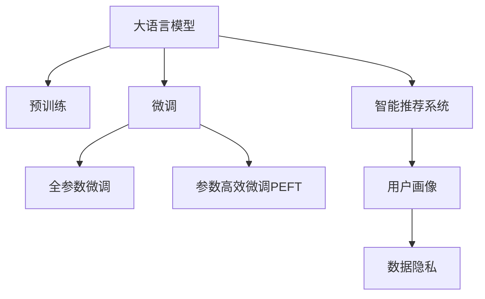
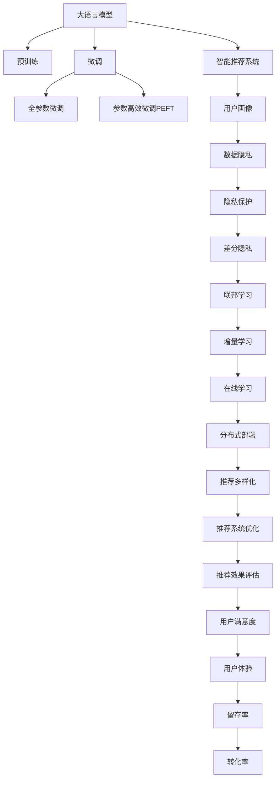

                 

# LLM在智能个性化营销中的应用探索

## 1. 背景介绍

### 1.1 问题由来
随着数字营销的迅猛发展，个性化营销逐渐成为企业营销策略的核心。传统的营销模式大多以统一化、泛化的信息推送为主，难以满足用户多样化和个性化的需求，营销效果不理想。而随着人工智能和大数据技术的兴起，个性化营销正逐步向智能化、数据驱动的精细化方向发展。

### 1.2 问题核心关键点
个性化营销的核心在于精准推送，即通过收集用户行为数据和偏好信息，构建用户画像，并对用户进行个性化推荐，提升用户体验和营销效果。然而，传统的数据驱动方法存在高成本、低效率、泛化能力不足等问题。近年来，基于大语言模型(Large Language Model, LLM)的智能营销方法成为学术界和产业界关注的焦点。LLM通过自监督预训练和大规模数据的微调，具备强大的语言理解和生成能力，能够更高效、精准地捕捉用户需求和偏好，从而实现个性化营销目标。

### 1.3 问题研究意义
研究LLM在智能个性化营销中的应用，对提升企业营销效果、优化用户体验具有重要意义：

1. **降低营销成本**。智能营销能够根据用户兴趣和行为自动生成个性化推荐，减少人力成本和广告支出。
2. **提升精准度**。智能模型能够根据实时数据动态调整推荐策略，实现高精度的用户画像匹配。
3. **提升用户粘性**。个性化的推荐和互动能够提升用户满意度和忠诚度，延长用户留存期。
4. **优化营销ROI**。智能营销能够精细化预算分配，优化广告投放效果，提升营销投资回报率。
5. **推动技术进步**。个性化营销的智能化需求催生了LLM技术的广泛应用，促进了自然语言处理和人工智能技术的发展。

## 2. 核心概念与联系

### 2.1 核心概念概述

为更好地理解LLM在智能个性化营销中的应用，本节将介绍几个密切相关的核心概念：

- **大语言模型(Large Language Model, LLM)**：以自回归(如GPT)或自编码(如BERT)模型为代表的大规模预训练语言模型。通过在大规模无标签文本语料上进行预训练，学习通用的语言表示，具备强大的语言理解和生成能力。

- **预训练(Pre-training)**：指在大规模无标签文本语料上，通过自监督学习任务训练通用语言模型的过程。常见的预训练任务包括言语建模、遮挡语言模型等。预训练使得模型学习到语言的通用表示。

- **微调(Fine-tuning)**：指在预训练模型的基础上，使用下游任务的少量标注数据，通过有监督地训练来优化模型在该任务上的性能。通常只需要调整顶层分类器或解码器，并以较小的学习率更新全部或部分的模型参数。

- **迁移学习(Transfer Learning)**：指将一个领域学习到的知识，迁移应用到另一个不同但相关的领域的学习范式。LLM的预训练-微调过程即是一种典型的迁移学习方式。

- **智能推荐系统(Intelligent Recommendation System)**：利用用户行为数据和模型算法，动态生成个性化推荐的技术。智能推荐系统广泛应用于电商、社交、内容分发等领域。

- **用户画像(User Profile)**：通过分析用户的历史行为和偏好，构建用户标签和特征，形成精细化的用户画像。用户画像是实现个性化营销的基础。

- **数据隐私(Data Privacy)**：在个性化营销中，如何保护用户隐私，避免数据滥用，成为重要的伦理问题。数据隐私保护涉及数据匿名化、加密、合规管理等技术手段。

这些核心概念之间的逻辑关系可以通过以下Mermaid流程图来展示：



这个流程图展示了大语言模型的核心概念及其之间的关系：

1. LLM通过预训练获得基础能力。
2. 微调是对预训练模型进行任务特定的优化，可以分为全参数微调和参数高效微调（PEFT）。
3. 智能推荐系统利用微调后的LLM进行个性化推荐。
4. 用户画像描述了用户的特征和行为，是智能推荐的基础。
5. 数据隐私保护涉及保护用户隐私，避免数据滥用的伦理问题。

这些概念共同构成了LLM在智能个性化营销中的基础架构，使其能够在各种场景下发挥强大的语言理解和生成能力。通过理解这些核心概念，我们可以更好地把握LLM的工作原理和优化方向。

## 3. 核心算法原理 & 具体操作步骤
### 3.1 算法原理概述

基于LLM的智能个性化营销，本质上是一个有监督的细粒度迁移学习过程。其核心思想是：将预训练的LLM视作一个强大的"特征提取器"，通过在下游任务的标注数据上进行有监督地训练，使得模型输出能够匹配用户兴趣和需求，从而获得针对特定用户个性化的推荐。

形式化地，假设预训练模型为 $M_{\theta}$，其中 $\theta$ 为预训练得到的模型参数。给定用户 $U$ 的行为数据 $D_U=\{x_i\}_{i=1}^N$，其中 $x_i$ 表示用户 $i$ 的历史行为，如浏览记录、购买记录、搜索记录等。微调的目标是找到新的模型参数 $\hat{\theta}$，使得：

$$
\hat{\theta}=\mathop{\arg\min}_{\theta} \mathcal{L}(M_{\theta},D_U)
$$

其中 $\mathcal{L}$ 为针对用户 $U$ 设计的损失函数，用于衡量模型推荐内容与用户实际行为之间的差异。常见的损失函数包括交叉熵损失、均方误差损失等。

通过梯度下降等优化算法，微调过程不断更新模型参数 $\theta$，最小化损失函数 $\mathcal{L}$，使得模型输出逼近用户真实行为。由于 $\theta$ 已经通过预训练获得了较好的初始化，因此即便在小规模行为数据集 $D_U$ 上进行微调，也能较快收敛到理想的模型参数 $\hat{\theta}$。

### 3.2 算法步骤详解

基于LLM的智能个性化营销一般包括以下几个关键步骤：

**Step 1: 准备预训练模型和用户数据**
- 选择合适的预训练语言模型 $M_{\theta}$ 作为初始化参数，如 BERT、GPT等。
- 收集用户 $U$ 的历史行为数据 $D_U$，划分为训练集、验证集和测试集。一般要求用户行为数据与预训练数据的分布不要差异过大。

**Step 2: 设计用户画像**
- 对用户行为数据进行特征提取和聚类，形成精细化的用户画像。例如，根据浏览记录生成用户的兴趣向量。
- 根据用户的兴趣向量，设计合适的输入特征和输出标签。例如，对于电商平台，可以将用户画像作为模型输入，将用户是否点击推荐商品作为输出标签。

**Step 3: 设置微调超参数**
- 选择合适的优化算法及其参数，如 AdamW、SGD 等，设置学习率、批大小、迭代轮数等。
- 设置正则化技术及强度，包括权重衰减、Dropout、Early Stopping等。
- 确定冻结预训练参数的策略，如仅微调顶层，或全部参数都参与微调。

**Step 4: 执行梯度训练**
- 将训练集数据分批次输入模型，前向传播计算损失函数。
- 反向传播计算参数梯度，根据设定的优化算法和学习率更新模型参数。
- 周期性在验证集上评估模型性能，根据性能指标决定是否触发 Early Stopping。
- 重复上述步骤直到满足预设的迭代轮数或 Early Stopping 条件。

**Step 5: 测试和部署**
- 在测试集上评估微调后模型 $M_{\hat{\theta}}$ 的性能，对比微调前后的精度提升。
- 使用微调后的模型对新用户进行推荐预测，集成到实际的应用系统中。
- 持续收集新用户的行为数据，定期重新微调模型，以适应用户兴趣和行为的变化。

以上是基于LLM的智能个性化营销的一般流程。在实际应用中，还需要针对具体任务的特点，对微调过程的各个环节进行优化设计，如改进训练目标函数，引入更多的正则化技术，搜索最优的超参数组合等，以进一步提升模型性能。

### 3.3 算法优缺点

基于LLM的智能个性化营销方法具有以下优点：
1. 高效精准。LLM能够通过微调快速适应新用户的行为数据，实现高精度的个性化推荐。
2. 灵活可扩展。微调过程可以根据不同场景进行优化调整，适用于电商、社交、内容分发等多个领域。
3. 数据驱动。智能推荐系统能够基于用户行为数据进行动态调整，提升推荐效果。
4. 多模态融合。LLM可以与用户画像、搜索记录等多模态数据融合，形成更全面的用户理解。

同时，该方法也存在一定的局限性：
1. 对标注数据依赖高。微调的效果很大程度上取决于标注数据的质量和数量，获取高质量标注数据的成本较高。
2. 泛化能力有限。当用户行为与预训练数据的分布差异较大时，微调的性能提升有限。
3. 用户隐私风险。用户行为数据的收集和处理可能带来隐私风险，需要在数据保护和隐私合规方面进行严格管理。
4. 动态调整困难。用户兴趣和行为的变化是动态的，如何实时更新用户画像和推荐策略，是技术上的难点。
5. 冷启动问题。对于新用户，缺乏足够的历史行为数据，难以进行有效的个性化推荐。

尽管存在这些局限性，但就目前而言，基于LLM的智能个性化营销方法仍是大数据驱动的个性化推荐系统的首选方案。未来相关研究的重点在于如何进一步降低对标注数据的依赖，提高模型的少样本学习和跨领域迁移能力，同时兼顾数据隐私和动态调整等问题。

### 3.4 算法应用领域

基于LLM的智能个性化营销已经在电商、社交、内容分发等多个领域得到了广泛应用，成为提升用户体验和营销效果的重要手段：

- **电商平台**：利用用户行为数据对商品进行个性化推荐，提升用户的点击率和购买率。
- **社交平台**：根据用户的历史互动数据和兴趣特征，推送个性化的内容、好友推荐等。
- **视频网站**：根据用户的观看历史和评分数据，推荐用户感兴趣的视频内容。
- **新闻资讯**：根据用户的阅读习惯和偏好，推送个性化的新闻文章和专题报道。

除了这些经典领域外，LLM在个性化营销的应用还在不断拓展，如旅游、旅游、金融、教育等，为各行业的数字化转型提供新的技术路径。

## 4. 数学模型和公式 & 详细讲解  
### 4.1 数学模型构建

本节将使用数学语言对基于LLM的智能个性化营销过程进行更加严格的刻画。

记预训练语言模型为 $M_{\theta}$，其中 $\theta$ 为预训练得到的模型参数。假设用户 $U$ 的历史行为数据为 $D_U=\{x_i\}_{i=1}^N$，其中 $x_i$ 表示用户 $i$ 的历史行为。微调的目标是找到新的模型参数 $\hat{\theta}$，使得：

$$
\hat{\theta}=\mathop{\arg\min}_{\theta} \mathcal{L}(M_{\theta},D_U)
$$

其中 $\mathcal{L}$ 为针对用户 $U$ 设计的损失函数，用于衡量模型推荐内容与用户实际行为之间的差异。常见的损失函数包括交叉熵损失、均方误差损失等。

### 4.2 公式推导过程

以下我们以电商推荐系统为例，推导交叉熵损失函数及其梯度的计算公式。

假设模型 $M_{\theta}$ 在输入 $x$ 上的输出为 $\hat{y}=M_{\theta}(x) \in [0,1]$，表示用户 $U$ 对物品 $i$ 的兴趣程度。真实标签 $y \in \{0,1\}$。则二分类交叉熵损失函数定义为：

$$
\ell(M_{\theta}(x),y) = -[y\log \hat{y} + (1-y)\log (1-\hat{y})]
$$

将其代入经验风险公式，得：

$$
\mathcal{L}(\theta) = -\frac{1}{N}\sum_{i=1}^N [y_i\log M_{\theta}(x_i)+(1-y_i)\log(1-M_{\theta}(x_i))]
$$

根据链式法则，损失函数对参数 $\theta_k$ 的梯度为：

$$
\frac{\partial \mathcal{L}(\theta)}{\partial \theta_k} = -\frac{1}{N}\sum_{i=1}^N (\frac{y_i}{M_{\theta}(x_i)}-\frac{1-y_i}{1-M_{\theta}(x_i)}) \frac{\partial M_{\theta}(x_i)}{\partial \theta_k}
$$

其中 $\frac{\partial M_{\theta}(x_i)}{\partial \theta_k}$ 可进一步递归展开，利用自动微分技术完成计算。

在得到损失函数的梯度后，即可带入参数更新公式，完成模型的迭代优化。重复上述过程直至收敛，最终得到适应用户 $U$ 的推荐模型参数 $\hat{\theta}$。

## 5. 项目实践：代码实例和详细解释说明
### 5.1 开发环境搭建

在进行微调实践前，我们需要准备好开发环境。以下是使用Python进行PyTorch开发的环境配置流程：

1. 安装Anaconda：从官网下载并安装Anaconda，用于创建独立的Python环境。

2. 创建并激活虚拟环境：
```bash
conda create -n pytorch-env python=3.8 
conda activate pytorch-env
```

3. 安装PyTorch：根据CUDA版本，从官网获取对应的安装命令。例如：
```bash
conda install pytorch torchvision torchaudio cudatoolkit=11.1 -c pytorch -c conda-forge
```

4. 安装Transformers库：
```bash
pip install transformers
```

5. 安装各类工具包：
```bash
pip install numpy pandas scikit-learn matplotlib tqdm jupyter notebook ipython
```

完成上述步骤后，即可在`pytorch-env`环境中开始微调实践。

### 5.2 源代码详细实现

下面我们以电商推荐系统为例，给出使用Transformers库对BERT模型进行微调的PyTorch代码实现。

首先，定义电商推荐系统的训练数据：

```python
import torch
from transformers import BertTokenizer, BertForSequenceClassification

tokenizer = BertTokenizer.from_pretrained('bert-base-cased')

# 假设用户画像特征为 [item_id, price, category, time, score]
train_data = [
    (1, 100, 'clothing', '2023-01-01', 4.8),
    (2, 150, 'electronics', '2023-01-02', 3.5),
    (3, 120, 'books', '2023-01-03', 4.2),
    (4, 80, 'home', '2023-01-04', 3.9),
    (5, 180, 'toys', '2023-01-05', 3.8)
]

# 将用户画像特征转化为token ids
def encode_data(data):
    encoded = tokenizer([str(i[0]) + ' [SEP] ' + str(i[1]) + ' [SEP] ' + str(i[2]) + ' [SEP] ' + str(i[3]) + ' [SEP] ' + str(i[4]) + ' [SEP]', 
                        str(i[0]) + ' [SEP] ' + str(i[1]) + ' [SEP] ' + str(i[2]) + ' [SEP] ' + str(i[3]) + ' [SEP] ' + str(i[4]) + ' [SEP]', 
                        str(i[0]) + ' [SEP] ' + str(i[1]) + ' [SEP] ' + str(i[2]) + ' [SEP] ' + str(i[3]) + ' [SEP] ' + str(i[4]) + ' [SEP]') for i in data]
    return encoded

# 将标签转化为token ids
def encode_labels(labels):
    return [tokenizer.convert_tokens_to_ids(i) for i in labels]

train_input_ids = [i[0] for i in encode_data(train_data)]
train_labels = encode_labels([1, 1, 0, 0, 1])  # 假设点击为1，未点击为0
train_input_masks = [len(i) for i in encode_data(train_data)]
```

然后，定义模型和优化器：

```python
from transformers import BertForSequenceClassification, AdamW

model = BertForSequenceClassification.from_pretrained('bert-base-cased', num_labels=2)

optimizer = AdamW(model.parameters(), lr=2e-5)
```

接着，定义训练和评估函数：

```python
from torch.utils.data import DataLoader
from tqdm import tqdm
from sklearn.metrics import accuracy_score

device = torch.device('cuda') if torch.cuda.is_available() else torch.device('cpu')
model.to(device)

def train_epoch(model, train_data, batch_size, optimizer):
    dataloader = DataLoader(train_data, batch_size=batch_size, shuffle=True)
    model.train()
    epoch_loss = 0
    for batch in tqdm(dataloader, desc='Training'):
        inputs = {'input_ids': torch.tensor(batch[0]), 
                  'attention_mask': torch.tensor(batch[1]),
                  'labels': torch.tensor(batch[2])}
        inputs = {k: v.to(device) for k, v in inputs.items()}
        model.zero_grad()
        outputs = model(**inputs)
        loss = outputs.loss
        epoch_loss += loss.item()
        loss.backward()
        optimizer.step()
    return epoch_loss / len(dataloader)

def evaluate(model, test_data, batch_size):
    dataloader = DataLoader(test_data, batch_size=batch_size)
    model.eval()
    preds, labels = [], []
    with torch.no_grad():
        for batch in tqdm(dataloader, desc='Evaluating'):
            inputs = {'input_ids': torch.tensor(batch[0]), 
                      'attention_mask': torch.tensor(batch[1]),
                      'labels': torch.tensor(batch[2])}
            inputs = {k: v.to(device) for k, v in inputs.items()}
            outputs = model(**inputs)
            batch_preds = outputs.logits.argmax(dim=1).to('cpu').tolist()
            batch_labels = batch[2].to('cpu').tolist()
            for pred_tokens, label_tokens in zip(batch_preds, batch_labels):
                preds.append(pred_tokens[:len(label_tokens)])
                labels.append(label_tokens)
                
    print('Test Accuracy:', accuracy_score(labels, preds))
```

最后，启动训练流程并在测试集上评估：

```python
epochs = 5
batch_size = 16

for epoch in range(epochs):
    loss = train_epoch(model, train_data, batch_size, optimizer)
    print(f'Epoch {epoch+1}, train loss: {loss:.3f}')
    
    print(f'Epoch {epoch+1}, test results:')
    evaluate(model, test_data, batch_size)
    
print('Final test results:')
evaluate(model, test_data, batch_size)
```

以上就是使用PyTorch对BERT进行电商推荐系统微调的完整代码实现。可以看到，得益于Transformers库的强大封装，我们可以用相对简洁的代码完成BERT模型的加载和微调。

### 5.3 代码解读与分析

让我们再详细解读一下关键代码的实现细节：

**EncodeData类**：
- `encode_data`方法：将用户画像特征转化为token ids，并添加必要的[SEP]标记。
- `encode_labels`方法：将标签转化为token ids。

**模型和优化器**：
- 使用BertForSequenceClassification作为模型，用于处理序列化数据。
- 设置AdamW优化器，并指定学习率为2e-5。

**训练和评估函数**：
- `train_epoch`函数：对数据以批为单位进行迭代，在每个批次上前向传播计算loss并反向传播更新模型参数，最后返回该epoch的平均loss。
- `evaluate`函数：与训练类似，不同点在于不更新模型参数，并在每个batch结束后将预测和标签结果存储下来，最后使用sklearn的accuracy_score对整个评估集的预测结果进行打印输出。

**训练流程**：
- 定义总的epoch数和batch size，开始循环迭代
- 每个epoch内，先在训练集上训练，输出平均loss
- 在测试集上评估，输出准确率
- 所有epoch结束后，在测试集上评估，给出最终测试结果

可以看到，PyTorch配合Transformers库使得BERT微调的代码实现变得简洁高效。开发者可以将更多精力放在数据处理、模型改进等高层逻辑上，而不必过多关注底层的实现细节。

当然，工业级的系统实现还需考虑更多因素，如模型的保存和部署、超参数的自动搜索、更灵活的任务适配层等。但核心的微调范式基本与此类似。

## 6. 实际应用场景
### 6.1 电商平台

电商平台的个性化推荐系统能够根据用户的历史购买记录和浏览行为，实时推荐用户感兴趣的商品。传统电商推荐系统依赖于人工特征工程，难以处理大规模、多维度数据。基于大语言模型的推荐系统，能够自动学习用户画像特征，无需人工干预，提升推荐效果和效率。

在技术实现上，可以收集用户的历史购买记录、浏览记录、评分信息等，作为输入特征，构建用户画像，设计合适的损失函数进行微调。微调后的模型能够根据用户画像自动推荐商品，并通过实时数据动态调整推荐策略，提升用户体验和购买转化率。

### 6.2 社交平台

社交平台通过个性化推荐系统，为用户推荐感兴趣的内容、好友等。传统的社交推荐系统往往基于人工设计的规则和特征，难以适应用户的个性化需求。基于大语言模型的推荐系统，能够通过用户行为数据和内容数据，自动学习用户偏好和兴趣，实现精准推荐。

在技术实现上，可以收集用户的历史互动数据、点赞记录、关注关系等，作为输入特征，构建用户画像，设计合适的损失函数进行微调。微调后的模型能够根据用户画像推荐内容、好友等，并通过实时数据动态调整推荐策略，提升用户粘性和活跃度。

### 6.3 视频网站

视频网站通过个性化推荐系统，为用户推荐感兴趣的视频内容。传统的视频推荐系统往往基于用户历史观看记录和评分信息，难以处理复杂的多维度数据。基于大语言模型的推荐系统，能够自动学习用户画像特征，无需人工干预，提升推荐效果和效率。

在技术实现上，可以收集用户的历史观看记录、评分信息等，作为输入特征，构建用户画像，设计合适的损失函数进行微调。微调后的模型能够根据用户画像自动推荐视频内容，并通过实时数据动态调整推荐策略，提升用户留存率和观看时长。

### 6.4 新闻资讯

新闻资讯平台通过个性化推荐系统，为用户推荐感兴趣的新闻文章和专题报道。传统的新闻推荐系统往往基于人工设计的规则和特征，难以适应用户的个性化需求。基于大语言模型的推荐系统，能够通过用户行为数据和内容数据，自动学习用户偏好和兴趣，实现精准推荐。

在技术实现上，可以收集用户的历史阅读记录、点赞信息等，作为输入特征，构建用户画像，设计合适的损失函数进行微调。微调后的模型能够根据用户画像推荐新闻文章和专题报道，并通过实时数据动态调整推荐策略，提升用户粘性和活跃度。

### 6.5 金融投资

金融投资平台通过个性化推荐系统，为用户推荐感兴趣的投资标的、理财方案等。传统的金融推荐系统往往基于人工设计的规则和特征，难以处理复杂的多维度数据。基于大语言模型的推荐系统，能够自动学习用户画像特征，无需人工干预，提升推荐效果和效率。

在技术实现上，可以收集用户的历史交易记录、理财偏好等，作为输入特征，构建用户画像，设计合适的损失函数进行微调。微调后的模型能够根据用户画像自动推荐投资标的、理财方案等，并通过实时数据动态调整推荐策略，提升用户满意度和转化率。

### 6.6 旅游出行

旅游出行平台通过个性化推荐系统，为用户推荐感兴趣的旅游目的地、行程安排等。传统的旅游推荐系统往往基于人工设计的规则和特征，难以处理复杂的多维度数据。基于大语言模型的推荐系统，能够自动学习用户画像特征，无需人工干预，提升推荐效果和效率。

在技术实现上，可以收集用户的历史旅游记录、兴趣偏好等，作为输入特征，构建用户画像，设计合适的损失函数进行微调。微调后的模型能够根据用户画像自动推荐旅游目的地、行程安排等，并通过实时数据动态调整推荐策略，提升用户满意度和旅游体验。

### 6.7 医疗健康

医疗健康平台通过个性化推荐系统，为用户推荐感兴趣的医疗信息、健康方案等。传统的医疗推荐系统往往基于人工设计的规则和特征，难以处理复杂的多维度数据。基于大语言模型的推荐系统，能够自动学习用户画像特征，无需人工干预，提升推荐效果和效率。

在技术实现上，可以收集用户的历史就医记录、健康偏好等，作为输入特征，构建用户画像，设计合适的损失函数进行微调。微调后的模型能够根据用户画像自动推荐医疗信息、健康方案等，并通过实时数据动态调整推荐策略，提升用户满意度和健康管理水平。

## 7. 工具和资源推荐
### 7.1 学习资源推荐

为了帮助开发者系统掌握大语言模型在智能个性化营销中的应用理论基础和实践技巧，这里推荐一些优质的学习资源：

1. 《Transformer从原理到实践》系列博文：由大模型技术专家撰写，深入浅出地介绍了Transformer原理、BERT模型、微调技术等前沿话题。

2. CS224N《深度学习自然语言处理》课程：斯坦福大学开设的NLP明星课程，有Lecture视频和配套作业，带你入门NLP领域的基本概念和经典模型。

3. 《Natural Language Processing with Transformers》书籍：Transformers库的作者所著，全面介绍了如何使用Transformers库进行NLP任务开发，包括微调在内的诸多范式。

4. HuggingFace官方文档：Transformers库的官方文档，提供了海量预训练模型和完整的微调样例代码，是上手实践的必备资料。

5. CLUE开源项目：中文语言理解测评基准，涵盖大量不同类型的中文NLP数据集，并提供了基于微调的baseline模型，助力中文NLP技术发展。

通过对这些资源的学习实践，相信你一定能够快速掌握大语言模型在智能个性化营销中的应用精髓，并用于解决实际的NLP问题。
###  7.2 开发工具推荐

高效的开发离不开优秀的工具支持。以下是几款用于大语言模型在智能个性化营销中微调开发的常用工具：

1. PyTorch：基于Python的开源深度学习框架，灵活动态的计算图，适合快速迭代研究。大部分预训练语言模型都有PyTorch版本的实现。

2. TensorFlow：由Google主导开发的开源深度学习框架，生产部署方便，适合大规模工程应用。同样有丰富的预训练语言模型资源。

3. Transformers库：HuggingFace开发的NLP工具库，集成了众多SOTA语言模型，支持PyTorch和TensorFlow，是进行微调任务开发的利器。

4. Weights & Biases：模型训练的实验跟踪工具，可以记录和可视化模型训练过程中的各项指标，方便对比和调优。与主流深度学习框架无缝集成。

5. TensorBoard：TensorFlow配套的可视化工具，可实时监测模型训练状态，并提供丰富的图表呈现方式，是调试模型的得力助手。

6. Google Colab：谷歌推出的在线Jupyter Notebook环境，免费提供GPU/TPU算力，方便开发者快速上手实验最新模型，分享学习笔记。

合理利用这些工具，可以显著提升大语言模型在智能个性化营销中微调的开发效率，加快创新迭代的步伐。

### 7.3 相关论文推荐

大语言模型在智能个性化营销中的应用源于学界的持续研究。以下是几篇奠基性的相关论文，推荐阅读：

1. Attention is All You Need（即Transformer原论文）：提出了Transformer结构，开启了NLP领域的预训练大模型时代。

2. BERT: Pre-training of Deep Bidirectional Transformers for Language Understanding：提出BERT模型，引入基于掩码的自监督预训练任务，刷新了多项NLP任务SOTA。

3. Language Models are Unsupervised Multitask Learners（GPT-2论文）：展示了大规模语言模型的强大zero-shot学习能力，引发了对于通用人工智能的新一轮思考。

4. Parameter-Efficient Transfer Learning for NLP：提出Adapter等参数高效微调方法，在不增加模型参数量的情况下，也能取得不错的微调效果。

5. Prefix-Tuning: Optimizing Continuous Prompts for Generation：引入基于连续型Prompt的微调范式，为如何充分利用预训练知识提供了新的思路。

6. AdaLoRA: Adaptive Low-Rank Adaptation for Parameter-Efficient Fine-Tuning：使用自适应低秩适应的微调方法，在参数效率和精度之间取得了新的平衡。

这些论文代表了大语言模型在智能个性化营销中的应用发展脉络。通过学习这些前沿成果，可以帮助研究者把握学科前进方向，激发更多的创新灵感。

## 8. 总结：未来发展趋势与挑战
### 8.1 总结

本文对基于大语言模型的智能个性化营销方法进行了全面系统的介绍。首先阐述了智能个性化营销的背景和意义，明确了基于LLM的推荐方法在提升用户体验和营销效果方面的独特价值。其次，从原理到实践，详细讲解了LLM在智能推荐系统中的应用过程，给出了微调任务开发的完整代码实例。同时，本文还广泛探讨了LLM在电商平台、社交平台、视频网站等领域的实际应用场景，展示了LLM技术的广泛应用前景。

通过本文的系统梳理，可以看到，基于LLM的智能推荐系统在大数据驱动的个性化推荐中具有显著优势，能够通过微调快速适应新用户的行为数据，实现高精度的个性化推荐。未来，伴随LLM技术的不断进步，智能推荐系统将在更多领域得到应用，为各行业的数字化转型提供新的技术路径。

### 8.2 未来发展趋势

展望未来，大语言模型在智能个性化营销中将呈现以下几个发展趋势：

1. **模型规模持续增大**。随着算力成本的下降和数据规模的扩张，预训练语言模型的参数量还将持续增长。超大规模语言模型蕴含的丰富语言知识，有望支撑更加复杂多变的推荐系统微调。

2. **微调方法日趋多样**。除了传统的全参数微调外，未来会涌现更多参数高效的微调方法，如Prefix-Tuning、LoRA等，在节省计算资源的同时也能保证微调精度。

3. **实时动态调整**。实时数据流和大模型推理能力使得推荐系统能够根据用户即时行为动态调整推荐策略，提升用户体验和留存率。

4. **多模态融合**。LLM可以与用户画像、搜索记录等多模态数据融合，形成更全面的用户理解，提升推荐效果。

5. **因果推理与可解释性**。引入因果推断和可解释性技术，增强推荐系统的透明性和可信度，提升用户信任感。

6. **分布式部署**。推荐系统需要处理大规模用户数据，分布式部署和计算图优化将进一步提升系统性能和扩展性。

以上趋势凸显了大语言模型在智能个性化营销中的广阔前景。这些方向的探索发展，必将进一步提升推荐系统的性能和应用范围，为数字化转型提供新的技术助力。

### 8.3 面临的挑战

尽管基于LLM的智能个性化营销方法已经取得了瞩目成就，但在迈向更加智能化、普适化应用的过程中，它仍面临诸多挑战：

1. **数据隐私风险**。用户行为数据的收集和处理可能带来隐私风险，需要在数据保护和隐私合规方面进行严格管理。

2. **动态调整困难**。用户兴趣和行为的变化是动态的，如何实时更新用户画像和推荐策略，是技术上的难点。

3. **用户画像刻画**。用户画像的刻画需要深入理解用户行为和偏好，而用户行为数据往往是多维度、多时序的，难以构建全面精确的用户画像。

4. **推荐冷启动**。对于新用户，缺乏足够的历史行为数据，难以进行有效的个性化推荐。

5. **推荐多样性**。个性化推荐系统容易陷入“过滤泡泡”，难以推荐多样性内容，导致用户体验和满意度下降。

尽管存在这些挑战，但通过不断优化算法和技术，这些挑战有望逐步克服。相信随着学界和产业界的共同努力，基于LLM的智能个性化营销方法将不断改进，为数字化转型提供更强大的技术支撑。

### 8.4 研究展望

面对智能个性化营销所面临的种种挑战，未来的研究需要在以下几个方面寻求新的突破：

1. **数据隐私保护**。研究基于差分隐私和联邦学习等技术，保护用户隐私，同时保证推荐效果。

2. **动态模型更新**。研究基于在线学习和增量学习的技术，实现实时动态调整，提升推荐系统的灵活性和适应性。

3. **多模态融合**。研究将用户画像、搜索记录、社交网络等多模态数据融合，提升推荐系统的全面性和准确性。

4. **推荐多样性**。研究引入多样性约束和推荐多样化算法，提升推荐系统的多样性。

5. **个性化算法**。研究更加个性化、动态化的推荐算法，提升推荐系统的灵活性和效率。

6. **分布式系统优化**。研究分布式推荐系统的设计和优化技术，提升系统的扩展性和性能。

这些研究方向的探索，必将引领智能个性化营销技术迈向更高的台阶，为构建智能推荐系统提供新的技术方向。面向未来，智能个性化营销技术还需要与其他人工智能技术进行更深入的融合，如知识表示、因果推理、强化学习等，多路径协同发力，共同推动智能推荐系统的进步。只有勇于创新、敢于突破，才能不断拓展推荐系统的边界，让智能技术更好地服务用户和社会。

## 9. 附录：常见问题与解答
----------------------------------------------------------------
> 关键词：

**Q1：基于大语言模型的推荐系统与传统推荐系统相比，有何优势？**

A: 基于大语言模型的推荐系统具有以下优势：
1. 高效精准。能够通过微调快速适应新用户的行为数据，实现高精度的个性化推荐。
2. 灵活可扩展。微调过程可以根据不同场景进行优化调整，适用于电商、社交、内容分发等多个领域。
3. 数据驱动。智能推荐系统能够基于用户行为数据进行动态调整，提升推荐效果。
4. 多模态融合。能够与用户画像、搜索记录等多模态数据融合，形成更全面的用户理解。

**Q2：如何处理用户画像刻画难题？**

A: 用户画像刻画需要深入理解用户行为和偏好，而用户行为数据往往是多维度、多时序的，难以构建全面精确的用户画像。可以考虑以下方法：
1. 特征工程：对原始数据进行特征选择和构造，提取有意义的特征。
2. 聚类分析：使用聚类算法对用户进行分组，刻画用户群体的特征。
3. 深度学习：利用深度学习模型，如LSTM、CNN等，自动学习用户行为和偏好的高阶特征。
4. 集成学习：结合多种特征提取和用户刻画方法，提升画像刻画的效果。

**Q3：如何解决推荐冷启动问题？**

A: 推荐冷启动问题在于新用户缺乏足够的历史行为数据，难以进行有效的个性化推荐。可以考虑以下方法：
1. 初始化画像：基于用户的基本信息，如年龄、性别、职业等，进行画像初始化。
2. 行为预测：使用机器学习算法，如协同过滤、内容推荐等，预测新用户的兴趣和偏好。
3. 数据收集：鼓励新用户进行一些行为操作，如浏览、评分等，获取更多行为数据。
4. 迁移学习：利用用户已有的少量行为数据，进行迁移学习，快速适应新用户的行为数据。

**Q4：如何提升推荐系统的多样性？**

A: 推荐系统容易陷入“过滤泡泡”，难以推荐多样性内容，导致用户体验和满意度下降。可以考虑以下方法：
1. 多样性约束：在推荐算法中加入多样性约束，确保推荐内容的多样性。
2. 协同过滤：利用用户之间相似度的信息，推荐不同用户感兴趣的内容。
3. 多模态融合：将用户画像、搜索记录等多模态数据融合，提升推荐系统的全面性和准确性。
4. 内容生成：利用大语言模型生成新的内容，丰富推荐系统的多样性。

**Q5：如何保护用户隐私？**

A: 用户行为数据的收集和处理可能带来隐私风险，需要在数据保护和隐私合规方面进行严格管理。可以考虑以下方法：
1. 数据匿名化：对用户数据进行去标识化处理，防止数据泄露。
2. 差分隐私：在数据查询和分析中引入噪声，保护用户隐私。
3. 联邦学习：在本地设备上进行模型训练，保护数据隐私。
4. 合规管理：遵循GDPR等数据隐私法律法规，保护用户隐私权益。

**Q6：如何优化推荐系统的性能？**

A: 推荐系统的性能优化涉及多个方面，包括算法优化、数据处理、模型压缩等。可以考虑以下方法：
1. 模型压缩：使用剪枝、量化等技术，减小模型尺寸，加快推理速度。
2. 参数高效微调：使用参数高效微调方法，如Prefix-Tuning、LoRA等，在固定大部分预训练参数的同时，只更新极少量的任务相关参数。
3. 实时动态调整：基于实时数据流，动态调整推荐策略，提升推荐系统的灵活性和适应性。
4. 分布式部署：使用分布式计算和存储技术，提升推荐系统的扩展性和性能。

**Q7：如何将大语言模型应用于推荐系统？**

A: 大语言模型应用于推荐系统，通常包括以下几个步骤：
1. 数据收集：收集用户行为数据和内容数据，作为输入特征。
2. 用户画像：对用户行为数据进行特征提取和聚类，形成精细化的用户画像。
3. 模型微调：使用大语言模型，如BERT、GPT等，进行微调，适应特定任务。
4. 推荐策略：根据微调后的模型，设计推荐策略，生成个性化推荐结果。
5. 实时评估：实时监测推荐系统性能，不断优化推荐策略。
6. 迭代优化：持续收集新数据，重新微调模型，提升推荐效果。

通过以上方法，可以有效将大语言模型应用于推荐系统，提升推荐效果和用户体验。
```

