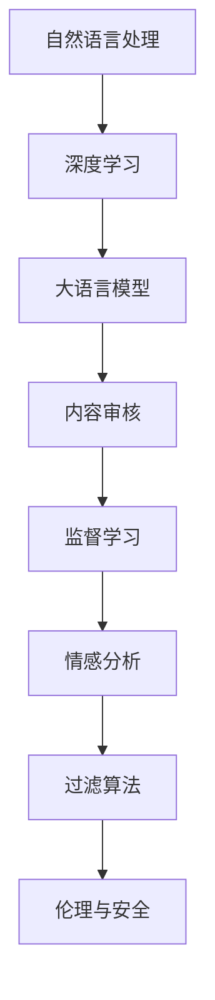

                 

# LLM在智能内容审核中的应用

> 关键词：自然语言处理(NLP),深度学习,大语言模型(LLM),内容审核,监督学习,情感分析,过滤算法,伦理与安全

## 1. 背景介绍

### 1.1 问题由来

随着互联网技术的飞速发展，社交媒体、论坛、电商平台等网络平台上的内容数量爆炸式增长，每天产生的海量信息中蕴含着大量的有害和敏感内容，对社会稳定和公民权益构成了严重威胁。内容审核系统因此应运而生，它通过自动化的方式识别和过滤有害内容，保护用户免受虚假信息、网络暴力、色情等不良内容的侵害，维护网络环境的安全与秩序。

然而，传统的基于规则的审核方式往往依赖人工制定的规则，难以全面覆盖各种类型的有害信息。而基于深度学习的智能内容审核系统能够学习从大量数据中自动挖掘规律，具有更高的识别准确率和泛化能力。特别是大语言模型(Large Language Model, LLM)，作为目前最先进、最有效的自然语言处理工具，其在文本理解和生成方面的强大能力，使其在智能内容审核中展现出广阔的应用前景。

### 1.2 问题核心关键点

智能内容审核系统可以大致分为两类：基于规则的审核系统和基于深度学习的审核系统。其中，基于深度学习的审核系统又可以分为基于特征提取的系统和基于预训练模型的系统。

在基于预训练模型的审核系统中，LLM起到了至关重要的作用。LLM能够通过大规模无标签文本数据进行自监督学习，获得强大的语义理解和生成能力。而通过微调技术，可以在特定任务上进行有监督学习，进一步提升其性能。具体应用时，可以根据内容审核的实际需求，选择合适的LLM进行微调，以适应不同的审核任务，如图像描述、文本情感分析、自动分类等。

## 2. 核心概念与联系

### 2.1 核心概念概述

为了更好地理解LLM在内容审核中的应用，本节将介绍几个密切相关的核心概念：

- 自然语言处理(NLP)：研究如何让计算机能够理解、分析、生成自然语言的技术。
- 深度学习：基于神经网络的结构和训练算法，能够自动学习并提取特征，广泛应用于图像、语音、文本等各类数据的处理。
- 大语言模型(LLM)：通过大规模无标签文本数据进行预训练，能够进行文本生成、理解、分类等任务的高级模型，如GPT-3、BERT等。
- 内容审核：通过自动化技术识别和过滤有害内容，保护网络环境的健康发展。
- 监督学习：利用标注数据训练模型，使其能够对特定任务进行预测或分类。
- 情感分析：分析文本中的情感倾向，识别和过滤负面、有害的内容。
- 过滤算法：根据设定的规则，对文本进行筛选和过滤，自动移除有害内容。
- 伦理与安全：确保内容审核系统的公正性、合法性和安全性，防止滥用和误伤。

这些核心概念之间的逻辑关系可以通过以下Mermaid流程图来展示：



这个流程图展示了大语言模型在内容审核系统中的核心概念及其之间的关系：

1. 自然语言处理通过深度学习技术，使得计算机能够处理自然语言。
2. 深度学习通过大语言模型，实现对自然语言的处理和生成。
3. 内容审核系统通过监督学习和大语言模型，实现对有害内容的自动检测和过滤。
4. 情感分析和大语言模型结合，提升内容审核的精度和覆盖范围。
5. 过滤算法和监督学习协同工作，确保内容审核的安全和高效。
6. 伦理与安全是内容审核系统不可忽视的重要因素，确保其使用的合规性和正当性。

## 3. 核心算法原理 & 具体操作步骤
### 3.1 算法原理概述

基于LLM的智能内容审核系统，通过在大规模文本数据上进行预训练，学习到丰富的语言知识和语义表示。然后通过微调技术，在有标签的训练数据上进行有监督学习，优化模型在特定任务上的性能。最后，将微调后的模型应用于内容审核场景中，实现对文本的实时检测和过滤。

具体来说，系统首先对输入文本进行分词、预处理等操作，然后将其送入微调后的LLM中进行语义分析和理解。LLM会根据输入的文本特征，自动输出可能的标签，如色情、暴力、政治等，再由过滤算法对标签进行过滤，自动删除有害内容，从而保护网络环境的健康发展。

### 3.2 算法步骤详解

基于LLM的智能内容审核系统通常包括以下几个关键步骤：

**Step 1: 数据收集与标注**
- 收集并筛选出含有有害内容的文本数据集。
- 标注数据集，人工标注每篇文章是否含有有害信息，并确定具体的标签类别。

**Step 2: 模型选择与微调**
- 选择合适的预训练模型（如GPT-3、BERT等）作为初始化参数。
- 设计任务适配层和损失函数，在标注数据集上进行微调。

**Step 3: 模型评估与优化**
- 在验证集上评估微调后模型的性能。
- 根据评估结果调整超参数，进行模型优化。

**Step 4: 部署与使用**
- 将微调后的模型部署到生产环境中，进行实时文本检测和过滤。
- 定期更新模型，重新训练以适应新出现的有害内容。

### 3.3 算法优缺点

基于LLM的智能内容审核系统具有以下优点：
1. 高效准确：LLM具备强大的文本理解能力，能够在大量文本中高效识别有害信息，并实现准确过滤。
2. 自适应强：通过微调技术，LLM能够自适应特定领域的有害内容，提升检测的精度。
3. 泛化能力强：基于无标签数据进行预训练，LLM可以覆盖多种类型的有害信息，提升泛化能力。
4. 可扩展性高：系统可以通过微调技术，快速适应新出现的有害内容，并不断提升性能。

同时，该方法也存在以下局限性：
1. 依赖标注数据：系统需要大量标注数据进行微调，标注成本较高。
2. 存在偏见：预训练数据和标注数据中可能存在偏见，微调后的模型也可能继承这些偏见。
3. 伦理风险：内容审核系统涉及隐私和言论自由等伦理问题，需慎重处理。
4. 误报和漏报：由于自然语言的复杂性和多样性，系统可能存在误报和漏报的风险。

尽管存在这些局限性，但基于LLM的智能内容审核系统以其高效准确、自适应强、泛化能力强等特点，成为目前最先进的审核方式之一，广泛应用于各类网络平台。

### 3.4 算法应用领域

基于LLM的智能内容审核系统已经被广泛应用于各类网络平台，包括但不限于以下领域：

- 社交媒体平台：如微博、微信、抖音等，通过自动检测和过滤有害内容，保障用户信息安全。
- 论坛社区：如百度贴吧、知乎、豆瓣等，通过自动审核系统，清理违规内容，维护社区秩序。
- 电商平台：如淘宝、京东、亚马逊等，通过内容检测，防范虚假广告和违规商品信息，保护消费者权益。
- 视频网站：如腾讯视频、爱奇艺、B站等，通过内容审核，筛除不适宜内容，保障青少年健康成长。
- 新闻网站：如新浪、搜狐、网易等，通过自动审核，防止假新闻和有害信息的传播，维护媒体公信力。

除了上述这些主要应用场景，LLM在内容审核领域的应用还扩展到了政府机关、教育机构、金融行业等多个领域，发挥着越来越重要的作用。

## 4. 数学模型和公式 & 详细讲解  
### 4.1 数学模型构建

为了更严谨地描述基于LLM的内容审核系统，本节将介绍几个关键的数学模型：

- 模型输入与输出：设输入文本为$X$，微调后模型的输出为$Y$，其中$Y$由若干个二分类标签组成。
- 损失函数：常用交叉熵损失函数，用于衡量模型预测值与真实标签值之间的差异。
- 激活函数：通常使用ReLU、Tanh等激活函数，对模型输出进行非线性映射。

定义交叉熵损失函数为：

$$
L(Y, \hat{Y}) = -\frac{1}{N} \sum_{i=1}^N \sum_{j=1}^K y_{ij} \log \hat{y}_{ij}
$$

其中$N$为样本数量，$K$为标签种类，$y_{ij}$为第$i$个样本的第$j$个标签，$\hat{y}_{ij}$为模型对第$i$个样本的第$j$个标签的预测值。

### 4.2 公式推导过程

为了理解上述公式的推导过程，我们将以文本分类任务为例进行讲解。假设模型输入为$X$，微调后模型的输出为$Y$，其中$Y$由若干个二分类标签组成。设模型在训练集$D=\{(X_i, Y_i)\}_{i=1}^N$上进行微调，则训练集上的损失函数为：

$$
L(Y, \hat{Y}) = \frac{1}{N} \sum_{i=1}^N L_i(X_i, \hat{Y})
$$

其中$L_i(X_i, \hat{Y})$为单个样本的损失函数，可以表示为：

$$
L_i(X_i, \hat{Y}) = -\sum_{j=1}^K y_{ij} \log \hat{y}_{ij}
$$

将上述公式代入整体损失函数，即可得到交叉熵损失函数的表达式：

$$
L(Y, \hat{Y}) = -\frac{1}{N} \sum_{i=1}^N \sum_{j=1}^K y_{ij} \log \hat{y}_{ij}
$$

这个公式是训练过程的核心，通过最小化交叉熵损失，使模型能够准确地预测每个样本的标签，从而提升内容审核的准确性。

### 4.3 案例分析与讲解

以情感分析为例，假设输入的文本为："我非常喜欢这本书！"，微调后的模型可以将其分类为正面情感。具体分析步骤如下：

1. 分词和预处理：将文本进行分词、去除停用词、转换为模型能够接受的格式。
2. 输入模型：将预处理后的文本输入微调后的LLM中，得到模型预测的情感标签。
3. 过滤与过滤算法：将预测结果输入过滤算法，对文本进行自动过滤，删除可能的有害内容。

例如，当预测结果为正面情感时，系统会自动将文本通过，当预测结果为负面情感时，系统会将其标记为有害内容并进行删除。

## 5. 项目实践：代码实例和详细解释说明
### 5.1 开发环境搭建

在进行基于LLM的内容审核系统开发前，需要先准备好开发环境。以下是使用Python进行PyTorch开发的环境配置流程：

1. 安装Anaconda：从官网下载并安装Anaconda，用于创建独立的Python环境。

2. 创建并激活虚拟环境：
```bash
conda create -n pytorch-env python=3.8 
conda activate pytorch-env
```

3. 安装PyTorch：根据CUDA版本，从官网获取对应的安装命令。例如：
```bash
conda install pytorch torchvision torchaudio cudatoolkit=11.1 -c pytorch -c conda-forge
```

4. 安装Transformers库：
```bash
pip install transformers
```

5. 安装各类工具包：
```bash
pip install numpy pandas scikit-learn matplotlib tqdm jupyter notebook ipython
```

完成上述步骤后，即可在`pytorch-env`环境中开始内容审核系统的开发。

### 5.2 源代码详细实现

下面我们以文本分类任务为例，给出使用Transformers库对BERT模型进行微调的PyTorch代码实现。

首先，定义文本分类任务的数据处理函数：

```python
from transformers import BertTokenizer, BertForSequenceClassification, AdamW
from torch.utils.data import Dataset, DataLoader
from tqdm import tqdm
from sklearn.metrics import classification_report
import torch.nn.functional as F

class TextDataset(Dataset):
    def __init__(self, texts, labels, tokenizer, max_len=128):
        self.texts = texts
        self.labels = labels
        self.tokenizer = tokenizer
        self.max_len = max_len
        
    def __len__(self):
        return len(self.texts)
    
    def __getitem__(self, item):
        text = self.texts[item]
        label = self.labels[item]
        
        encoding = self.tokenizer(text, return_tensors='pt', max_length=self.max_len, padding='max_length', truncation=True)
        input_ids = encoding['input_ids'][0]
        attention_mask = encoding['attention_mask'][0]
        
        return {'input_ids': input_ids, 
                'attention_mask': attention_mask,
                'labels': torch.tensor(label, dtype=torch.long)}
```

然后，定义模型和优化器：

```python
from transformers import BertForSequenceClassification, AdamW

model = BertForSequenceClassification.from_pretrained('bert-base-cased', num_labels=2)

optimizer = AdamW(model.parameters(), lr=2e-5)
```

接着，定义训练和评估函数：

```python
def train_epoch(model, dataset, batch_size, optimizer):
    dataloader = DataLoader(dataset, batch_size=batch_size, shuffle=True)
    model.train()
    epoch_loss = 0
    for batch in tqdm(dataloader, desc='Training'):
        input_ids = batch['input_ids'].to(device)
        attention_mask = batch['attention_mask'].to(device)
        labels = batch['labels'].to(device)
        model.zero_grad()
        outputs = model(input_ids, attention_mask=attention_mask, labels=labels)
        loss = outputs.loss
        epoch_loss += loss.item()
        loss.backward()
        optimizer.step()
    return epoch_loss / len(dataloader)

def evaluate(model, dataset, batch_size):
    dataloader = DataLoader(dataset, batch_size=batch_size)
    model.eval()
    preds, labels = [], []
    with torch.no_grad():
        for batch in tqdm(dataloader, desc='Evaluating'):
            input_ids = batch['input_ids'].to(device)
            attention_mask = batch['attention_mask'].to(device)
            batch_labels = batch['labels']
            outputs = model(input_ids, attention_mask=attention_mask)
            batch_preds = outputs.logits.argmax(dim=1).to('cpu').tolist()
            batch_labels = batch_labels.to('cpu').tolist()
            for pred, label in zip(batch_preds, batch_labels):
                preds.append(pred)
                labels.append(label)
                
    print(classification_report(labels, preds))
```

最后，启动训练流程并在测试集上评估：

```python
epochs = 5
batch_size = 16

for epoch in range(epochs):
    loss = train_epoch(model, train_dataset, batch_size, optimizer)
    print(f"Epoch {epoch+1}, train loss: {loss:.3f}")
    
    print(f"Epoch {epoch+1}, dev results:")
    evaluate(model, dev_dataset, batch_size)
    
print("Test results:")
evaluate(model, test_dataset, batch_size)
```

以上就是使用PyTorch对BERT进行文本分类任务微调的完整代码实现。可以看到，得益于Transformers库的强大封装，我们可以用相对简洁的代码完成BERT模型的加载和微调。

### 5.3 代码解读与分析

让我们再详细解读一下关键代码的实现细节：

**TextDataset类**：
- `__init__`方法：初始化文本、标签、分词器等关键组件。
- `__len__`方法：返回数据集的样本数量。
- `__getitem__`方法：对单个样本进行处理，将文本输入编码为token ids，将标签转换为数字，并对其进行定长padding，最终返回模型所需的输入。

**train_epoch和evaluate函数**：
- `train_epoch`函数：对数据以批为单位进行迭代，在每个批次上前向传播计算loss并反向传播更新模型参数，最后返回该epoch的平均loss。
- `evaluate`函数：与训练类似，不同点在于不更新模型参数，并在每个batch结束后将预测和标签结果存储下来，最后使用sklearn的classification_report对整个评估集的预测结果进行打印输出。

**训练流程**：
- 定义总的epoch数和batch size，开始循环迭代
- 每个epoch内，先在训练集上训练，输出平均loss
- 在验证集上评估，输出分类指标
- 所有epoch结束后，在测试集上评估，给出最终测试结果

可以看到，PyTorch配合Transformers库使得BERT微调的代码实现变得简洁高效。开发者可以将更多精力放在数据处理、模型改进等高层逻辑上，而不必过多关注底层的实现细节。

当然，工业级的系统实现还需考虑更多因素，如模型的保存和部署、超参数的自动搜索、更灵活的任务适配层等。但核心的微调范式基本与此类似。

## 6. 实际应用场景
### 6.1 智能社交平台

智能社交平台如微博、微信、抖音等，通过自动检测和过滤有害内容，保障用户信息安全。例如，微博推出的"安全探索"功能，利用大语言模型对用户发布的内容进行实时监测和审核，防止虚假信息、网络暴力等内容的传播。

在技术实现上，微博可以从官方微博、转发、评论等处抓取大量数据，对大语言模型进行微调，识别出可能含有有害信息的内容。然后，根据不同的标签类型，将这些内容打上不同的标签，并在用户互动中自动删除或提示用户举报，从而保障社交环境的健康发展。

### 6.2 电商平台

电商平台如淘宝、京东、亚马逊等，通过内容检测，防范虚假广告和违规商品信息，保护消费者权益。例如，淘宝利用大语言模型对商品描述和用户评论进行实时监测，自动删除可能的有害内容，如虚假广告、恶意评价等。

在技术实现上，淘宝可以从平台的用户评价、商品描述、用户互动等处抓取大量数据，对大语言模型进行微调，识别出可能含有虚假广告和违规信息的内容。然后，将这些内容打上标签，自动删除或提示用户举报，从而保障电商平台的公平性和健康发展。

### 6.3 新闻网站

新闻网站如新浪、搜狐、网易等，通过自动审核，防止假新闻和有害信息的传播，维护媒体公信力。例如，新浪利用大语言模型对新闻内容进行自动检测和过滤，识别出可能含有虚假信息和有害内容的新闻，自动删除或标记为不适宜内容，防止其进一步传播。

在技术实现上，新浪可以从官方新闻、用户评论等处抓取大量数据，对大语言模型进行微调，识别出可能含有虚假信息和有害内容的新闻。然后，将这些内容打上标签，自动删除或标记为不适宜内容，防止其进一步传播，从而维护新闻网站的公信力和用户的信任感。

### 6.4 未来应用展望

随着大语言模型和微调方法的不断发展，基于LLM的内容审核系统将在更多领域得到应用，为网络环境的健康发展提供技术保障。

在智慧城市治理中，基于LLM的内容审核系统可以实时监测城市事件、舆情分析、应急指挥等环节，自动过滤有害内容，保障城市环境的稳定和安全。

在智能客服领域，基于LLM的内容审核系统可以自动识别用户咨询中的有害信息，自动删除或提示用户举报，提升客户服务体验和质量。

在金融行业，基于LLM的内容审核系统可以实时监测市场舆情动向，自动过滤负面、有害的内容，防止金融风险的传播。

除了上述这些应用场景，LLM在内容审核领域的应用还扩展到了政府机关、教育机构、社区平台等多个领域，发挥着越来越重要的作用。

## 7. 工具和资源推荐
### 7.1 学习资源推荐

为了帮助开发者系统掌握基于LLM的内容审核技术的理论基础和实践技巧，这里推荐一些优质的学习资源：

1. 《自然语言处理综述》：北京大学出版社，介绍自然语言处理的基本概念、技术和应用。
2. 《深度学习入门：基于Python的理论与实现》：人民邮电出版社，介绍深度学习的理论和实现。
3. 《TensorFlow实战》：机械工业出版社，介绍TensorFlow的框架结构和应用。
4. 《机器学习实战》：机械工业出版社，介绍机器学习的算法和实现。
5. 《机器学习》：斯坦福大学讲义，介绍机器学习的基本理论和算法。
6. 《计算机视觉：模型、学习和推理》：O'Reilly出版社，介绍计算机视觉的基本理论和实现。

通过学习这些资源，相信你一定能够系统掌握基于LLM的内容审核技术的原理和实现方法，并在实际应用中得心应手。

### 7.2 开发工具推荐

高效的开发离不开优秀的工具支持。以下是几款用于内容审核系统开发的常用工具：

1. PyTorch：基于Python的开源深度学习框架，灵活动态的计算图，适合快速迭代研究。
2. TensorFlow：由Google主导开发的开源深度学习框架，生产部署方便，适合大规模工程应用。
3. Transformers库：HuggingFace开发的NLP工具库，集成了众多SOTA语言模型，支持PyTorch和TensorFlow，是进行内容审核任务开发的利器。
4. Weights & Biases：模型训练的实验跟踪工具，可以记录和可视化模型训练过程中的各项指标，方便对比和调优。
5. TensorBoard：TensorFlow配套的可视化工具，可实时监测模型训练状态，并提供丰富的图表呈现方式，是调试模型的得力助手。
6. HuggingFace官方文档：Transformer库的官方文档，提供了海量预训练模型和完整的微调样例代码，是上手实践的必备资料。

合理利用这些工具，可以显著提升内容审核系统的开发效率，加快创新迭代的步伐。

### 7.3 相关论文推荐

大语言模型和内容审核技术的发展源于学界的持续研究。以下是几篇奠基性的相关论文，推荐阅读：

1. Attention is All You Need：提出Transformer结构，开启了NLP领域的预训练大模型时代。
2. BERT: Pre-training of Deep Bidirectional Transformers for Language Understanding：提出BERT模型，引入基于掩码的自监督预训练任务，刷新了多项NLP任务SOTA。
3. Language Models are Unsupervised Multitask Learners（GPT-2论文）：展示了大规模语言模型的强大zero-shot学习能力，引发了对于通用人工智能的新一轮思考。
4. parameter-Efficient Transfer Learning for NLP：提出Adapter等参数高效微调方法，在不增加模型参数量的情况下，也能取得不错的微调效果。
5. Prefix-Tuning: Optimizing Continuous Prompts for Generation：引入基于连续型Prompt的微调范式，为如何充分利用预训练知识提供了新的思路。

这些论文代表了大语言模型和内容审核技术的发展脉络。通过学习这些前沿成果，可以帮助研究者把握学科前进方向，激发更多的创新灵感。

## 8. 总结：未来发展趋势与挑战

### 8.1 总结

本文对基于LLM的内容审核系统进行了全面系统的介绍。首先阐述了内容审核系统的背景和现状，明确了LLM在内容审核中的重要作用。其次，从原理到实践，详细讲解了LLM在内容审核中的数学模型和实现方法，给出了微调任务开发的完整代码实例。同时，本文还广泛探讨了LLM在智能社交平台、电商平台、新闻网站等多个领域的应用前景，展示了LLM在内容审核系统中的广阔应用。

通过本文的系统梳理，可以看到，基于LLM的内容审核系统能够高效准确地检测和过滤有害内容，保护网络环境的健康发展。LLM在内容审核中的应用前景广阔，可以应用于各类网络平台，为数字化转型提供强大的技术保障。

### 8.2 未来发展趋势

展望未来，基于LLM的内容审核系统将呈现以下几个发展趋势：

1. 实时性进一步提升。随着硬件性能的提升和算法优化，实时内容审核系统将变得更加高效。
2. 多模态内容审核成为常态。内容审核系统将不仅处理文本内容，还能识别图像、视频、音频等多模态信息，全面提升审核能力。
3. 跨领域内容审核普及。基于LLM的内容审核系统将在更多领域得到应用，提升各领域的数字化水平。
4. 伦理与安全要求更高。内容审核系统需要更加注重用户隐私和言论自由，构建公平、公正、透明的内容审核机制。
5. 深度学习与AI伦理结合。内容审核系统需要融入AI伦理、隐私保护、社会责任等理念，构建健康、可持续的发展模式。

以上趋势凸显了基于LLM的内容审核系统的巨大潜力，未来的技术研究和应用开发还有很大的探索空间。

### 8.3 面临的挑战

尽管基于LLM的内容审核系统已经取得了瞩目成就，但在迈向更加智能化、普适化应用的过程中，它仍面临着诸多挑战：

1. 数据质量和标注成本。内容审核系统需要大量高质量的标注数据，而标注成本较高。如何降低标注成本，提高数据质量，仍是一大难题。
2. 模型泛化能力。预训练数据和标注数据中可能存在偏见，微调后的模型也可能继承这些偏见。如何消除偏见，提高模型的泛化能力，仍然是一个挑战。
3. 误报和漏报。自然语言的复杂性和多样性，使得内容审核系统可能存在误报和漏报的风险。如何进一步提高识别准确率，降低误报漏报率，仍然需要更多的研究。
4. 伦理与安全问题。内容审核系统涉及隐私和言论自由等伦理问题，需慎重处理。如何构建公平、公正、透明的内容审核机制，仍然是一大挑战。
5. 计算资源需求。基于LLM的内容审核系统需要大规模计算资源支持，如何优化算法，降低资源消耗，仍是一大挑战。

尽管存在这些挑战，但基于LLM的内容审核系统以其高效准确、自适应强、泛化能力强等特点，成为目前最先进的审核方式之一，广泛应用于各类网络平台。未来，随着技术的不断进步，这些挑战终将一一被克服，基于LLM的内容审核系统必将在构建健康、公平、透明的网络环境上发挥更大的作用。

### 8.4 研究展望

面向未来，基于LLM的内容审核系统需要在以下几个方面进行深入研究：

1. 无监督和半监督学习：摆脱对大规模标注数据的依赖，利用自监督学习、主动学习等无监督和半监督范式，最大限度利用非结构化数据，实现更加灵活高效的内容审核。
2. 多模态内容审核：引入图像、视频、音频等多模态信息，提升内容审核系统的全面性和鲁棒性。
3. 模型集成与融合：将多个预训练模型和微调模型进行融合，提升内容审核系统的精度和稳定性。
4. 跨领域内容审核：将内容审核系统应用于更多领域，提升各领域的数字化水平，构建更健康、更公平的网络环境。
5. 伦理与隐私保护：融入AI伦理、隐私保护、社会责任等理念，构建健康、可持续的内容审核机制。

这些研究方向的探索，必将引领基于LLM的内容审核技术迈向更高的台阶，为构建健康、公平、透明的网络环境提供新的技术手段。

## 9. 附录：常见问题与解答

**Q1：大语言模型在内容审核中是否适合所有的任务？**

A: 大语言模型在内容审核中具有一定的适用性，但并非适合所有任务。对于一些特定领域的任务，如医学、法律等，仅仅依靠通用语料预训练的模型可能难以很好地适应。此时需要在特定领域语料上进一步预训练，再进行微调，才能获得理想效果。此外，对于一些需要时效性、个性化很强的任务，如对话、推荐等，微调方法也需要针对性的改进优化。

**Q2：大语言模型在内容审核中是否容易受到偏见的影响？**

A: 大语言模型在内容审核中确实容易受到偏见的影响。预训练数据和标注数据中可能存在偏见，微调后的模型也可能继承这些偏见。例如，在情感分析中，如果训练数据中的负面情感内容较多，模型可能倾向于将负面情感标签赋予所有文本，从而导致误报。

为了解决这一问题，可以采用以下措施：
1. 数据均衡：尽量收集平衡的数据集，避免某一类数据过多或过少。
2. 数据清洗：去除标注数据中的偏见信息，减少模型对偏见的继承。
3. 公平性约束：在损失函数中加入公平性约束，避免模型对特定类别的偏袒。

**Q3：大语言模型在内容审核中是否容易被攻击？**

A: 大语言模型在内容审核中存在一定的安全风险，容易被攻击者利用漏洞进行绕过和误导。例如，攻击者可以输入特定的文本模板，诱导模型生成错误的标签，从而绕过内容审核。

为了提高系统的安全性，可以采用以下措施：
1. 对抗训练：在训练过程中加入对抗样本，提高模型的鲁棒性。
2. 动态更新：定期更新模型参数，防止攻击者通过绕过方法利用漏洞。
3. 行为监控：实时监控模型的输出，发现异常行为及时响应。

**Q4：大语言模型在内容审核中是否需要考虑伦理与安全？**

A: 大语言模型在内容审核中确实需要考虑伦理与安全问题。内容审核系统涉及隐私和言论自由等伦理问题，需慎重处理。例如，在处理涉及用户隐私的信息时，需要遵守相关法律法规，确保用户隐私不被侵犯。

为了保障伦理与安全，可以采用以下措施：
1. 数据合规：遵守相关法律法规，确保数据处理合规。
2. 用户同意：在使用用户数据进行内容审核时，需获取用户同意。
3. 透明度与问责：构建透明的内容审核机制，保障用户知情权，同时建立问责机制，确保系统公平公正。

**Q5：大语言模型在内容审核中是否需要考虑算力与成本？**

A: 大语言模型在内容审核中确实需要考虑算力与成本问题。基于LLM的内容审核系统需要大规模计算资源支持，如何优化算法，降低资源消耗，仍然是一大挑战。例如，使用GPU/TPU等高性能设备是必不可少的，但即便如此，超大批次的训练和推理也可能遇到显存不足的问题。

为了降低算力与成本，可以采用以下措施：
1. 参数压缩：使用知识蒸馏、模型剪枝等技术，降低模型参数量。
2. 模型裁剪：去除不必要的层和参数，减小模型尺寸，加快推理速度。
3. 分布式训练：使用分布式训练技术，加速模型训练过程，降低计算成本。

大语言模型在内容审核中的应用前景广阔，但需要解决诸多挑战，才能真正实现其价值。只有不断优化算法，提升系统性能，才能构建更加健康、公平、透明的网络环境。总之，内容审核系统需要兼顾技术与伦理，才能在数字化时代发挥更大的作用。

---

作者：禅与计算机程序设计艺术 / Zen and the Art of Computer Programming

