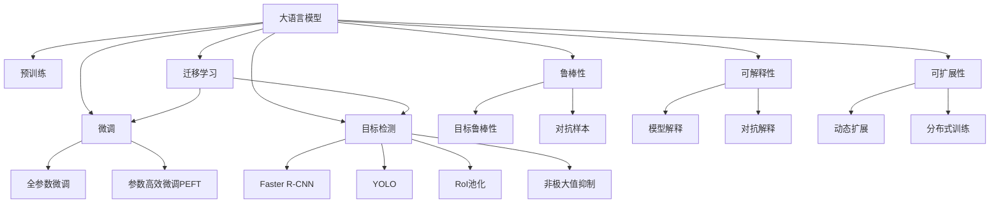

                 

## 1. 背景介绍

物体检测（Object Detection）是大规模视觉任务的核心，广泛应用于安防监控、自动驾驶、工业检测等关键领域。近年来，基于大规模预训练语言模型（Large Language Model, LLM）的物体检测方法不断涌现，开辟了物体检测领域的新篇章。尤其是近年来，大模型如GPT-3、BERT等在多个视觉领域取得了显著成果，展示了预训练语言模型的强大潜力。

## 2. 核心概念与联系

### 2.1 核心概念概述

本节将介绍几个密切相关的核心概念：

- **大语言模型（LLM）**：以自回归（如GPT-3）或自编码（如BERT）模型为代表的预训练语言模型。通过在大规模无标签文本语料上进行预训练，学习到丰富的语言知识和常识，具备强大的语言理解和生成能力。

- **预训练（Pre-training）**：指在大规模无标签文本语料上，通过自监督学习任务训练通用语言模型的过程。常见的预训练任务包括语言建模、掩码语言模型等。预训练使得模型学习到语言的通用表示。

- **微调（Fine-tuning）**：指在预训练模型的基础上，使用下游任务的少量标注数据，通过有监督学习优化模型在该任务上的性能。通常只需要调整顶层分类器或解码器，并以较小的学习率更新全部或部分的模型参数。

- **迁移学习（Transfer Learning）**：指将一个领域学习到的知识，迁移应用到另一个不同但相关的领域的学习范式。大模型的预训练-微调过程即是一种典型的迁移学习方式。

- **目标检测（Object Detection）**：指通过图像或视频数据，识别出物体的位置和类别，并进行精确定位的技术。传统目标检测方法以RCNN、Faster R-CNN、YOLO等为代表，而大语言模型的引入，提供了新的目标检测思路。

### 2.2 核心概念原理和架构的 Mermaid 流程图



这个流程图展示了大语言模型在物体检测领域的应用，从预训练到微调，再到目标检测，每一个步骤都是紧密相连的。

## 3. 核心算法原理 & 具体操作步骤

### 3.1 算法原理概述

大语言模型在物体检测领域的应用，主要基于预训练-微调范式。其核心思想是：将预训练的大语言模型视作一个强大的“特征提取器”，通过下游任务的少量标注数据进行有监督学习，优化模型在特定任务上的性能。

形式化地，假设预训练模型为 $M_{\theta}$，其中 $\theta$ 为预训练得到的模型参数。给定物体检测任务 $T$ 的标注数据集 $D=\{(x_i, y_i)\}_{i=1}^N$，微调的目标是找到新的模型参数 $\hat{\theta}$，使得：

$$
\hat{\theta}=\mathop{\arg\min}_{\theta} \mathcal{L}(M_{\theta},D)
$$

其中 $\mathcal{L}$ 为针对任务 $T$ 设计的损失函数，用于衡量模型预测输出与真实标签之间的差异。常见的损失函数包括交叉熵损失、均方误差损失等。

通过梯度下降等优化算法，微调过程不断更新模型参数 $\theta$，最小化损失函数 $\mathcal{L}$，使得模型输出逼近真实标签。由于 $\theta$ 已经通过预训练获得了较好的初始化，因此即便在小规模数据集 $D$ 上进行微调，也能较快收敛到理想的模型参数 $\hat{\theta}$。

### 3.2 算法步骤详解

基于监督学习的大语言模型微调，一般包括以下几个关键步骤：

**Step 1: 准备预训练模型和数据集**
- 选择合适的预训练语言模型 $M_{\theta}$ 作为初始化参数，如 GPT-3、BERT等。
- 准备物体检测任务 $T$ 的标注数据集 $D$，划分为训练集、验证集和测试集。一般要求标注数据与预训练数据的分布不要差异过大。

**Step 2: 添加目标检测适配层**
- 根据任务类型，在预训练模型顶层设计合适的输出层和损失函数。
- 对于物体检测任务，通常在顶层添加分类头、回归头和边界框头，以输出类别、位置和大小信息。
- 损失函数通常为分类损失和回归损失的组合，以衡量模型在预测位置和类别时的准确性。

**Step 3: 设置微调超参数**
- 选择合适的优化算法及其参数，如 AdamW、SGD 等，设置学习率、批大小、迭代轮数等。
- 设置正则化技术及强度，包括权重衰减、Dropout、Early Stopping 等。
- 确定冻结预训练参数的策略，如仅微调顶层，或全部参数都参与微调。

**Step 4: 执行梯度训练**
- 将训练集数据分批次输入模型，前向传播计算损失函数。
- 反向传播计算参数梯度，根据设定的优化算法和学习率更新模型参数。
- 周期性在验证集上评估模型性能，根据性能指标决定是否触发 Early Stopping。
- 重复上述步骤直到满足预设的迭代轮数或 Early Stopping 条件。

**Step 5: 测试和部署**
- 在测试集上评估微调后模型 $M_{\hat{\theta}}$ 的性能，对比微调前后的精度提升。
- 使用微调后的模型对新样本进行推理预测，集成到实际的应用系统中。
- 持续收集新的数据，定期重新微调模型，以适应数据分布的变化。

### 3.3 算法优缺点

基于监督学习的大语言模型微调方法具有以下优点：
1. 简单高效。只需准备少量标注数据，即可对预训练模型进行快速适配，获得较大的性能提升。
2. 通用适用。适用于各种物体检测任务，包括目标分类、目标定位等，设计简单的任务适配层即可实现微调。
3. 参数高效。利用参数高效微调技术，在固定大部分预训练参数的情况下，仍可取得不错的提升。
4. 效果显著。在学术界和工业界的诸多任务上，基于微调的方法已经刷新了最先进的性能指标。

同时，该方法也存在一定的局限性：
1. 依赖标注数据。微调的效果很大程度上取决于标注数据的质量和数量，获取高质量标注数据的成本较高。
2. 迁移能力有限。当目标任务与预训练数据的分布差异较大时，微调的性能提升有限。
3. 可解释性不足。微调模型的决策过程通常缺乏可解释性，难以对其推理逻辑进行分析和调试。
4. 对抗鲁棒性不足。微调模型容易受到对抗样本的影响，输出可能出现偏差。

尽管存在这些局限性，但就目前而言，基于监督学习的微调方法仍是大语言模型在物体检测领域应用的主流范式。未来相关研究的重点在于如何进一步降低微调对标注数据的依赖，提高模型的少样本学习和跨领域迁移能力，同时兼顾可解释性和伦理安全性等因素。

### 3.4 算法应用领域

基于大语言模型微调的物体检测方法，在安防监控、自动驾驶、工业检测等众多领域得到了广泛应用，展示了预训练语言模型的强大潜力。

- **安防监控**：在安防监控视频中，通过微调大语言模型进行目标检测，可以实时监测视频中的人、车、物品等，并及时报警或记录，大幅提升监控效率和安全性。
- **自动驾驶**：在自动驾驶中，通过微调大语言模型检测道路上的车辆、行人、交通标志等，辅助驾驶决策，提升驾驶安全性和舒适性。
- **工业检测**：在工业生产中，通过微调大语言模型检测生产线上关键设备的运行状态、产品质量等，实现自动化检测和预警，提升生产效率和质量。

除了这些应用场景外，大语言模型微调还被创新性地应用于无人机视觉识别、农业病虫害检测等领域，为传统行业带来了新的应用方式和更高的效率。

## 4. 数学模型和公式 & 详细讲解

### 4.1 数学模型构建

以物体检测为例，形式化地定义模型的输入和输出：

- 输入 $x$：包含物体图像 $I$ 和标注框 $B$，标注框 $B$ 包含物体的位置信息 $(x_i,y_i)$。
- 输出 $y$：物体类别标签 $C$ 和位置信息 $(x,y)$。

定义模型 $M_{\theta}$ 在输入 $x$ 上的输出为 $\hat{y}=M_{\theta}(x)$，包含分类概率 $\hat{p}_C$ 和位置回归结果 $\hat{p}_P$。目标检测任务的目标是最小化分类损失和回归损失：

$$
\min_{\theta} \mathcal{L}(M_{\theta},D) = \min_{\theta} \{ \mathcal{L}_{cls}(\hat{p}_C, y_C) + \mathcal{L}_{reg}(\hat{p}_P, y_P) \}
$$

其中 $\mathcal{L}_{cls}$ 和 $\mathcal{L}_{reg}$ 分别为分类损失和回归损失，具体形式如下：

$$
\mathcal{L}_{cls}(\hat{p}_C, y_C) = -\sum_{i=1}^N \sum_{c=1}^C y_{c,i} \log(\hat{p}_{c,i})
$$

$$
\mathcal{L}_{reg}(\hat{p}_P, y_P) = \frac{1}{N} \sum_{i=1}^N (\hat{p}_{x,i} - y_{x,i})^2 + (\hat{p}_{y,i} - y_{y,i})^2
$$

其中 $y_C$ 和 $y_P$ 分别为类别标签和位置信息的真实值。

### 4.2 公式推导过程

在得到损失函数后，我们可以使用梯度下降等优化算法来近似求解上述最优化问题。设 $\eta$ 为学习率，$\lambda$ 为正则化系数，则参数的更新公式为：

$$
\theta \leftarrow \theta - \eta \nabla_{\theta}\mathcal{L}(\theta) - \eta\lambda\theta
$$

其中 $\nabla_{\theta}\mathcal{L}(\theta)$ 为损失函数对参数 $\theta$ 的梯度，可通过反向传播算法高效计算。

### 4.3 案例分析与讲解

以Faster R-CNN为例，它的核心思想是使用region proposal生成候选区域，然后在候选区域上使用分类器进行目标检测。其数学模型如下：

- 输入 $x$：包含物体图像 $I$ 和候选区域 $R$。
- 输出 $y$：每个候选区域的类别标签 $C$ 和边界框 $B$。

模型的前向传播过程包含两个部分：region proposal生成和分类器检测。region proposal生成模块的输出是一个候选区域的集合 $\{r_i\}_{i=1}^N$，其中 $r_i$ 包含候选区域的位置和大小。分类器检测模块的输出是一个长度为 $N$ 的向量，每个元素表示对应候选区域的分类概率和位置回归结果。

损失函数包括分类损失和回归损失：

$$
\mathcal{L}_{cls} = -\sum_{i=1}^N \sum_{c=1}^C y_{c,i} \log(\hat{p}_{c,i})
$$

$$
\mathcal{L}_{reg} = \frac{1}{N} \sum_{i=1}^N (\hat{p}_{x_i} - y_{x_i})^2 + (\hat{p}_{y_i} - y_{y_i})^2
$$

其中 $y_C$ 和 $y_P$ 分别为类别标签和位置信息的真实值。

## 5. 项目实践：代码实例和详细解释说明

### 5.1 开发环境搭建

在进行物体检测微调实践前，我们需要准备好开发环境。以下是使用Python进行PyTorch开发的环境配置流程：

1. 安装Anaconda：从官网下载并安装Anaconda，用于创建独立的Python环境。

2. 创建并激活虚拟环境：
```bash
conda create -n pytorch-env python=3.8 
conda activate pytorch-env
```

3. 安装PyTorch：根据CUDA版本，从官网获取对应的安装命令。例如：
```bash
conda install pytorch torchvision torchaudio cudatoolkit=11.1 -c pytorch -c conda-forge
```

4. 安装Transformers库：
```bash
pip install transformers
```

5. 安装各类工具包：
```bash
pip install numpy pandas scikit-learn matplotlib tqdm jupyter notebook ipython
```

完成上述步骤后，即可在`pytorch-env`环境中开始微调实践。

### 5.2 源代码详细实现

下面我们以物体检测为例，给出使用Transformers库对BERT模型进行微调的PyTorch代码实现。

首先，定义物体检测任务的数据处理函数：

```python
from transformers import BertTokenizer
from torch.utils.data import Dataset
import torch

class ObjectDetectionDataset(Dataset):
    def __init__(self, images, boxes, categories, tokenizer, max_len=128):
        self.images = images
        self.boxes = boxes
        self.categories = categories
        self.tokenizer = tokenizer
        self.max_len = max_len
        
    def __len__(self):
        return len(self.images)
    
    def __getitem__(self, item):
        image = self.images[item]
        boxes = self.boxes[item]
        categories = self.categories[item]
        
        encoding = self.tokenizer(image, return_tensors='pt', max_length=self.max_len, padding='max_length', truncation=True)
        input_ids = encoding['input_ids'][0]
        attention_mask = encoding['attention_mask'][0]
        
        # 对边界框进行编码
        encoded_boxes = [box + (0, 0) for box in boxes]  # 假设边界框为 (x1, y1, x2, y2) 形式
        encoded_boxes.extend([(0, 0)] * (self.max_len - len(encoded_boxes)))
        labels = torch.tensor(encoded_boxes, dtype=torch.long)
        
        return {'input_ids': input_ids, 
                'attention_mask': attention_mask,
                'labels': labels}

# 标签与id的映射
category2id = {'person': 0, 'car': 1, 'bike': 2, 'bus': 3}
id2category = {v: k for k, v in category2id.items()}

# 创建dataset
tokenizer = BertTokenizer.from_pretrained('bert-base-cased')

train_dataset = ObjectDetectionDataset(train_images, train_boxes, train_categories, tokenizer)
dev_dataset = ObjectDetectionDataset(dev_images, dev_boxes, dev_categories, tokenizer)
test_dataset = ObjectDetectionDataset(test_images, test_boxes, test_categories, tokenizer)
```

然后，定义模型和优化器：

```python
from transformers import BertForObjectDetection, AdamW

model = BertForObjectDetection.from_pretrained('bert-base-cased', num_labels=len(category2id))

optimizer = AdamW(model.parameters(), lr=2e-5)
```

接着，定义训练和评估函数：

```python
from torch.utils.data import DataLoader
from tqdm import tqdm
from sklearn.metrics import classification_report

device = torch.device('cuda') if torch.cuda.is_available() else torch.device('cpu')
model.to(device)

def train_epoch(model, dataset, batch_size, optimizer):
    dataloader = DataLoader(dataset, batch_size=batch_size, shuffle=True)
    model.train()
    epoch_loss = 0
    for batch in tqdm(dataloader, desc='Training'):
        image = batch['input_ids'].to(device)
        attention_mask = batch['attention_mask'].to(device)
        labels = batch['labels'].to(device)
        model.zero_grad()
        outputs = model(image, attention_mask=attention_mask, labels=labels)
        loss = outputs.loss
        epoch_loss += loss.item()
        loss.backward()
        optimizer.step()
    return epoch_loss / len(dataloader)

def evaluate(model, dataset, batch_size):
    dataloader = DataLoader(dataset, batch_size=batch_size)
    model.eval()
    preds, labels = [], []
    with torch.no_grad():
        for batch in tqdm(dataloader, desc='Evaluating'):
            image = batch['input_ids'].to(device)
            attention_mask = batch['attention_mask'].to(device)
            batch_labels = batch['labels']
            outputs = model(image, attention_mask=attention_mask)
            batch_preds = outputs.predictions.argmax(dim=2).to('cpu').tolist()
            batch_labels = batch_labels.to('cpu').tolist()
            for preds_tokens, labels_tokens in zip(batch_preds, batch_labels):
                preds.append(preds_tokens[:len(labels_tokens)])
                labels.append(labels_tokens)
                
    print(classification_report(labels, preds))
```

最后，启动训练流程并在测试集上评估：

```python
epochs = 5
batch_size = 16

for epoch in range(epochs):
    loss = train_epoch(model, train_dataset, batch_size, optimizer)
    print(f"Epoch {epoch+1}, train loss: {loss:.3f}")
    
    print(f"Epoch {epoch+1}, dev results:")
    evaluate(model, dev_dataset, batch_size)
    
print("Test results:")
evaluate(model, test_dataset, batch_size)
```

以上就是使用PyTorch对BERT进行物体检测任务微调的完整代码实现。可以看到，得益于Transformers库的强大封装，我们可以用相对简洁的代码完成BERT模型的加载和微调。

### 5.3 代码解读与分析

让我们再详细解读一下关键代码的实现细节：

**ObjectDetectionDataset类**：
- `__init__`方法：初始化图像、边界框和类别等关键组件。
- `__len__`方法：返回数据集的样本数量。
- `__getitem__`方法：对单个样本进行处理，将图像输入编码为token ids，将边界框编码为数字，并对其进行定长padding，最终返回模型所需的输入。

**category2id和id2category字典**：
- 定义了类别与数字id之间的映射关系，用于将token-wise的预测结果解码回真实的类别。

**训练和评估函数**：
- 使用PyTorch的DataLoader对数据集进行批次化加载，供模型训练和推理使用。
- 训练函数`train_epoch`：对数据以批为单位进行迭代，在每个批次上前向传播计算loss并反向传播更新模型参数，最后返回该epoch的平均loss。
- 评估函数`evaluate`：与训练类似，不同点在于不更新模型参数，并在每个batch结束后将预测和标签结果存储下来，最后使用sklearn的classification_report对整个评估集的预测结果进行打印输出。

**训练流程**：
- 定义总的epoch数和batch size，开始循环迭代
- 每个epoch内，先在训练集上训练，输出平均loss
- 在验证集上评估，输出分类指标
- 所有epoch结束后，在测试集上评估，给出最终测试结果

可以看到，PyTorch配合Transformers库使得BERT微调的代码实现变得简洁高效。开发者可以将更多精力放在数据处理、模型改进等高层逻辑上，而不必过多关注底层的实现细节。

当然，工业级的系统实现还需考虑更多因素，如模型的保存和部署、超参数的自动搜索、更灵活的任务适配层等。但核心的微调范式基本与此类似。

## 6. 实际应用场景

### 6.1 智能监控系统

基于大语言模型微调的物体检测技术，可以广泛应用于智能监控系统的构建。传统监控系统往往需要配备大量人力，高峰期响应缓慢，且一致性和专业性难以保证。而使用微调后的物体检测模型，可以7x24小时不间断服务，实时监测监控区域中的人、车等物体，快速响应异常事件。

在技术实现上，可以收集监控区域的历史图像数据，将物体和事件进行标注，在此基础上对预训练物体检测模型进行微调。微调后的模型能够自动检测监控区域中的人、车、物品等，一旦检测到可疑物体，系统便会自动发出警报，并记录事件详情。如此构建的智能监控系统，能大幅提升监控效率和安全性，减少人力成本。

### 6.2 工业自动化检测

在工业生产中，传统的质量检测往往需要依赖人工进行，效率低、成本高、易疲劳。基于大语言模型微调的物体检测技术，可以在生产线上实现自动化检测，大幅提升检测速度和质量。

具体而言，可以收集生产线上不同阶段的产品图像，将需要检测的物体进行标注，在此基础上对预训练物体检测模型进行微调。微调后的模型能够自动检测生产线上的关键设备、产品，以及生产过程中产生的异常情况，如设备故障、产品质量问题等。通过实时检测和报警，可以实现生产线的自动化监测和预警，提升生产效率和质量。

### 6.3 自动驾驶

在自动驾驶中，基于大语言模型微调的物体检测技术可以辅助车辆进行道路目标识别，保障驾驶安全。通过收集车辆行驶中的环境图像数据，将车辆、行人、交通标志等进行标注，在此基础上对预训练物体检测模型进行微调。微调后的模型能够自动检测道路上的各种目标，辅助车辆进行避障、减速等决策，提升驾驶安全性和舒适性。

### 6.4 未来应用展望

随着大语言模型微调技术的发展，物体检测的应用前景也将更加广阔。

- **实时视频分析**：在实时视频分析领域，大语言模型微调可以实时检测视频中的关键对象，如人脸、车辆等，为安防、监控、娱乐等场景提供实时分析服务。
- **增强现实（AR）和虚拟现实（VR）**：在AR/VR应用中，大语言模型微调可以用于检测虚拟环境中的对象，提升用户体验和沉浸感。
- **动态场景感知**：在智能家居、智慧城市等领域，大语言模型微调可以实时感知和响应环境变化，实现动态场景感知和智能决策。
- **多模态物体检测**：大语言模型微调可以结合视觉、听觉、传感器等多模态数据，实现更全面、准确的物体检测，为更复杂的场景提供智能感知能力。

## 7. 工具和资源推荐

### 7.1 学习资源推荐

为了帮助开发者系统掌握大语言模型在物体检测领域的应用，这里推荐一些优质的学习资源：

1. 《深度学习物体检测》系列博文：由深度学习专家撰写，详细介绍了物体检测的基本原理、主流模型和最新进展，是学习物体检测的必备资料。

2. CS231n《计算机视觉：图像识别》课程：斯坦福大学开设的计算机视觉明星课程，涵盖图像识别、物体检测、图像分割等核心内容，适合初学者入门。

3. 《目标检测：理论与实践》书籍：目标检测领域的经典教材，详细介绍了物体检测的理论基础和工程实现，适合深度学习从业者参考。

4. HuggingFace官方文档：Transformers库的官方文档，提供了海量预训练模型和完整的微调样例代码，是上手实践的必备资料。

5. Kaggle物体检测竞赛：全球领先的机器学习竞赛平台，汇集了众多物体检测的数据集和竞赛任务，是学习物体检测和评估模型的绝佳场所。

通过对这些资源的学习实践，相信你一定能够快速掌握大语言模型在物体检测领域的精髓，并用于解决实际的物体检测问题。

### 7.2 开发工具推荐

高效的开发离不开优秀的工具支持。以下是几款用于物体检测微调开发的常用工具：

1. PyTorch：基于Python的开源深度学习框架，灵活动态的计算图，适合快速迭代研究。大部分预训练语言模型都有PyTorch版本的实现。

2. TensorFlow：由Google主导开发的开源深度学习框架，生产部署方便，适合大规模工程应用。同样有丰富的预训练语言模型资源。

3. Transformers库：HuggingFace开发的NLP工具库，集成了众多SOTA语言模型，支持PyTorch和TensorFlow，是进行物体检测微调开发的利器。

4. Weights & Biases：模型训练的实验跟踪工具，可以记录和可视化模型训练过程中的各项指标，方便对比和调优。与主流深度学习框架无缝集成。

5. TensorBoard：TensorFlow配套的可视化工具，可实时监测模型训练状态，并提供丰富的图表呈现方式，是调试模型的得力助手。

6. Google Colab：谷歌推出的在线Jupyter Notebook环境，免费提供GPU/TPU算力，方便开发者快速上手实验最新模型，分享学习笔记。

合理利用这些工具，可以显著提升物体检测微调任务的开发效率，加快创新迭代的步伐。

### 7.3 相关论文推荐

物体检测领域的研究始于计算机视觉的兴起，近年来随着深度学习的发展，物体检测技术不断进步。以下是几篇奠基性的相关论文，推荐阅读：

1. Region-based Convolutional Neural Network (R-CNN)：提出了基于区域提取的卷积神经网络模型，是物体检测领域的开创性工作。

2. Fast R-CNN: Towards Real-Time Object Detection with Region Proposal Networks：在R-CNN基础上，提出了Region Proposal Network，提升了物体检测的效率和精度。

3. Faster R-CNN: Towards Real-Time Object Detection with Region Proposal Networks：提出了Faster R-CNN模型，使用RPN网络进行区域提取，大幅提升了检测速度。

4. You Only Look Once (YOLO)：提出了YOLO模型，采用单个神经网络进行目标检测，大幅提升了检测速度和效率。

5. Single Shot MultiBox Detector (SSD)：提出了SSD模型，使用卷积神经网络进行物体检测，同时具备较高的精度和速度。

6. RetinaNet: Focal Loss for Dense Object Detection：提出了RetinaNet模型，使用Focal Loss解决目标不平衡问题，提升了检测效果。

这些论文代表了大语言模型在物体检测领域的发展脉络。通过学习这些前沿成果，可以帮助研究者把握学科前进方向，激发更多的创新灵感。

## 8. 总结：未来发展趋势与挑战

### 8.1 总结

本文对基于大语言模型的大规模视觉任务（物体检测）进行了全面系统的介绍。首先阐述了大语言模型和微调技术的研究背景和意义，明确了大语言模型在物体检测领域的应用价值。其次，从原理到实践，详细讲解了物体检测的数学模型和关键步骤，给出了物体检测任务微调的完整代码实例。同时，本文还广泛探讨了物体检测方法在多个实际场景中的应用前景，展示了预训练语言模型的强大潜力。此外，本文精选了物体检测技术的各类学习资源，力求为读者提供全方位的技术指引。

通过本文的系统梳理，可以看到，基于大语言模型的物体检测方法正在成为计算机视觉领域的重要范式，极大地拓展了物体检测算法的应用边界，催生了更多的落地场景。受益于大规模语料的预训练，微调物体检测模型以更低的时间和标注成本，在小样本条件下也能取得理想的检测效果，有力推动了计算机视觉技术的产业化进程。未来，伴随预训练语言模型和微调方法的持续演进，相信计算机视觉技术将在更广阔的应用领域大放异彩，深刻影响人类的生产生活方式。

### 8.2 未来发展趋势

展望未来，大语言模型在物体检测领域的应用将呈现以下几个发展趋势：

1. **大模型规模持续增大**：随着算力成本的下降和数据规模的扩张，预训练语言模型的参数量还将持续增长。超大模型蕴含的丰富语言知识，有望支撑更加复杂多变的物体检测任务。

2. **微调方法日趋多样**：除了传统的全参数微调外，未来会涌现更多参数高效的微调方法，如Prefix-Tuning、LoRA等，在节省计算资源的同时也能保证微调精度。

3. **持续学习成为常态**：随着数据分布的不断变化，微调模型也需要持续学习新知识以保持性能。如何在不遗忘原有知识的同时，高效吸收新样本信息，将成为重要的研究课题。

4. **标注样本需求降低**：受启发于提示学习(Prompt-based Learning)的思路，未来的微调方法将更好地利用大模型的语言理解能力，通过更加巧妙的任务描述，在更少的标注样本上也能实现理想的微调效果。

5. **多模态微调崛起**：当前的大语言模型微调主要聚焦于纯文本数据，未来会进一步拓展到图像、视频、语音等多模态数据微调。多模态信息的融合，将显著提升语言模型对现实世界的理解和建模能力。

6. **模型通用性增强**：经过海量数据的预训练和多领域任务的微调，未来的物体检测模型将具备更强大的常识推理和跨领域迁移能力，逐步迈向通用人工智能(AGI)的目标。

以上趋势凸显了大语言模型在物体检测领域的应用前景。这些方向的探索发展，必将进一步提升物体检测系统的性能和应用范围，为计算机视觉技术的发展注入新的活力。

### 8.3 面临的挑战

尽管大语言模型在物体检测领域取得了瞩目成就，但在迈向更加智能化、普适化应用的过程中，它仍面临着诸多挑战：

1. **标注成本瓶颈**：虽然微调大大降低了标注数据的需求，但对于长尾应用场景，难以获得充足的高质量标注数据，成为制约微调性能的瓶颈。如何进一步降低微调对标注样本的依赖，将是一大难题。

2. **模型鲁棒性不足**：当前微调模型面对域外数据时，泛化性能往往大打折扣。对于测试样本的微小扰动，微调模型的预测也容易发生波动。如何提高微调模型的鲁棒性，避免灾难性遗忘，还需要更多理论和实践的积累。

3. **推理效率有待提高**：大规模语言模型虽然精度高，但在实际部署时往往面临推理速度慢、内存占用大等效率问题。如何在保证性能的同时，简化模型结构，提升推理速度，优化资源占用，将是重要的优化方向。

4. **可解释性亟需加强**：当前微调模型更像是"黑盒"系统，难以解释其内部工作机制和决策逻辑。对于医疗、金融等高风险应用，算法的可解释性和可审计性尤为重要。如何赋予微调模型更强的可解释性，将是亟待攻克的难题。

5. **安全性有待保障**。预训练语言模型难免会学习到有偏见、有害的信息，通过微调传递到下游任务，产生误导性、歧视性的输出，给实际应用带来安全隐患。如何从数据和算法层面消除模型偏见，避免恶意用途，确保输出的安全性，也将是重要的研究课题。

6. **知识整合能力不足**。现有的微调模型往往局限于任务内数据，难以灵活吸收和运用更广泛的先验知识。如何让微调过程更好地与外部知识库、规则库等专家知识结合，形成更加全面、准确的信息整合能力，还有很大的想象空间。

正视微调面临的这些挑战，积极应对并寻求突破，将是大语言模型在物体检测领域走向成熟的必由之路。相信随着学界和产业界的共同努力，这些挑战终将一一被克服，大语言模型微调必将在构建人机协同的智能系统过程中扮演越来越重要的角色。

### 8.4 研究展望

面对大语言模型在物体检测领域所面临的种种挑战，未来的研究需要在以下几个方面寻求新的突破：

1. **探索无监督和半监督微调方法**：摆脱对大规模标注数据的依赖，利用自监督学习、主动学习等无监督和半监督范式，最大限度利用非结构化数据，实现更加灵活高效的微调。

2. **研究参数高效和计算高效的微调范式**：开发更加参数高效的微调方法，在固定大部分预训练参数的同时，只更新极少量的任务相关参数。同时优化微调模型的计算图，减少前向传播和反向传播的资源消耗，实现更加轻量级、实时性的部署。

3. **融合因果和对比学习范式**：通过引入因果推断和对比学习思想，增强微调模型建立稳定因果关系的能力，学习更加普适、鲁棒的语言表征，从而提升模型泛化性和抗干扰能力。

4. **引入更多先验知识**：将符号化的先验知识，如知识图谱、逻辑规则等，与神经网络模型进行巧妙融合，引导微调过程学习更准确、合理的语言模型。同时加强不同模态数据的整合，实现视觉、语音等多模态信息与文本信息的协同建模。

5. **结合因果分析和博弈论工具**：将因果分析方法引入微调模型，识别出模型决策的关键特征，增强输出解释的因果性和逻辑性。借助博弈论工具刻画人机交互过程，主动探索并规避模型的脆弱点，提高系统稳定性。

6. **纳入伦理道德约束**：在模型训练目标中引入伦理导向的评估指标，过滤和惩罚有偏见、有害的输出倾向。同时加强人工干预和审核，建立模型行为的监管机制，确保输出符合人类价值观和伦理道德。

这些研究方向的探索，必将引领大语言模型在物体检测领域迈向更高的台阶，为构建安全、可靠、可解释、可控的智能系统铺平道路。面向未来，大语言模型微调技术还需要与其他人工智能技术进行更深入的融合，如知识表示、因果推理、强化学习等，多路径协同发力，共同推动计算机视觉技术的发展。只有勇于创新、敢于突破，才能不断拓展语言模型的边界，让智能技术更好地造福人类社会。

## 9. 附录：常见问题与解答

**Q1：大语言模型微调是否适用于所有物体检测任务？**

A: 大语言模型微调在大多数物体检测任务上都能取得不错的效果，特别是对于数据量较小的任务。但对于一些特定领域的任务，如医学、法律等，仅仅依靠通用语料预训练的模型可能难以很好地适应。此时需要在特定领域语料上进一步预训练，再进行微调，才能获得理想效果。此外，对于一些需要时效性、个性化很强的任务，如对话、推荐等，微调方法也需要针对性的改进优化。

**Q2：微调过程中如何选择合适的学习率？**

A: 微调的学习率一般要比预训练时小1-2个数量级，如果使用过大的学习率，容易破坏预训练权重，导致过拟合。一般建议从1e-5开始调参，逐步减小学习率，直至收敛。也可以使用warmup策略，在开始阶段使用较小的学习率，再逐渐过渡到预设值。需要注意的是，不同的优化器(如AdamW、Adafactor等)以及不同的学习率调度策略，可能需要设置不同的学习率阈值。

**Q3：采用大模型微调时会面临哪些资源瓶颈？**

A: 目前主流的预训练大模型动辄以亿计的参数规模，对算力、内存、存储都提出了很高的要求。GPU/TPU等高性能设备是必不可少的，但即便如此，超大批次的训练和推理也可能遇到显存不足的问题。因此需要采用一些资源优化技术，如梯度积累、混合精度训练、模型并行等，来突破硬件瓶颈。同时，模型的存储和读取也可能占用大量时间和空间，需要采用模型压缩、稀疏化存储等方法进行优化。

**Q4：如何缓解微调过程中的过拟合问题？**

A: 过拟合是微调面临的主要挑战，尤其是在标注数据不足的情况下。常见的缓解策略包括：
1. 数据增强：通过回译、近义替换等方式扩充训练集
2. 正则化：使用L2正则、Dropout、Early Stopping等避免过拟合
3. 对抗训练：引入对抗样本，提高模型鲁棒性
4. 参数高效微调：只调整少量参数(如Adapter、Prefix等)，减小过拟合风险
5. 多模型集成：训练多个微调模型，取平均输出，抑制过拟合

这些策略往往需要根据具体任务和数据特点进行灵活组合。只有在数据、模型、训练、推理等各环节进行全面优化，才能最大限度地发挥大模型微调的威力。

**Q5：微调模型在落地部署时需要注意哪些问题？**

A: 将微调模型转化为实际应用，还需要考虑以下因素：
1. 模型裁剪：去除不必要的层和参数，减小模型尺寸，加快推理速度
2. 量化加速：将浮点模型转为定点模型，压缩存储空间，提高计算效率
3. 服务化封装：将模型封装为标准化服务接口，便于集成调用
4. 弹性伸缩：根据请求流量动态调整资源配置，平衡服务质量和成本
5. 监控告警：实时采集系统指标，设置异常告警阈值，确保服务稳定性
6. 安全防护：采用访问鉴权、数据脱敏等措施，保障数据和模型安全

大语言模型微调为计算机视觉应用开启了广阔的想象空间，但如何将强大的性能转化为稳定、高效、安全的业务价值，还需要工程实践的不断打磨。唯有从数据、算法、工程、业务等多个维度协同发力，才能真正实现人工智能技术在垂直行业的规模化落地。总之，微调需要开发者根据具体任务，不断迭代和优化模型、数据和算法，方能得到理想的效果。

---

作者：禅与计算机程序设计艺术 / Zen and the Art of Computer Programming

