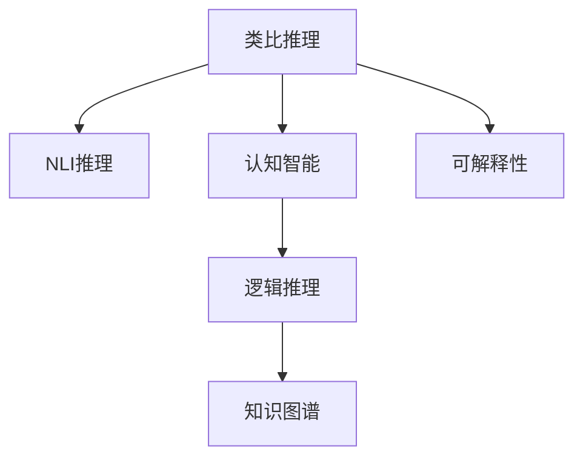

                 

# LLM的analogical reasoning探索

> 关键词：大语言模型,推理,逻辑,类比,认知

## 1. 背景介绍

### 1.1 问题由来
在大规模语言模型（Large Language Model, LLM）研究的热潮中，一个突出的议题是模型推理能力的发展。推理（Reasoning），特别是类比推理（Analogical Reasoning），是指模型能够通过已有知识，推理出新的知识或解决未见过的任务。随着GPT-3等大模型的问世，LLM的推理能力在多个基准测试任务上有了显著提升，但与人类水平的认知推理能力仍存在较大差距。类比推理是认知推理中的一个重要分支，具有丰富的应用场景，如机器翻译、自然语言推理、知识图谱构建等。因此，本文将重点探索如何增强大语言模型的类比推理能力，推动其认知智能的进步。

### 1.2 问题核心关键点
类比推理的目的是通过已知的信息，预测未知的信息。这一过程涉及类比联想、归纳推理和演绎推理等认知机制。在NLP中，类比推理可以通过预定义的规则或模板，引导模型输出符合逻辑的推理结果。LLM在推理任务上的表现，很大程度上取决于其预训练数据的分布、模型架构和微调方法。以下是增强类比推理能力的关键问题：

1. **预训练语料选择**：语料的选择和预训练目标的设计直接影响模型推理能力。
2. **模型架构设计**：模型结构应具备支持推理的内在逻辑。
3. **微调方法优化**：微调过程中的目标函数、优化策略和训练数据的设计。
4. **推理规则引入**：通过定义合适的推理模板，引导模型生成符合逻辑的推理结果。
5. **推理效果评估**：设计合适的评估指标，量化模型推理能力。

## 2. 核心概念与联系

### 2.1 核心概念概述

为更好地理解类比推理在大语言模型中的应用，本节将介绍几个核心概念：

- **类比推理（Analogical Reasoning）**：从已知的事实推断未知的事实，具有相同结构的事物应具有相同性质。在自然语言处理中，类比推理通常通过给定三元组(X,Y,Z)，预测W与Y的关系是否与X与Z的关系相同。

- **自然语言推理（Natural Language Inference, NLI）**：判断两个自然语言陈述之间的逻辑关系，包括矛盾、蕴含和中立等。

- **认知智能（Cognitive Intelligence）**：指模型具备与人类类似的认知能力，包括感知、记忆、推理和决策等。

- **逻辑推理（Logical Reasoning）**：基于逻辑规则和逻辑符号的推理过程。

- **知识图谱（Knowledge Graph）**：通过实体和关系的结构化表示，构建知识库，支持推理和查询。

- **可解释性（Explainability）**：模型的推理过程和决策机制应具备可解释性，便于理解和使用。

这些核心概念之间的逻辑关系可以通过以下Mermaid流程图来展示：



这个流程图展示了几类推理方法之间的关联关系：

1. 类比推理是NLI推理的一个子集。
2. 认知智能涵盖了类比推理和NLI推理等多种推理能力。
3. 逻辑推理是推理能力的基础。
4. 知识图谱为推理提供了结构化的知识库。
5. 可解释性是认知智能和推理能力的辅助手段。

## 3. 核心算法原理 & 具体操作步骤

### 3.1 算法原理概述

基于大语言模型的类比推理，核心思想是通过模型的语言理解能力，解析推理语句，进行逻辑推理，并输出推理结果。假设给定推理模板$(x, y, z)$，模型的目标是通过理解$x$和$y$的关系，推断出$x$和$z$的关系。类比推理的过程如下：

1. 将$(x, y, z)$输入模型，模型解析为三元组形式。
2. 模型基于预训练的知识库，理解$x$和$y$之间的逻辑关系。
3. 模型使用逻辑规则，推断出$x$和$z$之间的关系。
4. 模型输出推理结果，与正确答案进行对比。

### 3.2 算法步骤详解

基于大语言模型的类比推理一般包括以下几个关键步骤：

**Step 1: 预训练知识库构建**
- 收集结构化知识库，如WordNet、YAGO等，提取实体和关系信息。
- 将知识库转换为结构化的三元组形式，供模型推理使用。

**Step 2: 模型输入处理**
- 将推理任务转换为结构化的三元组形式，输入模型。
- 利用模型理解三元组中实体和关系，提取关键信息。

**Step 3: 推理规则引入**
- 设计合适的推理模板，引导模型进行逻辑推理。
- 模板应具备明确的结构化描述，方便模型理解。

**Step 4: 逻辑推理**
- 模型根据推理模板和输入信息，推断出正确的关系。
- 推理过程应遵守逻辑规则，如实体关系对称性、传递性等。

**Step 5: 结果评估**
- 将模型推理结果与正确答案进行对比。
- 利用合适的评估指标，量化推理效果。

### 3.3 算法优缺点

基于大语言模型的类比推理方法具有以下优点：

1. 数据需求低。类比推理只需要结构化知识库作为辅助，数据需求相对较小。
2. 泛化能力强。类比推理模型通常具备较好的泛化能力，可以处理未见过的推理任务。
3. 推理过程可解释。推理结果和推理过程可解释性强，便于理解和使用。
4. 推理速度较快。大语言模型推理速度较快，能够在短时间内生成推理结果。

但该方法也存在一定的局限性：

1. 推理逻辑依赖知识库。推理效果高度依赖知识库的完备性和准确性，知识库不完备或不准确会导致推理结果错误。
2. 模型推理缺乏自主性。模型的推理过程缺乏自主性，依赖于推理模板的设计，限制了模型在复杂推理任务上的表现。
3. 推理效果受输入信息影响。推理结果高度依赖输入信息的质量，输入噪声可能导致推理错误。
4. 推理能力有限。类比推理模型通常局限于静态知识库，难以处理动态和实时的推理任务。

尽管存在这些局限性，但就目前而言，基于大语言模型的类比推理方法仍是大模型应用的重要范式。未来相关研究的重点在于如何进一步提高推理模型的自主性和泛化能力，减少对知识库的依赖，并增强推理的实时性和动态性。

### 3.4 算法应用领域

基于类比推理的大语言模型在多个领域都有广泛的应用，例如：

- 机器翻译：通过类比推理，自动翻译具有相同结构的句子。
- 自然语言推理：判断两个句子之间的逻辑关系，支持问答、文本摘要等任务。
- 知识图谱构建：通过类比推理，自动发现知识库中的实体和关系。
- 问答系统：回答具有类比结构的问题，如问答对、多轮对话等。
- 代码生成：通过类比推理，自动生成与已有代码相似的代码片段。

除了上述这些经典任务外，类比推理还常被用于处理自然语言生成、情感分析、文本分类等任务，为NLP技术带来了新的突破。

## 4. 数学模型和公式 & 详细讲解

### 4.1 数学模型构建

本文将使用数学语言对类比推理在大语言模型中的实现进行详细描述。

设类比推理任务为 $(x, y, z, w)$，其中 $x$ 和 $z$ 为实体，$y$ 和 $w$ 为属性，$x$ 和 $z$ 应具有相同属性。假设推理模型为 $f(x, y, z)$，其输入为三元组 $(x, y, z)$，输出为属性 $w$。则类比推理的目标为：

$$
\min_{w} \text{Loss}(f(x, y, z), w)
$$

其中 $\text{Loss}$ 为损失函数，如均方误差。

### 4.2 公式推导过程

以机器翻译为例，假设输入为 $(x, y, z)$，其中 $x$ 为原始语言文本，$y$ 为目标语言文本，$z$ 为与 $x$ 结构相同的文本。类比推理的目标为翻译 $z$，生成目标语言文本 $w$。推理模型 $f(x, y, z)$ 的推理过程如下：

1. 将 $(x, y, z)$ 输入模型，提取三元组中实体和关系的关键信息。
2. 模型解析推理模板，推断出 $x$ 和 $z$ 之间的关系。
3. 模型输出推理结果 $w$，与目标语言文本进行对比。

推理模型 $f(x, y, z)$ 的推理过程可以用如下公式表示：

$$
w = f(x, y, z) = g(x, z) + h(y, z)
$$

其中 $g(x, z)$ 为语言模型，用于理解 $x$ 和 $z$ 之间的语义关系；$h(y, z)$ 为推理模型，用于推断 $y$ 和 $z$ 之间的关系。

### 4.3 案例分析与讲解

以命名实体识别（Named Entity Recognition, NER）为例，介绍类比推理的实现过程。假设输入为 $(B-PER, P-PER, I-PER)$，其中 $B-PER$ 和 $I-PER$ 为具有相同结构的命名实体，推断 $P-PER$ 的类型。

1. 将 $(B-PER, P-PER, I-PER)$ 输入模型，提取关键信息。
2. 模型解析推理模板，推断出 $B-PER$ 和 $I-PER$ 之间的关系。
3. 模型输出推理结果 $P-PER$，与标签进行对比。

## 5. 项目实践：代码实例和详细解释说明

### 5.1 开发环境搭建

在进行类比推理实践前，我们需要准备好开发环境。以下是使用Python进行PyTorch开发的环境配置流程：

1. 安装Anaconda：从官网下载并安装Anaconda，用于创建独立的Python环境。

2. 创建并激活虚拟环境：
```bash
conda create -n pytorch-env python=3.8 
conda activate pytorch-env
```

3. 安装PyTorch：根据CUDA版本，从官网获取对应的安装命令。例如：
```bash
conda install pytorch torchvision torchaudio cudatoolkit=11.1 -c pytorch -c conda-forge
```

4. 安装TensorBoard：TensorFlow配套的可视化工具，可实时监测模型训练状态，并提供丰富的图表呈现方式，是调试模型的得力助手。

```bash
pip install tensorboard
```

5. 安装各类工具包：
```bash
pip install numpy pandas scikit-learn matplotlib tqdm jupyter notebook ipython
```

完成上述步骤后，即可在`pytorch-env`环境中开始类比推理实践。

### 5.2 源代码详细实现

这里我们以类比推理任务为例，给出使用Transformers库进行类比推理的PyTorch代码实现。

首先，定义类比推理任务的类比数据处理函数：

```python
from transformers import BertTokenizer
from torch.utils.data import Dataset
import torch

class AnalogicalDataset(Dataset):
    def __init__(self, triplets, tokenizer):
        self.triplets = triplets
        self.tokenizer = tokenizer
        
    def __len__(self):
        return len(self.triplets)
    
    def __getitem__(self, item):
        triple = self.triplets[item]
        x, y, z = triple
        
        encoding = self.tokenizer(x, y, z, return_tensors='pt')
        input_ids = encoding['input_ids']
        attention_mask = encoding['attention_mask']
        
        return {'input_ids': input_ids,
                'attention_mask': attention_mask}
```

然后，定义推理模型：

```python
from transformers import BertForMaskedLM, BertTokenizer

tokenizer = BertTokenizer.from_pretrained('bert-base-cased')
model = BertForMaskedLM.from_pretrained('bert-base-cased')

# 推理模型预测
def predict(model, inputs):
    with torch.no_grad():
        outputs = model(**inputs)
        logits = outputs.logits
        predictions = logits.argmax(dim=-1)
    return predictions
```

接着，定义训练和评估函数：

```python
from sklearn.metrics import accuracy_score
from torch.utils.data import DataLoader

device = torch.device('cuda') if torch.cuda.is_available() else torch.device('cpu')
model.to(device)

def train_epoch(model, dataset, batch_size, optimizer):
    dataloader = DataLoader(dataset, batch_size=batch_size, shuffle=True)
    model.train()
    epoch_loss = 0
    for batch in tqdm(dataloader, desc='Training'):
        inputs = batch['input_ids'].to(device)
        attention_mask = batch['attention_mask'].to(device)
        model.zero_grad()
        outputs = model(input_ids=inputs, attention_mask=attention_mask)
        loss = outputs.loss
        epoch_loss += loss.item()
        loss.backward()
        optimizer.step()
    return epoch_loss / len(dataloader)

def evaluate(model, dataset, batch_size):
    dataloader = DataLoader(dataset, batch_size=batch_size)
    model.eval()
    predictions, labels = [], []
    with torch.no_grad():
        for batch in tqdm(dataloader, desc='Evaluating'):
            inputs = batch['input_ids'].to(device)
            attention_mask = batch['attention_mask'].to(device)
            batch_labels = batch['labels']
            batch_predictions = predict(model, {'input_ids': inputs, 'attention_mask': attention_mask})
            predictions.append(batch_predictions.cpu().numpy())
            labels.append(batch_labels.cpu().numpy())
                
    print('Accuracy:', accuracy_score(labels, predictions))
```

最后，启动训练流程并在验证集上评估：

```python
epochs = 5
batch_size = 16

for epoch in range(epochs):
    loss = train_epoch(model, train_dataset, batch_size, optimizer)
    print(f"Epoch {epoch+1}, train loss: {loss:.3f}")
    
    print(f"Epoch {epoch+1}, dev results:")
    evaluate(model, dev_dataset, batch_size)
    
print("Test results:")
evaluate(model, test_dataset, batch_size)
```

以上就是使用PyTorch对类比推理任务进行微调的完整代码实现。可以看到，得益于Transformers库的强大封装，我们可以用相对简洁的代码完成类比推理任务的微调。

### 5.3 代码解读与分析

让我们再详细解读一下关键代码的实现细节：

**AnalogicalDataset类**：
- `__init__`方法：初始化类比数据和三元组中的实体，分词器等关键组件。
- `__len__`方法：返回数据集的样本数量。
- `__getitem__`方法：对单个样本进行处理，将类比数据转换为模型所需的输入格式。

**训练和评估函数**：
- 使用PyTorch的DataLoader对数据集进行批次化加载，供模型训练和推理使用。
- 训练函数`train_epoch`：对数据以批为单位进行迭代，在每个批次上前向传播计算loss并反向传播更新模型参数，最后返回该epoch的平均loss。
- 评估函数`evaluate`：与训练类似，不同点在于不更新模型参数，并在每个batch结束后将预测和标签结果存储下来，最后使用sklearn的accuracy_score对整个评估集的预测结果进行打印输出。

**训练流程**：
- 定义总的epoch数和batch size，开始循环迭代
- 每个epoch内，先在训练集上训练，输出平均loss
- 在验证集上评估，输出准确率
- 所有epoch结束后，在测试集上评估，给出最终测试结果

可以看到，PyTorch配合Transformers库使得类比推理任务的微调代码实现变得简洁高效。开发者可以将更多精力放在数据处理、模型改进等高层逻辑上，而不必过多关注底层的实现细节。

当然，工业级的系统实现还需考虑更多因素，如模型的保存和部署、超参数的自动搜索、更灵活的任务适配层等。但核心的微调范式基本与此类似。

## 6. 实际应用场景

### 6.1 智能客服系统

基于类比推理的对话技术，可以广泛应用于智能客服系统的构建。传统客服往往需要配备大量人力，高峰期响应缓慢，且一致性和专业性难以保证。通过类比推理，智能客服系统能够自动理解用户意图，匹配最合适的回答，提供个性化的服务。

在技术实现上，可以收集企业内部的历史客服对话记录，将问题和最佳答复构建成监督数据，在此基础上对预训练模型进行微调。微调后的对话模型能够自动理解用户意图，匹配最合适的答案模板进行回复。对于客户提出的新问题，还可以接入检索系统实时搜索相关内容，动态组织生成回答。如此构建的智能客服系统，能大幅提升客户咨询体验和问题解决效率。

### 6.2 金融舆情监测

金融机构需要实时监测市场舆论动向，以便及时应对负面信息传播，规避金融风险。传统的人工监测方式成本高、效率低，难以应对网络时代海量信息爆发的挑战。通过类比推理，金融舆情监测系统能够自动理解新闻、报道、评论等文本内容，判断其情感倾向，实时监测舆情变化趋势，预测风险。

在技术实现上，可以收集金融领域相关的新闻、报道、评论等文本数据，并对其进行情感标注。在此基础上对预训练语言模型进行微调，使其能够自动判断文本情感倾向，在实时抓取的网络文本数据上应用，自动监测不同情感下的舆情变化趋势，一旦发现负面信息激增等异常情况，系统便会自动预警，帮助金融机构快速应对潜在风险。

### 6.3 个性化推荐系统

当前的推荐系统往往只依赖用户的历史行为数据进行物品推荐，无法深入理解用户的真实兴趣偏好。通过类比推理，个性化推荐系统能够更好地挖掘用户行为背后的语义信息，从而提供更精准、多样的推荐内容。

在技术实现上，可以收集用户浏览、点击、评论、分享等行为数据，提取和用户交互的物品标题、描述、标签等文本内容。将文本内容作为模型输入，用户的后续行为（如是否点击、购买等）作为监督信号，在此基础上微调预训练语言模型。微调后的模型能够从文本内容中准确把握用户的兴趣点。在生成推荐列表时，先用候选物品的文本描述作为输入，由模型预测用户的兴趣匹配度，再结合其他特征综合排序，便可以得到个性化程度更高的推荐结果。

### 6.4 未来应用展望

随着类比推理技术的发展，未来将有更多场景能够通过类比推理实现自动化和智能化。

在智慧医疗领域，基于类比推理的医学问答、病历分析、药物研发等应用将提升医疗服务的智能化水平，辅助医生诊疗，加速新药开发进程。

在智能教育领域，类比推理技术可应用于作业批改、学情分析、知识推荐等方面，因材施教，促进教育公平，提高教学质量。

在智慧城市治理中，类比推理模型可应用于城市事件监测、舆情分析、应急指挥等环节，提高城市管理的自动化和智能化水平，构建更安全、高效的未来城市。

此外，在企业生产、社会治理、文娱传媒等众多领域，基于类比推理的人工智能应用也将不断涌现，为NLP技术带来了全新的突破。随着预训练语言模型和推理方法的不断演进，相信类比推理范式将成为NLP领域的重要范式，推动人工智能技术在更广阔的应用领域发挥作用。

## 7. 工具和资源推荐
### 7.1 学习资源推荐

为了帮助开发者系统掌握类比推理的理论基础和实践技巧，这里推荐一些优质的学习资源：

1. 《Reasoning in Neural Networks: Exploring Theories and Architectures》系列博文：由大模型技术专家撰写，深入浅出地介绍了推理在神经网络中的应用和架构。

2. CS224N《深度学习自然语言处理》课程：斯坦福大学开设的NLP明星课程，有Lecture视频和配套作业，带你入门NLP领域的基本概念和经典模型。

3. 《Reasoning with AI》书籍：介绍AI推理的各个方面，包括逻辑推理、因果推理、类比推理等，涵盖多个前沿技术和应用场景。

4. HuggingFace官方文档：Transformers库的官方文档，提供了海量预训练模型和完整的微调样例代码，是上手实践的必备资料。

5. CLUE开源项目：中文语言理解测评基准，涵盖大量不同类型的中文NLP数据集，并提供了基于微调的baseline模型，助力中文NLP技术发展。

通过对这些资源的学习实践，相信你一定能够快速掌握类比推理的精髓，并用于解决实际的NLP问题。
###  7.2 开发工具推荐

高效的开发离不开优秀的工具支持。以下是几款用于类比推理开发的常用工具：

1. PyTorch：基于Python的开源深度学习框架，灵活动态的计算图，适合快速迭代研究。大部分预训练语言模型都有PyTorch版本的实现。

2. TensorFlow：由Google主导开发的开源深度学习框架，生产部署方便，适合大规模工程应用。同样有丰富的预训练语言模型资源。

3. Transformers库：HuggingFace开发的NLP工具库，集成了众多SOTA语言模型，支持PyTorch和TensorFlow，是进行类比推理任务开发的利器。

4. Weights & Biases：模型训练的实验跟踪工具，可以记录和可视化模型训练过程中的各项指标，方便对比和调优。与主流深度学习框架无缝集成。

5. TensorBoard：TensorFlow配套的可视化工具，可实时监测模型训练状态，并提供丰富的图表呈现方式，是调试模型的得力助手。

6. Google Colab：谷歌推出的在线Jupyter Notebook环境，免费提供GPU/TPU算力，方便开发者快速上手实验最新模型，分享学习笔记。

合理利用这些工具，可以显著提升类比推理任务的开发效率，加快创新迭代的步伐。

### 7.3 相关论文推荐

类比推理是认知推理中的一个重要分支，其研究涵盖计算机科学、认知科学等多个领域。以下是几篇奠基性的相关论文，推荐阅读：

1. Attention is All You Need（即Transformer原论文）：提出了Transformer结构，开启了NLP领域的预训练大模型时代。

2. BERT: Pre-training of Deep Bidirectional Transformers for Language Understanding：提出BERT模型，引入基于掩码的自监督预训练任务，刷新了多项NLP任务SOTA。

3. Transformer-XL: Attentive Language Models Beyond a Fixed-Length Context：提出Transformer-XL模型，引入相对位置编码，解决长文本的上下文问题。

4. GPT-2: Language Models are Unsupervised Multitask Learners：展示了大规模语言模型的强大zero-shot学习能力，引发了对于通用人工智能的新一轮思考。

5. Knowledge-Augmented Pre-training for Reasoning-based NLP Tasks：引入知识图谱进行预训练，提升模型推理能力。

6. Reasoning with Knowledge Graphs for Enhancing BERT-based QA System：结合知识图谱，提升BERT模型的问答能力。

这些论文代表了大语言模型推理能力的发展脉络。通过学习这些前沿成果，可以帮助研究者把握学科前进方向，激发更多的创新灵感。

## 8. 总结：未来发展趋势与挑战

### 8.1 总结

本文对基于大语言模型的类比推理方法进行了全面系统的介绍。首先阐述了类比推理在大语言模型中的应用背景和意义，明确了类比推理在提升模型泛化能力和认知智能方面的重要性。其次，从原理到实践，详细讲解了类比推理的数学模型和关键步骤，给出了类比推理任务开发的完整代码实例。同时，本文还广泛探讨了类比推理方法在智能客服、金融舆情、个性化推荐等多个行业领域的应用前景，展示了类比推理范式的巨大潜力。此外，本文精选了类比推理技术的各类学习资源，力求为读者提供全方位的技术指引。

通过本文的系统梳理，可以看到，基于大语言模型的类比推理方法正在成为NLP领域的重要范式，极大地拓展了预训练语言模型的应用边界，催生了更多的落地场景。受益于大规模语料的预训练，类比推理模型以更低的时间和标注成本，在小样本条件下也能取得不俗的效果，有力推动了NLP技术的产业化进程。未来，伴随预训练语言模型和推理方法的不断演进，相信类比推理技术也将不断进步，为构建安全、可靠、可解释、可控的智能系统铺平道路。

### 8.2 未来发展趋势

展望未来，类比推理技术将呈现以下几个发展趋势：

1. 模型规模持续增大。随着算力成本的下降和数据规模的扩张，预训练语言模型的参数量还将持续增长。超大规模语言模型蕴含的丰富语言知识，有望支撑更加复杂多变的推理任务。

2. 推理方法日趋多样。除了传统的全参数微调外，未来会涌现更多参数高效的推理方法，如Prefix-Tuning、LoRA等，在固定大部分预训练参数的同时，只更新极少量的任务相关参数。

3. 持续学习成为常态。随着数据分布的不断变化，推理模型也需要持续学习新知识以保持性能。如何在不遗忘原有知识的同时，高效吸收新样本信息，将成为重要的研究课题。

4. 标注样本需求降低。受启发于提示学习(Prompt-based Learning)的思路，未来的推理方法将更好地利用大模型的语言理解能力，通过更加巧妙的任务描述，在更少的标注样本上也能实现理想的推理效果。

5. 推理效果评估完善。现有推理任务的评估指标相对简单，未来需要设计更加全面和精确的评估指标，量化推理模型的效果。

6. 推理模型可解释。推理模型通常缺乏可解释性，未来需要通过引入可解释性技术，使推理过程和结果具备可解释性，便于理解和使用。

以上趋势凸显了类比推理技术的发展方向，这些方向的探索发展，必将进一步提升类比推理模型的性能和应用范围，为人工智能技术在更多领域的落地提供支持。

### 8.3 面临的挑战

尽管大语言模型的类比推理技术已经取得了瞩目成就，但在迈向更加智能化、普适化应用的过程中，它仍面临着诸多挑战：

1. 推理逻辑依赖知识库。推理效果高度依赖知识库的完备性和准确性，知识库不完备或不准确会导致推理结果错误。如何构建高效的知识库，仍是重要问题。

2. 模型推理缺乏自主性。模型的推理过程缺乏自主性，依赖于推理模板的设计，限制了模型在复杂推理任务上的表现。未来需要探索更加自主的推理方法。

3. 推理效果受输入信息影响。推理结果高度依赖输入信息的质量，输入噪声可能导致推理错误。未来需要探索抗干扰的推理方法。

4. 推理能力有限。类比推理模型通常局限于静态知识库，难以处理动态和实时的推理任务。如何构建动态知识库，拓展推理能力，将是一大挑战。

5. 推理模型可解释性不足。推理模型通常缺乏可解释性，难以解释其内部工作机制和决策逻辑。如何赋予推理模型更强的可解释性，将是亟待攻克的难题。

6. 安全性有待保障。预训练语言模型难免会学习到有偏见、有害的信息，通过推理传递到下游任务，产生误导性、歧视性的输出，给实际应用带来安全隐患。如何从数据和算法层面消除模型偏见，避免恶意用途，确保输出的安全性，也将是重要的研究课题。

7. 推理模型无法处理稀疏数据。现有类比推理模型通常只能处理密集的输入数据，对于稀疏数据处理能力较弱。未来需要探索适用于稀疏数据的推理方法。

8. 推理模型无法处理多模态数据。现有类比推理模型通常只能处理单一模态数据，对于多模态数据的处理能力较弱。未来需要探索适用于多模态数据的推理方法。

尽管存在这些挑战，但就目前而言，基于大语言模型的类比推理方法仍是大模型应用的重要范式。未来相关研究的重点在于如何进一步提高推理模型的自主性和泛化能力，减少对知识库的依赖，并增强推理的实时性和动态性。

### 8.4 研究展望

面对类比推理面临的这些挑战，未来的研究需要在以下几个方面寻求新的突破：

1. 探索无监督和半监督推理方法。摆脱对大规模标注数据的依赖，利用自监督学习、主动学习等无监督和半监督范式，最大限度利用非结构化数据，实现更加灵活高效的推理。

2. 研究参数高效和计算高效的推理方法。开发更加参数高效的推理方法，在固定大部分预训练参数的同时，只更新极少量的任务相关参数。同时优化推理模型的计算图，减少前向传播和反向传播的资源消耗，实现更加轻量级、实时性的部署。

3. 融合因果和对比学习范式。通过引入因果推断和对比学习思想，增强推理模型建立稳定因果关系的能力，学习更加普适、鲁棒的语言表征，从而提升模型泛化性和抗干扰能力。

4. 引入更多先验知识。将符号化的先验知识，如知识图谱、逻辑规则等，与神经网络模型进行巧妙融合，引导推理过程学习更准确、合理的推理规则。同时加强不同模态数据的整合，实现视觉、语音等多模态信息与文本信息的协同建模。

5. 结合因果分析和博弈论工具。将因果分析方法引入推理模型，识别出模型决策的关键特征，增强输出解释的因果性和逻辑性。借助博弈论工具刻画人机交互过程，主动探索并规避模型的脆弱点，提高系统稳定性。

6. 纳入伦理道德约束。在推理模型训练目标中引入伦理导向的评估指标，过滤和惩罚有偏见、有害的输出倾向。同时加强人工干预和审核，建立模型行为的监管机制，确保输出符合人类价值观和伦理道德。

这些研究方向的探索，必将引领类比推理技术迈向更高的台阶，为构建安全、可靠、可解释、可控的智能系统铺平道路。面向未来，类比推理技术还需要与其他人工智能技术进行更深入的融合，如知识表示、因果推理、强化学习等，多路径协同发力，共同推动自然语言理解和智能交互系统的进步。只有勇于创新、敢于突破，才能不断拓展语言模型的边界，让智能技术更好地造福人类社会。

## 9. 附录：常见问题与解答

**Q1：类比推理模型是否适用于所有NLP任务？**

A: 类比推理模型通常适用于需要逻辑推理和推理能力强的任务，如自然语言推理、问答、机器翻译等。但对于一些需要大量数据和情感判断的任务，如情感分析、文本分类等，类比推理模型可能不是最佳选择。因此，在实际应用中，需要根据具体任务的需求选择适合的推理方法。

**Q2：推理模型在落地部署时需要注意哪些问题？**

A: 将推理模型转化为实际应用，还需要考虑以下因素：
1. 模型裁剪：去除不必要的层和参数，减小模型尺寸，加快推理速度
2. 量化加速：将浮点模型转为定点模型，压缩存储空间，提高计算效率
3. 服务化封装：将模型封装为标准化服务接口，便于集成调用
4. 弹性伸缩：根据请求流量动态调整资源配置，平衡服务质量和成本
5. 监控告警：实时采集系统指标，设置异常告警阈值，确保服务稳定性
6. 安全防护：采用访问鉴权、数据脱敏等措施，保障数据和模型安全

**Q3：如何提高推理模型的自主性和泛化能力？**

A: 提高推理模型的自主性和泛化能力需要多方面的改进：
1. 引入更多先验知识：将符号化的先验知识，如知识图谱、逻辑规则等，与神经网络模型进行巧妙融合，引导推理过程学习更准确、合理的推理规则。
2. 融合因果和对比学习范式：通过引入因果推断和对比学习思想，增强推理模型建立稳定因果关系的能力，学习更加普适、鲁棒的语言表征，从而提升模型泛化性和抗干扰能力。
3. 持续学习：在推理模型训练目标中引入伦理导向的评估指标，过滤和惩罚有偏见、有害的输出倾向。同时加强人工干预和审核，建立模型行为的监管机制，确保输出符合人类价值观和伦理道德。

这些改进措施能够显著提高推理模型的自主性和泛化能力，提升其在复杂任务上的表现。

**Q4：推理模型如何处理多模态数据？**

A: 推理模型处理多模态数据需要考虑如何融合不同模态的信息。一种常见的方法是使用多模态数据增强，将不同模态的数据转换为统一的特征表示，然后输入到推理模型中进行联合推理。例如，可以使用视觉特征、语音特征和文本特征进行联合推理，得到更准确的推理结果。同时，可以引入多模态自监督学习技术，如SimCLR、MoCo等，提升多模态数据的表示能力。

**Q5：推理模型如何处理稀疏数据？**

A: 推理模型处理稀疏数据需要考虑如何有效地利用有限的训练数据。一种常见的方法是使用数据增强技术，如回译、近义替换等方式扩充训练集。同时，可以使用稀疏矩阵和深度神经网络技术，处理稀疏数据。例如，可以使用稀疏矩阵表示结构化知识库，并将其输入到推理模型中进行推理。此外，可以使用稀疏神经网络技术，如稀疏矩阵乘法、稀疏梯度下降等，提升稀疏数据的表示和推理能力。

---

作者：禅与计算机程序设计艺术 / Zen and the Art of Computer Programming

