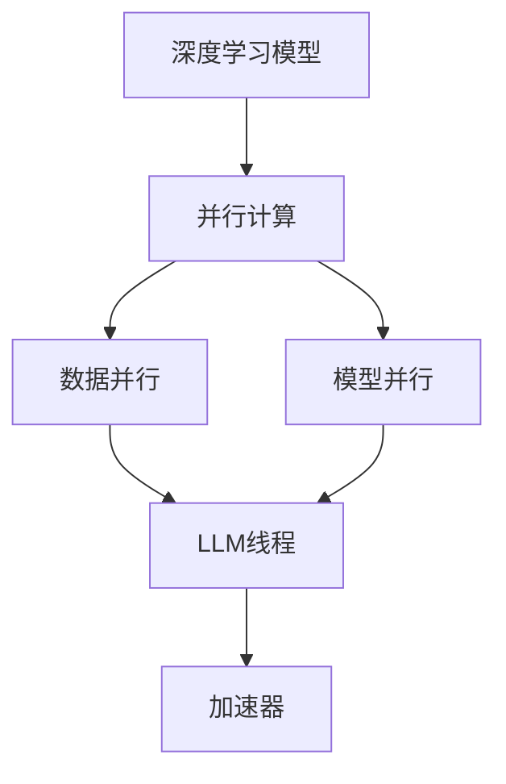

                 

# LLM线程:并行推理的执行单元

> 关键词：LLM线程,并行推理,执行单元,深度学习,加速器

## 1. 背景介绍

### 1.1 问题由来
随着深度学习模型的复杂度不断提升，模型推理成为计算机视觉、自然语言处理等AI应用中的性能瓶颈。特别是大模型如BERT、GPT等，推理速度慢、内存占用大，严重影响了应用的实时性。在视觉和语音处理等任务中，推理的延迟和响应时间也成为用户体验的短板。

### 1.2 问题核心关键点
为了解决上述问题，学术界和产业界纷纷探索并行推理技术，以提高模型推理效率。其中，LLM线程(LLM Threads)作为一种新兴的并行推理方案，成为近年来的热门研究方向。LLM线程旨在利用现代加速器如GPU、TPU的并行计算能力，将大模型推理任务分解为多个子任务，在多个线程中并行计算，从而显著提高推理速度。

## 2. 核心概念与联系

### 2.1 核心概念概述

为更好地理解LLM线程，本节将介绍几个密切相关的核心概念：

- **LLM线程(LLM Threads)**：一种基于深度学习模型的并行推理技术，通过将模型推理任务分解为多个子任务，在多个线程中并行计算，提高推理速度。
- **深度学习模型(Deep Learning Models)**：如卷积神经网络(CNN)、循环神经网络(RNN)、变分自编码器(Generative Adversarial Networks, GANs)等，通过多层非线性变换，学习输入数据的复杂表示。
- **并行计算(Parallel Computing)**：利用多个处理器同时执行相同或不同的任务，提高计算速度和效率。
- **加速器(Accelerator)**：如GPU、TPU等，通过硬件并行和优化，大大提升深度学习模型的推理速度。
- **数据并行(Data Parallelism)**：将一个大数据集拆分成多个子集，分配给多个计算节点，每个节点独立计算各自的数据子集。
- **模型并行(Model Parallelism)**：将模型分成多个片段，在多个处理器上并行计算，共享模型参数。
- **数据并行和模型并行的结合**：采用混合并行模式，利用数据并行和模型并行的优势，提高并行推理效率。

这些核心概念之间的逻辑关系可以通过以下Mermaid流程图来展示：



这个流程图展示了大模型推理的并行计算流程：

1. 将深度学习模型作为推理任务。
2. 并行计算分为数据并行和模型并行两种形式。
3. 数据并行和模型并行结合，即LLM线程。
4. 利用现代加速器进行并行推理。

## 3. 核心算法原理 & 具体操作步骤
### 3.1 算法原理概述

LLM线程的算法原理基于深度学习模型的数据并行和模型并行思想。通过将模型推理任务分解为多个子任务，利用多个处理器同时计算，从而提高推理效率。具体而言，LLM线程的工作流程如下：

1. 将模型拆分为多个计算单元(Threads)。
2. 每个计算单元接收一部分输入数据，进行模型前向和后向计算。
3. 计算单元间的中间结果和最终输出进行同步更新。
4. 最终输出通过模型合并策略进行组合，形成最终的推理结果。

### 3.2 算法步骤详解

以下是LLM线程的具体操作步骤：

**Step 1: 模型拆分**
- 将大模型按照计算单元划分为多个线程，每个线程独立计算。
- 常见拆分策略包括按照层级拆分、按照任务拆分、按照特征图拆分等。

**Step 2: 并行计算**
- 利用现代加速器如GPU、TPU进行并行计算，每个计算单元在各自线程中进行推理。
- 将输入数据切分为多个子数据集，分配给不同的线程。

**Step 3: 中间结果同步**
- 在并行计算过程中，各计算单元的中间结果需要同步更新，确保模型参数的一致性。
- 常见同步策略包括全同步、异步同步、参数服务器等。

**Step 4: 模型合并**
- 各线程的最终推理结果通过模型合并策略进行组合，形成最终的输出。
- 常见合并策略包括模型拼接、特征图融合、多尺度融合等。

**Step 5: 性能优化**
- 对计算单元进行性能优化，如任务调度、内存管理、负载均衡等，进一步提升并行推理效率。

### 3.3 算法优缺点

LLM线程技术具有以下优点：

1. **加速推理**：通过并行计算，显著提高大模型的推理速度，满足实时应用的需求。
2. **提高资源利用率**：充分利用现代加速器的计算能力，最大化硬件资源的利用率。
3. **灵活性高**：适用于多种深度学习模型，支持数据并行和模型并行的混合并行模式。
4. **兼容性强**：兼容主流深度学习框架，如TensorFlow、PyTorch等，易于集成部署。

同时，LLM线程也存在一些缺点：

1. **同步开销大**：并行计算过程中需要频繁的同步更新，带来额外的通信开销。
2. **负载不均衡**：模型结构复杂，数据分布不均，可能导致某些计算单元负载过重。
3. **内存占用高**：并行推理需要分配更多的内存资源，可能面临内存不足的问题。
4. **调试复杂**：并行计算模型结构复杂，调试和排错难度较大。

尽管存在这些缺点，但总体而言，LLM线程在大模型推理中的应用前景广阔，是提高推理性能的重要手段。

### 3.4 算法应用领域

LLM线程技术已经在多个领域得到广泛应用，以下是几个典型场景：

1. **计算机视觉**：图像分类、目标检测、图像分割等任务中，利用GPU、TPU进行并行推理，提高处理速度。
2. **自然语言处理**：文本分类、语言模型、对话生成等任务中，采用LLM线程提高推理效率，满足实时应用需求。
3. **语音识别**：语音转文本、语音指令识别等任务中，通过并行计算加速模型推理，提高响应速度。
4. **推荐系统**：用户画像生成、推荐排序等任务中，利用LLM线程提高计算效率，提升推荐精度。
5. **游戏AI**：实时决策、路径规划等任务中，通过并行推理加快游戏AI的响应速度，提升游戏体验。

## 4. 数学模型和公式 & 详细讲解 & 举例说明

### 4.1 数学模型构建

在本节中，我们将使用数学语言对LLM线程的并行推理过程进行更加严格的刻画。

假设深度学习模型为 $M:\mathcal{X} \rightarrow \mathcal{Y}$，其中 $\mathcal{X}$ 为输入空间，$\mathcal{Y}$ 为输出空间。

设 $D=\{(x_i,y_i)\}_{i=1}^N$ 为模型的训练集， $T=\{(x_t)\}_{t=1}^M$ 为模型推理任务的数据集。

LLM线程的推理模型可以表示为：

$$
M_T(x) = \frac{1}{M} \sum_{t=1}^M M_t(x)
$$

其中 $M_t$ 表示第 $t$ 个计算单元，$x$ 表示输入数据。

### 4.2 公式推导过程

**推导1：模型拆分与数据并行**

设 $D_t=\{(x_{ti},y_{ti})\}_{i=1}^{N_t}$ 为第 $t$ 个计算单元的训练集。将模型 $M$ 拆分为 $M_1, M_2, \dots, M_M$，每个计算单元接收部分训练数据 $D_t$，进行局部模型训练。

训练过程可以表示为：

$$
M_t \leftarrow M_t - \eta \nabla_{M_t} \mathcal{L}(D_t)
$$

其中 $\eta$ 为学习率，$\mathcal{L}$ 为损失函数，$\nabla_{M_t} \mathcal{L}(D_t)$ 表示对第 $t$ 个计算单元的损失函数对模型参数的梯度。

**推导2：并行计算与同步更新**

在并行推理过程中，每个计算单元 $M_t$ 对输入数据 $x_t$ 进行局部推理，得到中间结果 $y_t = M_t(x_t)$。

为保证各计算单元的输出一致，需要进行同步更新，更新策略可以表示为：

$$
y_t \leftarrow \frac{1}{M} \sum_{t'=1}^M y_{t'}
$$

**推导3：模型合并与输出**

最终输出 $y$ 可以通过模型合并策略进行组合，常见策略包括：

- **模型拼接**：直接将各计算单元的输出拼接成最终的推理结果。
- **特征图融合**：将各计算单元的特征图进行融合，生成最终的输出。
- **多尺度融合**：将不同尺度下的输出进行融合，提高推理的鲁棒性。

### 4.3 案例分析与讲解

假设我们有一个包含100万个参数的BERT模型，需要进行图像分类任务。我们可以将模型拆分为10个计算单元，每个单元接收10万个参数，并在GPU上进行并行推理。

**Step 1: 模型拆分**

将BERT模型拆分为10个计算单元，每个单元负责计算模型的一部分参数。

**Step 2: 并行计算**

在每个计算单元上分别计算输入数据，利用GPU并行加速，提高计算速度。

**Step 3: 中间结果同步**

在每个计算单元计算完中间结果后，通过同步更新策略进行结果合并，确保最终输出的正确性。

**Step 4: 模型合并**

将各计算单元的输出进行拼接或融合，得到最终的推理结果。

## 5. 项目实践：代码实例和详细解释说明

### 5.1 开发环境搭建

在进行LLM线程实践前，我们需要准备好开发环境。以下是使用Python进行TensorFlow开发的环境配置流程：

1. 安装Anaconda：从官网下载并安装Anaconda，用于创建独立的Python环境。

2. 创建并激活虚拟环境：
```bash
conda create -n tensorflow-env python=3.8 
conda activate tensorflow-env
```

3. 安装TensorFlow：根据CUDA版本，从官网获取对应的安装命令。例如：
```bash
conda install tensorflow tensorflow-gpu -c conda-forge
```

4. 安装TensorFlow Addons：安装一些TensorFlow扩展库，如TensorFlow Model Parallelism(TensorFlow Model Parallelism, TMP)、TensorFlow Parameter Server(TensorFlow Parameter Server, TPS)等。
```bash
pip install tensorflow-addons
```

5. 安装各类工具包：
```bash
pip install numpy pandas scikit-learn matplotlib tqdm jupyter notebook ipython
```

完成上述步骤后，即可在`tensorflow-env`环境中开始LLM线程实践。

### 5.2 源代码详细实现

下面我们以图像分类任务为例，给出使用TensorFlow Addons对BERT模型进行LLM线程的PyTorch代码实现。

首先，定义BERT模型的计算单元：

```python
import tensorflow_addons as addons

# 定义计算单元
class CalculationUnit:
    def __init__(self, model, learning_rate, loss_fn):
        self.model = model
        self.learning_rate = learning_rate
        self.loss_fn = loss_fn
        self.train_step = 0

    def calculate(self, inputs):
        # 进行前向计算
        with tf.GradientTape() as tape:
            outputs = self.model(inputs)
            loss = self.loss_fn(outputs, inputs['labels'])
        gradients = tape.gradient(loss, self.model.trainable_variables)
        self.model.apply_gradients(zip(gradients, self.model.trainable_variables))
        self.train_step += 1
        return outputs
```

然后，定义模型并行计算的同步策略：

```python
# 定义同步策略
class SyncStrategy(addons.strategy.collective_all_reduce_strategy.CollectiveAllReduceStrategy):
    def run(self, strategy_run_fn, arguments=None):
        outputs = []
        for unit in strategy_run_fn:
            outputs.append(unit.calculate(arguments))
        return strategy_run_fn([outputs[i] for i in range(len(strategy_run_fn))])
```

接着，定义模型并行计算的训练函数：

```python
# 定义训练函数
def train_model(model, data, strategy):
    step = 0
    while step < num_epochs:
        batch = data.train.next()
        strategy.run(lambda: model.train(batch))
        step += 1
```

最后，启动训练流程并在测试集上评估：

```python
# 定义模型和数据集
model = tf.keras.Sequential([
    addons.layers.hubert.BERT(max_seq_length=128),
    tf.keras.layers.Dense(num_classes, activation='softmax')
])
data = tf.data.Dataset.from_tensor_slices((inputs, labels)).batch(batch_size)

# 定义LLM线程计算单元
units = []
for _ in range(10):
    units.append(CalculationUnit(model, learning_rate, loss_fn))

# 定义同步策略
strategy = SyncStrategy(replica_context=multi_device_context, num_replicas_in_sync=10)

# 启动训练
train_model(model, data, strategy)

# 在测试集上评估
test_loss, test_acc = model.evaluate(test_data)
print(f'Test loss: {test_loss}, Test accuracy: {test_acc}')
```

以上就是使用TensorFlow Addons对BERT模型进行LLM线程的完整代码实现。可以看到，利用TensorFlow Addons的模型并行计算功能，可以很方便地实现多个计算单元的并行计算，并通过同步策略保证输出的一致性。

### 5.3 代码解读与分析

让我们再详细解读一下关键代码的实现细节：

**CalculationUnit类**：
- 定义了一个计算单元类，包含模型的局部计算、梯度更新和训练步数等信息。
- 通过继承TensorFlow Addons的`collective_all_reduce_strategy`策略，实现模型并行计算和同步更新。

**SyncStrategy类**：
- 继承TensorFlow Addons的`CollectiveAllReduceStrategy`策略，实现多计算单元的同步更新。
- 通过`run`方法调用`calculation_unit.calculate`方法进行计算，并通过`collective_all_reduce`策略进行同步更新。

**train_model函数**：
- 定义了模型并行计算的训练函数，利用`strategy.run`方法进行模型并行计算和同步更新。

**训练流程**：
- 首先，创建10个计算单元，每个单元独立计算模型的一部分参数。
- 定义同步策略，将10个计算单元进行同步更新。
- 启动训练，在数据集上迭代训练模型，更新每个计算单元的参数。
- 在测试集上评估模型性能，输出训练结果。

可以看到，TensorFlow Addons为模型并行计算提供了方便的封装，利用其强大的分布式计算能力，可以轻松实现LLM线程的并行推理。

当然，工业级的系统实现还需考虑更多因素，如模型的裁剪、压缩、动态调整资源等。但核心的并行计算逻辑基本与此类似。

## 6. 实际应用场景

### 6.1 智能推理引擎

在自动驾驶、智能监控、医疗影像等领域，实时推理速度和计算能力是决定应用体验的关键因素。利用LLM线程技术，可以将大模型推理任务进行并行计算，加速推理过程，提升系统响应速度。

例如，在自动驾驶中，将车辆传感器数据输入模型进行实时推理，判断道路情况和交通信号，快速做出决策。通过并行推理，可以有效降低推理时间，提高决策的实时性和准确性。

### 6.2 智能客服系统

智能客服系统需要快速响应用户请求，提供优质的客服体验。利用LLM线程技术，可以将用户输入数据进行并行推理，生成自然流畅的回复，满足用户的实时需求。

在智能客服系统中，将用户输入的数据输入BERT等大模型，进行并行推理，生成回答。通过并行计算，可以显著提高回复的速度和准确性，提升用户体验。

### 6.3 游戏AI

在实时决策类游戏如《DOTA2》、《星际争霸2》中，AI的计算速度和决策能力直接决定游戏结果。利用LLM线程技术，可以提高AI的推理速度，提升游戏AI的竞争力。

例如，在《DOTA2》中，AI需要对游戏中的地图、英雄、技能等信息进行实时推理，快速做出决策。通过并行推理，可以有效提升AI的响应速度和决策质量，增强游戏AI的对抗性。

### 6.4 未来应用展望

随着LLM线程技术的不断发展，其在更多领域的应用前景广阔。

在智慧城市治理中，利用LLM线程技术进行实时数据分析、智能调度，提升城市管理的智能化水平。例如，在交通管理中，通过并行推理进行实时路况分析，优化交通信号灯控制，减少交通拥堵。

在智能制造中，利用LLM线程技术进行实时监控、故障诊断，提升生产效率和设备维护水平。例如，在生产线上，通过并行推理进行实时质量检测和故障预测，及时发现问题并进行修复。

在智能家居中，利用LLM线程技术进行实时语音交互、场景理解，提升用户体验。例如，在智能音箱中，通过并行推理进行实时语音识别和回复，快速响应用户需求。

## 7. 工具和资源推荐
### 7.1 学习资源推荐

为了帮助开发者系统掌握LLM线程的理论基础和实践技巧，这里推荐一些优质的学习资源：

1. **《深度学习与并行计算》**：一本介绍深度学习模型并行计算的经典书籍，涵盖了数据并行、模型并行、混合并行等各类并行计算方法。
2. **《TensorFlow并行计算》**：由Google官方编写的TensorFlow并行计算指南，详细介绍了TensorFlow的并行计算功能及其应用。
3. **《深度学习框架并行化》**：一本介绍深度学习框架并行计算的实用书籍，涵盖PyTorch、TensorFlow等主流框架的并行计算实现。
4. **TensorFlow Addons官方文档**：TensorFlow Addons官方文档，提供了丰富的模型并行计算、分布式训练等功能，是学习LLM线程的必备资料。

通过对这些资源的学习实践，相信你一定能够快速掌握LLM线程的精髓，并用于解决实际的深度学习推理问题。

### 7.2 开发工具推荐

高效的开发离不开优秀的工具支持。以下是几款用于LLM线程开发的常用工具：

1. **TensorFlow**：由Google主导开发的深度学习框架，提供强大的分布式计算能力和模型并行计算功能。
2. **PyTorch**：由Facebook主导开发的深度学习框架，灵活的动态计算图支持并行计算和分布式训练。
3. **TensorFlow Addons**：Google开源的TensorFlow扩展库，提供丰富的模型并行计算、分布式训练等功能。
4. **PyTorch Lightning**：PyTorch的分布式训练库，提供便捷的分布式训练功能，简化并行计算开发。
5. **Horovod**：Apache基金会开源的分布式训练框架，支持多种深度学习框架的并行训练。
6. **Model Parallelism**：TensorFlow Model Parallelism库，提供模型并行计算和分布式训练功能。

合理利用这些工具，可以显著提升LLM线程任务的开发效率，加快创新迭代的步伐。

### 7.3 相关论文推荐

LLM线程技术的发展源于学界的持续研究。以下是几篇奠基性的相关论文，推荐阅读：

1. **《深度学习模型的分布式训练》**：深入介绍深度学习模型的分布式训练方法，包括数据并行、模型并行、混合并行等各类并行计算方法。
2. **《TensorFlow并行计算指南》**：由Google官方编写的TensorFlow并行计算指南，详细介绍了TensorFlow的并行计算功能及其应用。
3. **《分布式深度学习模型的优化》**：介绍如何优化分布式深度学习模型的性能，包括模型并行、数据并行、混合并行等各类并行计算方法。
4. **《深度学习框架并行化》**：一本介绍深度学习框架并行计算的实用书籍，涵盖PyTorch、TensorFlow等主流框架的并行计算实现。
5. **《深度学习框架的模型并行》**：介绍如何实现深度学习框架的模型并行计算，涵盖数据并行、模型并行、混合并行等各类并行计算方法。

这些论文代表了大模型并行计算的发展脉络。通过学习这些前沿成果，可以帮助研究者把握学科前进方向，激发更多的创新灵感。

## 8. 总结：未来发展趋势与挑战

### 8.1 总结

本文对基于深度学习模型的LLM线程技术进行了全面系统的介绍。首先阐述了LLM线程的背景和重要性，明确了其在提高模型推理效率方面的独特价值。其次，从原理到实践，详细讲解了LLM线程的数学原理和关键步骤，给出了模型并行计算的完整代码实例。同时，本文还广泛探讨了LLM线程技术在多个领域的应用前景，展示了其巨大的潜力。

通过本文的系统梳理，可以看到，LLM线程技术正在成为深度学习模型推理的重要手段，极大地拓展了模型应用的边界，推动了深度学习技术的产业化进程。未来，伴随模型并行计算方法的不断演进，相信LLM线程必将在更多领域得到应用，为AI技术带来新的突破。

### 8.2 未来发展趋势

展望未来，LLM线程技术将呈现以下几个发展趋势：

1. **计算能力更强**：随着硬件设备的不断升级，LLM线程技术将拥有更强的计算能力，支持更大规模的模型并行计算。
2. **分布式系统更灵活**：利用云平台、分布式计算框架，LLM线程技术将更加灵活地支持大规模分布式系统。
3. **优化算法更先进**：新的优化算法如AdamW、Adafactor等将进一步提升LLM线程技术的性能。
4. **混合并行模式更普适**：结合数据并行和模型并行，LLM线程技术将支持更多样化的混合并行模式，提高并行计算的灵活性。
5. **参数高效微调技术结合**：利用参数高效微调技术，LLM线程技术将进一步减少计算资源消耗，提高微调效率。

这些趋势凸显了LLM线程技术的广阔前景。这些方向的探索发展，必将进一步提升深度学习模型的推理速度，推动深度学习技术的产业化应用。

### 8.3 面临的挑战

尽管LLM线程技术已经取得了瞩目成就，但在迈向更加智能化、普适化应用的过程中，它仍面临着诸多挑战：

1. **同步开销大**：并行计算过程中需要频繁的同步更新，带来额外的通信开销。如何优化同步策略，降低同步开销，是一个重要的研究方向。
2. **负载不均衡**：模型结构复杂，数据分布不均，可能导致某些计算单元负载过重。如何优化任务调度，平衡负载，也是一个重要的研究方向。
3. **内存占用高**：并行推理需要分配更多的内存资源，可能面临内存不足的问题。如何优化内存管理，降低内存占用，是一个重要的研究方向。
4. **调试复杂**：并行计算模型结构复杂，调试和排错难度较大。如何简化并行计算的调试过程，也是一个重要的研究方向。
5. **模型适应性不足**：在复杂多变的应用场景中，模型需要快速适应新的输入数据。如何增强模型的适应性，是一个重要的研究方向。

这些挑战需要进一步研究和探索，才能使LLM线程技术更加成熟和可靠。相信随着学界和产业界的共同努力，这些挑战终将一一被克服，LLM线程必将在构建高效、可靠、灵活的智能系统方面发挥越来越重要的作用。

### 8.4 研究展望

面向未来，LLM线程技术需要在以下几个方面寻求新的突破：

1. **异步同步策略**：探索异步同步策略，减少同步开销，提升并行计算效率。
2. **负载均衡算法**：开发新的负载均衡算法，平衡各计算单元的负载，提高系统性能。
3. **内存优化技术**：研究内存优化技术，如模型裁剪、压缩等，降低内存占用，提升系统可扩展性。
4. **混合并行模式**：结合数据并行和模型并行，开发更多样化的混合并行模式，提高并行计算的灵活性。
5. **分布式系统优化**：利用云平台、分布式计算框架，优化LLM线程技术的分布式系统设计，提高系统性能。
6. **可解释性增强**：探索模型推理的可解释性技术，增强模型的透明度和可信度。

这些研究方向将为LLM线程技术的未来发展提供新的思路和方法，推动深度学习技术的进一步突破。

## 9. 附录：常见问题与解答

**Q1：LLM线程是否只适用于大型深度学习模型？**

A: LLM线程不仅适用于大型深度学习模型，也适用于中小型模型。对于中小型模型，可以利用LLM线程进行并行计算，显著提升推理速度。

**Q2：LLM线程是否适用于所有深度学习框架？**

A: LLM线程技术适用于多种深度学习框架，如TensorFlow、PyTorch、MXNet等。不同框架的实现细节可能有所不同，但核心并行计算逻辑基本一致。

**Q3：LLM线程的并行计算策略有哪些？**

A: LLM线程的并行计算策略包括数据并行、模型并行、混合并行等。数据并行适用于大规模数据集，模型并行适用于复杂模型，混合并行可以结合两者的优势，灵活应用。

**Q4：LLM线程是否适合在CPU上进行并行计算？**

A: 虽然CPU可以支持并行计算，但由于CPU的计算能力较弱，利用CPU进行并行计算的效率较低，建议利用GPU、TPU等高性能加速器进行并行计算。

**Q5：LLM线程在实际应用中需要注意哪些问题？**

A: 在实际应用中，LLM线程需要考虑同步开销、负载均衡、内存占用、调试复杂性等问题。合理优化同步策略、负载均衡算法、内存管理等，可以显著提高并行计算的效率和可靠性。

以上是关于LLM线程的全面系统介绍，通过本文的学习实践，相信你一定能够掌握LLM线程的精髓，并将其应用于深度学习推理任务中。

