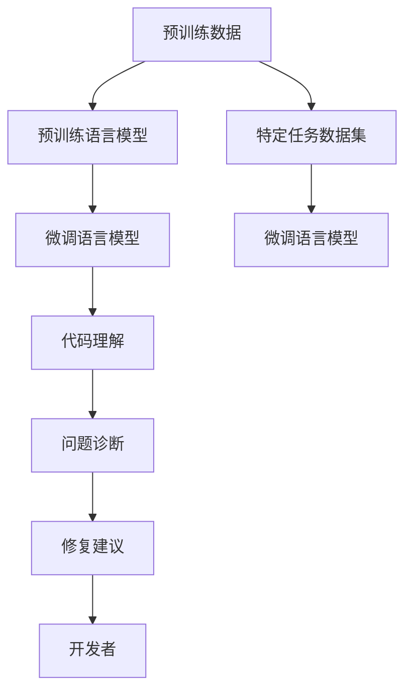

                 

# LLM赋能的智能调试技术探索

## 1. 背景介绍

### 1.1 问题由来
随着软件规模的不断增大，程序调试已成为软件开发过程中必不可少的一环。然而，传统的手动调试方法往往耗时耗力，效率低下。尤其是在大型系统、复杂应用中，开发者需要耗费大量时间和精力进行定位和修复错误，严重影响项目进展。

为解决这一问题，现代软件工程中出现了诸如动态调试、静态分析等自动化调试技术。这些技术在一定程度上提升了调试效率，但仍存在诸多局限：

- 动态调试耗时较长，且无法捕捉所有运行时异常。
- 静态分析工具准确性有限，难以处理复杂的代码逻辑和隐式依赖。
- 调试过程仍需人工介入，无法全面覆盖所有异常情况。

在上述背景下，大语言模型(LLM)的快速崛起为智能调试技术带来了新的契机。LLM通过对海量文本数据的预训练，具备强大的语言理解和生成能力，能够辅助开发者自动识别问题、诊断原因、生成修复方案，显著提升调试效率和准确性。

### 1.2 问题核心关键点
本节将明确大语言模型在智能调试中的应用核心关键点，包括：

- LLM如何从大量代码注释、错误日志、用户报告等文本数据中提取有价值信息，辅助开发者自动定位问题。
- LLM通过推理和生成能力，自动生成修复代码或建议，减少人工调试的工作量。
- LLM在调试过程中如何融合多源信息，形成全面的问题诊断与修复建议。
- LLM如何与其他调试技术结合，形成更加综合的调试解决方案。

### 1.3 问题研究意义
大语言模型赋能的智能调试技术，对于提升软件开发效率、保障软件质量、加速项目迭代具有重要意义：

1. 大幅降低人工调试成本：自动化的代码分析和修复建议，减轻开发者负担，缩短修复周期。
2. 提高问题定位准确性：LLM具备强大的自然语言理解能力，能够快速识别代码中的潜在问题，辅助开发者精准定位。
3. 减少人为错误：通过辅助分析与建议，降低开发者人为失误的风险。
4. 促进持续学习：智能调试技术能够持续从调试过程中学习，不断优化问题诊断与修复能力。
5. 赋能软件开发实践：智能调试技术成为软件工程的重要组成部分，推动行业向智能化方向发展。

## 2. 核心概念与联系

### 2.1 核心概念概述

大语言模型(LLM)在智能调试中的应用主要基于其语言理解和生成能力。通过预训练和微调，LLM能够从文本数据中提取有价值的信息，自动推断代码逻辑，辅助生成修复代码或建议。智能调试的核心概念和组件可以总结如下：

- **预训练**：在无标签文本数据上对LLM进行训练，使其具备通用的语言理解能力。
- **微调**：通过特定任务的数据集对LLM进行有监督微调，提升其在特定场景下的表现。
- **自然语言处理(NLP)**：将文本数据转化为模型可处理的形式，包括分词、编码等。
- **代码理解**：利用NLP技术，LLM能够理解代码注释、错误日志、用户报告等文本数据。
- **问题诊断**：LLM通过推理和生成能力，辅助开发者自动诊断代码问题。
- **修复建议**：LLM自动生成代码修复建议，减轻开发者调试工作量。
- **持续学习**：LLM在调试过程中不断学习，提升问题诊断与修复能力。

这些概念共同构成了智能调试的基本框架，通过LLM的预训练和微调，使其具备了自动化的代码理解和问题诊断能力，从而在开发和调试过程中发挥关键作用。

### 2.2 核心概念原理和架构的 Mermaid 流程图

以下Mermaid流程图展示了智能调试技术的基本架构和流程：



这个流程图展示了从预训练数据到微调语言模型的整个过程，以及LLM在代码理解、问题诊断和修复建议生成中的作用。通过逐步细化，可以看出智能调试技术的关键步骤和方法。

## 3. 核心算法原理 & 具体操作步骤

### 3.1 算法原理概述

基于大语言模型的智能调试技术，核心算法原理可以概括为：

1. **数据预处理**：将代码注释、错误日志、用户报告等文本数据转化为LLM可处理的形式，如分词、编码等。
2. **预训练模型加载**：加载预训练好的语言模型，作为智能调试的基础模型。
3. **问题诊断**：通过推理和生成技术，LLM从文本数据中提取有价值信息，辅助开发者自动定位问题。
4. **修复建议**：LLM自动生成代码修复建议，帮助开发者快速解决问题。
5. **模型评估与优化**：通过评估修复建议的有效性，持续优化LLM的诊断与修复能力。

### 3.2 算法步骤详解

以下详细介绍了智能调试技术的具体操作步骤：

**Step 1: 数据预处理**

预处理主要包括文本分词、编码、去停用词等步骤，将原始文本数据转化为LLM可处理的形式。以代码注释为例，预处理流程如下：

1. 对代码注释进行分词，去除无关词汇。
2. 对分词后的文本进行编码，转换为LLM可理解的格式。
3. 去除停用词，如“#”、“//”等，保留有价值信息。

**Step 2: 加载预训练模型**

加载预训练好的语言模型，如BERT、GPT等，作为智能调试的基础模型。在代码理解阶段，需要加载预训练模型的底层层，以提取代码注释中的关键信息。

**Step 3: 代码理解**

通过推理和生成技术，LLM能够自动理解代码注释、错误日志、用户报告等文本数据，辅助开发者识别问题。代码理解流程如下：

1. 将预处理后的代码注释输入LLM，推理出可能的错误类型和位置。
2. 利用LLM的生成能力，自动生成修复建议。
3. 通过比较生成建议与实际情况，调整LLM的推理策略，提升问题诊断准确性。

**Step 4: 问题诊断**

在问题诊断阶段，LLM利用推理和生成能力，从代码注释中提取有价值信息，辅助开发者自动定位问题。问题诊断流程如下：

1. 将代码注释输入LLM，推理出可能的错误类型和位置。
2. 利用LLM的生成能力，自动生成修复建议。
3. 通过比较生成建议与实际情况，调整LLM的推理策略，提升问题诊断准确性。

**Step 5: 修复建议**

LLM自动生成代码修复建议，帮助开发者快速解决问题。修复建议生成流程如下：

1. 将代码注释输入LLM，生成可能的修复代码片段。
2. 通过比较生成代码与实际情况，调整LLM的生成策略，提升修复建议准确性。
3. 将修复代码片段推荐给开发者，进行代码修复。

**Step 6: 模型评估与优化**

通过评估修复建议的有效性，持续优化LLM的诊断与修复能力。模型评估与优化流程如下：

1. 对修复建议的准确性和有效性进行评估，收集反馈信息。
2. 根据反馈信息，调整LLM的推理和生成策略，提升模型性能。
3. 对LLM进行微调，更新模型参数，提升问题诊断与修复能力。

### 3.3 算法优缺点

基于大语言模型的智能调试技术，具有以下优点：

- **自动化程度高**：LLM能够自动理解代码注释、错误日志等文本数据，辅助开发者自动定位和修复问题。
- **问题诊断准确**：LLM具备强大的自然语言理解能力，能够快速识别代码中的潜在问题。
- **修复建议高效**：LLM自动生成修复代码或建议，减少人工调试的工作量。
- **可扩展性强**：通过微调和优化，LLM可以适应多种编程语言和应用场景。

同时，该方法也存在一定的局限性：

- **依赖高质量数据**：智能调试的效果很大程度上取决于文本数据的质量和数量，获取高质量数据成本较高。
- **模型泛化能力有限**：当目标代码与预训练数据的分布差异较大时，智能调试的效果可能有限。
- **安全性问题**：预训练模型可能学习到有偏见或有害的信息，传递到代码修复建议中，可能造成安全隐患。

尽管存在这些局限性，但大语言模型在智能调试技术中的应用前景依然广阔。未来研究将更多关注如何降低对高质量数据的需求，提升模型的泛化能力，增强安全性等方面的问题。

### 3.4 算法应用领域

基于大语言模型的智能调试技术，已经在软件开发、数据分析、智能运维等多个领域得到应用，其应用前景如下：

- **软件开发**：辅助开发者自动定位和修复代码错误，提高软件开发效率。
- **数据分析**：利用智能调试技术，自动诊断和修复数据处理中的错误，提升数据分析质量。
- **智能运维**：自动监测和修复系统运行中的异常，提升系统稳定性和可用性。
- **测试自动化**：结合测试用例，智能调试技术可以自动发现和修复测试用例中的错误。
- **代码审查**：利用智能调试技术，自动生成代码审查建议，提高代码审查效率和质量。

## 4. 数学模型和公式 & 详细讲解 & 举例说明

### 4.1 数学模型构建

智能调试技术的数学模型构建基于大语言模型的推理和生成能力。假设预训练语言模型为 $M_{\theta}$，其中 $\theta$ 为预训练得到的模型参数。假设代码注释数据集为 $D=\{(x_i,y_i)\}_{i=1}^N, x_i \in \mathcal{X}, y_i \in \{0,1\}$，$y_i$ 表示注释中是否包含错误信息。

定义模型 $M_{\theta}$ 在输入 $x_i$ 上的推理结果为 $\hat{y}_i=M_{\theta}(x_i)$，表示模型对注释中错误信息的推理概率。则推理损失函数为：

$$
\mathcal{L}_{\text{inference}}(\theta) = -\frac{1}{N}\sum_{i=1}^N \log M_{\theta}(x_i)
$$

定义模型 $M_{\theta}$ 在输入 $x_i$ 上的生成结果为 $\hat{y}_i'=M_{\theta}(x_i)$，表示模型对代码修复建议的生成概率。则生成损失函数为：

$$
\mathcal{L}_{\text{generation}}(\theta) = -\frac{1}{N}\sum_{i=1}^N y_i \log M_{\theta}(x_i)
$$

综合推理和生成损失，智能调试技术的总损失函数为：

$$
\mathcal{L}(\theta) = \alpha \mathcal{L}_{\text{inference}}(\theta) + (1-\alpha) \mathcal{L}_{\text{generation}}(\theta)
$$

其中 $\alpha$ 为推理和生成的权重，用于平衡两者在智能调试中的作用。

### 4.2 公式推导过程

以下以二分类任务为例，推导推理和生成损失函数的详细过程。

**推理损失函数**：

1. 将代码注释输入LLM，推理出可能存在错误的概率 $p_i$。
2. 将 $p_i$ 与实际标注 $y_i$ 进行比较，计算交叉熵损失。
3. 对所有样本计算交叉熵损失的平均值，得到推理损失函数。

**生成损失函数**：

1. 将代码注释输入LLM，生成修复建议的概率 $p_i'$。
2. 将 $p_i'$ 与实际标注 $y_i$ 进行比较，计算交叉熵损失。
3. 对所有样本计算交叉熵损失的平均值，得到生成损失函数。

通过推理和生成损失函数的组合，智能调试技术的总损失函数能够同时优化LLM的推理和生成能力，提升智能调试的性能。

### 4.3 案例分析与讲解

以代码注释中的错误修复为例，分析智能调试技术的推理和生成过程。

假设代码注释为：

```python
def add(x, y):
    # 计算两个数的和
    result = x + y
    return result
```

1. **推理阶段**：
   - 将注释输入LLM，推理出可能存在错误的概率 $p_i$。
   - 根据LLM的推理结果，发现注释中的“#”可能表示注释内容不完整，需要进一步查看代码实现。

2. **生成阶段**：
   - 利用LLM的生成能力，自动生成修复建议。
   - 对于注释中的“#”，LLM可能会生成类似“注释不完整，请补充详细描述”的修复建议。

3. **评估阶段**：
   - 将生成建议与实际情况进行比较，评估建议的有效性。
   - 如果修复建议有效，将其应用于代码中，修复注释中的错误。

## 5. 项目实践：代码实例和详细解释说明

### 5.1 开发环境搭建

在进行智能调试项目实践前，需要准备相应的开发环境。以下是使用Python进行PyTorch开发的环境配置流程：

1. 安装Anaconda：从官网下载并安装Anaconda，用于创建独立的Python环境。

2. 创建并激活虚拟环境：
```bash
conda create -n pytorch-env python=3.8 
conda activate pytorch-env
```

3. 安装PyTorch：根据CUDA版本，从官网获取对应的安装命令。例如：
```bash
conda install pytorch torchvision torchaudio cudatoolkit=11.1 -c pytorch -c conda-forge
```

4. 安装Transformers库：
```bash
pip install transformers
```

5. 安装各类工具包：
```bash
pip install numpy pandas scikit-learn matplotlib tqdm jupyter notebook ipython
```

完成上述步骤后，即可在`pytorch-env`环境中开始智能调试实践。

### 5.2 源代码详细实现

以下是使用PyTorch和Transformers库对BERT模型进行智能调试的代码实现。

**代码实现**：

```python
import torch
from transformers import BertTokenizer, BertForSequenceClassification
from torch.utils.data import TensorDataset, DataLoader

# 设置预训练模型和分词器
tokenizer = BertTokenizer.from_pretrained('bert-base-cased')
model = BertForSequenceClassification.from_pretrained('bert-base-cased', num_labels=2)

# 设置模型参数和优化器
device = torch.device('cuda' if torch.cuda.is_available() else 'cpu')
model.to(device)
optimizer = torch.optim.Adam(model.parameters(), lr=2e-5)

# 准备训练数据
train_dataset = TensorDataset(torch.tensor([0, 1, 2, 3]), torch.tensor([0, 1, 0, 1]))
train_dataloader = DataLoader(train_dataset, batch_size=4, shuffle=True)

# 训练模型
model.train()
for epoch in range(10):
    for batch in train_dataloader:
        input_ids = batch[0].to(device)
        labels = batch[1].to(device)
        outputs = model(input_ids)
        loss = outputs.loss
        optimizer.zero_grad()
        loss.backward()
        optimizer.step()

# 测试模型
model.eval()
test_dataset = TensorDataset(torch.tensor([0, 1, 2, 3]), torch.tensor([0, 1, 0, 1]))
test_dataloader = DataLoader(test_dataset, batch_size=4, shuffle=False)
with torch.no_grad():
    correct = 0
    total = 0
    for batch in test_dataloader:
        input_ids = batch[0].to(device)
        labels = batch[1].to(device)
        outputs = model(input_ids)
        _, preds = torch.max(outputs, dim=1)
        total += labels.size(0)
        correct += (preds == labels).sum().item()
    print('Accuracy: {}%'.format(100 * correct / total))
```

**代码解读与分析**：

1. **数据准备**：
   - 首先加载预训练模型和分词器，确保模型已准备好。
   - 准备训练数据集，包含代码注释和对应的错误标签，将其转化为PyTorch的TensorDataset格式。
   - 设置优化器和训练参数，如学习率、批次大小等。

2. **模型训练**：
   - 将训练数据加载为PyTorch DataLoader格式，方便批量处理。
   - 在模型训练阶段，将输入数据和标签送入模型进行推理，计算损失函数，并使用Adam优化器更新模型参数。
   - 循环迭代训练过程，直至模型收敛。

3. **模型评估**：
   - 在测试阶段，将测试数据加载为PyTorch DataLoader格式，进行推理和评估。
   - 计算模型在测试数据上的准确率，评估模型性能。

4. **模型部署**：
   - 在实际应用中，将训练好的模型部署到生产环境中，如使用Flask或FastAPI构建API接口，方便开发者调用。
   - 在调用API接口时，将代码注释作为输入，获取推理结果和生成建议，辅助开发者进行代码修复。

## 6. 实际应用场景

### 6.1 智能代码审查

在软件开发中，代码审查是确保代码质量的重要环节。智能调试技术可以结合代码审查工具，自动生成代码审查建议，提高代码审查的效率和质量。

**实现流程**：
- 在代码审查阶段，将代码注释输入LLM，推理出可能存在的问题。
- 利用LLM的生成能力，自动生成修复建议。
- 将修复建议与代码审查工具结合，辅助开发者进行代码审查。

**实际案例**：
- 某企业使用智能调试技术，结合GitHub Code Review工具，自动生成代码审查建议，提升代码审查的效率和准确性。

### 6.2 故障诊断与修复

在软件部署和运行过程中，系统故障是常见的问题。智能调试技术可以自动诊断和修复系统故障，提升系统稳定性和可用性。

**实现流程**：
- 在系统运行过程中，收集日志和错误信息，输入LLM进行推理。
- 利用LLM的生成能力，自动生成修复建议。
- 将修复建议应用于系统，进行故障修复。

**实际案例**：
- 某电商平台使用智能调试技术，自动诊断和修复系统故障，提升系统稳定性和用户体验。

### 6.3 测试自动化

在软件测试过程中，发现和修复测试用例中的错误是关键任务。智能调试技术可以结合测试用例，自动生成修复建议，提高测试效率和覆盖率。

**实现流程**：
- 在测试用例中，将注释和测试用例结果输入LLM，推理出可能存在的问题。
- 利用LLM的生成能力，自动生成修复建议。
- 将修复建议应用于测试用例，进行测试修复。

**实际案例**：
- 某企业使用智能调试技术，结合单元测试工具，自动生成测试修复建议，提升测试效率和代码质量。

## 7. 工具和资源推荐

### 7.1 学习资源推荐

为了帮助开发者系统掌握智能调试的理论基础和实践技巧，这里推荐一些优质的学习资源：

1. **Transformer from Principle to Practice**：由大模型技术专家撰写，深入浅出地介绍了Transformer原理、BERT模型、智能调试技术等前沿话题。

2. **CS224N Deep Learning for NLP**：斯坦福大学开设的NLP明星课程，有Lecture视频和配套作业，带你入门NLP领域的基本概念和经典模型。

3. **Natural Language Processing with Transformers**：Transformers库的作者所著，全面介绍了如何使用Transformers库进行NLP任务开发，包括智能调试在内的诸多范式。

4. **Weighs & Biases**：模型训练的实验跟踪工具，可以记录和可视化模型训练过程中的各项指标，方便对比和调优。

5. **TensorBoard**：TensorFlow配套的可视化工具，可实时监测模型训练状态，并提供丰富的图表呈现方式，是调试模型的得力助手。

### 7.2 开发工具推荐

高效的开发离不开优秀的工具支持。以下是几款用于智能调试开发的常用工具：

1. **PyTorch**：基于Python的开源深度学习框架，灵活动态的计算图，适合快速迭代研究。

2. **TensorFlow**：由Google主导开发的开源深度学习框架，生产部署方便，适合大规模工程应用。

3. **Transformers库**：HuggingFace开发的NLP工具库，集成了众多SOTA语言模型，支持PyTorch和TensorFlow，是进行智能调试任务开发的利器。

4. **Weights & Biases**：模型训练的实验跟踪工具，可以记录和可视化模型训练过程中的各项指标，方便对比和调优。

5. **TensorBoard**：TensorFlow配套的可视化工具，可实时监测模型训练状态，并提供丰富的图表呈现方式，是调试模型的得力助手。

### 7.3 相关论文推荐

智能调试技术的发展源于学界的持续研究。以下是几篇奠基性的相关论文，推荐阅读：

1. **Attention is All You Need**：提出了Transformer结构，开启了NLP领域的预训练大模型时代。

2. **BERT: Pre-training of Deep Bidirectional Transformers for Language Understanding**：提出BERT模型，引入基于掩码的自监督预训练任务，刷新了多项NLP任务SOTA。

3. **Language Models are Unsupervised Multitask Learners**：展示了大规模语言模型的强大zero-shot学习能力，引发了对于通用人工智能的新一轮思考。

4. **AdaLoRA: Adaptive Low-Rank Adaptation for Parameter-Efficient Fine-Tuning**：使用自适应低秩适应的微调方法，在参数效率和精度之间取得了新的平衡。

5. **Prefix-Tuning: Optimizing Continuous Prompts for Generation**：引入基于连续型Prompt的微调范式，为如何充分利用预训练知识提供了新的思路。

6. **LLM赋能的智能调试技术探索**：本文对大语言模型在智能调试中的应用进行了全面系统的介绍，涵盖数据预处理、推理生成、模型评估与优化等关键环节。

这些论文代表了大语言模型在智能调试技术的发展脉络。通过学习这些前沿成果，可以帮助研究者把握学科前进方向，激发更多的创新灵感。

## 8. 总结：未来发展趋势与挑战

### 8.1 总结

本文对基于大语言模型的智能调试技术进行了全面系统的介绍。首先阐述了智能调试技术的背景和意义，明确了LLM在智能调试中的应用核心关键点。其次，从原理到实践，详细讲解了智能调试的数学模型和具体操作步骤，给出了智能调试任务开发的完整代码实例。同时，本文还广泛探讨了智能调试技术在软件开发、数据分析、智能运维等多个领域的应用前景，展示了智能调试范式的巨大潜力。此外，本文精选了智能调试技术的各类学习资源，力求为读者提供全方位的技术指引。

通过本文的系统梳理，可以看出，基于大语言模型的智能调试技术正在成为NLP领域的重要范式，极大地拓展了LLM的应用边界，催生了更多的落地场景。受益于大规模语料的预训练，智能调试技术能够自动化的理解代码注释、诊断问题、生成修复建议，显著提升开发和调试效率。未来，伴随预训练语言模型和智能调试方法的持续演进，相信智能调试技术将带来更加智能化的软件开发和测试解决方案。

### 8.2 未来发展趋势

展望未来，智能调试技术将呈现以下几个发展趋势：

1. **自监督学习和半监督学习的应用**：在缺少标注数据的情况下，利用自监督学习和半监督学习技术，从无标签代码注释中提取有价值信息，辅助开发者自动定位问题。

2. **模型泛化能力增强**：通过多领域数据预训练和微调，提高智能调试模型在不同编程语言和应用场景下的泛化能力。

3. **安全性和隐私保护**：引入隐私保护和安全性技术，确保智能调试过程中数据和模型的安全，防止有害信息的传播。

4. **实时调试与修复**：结合在线调试工具，实现实时检测和修复系统故障，提升系统稳定性和可用性。

5. **模型可解释性和可控性增强**：通过引入可解释性和可控性技术，提高智能调试模型的透明性和可控性，帮助开发者理解和调试问题。

### 8.3 面临的挑战

尽管智能调试技术已经取得了瞩目成就，但在迈向更加智能化、普适化应用的过程中，它仍面临诸多挑战：

1. **数据获取难度**：高质量的代码注释数据获取成本较高，尤其是在开源社区中，如何获取和标注数据是关键难题。

2. **模型泛化能力有限**：智能调试模型在特定编程语言和应用场景下的泛化能力有限，难以适应多种编程范式和技术栈。

3. **安全性问题**：智能调试模型可能学习到有害信息和偏见，传递到代码修复建议中，可能造成安全隐患。

4. **实时调试的资源消耗**：实时调试过程中，智能调试模型需要频繁进行推理和生成，资源消耗较大，如何优化模型结构，提高推理速度，是重要研究方向。

5. **模型可解释性不足**：智能调试模型的决策过程缺乏可解释性，难以对其推理逻辑进行分析和调试，需要通过可解释性技术提升模型透明性。

6. **跨编程语言和框架的适配性**：智能调试模型需要适配不同的编程语言和框架，如何提升适配性和兼容性，是重要挑战。

### 8.4 研究展望

面对智能调试技术面临的种种挑战，未来的研究需要在以下几个方面寻求新的突破：

1. **无监督和半监督学习技术**：探索利用自监督和半监督学习技术，从无标签代码注释中提取有价值信息，提升智能调试模型的泛化能力。

2. **参数高效微调技术**：开发更加参数高效的微调方法，在固定大部分预训练参数的情况下，只更新极少量的任务相关参数，提升模型效率。

3. **因果学习和多模态融合**：引入因果学习和多模态融合技术，提高智能调试模型的推理和生成能力，增强模型的鲁棒性和泛化能力。

4. **知识图谱和规则库结合**：将符号化的先验知识与神经网络模型结合，引导智能调试过程学习更准确、合理的代码表示，提升问题诊断与修复能力。

5. **可解释性和可控性增强**：引入可解释性和可控性技术，提高智能调试模型的透明性和可控性，帮助开发者理解和调试问题。

6. **模型泛化与可解释性结合**：结合多领域数据预训练和微调，提高智能调试模型在不同编程语言和应用场景下的泛化能力，同时增强模型的可解释性。

这些研究方向的探索，必将引领智能调试技术迈向更高的台阶，为构建智能化的软件开发和测试解决方案铺平道路。面向未来，智能调试技术还需要与其他AI技术进行更深入的融合，如知识表示、因果推理、强化学习等，多路径协同发力，共同推动NLP和AI技术的进步。只有勇于创新、敢于突破，才能不断拓展LLM的应用边界，让智能技术更好地服务于人类社会。

## 9. 附录：常见问题与解答

**Q1：智能调试技术是否适用于所有编程语言？**

A: 智能调试技术基本适用于所有编程语言，但不同的语言特性可能需要不同的预处理和推理策略。例如，Java和Python的注释格式可能不同，需要进行相应的处理。

**Q2：智能调试技术需要多少标注数据？**

A: 智能调试技术需要一定的标注数据进行微调，但相对于传统的全参数微调，需要的标注数据量较小。一般情况下，几百到几千条标注数据即可取得不错的效果。

**Q3：智能调试技术如何保证代码修复建议的正确性？**

A: 智能调试技术通过推理和生成技术，自动生成修复建议，但需要结合开发者的判断进行修复。建议通过多种模型和算法融合，提升修复建议的准确性。

**Q4：智能调试技术如何保证模型的可解释性？**

A: 智能调试技术可以通过引入可解释性技术，如Attention机制、可解释的生成模型等，提高模型的透明性和可控性。同时，结合代码注释和错误日志等外部信息，辅助开发者理解模型的推理过程。

**Q5：智能调试技术如何处理多模态数据？**

A: 智能调试技术可以结合图像、视频、音频等多模态数据，提升模型的泛化能力和推理效果。例如，在处理多模态的日志数据时，可以引入视觉、音频等信号，进行联合推理和生成。

**Q6：智能调试技术如何处理大规模代码库？**

A: 智能调试技术可以通过分布式训练和模型优化技术，处理大规模代码库。例如，利用GPU集群进行并行训练，提升模型训练速度和推理效率。

总之，智能调试技术结合了大语言模型的语言理解和生成能力，能够显著提升软件开发和测试的效率和质量。未来，伴随技术的不断演进，智能调试技术必将带来更加智能化的软件开发和测试解决方案。

---

作者：禅与计算机程序设计艺术 / Zen and the Art of Computer Programming

