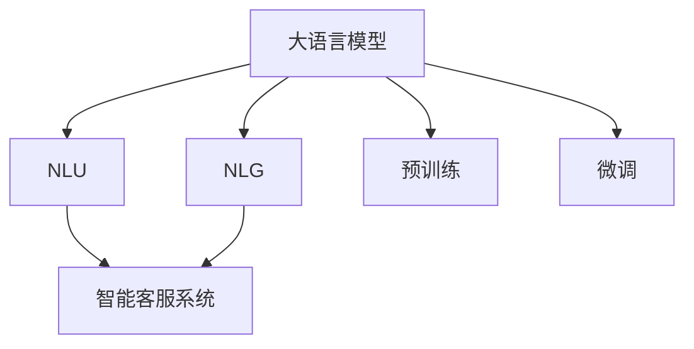

                 

# LLM驱动的智能客户服务：全天候多语言支持

> 关键词：大语言模型,智能客服,多语言支持,自然语言处理(NLP),对话系统,自然语言理解(NLU),自然语言生成(NLG),用户界面(UI),用户体验(UX),机器学习(ML),深度学习,多模态数据

## 1. 背景介绍

### 1.1 问题由来
随着互联网和移动互联网的普及，客户服务的场景和形式愈发多样化，传统的客服方式已经难以满足企业对于客户互动体验和效率提升的需求。智能客服系统作为新兴的客户服务方式，通过自动化技术优化了客户服务流程，提高了响应速度和处理效率。大语言模型（LLMs）作为智能客服系统的重要组成部分，赋予了系统强大的自然语言理解和生成能力，使得智能客服系统能够更加自然、智能地与用户进行互动。

### 1.2 问题核心关键点
智能客服系统一般分为两个主要部分：自然语言理解（NLU）和自然语言生成（NLG）。自然语言理解模块通过分析用户的输入，将语言信息转化为结构化的语义表示；自然语言生成模块根据语义表示生成自然语言回答，完成与用户的互动。

智能客服系统面临的关键问题包括：
1. 如何高效处理多种语言，实现多语言支持。
2. 如何理解用户意图，生成符合用户需求的回答。
3. 如何保证回答的准确性和一致性。
4. 如何提升系统的响应速度和处理效率。

基于大语言模型的智能客服系统可以在很大程度上解决这些问题，特别是在处理复杂多语言问题时，大语言模型能够显著提升系统性能。

### 1.3 问题研究意义
智能客服系统已经成为企业提高客户满意度和运营效率的重要工具。但传统的客服系统依赖于规则和模板，缺乏灵活性和智能性，难以处理复杂多变的客户需求。大语言模型驱动的智能客服系统，通过利用预训练语言模型在大量无标签文本数据上学习到的语言知识，能够更加灵活地理解和生成自然语言，从而提升客户服务质量和效率。

大语言模型驱动的智能客服系统对于企业具有重要意义：
1. 提高客户满意度：智能客服系统能够全天候、快速响应用户需求，提升用户满意度和忠诚度。
2. 降低运营成本：智能客服系统可以处理大量的简单咨询，减少人工客服的工作量，降低企业的运营成本。
3. 提升服务效率：智能客服系统能够快速处理复杂问题，提高服务效率，提升企业竞争力。
4. 促进业务发展：智能客服系统能够收集用户行为数据，帮助企业更好地了解客户需求，优化产品和服务。

## 2. 核心概念与联系

### 2.1 核心概念概述

为更好地理解基于大语言模型的智能客服系统，本节将介绍几个密切相关的核心概念：

- **大语言模型（LLM）**：以自回归模型（如GPT）或自编码模型（如BERT）为代表的大规模预训练语言模型。通过在海量无标签文本数据上进行预训练，学习到丰富的语言知识和常识，具备强大的语言理解和生成能力。

- **自然语言理解（NLU）**：指通过自然语言处理技术，将自然语言输入转换为机器可理解的形式，如词向量表示。

- **自然语言生成（NLG）**：指将机器理解的语言信息转化为自然语言输出，如生成自然语言回答。

- **智能客服系统**：通过自然语言处理技术，使机器能够与用户进行自然语言交互，提供高效、智能的客户服务。

- **预训练与微调（Fine-tuning）**：预训练是指在大规模无标签文本数据上训练语言模型；微调是在预训练模型基础上，针对特定任务或应用场景进行有监督训练，优化模型性能。

这些核心概念之间的逻辑关系可以通过以下Mermaid流程图来展示：



这个流程图展示了大语言模型驱动的智能客服系统的工作流程：

1. 大语言模型通过预训练学习通用的语言表示。
2. NLU模块将用户的自然语言输入转换为模型可理解的形式。
3. NLG模块根据NLU输出的语义表示生成自然语言回答。
4. 微调过程通过有监督训练优化模型在特定任务上的性能。

## 3. 核心算法原理 & 具体操作步骤
### 3.1 算法原理概述

基于大语言模型的智能客服系统，通过在大规模无标签文本数据上进行预训练，学习到通用的语言表示。在微调阶段，针对具体的客户服务任务进行有监督训练，优化模型的自然语言理解和生成能力。

形式化地，假设预训练语言模型为 $M_{\theta}$，其中 $\theta$ 为预训练得到的模型参数。给定客户服务任务 $T$ 的标注数据集 $D=\{(x_i, y_i)\}_{i=1}^N$，微调的目标是找到新的模型参数 $\hat{\theta}$，使得：

$$
\hat{\theta}=\mathop{\arg\min}_{\theta} \mathcal{L}(M_{\theta},D)
$$

其中 $\mathcal{L}$ 为针对任务 $T$ 设计的损失函数，用于衡量模型预测输出与真实标签之间的差异。常见的损失函数包括交叉熵损失、均方误差损失等。

通过梯度下降等优化算法，微调过程不断更新模型参数 $\theta$，最小化损失函数 $\mathcal{L}$，使得模型输出逼近真实标签。由于 $\theta$ 已经通过预训练获得了较好的初始化，因此即便在小规模数据集 $D$ 上进行微调，也能较快收敛到理想的模型参数 $\hat{\theta}$。

### 3.2 算法步骤详解

基于大语言模型的智能客服系统的微调过程一般包括以下几个关键步骤：

**Step 1: 准备预训练模型和数据集**
- 选择合适的预训练语言模型 $M_{\theta}$ 作为初始化参数，如 BERT、GPT 等。
- 准备客户服务任务 $T$ 的标注数据集 $D$，划分为训练集、验证集和测试集。一般要求标注数据与预训练数据的分布不要差异过大。

**Step 2: 设计任务适配层**
- 根据任务类型，在预训练模型顶层设计合适的输出层和损失函数。
- 对于问答任务，通常在顶层添加逻辑回归层和交叉熵损失函数。
- 对于对话任务，使用对话生成器生成回答，并以序列交叉熵为损失函数。

**Step 3: 设置微调超参数**
- 选择合适的优化算法及其参数，如 AdamW、SGD 等，设置学习率、批大小、迭代轮数等。
- 设置正则化技术及强度，包括权重衰减、Dropout、Early Stopping 等。
- 确定冻结预训练参数的策略，如仅微调顶层，或全部参数都参与微调。

**Step 4: 执行梯度训练**
- 将训练集数据分批次输入模型，前向传播计算损失函数。
- 反向传播计算参数梯度，根据设定的优化算法和学习率更新模型参数。
- 周期性在验证集上评估模型性能，根据性能指标决定是否触发 Early Stopping。
- 重复上述步骤直到满足预设的迭代轮数或 Early Stopping 条件。

**Step 5: 测试和部署**
- 在测试集上评估微调后模型 $M_{\hat{\theta}}$ 的性能，对比微调前后的精度提升。
- 使用微调后的模型对新样本进行推理预测，集成到实际的应用系统中。
- 持续收集新的数据，定期重新微调模型，以适应数据分布的变化。

以上是基于大语言模型的智能客服系统微调的一般流程。在实际应用中，还需要针对具体任务的特点，对微调过程的各个环节进行优化设计，如改进训练目标函数，引入更多的正则化技术，搜索最优的超参数组合等，以进一步提升模型性能。

### 3.3 算法优缺点

基于大语言模型的智能客服系统具有以下优点：
1. 简单高效。只需准备少量标注数据，即可对预训练模型进行快速适配，获得较大的性能提升。
2. 通用适用。适用于各种客服任务，包括对话、问答、投诉处理等，设计简单的任务适配层即可实现微调。
3. 灵活性高。大语言模型能够处理多种语言，适用于多语言客户服务场景。
4. 易于维护。基于大语言模型的系统维护成本较低，升级迭代较为容易。

同时，该方法也存在一定的局限性：
1. 对标注数据依赖较大。微调的效果很大程度上取决于标注数据的质量和数量，获取高质量标注数据的成本较高。
2. 数据隐私问题。客服系统的用户数据涉及隐私敏感信息，如何保护用户隐私数据是一大挑战。
3. 可解释性不足。微调模型的决策过程通常缺乏可解释性，难以对其推理逻辑进行分析和调试。

尽管存在这些局限性，但就目前而言，基于大语言模型的智能客服系统仍是一种高效、实用的客户服务解决方案。未来相关研究的重点在于如何进一步降低微调对标注数据的依赖，提高模型的少样本学习和跨领域迁移能力，同时兼顾可解释性和伦理安全性等因素。

### 3.4 算法应用领域

基于大语言模型的智能客服系统已经在多个领域得到了应用，覆盖了几乎所有常见的客服场景，例如：

- 电子商务：智能客服机器人可以回答用户关于商品、订单、退货等问题的咨询。
- 金融服务：智能客服系统可以帮助用户查询账户余额、交易记录、贷款申请等。
- 电信服务：智能客服可以解决用户关于话费、套餐、故障排错等咨询。
- 医疗保健：智能客服可以提供预约挂号、咨询病情、解答药物使用等。
- 旅游服务：智能客服可以回答用户关于酒店预订、行程安排、景点介绍等咨询。

除了上述这些经典场景外，智能客服系统还被创新性地应用到更多服务场景中，如智能客服语音助手、多语言客服、个性化推荐等，为各行各业带来了全新的客户服务体验。

## 4. 数学模型和公式 & 详细讲解  
### 4.1 数学模型构建

本节将使用数学语言对基于大语言模型的智能客服系统微调过程进行更加严格的刻画。

记预训练语言模型为 $M_{\theta}$，其中 $\theta$ 为模型参数。假设客服任务 $T$ 的训练集为 $D=\{(x_i, y_i)\}_{i=1}^N$，其中 $x_i$ 为输入文本，$y_i$ 为标签（如回答、问答对的答案）。

定义模型 $M_{\theta}$ 在输入 $x$ 上的预测输出为 $\hat{y}=M_{\theta}(x)$，通常通过自回归模型进行预测。微调的目标是最小化经验风险，即找到最优参数：

$$
\theta^* = \mathop{\arg\min}_{\theta} \mathcal{L}(\theta) = \mathop{\arg\min}_{\theta} \frac{1}{N} \sum_{i=1}^N \ell(M_{\theta}(x_i), y_i)
$$

其中 $\ell$ 为针对任务 $T$ 设计的损失函数。

常见的损失函数包括交叉熵损失、均方误差损失等。对于问答任务，交叉熵损失函数的计算公式为：

$$
\ell(y, \hat{y}) = -\sum_{i=1}^{n} y_i \log \hat{y}_i
$$

其中 $n$ 为回答的词汇表大小，$y_i$ 为标签（0或1），$\hat{y}_i$ 为模型预测的概率。

### 4.2 公式推导过程

以下我们以问答任务为例，推导交叉熵损失函数及其梯度的计算公式。

假设模型 $M_{\theta}$ 在输入 $x$ 上的输出为 $\hat{y}=M_{\theta}(x)$，表示模型预测的文本回答。真实标签 $y \in \{0, 1\}$。则二分类交叉熵损失函数定义为：

$$
\ell(y, \hat{y}) = -[y\log \hat{y} + (1-y)\log (1-\hat{y})]
$$

将其代入经验风险公式，得：

$$
\mathcal{L}(\theta) = -\frac{1}{N}\sum_{i=1}^N [y_i\log \hat{y}_i+(1-y_i)\log(1-\hat{y}_i)]
$$

根据链式法则，损失函数对参数 $\theta_k$ 的梯度为：

$$
\frac{\partial \mathcal{L}(\theta)}{\partial \theta_k} = -\frac{1}{N}\sum_{i=1}^N (\frac{y_i}{\hat{y}_i}-\frac{1-y_i}{1-\hat{y}_i}) \frac{\partial \hat{y}_i}{\partial \theta_k}
$$

其中 $\frac{\partial \hat{y}_i}{\partial \theta_k}$ 可进一步递归展开，利用自动微分技术完成计算。

在得到损失函数的梯度后，即可带入参数更新公式，完成模型的迭代优化。重复上述过程直至收敛，最终得到适应客服任务的最优模型参数 $\theta^*$。

## 5. 项目实践：代码实例和详细解释说明
### 5.1 开发环境搭建

在进行智能客服系统微调实践前，我们需要准备好开发环境。以下是使用Python进行PyTorch开发的环境配置流程：

1. 安装Anaconda：从官网下载并安装Anaconda，用于创建独立的Python环境。

2. 创建并激活虚拟环境：
```bash
conda create -n pytorch-env python=3.8 
conda activate pytorch-env
```

3. 安装PyTorch：根据CUDA版本，从官网获取对应的安装命令。例如：
```bash
conda install pytorch torchvision torchaudio cudatoolkit=11.1 -c pytorch -c conda-forge
```

4. 安装Transformers库：
```bash
pip install transformers
```

5. 安装各类工具包：
```bash
pip install numpy pandas scikit-learn matplotlib tqdm jupyter notebook ipython
```

完成上述步骤后，即可在`pytorch-env`环境中开始微调实践。

### 5.2 源代码详细实现

下面我们以智能客服系统的问答任务为例，给出使用Transformers库对BERT模型进行微调的PyTorch代码实现。

首先，定义问答任务的数据处理函数：

```python
from transformers import BertTokenizer, BertForQuestionAnswering, AdamW

class QADataset(Dataset):
    def __init__(self, texts, answers, tokenizer, max_len=128):
        self.texts = texts
        self.answers = answers
        self.tokenizer = tokenizer
        self.max_len = max_len
        
    def __len__(self):
        return len(self.texts)
    
    def __getitem__(self, item):
        text = self.texts[item]
        answer = self.answers[item]
        
        encoding = self.tokenizer(text, return_tensors='pt', max_length=self.max_len, padding='max_length', truncation=True)
        input_ids = encoding['input_ids'][0]
        attention_mask = encoding['attention_mask'][0]
        
        start_tokens = [certain_special_token] + tokenizer.tokenize(answer[:max_span_length])[1:]
        end_tokens = tokenizer.tokenize(answer[max_span_length:])[1:]
        answer_tokens = start_tokens + end_tokens
        
        start_ids = self.tokenizer.convert_tokens_to_ids(start_tokens)
        end_ids = self.tokenizer.convert_tokens_to_ids(end_tokens)
        answer_ids = self.tokenizer.convert_tokens_to_ids(answer_tokens)
        
        return {
            'input_ids': input_ids,
            'attention_mask': attention_mask,
            'start_positions': start_ids,
            'end_positions': end_ids,
            'answer_ids': answer_ids
        }

# 定义特殊标记
certain_special_token = '[CLS]'
special_tokens = [certain_special_token]
```

然后，定义模型和优化器：

```python
from transformers import BertTokenizer

tokenizer = BertTokenizer.from_pretrained('bert-base-cased')
model = BertForQuestionAnswering.from_pretrained('bert-base-cased', num_labels=2)

optimizer = AdamW(model.parameters(), lr=2e-5)
```

接着，定义训练和评估函数：

```python
from torch.utils.data import DataLoader
from tqdm import tqdm
from sklearn.metrics import accuracy_score

device = torch.device('cuda') if torch.cuda.is_available() else torch.device('cpu')
model.to(device)

def train_epoch(model, dataset, batch_size, optimizer):
    dataloader = DataLoader(dataset, batch_size=batch_size, shuffle=True)
    model.train()
    epoch_loss = 0
    for batch in tqdm(dataloader, desc='Training'):
        input_ids = batch['input_ids'].to(device)
        attention_mask = batch['attention_mask'].to(device)
        start_positions = batch['start_positions'].to(device)
        end_positions = batch['end_positions'].to(device)
        answer_ids = batch['answer_ids'].to(device)
        model.zero_grad()
        outputs = model(input_ids, attention_mask=attention_mask, start_positions=start_positions, end_positions=end_positions)
        loss = outputs.loss
        epoch_loss += loss.item()
        loss.backward()
        optimizer.step()
    return epoch_loss / len(dataloader)

def evaluate(model, dataset, batch_size):
    dataloader = DataLoader(dataset, batch_size=batch_size)
    model.eval()
    preds, labels = [], []
    with torch.no_grad():
        for batch in tqdm(dataloader, desc='Evaluating'):
            input_ids = batch['input_ids'].to(device)
            attention_mask = batch['attention_mask'].to(device)
            start_positions = batch['start_positions'].to(device)
            end_positions = batch['end_positions'].to(device)
            answer_ids = batch['answer_ids'].to(device)
            outputs = model(input_ids, attention_mask=attention_mask, start_positions=start_positions, end_positions=end_positions)
            pred_start = outputs.start_logits.argmax().item()
            pred_end = outputs.end_logits.argmax().item()
            preds.append((pred_start, pred_end))
            labels.append((batch['start_positions'][0].item(), batch['end_positions'][0].item()))
                
    print(f'Accuracy: {accuracy_score(labels, preds)}')
```

最后，启动训练流程并在测试集上评估：

```python
epochs = 5
batch_size = 16

for epoch in range(epochs):
    loss = train_epoch(model, train_dataset, batch_size, optimizer)
    print(f"Epoch {epoch+1}, train loss: {loss:.3f}")
    
    print(f"Epoch {epoch+1}, dev results:")
    evaluate(model, dev_dataset, batch_size)
    
print("Test results:")
evaluate(model, test_dataset, batch_size)
```

以上就是使用PyTorch对BERT进行问答任务微调的完整代码实现。可以看到，得益于Transformers库的强大封装，我们可以用相对简洁的代码完成BERT模型的加载和微调。

### 5.3 代码解读与分析

让我们再详细解读一下关键代码的实现细节：

**QADataset类**：
- `__init__`方法：初始化文本、答案、分词器等关键组件。
- `__len__`方法：返回数据集的样本数量。
- `__getitem__`方法：对单个样本进行处理，将文本输入编码为token ids，将答案转换为token ids，并对其进行定长padding，最终返回模型所需的输入。

**模型定义**：
- 使用BertForQuestionAnswering作为问答任务的模型类，指定标签数为2。
- 使用AdamW优化器，设置学习率为2e-5。

**训练和评估函数**：
- 使用PyTorch的DataLoader对数据集进行批次化加载，供模型训练和推理使用。
- 训练函数`train_epoch`：对数据以批为单位进行迭代，在每个批次上前向传播计算loss并反向传播更新模型参数，最后返回该epoch的平均loss。
- 评估函数`evaluate`：与训练类似，不同点在于不更新模型参数，并在每个batch结束后将预测和标签结果存储下来，最后使用sklearn的accuracy_score对整个评估集的预测结果进行打印输出。

**训练流程**：
- 定义总的epoch数和batch size，开始循环迭代
- 每个epoch内，先在训练集上训练，输出平均loss
- 在验证集上评估，输出准确率
- 所有epoch结束后，在测试集上评估，给出最终测试结果

可以看到，PyTorch配合Transformers库使得BERT微调的代码实现变得简洁高效。开发者可以将更多精力放在数据处理、模型改进等高层逻辑上，而不必过多关注底层的实现细节。

当然，工业级的系统实现还需考虑更多因素，如模型的保存和部署、超参数的自动搜索、更灵活的任务适配层等。但核心的微调范式基本与此类似。

## 6. 实际应用场景
### 6.1 智能客服系统

基于大语言模型的智能客服系统，可以通过自然语言理解（NLU）和自然语言生成（NLG）模块，实现全天候多语言支持。具体而言，智能客服系统可以包括以下几个关键模块：

**自然语言理解（NLU）**：
- 文本预处理：将用户输入的文本进行分词、词性标注、命名实体识别等预处理。
- 意图识别：通过训练好的分类器，将用户输入的意图映射到预定义的意图类别。

**自然语言生成（NLG）**：
- 文本生成：根据用户意图和上下文信息，生成自然语言回答。
- 对话管理：管理对话状态，确保对话连贯性和一致性。

通过大语言模型微调，智能客服系统可以提升自然语言理解和生成的准确性和一致性，从而提供更加智能、高效的客户服务。例如，通过微调BERT模型，可以在处理中文客户咨询时获得良好的效果。

### 6.2 智能客服系统中的多语言支持

智能客服系统中的多语言支持，可以通过以下方式实现：

**多语言预训练**：
- 在训练数据中加入多种语言的文本，进行多语言预训练，学习到不同语言的共性特征。

**任务适配层**：
- 在多语言预训练的基础上，针对特定语言的客服任务进行微调，获得针对该语言的专用模型。

**多语言输入**：
- 允许用户使用多种语言输入，智能客服系统能够自动识别并处理不同语言的输入。

例如，在处理英语和中文客户咨询时，可以使用不同的任务适配层，对模型进行微调，获得针对英语和中文的专用模型。这样可以大大提升系统在不同语言环境下的性能。

### 6.3 多语言客户服务

在实际应用中，智能客服系统往往需要支持多种语言，例如英语、中文、西班牙语等。为了实现多语言客户服务，可以采用以下几种策略：

**多语言模型并行**：
- 训练多个多语言模型，每个模型针对一种语言进行微调，在需要时切换使用。

**多语言模型融合**：
- 将多个多语言模型的输出进行融合，生成最终的回复。

**多语言数据增强**：
- 使用多语言数据增强技术，扩充训练集的样本量，提高模型的泛化能力。

例如，可以使用多语言数据增强技术，将英文和中文客户咨询的数据进行混合，训练一个支持多语言处理的智能客服系统。这样可以提升系统在不同语言环境下的表现，提升用户体验。

## 7. 工具和资源推荐
### 7.1 学习资源推荐

为了帮助开发者系统掌握大语言模型微调的理论基础和实践技巧，这里推荐一些优质的学习资源：

1. 《Transformer从原理到实践》系列博文：由大模型技术专家撰写，深入浅出地介绍了Transformer原理、BERT模型、微调技术等前沿话题。

2. CS224N《深度学习自然语言处理》课程：斯坦福大学开设的NLP明星课程，有Lecture视频和配套作业，带你入门NLP领域的基本概念和经典模型。

3. 《Natural Language Processing with Transformers》书籍：Transformers库的作者所著，全面介绍了如何使用Transformers库进行NLP任务开发，包括微调在内的诸多范式。

4. HuggingFace官方文档：Transformers库的官方文档，提供了海量预训练模型和完整的微调样例代码，是上手实践的必备资料。

5. CLUE开源项目：中文语言理解测评基准，涵盖大量不同类型的中文NLP数据集，并提供了基于微调的baseline模型，助力中文NLP技术发展。

通过对这些资源的学习实践，相信你一定能够快速掌握大语言模型微调的精髓，并用于解决实际的NLP问题。
###  7.2 开发工具推荐

高效的开发离不开优秀的工具支持。以下是几款用于大语言模型微调开发的常用工具：

1. PyTorch：基于Python的开源深度学习框架，灵活动态的计算图，适合快速迭代研究。大部分预训练语言模型都有PyTorch版本的实现。

2. TensorFlow：由Google主导开发的开源深度学习框架，生产部署方便，适合大规模工程应用。同样有丰富的预训练语言模型资源。

3. Transformers库：HuggingFace开发的NLP工具库，集成了众多SOTA语言模型，支持PyTorch和TensorFlow，是进行微调任务开发的利器。

4. Weights & Biases：模型训练的实验跟踪工具，可以记录和可视化模型训练过程中的各项指标，方便对比和调优。与主流深度学习框架无缝集成。

5. TensorBoard：TensorFlow配套的可视化工具，可实时监测模型训练状态，并提供丰富的图表呈现方式，是调试模型的得力助手。

6. Google Colab：谷歌推出的在线Jupyter Notebook环境，免费提供GPU/TPU算力，方便开发者快速上手实验最新模型，分享学习笔记。

合理利用这些工具，可以显著提升大语言模型微调任务的开发效率，加快创新迭代的步伐。

### 7.3 相关论文推荐

大语言模型和微调技术的发展源于学界的持续研究。以下是几篇奠基性的相关论文，推荐阅读：

1. Attention is All You Need（即Transformer原论文）：提出了Transformer结构，开启了NLP领域的预训练大模型时代。

2. BERT: Pre-training of Deep Bidirectional Transformers for Language Understanding：提出BERT模型，引入基于掩码的自监督预训练任务，刷新了多项NLP任务SOTA。

3. Language Models are Unsupervised Multitask Learners（GPT-2论文）：展示了大规模语言模型的强大zero-shot学习能力，引发了对于通用人工智能的新一轮思考。

4. Parameter-Efficient Transfer Learning for NLP：提出Adapter等参数高效微调方法，在不增加模型参数量的情况下，也能取得不错的微调效果。

5. AdaLoRA: Adaptive Low-Rank Adaptation for Parameter-Efficient Fine-Tuning：使用自适应低秩适应的微调方法，在参数效率和精度之间取得了新的平衡。

这些论文代表了大语言模型微调技术的发展脉络。通过学习这些前沿成果，可以帮助研究者把握学科前进方向，激发更多的创新灵感。

## 8. 总结：未来发展趋势与挑战
### 8.1 总结

本文对基于大语言模型的智能客服系统进行了全面系统的介绍。首先阐述了智能客服系统的研究背景和意义，明确了微调在拓展预训练模型应用、提升客服系统性能方面的独特价值。其次，从原理到实践，详细讲解了微调的数学原理和关键步骤，给出了微调任务开发的完整代码实例。同时，本文还广泛探讨了微调方法在智能客服、多语言客户服务等多个场景中的应用前景，展示了微调范式的巨大潜力。

通过本文的系统梳理，可以看到，基于大语言模型的智能客服系统正在成为NLP领域的重要范式，极大地拓展了预训练语言模型的应用边界，催生了更多的落地场景。受益于大规模语料的预训练，智能客服系统能够处理多种语言，提供全天候、多语言支持，从而提升客户服务质量和效率。大语言模型微调技术将在未来不断进步，为构建高效、智能的客户服务系统提供更加坚实的技术基础。

### 8.2 未来发展趋势

展望未来，大语言模型微调技术将呈现以下几个发展趋势：

1. 模型规模持续增大。随着算力成本的下降和数据规模的扩张，预训练语言模型的参数量还将持续增长。超大规模语言模型蕴含的丰富语言知识，有望支撑更加复杂多变的客服场景。

2. 微调方法日趋多样。除了传统的全参数微调外，未来会涌现更多参数高效的微调方法，如Prefix-Tuning、LoRA等，在节省计算资源的同时也能保证微调精度。

3. 持续学习成为常态。随着数据分布的不断变化，微调模型也需要持续学习新知识以保持性能。如何在不遗忘原有知识的同时，高效吸收新样本信息，将成为重要的研究课题。

4. 标注样本需求降低。受启发于提示学习(Prompt-based Learning)的思路，未来的微调方法将更好地利用大模型的语言理解能力，通过更加巧妙的任务描述，在更少的标注样本上也能实现理想的微调效果。

5. 多语言客服系统崛起。大语言模型微调技术可以应用于多语言客服系统，支持多种语言客户服务，提升全球化客户服务的效率和质量。

以上趋势凸显了大语言模型微调技术的广阔前景。这些方向的探索发展，必将进一步提升智能客服系统的性能和应用范围，为客户服务带来更优质的体验。

### 8.3 面临的挑战

尽管大语言模型微调技术已经取得了瞩目成就，但在迈向更加智能化、普适化应用的过程中，它仍面临着诸多挑战：

1. 标注成本瓶颈。虽然微调大大降低了标注数据的需求，但对于长尾应用场景，难以获得充足的高质量标注数据，成为制约微调性能的瓶颈。如何进一步降低微调对标注样本的依赖，将是一大难题。

2. 数据隐私问题。客服系统的用户数据涉及隐私敏感信息，如何保护用户隐私数据是一大挑战。

3. 可解释性不足。微调模型的决策过程通常缺乏可解释性，难以对其推理逻辑进行分析和调试。

4. 多语言支持问题。多语言客服系统的构建需要处理多种语言的输入和输出，增加了系统实现的复杂性。

尽管存在这些局限性，但就目前而言，基于大语言模型的智能客服系统仍是一种高效、实用的客户服务解决方案。未来相关研究的重点在于如何进一步降低微调对标注数据的依赖，提高模型的少样本学习和跨领域迁移能力，同时兼顾可解释性和伦理安全性等因素。

### 8.4 未来突破

面对大语言模型微调所面临的种种挑战，未来的研究需要在以下几个方面寻求新的突破：

1. 探索无监督和半监督微调方法。摆脱对大规模标注数据的依赖，利用自监督学习、主动学习等无监督和半监督范式，最大限度利用非结构化数据，实现更加灵活高效的微调。

2. 研究参数高效和计算高效的微调范式。开发更加参数高效的微调方法，在固定大部分预训练参数的同时，只更新极少量的任务相关参数。同时优化微调模型的计算图，减少前向传播和反向传播的资源消耗，实现更加轻量级、实时性的部署。

3. 融合因果和对比学习范式。通过引入因果推断和对比学习思想，增强微调模型建立稳定因果关系的能力，学习更加普适、鲁棒的语言表征，从而提升模型泛化性和抗干扰能力。

4. 引入更多先验知识。将符号化的先验知识，如知识图谱、逻辑规则等，与神经网络模型进行巧妙融合，引导微调过程学习更准确、合理的语言模型。同时加强不同模态数据的整合，实现视觉、语音等多模态信息与文本信息的协同建模。

5. 结合因果分析和博弈论工具。将因果分析方法引入微调模型，识别出模型决策的关键特征，增强输出解释的因果性和逻辑性。借助博弈论工具刻画人机交互过程，主动探索并规避模型的脆弱点，提高系统稳定性。

6. 纳入伦理道德约束。在模型训练目标中引入伦理导向的评估指标，过滤和惩罚有偏见、有害的输出倾向。同时加强人工干预和审核，建立模型行为的监管机制，确保输出符合人类价值观和伦理道德。

这些研究方向的探索，必将引领大语言模型微调技术迈向更高的台阶，为构建安全、可靠、可解释、可控的智能系统铺平道路。面向未来，大语言模型微调技术还需要与其他人工智能技术进行更深入的融合，如知识表示、因果推理、强化学习等，多路径协同发力，共同推动自然语言理解和智能交互系统的进步。只有勇于创新、敢于突破，才能不断拓展语言模型的边界，让智能技术更好地造福人类社会。

## 9. 附录：常见问题与解答
**Q1：大语言模型微调是否适用于所有客服任务？**

A: 大语言模型微调在大多数客服任务上都能取得不错的效果，特别是对于数据量较小的任务。但对于一些特定领域的任务，如法律、医疗等，仅仅依靠通用语料预训练的模型可能难以很好地适应。此时需要在特定领域语料上进一步预训练，再进行微调，才能获得理想效果。此外，对于一些需要时效性、个性化很强的任务，如对话、推荐等，微调方法也需要针对性的改进优化。

**Q2：微调过程中如何选择合适的学习率？**

A: 微调的学习率一般要比预训练时小1-2个数量级，如果使用过大的学习率，容易破坏预训练权重，导致过拟合。一般建议从1e-5开始调参，逐步减小学习率，直至收敛。也可以使用warmup策略，在开始阶段使用较小的学习率，再逐渐过渡到预设值。需要注意的是，不同的优化器(如AdamW、Adafactor等)以及不同的学习率调度策略，可能需要设置不同的学习率阈值。

**Q3：采用大模型微调时会面临哪些资源瓶颈？**

A: 目前主流的预训练大模型动辄以亿计的参数规模，对算力、内存、存储都提出了很高的要求。GPU/TPU等高性能设备是必不可少的，但即便如此，超大批次的训练和推理也可能遇到显存不足的问题。因此需要采用一些资源优化技术，如梯度积累、混合精度训练、模型并行等，来突破硬件瓶颈。同时，模型的存储和读取也可能占用大量时间和空间，需要采用模型压缩、稀疏化存储等方法进行优化。

**Q4：如何缓解微调过程中的过拟合问题？**

A: 过拟合是微调面临的主要挑战，尤其是在标注数据不足的情况下。常见的缓解策略包括：
1. 数据增强：通过回译、近义替换等方式扩充训练集
2. 正则化：使用L2正则、Dropout、Early Stopping等避免过拟合
3. 对抗训练：引入对抗样本，提高模型鲁棒性
4. 参数高效微调：只调整少量参数(如Adapter、Prefix等)，减小过拟合风险
5. 多模型集成：训练多个微调模型，取平均输出，抑制过拟合

这些策略往往需要根据具体任务和数据特点进行灵活组合。只有在数据、模型、训练、推理等各环节进行全面优化，才能最大限度地发挥大模型微调的威力。

**Q5：微调模型在落地部署时需要注意哪些问题？**

A: 将微调模型转化为实际应用，还需要考虑以下因素：
1. 模型裁剪：去除不必要的层和参数，减小模型尺寸，加快推理速度
2. 量化加速：将浮点模型转为定点模型，压缩存储空间，提高计算效率
3. 服务化封装：将模型封装为标准化服务接口，便于集成调用
4. 弹性伸缩：根据请求流量动态调整资源配置，平衡服务质量和成本
5. 监控告警：实时采集系统指标，设置异常告警阈值，确保服务稳定性
6. 安全防护：采用访问鉴权、数据脱敏等措施，保障数据和模型安全

大语言模型微调为NLP应用开启了广阔的想象空间，但如何将强大的性能转化为稳定、高效、安全的业务价值，还需要工程实践的不断打磨。唯有从数据、算法、工程、业务等多个维度协同发力，才能真正实现人工智能技术在垂直行业的规模化落地。总之，微调需要开发者根据具体任务，不断迭代和优化模型、数据和算法，方能得到理想的效果。

---

作者：禅与计算机程序设计艺术 / Zen and the Art of Computer Programming

