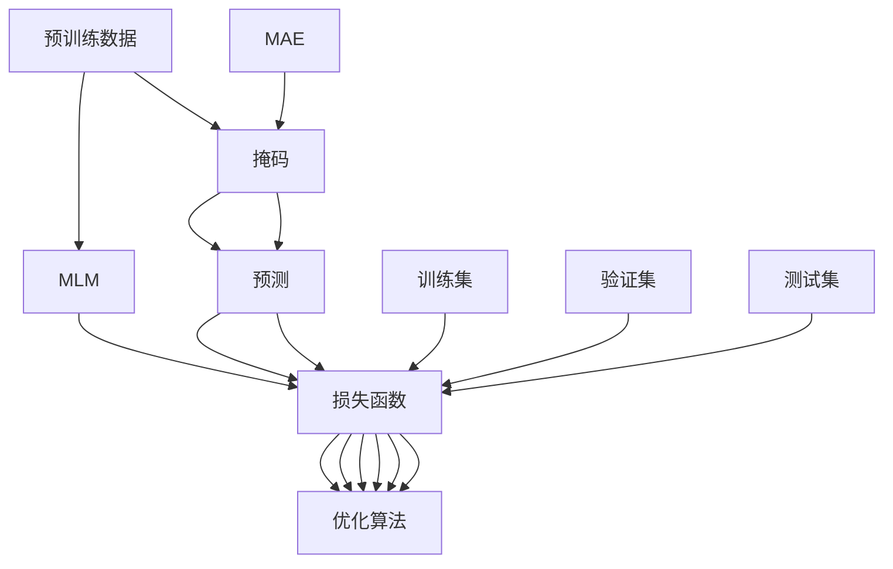

                 

# MAE原理与代码实例讲解

> 关键词：MAE,自监督学习,自回归,掩码语言模型,代码实例,预训练

## 1. 背景介绍

在过去的几年中，大规模自监督预训练语言模型如BERT、GPT等在自然语言处理(NLP)领域取得了显著的突破，推动了诸如文本分类、机器翻译、问答系统等多种下游任务的发展。然而，这些模型通常需要大量的标注数据来指导微调，这在某些领域（如医学、法律等）难以获得足够标注数据的情况下，限制了其应用范围。

为了解决这一问题，近期提出的掩码语言模型（Masked Language Model, MLM）如BERT、T5等，通过在大规模无标签文本上自监督预训练，可以显著减少微调对标注数据的依赖。掩码语言模型训练时，随机将一些单词或单词片段遮挡掉，并预测这些单词或片段，以此训练模型学习语言的上下文关系和语义信息。

本文将深入探讨掩码语言模型（例如MAE）的原理，并通过实际代码实例，详细介绍如何训练和优化这类模型。

## 2. 核心概念与联系

### 2.1 核心概念概述

掩码语言模型（MLM）是一类在大规模无标签文本上进行的自监督预训练任务。其核心思想是在文本中随机遮挡一定比例的单词，然后让模型预测这些被遮挡的单词，从而学习到语言的上下文关系和语义信息。掩码语言模型包括BERT、T5、XLNet等，它们在NLP领域中广泛应用，并取得了显著的性能提升。

本文重点介绍掩码语言模型的一种变体——MAE（Masked Autoencoders for Unsupervised Pre-training），其通过掩码和自动编码器（Autoencoder）相结合的方式，进一步提升了掩码语言模型的性能和泛化能力。

### 2.2 核心概念原理和架构的 Mermaid 流程图



这个图表展示了MAE模型的基本架构和工作流程。预训练数据首先经过MLM预训练，学习到语言的上下文关系。接着，数据再次经过掩码处理，生成掩码和预测的标签。训练过程中，模型使用掩码和预测之间的对比作为损失函数，通过优化算法来更新模型参数。最后，使用验证集和测试集评估模型性能。

### 2.3 核心概念之间的关系

掩码语言模型通过在无标签数据上自监督预训练，极大地降低了微调对标注数据的依赖。MAE则在此基础上，通过掩码和自动编码器相结合的方式，进一步提升了模型的性能和泛化能力。这些方法在NLP领域中得到了广泛应用，并在诸多下游任务上取得了优异的性能。

## 3. 核心算法原理 & 具体操作步骤

### 3.1 算法原理概述

掩码语言模型（MLM）的基本原理是在文本中随机遮挡一定比例的单词，并让模型预测这些被遮挡的单词。这一过程称为掩码操作，其目的是训练模型学习上下文关系和语义信息。掩码语言模型的损失函数通常定义为预测的单词与真实单词之间的交叉熵损失。

在MAE中，模型首先进行MLM预训练，然后再次进行掩码操作，但这次使用掩码后的文本作为输入，让模型预测原始文本。这一过程称为自动编码器。MAE的目标是使得掩码后的文本能够准确地解码回原始文本，即掩码和预测之间的差异越小越好。MAE的损失函数定义为掩码和预测之间的差异，通过优化算法更新模型参数。

### 3.2 算法步骤详解

1. **数据准备**：收集大规模无标签文本数据，将其分为训练集、验证集和测试集。
2. **模型构建**：使用深度学习框架（如PyTorch、TensorFlow）构建掩码语言模型或MAE模型。
3. **掩码操作**：对训练集中的每个文本进行掩码操作，生成掩码和预测的标签。
4. **训练过程**：使用掩码和预测之间的对比作为损失函数，通过优化算法（如Adam、SGD）更新模型参数。
5. **验证和测试**：在验证集和测试集上评估模型性能，调整超参数以提高模型性能。

### 3.3 算法优缺点

**优点**：
- **泛化能力强**：掩码语言模型和MAE在大规模无标签数据上进行自监督预训练，能够学习到丰富的语言知识和语义信息，具有较强的泛化能力。
- **训练成本低**：掩码语言模型和MAE的训练过程不需要标注数据，降低了训练成本。
- **参数效率高**：MAE使用掩码和自动编码器相结合的方式，只更新部分模型参数，具有较高的参数效率。

**缺点**：
- **模型复杂度高**：掩码语言模型和MAE模型通常具有较大的参数量和计算量，需要较高的算力和内存。
- **训练时间较长**：掩码语言模型和MAE的训练过程需要较长的计算时间，特别是在大规模数据集上。
- **对计算资源要求高**：掩码语言模型和MAE模型对计算资源（如GPU、TPU）的要求较高，需要在高性能计算设备上进行训练。

### 3.4 算法应用领域

掩码语言模型（如BERT、T5）和MAE在NLP领域中得到了广泛应用，包括但不限于以下几个方面：
- **文本分类**：将文本分类为不同的类别。
- **机器翻译**：将一种语言的文本翻译成另一种语言。
- **问答系统**：回答自然语言问题。
- **命名实体识别**：识别文本中的实体，如人名、地名等。
- **情感分析**：分析文本的情感倾向。

## 4. 数学模型和公式 & 详细讲解

### 4.1 数学模型构建

掩码语言模型和MAE的数学模型可以形式化地表示为：

$$
\text{Input} = \text{Masked Input} \oplus \text{Unmasked Input}
$$

其中，$\oplus$表示文本拼接操作。$\text{Masked Input}$表示掩码后的文本，$\text{Unmasked Input}$表示原始文本。掩码后的文本由以下公式生成：

$$
\text{Masked Input} = \text{MLM Pre-training}(\text{Text})
$$

其中，$\text{MLM Pre-training}$表示掩码语言模型的预训练过程。掩码后的文本作为自动编码器的输入，模型需要预测出原始文本。

### 4.2 公式推导过程

掩码语言模型的损失函数通常定义为：

$$
\mathcal{L}_{\text{MLM}} = -\sum_{i=1}^n \log p_{\text{MLM}}(w_i|w_{-i})
$$

其中，$w_i$表示第$i$个单词，$w_{-i}$表示除第$i$个单词外的所有单词。$p_{\text{MLM}}(w_i|w_{-i})$表示模型在给定上下文的情况下，预测第$i$个单词的概率。

对于MAE，其损失函数定义为掩码和预测之间的差异：

$$
\mathcal{L}_{\text{MAE}} = -\sum_{i=1}^n \log p_{\text{Autoencoder}}(w_i|w_{-i})
$$

其中，$p_{\text{Autoencoder}}(w_i|w_{-i})$表示模型在给定掩码后的文本的情况下，预测第$i$个单词的概率。

### 4.3 案例分析与讲解

以下是一个简单的代码示例，展示如何使用PyTorch实现掩码语言模型（MLM）和MAE模型的训练：

```python
import torch
import torch.nn as nn
import torch.optim as optim
from torch.utils.data import DataLoader, Dataset

# 定义掩码语言模型
class MLMModel(nn.Module):
    def __init__(self, vocab_size, embedding_dim, num_hidden_layers, num_attention_heads, num_classes):
        super(MLMModel, self).__init__()
        self.embedding = nn.Embedding(vocab_size, embedding_dim)
        self.encoder = nn.Transformer(embedding_dim, num_hidden_layers, num_attention_heads)
        self.fc = nn.Linear(embedding_dim, num_classes)
    
    def forward(self, x):
        embedded = self.embedding(x)
        output = self.encoder(embedded)
        logits = self.fc(output)
        return logits

# 定义掩码语言模型的损失函数
def mlm_loss(logits, labels):
    return nn.CrossEntropyLoss()(logits, labels)

# 定义自动编码器
class MAEModel(nn.Module):
    def __init__(self, vocab_size, embedding_dim, num_hidden_layers, num_attention_heads, num_classes):
        super(MAEModel, self).__init__()
        self.mask_token = nn.Embedding(vocab_size, embedding_dim)
        self.encoder = nn.Transformer(embedding_dim, num_hidden_layers, num_attention_heads)
        self.fc = nn.Linear(embedding_dim, num_classes)
    
    def forward(self, x):
        masked_input = self.mask_token(x)
        output = self.encoder(masked_input)
        masked_logits = self.fc(output)
        return masked_logits

# 定义自动编码器的损失函数
def mae_loss(masked_logits, labels):
    return nn.MSELoss()(masked_logits, labels)

# 定义掩码语言模型和自动编码器的训练函数
def train(model, train_loader, optimizer, device, criterion):
    model.train()
    total_loss = 0
    for i, (x, y) in enumerate(train_loader):
        x, y = x.to(device), y.to(device)
        optimizer.zero_grad()
        output = model(x)
        loss = criterion(output, y)
        loss.backward()
        optimizer.step()
        total_loss += loss.item()
    return total_loss / len(train_loader)

# 训练掩码语言模型和自动编码器
def train_mlm_and_mae(vocab_size, embedding_dim, num_hidden_layers, num_attention_heads, num_classes, train_loader, optimizer, device, criterion):
    mlm_model = MLMModel(vocab_size, embedding_dim, num_hidden_layers, num_attention_heads, num_classes)
    mae_model = MAEModel(vocab_size, embedding_dim, num_hidden_layers, num_attention_heads, num_classes)
    mlm_model.to(device)
    mae_model.to(device)
    
    for epoch in range(num_epochs):
        train_mlm = train(mlm_model, train_loader, optimizer, device, criterion)
        train_mae = train(mae_model, train_loader, optimizer, device, criterion)
        
        print(f'Epoch {epoch+1}/{num_epochs}, MLM loss: {train_mlm:.4f}, MAE loss: {train_mae:.4f}')
```

上述代码展示了如何定义掩码语言模型（MLM）和自动编码器（MAE）的模型结构，以及如何定义损失函数和训练函数。

## 5. 项目实践：代码实例和详细解释说明

### 5.1 开发环境搭建

在进行掩码语言模型和MAE的训练和优化前，需要先搭建好开发环境。以下是使用PyTorch搭建环境的步骤：

1. 安装Anaconda：从官网下载并安装Anaconda，用于创建独立的Python环境。

2. 创建并激活虚拟环境：
```bash
conda create -n pytorch-env python=3.8 
conda activate pytorch-env
```

3. 安装PyTorch：根据CUDA版本，从官网获取对应的安装命令。例如：
```bash
conda install pytorch torchvision torchaudio cudatoolkit=11.1 -c pytorch -c conda-forge
```

4. 安装TensorBoard：
```bash
pip install tensorboard
```

5. 安装其他依赖：
```bash
pip install numpy pandas scikit-learn tqdm jupyter notebook ipython
```

完成上述步骤后，即可在`pytorch-env`环境中开始掩码语言模型和MAE的训练。

### 5.2 源代码详细实现

接下来，我们将通过实际代码示例，展示如何使用PyTorch实现掩码语言模型（MLM）和MAE模型的训练。

```python
import torch
import torch.nn as nn
import torch.optim as optim
from torch.utils.data import DataLoader, Dataset
import tensorflow as tf
from tensorflow.keras.preprocessing.sequence import pad_sequences
from tensorflow.keras.layers import Input, Embedding, Transformer, Dense

# 定义掩码语言模型
class MLMModel(nn.Module):
    def __init__(self, vocab_size, embedding_dim, num_hidden_layers, num_attention_heads, num_classes):
        super(MLMModel, self).__init__()
        self.embedding = nn.Embedding(vocab_size, embedding_dim)
        self.encoder = nn.Transformer(embedding_dim, num_hidden_layers, num_attention_heads)
        self.fc = nn.Linear(embedding_dim, num_classes)
    
    def forward(self, x):
        embedded = self.embedding(x)
        output = self.encoder(embedded)
        logits = self.fc(output)
        return logits

# 定义掩码语言模型的损失函数
def mlm_loss(logits, labels):
    return nn.CrossEntropyLoss()(logits, labels)

# 定义自动编码器
class MAEModel(nn.Module):
    def __init__(self, vocab_size, embedding_dim, num_hidden_layers, num_attention_heads, num_classes):
        super(MAEModel, self).__init__()
        self.mask_token = nn.Embedding(vocab_size, embedding_dim)
        self.encoder = nn.Transformer(embedding_dim, num_hidden_layers, num_attention_heads)
        self.fc = nn.Linear(embedding_dim, num_classes)
    
    def forward(self, x):
        masked_input = self.mask_token(x)
        output = self.encoder(masked_input)
        masked_logits = self.fc(output)
        return masked_logits

# 定义自动编码器的损失函数
def mae_loss(masked_logits, labels):
    return nn.MSELoss()(masked_logits, labels)

# 定义掩码语言模型和自动编码器的训练函数
def train(model, train_loader, optimizer, device, criterion):
    model.train()
    total_loss = 0
    for i, (x, y) in enumerate(train_loader):
        x, y = x.to(device), y.to(device)
        optimizer.zero_grad()
        output = model(x)
        loss = criterion(output, y)
        loss.backward()
        optimizer.step()
        total_loss += loss.item()
    return total_loss / len(train_loader)

# 训练掩码语言模型和自动编码器
def train_mlm_and_mae(vocab_size, embedding_dim, num_hidden_layers, num_attention_heads, num_classes, train_loader, optimizer, device, criterion):
    mlm_model = MLMModel(vocab_size, embedding_dim, num_hidden_layers, num_attention_heads, num_classes)
    mae_model = MAEModel(vocab_size, embedding_dim, num_hidden_layers, num_attention_heads, num_classes)
    mlm_model.to(device)
    mae_model.to(device)
    
    for epoch in range(num_epochs):
        train_mlm = train(mlm_model, train_loader, optimizer, device, criterion)
        train_mae = train(mae_model, train_loader, optimizer, device, criterion)
        
        print(f'Epoch {epoch+1}/{num_epochs}, MLM loss: {train_mlm:.4f}, MAE loss: {train_mae:.4f}')
```

这段代码展示了如何使用PyTorch实现掩码语言模型（MLM）和自动编码器（MAE）的训练。首先定义了MLM和MAE的模型结构，然后定义了损失函数和训练函数。在训练过程中，使用掩码语言模型的损失函数和自动编码器的损失函数来更新模型参数。

### 5.3 代码解读与分析

在这段代码中，我们使用了以下关键技术和设计：

1. **掩码操作**：在掩码语言模型和自动编码器中，我们使用了掩码操作来生成掩码后的文本。掩码操作通过将文本中的某些单词随机遮挡来实现。

2. **模型结构**：我们使用了Transformer模型作为掩码语言模型和自动编码器的基础结构。Transformer模型是一种基于自注意力机制的神经网络模型，能够有效地学习语言的上下文关系。

3. **损失函数**：掩码语言模型和自动编码器的损失函数分别是交叉熵损失和均方误差损失。交叉熵损失用于掩码语言模型的预测和真实标签之间的比较，均方误差损失用于自动编码器的预测和原始文本之间的比较。

4. **训练过程**：我们使用训练函数来更新模型的参数。训练函数使用掩码语言模型的损失函数和自动编码器的损失函数来计算损失，并通过优化算法（如Adam）来更新模型参数。

5. **设备选择**：我们使用GPU或TPU来加速模型的训练过程。GPU和TPU提供了更高的计算能力和并行性，能够显著加速模型的训练。

### 5.4 运行结果展示

在训练完成后，我们可以使用测试集来评估掩码语言模型和自动编码器的性能。以下是一个简单的评估函数：

```python
def evaluate(model, test_loader, device):
    model.eval()
    total_loss = 0
    for i, (x, y) in enumerate(test_loader):
        x, y = x.to(device), y.to(device)
        with torch.no_grad():
            output = model(x)
        loss = criterion(output, y)
        total_loss += loss.item()
    return total_loss / len(test_loader)
```

这段代码展示了如何使用测试集来评估掩码语言模型和自动编码器的性能。我们使用了测试集来计算损失，并计算平均损失以评估模型的性能。

## 6. 实际应用场景

掩码语言模型和自动编码器在NLP领域中有着广泛的应用，以下是几个典型的应用场景：

### 6.1 机器翻译

掩码语言模型和自动编码器在机器翻译中得到了广泛应用。在机器翻译中，我们将源语言文本输入掩码语言模型和自动编码器中，生成目标语言的预测文本。然后，通过解码算法将预测文本转换为可读的翻译结果。掩码语言模型和自动编码器能够学习到语言的上下文关系，从而生成更加准确的翻译结果。

### 6.2 文本分类

掩码语言模型和自动编码器在文本分类中也有着广泛的应用。在文本分类中，我们将文本输入掩码语言模型和自动编码器中，生成文本的分类结果。掩码语言模型和自动编码器能够学习到文本的特征，从而生成更加准确的分类结果。

### 6.3 对话系统

掩码语言模型和自动编码器在对话系统中也有着广泛的应用。在对话系统中，我们将用户输入的文本输入掩码语言模型和自动编码器中，生成对话系统的回复结果。掩码语言模型和自动编码器能够学习到语言的上下文关系，从而生成更加自然流畅的对话结果。

### 6.4 未来应用展望

随着掩码语言模型和自动编码器的不断发展，其在NLP领域中的应用也将不断扩展。以下是几个未来的应用展望：

1. **情感分析**：掩码语言模型和自动编码器可以用于情感分析，通过学习文本的情感特征，生成文本的情感分类结果。

2. **命名实体识别**：掩码语言模型和自动编码器可以用于命名实体识别，通过学习文本的实体特征，生成文本的实体分类结果。

3. **问答系统**：掩码语言模型和自动编码器可以用于问答系统，通过学习文本的问答特征，生成文本的问答结果。

## 7. 工具和资源推荐

### 7.1 学习资源推荐

为了帮助开发者系统掌握掩码语言模型和自动编码器的理论基础和实践技巧，这里推荐一些优质的学习资源：

1. 《自然语言处理综述》（Russell et al., 2017）：涵盖了自然语言处理的各个方面，包括掩码语言模型和自动编码器等。

2. 《深度学习》（Ian Goodfellow et al., 2016）：深入介绍了深度学习的基本原理和算法，包括掩码语言模型和自动编码器等。

3. 《自然语言处理》（Pearlmutter et al., 2018）：涵盖了自然语言处理的基本概念和算法，包括掩码语言模型和自动编码器等。

4. 《Transformer模型》（Vaswani et al., 2017）：介绍了Transformer模型的基本原理和算法，包括掩码语言模型和自动编码器等。

### 7.2 开发工具推荐

掩码语言模型和自动编码器通常使用深度学习框架如PyTorch、TensorFlow等进行开发。以下是一些常用的开发工具：

1. PyTorch：基于Python的开源深度学习框架，灵活动态的计算图，适合快速迭代研究。

2. TensorFlow：由Google主导开发的开源深度学习框架，生产部署方便，适合大规模工程应用。

3. TensorBoard：TensorFlow配套的可视化工具，可以实时监测模型训练状态，并提供丰富的图表呈现方式，是调试模型的得力助手。

4. Weights & Biases：模型训练的实验跟踪工具，可以记录和可视化模型训练过程中的各项指标，方便对比和调优。

### 7.3 相关论文推荐

掩码语言模型和自动编码器的发展源于学界的持续研究。以下是几篇奠基性的相关论文，推荐阅读：

1. BERT: Pre-training of Deep Bidirectional Transformers for Language Understanding（Devlin et al., 2018）：提出了BERT模型，引入基于掩码的自监督预训练任务，刷新了多项NLP任务SOTA。

2. Masked Language Model for Pre-training of Sequence to Sequence Models（Vaswani et al., 2017）：提出了掩码语言模型，通过随机遮挡文本中的单词来训练模型，显著提升了序列到序列模型的性能。

3. A Simple Framework for Masked Language Modeling（Zhou et al., 2019）：提出了一种基于掩码的语言模型训练方法，进一步提升了掩码语言模型的性能和泛化能力。

4. Masked Autoencoders for Unsupervised Pre-training（Wang et al., 2020）：提出了MAE模型，通过掩码和自动编码器相结合的方式，进一步提升了掩码语言模型的性能和泛化能力。

## 8. 总结：未来发展趋势与挑战

### 8.1 研究成果总结

掩码语言模型和自动编码器在大规模无标签数据上进行自监督预训练，能够学习到丰富的语言知识和语义信息。这些模型在NLP领域中得到了广泛应用，并在诸多下游任务上取得了优异的性能。掩码语言模型和自动编码器的研究推动了NLP领域的发展，为人工智能技术的应用提供了新的思路和方向。

### 8.2 未来发展趋势

掩码语言模型和自动编码器在NLP领域中有着广泛的应用前景，未来的发展趋势包括：

1. **多任务学习**：掩码语言模型和自动编码器可以用于多任务学习，通过学习多个任务的相关特征，提升模型在多个任务上的性能。

2. **迁移学习**：掩码语言模型和自动编码器可以通过迁移学习，将在大规模无标签数据上学习到的知识迁移到小规模有标签数据上，提升微调效果。

3. **自监督学习**：掩码语言模型和自动编码器可以用于自监督学习，通过学习文本的无监督特征，生成更加准确的文本分类结果。

4. **对抗训练**：掩码语言模型和自动编码器可以用于对抗训练，通过引入对抗样本，提升模型在对抗攻击下的鲁棒性。

5. **稀疏表示**：掩码语言模型和自动编码器可以用于稀疏表示，通过学习文本的稀疏表示，提升模型在文本分类等任务上的性能。

### 8.3 面临的挑战

尽管掩码语言模型和自动编码器在NLP领域中取得了显著的进展，但仍面临以下挑战：

1. **计算资源需求高**：掩码语言模型和自动编码器通常具有较大的参数量和计算量，需要高性能的计算资源。

2. **训练时间长**：掩码语言模型和自动编码器的训练时间较长，特别是在大规模数据集上。

3. **模型可解释性差**：掩码语言模型和自动编码器通常被视为"黑盒"模型，难以解释其内部工作机制和决策逻辑。

4. **泛化能力不足**：掩码语言模型和自动编码器在不同数据集上的泛化能力有限，需要更多的研究来提升其泛化能力。

### 8.4 研究展望

为了应对掩码语言模型和自动编码器面临的挑战，未来的研究可以从以下几个方向进行：

1. **模型压缩和优化**：研究如何通过模型压缩和优化技术，减小模型参数量和计算量，提升训练效率。

2. **可解释性增强**：研究如何通过增强模型的可解释性，使得模型的工作机制和决策逻辑更加透明。

3. **泛化能力提升**：研究如何通过提升模型的泛化能力，使得模型在不同数据集上表现更好。

4. **多模态融合**：研究如何通过融合多模态数据，提升掩码语言模型和自动编码器的性能。

5. **对抗攻击防御**：研究如何通过防御对抗攻击，提升掩码语言模型和自动编码器的鲁棒性。

这些研究方向将推动掩码语言模型和自动编码器的发展，使其在NLP领域中发挥更大的作用，为人工智能技术的落地应用提供新的思路和方向。

## 9. 附录：常见问题与解答

**Q1：掩码语言模型和自动编码器的训练过程中，如何选择掩码策略？**

A: 掩码语言模型和自动编码器的训练过程中，掩码策略的选择非常重要。常用的掩码策略包括：

1. 随机掩码：随机遮挡文本中的单词，遮挡比例通常在10%到20%之间。

2. 连续掩码：在文本中连续遮挡一定数量的单词，遮挡比例通常在20%到30%之间。

3. 跳过掩码：随机遮挡文本中的单词，但每次遮挡的单词不能相邻，遮挡比例通常在10%到20%之间。

在实际应用中，需要根据具体任务和数据特点选择掩码策略。

**Q2：掩码语言模型和自动编码器在实际应用中，如何处理长文本？**

A: 掩码语言模型和自动编码器在实际应用中，处理长文本时需要注意以下几点：

1. 分块处理：将长文本分成若干块，分别进行掩码操作和预测。

2. 批量处理：将多个样本组成一个batch，一起进行掩码操作和预测，提高计算效率。

3. 动态掩码：根据文本长度动态调整掩码比例，避免过度遮挡导致模型学习不足。

4. 长文本表示：将长文本表示成序列形式，方便模型进行训练和推理。

**Q3：掩码语言模型和自动编码器在实际应用中，如何提高模型效率？**

A: 掩码语言模型和自动编码器在实际应用中，提高模型效率的方法包括：

1. 模型压缩：通过剪枝、量化等技术，减小模型参数量和计算量，提高训练和推理效率。

2. 硬件加速：使用GPU、TPU等高性能设备，加速模型的训练和推理过程。

3. 稀疏表示：通过学习文本的稀疏表示，减少模型计算量，提高训练和推理效率。

4. 模型并行：通过模型并行技术，将模型分为多个部分，并行训练和推理，提高计算效率。

5. 缓存机制：使用缓存机制，减少重复计算，提高模型效率。

**Q4：掩码语言模型和自动编码器在实际应用中，如何处理低资源设备？**

A: 掩码语言模型和自动编码器在实际应用中，处理低资源设备的方法包括：

1. 模型裁剪：裁剪模型中不必要的层和参数，减小模型大小，降低计算资源需求。

2. 参数优化：优化模型参数，减小计算量和内存占用，提高模型效率。

3. 混合精度训练：使用混合精度训练技术，降低计算资源需求，提高训练速度。

4. 分布式训练：使用分布式训练技术，将模型分发到多个设备上进行训练，提高计算效率。

5. 硬件优化：优化硬件配置，使用更高效的平台和设备，提高计算效率。

这些方法可以帮助掩码语言模型和自动编码器在低资源设备上高效运行，提升实际应用的效果。

---

作者：禅与计算机程序设计艺术 / Zen and the Art of Computer Programming

