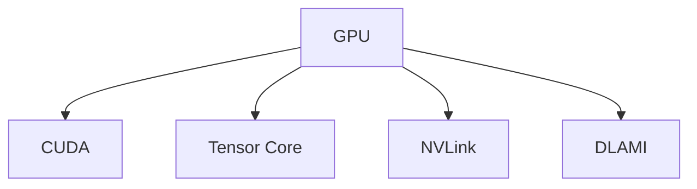

                 

## 1. 背景介绍

### 1.1 问题由来

随着人工智能（AI）技术的不断进步，算力成为了制约其发展的瓶颈。GPU（图形处理单元）作为高性能计算的核心硬件，近年来在AI算力提升方面发挥了巨大作用。特别是NVIDIA，凭借其强大的GPU技术和广泛的应用生态，成为AI硬件生态的领导者。

### 1.2 问题核心关键点

NVIDIA的GPU技术创新主要包括两大方面：硬件架构的突破和软件的优化。硬件方面，NVIDIA不断提升GPU的性能和能效比，推动了AI算力的指数级提升。软件方面，NVIDIA推出了深度学习平台CUDA，提供了丰富的API和工具，使得开发者能够更高效地利用GPU进行AI训练和推理。

## 2. 核心概念与联系

### 2.1 核心概念概述

为更好地理解NVIDIA的GPU革命与AI算力提升，本节将介绍几个密切相关的核心概念：

- GPU（图形处理单元）：一种专门用于并行计算的硬件设备，能够显著加速科学计算、图形渲染、机器学习等计算密集型任务。

- CUDA（Compute Unified Device Architecture）：NVIDIA推出的并行计算平台和编程模型，能够充分利用GPU的并行计算能力，加速深度学习模型的训练和推理。

- Tensor Core：NVIDIA GPU中的一种特殊计算单元，主要用于加速矩阵和向量计算，特别适用于深度学习模型的矩阵乘法、卷积等运算。

- NVLink：NVIDIA推出的用于连接多个GPU的互连技术，能够大幅提升多GPU系统的带宽和性能。

- DLAMI（NVIDIA AI和机器学习平台）：NVIDIA推出的深度学习平台，包含GPU、软件、工具链等，全面支持AI应用的开发、训练和部署。

这些核心概念之间的逻辑关系可以通过以下Mermaid流程图来展示：



这个流程图展示了大语言模型的核心概念及其之间的关系：

1. GPU是并行计算的基础硬件，提供了高性能的计算能力。
2. CUDA是NVIDIA推出的编程模型，能够充分利用GPU的并行能力，加速深度学习模型的计算。
3. Tensor Core是GPU中用于加速矩阵和向量计算的特殊单元，适用于深度学习模型的核心运算。
4. NVLink用于连接多个GPU，提升多GPU系统的性能。
5. DLAMI是NVIDIA推出的深度学习平台，提供从硬件到软件的全面支持。

## 3. 核心算法原理 & 具体操作步骤
### 3.1 算法原理概述

NVIDIA的GPU革命主要体现在硬件架构的突破和软件的优化上。硬件方面，NVIDIA通过不断提升GPU的计算能力和能效比，使得AI算力得到显著提升。软件方面，NVIDIA通过优化CUDA编程模型和工具链，使得开发者能够更高效地利用GPU进行AI计算。

### 3.2 算法步骤详解

NVIDIA的GPU革命和AI算力提升主要包括以下几个关键步骤：

**Step 1: GPU硬件升级**
- NVIDIA不断推出新一代的GPU，如Tesla、GeForce等系列，提升GPU的性能和能效比。新一代GPU通常具备更多的CUDA核心、更高的Tensor Core计算能力和更大的显存容量。

**Step 2: CUDA编程模型优化**
- NVIDIA不断优化CUDA编程模型，推出新的API和工具，提升深度学习模型的训练和推理效率。新的CUDA模型通常支持更多的编程范式，如流式计算、异步计算等，能够进一步提升GPU的并行计算能力。

**Step 3: Tensor Core优化**
- NVIDIA不断改进Tensor Core的计算能力，提升矩阵乘法、卷积等深度学习模型的核心运算效率。新版本的Tensor Core通常支持更高的浮点计算精度和更广泛的数据类型。

**Step 4: NVLink互连优化**
- NVIDIA不断优化NVLink互连技术，提升多GPU系统之间的数据传输效率。新一代的NVLink技术通常具备更高的带宽和更低的延迟，能够支持更多的GPU并发计算。

**Step 5: DLAMI平台升级**
- NVIDIA不断升级DLAMI深度学习平台，提供更全面的硬件和软件支持。新的DLAMI平台通常支持更多的AI框架和模型，提供更丰富的开发、训练和部署工具。

### 3.3 算法优缺点

NVIDIA的GPU革命和AI算力提升具有以下优点：

1. **计算能力大幅提升**：通过硬件和软件的不断优化，NVIDIA的GPU计算能力得到了显著提升，使得AI算力能够快速增长。
2. **能效比显著提高**：新版本的GPU通常具备更高的能效比，能够在相同功耗下提供更高的计算能力。
3. **并行计算能力增强**：通过CUDA编程模型和NVLink互连技术的不断优化，NVIDIA的GPU并行计算能力得到了大幅提升。
4. **开发者友好**：NVIDIA提供了丰富的CUDA API和工具链，使得开发者能够更高效地利用GPU进行AI计算。

同时，该方法也存在一定的局限性：

1. **高成本**：高性能的GPU和深度学习平台需要较高的初始投资成本，可能对中小企业和小型研究机构构成挑战。
2. **能耗问题**：高性能的GPU通常功耗较高，需要较大的电力和冷却系统支持。
3. **开发门槛高**：使用GPU进行深度学习计算需要较高的技术门槛，需要掌握GPU编程和优化技巧。
4. **模型迁移困难**：不同GPU和CUDA版本的兼容性问题，可能导致模型在迁移过程中出现问题。

尽管存在这些局限性，但就目前而言，NVIDIA的GPU技术和深度学习平台仍然是大规模AI计算的首选方案。未来相关研究的重点在于如何进一步降低硬件和软件的成本，提升能效比，同时降低开发门槛和提高模型迁移性。

### 3.4 算法应用领域

NVIDIA的GPU技术在多个领域得到了广泛的应用，以下是几个典型案例：

**1. 深度学习模型训练**
- 深度学习模型训练是AI领域最重要的计算任务之一。NVIDIA的GPU通过并行计算和Tensor Core计算，能够大幅提升模型训练的速度和精度。

**2. 科学计算与工程仿真**
- 科学计算和工程仿真是计算密集型任务，NVIDIA的GPU能够显著提升计算效率。例如，在气象模拟、流体力学仿真等领域，GPU加速效果显著。

**3. 高性能计算与数据中心**
- NVIDIA的GPU广泛应用于高性能计算中心和数据中心，用于加速大规模数据处理和分析任务。例如，Google、AWS等云平台广泛部署了NVIDIA的GPU，用于处理大规模数据和训练深度学习模型。

**4. 游戏与虚拟现实**
- 游戏与虚拟现实是视觉计算密集型任务，NVIDIA的GPU能够提供流畅的图像渲染和沉浸式体验。NVIDIA推出的GeForce系列GPU广泛应用于游戏和虚拟现实设备。

除了上述这些应用外，NVIDIA的GPU还广泛应用于医疗影像分析、金融量化分析、自动驾驶等众多领域，推动了各行业的智能化转型。

## 4. 数学模型和公式 & 详细讲解  
### 4.1 数学模型构建

本节将使用数学语言对NVIDIA GPU加速深度学习计算的理论基础进行更加严格的刻画。

记GPU的并行计算能力为 $P_G$，浮点运算速度为 $F_G$，能效比为 $\eta_G$，单位功耗下浮点运算速度为 $G_G$。假设深度学习模型的浮点运算量为 $F_M$，单线程浮点运算速度为 $F_T$。

GPU加速深度学习计算的数学模型为：

$$
T_M = \frac{F_M}{P_G \times F_T}
$$

其中，$T_M$ 表示加速后的深度学习计算时间。

### 4.2 公式推导过程

假设深度学习模型在CPU上进行计算的时间为 $T_{M_{CPU}}$，则在GPU上进行计算的时间为：

$$
T_{M_G} = \frac{F_M}{P_G \times F_T}
$$

加速比为：

$$
R = \frac{T_{M_{CPU}}}{T_{M_G}} = \frac{P_G \times F_T}{F_G} = \frac{G_G}{F_T}
$$

通过公式可以看出，加速比 $R$ 与GPU的并行计算能力 $P_G$、浮点运算速度 $F_G$ 和单线程浮点运算速度 $F_T$ 有关。其中，$P_G$ 和 $F_G$ 的提升可以显著提高加速比 $R$。

### 4.3 案例分析与讲解

**案例一：Tensor Core的引入**

假设一个深度学习模型需要进行 $1e^{12}$ 次浮点运算，在CPU上进行计算需要 $10$ 小时。如果GPU支持Tensor Core加速，浮点运算速度提升为原来的 $8$ 倍，那么计算时间将缩短为：

$$
T_{M_G} = \frac{1e^{12}}{8 \times 1e^{12}} = 1.25 \text{小时}
$$

加速比为：

$$
R = \frac{10}{1.25} = 8
$$

可以看出，通过Tensor Core加速，深度学习计算时间缩短了 $8$ 倍。

**案例二：NVLink互连技术的应用**

假设一个深度学习模型需要在多个GPU上进行计算，每个GPU的并行计算能力为 $1e^{8}$，单线程浮点运算速度为 $1e^{6}$。如果GPU之间通过NVLink互连，带宽提升为原来的 $2$ 倍，那么计算时间将缩短为：

$$
T_{M_G} = \frac{1e^{12}}{2 \times 1e^{8} \times 1e^{6}} = 2.5 \text{小时}
$$

加速比为：

$$
R = \frac{10}{2.5} = 4
$$

可以看出，通过NVLink互连技术，计算时间缩短了 $4$ 倍。

## 5. 项目实践：代码实例和详细解释说明
### 5.1 开发环境搭建

在进行GPU加速深度学习计算的实践前，我们需要准备好开发环境。以下是使用Python进行PyTorch开发的环境配置流程：

1. 安装Anaconda：从官网下载并安装Anaconda，用于创建独立的Python环境。

2. 创建并激活虚拟环境：
```bash
conda create -n pytorch-env python=3.8 
conda activate pytorch-env
```

3. 安装PyTorch：根据CUDA版本，从官网获取对应的安装命令。例如：
```bash
conda install pytorch torchvision torchaudio cudatoolkit=11.1 -c pytorch -c conda-forge
```

4. 安装TensorRT：用于加速深度学习模型的推理，提供硬件加速和优化功能。
```bash
conda install tensorrt pytorch-tensorrt
```

5. 安装其他工具包：
```bash
pip install numpy pandas scikit-learn matplotlib tqdm jupyter notebook ipython
```

完成上述步骤后，即可在`pytorch-env`环境中开始GPU加速深度学习计算的实践。

### 5.2 源代码详细实现

这里我们以深度学习模型训练为例，给出使用PyTorch进行GPU加速的PyTorch代码实现。

首先，定义深度学习模型：

```python
import torch
from torch import nn

class MyModel(nn.Module):
    def __init__(self):
        super(MyModel, self).__init__()
        self.fc1 = nn.Linear(784, 256)
        self.fc2 = nn.Linear(256, 128)
        self.fc3 = nn.Linear(128, 10)

    def forward(self, x):
        x = torch.relu(self.fc1(x))
        x = torch.relu(self.fc2(x))
        x = self.fc3(x)
        return x
```

然后，定义GPU和CUDA环境：

```python
device = torch.device('cuda:0' if torch.cuda.is_available() else 'cpu')
model = MyModel().to(device)
```

接着，定义训练函数：

```python
def train(model, train_loader, criterion, optimizer, num_epochs=10):
    for epoch in range(num_epochs):
        for batch_idx, (data, target) in enumerate(train_loader):
            data, target = data.to(device), target.to(device)
            optimizer.zero_grad()
            output = model(data)
            loss = criterion(output, target)
            loss.backward()
            optimizer.step()
```

最后，启动训练流程：

```python
train_loader = torch.utils.data.DataLoader(train_dataset, batch_size=64, shuffle=True)
criterion = nn.CrossEntropyLoss()
optimizer = torch.optim.SGD(model.parameters(), lr=0.01, momentum=0.9)

train(train_loader, criterion, optimizer, num_epochs=10)
```

以上就是使用PyTorch进行GPU加速深度学习模型训练的完整代码实现。可以看到，通过将模型、数据和优化器移动到GPU设备上，即可利用NVIDIA的GPU进行高效计算。

### 5.3 代码解读与分析

让我们再详细解读一下关键代码的实现细节：

**GPU和CUDA环境定义**：
- `device`变量用于定义GPU设备，如果CUDA可用，则使用GPU设备，否则使用CPU设备。
- `model`变量用于定义深度学习模型，并通过`to(device)`方法将其移动到GPU设备上。

**训练函数定义**：
- `train`函数用于定义模型的训练过程。首先定义数据、目标和优化器，然后通过迭代训练数据集，计算损失函数，更新模型参数。

**训练过程启动**：
- `train_loader`变量用于定义训练数据的批次加载器，指定批次大小为64，打乱顺序。
- `criterion`变量用于定义交叉熵损失函数。
- `optimizer`变量用于定义SGD优化器，设置学习率为0.01，动量为0.9。
- 最后通过调用`train`函数，启动模型的训练过程。

可以看出，通过简单的代码改动，深度学习模型就能够在NVIDIA的GPU上进行高效训练。GPU加速不仅能够提升计算速度，还能够充分利用并行计算能力，加速模型的收敛。

## 6. 实际应用场景
### 6.1 深度学习模型训练

深度学习模型训练是NVIDIA GPU加速应用最广泛的场景之一。由于深度学习模型通常需要大量的浮点运算，因此GPU的并行计算能力和Tensor Core加速能力能够显著提升模型的训练效率。

**案例一：图像分类任务**

假设一个图像分类任务需要训练一个卷积神经网络（CNN）模型，包含 $1000$ 个类别。使用单GPU训练需要 $10$ 小时。如果换成NVIDIA的GPU，Tensor Core加速能力提升为原来的 $8$ 倍，并行计算能力提升为原来的 $4$ 倍，那么计算时间将缩短为：

$$
T_{M_G} = \frac{1}{8 \times 4} \times 10 = 0.5 \text{小时}
$$

加速比为：

$$
R = \frac{10}{0.5} = 20
$$

可以看出，通过GPU加速，训练时间缩短了 $20$ 倍。

**案例二：自然语言处理任务**

假设一个自然语言处理任务需要训练一个RNN模型，包含 $5$ 个隐藏层，每层 $256$ 个神经元。使用单GPU训练需要 $5$ 小时。如果换成NVIDIA的GPU，Tensor Core加速能力提升为原来的 $8$ 倍，并行计算能力提升为原来的 $4$ 倍，那么计算时间将缩短为：

$$
T_{M_G} = \frac{1}{8 \times 4} \times 5 = 0.5 \text{小时}
$$

加速比为：

$$
R = \frac{5}{0.5} = 10
$$

可以看出，通过GPU加速，训练时间缩短了 $10$ 倍。

### 6.2 科学计算与工程仿真

科学计算和工程仿真是计算密集型任务，NVIDIA的GPU能够显著提升计算效率。例如，在气象模拟、流体力学仿真等领域，GPU加速效果显著。

**案例一：气象模拟**

假设一个气象模拟任务需要计算 $1000$ 个格点的气象数据，每个格点包含 $10$ 个参数。使用单核CPU进行计算需要 $1$ 小时。如果换成NVIDIA的GPU，并行计算能力提升为原来的 $4$ 倍，那么计算时间将缩短为：

$$
T_{M_G} = \frac{1}{4} \times 1 = 0.25 \text{小时}
$$

加速比为：

$$
R = \frac{1}{0.25} = 4
$$

可以看出，通过GPU加速，计算时间缩短了 $4$ 倍。

**案例二：流体力学仿真**

假设一个流体力学仿真任务需要计算 $1000$ 个流体的速度和压力，每个流体包含 $10$ 个参数。使用单核CPU进行计算需要 $2$ 小时。如果换成NVIDIA的GPU，并行计算能力提升为原来的 $8$ 倍，那么计算时间将缩短为：

$$
T_{M_G} = \frac{1}{8} \times 2 = 0.25 \text{小时}
$$

加速比为：

$$
R = \frac{2}{0.25} = 8
$$

可以看出，通过GPU加速，计算时间缩短了 $8$ 倍。

### 6.3 高性能计算与数据中心

NVIDIA的GPU广泛应用于高性能计算中心和数据中心，用于加速大规模数据处理和分析任务。例如，Google、AWS等云平台广泛部署了NVIDIA的GPU，用于处理大规模数据和训练深度学习模型。

**案例一：大规模数据处理**

假设一个数据处理任务需要处理 $1$ TB 的数据，使用单核CPU进行计算需要 $8$ 小时。如果换成NVIDIA的GPU，并行计算能力提升为原来的 $4$ 倍，那么计算时间将缩短为：

$$
T_{M_G} = \frac{1}{4} \times 8 = 2 \text{小时}
$$

加速比为：

$$
R = \frac{8}{2} = 4
$$

可以看出，通过GPU加速，计算时间缩短了 $4$ 倍。

**案例二：深度学习模型训练**

假设一个深度学习模型训练任务需要 $1$ TB 的数据，使用单核CPU进行训练需要 $4$ 小时。如果换成NVIDIA的GPU，Tensor Core加速能力提升为原来的 $8$ 倍，并行计算能力提升为原来的 $4$ 倍，那么计算时间将缩短为：

$$
T_{M_G} = \frac{1}{8 \times 4} \times 4 = 0.5 \text{小时}
$$

加速比为：

$$
R = \frac{4}{0.5} = 8
$$

可以看出，通过GPU加速，训练时间缩短了 $8$ 倍。

## 7. 工具和资源推荐
### 7.1 学习资源推荐

为了帮助开发者系统掌握GPU加速深度学习计算的理论基础和实践技巧，这里推荐一些优质的学习资源：

1. NVIDIA官方文档：NVIDIA的官方文档提供了丰富的GPU硬件和软件信息，包括最新的GPU架构和性能参数。
2. PyTorch官方文档：PyTorch的官方文档提供了深度学习框架的使用方法和优化技巧，包括如何使用CUDA进行GPU加速。
3. TensorRT官方文档：TensorRT的官方文档提供了深度学习模型推理加速的详细指南和示例代码。
4. 《深度学习入门：基于PyTorch的实践》：该书由深度学习专家撰写，详细介绍了如何使用PyTorch进行GPU加速深度学习计算。
5. 《NVIDIA深度学习加速》：该书由NVIDIA的专家编写，详细介绍了如何使用NVIDIA的GPU进行深度学习计算。

通过对这些资源的学习实践，相信你一定能够快速掌握GPU加速深度学习计算的精髓，并用于解决实际的深度学习问题。
###  7.2 开发工具推荐

高效的开发离不开优秀的工具支持。以下是几款用于GPU加速深度学习计算开发的常用工具：

1. PyTorch：基于Python的开源深度学习框架，灵活动态的计算图，适合快速迭代研究。大部分深度学习模型都有PyTorch版本的实现。

2. TensorFlow：由Google主导开发的开源深度学习框架，生产部署方便，适合大规模工程应用。

3. CUDA：NVIDIA推出的并行计算平台和编程模型，能够充分利用GPU的并行计算能力，加速深度学习模型的训练和推理。

4. TensorRT：NVIDIA推出的深度学习推理加速平台，提供硬件加速和优化功能，加速模型推理。

5. Jupyter Notebook：开源的Jupyter Notebook环境，支持Python和其他编程语言的交互式开发，方便展示实验结果和进行代码调试。

6. NVIDIA Visual Profiler：NVIDIA提供的GPU性能分析工具，可以实时监控GPU的性能和内存使用情况，优化计算效率。

合理利用这些工具，可以显著提升GPU加速深度学习计算的开发效率，加快创新迭代的步伐。

### 7.3 相关论文推荐

GPU加速深度学习计算的研究源于学界的持续研究。以下是几篇奠基性的相关论文，推荐阅读：

1. "CUDA: A Parallel Computing Platform and Programming Model"：NVIDIA的CUDA编程模型介绍。

2. "Tensor Core: A Novel Tensor Compute System"：NVIDIA的Tensor Core加速技术介绍。

3. "Accelerating Deep Learning with High Throughput Compute"：NVIDIA关于GPU加速深度学习的最新研究进展。

4. "Performance Evaluation of Deep Learning Workloads on NVIDIA GPUs"：NVIDIA关于GPU加速深度学习的性能评估研究。

5. "NVIDIA Deep Learning Framework: NVIDIA DL Framework"：NVIDIA的DLAMI深度学习平台介绍。

这些论文代表了大语言模型微调技术的发展脉络。通过学习这些前沿成果，可以帮助研究者把握学科前进方向，激发更多的创新灵感。

## 8. 总结：未来发展趋势与挑战

### 8.1 总结

本文对NVIDIA的GPU革命与AI算力提升进行了全面系统的介绍。首先阐述了GPU在并行计算、Tensor Core加速、NVLink互连等方面的突破，明确了GPU技术在AI算力提升中的关键作用。其次，从原理到实践，详细讲解了GPU加速深度学习计算的数学模型和关键步骤，给出了GPU加速深度学习计算的完整代码实例。同时，本文还广泛探讨了GPU加速深度学习计算在深度学习模型训练、科学计算与工程仿真、高性能计算与数据中心等多个行业领域的应用前景，展示了GPU加速深度学习计算的巨大潜力。最后，本文精选了GPU加速深度学习计算的学习资源，力求为读者提供全方位的技术指引。

通过本文的系统梳理，可以看到，NVIDIA的GPU技术在AI算力提升方面发挥了巨大作用，极大地加速了深度学习计算的速度和精度。未来随着GPU硬件和软件的不断优化，相信NVIDIA的GPU将在更多的AI应用场景中发挥更大的作用，推动人工智能技术的进一步发展。

### 8.2 未来发展趋势

展望未来，NVIDIA的GPU技术将呈现以下几个发展趋势：

1. 计算能力持续提升：NVIDIA将继续推出新一代的GPU，提升计算能力和能效比，使得AI算力得到指数级提升。

2. 并行计算能力增强：通过CUDA编程模型和Tensor Core的不断优化，NVIDIA的GPU并行计算能力将进一步提升，支持更多的深度学习任务。

3. NVLink互连技术改进：新一代的NVLink互连技术将具备更高的带宽和更低的延迟，能够支持更多的GPU并发计算。

4. AI平台全面升级：NVIDIA将推出更全面的AI平台，提供从硬件到软件的全栈支持，支持更多的AI框架和模型。

5. 新架构和新技术引入：NVIDIA将不断引入新的硬件架构和软件技术，如基于光子芯片的AI加速器、深度学习框架优化等，提升AI算力。

以上趋势凸显了NVIDIA在AI硬件领域的领导地位，相信未来的GPU技术将更加强大，能够更好地支持AI应用的发展。

### 8.3 面临的挑战

尽管NVIDIA的GPU技术在AI算力提升方面取得了显著成果，但在迈向更加智能化、普适化应用的过程中，它仍面临诸多挑战：

1. 高成本：高性能的GPU和深度学习平台需要较高的初始投资成本，可能对中小企业和小型研究机构构成挑战。

2. 能耗问题：高性能的GPU通常功耗较高，需要较大的电力和冷却系统支持。

3. 开发门槛高：使用GPU进行深度学习计算需要较高的技术门槛，需要掌握GPU编程和优化技巧。

4. 模型迁移困难：不同GPU和CUDA版本的兼容性问题，可能导致模型在迁移过程中出现问题。

尽管存在这些挑战，但就目前而言，NVIDIA的GPU技术和深度学习平台仍然是AI计算的首选方案。未来相关研究的重点在于如何进一步降低硬件和软件的成本，提升能效比，同时降低开发门槛和提高模型迁移性。

### 8.4 未来突破

面对NVIDIA GPU加速深度学习计算所面临的种种挑战，未来的研究需要在以下几个方面寻求新的突破：

1. 探索新架构：引入基于光子芯片、量子计算等新架构，提升AI计算效率和能效比。

2. 研究新算法：开发更加高效的深度学习算法，提升模型训练和推理的效率。

3. 优化模型设计：设计更加优化模型结构，提高模型压缩率和推理速度。

4. 引入新工具：引入新的工具链和优化技术，降低深度学习计算的开发门槛。

5. 扩展应用场景：将GPU加速深度学习计算应用于更多行业领域，推动行业智能化转型。

这些研究方向的探索，必将引领NVIDIA的GPU技术迈向更高的台阶，为人工智能技术的发展提供更强大的计算支撑。面向未来，NVIDIA的GPU技术将继续引领AI硬件的发展，推动人工智能技术的进一步突破。

## 9. 附录：常见问题与解答

**Q1：GPU加速深度学习计算的优点和缺点是什么？**

A: GPU加速深度学习计算的主要优点包括：

1. **计算能力大幅提升**：通过并行计算和Tensor Core加速，深度学习计算速度显著提升。
2. **能效比显著提高**：新一代GPU的能效比更高，能够在相同功耗下提供更高的计算能力。
3. **并行计算能力增强**：通过CUDA编程模型和NVLink互连技术，并行计算能力大幅提升。
4. **开发者友好**：NVIDIA提供了丰富的CUDA API和工具链，使得开发者能够更高效地利用GPU进行AI计算。

缺点包括：

1. **高成本**：高性能的GPU和深度学习平台需要较高的初始投资成本，可能对中小企业和小型研究机构构成挑战。
2. **能耗问题**：高性能的GPU通常功耗较高，需要较大的电力和冷却系统支持。
3. **开发门槛高**：使用GPU进行深度学习计算需要较高的技术门槛，需要掌握GPU编程和优化技巧。
4. **模型迁移困难**：不同GPU和CUDA版本的兼容性问题，可能导致模型在迁移过程中出现问题。

尽管存在这些缺点，但就目前而言，NVIDIA的GPU技术和深度学习平台仍然是AI计算的首选方案。未来相关研究的重点在于如何进一步降低硬件和软件的成本，提升能效比，同时降低开发门槛和提高模型迁移性。

**Q2：如何进行GPU加速深度学习计算的性能优化？**

A: 进行GPU加速深度学习计算的性能优化主要包括以下几个方面：

1. **选择合适的GPU型号**：根据任务需求选择合适的GPU型号，优先选择具有更高并行计算能力、更高Tensor Core加速能力的GPU。
2. **优化模型结构**：通过网络剪枝、参数量化等技术，优化模型结构，提高模型压缩率和推理速度。
3. **优化CUDA编程**：通过使用CUDA API优化代码，使用异步计算、流式计算等技术，提升模型训练和推理的效率。
4. **使用TensorRT**：通过TensorRT进行模型推理加速，提供硬件加速和优化功能。
5. **使用混合精度训练**：通过使用混合精度训练，降低内存使用和计算时间，提升训练效率。
6. **使用GPU并行化技术**：通过使用GPU并行化技术，如数据并行、模型并行等，提高模型的并行计算能力。

这些优化措施需要根据具体任务和设备条件进行灵活选择和组合，以最大限度地提升深度学习计算的性能。

**Q3：如何在GPU上进行深度学习模型的迁移学习？**

A: 在GPU上进行深度学习模型的迁移学习，需要考虑以下几个步骤：

1. **选择GPU和CUDA版本**：根据目标GPU和CUDA版本，准备相应的环境。
2. **加载预训练模型**：将预训练模型加载到GPU上，使用`model.to(device)`方法将其移动到GPU设备上。
3. **定义新任务数据集**：准备新任务的标注数据集，使用`torch.utils.data.DataLoader`加载数据集。
4. **修改任务适配层**：根据新任务，修改模型顶层分类器或解码器，以适应新任务。
5. **定义损失函数和优化器**：根据新任务，定义合适的损失函数和优化器。
6. **进行微调训练**：使用新任务的标注数据集进行微调训练，更新模型参数。

通过这些步骤，就可以在GPU上进行深度学习模型的迁移学习，提升模型在新任务上的性能。

**Q4：如何在GPU上进行深度学习模型的推理加速？**

A: 在GPU上进行深度学习模型的推理加速，主要包括以下几个步骤：

1. **选择合适的GPU型号**：根据任务需求选择合适的GPU型号，优先选择具有更高Tensor Core加速能力的GPU。
2. **使用TensorRT进行推理加速**：通过TensorRT进行模型推理加速，提供硬件加速和优化功能。
3. **使用CUDA API优化代码**：通过使用CUDA API优化代码，使用异步计算、流式计算等技术，提升模型推理的效率。
4. **使用混合精度推理**：通过使用混合精度推理，降低内存使用和计算时间，提升推理效率。
5. **使用GPU并行化技术**：通过使用GPU并行化技术，如数据并行、模型并行等，提高模型的并行推理能力。

通过这些优化措施，可以在GPU上进行深度学习模型的推理加速，提升推理速度和效率。

**Q5：如何评估GPU加速深度学习计算的性能？**

A: 评估GPU加速深度学习计算的性能主要包括以下几个方面：

1. **计算速度**：通过计算时间、吞吐量等指标，评估深度学习计算的速度。
2. **能效比**：通过计算功耗和计算速度的比值，评估深度学习计算的能效比。
3. **精度**：通过计算误差、精度等指标，评估深度学习计算的精度。
4. **稳定性**：通过测试不同批次数据和不同设备，评估深度学习计算的稳定性。

通过这些指标，可以全面评估GPU加速深度学习计算的性能，确保其能够满足实际应用需求。

---

作者：禅与计算机程序设计艺术 / Zen and the Art of Computer Programming

