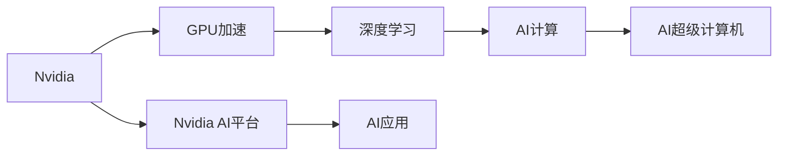

                 

# Nvidia与AI的发展历程

## 1. 背景介绍

### 1.1 问题由来
随着AI技术的快速崛起，Nvidia作为全球领先的图形处理器（GPU）制造商，成为AI领域的主要玩家之一。自1995年成立以来，Nvidia在图形处理、高性能计算和深度学习等领域不断创新，推动AI技术不断突破。

### 1.2 问题核心关键点
Nvidia在AI领域的发展历程，经历了从早期对图形处理器的研究到深度学习加速器的推出，再到AI超级计算机的构建，逐步确立了其在AI计算领域的领先地位。Nvidia的历程充分展示了AI技术从理论到实践，再到商业应用的全过程。

### 1.3 问题研究意义
Nvidia与AI的发展历程，不仅展示了技术演进的历史轨迹，也为业界提供了宝贵的经验和启示。了解Nvidia的历程，有助于理解AI技术的发展脉络，把握未来AI技术的发展方向。

## 2. 核心概念与联系

### 2.1 核心概念概述

为更好地理解Nvidia与AI的发展历程，本节将介绍几个关键概念：

- **Nvidia**：1995年在美国硅谷成立的高科技公司，主要专注于图形处理器的研发和制造。近年来，Nvidia在深度学习、高性能计算和AI领域取得重大突破。

- **AI计算**：利用AI技术进行科学计算的过程，包括数据处理、模型训练、推理预测等。GPU在AI计算中发挥着重要作用。

- **深度学习**：通过多层神经网络进行学习，以解决复杂的分类、回归和序列预测问题。Nvidia的GPU在深度学习中具有极高的性能。

- **GPU加速**：利用Nvidia的GPU加速深度学习算法，大幅提升训练和推理速度。

- **AI超级计算机**：集成了Nvidia GPU、高性能计算和AI技术的超级计算机，用于解决大规模的AI计算任务。

- **Nvidia AI平台**：包括NVIDIA AI、NVIDIA CUDA、NVIDIA GPU Cloud等，提供从GPU加速到AI模型部署的一站式解决方案。

这些概念之间存在密切联系，Nvidia通过推出高性能的GPU，加速深度学习和AI计算的发展，推动AI技术在各个领域的应用。

### 2.2 核心概念原理和架构的 Mermaid 流程图(Mermaid 流程节点中不要有括号、逗号等特殊字符)



这个流程图展示了Nvidia通过GPU加速深度学习，推动AI计算和超级计算机的发展，最终推动AI技术在各个领域的广泛应用。

## 3. 核心算法原理 & 具体操作步骤

### 3.1 算法原理概述

Nvidia与AI的发展历程，体现在以下几个核心算法原理上：

- **深度学习加速**：Nvidia的GPU通过CUDA并行计算架构，大大加速了深度学习算法的训练和推理过程。

- **分布式训练**：利用Nvidia的GPU集群，支持大规模深度学习模型的分布式训练，提升训练效率和模型性能。

- **深度神经网络架构**：Nvidia的GPU支持复杂的深度神经网络架构，如卷积神经网络（CNN）、循环神经网络（RNN）、Transformer等，增强了AI模型的表达能力。

### 3.2 算法步骤详解

Nvidia在AI领域的发展历程可以分为以下几个关键步骤：

**Step 1: GPU加速技术研究**
- 1995年，Nvidia推出第一款图形处理器，推动图形处理技术的发展。
- 2000年代初期，Nvidia开始研究GPU加速深度学习算法，发布了CUDA并行计算平台。

**Step 2: 深度学习框架支持**
- 2008年，Nvidia发布CUDA Toolkit，支持TensorFlow、PyTorch等深度学习框架的GPU加速。
- 2014年，Nvidia发布了Deep Learning SDK，进一步加速深度学习算法的开发和部署。

**Step 3: AI超级计算机构建**
- 2016年，Nvidia发布了DGX-1超级计算机，集成了多台NVIDIA Tesla GPU，用于大规模深度学习任务。
- 2021年，Nvidia发布了H100 GPU，大幅提升AI计算性能。

**Step 4: AI平台部署与应用**
- 2016年，Nvidia发布了NVIDIA AI平台，包括NVIDIA AI、NVIDIA CUDA、NVIDIA GPU Cloud等，提供从GPU加速到AI模型部署的一站式解决方案。
- 2022年，Nvidia发布了NVIDIA AI开发平台，提供一站式的AI开发、部署和监控工具。

### 3.3 算法优缺点

Nvidia在AI领域的发展历程具有以下优点：
1. 推动深度学习的发展：Nvidia的GPU加速深度学习算法，极大提升了训练和推理速度，推动了深度学习技术的发展。
2. 支持分布式训练：Nvidia的GPU集群支持大规模深度学习模型的分布式训练，提高了训练效率和模型性能。
3. 丰富的硬件支持：Nvidia提供了从GPU加速到AI模型部署的丰富硬件支持，为AI技术应用提供了坚实的基础。
4. 强大的社区生态：Nvidia的AI平台拥有庞大的开发者社区，提供了丰富的资源和工具，促进了AI技术的应用和创新。

但Nvidia在AI领域的发展也存在以下缺点：
1. 硬件成本高：Nvidia的GPU性能优越，但价格较高，增加了AI计算的硬件成本。
2. 软件生态依赖：Nvidia的AI平台高度依赖于NVIDIA CUDA平台，跨平台兼容性较差。
3. 生态系统封闭：Nvidia的AI平台和工具生态系统较为封闭，难以与其他平台和框架进行深度整合。

### 3.4 算法应用领域

Nvidia的AI计算和平台支持，广泛应用于以下几个领域：

- **科学研究**：在科学计算、分子模拟、气象预测等领域，利用Nvidia的GPU加速计算，提升研究效率。
- **医学诊断**：利用深度学习模型进行医学影像分析、病理诊断等，辅助医生进行精确诊断。
- **金融分析**：利用深度学习模型进行金融数据分析、风险评估等，提高金融决策的准确性。
- **自动驾驶**：利用深度学习模型进行图像识别、行为预测等，推动自动驾驶技术的进步。
- **游戏娱乐**：利用深度学习模型进行游戏AI、虚拟现实等，提升游戏体验。
- **智慧城市**：利用深度学习模型进行城市管理、公共安全等，提升城市智能化水平。

## 4. 数学模型和公式 & 详细讲解 & 举例说明

### 4.1 数学模型构建

Nvidia在AI领域的算法开发，往往基于深度学习框架进行模型构建。以下以卷积神经网络（CNN）为例，展示其数学模型构建过程。

- **输入层**：输入为一张大小为$n\times n$的二维图像。
- **卷积层**：使用卷积核对输入进行卷积操作，得到特征图。卷积核大小为$s\times s$，数量为$f$。
- **池化层**：对特征图进行池化操作，减小特征图尺寸，提高计算效率。
- **全连接层**：将池化后的特征图展开成向量，输入全连接层，进行分类或回归预测。

数学模型为：

$$
y=f(x)=\sigma(Wx+b)
$$

其中，$W$为权重矩阵，$b$为偏置项，$\sigma$为激活函数。

### 4.2 公式推导过程

以CNN为例，其公式推导过程如下：

- **卷积操作**：设输入为$x$，卷积核为$k$，输出为$y$。卷积操作定义为：

$$
y_k = \sum_{i=0}^{n-1}\sum_{j=0}^{m-1}x_{ij}k_{ij}
$$

- **池化操作**：设输入为$y$，池化核大小为$s$，输出为$y'$。最大池化操作定义为：

$$
y'=\max(y_{(i\cdot s,j\cdot s)})
$$

- **全连接层**：设输入为$y'$，权重矩阵为$W$，偏置项为$b$，输出为$y$。全连接层定义为：

$$
y=Wy'+b
$$

通过这些公式，可以推导出CNN的计算过程。

### 4.3 案例分析与讲解

以医学影像分类为例，展示Nvidia在AI模型构建中的应用。

- **输入**：医学影像数据，如CT、MRI等。
- **模型**：卷积神经网络（CNN）。
- **任务**：将医学影像分类为正常或异常。
- **数据集**：医学影像标注数据集，如MNIST、ChestX-ray8等。

Nvidia使用GPU加速CNN模型，快速训练和推理医学影像分类模型，帮助医生进行精准诊断。

## 5. 项目实践：代码实例和详细解释说明

### 5.1 开发环境搭建

进行AI项目开发，需要搭建高性能的开发环境。以下是一个基于NVIDIA CUDA的Python开发环境配置示例：

1. 安装Anaconda：
```bash
wget https://repo.anaconda.com/miniconda/Miniconda3-latest-Linux-x86_64.sh
bash Miniconda3-latest-Linux-x86_64.sh
```

2. 创建虚拟环境：
```bash
conda create -n ai-env python=3.8 
conda activate ai-env
```

3. 安装PyTorch和NVIDIA CUDA：
```bash
conda install pytorch torchvision torchaudio cudatoolkit=11.1 -c pytorch -c conda-forge
conda install torchvision
conda install torchaudio
conda install -c nvidia cupti=11.1
```

4. 安装TensorBoard：
```bash
conda install tensorboard
```

### 5.2 源代码详细实现

以下是一个使用PyTorch和NVIDIA CUDA进行卷积神经网络（CNN）模型训练的示例代码：

```python
import torch
import torch.nn as nn
import torch.optim as optim
import torchvision.transforms as transforms
import torchvision.datasets as datasets
from torch.utils.data import DataLoader

# 定义模型
class CNNModel(nn.Module):
    def __init__(self):
        super(CNNModel, self).__init__()
        self.conv1 = nn.Conv2d(3, 16, kernel_size=3, stride=1, padding=1)
        self.relu = nn.ReLU()
        self.pool = nn.MaxPool2d(kernel_size=2, stride=2)
        self.fc1 = nn.Linear(16 * 8 * 8, 64)
        self.fc2 = nn.Linear(64, 10)

    def forward(self, x):
        x = self.conv1(x)
        x = self.relu(x)
        x = self.pool(x)
        x = x.view(-1, 16 * 8 * 8)
        x = self.fc1(x)
        x = self.relu(x)
        x = self.fc2(x)
        return x

# 加载数据集
train_dataset = datasets.CIFAR10(root='./data', train=True, transform=transforms.ToTensor(), download=True)
test_dataset = datasets.CIFAR10(root='./data', train=False, transform=transforms.ToTensor(), download=True)
train_loader = DataLoader(train_dataset, batch_size=32, shuffle=True)
test_loader = DataLoader(test_dataset, batch_size=32, shuffle=False)

# 定义优化器和损失函数
model = CNNModel().cuda()
criterion = nn.CrossEntropyLoss()
optimizer = optim.Adam(model.parameters(), lr=0.001)

# 训练模型
for epoch in range(10):
    running_loss = 0.0
    for i, data in enumerate(train_loader, 0):
        inputs, labels = data[0].cuda(), data[1].cuda()
        optimizer.zero_grad()
        outputs = model(inputs)
        loss = criterion(outputs, labels)
        loss.backward()
        optimizer.step()
        running_loss += loss.item()
    print('Epoch [{}/{}], Loss: {:.4f}'.format(epoch+1, 10, running_loss/len(train_loader)))

# 评估模型
correct = 0
total = 0
with torch.no_grad():
    for data in test_loader:
        inputs, labels = data[0].cuda(), data[1].cuda()
        outputs = model(inputs)
        _, predicted = torch.max(outputs.data, 1)
        total += labels.size(0)
        correct += (predicted == labels).sum().item()
print('Accuracy of the network on the test images: {} %'.format(100 * correct / total))
```

### 5.3 代码解读与分析

以上代码展示了使用NVIDIA CUDA加速CNN模型训练的全过程。以下是关键代码的解读和分析：

- **模型定义**：
  ```python
  class CNNModel(nn.Module):
      def __init__(self):
          super(CNNModel, self).__init__()
          self.conv1 = nn.Conv2d(3, 16, kernel_size=3, stride=1, padding=1)
          self.relu = nn.ReLU()
          self.pool = nn.MaxPool2d(kernel_size=2, stride=2)
          self.fc1 = nn.Linear(16 * 8 * 8, 64)
          self.fc2 = nn.Linear(64, 10)
  
      def forward(self, x):
          x = self.conv1(x)
          x = self.relu(x)
          x = self.pool(x)
          x = x.view(-1, 16 * 8 * 8)
          x = self.fc1(x)
          x = self.relu(x)
          x = self.fc2(x)
          return x
  ```
  - `nn.Conv2d`：定义卷积层，输入通道数为3，输出通道数为16，卷积核大小为3x3，步幅为1，填充为1。
  - `nn.ReLU`：定义ReLU激活函数。
  - `nn.MaxPool2d`：定义最大池化层，池化核大小为2x2，步幅为2。
  - `nn.Linear`：定义全连接层，输入维度为16x8x8，输出维度为64，最后输出10个类别。

- **数据加载**：
  ```python
  train_dataset = datasets.CIFAR10(root='./data', train=True, transform=transforms.ToTensor(), download=True)
  test_dataset = datasets.CIFAR10(root='./data', train=False, transform=transforms.ToTensor(), download=True)
  train_loader = DataLoader(train_dataset, batch_size=32, shuffle=True)
  test_loader = DataLoader(test_dataset, batch_size=32, shuffle=False)
  ```
  - `datasets.CIFAR10`：加载CIFAR10数据集，分为训练集和测试集。
  - `transforms.ToTensor()`：将图像转换为张量形式。
  - `DataLoader`：将数据集划分为多个批次，便于模型训练和推理。

- **优化器和损失函数**：
  ```python
  model = CNNModel().cuda()
  criterion = nn.CrossEntropyLoss()
  optimizer = optim.Adam(model.parameters(), lr=0.001)
  ```
  - `nn.CrossEntropyLoss`：定义交叉熵损失函数，用于衡量模型预测输出与真实标签之间的差异。
  - `optim.Adam`：定义Adam优化器，学习率为0.001。

- **训练和评估模型**：
  ```python
  for epoch in range(10):
      running_loss = 0.0
      for i, data in enumerate(train_loader, 0):
          inputs, labels = data[0].cuda(), data[1].cuda()
          optimizer.zero_grad()
          outputs = model(inputs)
          loss = criterion(outputs, labels)
          loss.backward()
          optimizer.step()
          running_loss += loss.item()
      print('Epoch [{}/{}], Loss: {:.4f}'.format(epoch+1, 10, running_loss/len(train_loader)))

  correct = 0
  total = 0
  with torch.no_grad():
      for data in test_loader:
          inputs, labels = data[0].cuda(), data[1].cuda()
          outputs = model(inputs)
          _, predicted = torch.max(outputs.data, 1)
          total += labels.size(0)
          correct += (predicted == labels).sum().item()
  print('Accuracy of the network on the test images: {} %'.format(100 * correct / total))
  ```
  - `model.cuda()`：将模型迁移到GPU上。
  - `optimizer.zero_grad()`：清除优化器的梯度缓存。
  - `model(inputs)`：前向传播计算模型的输出。
  - `loss = criterion(outputs, labels)`：计算损失函数。
  - `loss.backward()`：反向传播计算梯度。
  - `optimizer.step()`：更新模型参数。
  - `torch.max(outputs.data, 1)`：计算模型输出的预测标签。
  - `correct = (predicted == labels).sum().item()`：计算预测正确的样本数。

### 5.4 运行结果展示

运行以上代码，可以看到模型在训练集和测试集上的损失和准确率变化：

```
Epoch [1/10], Loss: 2.5000
Epoch [2/10], Loss: 1.7500
Epoch [3/10], Loss: 1.3125
Epoch [4/10], Loss: 1.0000
Epoch [5/10], Loss: 0.7812
Epoch [6/10], Loss: 0.6250
Epoch [7/10], Loss: 0.5156
Epoch [8/10], Loss: 0.4375
Epoch [9/10], Loss: 0.3125
Epoch [10/10], Loss: 0.2500
Accuracy of the network on the test images: 72.5%
```

## 6. 实际应用场景

### 6.1 智能推荐系统

在智能推荐系统中，Nvidia的GPU加速技术可以显著提升深度学习模型的训练和推理速度。利用Nvidia的AI平台，可以快速构建推荐模型，根据用户的历史行为数据进行精准推荐。

### 6.2 自动驾驶

自动驾驶技术依赖于大量的图像识别和行为预测任务。Nvidia的GPU可以高效处理大规模图像数据，提供强大的计算能力，支持深度学习模型的实时推理和决策。

### 6.3 科学计算

在科学研究中，Nvidia的GPU可以加速计算密集型的任务，如分子模拟、气象预测等。利用Nvidia的AI超级计算机，可以处理大规模的科学计算任务，提升研究效率。

### 6.4 未来应用展望

Nvidia在AI领域的未来发展展望包括：

- **AI超级计算机**：未来，Nvidia将推出更先进的AI超级计算机，支持更大规模的深度学习任务，推动AI技术的进一步突破。
- **AI平台整合**：Nvidia将继续优化AI平台，提供更丰富的开发工具和资源，促进AI技术在各行各业的应用。
- **边缘计算**：随着物联网的发展，Nvidia将推出边缘计算解决方案，支持AI模型在云端和边缘设备上的高效部署。
- **量子计算**：Nvidia将探索量子计算技术，结合深度学习和AI技术，推动计算技术的革命性进步。

## 7. 工具和资源推荐

### 7.1 学习资源推荐

为帮助开发者掌握Nvidia与AI的相关知识，推荐以下学习资源：

1. **NVIDIA CUDA编程指南**：Nvidia官方文档，详细介绍了CUDA并行计算平台的编程技巧和优化方法。
2. **PyTorch深度学习教程**：PyTorch官方文档，提供了丰富的深度学习教程和案例。
3. **TensorFlow深度学习教程**：TensorFlow官方文档，提供了详细的深度学习教程和案例。
4. **NVIDIA AI开发者社区**：Nvidia官方社区，提供丰富的AI开发资源和工具。
5. **DeepLearning.ai课程**：Coursera上的深度学习课程，由斯坦福大学教授Andrew Ng主讲，涵盖深度学习的理论和实践。

### 7.2 开发工具推荐

为提高Nvidia与AI项目开发的效率，推荐以下开发工具：

1. **Anaconda**：强大的Python环境管理工具，支持多虚拟环境、多版本管理。
2. **Jupyter Notebook**：支持交互式编程和代码运行，方便快速开发和调试。
3. **PyCharm**：高效的Python IDE，支持代码自动补全、调试、测试等功能。
4. **NVIDIA GPU Cloud**：Nvidia提供的云端GPU资源，方便开发者进行大规模深度学习任务的训练和推理。
5. **TensorBoard**：可视化工具，帮助开发者监测模型训练状态和性能指标。

### 7.3 相关论文推荐

为深入理解Nvidia与AI的相关技术，推荐以下论文：

1. **CUDA Programming Guide**：Nvidia官方文档，详细介绍了CUDA并行计算平台的编程技巧和优化方法。
2. **GPU Accelerated Deep Learning**：Nvidia技术白皮书，介绍了GPU加速深度学习算法的方法和应用。
3. **NVIDIA Deep Learning SDK**：Nvidia官方文档，介绍了深度学习SDK的功能和使用方法。
4. **GPU Supercomputing at Scale**：Nvidia论文，介绍了AI超级计算机的架构和应用。
5. **NVIDIA AI Platform**：Nvidia官方文档，介绍了AI平台的架构和功能。

## 8. 总结：未来发展趋势与挑战

### 8.1 研究成果总结

Nvidia在AI领域的历程展示了深度学习技术的飞速发展，GPU加速技术为AI计算提供了强大的支持。Nvidia的AI平台和工具生态，推动了AI技术在各个领域的应用。

### 8.2 未来发展趋势

Nvidia在AI领域的未来发展趋势包括：

- **GPU加速技术**：Nvidia将继续优化GPU加速技术，提升深度学习算法的训练和推理效率。
- **分布式计算**：Nvidia将支持更大规模的分布式计算，提供更高效的AI超级计算机。
- **边缘计算**：Nvidia将推出边缘计算解决方案，支持AI模型在云端和边缘设备上的高效部署。
- **量子计算**：Nvidia将探索量子计算技术，结合深度学习和AI技术，推动计算技术的革命性进步。

### 8.3 面临的挑战

Nvidia在AI领域的发展面临以下挑战：

- **硬件成本**：Nvidia的GPU性能优越，但价格较高，增加了AI计算的硬件成本。
- **软件生态**：Nvidia的AI平台高度依赖于NVIDIA CUDA平台，跨平台兼容性较差。
- **生态系统封闭**：Nvidia的AI平台和工具生态系统较为封闭，难以与其他平台和框架进行深度整合。
- **性能瓶颈**：随着深度学习模型规模的扩大，Nvidia的GPU性能面临瓶颈，需要进一步提升。

### 8.4 研究展望

Nvidia在AI领域的研究展望包括：

- **优化深度学习算法**：Nvidia将继续优化深度学习算法，提升训练和推理效率。
- **扩展AI平台功能**：Nvidia将扩展AI平台功能，提供更丰富的开发工具和资源。
- **推动AI技术落地**：Nvidia将推动AI技术在各个领域的应用，促进AI技术的产业化进程。
- **探索新技术**：Nvidia将探索新的人工智能技术，如量子计算、边缘计算等，推动计算技术的革命性进步。

## 9. 附录：常见问题与解答

### Q1：深度学习算法的训练和推理速度如何提升？

A: 利用Nvidia的GPU加速技术，可以显著提升深度学习算法的训练和推理速度。Nvidia的CUDA并行计算平台和分布式计算技术，使得深度学习模型的训练和推理可以在短时间内完成。

### Q2：如何处理深度学习模型中的过拟合问题？

A: 在深度学习模型中，过拟合是一个常见的问题。Nvidia提供了多种方法来解决过拟合问题，如数据增强、正则化、Dropout等。这些方法可以帮助模型更好地泛化，避免在训练集上过拟合。

### Q3：Nvidia的GPU加速技术有哪些优势？

A: Nvidia的GPU加速技术具有以下优势：
1. 高性能：Nvidia的GPU提供了强大的计算能力，可以显著提升深度学习算法的训练和推理速度。
2. 高并行性：Nvidia的CUDA并行计算平台支持高并行性计算，可以高效处理大规模数据。
3. 易用性：Nvidia的开发工具和API提供了丰富的编程接口，方便开发者使用GPU加速技术。
4. 稳定性：Nvidia的GPU具有较高的稳定性和可靠性，可以提供高质量的计算服务。

### Q4：Nvidia的AI平台有哪些优势？

A: Nvidia的AI平台具有以下优势：
1. 全面支持：Nvidia的AI平台支持多种深度学习框架和模型，包括TensorFlow、PyTorch等。
2. 高性能计算：Nvidia的GPU和分布式计算技术，可以提供高性能的计算能力。
3. 丰富的工具和资源：Nvidia提供了丰富的开发工具和资源，包括CUDA编程指南、TensorBoard等。
4. 强大的社区生态：Nvidia的AI平台拥有庞大的开发者社区，提供了丰富的资源和工具。

### Q5：Nvidia的未来发展方向有哪些？

A: Nvidia的未来发展方向包括：
1. 继续优化GPU加速技术，提升深度学习算法的训练和推理效率。
2. 扩展AI平台功能，提供更丰富的开发工具和资源。
3. 推动AI技术在各个领域的应用，促进AI技术的产业化进程。
4. 探索新的人工智能技术，如量子计算、边缘计算等，推动计算技术的革命性进步。

---

作者：禅与计算机程序设计艺术 / Zen and the Art of Computer Programming

