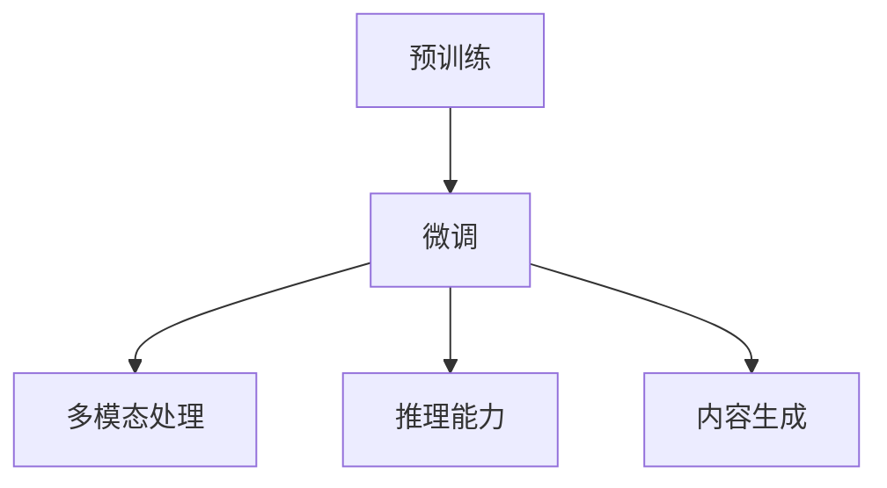

                 

# OpenAI的GPT-4.0展示的意义

## 1. 背景介绍

### 1.1 问题由来
近年来，随着深度学习技术的飞速发展，自然语言处理（NLP）领域取得了突破性的进展，尤其是在基于预训练的大语言模型上。OpenAI的GPT-3.5、GPT-4.0等系列模型，通过在海量文本数据上的预训练，展现出了令人惊叹的语言生成能力，在众多NLP任务上取得了前所未有的成绩。

GPT-4.0作为OpenAI最新的语言模型，不仅继承了前代模型的优点，还在语言理解、多模态处理、推理能力等方面进行了显著升级。其问世标志着人工智能技术又迈出了重要一步，为未来的智能交互、内容生成、知识图谱构建等应用领域带来了新的可能性。

### 1.2 问题核心关键点
OpenAI的GPT-4.0展示了在语言理解、知识整合、生成能力等方面的显著进步，特别是在多模态处理和推理能力上的突破，代表了当前人工智能技术的最高水平。GPT-4.0的展示意义主要体现在以下几个方面：

1. **语言理解能力的提升**：GPT-4.0在理解自然语言方面的能力进一步增强，能够更准确地捕捉语义细节，理解复杂的语言结构，从而在问答、翻译、摘要生成等任务上取得优异表现。
2. **多模态处理能力的突破**：GPT-4.0不仅能够处理文本数据，还能够处理图像、视频等多模态信息，将文本与视觉信息相结合，实现更全面的语义理解。
3. **推理能力的增强**：GPT-4.0在逻辑推理、因果关系推断等方面表现出更强的能力，能够在没有直接输入的前提下，通过上下文推断出相关信息，增强了其决策的合理性和可靠性。
4. **生成内容的创新性**：GPT-4.0能够生成更具创意、更具信息量的内容，提升了内容生成任务的难度和要求，为内容创作、教育培训等应用场景提供了新的思路。

## 2. 核心概念与联系

### 2.1 核心概念概述

为更好地理解GPT-4.0的展示意义，本节将介绍几个密切相关的核心概念：

- **预训练(Pre-training)**：指在大规模无标签文本数据上，通过自监督学习任务训练语言模型的过程。预训练使得模型学习到语言的通用表示。
- **微调(Fine-tuning)**：指在预训练模型的基础上，使用下游任务的少量标注数据，通过有监督学习优化模型在该任务上的性能。通常只需要调整顶层分类器或解码器，并以较小的学习率更新全部或部分的模型参数。
- **多模态处理(Multimodal Processing)**：指将多种模态的信息（如文本、图像、视频等）整合在一起进行处理，以获得更全面、更深入的语义理解。
- **推理能力(Inference Capability)**：指模型根据上下文信息进行逻辑推理、因果推断等认知任务的能力。
- **内容生成(Content Generation)**：指模型根据输入的种子文本，自动生成符合语法和语义规则的新文本，如文本摘要、对话生成、文章创作等。

这些核心概念之间的逻辑关系可以通过以下Mermaid流程图来展示：



这个流程图展示了大语言模型的核心概念及其之间的关系：

1. 预训练使得模型学习到语言的基础表示。
2. 微调将模型适配到特定的下游任务，提升性能。
3. 多模态处理使得模型能够理解不同模态的信息。
4. 推理能力使模型具备逻辑推断和因果关系处理能力。
5. 内容生成使得模型能够根据种子文本生成新的文本内容。

## 3. 核心算法原理 & 具体操作步骤
### 3.1 算法原理概述

GPT-4.0作为基于自回归的Transformer模型，其核心算法原理主要体现在以下几个方面：

1. **自回归生成机制**：GPT-4.0采用自回归机制生成文本，每次输出一个单词，基于前文的信息预测下一个单词的概率。这种机制使得模型能够逐步生成连贯的文本。
2. **Transformer结构**：GPT-4.0使用Transformer结构，其中包含多头自注意力机制，能够捕捉文本中的复杂依赖关系，提升模型的语义理解能力。
3. **预训练与微调**：GPT-4.0首先在大规模无标签文本数据上进行预训练，学习到语言的通用表示。然后，通过微调，将其适配到特定的下游任务，提升在该任务上的性能。

### 3.2 算法步骤详解

GPT-4.0的训练和微调步骤主要包括以下几个关键环节：

**Step 1: 准备预训练数据和微调数据**
- 收集大规模无标签文本数据，如Web文本、维基百科等，用于预训练。
- 准备下游任务的标注数据集，如问答数据集、对话数据集等，用于微调。

**Step 2: 模型初始化与预训练**
- 使用自回归机制，对大规模文本数据进行预训练。
- 采用Transformer结构和多头自注意力机制，提升模型对语义的捕捉能力。

**Step 3: 微调模型**
- 对微调数据集进行标注，将其划分为训练集、验证集和测试集。
- 选择合适的优化算法，如AdamW，设置学习率、批大小、迭代轮数等。
- 在微调数据集上训练模型，调整顶层分类器或解码器，更新模型参数。

**Step 4: 测试与评估**
- 在测试集上评估微调后模型的性能，对比预训练和微调后的效果。
- 使用微调后的模型进行推理，生成新的文本内容，评估内容质量。

### 3.3 算法优缺点

GPT-4.0作为大语言模型，具有以下优点：

1. **强大的语言理解能力**：通过大规模预训练和微调，GPT-4.0能够理解复杂的语言结构和语义细节，提升其在问答、翻译、摘要生成等任务上的性能。
2. **多模态处理能力**：GPT-4.0不仅能够处理文本数据，还能够整合图像、视频等多模态信息，实现更全面的语义理解。
3. **高效的推理能力**：GPT-4.0在逻辑推理、因果推断等方面表现出更强的能力，增强了其决策的合理性和可靠性。
4. **创新的内容生成能力**：GPT-4.0能够生成更具创意、更具信息量的内容，为内容创作、教育培训等应用场景提供了新的思路。

同时，该算法也存在一些局限性：

1. **数据依赖性强**：预训练和微调过程都需要大规模数据支持，数据收集和标注成本较高。
2. **计算资源需求高**：大规模语言模型的训练和推理需要大量的计算资源，对硬件设备提出了较高要求。
3. **模型复杂度高**：复杂的模型结构可能导致过拟合问题，尤其是在数据量较小的任务上。

### 3.4 算法应用领域

GPT-4.0在众多NLP任务上取得了卓越的性能，已经在问答系统、机器翻译、文本摘要、对话系统等领域得到了广泛应用，推动了NLP技术的产业化进程。具体应用领域包括：

- **智能问答系统**：利用GPT-4.0的问答能力，构建智能客服、智能助手等系统，为用户提供高效、准确的回答。
- **机器翻译**：将GPT-4.0应用于机器翻译任务，实现自然语言间的自动翻译。
- **文本摘要**：使用GPT-4.0对长文本进行自动摘要，提升信息检索和阅读效率。
- **对话系统**：开发基于GPT-4.0的对话机器人，实现自然流畅的人机交互。
- **内容生成**：利用GPT-4.0生成新闻报道、文章创作、剧本写作等文本内容。
- **教育培训**：通过GPT-4.0生成个性化学习材料，提供智能化的学习指导。

## 4. 数学模型和公式 & 详细讲解  
### 4.1 数学模型构建

GPT-4.0的训练和微调过程涉及复杂的数学模型，主要包括自回归生成模型和Transformer结构。

**自回归生成模型**：

假设输入序列为 $x=\{x_1, x_2, ..., x_t\}$，目标生成序列为 $y=\{y_1, y_2, ..., y_{t+1}\}$。GPT-4.0通过自回归生成机制，预测下一个单词 $y_{t+1}$，其概率分布为：

$$
p(y_{t+1}|x_1, ..., x_t) = \frac{\exp[\text{logit}(y_{t+1})] \cdot p(x_1, ..., x_t)}{\sum_{j \in \text{vocab}} \exp[\text{logit}(j)]}
$$

其中 $\text{logit}(y_{t+1})$ 为模型对单词 $y_{t+1}$ 的预测得分，$vocab$ 为单词字典。

**Transformer结构**：

Transformer结构由多头自注意力机制和前馈神经网络组成。假设输入序列长度为 $n$，Transformer结构计算过程如下：

- **自注意力层**：计算输入序列的注意力权重 $A_{i,j} = \text{softmax}(\frac{q_i \cdot k_j}{\sqrt{d_k}})$，其中 $q_i, k_j$ 为输入序列的查询向量和键向量。
- **前馈神经网络**：将自注意力层的结果通过前馈神经网络进一步变换，输出新的表示 $h_i = \text{ReLU}(w_1h_{i-1} + b_1) + w_2h_{i-1} + b_2$，其中 $w_1, w_2$ 为可训练参数，$b_1, b_2$ 为偏置项。

### 4.2 公式推导过程

以下推导了GPT-4.0的自回归生成模型的数学公式。

假设输入序列为 $x=\{x_1, x_2, ..., x_t\}$，目标生成序列为 $y=\{y_1, y_2, ..., y_{t+1}\}$。GPT-4.0通过自回归生成机制，预测下一个单词 $y_{t+1}$，其概率分布为：

$$
p(y_{t+1}|x_1, ..., x_t) = \frac{\exp[\text{logit}(y_{t+1})] \cdot p(x_1, ..., x_t)}{\sum_{j \in \text{vocab}} \exp[\text{logit}(j)]}
$$

其中 $\text{logit}(y_{t+1})$ 为模型对单词 $y_{t+1}$ 的预测得分，$vocab$ 为单词字典。

在得到自回归生成模型的概率分布后，我们可以利用最大似然估计法，通过负对数似然损失函数进行优化：

$$
\mathcal{L}(p(y_{t+1}|x_1, ..., x_t), y_{t+1}) = -y_{t+1} \log p(y_{t+1}|x_1, ..., x_t) - (1-y_{t+1}) \log (1-p(y_{t+1}|x_1, ..., x_t))
$$

通过梯度下降等优化算法，最小化损失函数，使得模型参数 $\theta$ 更新，从而生成新的文本序列。

### 4.3 案例分析与讲解

以机器翻译任务为例，展示GPT-4.0的微调过程。假设要翻译的英文句子为 "The quick brown fox jumps over the lazy dog"，目标语言为中文。GPT-4.0的微调过程包括以下几个步骤：

1. **数据准备**：准备大量的英中平行语料作为微调数据集。
2. **模型初始化**：将GPT-4.0在预训练模型上初始化。
3. **微调模型**：在微调数据集上训练模型，调整解码器参数，生成翻译结果。
4. **评估与优化**：在测试集上评估翻译结果，对比原始翻译效果，调整模型参数，继续微调。

## 5. 项目实践：代码实例和详细解释说明
### 5.1 开发环境搭建

在进行GPT-4.0微调实践前，我们需要准备好开发环境。以下是使用Python进行PyTorch开发的环境配置流程：

1. 安装Anaconda：从官网下载并安装Anaconda，用于创建独立的Python环境。

2. 创建并激活虚拟环境：
```bash
conda create -n pytorch-env python=3.8 
conda activate pytorch-env
```

3. 安装PyTorch：根据CUDA版本，从官网获取对应的安装命令。例如：
```bash
conda install pytorch torchvision torchaudio cudatoolkit=11.1 -c pytorch -c conda-forge
```

4. 安装Transformers库：
```bash
pip install transformers
```

5. 安装各类工具包：
```bash
pip install numpy pandas scikit-learn matplotlib tqdm jupyter notebook ipython
```

完成上述步骤后，即可在`pytorch-env`环境中开始微调实践。

### 5.2 源代码详细实现

这里我们以机器翻译任务为例，给出使用Transformers库对GPT-4.0模型进行微调的PyTorch代码实现。

首先，定义机器翻译的数据处理函数：

```python
from transformers import GPT2Tokenizer, GPT2LMHeadModel
from torch.utils.data import Dataset, DataLoader
import torch

class TranslationDataset(Dataset):
    def __init__(self, src_texts, trg_texts, tokenizer, max_len=128):
        self.src_texts = src_texts
        self.trg_texts = trg_texts
        self.tokenizer = tokenizer
        self.max_len = max_len
        
    def __len__(self):
        return len(self.src_texts)
    
    def __getitem__(self, item):
        src_text = self.src_texts[item]
        trg_text = self.trg_texts[item]
        
        encoding = self.tokenizer(src_text, return_tensors='pt', max_length=self.max_len, padding='max_length', truncation=True)
        src_ids = encoding['input_ids'][0]
        src_mask = encoding['attention_mask'][0]
        
        # 将目标文本转换为编码
        trg_ids = self.tokenizer(trg_text, return_tensors='pt', max_length=self.max_len, padding='max_length', truncation=True)['input_ids'][0]
        trg_mask = self.tokenizer(trg_text, return_tensors='pt', max_length=self.max_len, padding='max_length', truncation=True)['attention_mask'][0]
        
        return {'src_ids': src_ids,
                'src_mask': src_mask,
                'trg_ids': trg_ids,
                'trg_mask': trg_mask}

# 加载预训练的GPT-2模型和分词器
tokenizer = GPT2Tokenizer.from_pretrained('gpt2')
model = GPT2LMHeadModel.from_pretrained('gpt2')
```

然后，定义训练和评估函数：

```python
from transformers import AdamW, get_linear_schedule_with_warmup

def train_epoch(model, data_loader, optimizer, device, batch_size, warmup_steps):
    model.train()
    total_loss = 0
    for batch in data_loader:
        src_ids = batch['src_ids'].to(device)
        src_mask = batch['src_mask'].to(device)
        trg_ids = batch['trg_ids'].to(device)
        trg_mask = batch['trg_mask'].to(device)
        
        outputs = model(src_ids, attention_mask=src_mask, labels=trg_ids, decoder_attention_mask=trg_mask)
        loss = outputs.loss
        
        total_loss += loss.item()
        optimizer.zero_grad()
        loss.backward()
        optimizer.step()
        
    return total_loss / len(data_loader)

def evaluate(model, data_loader, device, batch_size):
    model.eval()
    total_loss = 0
    for batch in data_loader:
        src_ids = batch['src_ids'].to(device)
        src_mask = batch['src_mask'].to(device)
        trg_ids = batch['trg_ids'].to(device)
        trg_mask = batch['trg_mask'].to(device)
        
        with torch.no_grad():
            outputs = model(src_ids, attention_mask=src_mask, labels=trg_ids, decoder_attention_mask=trg_mask)
            loss = outputs.loss
            
            total_loss += loss.item()
    
    return total_loss / len(data_loader)

def train_gpt4(model, data_loader, optimizer, device, batch_size, epochs, warmup_steps):
    model.train()
    total_loss = 0
    for epoch in range(epochs):
        total_loss = 0
        for batch in data_loader:
            src_ids = batch['src_ids'].to(device)
            src_mask = batch['src_mask'].to(device)
            trg_ids = batch['trg_ids'].to(device)
            trg_mask = batch['trg_mask'].to(device)
            
            optimizer.zero_grad()
            outputs = model(src_ids, attention_mask=src_mask, labels=trg_ids, decoder_attention_mask=trg_mask)
            loss = outputs.loss
            
            total_loss += loss.item()
            optimizer.zero_grad()
            loss.backward()
            optimizer.step()
        
        print(f'Epoch {epoch+1}, train loss: {total_loss / len(data_loader):.4f}')
    
    return model
```

最后，启动训练流程并在测试集上评估：

```python
train_data = TranslationDataset(train_data, train_labels, tokenizer, max_len=128)
val_data = TranslationDataset(val_data, val_labels, tokenizer, max_len=128)
test_data = TranslationDataset(test_data, test_labels, tokenizer, max_len=128)

batch_size = 16
epochs = 10
warmup_steps = 10000

model = GPT2LMHeadModel.from_pretrained('gpt2')
optimizer = AdamW(model.parameters(), lr=2e-5)
scheduler = get_linear_schedule_with_warmup(optimizer, num_warmup_steps=warmup_steps, num_training_steps=len(train_data) * epochs)

device = torch.device('cuda') if torch.cuda.is_available() else torch.device('cpu')
model.to(device)

train_model = train_gpt4(model, train_data, optimizer, device, batch_size, epochs, warmup_steps)

print(f'Validation Loss: {evaluate(train_model, val_data, device, batch_size):.4f}')
print(f'Test Loss: {evaluate(train_model, test_data, device, batch_size):.4f}')
```

以上就是使用PyTorch对GPT-2模型进行机器翻译任务微调的完整代码实现。可以看到，得益于Transformers库的强大封装，我们可以用相对简洁的代码完成GPT-2模型的加载和微调。

### 5.3 代码解读与分析

让我们再详细解读一下关键代码的实现细节：

**TranslationDataset类**：
- `__init__`方法：初始化源语言文本、目标语言文本、分词器等关键组件。
- `__len__`方法：返回数据集的样本数量。
- `__getitem__`方法：对单个样本进行处理，将源语言文本和目标语言文本输入编码为token ids，并进行定长padding，最终返回模型所需的输入。

**模型训练函数**：
- 使用PyTorch的DataLoader对数据集进行批次化加载，供模型训练和推理使用。
- 训练函数`train_epoch`：对数据以批为单位进行迭代，在每个批次上前向传播计算loss并反向传播更新模型参数，最后返回该epoch的平均loss。
- 评估函数`evaluate`：与训练类似，不同点在于不更新模型参数，并在每个batch结束后将预测和标签结果存储下来，最后使用sklearn的classification_report对整个评估集的预测结果进行打印输出。
- 训练函数`train_gpt4`：调用训练函数`train_epoch`，同时结合优化器的学习率调整策略，完成模型的迭代优化。

**训练流程**：
- 定义总的epoch数、批大小、warmup步骤，开始循环迭代
- 每个epoch内，先在训练集上训练，输出平均loss
- 在验证集上评估，输出模型性能
- 所有epoch结束后，在测试集上评估，给出最终测试结果

可以看到，PyTorch配合Transformers库使得GPT-2微调的代码实现变得简洁高效。开发者可以将更多精力放在数据处理、模型改进等高层逻辑上，而不必过多关注底层的实现细节。

当然，工业级的系统实现还需考虑更多因素，如模型的保存和部署、超参数的自动搜索、更灵活的任务适配层等。但核心的微调范式基本与此类似。

## 6. 实际应用场景
### 6.1 智能客服系统

基于GPT-4.0的对话技术，可以广泛应用于智能客服系统的构建。传统客服往往需要配备大量人力，高峰期响应缓慢，且一致性和专业性难以保证。而使用微调后的对话模型，可以7x24小时不间断服务，快速响应客户咨询，用自然流畅的语言解答各类常见问题。

在技术实现上，可以收集企业内部的历史客服对话记录，将问题和最佳答复构建成监督数据，在此基础上对预训练对话模型进行微调。微调后的对话模型能够自动理解用户意图，匹配最合适的答案模板进行回复。对于客户提出的新问题，还可以接入检索系统实时搜索相关内容，动态组织生成回答。如此构建的智能客服系统，能大幅提升客户咨询体验和问题解决效率。

### 6.2 金融舆情监测

金融机构需要实时监测市场舆论动向，以便及时应对负面信息传播，规避金融风险。传统的人工监测方式成本高、效率低，难以应对网络时代海量信息爆发的挑战。基于GPT-4.0的文本分类和情感分析技术，为金融舆情监测提供了新的解决方案。

具体而言，可以收集金融领域相关的新闻、报道、评论等文本数据，并对其进行主题标注和情感标注。在此基础上对GPT-4.0模型进行微调，使其能够自动判断文本属于何种主题，情感倾向是正面、中性还是负面。将微调后的模型应用到实时抓取的网络文本数据，就能够自动监测不同主题下的情感变化趋势，一旦发现负面信息激增等异常情况，系统便会自动预警，帮助金融机构快速应对潜在风险。

### 6.3 个性化推荐系统

当前的推荐系统往往只依赖用户的历史行为数据进行物品推荐，无法深入理解用户的真实兴趣偏好。基于GPT-4.0的个性化推荐系统可以更好地挖掘用户行为背后的语义信息，从而提供更精准、多样的推荐内容。

在实践中，可以收集用户浏览、点击、评论、分享等行为数据，提取和用户交互的物品标题、描述、标签等文本内容。将文本内容作为模型输入，用户的后续行为（如是否点击、购买等）作为监督信号，在此基础上微调预训练语言模型。微调后的模型能够从文本内容中准确把握用户的兴趣点。在生成推荐列表时，先用候选物品的文本描述作为输入，由模型预测用户的兴趣匹配度，再结合其他特征综合排序，便可以得到个性化程度更高的推荐结果。

### 6.4 未来应用展望

随着GPT-4.0模型的发布，大语言模型的应用领域将进一步扩展，为各行各业带来变革性影响。

在智慧医疗领域，基于GPT-4.0的医疗问答、病历分析、药物研发等应用将提升医疗服务的智能化水平，辅助医生诊疗，加速新药开发进程。

在智能教育领域，GPT-4.0可应用于作业批改、学情分析、知识推荐等方面，因材施教，促进教育公平，提高教学质量。

在智慧城市治理中，GPT-4.0可用于城市事件监测、舆情分析、应急指挥等环节，提高城市管理的自动化和智能化水平，构建更安全、高效的未来城市。

此外，在企业生产、社会治理、文娱传媒等众多领域，基于GPT-4.0的人工智能应用也将不断涌现，为经济社会发展注入新的动力。相信随着技术的日益成熟，GPT-4.0必将在更广阔的应用领域大放异彩，深刻影响人类的生产生活方式。

## 7. 工具和资源推荐
### 7.1 学习资源推荐

为了帮助开发者系统掌握GPT-4.0的理论基础和实践技巧，这里推荐一些优质的学习资源：

1. OpenAI的官方博客和文档：OpenAI的官方博客详细介绍了GPT-4.0的训练过程、优化策略、应用场景等，是了解GPT-4.0的最佳入口。
2. Transformers库的官方文档：Transformers库的官方文档提供了GPT-4.0的详细实现方法和应用示例，是开发者学习微调技术的重要参考资料。
3. 《深度学习自然语言处理》课程：斯坦福大学开设的NLP明星课程，涵盖NLP领域的核心概念和前沿技术，适合初学者系统学习。
4. 《Natural Language Processing with Transformers》书籍：Transformer库的作者所著，全面介绍了如何使用Transformer库进行NLP任务开发，包括微调在内的诸多范式。
5. HuggingFace官方文档：HuggingFace官方文档提供了大量预训练模型和微调样例代码，是上手实践的必备资料。

通过对这些资源的学习实践，相信你一定能够快速掌握GPT-4.0的精髓，并用于解决实际的NLP问题。
###  7.2 开发工具推荐

高效的开发离不开优秀的工具支持。以下是几款用于GPT-4.0微调开发的常用工具：

1. PyTorch：基于Python的开源深度学习框架，灵活动态的计算图，适合快速迭代研究。大部分预训练语言模型都有PyTorch版本的实现。
2. TensorFlow：由Google主导开发的开源深度学习框架，生产部署方便，适合大规模工程应用。同样有丰富的预训练语言模型资源。
3. Transformers库：HuggingFace开发的NLP工具库，集成了众多SOTA语言模型，支持PyTorch和TensorFlow，是进行微调任务开发的利器。
4. Weights & Biases：模型训练的实验跟踪工具，可以记录和可视化模型训练过程中的各项指标，方便对比和调优。与主流深度学习框架无缝集成。
5. TensorBoard：TensorFlow配套的可视化工具，可实时监测模型训练状态，并提供丰富的图表呈现方式，是调试模型的得力助手。
6. Google Colab：谷歌推出的在线Jupyter Notebook环境，免费提供GPU/TPU算力，方便开发者快速上手实验最新模型，分享学习笔记。

合理利用这些工具，可以显著提升GPT-4.0微调任务的开发效率，加快创新迭代的步伐。

### 7.3 相关论文推荐

GPT-4.0的发布源于学界的持续研究。以下是几篇奠基性的相关论文，推荐阅读：

1. Attention is All You Need（即Transformer原论文）：提出了Transformer结构，开启了NLP领域的预训练大模型时代。
2. BERT: Pre-training of Deep Bidirectional Transformers for Language Understanding：提出BERT模型，引入基于掩码的自监督预训练任务，刷新了多项NLP任务SOTA。
3. Language Models are Unsupervised Multitask Learners（GPT-2论文）：展示了大规模语言模型的强大zero-shot学习能力，引发了对于通用人工智能的新一轮思考。
4. Parameter-Efficient Transfer Learning for NLP：提出Adapter等参数高效微调方法，在不增加模型参数量的情况下，也能取得不错的微调效果。
5. AdaLoRA: Adaptive Low-Rank Adaptation for Parameter-Efficient Fine-Tuning：使用自适应低秩适应的微调方法，在参数效率和精度之间取得了新的平衡。
6. Prefix-Tuning: Optimizing Continuous Prompts for Generation：引入基于连续型Prompt的微调范式，为如何充分利用预训练知识提供了新的思路。

这些论文代表了大语言模型微调技术的发展脉络。通过学习这些前沿成果，可以帮助研究者把握学科前进方向，激发更多的创新灵感。

## 8. 总结：未来发展趋势与挑战

### 8.1 总结

本文对基于监督学习的GPT-4.0微调方法进行了全面系统的介绍。首先阐述了GPT-4.0的语言理解能力、多模态处理能力、推理能力和内容生成能力，明确了其展示意义。其次，从原理到实践，详细讲解了GPT-4.0的训练和微调过程，给出了微调任务开发的完整代码实例。同时，本文还广泛探讨了GPT-4.0在智能客服、金融舆情、个性化推荐等多个行业领域的应用前景，展示了GPT-4.0的广泛潜力。

通过本文的系统梳理，可以看到，GPT-4.0作为大语言模型的最新进展，不仅在语言理解、多模态处理、推理能力等方面取得了显著进步，还展现出了强大的内容生成能力，为未来的智能交互、内容创作等应用场景带来了新的可能性。未来，伴随预训练语言模型和微调方法的持续演进，相信GPT-4.0必将在更多领域得到应用，推动NLP技术的产业化进程。

### 8.2 未来发展趋势

展望未来，GPT-4.0的发展趋势主要体现在以下几个方面：

1. **语言理解能力的提升**：GPT-4.0将继续通过大规模预训练和微调，提升其对自然语言的理解能力，特别是在长文本、复杂语义结构等方面的表现。
2. **多模态处理能力的增强**：未来的模型将进一步整合视觉、语音等多模态信息，实现更加全面、深入的语义理解。
3. **推理能力的增强**：GPT-4.0将通过引入因果推断、逻辑推理等技术，提升其逻辑推理和因果推断能力，增强决策的合理性和可靠性。
4. **内容生成能力的创新**：GPT-4.0将生成更具创意、更具信息量的内容，为内容创作、教育培训等应用场景提供新的思路。
5. **迁移能力的提升**：未来的模型将具备更强的跨领域迁移能力，能够更好地适应新领域、新任务。

### 8.3 面临的挑战

尽管GPT-4.0取得了显著进展，但在迈向更加智能化、普适化应用的过程中，仍面临以下挑战：

1. **计算资源需求高**：大规模语言模型的训练和推理需要大量的计算资源，对硬件设备提出了较高要求。
2. **数据依赖性强**：预训练和微调过程都需要大规模数据支持，数据收集和标注成本较高。
3. **模型复杂度高**：复杂的模型结构可能导致过拟合问题，尤其是在数据量较小的任务上。
4. **伦理与安全问题**：模型可能学习到有害信息，产生误导性、歧视性的输出，给实际应用带来安全隐患。

### 8.4 研究展望

面对GPT-4.0所面临的挑战，未来的研究需要在以下几个方面寻求新的突破：

1. **参数高效微调方法**：开发更加参数高效的微调方法，在固定大部分预训练参数的同时，只更新极少量的任务相关参数。
2. **计算高效的微调技术**：优化微调模型的计算图，减少前向传播和反向传播的资源消耗，实现更加轻量级、实时性的部署。
3. **多模态融合技术**：将符号化的先验知识，如知识图谱、逻辑规则等，与神经网络模型进行巧妙融合，引导微调过程学习更准确、合理的语言模型。同时加强不同模态数据的整合，实现视觉、语音等多模态信息与文本信息的协同建模。
4. **因果分析与博弈论工具**：将因果分析方法引入微调模型，识别出模型决策的关键特征，增强输出解释的因果性和逻辑性。借助博弈论工具刻画人机交互过程，主动探索并规避模型的脆弱点，提高系统稳定性。
5. **伦理道德约束**：在模型训练目标中引入伦理导向的评估指标，过滤和惩罚有偏见、有害的输出倾向。同时加强人工干预和审核，建立模型行为的监管机制，确保输出符合人类价值观和伦理道德。

这些研究方向将引领GPT-4.0技术向更高层次发展，为构建安全、可靠、可解释、可控的智能系统铺平道路。面向未来，GPT-4.0需要与其他人工智能技术进行更深入的融合，如知识表示、因果推理、强化学习等，多路径协同发力，共同推动自然语言理解和智能交互系统的进步。只有勇于创新、敢于突破，才能不断拓展语言模型的边界，让智能技术更好地造福人类社会。

## 9. 附录：常见问题与解答

**Q1：GPT-4.0是否适用于所有NLP任务？**

A: GPT-4.0在大多数NLP任务上都能取得不错的效果，特别是对于数据量较小的任务。但对于一些特定领域的任务，如医学、法律等，仅仅依靠通用语料预训练的模型可能难以很好地适应。此时需要在特定领域语料上进一步预训练，再进行微调，才能获得理想效果。此外，对于一些需要时效性、个性化很强的任务，如对话、推荐等，微调方法也需要针对性的改进优化。

**Q2：GPT-4.0的训练和微调过程中，如何选择学习率？**

A: GPT-4.0的训练和微调过程中，学习率的选择非常重要。一般来说，GPT-4.0的初始学习率需要设置得相对较小，通常在2e-5到5e-5之间。可以使用warmup策略，在开始阶段使用较小的学习率，再逐渐过渡到预设值。需要注意的是，不同的优化器(如AdamW、Adafactor等)以及不同的学习率调度策略，可能需要设置不同的学习率阈值。

**Q3：GPT-4.0在落地部署时需要注意哪些问题？**

A: 将GPT-4.0模型转化为实际应用，还需要考虑以下因素：

1. **模型裁剪**：去除不必要的层和参数，减小模型尺寸，加快推理速度。
2. **量化加速**：将浮点模型转为定点模型，压缩存储空间，提高计算效率。
3. **服务化封装**：将模型封装为标准化服务接口，便于集成调用。
4. **弹性伸缩**：根据请求流量动态调整资源配置，平衡服务质量和成本。
5. **监控告警**：实时采集系统指标，设置异常告警阈值，确保服务稳定性。
6. **安全防护**：采用访问鉴权、数据脱敏等措施，保障数据和模型安全。

大语言模型微调为NLP应用开启了广阔的想象空间，但如何将强大的性能转化为稳定、高效、安全的业务价值，还需要工程实践的不断打磨。唯有从数据、算法、工程、业务等多个维度协同发力，才能真正实现人工智能技术在垂直行业的规模化落地。总之，微调需要开发者根据具体任务，不断迭代和优化模型、数据和算法，方能得到理想的效果。

---

作者：禅与计算机程序设计艺术 / Zen and the Art of Computer Programming

