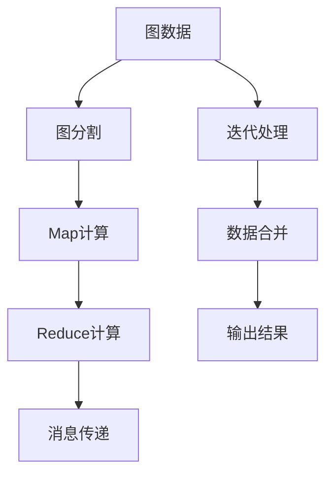

                 

# Pregel原理与代码实例讲解

> 关键词：Pregel, 图计算, 分布式计算, MapReduce, 流处理, 图分割, 图算法, 框架

## 1. 背景介绍

### 1.1 问题由来

在分布式计算和图处理领域，Pregel作为一个经典的图计算框架，为大规模图数据的处理提供了重要的理论支持和实际工具。它基于MapReduce模型，将图计算任务划分为图分割、Map、Reduce、跨节点消息传递等几个阶段，通过迭代的方式逐步处理。Pregel的广泛应用场景包括社交网络分析、推荐系统、路径搜索、网络流量分析等。

Pregel作为Google开源的框架，为大规模分布式图计算提供了一种高效、可靠的方法，对于处理大规模图数据具有重要意义。本博客将深入讲解Pregel的原理与代码实例，帮助读者更好地理解Pregel在分布式图计算中的作用，并详细剖析其实现细节。

## 2. 核心概念与联系

### 2.1 核心概念概述

为更好地理解Pregel，首先需要了解一些核心概念：

- **图计算**：是指在图形结构上进行的计算任务，包括图遍历、路径计算、图搜索、社区检测等。

- **MapReduce**：是一种基于数据分块处理的计算模型，最初由Google提出，旨在解决大规模数据处理问题。MapReduce模型由Map和Reduce两个步骤组成。

- **流处理**：是一种处理动态数据流的方式，数据流中的每个元素被依次处理，并产生新的流数据，常用于实时数据处理。

- **图分割**：是指将大规模图数据划分为多个子图，以便在分布式计算系统中并行处理。

- **迭代算法**：是指通过不断迭代更新状态来逐步逼近计算结果的一种算法。

- **Pregel**：是Google开源的一个图计算框架，基于MapReduce模型，采用迭代方式处理图数据，支持多种图算法，具备高扩展性、高可用性、高效率的特点。

这些核心概念之间通过Pregel框架紧密联系，构成了分布式图计算的完整流程。

### 2.2 核心概念原理和架构的 Mermaid 流程图



这个流程图展示了Pregel的计算流程：

1. **图分割**：将大规模图数据划分为多个子图。
2. **Map计算**：对每个子图进行并行计算。
3. **Reduce计算**：对Map计算结果进行汇总。
4. **消息传递**：在节点间传递消息，用于更新状态。
5. **迭代处理**：不断迭代更新状态，逐步逼近最终结果。
6. **数据合并**：将多个节点计算结果合并为一个全局结果。
7. **输出结果**：将最终结果输出。

## 3. 核心算法原理 & 具体操作步骤

### 3.1 算法原理概述

Pregel框架通过迭代算法处理大规模图数据，其核心思想是：将图数据分割为多个子图，每个节点（即图中的顶点）维护一个状态，并通过迭代的方式逐步更新状态，直至收敛。

具体来说，Pregel将图数据分割为多个子图，每个子图由一个节点迭代计算，节点通过接收消息来更新状态，最后将状态汇总输出。Pregel框架通过编程接口提供给用户，用户只需编写Map函数和Reduce函数，即可完成迭代算法。

### 3.2 算法步骤详解

Pregel的迭代过程包括以下几个步骤：

**Step 1: 图数据分割**

- 将大规模图数据按照节点编号或者区域进行划分，生成多个子图。

- 在每个子图上分配一个处理器节点进行计算，确保节点数量与子图数量相等。

**Step 2: 初始状态设置**

- 初始化每个节点的状态为默认值，通常为0或空状态。

**Step 3: Map计算**

- 对每个子图，每个节点执行一次Map函数，更新状态。

- Map函数定义为一个函数f：
  $$
  f\left(x\right) = \left\{
  \begin{aligned}
  &x+\text{边缘消息}, & \text{如果节点接收到消息} \\
  &x, & \text{否则}
  \end{aligned}
  \right.
  $$

**Step 4: Reduce计算**

- 对Map函数计算的结果进行Reduce计算，生成新的状态。

- Reduce函数定义为一个函数g：
  $$
  g\left(x\right) = \left\{
  \begin{aligned}
  &x, & \text{如果节点未接收到消息} \\
  &x+\text{边缘消息}, & \text{否则}
  \end{aligned}
  \right.
  $$

**Step 5: 消息传递**

- 节点间通过消息传递更新状态。

- 每个节点在Map计算完成后，将其状态与邻居节点交换消息，邻居节点接收到消息后更新状态。

**Step 6: 迭代更新**

- 重复执行Map、Reduce、消息传递等步骤，直至节点状态收敛。

**Step 7: 输出结果**

- 将最终状态输出，完成计算。

### 3.3 算法优缺点

#### 优点

- **高扩展性**：Pregel采用分布式计算方式，支持大规模数据处理。
- **高效性**：迭代算法能快速逼近结果，尤其在图处理算法中使用广泛。
- **灵活性**：用户可以根据需求自定义Map和Reduce函数，支持多种图算法。

#### 缺点

- **复杂度较高**：需要用户自行设计Map和Reduce函数，涉及大量的编程工作。
- **状态更新不直观**：迭代过程中状态更新复杂，难以理解和调试。
- **可读性较差**：代码实现较复杂，难以阅读和维护。

### 3.4 算法应用领域

Pregel作为图计算框架，主要应用于以下几个领域：

- **社交网络分析**：分析社交网络中的关系链路、用户行为等。
- **推荐系统**：基于用户和物品的关系，推荐用户可能感兴趣的物品。
- **路径搜索**：寻找图中的最短路径、最小生成树等。
- **网络流量分析**：分析网络流量，发现异常流量行为。
- **图形处理**：如图像分割、地理信息系统等。

## 4. 数学模型和公式 & 详细讲解 & 举例说明

### 4.1 数学模型构建

Pregel框架的数学模型基于图的数据结构，图由节点和边组成，节点表示实体，边表示实体之间的关系。Pregel的计算过程可以表示为：

- 定义图G(V,E)，其中V表示节点集合，E表示边集合。
- 初始化节点状态为0，即每个节点的初始状态为0。
- 定义Map函数f和Reduce函数g，对节点进行迭代计算。

### 4.2 公式推导过程

假设节点i的初始状态为0，接收到来自节点j的消息m，则节点i的更新状态可以表示为：
$$
s_i^{t+1} = s_i^t + m
$$
其中，$s_i^t$表示节点i在第t轮迭代后的状态，$t$表示迭代次数。

### 4.3 案例分析与讲解

以PageRank算法为例，展示Pregel的计算过程：

- 初始化节点状态为0。
- 对每个节点执行Map函数，将节点权重与所有邻居节点的权重求和。
- 对Map函数结果进行Reduce计算，更新节点权重。
- 迭代多次，直至节点权重收敛。

具体的Map和Reduce函数如下：

Map函数：
$$
f(u,v) = (N(u), \sum_{u \in N(v)} \frac{1}{d(v)} w(u,v)
$$
Reduce函数：
$$
g(N(u)) = \frac{1}{\sum_{v \in V} N(v)} \sum_{u \in V} N(u)
$$

其中，$N(u)$表示节点u的入度，$d(v)$表示节点v的出度，$w(u,v)$表示u到v的边权重。

## 5. 项目实践：代码实例和详细解释说明

### 5.1 开发环境搭建

在Python环境下，我们需要安装Pregel框架。可以通过pip命令进行安装：
```
pip install pregel
```

### 5.2 源代码详细实现

下面是一个简单的PageRank算法实现，代码如下：

```python
import pregel
import numpy as np

# 定义图数据
V = [1, 2, 3, 4, 5]
E = [(1, 2), (1, 3), (2, 4), (3, 5), (4, 5)]
W = { (1, 2): 0.5, (1, 3): 0.3, (2, 4): 0.4, (3, 5): 0.2, (4, 5): 0.1 }

# 定义节点状态和初始权重
s = [0.0 for _ in V]
N = [0 for _ in V]
N[2] = 2  # 节点2的入度为2
N[4] = 2  # 节点4的入度为2

# 定义Map函数
def map_function(u, v, w):
    return (N[u], sum([w(u, v) for v in v.get(u, [])]))

# 定义Reduce函数
def reduce_function(sum_u):
    return sum_u / sum(N)

# 创建Pregel实例
g = pregel.Pregel(V, E, W, s, map_function, reduce_function)

# 迭代计算
g.run(100)

# 输出结果
for u in V:
    print(u, g.get_state(u))
```

### 5.3 代码解读与分析

- **V, E, W**：定义图数据，其中V为节点集合，E为边集合，W为边权重。
- **s**：定义节点状态，初始状态为0。
- **N**：定义节点入度，用于计算权重。
- **map_function**：定义Map函数，计算每个节点的权重。
- **reduce_function**：定义Reduce函数，更新节点权重。
- **pregel.Pregel**：创建Pregel实例，进行迭代计算。
- **run**：进行迭代计算。
- **get_state**：获取最终节点状态。

## 6. 实际应用场景

### 6.1 社交网络分析

在社交网络分析中，Pregel框架可以用于分析社交网络中的关系链路、用户行为等。例如，分析用户之间的连接关系，发现关键节点，预测用户行为等。

### 6.2 推荐系统

推荐系统是Pregel框架的重要应用场景之一。通过分析用户和物品的关系，推荐用户可能感兴趣的物品。

### 6.3 路径搜索

Pregel框架可以用于寻找图中的最短路径、最小生成树等。例如，在城市道路网络中，寻找两点之间的最短路径。

### 6.4 网络流量分析

Pregel框架可以用于分析网络流量，发现异常流量行为，从而提高网络安全性和可靠性。

### 6.5 图像处理

在图像处理中，Pregel框架可以用于图像分割、纹理分析等任务。例如，对图像进行分割，提取不同区域的特征。

## 7. 工具和资源推荐

### 7.1 学习资源推荐

- **Pregel官方文档**：Pregel框架提供了详细的文档和教程，帮助用户快速上手。
- **Google Cloud Pregel**：提供了在线的Pregel实例，方便用户进行测试和调试。
- **MapReduce原理与实践**：详细介绍了MapReduce模型和Pregel框架，适合初学者阅读。

### 7.2 开发工具推荐

- **Google Cloud Platform**：提供了Pregel框架的云服务，方便用户进行大规模图计算。
- **Hadoop**：支持MapReduce模型，可以与Pregel框架结合使用。
- **Spark**：支持分布式计算，与Pregel框架有类似的工作方式。

### 7.3 相关论文推荐

- **Pregel: A Commodity-Hardware Parallel Graph Processing System**：Pregel框架的原始论文，介绍了Pregel的设计思路和实现细节。
- **The PageRank Citation Ranking: Bringing Order to the Web**：PageRank算法的原始论文，展示了如何使用Pregel进行计算。

## 8. 总结：未来发展趋势与挑战

### 8.1 研究成果总结

Pregel框架作为分布式图计算的重要工具，已经广泛应用于社交网络分析、推荐系统、路径搜索等领域。Pregel框架采用迭代算法，支持多种图算法，具备高扩展性、高效率的特点。

### 8.2 未来发展趋势

- **分布式计算**：Pregel框架将继续支持分布式计算，提高处理大规模数据的能力。
- **多源数据融合**：Pregel框架将支持多源数据融合，将不同类型的数据进行统一处理。
- **实时处理**：Pregel框架将支持实时处理，处理动态数据流。
- **高阶算法**：Pregel框架将支持高阶算法，如谱图算法、网络动力学等。

### 8.3 面临的挑战

- **状态更新复杂**：迭代过程中状态更新复杂，难以理解和调试。
- **编程复杂**：用户需要自行设计Map和Reduce函数，涉及大量的编程工作。
- **性能瓶颈**：大规模图数据处理时，仍可能存在性能瓶颈。

### 8.4 研究展望

未来的研究将继续关注以下几个方向：

- **自动化设计**：使用自动化工具，减少编程工作量。
- **可扩展性**：提高框架的可扩展性，支持更大规模的图数据处理。
- **效率提升**：提高框架的效率，优化算法的计算方式。

## 9. 附录：常见问题与解答

**Q1: 什么是Pregel框架？**

A: Pregel是Google开源的一个图计算框架，基于MapReduce模型，采用迭代方式处理图数据，支持多种图算法，具备高扩展性、高效率的特点。

**Q2: 如何使用Pregel框架进行计算？**

A: 首先需要定义图数据、节点状态、Map函数和Reduce函数。然后创建Pregel实例，进行迭代计算。最后获取最终节点状态。

**Q3: Pregel框架适用于哪些场景？**

A: Pregel框架适用于社交网络分析、推荐系统、路径搜索、网络流量分析、图像处理等场景。

**Q4: Pregel框架的优点和缺点是什么？**

A: Pregel框架的优点是高扩展性、高效率、支持多种图算法。缺点是编程复杂、状态更新不直观。

**Q5: 如何使用Pregel框架进行PageRank算法计算？**

A: 定义图数据、节点状态、Map函数和Reduce函数。然后创建Pregel实例，进行迭代计算。最后获取最终节点状态。

---

作者：禅与计算机程序设计艺术 / Zen and the Art of Computer Programming

