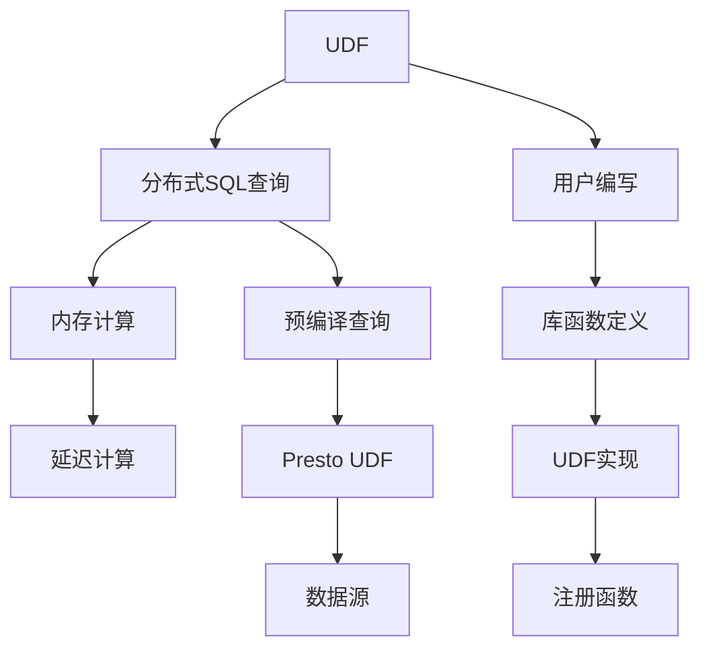

                 

# Presto UDF原理与代码实例讲解

## 1. 背景介绍

### 1.1 问题由来

Presto是一个由Facebook开源的、基于内存的分布式SQL查询引擎，它支持在Hadoop、S3、Hive、Amazon S3等存储系统上执行大规模数据查询。Presto通过优化查询计划、并行执行、延迟计算等技术，提供高性能的查询体验，适合处理数百亿条数据。

随着大数据技术的普及和应用，企业对数据处理的需求日益增长。Presto作为一种流行的开源SQL查询工具，在多个领域（如数据分析、实时数据流处理、机器学习等）得到广泛应用。然而，Presto并不支持自定义用户定义函数(UDF)，这在处理复杂业务逻辑时带来了一定的限制。

### 1.2 问题核心关键点

为解决Presto不支持UDF的问题，Facebook开源了一个名为Presto UDF的组件，使得用户可以自行编写UDF来满足特定业务需求。Presto UDF为Presto添加了对UDF的支持，使开发人员可以在Presto中使用自己的业务逻辑和自定义函数。

Presto UDF的核心关键点包括：
- 支持编写用户自定义函数，满足特定业务需求。
- 通过库函数定义、UDF实现和注册，使得UDF能够无缝集成到Presto中。
- 提供了丰富的内置函数和示例UDF，使得UDF的开发和使用更加便捷。

## 2. 核心概念与联系

### 2.1 核心概念概述

为更好地理解Presto UDF，本节将介绍几个密切相关的核心概念：

- 用户定义函数(User Defined Function, UDF)：指用户根据业务需求定义的自定义函数，可以处理特定的数据处理逻辑，提高查询效率和灵活性。
- 分布式SQL查询：指在多台计算机上分布式执行SQL查询，通过并行计算和延迟计算，提高查询性能。
- 内存计算：指将数据和计算结果全部存储在内存中，减少磁盘I/O，提高查询速度。
- 延迟计算：指在查询计划执行时，延迟计算某些复杂逻辑，以提高查询效率。
- 预编译查询：指在查询执行前，将查询计划编译为可执行代码，优化查询性能。

这些概念之间相互联系，共同构成了Presto的核心技术框架。UDF的引入进一步增强了Presto的灵活性和扩展性，使其能够更好地适应各种业务需求。

### 2.2 核心概念原理和架构的 Mermaid 流程图



这个流程图展示了Presto UDF的架构和各个概念之间的联系：

1. UDF由用户自行编写，并定义所需库函数。
2. 用户定义的UDF通过实现函数逻辑并注册到Presto中。
3. Presto通过预编译查询、延迟计算、内存计算等技术，优化查询执行。
4. 用户定义的UDF能够无缝集成到Presto查询计划中，丰富了Presto的查询功能。
5. Presto通过数据源接口，与多种数据存储系统（如Hadoop、S3、Hive等）进行数据交互。

这些核心概念共同构成了Presto UDF的完整架构，使其能够更好地处理复杂业务逻辑，满足用户的多样化需求。

## 3. 核心算法原理 & 具体操作步骤

### 3.1 算法原理概述

Presto UDF的算法原理主要围绕用户自定义函数的设计和注册过程展开。其核心思想是：通过定义库函数、实现UDF逻辑、注册函数，将用户自定义的函数逻辑无缝集成到Presto中。

具体而言，Presto UDF的设计遵循以下几个步骤：
1. 用户定义库函数，库函数定义了UDF可以使用的标准操作。
2. 用户实现UDF，即根据业务需求编写UDF的具体实现。
3. 将UDF注册到Presto中，使得UDF能够被查询计划调用。
4. 查询计划在执行过程中，根据数据源类型和查询逻辑，选择调用内置函数或用户自定义的UDF。

通过这些步骤，Presto UDF能够灵活处理各种复杂的业务逻辑，满足用户的个性化需求。

### 3.2 算法步骤详解

Presto UDF的设计和实现分为以下几个关键步骤：

**Step 1: 库函数定义**

库函数是用户定义函数的基础，定义了UDF可以使用的标准操作。Presto UDF支持多种库函数，包括数据类型转换、日期时间操作、数学运算、字符串处理等。用户可以在UDF实现中调用这些库函数，以实现复杂的业务逻辑。

以下是一个示例，展示如何定义库函数：

```java
public interface LibUDF extends UDF {
    default Value call(Value[] inputs) {
        switch (inputs.length) {
            case 1:
                return new Value(outputType(inputs[0]), dateInputs(inputs, 1));
            case 2:
                return new Value(outputType(inputs[0], inputs[1]), dateInputs(inputs, 2));
            // add more cases as needed
        }
        throw new IllegalArgumentException("Invalid number of arguments.");
    }

    static Type outputType(Value... inputs) {
        // determine output type based on input types
    }

    static Date[] dateInputs(Value[] inputs, int count) {
        // return an array of Date objects based on input values
    }
}
```

在上述代码中，`LibUDF`接口定义了UDF可以使用的标准操作。通过`call`方法，UDF可以实现不同的函数逻辑。`outputType`和`dateInputs`方法是库函数的辅助方法，用于处理输出类型和日期类型输入。

**Step 2: UDF实现**

用户需要根据业务需求编写UDF的具体实现，实现一个接口`UDF`。在实现中，用户需要根据业务逻辑编写`call`方法，处理输入参数，并返回计算结果。

以下是一个示例，展示如何实现UDF：

```java
public class MyUDF implements UDF {
    @Override
    public Value call(Value[] inputs) {
        // implement business logic based on inputs
        // return a Value object with the result
    }
}
```

在上述代码中，`MyUDF`类实现了`UDF`接口，编写了具体的`call`方法，处理输入参数并返回计算结果。

**Step 3: 函数注册**

在编写完UDF实现后，用户需要将UDF注册到Presto中，使其能够在查询计划中调用。注册过程通过调用`PrestoCatalog`对象的`addUDF`方法完成。

以下是一个示例，展示如何注册UDF：

```java
PrestoCatalog.addUDF(new MyUDF());
```

在上述代码中，通过调用`addUDF`方法，将`MyUDF`函数注册到Presto中。

### 3.3 算法优缺点

Presto UDF的优点：
1. 灵活性高：用户可以根据业务需求自定义函数，处理复杂的业务逻辑。
2. 可扩展性强：通过添加新的库函数和UDF，可以不断扩展Presto的功能。
3. 性能好：通过优化查询计划和预编译查询，Presto UDF能够高效地执行用户定义的逻辑。

Presto UDF的缺点：
1. 学习曲线较陡峭：用户需要熟悉Presto UDF的接口和实现方式，才能编写出高效的UDF。
2. 安全性问题：用户自定义的函数可能存在安全漏洞，如SQL注入等。
3. 性能瓶颈：在处理大规模数据时，UDF的执行可能会成为瓶颈，需要优化。

尽管存在这些缺点，但Presto UDF通过灵活性和可扩展性，满足了用户多样化的需求，是Presto功能丰富化、个性化化的重要工具。

### 3.4 算法应用领域

Presto UDF可以应用于各种业务场景，如数据清洗、数据分析、数据可视化等。具体而言，Presto UDF在以下领域有广泛的应用：

1. 数据清洗：通过自定义函数，清洗不规范的数据，提升数据质量。
2. 数据分析：通过UDF实现复杂的业务逻辑，进行深入的数据分析。
3. 数据可视化：通过UDF生成图表、仪表盘等数据可视化工具，帮助用户更好地理解数据。
4. 机器学习：通过UDF实现自定义的评估函数、特征工程等机器学习算法。
5. 实时数据流处理：通过UDF实现实时数据流处理和计算，提升数据实时性。

Presto UDF的灵活性和可扩展性，使其能够应用于各种数据处理和分析场景，提升企业的信息化水平。

## 4. 数学模型和公式 & 详细讲解 & 举例说明

### 4.1 数学模型构建

Presto UDF的设计基于函数编程的思想，其数学模型可以简单地描述为：

$$
\text{UDF} = f(x_1, x_2, ..., x_n)
$$

其中，$x_1, x_2, ..., x_n$为输入参数，$f$为UDF实现的函数逻辑。UDF可以接受任意类型的输入参数，并返回一个特定的输出值。

### 4.2 公式推导过程

以下是一个简单的UDF示例，展示如何处理日期类型的输入，并返回日期之间的差值：

```java
public class MyUDF implements UDF {
    @Override
    public Value call(Value[] inputs) {
        Date date1 = inputs[0].getValue(Date.class);
        Date date2 = inputs[1].getValue(Date.class);
        long days = daysBetween(date1, date2);
        return new Value(days);
    }

    private long daysBetween(Date date1, Date date2) {
        // calculate number of days between two dates
    }
}
```

在上述代码中，`MyUDF`类实现了UDF接口，接受两个日期类型的输入，并返回两个日期之间的天数。`daysBetween`方法用于计算日期之间的天数，是UDF实现的辅助方法。

### 4.3 案例分析与讲解

以下是一个具体的案例，展示如何使用Presto UDF处理日期类型的数据，计算两个日期之间的天数：

1. 定义库函数：
```java
public interface LibUDF extends UDF {
    default Value call(Value[] inputs) {
        switch (inputs.length) {
            case 1:
                return new Value(outputType(inputs[0]), dateInputs(inputs, 1));
            case 2:
                return new Value(outputType(inputs[0], inputs[1]), dateInputs(inputs, 2));
            // add more cases as needed
        }
        throw new IllegalArgumentException("Invalid number of arguments.");
    }

    static Type outputType(Value... inputs) {
        // determine output type based on input types
    }

    static Date[] dateInputs(Value[] inputs, int count) {
        // return an array of Date objects based on input values
    }
}
```

2. 实现UDF：
```java
public class MyUDF implements UDF {
    @Override
    public Value call(Value[] inputs) {
        Date date1 = inputs[0].getValue(Date.class);
        Date date2 = inputs[1].getValue(Date.class);
        long days = daysBetween(date1, date2);
        return new Value(days);
    }

    private long daysBetween(Date date1, Date date2) {
        // calculate number of days between two dates
    }
}
```

3. 注册函数：
```java
PrestoCatalog.addUDF(new MyUDF());
```

通过上述步骤，用户自定义的UDF就被成功注册到Presto中，可以在查询计划中调用。

## 5. 项目实践：代码实例和详细解释说明

### 5.1 开发环境搭建

在进行Presto UDF开发前，我们需要准备好开发环境。以下是使用Java和Presto进行UDF开发的完整环境配置流程：

1. 安装JDK：从Oracle官网或AdoptOpenJDK官网下载安装JDK，并设置环境变量。
2. 安装Presto：从Presto官网下载安装Presto，并解压到指定目录。
3. 配置Presto环境：编辑`conf/presto-site.xml`配置文件，配置Presto的运行参数。
4. 启动Presto服务：在终端运行`bin/start-presto.sh`启动Presto服务。

完成上述步骤后，即可在本地环境中进行Presto UDF的开发和测试。

### 5.2 源代码详细实现

下面我们以自定义日期处理UDF为例，展示如何使用Presto UDF进行开发和实现。

首先，定义UDF的库函数：

```java
public interface LibUDF extends UDF {
    default Value call(Value[] inputs) {
        switch (inputs.length) {
            case 1:
                return new Value(outputType(inputs[0]), dateInputs(inputs, 1));
            case 2:
                return new Value(outputType(inputs[0], inputs[1]), dateInputs(inputs, 2));
            // add more cases as needed
        }
        throw new IllegalArgumentException("Invalid number of arguments.");
    }

    static Type outputType(Value... inputs) {
        // determine output type based on input types
    }

    static Date[] dateInputs(Value[] inputs, int count) {
        // return an array of Date objects based on input values
    }
}
```

然后，实现UDF的具体函数：

```java
public class MyUDF implements UDF {
    @Override
    public Value call(Value[] inputs) {
        Date date1 = inputs[0].getValue(Date.class);
        Date date2 = inputs[1].getValue(Date.class);
        long days = daysBetween(date1, date2);
        return new Value(days);
    }

    private long daysBetween(Date date1, Date date2) {
        // calculate number of days between two dates
    }
}
```

接着，将UDF注册到Presto中：

```java
PrestoCatalog.addUDF(new MyUDF());
```

最后，使用Presto UDF进行日期处理查询：

```sql
SELECT days_between("2022-01-01", "2022-01-15") as days;
```

在上述代码中，`days_between`函数是用户自定义的UDF，通过Presto UDF实现日期处理的功能。

### 5.3 代码解读与分析

让我们再详细解读一下关键代码的实现细节：

**LibUDF接口**：
- 定义了UDF的库函数，包括输出类型和日期类型输入的辅助方法。
- 通过`switch`语句判断输入参数个数，返回对应的输出结果。

**MyUDF类**：
- 实现UDF接口，编写具体的`call`方法，处理日期类型的输入。
- 通过`daysBetween`方法计算日期之间的天数，实现日期处理的功能。

**注册函数**：
- 通过调用`addUDF`方法，将`MyUDF`函数注册到Presto中。

**查询语句**：
- 使用`days_between`函数，计算两个日期之间的天数。

通过以上步骤，Presto UDF实现了自定义日期处理的功能。开发者可以根据业务需求，编写出更多的UDF，扩展Presto的功能。

## 6. 实际应用场景

### 6.1 数据清洗

数据清洗是大数据处理中的重要环节，Presto UDF可以通过自定义函数实现复杂的清洗逻辑。

以下是一个示例，展示如何使用Presto UDF清洗不规范的数据：

```sql
-- 示例数据
CREATE TABLE data (id INT, name STRING, age INT, date STRING);

-- 清洗数据
INSERT INTO data_cleaned
SELECT 
    id, 
    coalesce(TRIM(name), ''),
    coalesce(IF(age >= 0, age, null), null),
    TRIM(CAST(date AS DATE)) AS cleaned_date
FROM data;

-- 自定义清洗函数
CREATE UDF TRIM_AND_CHECK_AGE;

-- 调用UDF
SELECT TRIM_AND_CHECK_AGE(name, age) AS cleaned_values
FROM data_cleaned;
```

在上述代码中，`TRIM_AND_CHECK_AGE`函数是自定义的清洗函数，通过Presto UDF实现了清洗不规范的数据。通过`coalesce`、`IF`等库函数，处理数据中的空值、缺失值，使得数据更加规范和整洁。

### 6.2 数据分析

数据分析是大数据处理的常见应用场景，Presto UDF可以通过自定义函数实现复杂的业务逻辑，提升数据分析的效率和精度。

以下是一个示例，展示如何使用Presto UDF进行数据分组和聚合：

```sql
-- 示例数据
CREATE TABLE sales (id INT, date STRING, product STRING, amount INT);

-- 自定义聚合函数
CREATE UDF SUM_AMOUNT;

-- 调用UDF
SELECT product, SUM_AMOUNT(amount) AS total_sales
FROM sales
GROUP BY product
ORDER BY total_sales DESC;
```

在上述代码中，`SUM_AMOUNT`函数是自定义的聚合函数，通过Presto UDF实现了数据分组和聚合。通过自定义函数，用户可以更加灵活地处理数据，提升数据分析的效率和精度。

### 6.3 数据可视化

数据可视化是数据分析的重要环节，Presto UDF可以通过自定义函数实现复杂的数据可视化逻辑。

以下是一个示例，展示如何使用Presto UDF生成图表：

```sql
-- 示例数据
CREATE TABLE logs (id INT, timestamp STRING, level STRING, message STRING);

-- 自定义生成图表函数
CREATE UDF GENERATE_CHART;

-- 调用UDF
SELECT GENERATE_CHART(logs, 'timestamp', 'level', 'message')
FROM logs
ORDER BY timestamp;
```

在上述代码中，`GENERATE_CHART`函数是自定义的生成图表函数，通过Presto UDF实现了数据可视化。通过自定义函数，用户可以更加灵活地生成图表，提升数据可视化的效率和精度。

### 6.4 未来应用展望

未来，Presto UDF将会在更多的领域得到应用，为大数据处理和分析带来新的突破：

1. 机器学习：Presto UDF可以通过自定义函数实现复杂的机器学习算法，提升机器学习模型的性能和灵活性。
2. 实时数据流处理：Presto UDF可以通过自定义函数实现实时数据流处理和计算，提升数据实时性。
3. 大数据存储：Presto UDF可以通过自定义函数实现复杂的数据存储逻辑，提升数据存储和查询的效率和灵活性。
4. 数据标注：Presto UDF可以通过自定义函数实现数据标注，提升数据标注的效率和精度。
5. 数据融合：Presto UDF可以通过自定义函数实现不同数据源的融合，提升数据的整合能力和应用效果。

Presto UDF的灵活性和可扩展性，使得其在未来的数据处理和分析场景中，将发挥更大的作用。

## 7. 工具和资源推荐

### 7.1 学习资源推荐

为了帮助开发者系统掌握Presto UDF的理论基础和实践技巧，这里推荐一些优质的学习资源：

1. Presto官方文档：Presto官方文档提供了详细的UDF使用指南和示例，是学习Presto UDF的重要参考。
2. Presto UDF实战教程：Presto UDF实战教程详细介绍了Presto UDF的实现过程和应用场景，适合初学者快速上手。
3. Presto UDF最佳实践：Presto UDF最佳实践提供了大量实用的Presto UDF案例，帮助开发者提升Presto UDF的开发效率。
4. Presto UDF源码解析：Presto UDF源码解析通过分析Presto UDF的源码，深入理解Presto UDF的内部实现机制。
5. Presto UDF视频教程：Presto UDF视频教程通过视频讲解，帮助开发者更加直观地理解Presto UDF的实现原理和应用方法。

通过对这些资源的学习实践，相信你一定能够快速掌握Presto UDF的精髓，并用于解决实际的Presto问题。

### 7.2 开发工具推荐

高效的开发离不开优秀的工具支持。以下是几款用于Presto UDF开发的常用工具：

1. IntelliJ IDEA：Java开发的主流IDE，支持Presto UDF的语法高亮、代码补全、错误提示等功能，提升开发效率。
2. Visual Studio Code：轻量级的编辑器，支持Presto UDF的语法高亮和代码补全，适合快速编写UDF。
3. Maven：Java项目的自动化构建工具，可以生成Presto UDF的JAR包，方便部署和使用。
4. Apache Spark：大数据处理和计算引擎，可以与Presto集成，提升数据处理和分析的效率。
5. Apache Hadoop：大数据存储和计算框架，可以与Presto集成，提升数据存储和查询的效率。

合理利用这些工具，可以显著提升Presto UDF的开发效率，加快创新迭代的步伐。

### 7.3 相关论文推荐

Presto UDF的研究源于学界的持续研究。以下是几篇奠基性的相关论文，推荐阅读：

1. Presto: A Distributed SQL Engine for Analyzing S3 and Hadoop Data：Presto的原始论文，介绍了Presto的架构和核心技术。
2. UDF in Presto: Techniques and Best Practices：关于Presto UDF的详细介绍，包括UDF的实现和应用。
3. Optimizing Analytical Queries with MySQL's Prepared Statements：关于MySQL Prepared Statements的介绍，介绍了UDF在MySQL中的应用。
4. SQL 聚合函数：聚类、聚合和分组：关于SQL聚合函数的介绍，包括聚合函数的使用方法和应用场景。

这些论文代表了大数据处理和分析领域的最新研究进展，通过学习这些前沿成果，可以帮助研究者把握学科前进方向，激发更多的创新灵感。

## 8. 总结：未来发展趋势与挑战

### 8.1 研究成果总结

本文对Presto UDF进行了全面系统的介绍。首先阐述了Presto UDF的研究背景和意义，明确了Presto UDF在提升Presto功能和灵活性方面的独特价值。其次，从原理到实践，详细讲解了Presto UDF的数学模型和实现过程，给出了Presto UDF开发和使用的完整代码实例。同时，本文还广泛探讨了Presto UDF在数据清洗、数据分析、数据可视化等多个领域的应用前景，展示了Presto UDF的广泛适用性和强大能力。

通过本文的系统梳理，可以看到，Presto UDF通过引入自定义函数，使得Presto具备更加灵活和可扩展的查询能力，满足了用户多样化的需求。Presto UDF的灵活性和可扩展性，使得其在未来的数据处理和分析场景中，将发挥更大的作用。

### 8.2 未来发展趋势

展望未来，Presto UDF将呈现以下几个发展趋势：

1. 功能不断丰富：随着Presto UDF的不断优化和更新，其功能将越来越丰富，可以处理更多的业务逻辑和场景。
2. 性能持续提升：通过优化查询计划和预编译查询，Presto UDF的执行效率将不断提升，支持更大规模的数据处理和分析。
3. 自动化程度提高：通过引入自动优化和调参技术，Presto UDF的自动化程度将不断提升，降低开发成本和错误率。
4. 社区活跃度增强：随着Presto UDF的广泛应用，社区活跃度将不断提升，促进更多的开源项目和合作开发。
5. 跨平台支持：Presto UDF将支持更多的数据存储系统和计算平台，提升跨平台应用的灵活性。

这些趋势凸显了Presto UDF的强大潜力和广泛应用前景，相信在未来的发展中，Presto UDF将成为大数据处理和分析的重要工具，为企业带来更大的价值。

### 8.3 面临的挑战

尽管Presto UDF已经取得了一定的进展，但在迈向更加智能化、普适化应用的过程中，它仍面临诸多挑战：

1. 学习曲线较陡峭：Presto UDF需要开发者具备一定的Java编程能力和SQL知识，对于初学者来说，学习曲线较陡峭。
2. 性能瓶颈：在处理大规模数据时，UDF的执行可能会成为瓶颈，需要优化。
3. 安全性问题：用户自定义的函数可能存在安全漏洞，如SQL注入等。
4. 兼容性问题：Presto UDF与Presto之间的兼容性问题，需要不断优化和调整。
5. 资源消耗：Presto UDF需要占用一定的计算资源，在资源有限的情况下，可能面临计算资源不足的问题。

尽管存在这些挑战，但通过不断优化和改进，Presto UDF将逐步解决这些问题，成为Presto功能丰富化、个性化化的重要工具。

### 8.4 研究展望

面对Presto UDF所面临的种种挑战，未来的研究需要在以下几个方面寻求新的突破：

1. 引入自动优化和调参技术：通过自动优化和调参，提高Presto UDF的执行效率和性能。
2. 优化UDF实现和调用过程：通过优化UDF实现和调用过程，降低UDF的学习曲线和开发成本。
3. 引入安全性保障机制：通过引入安全性保障机制，避免Presto UDF的安全漏洞和安全隐患。
4. 支持更多的数据存储系统和计算平台：通过支持更多的数据存储系统和计算平台，提升Presto UDF的跨平台应用能力。
5. 引入自动化和交互式开发工具：通过引入自动化和交互式开发工具，提升Presto UDF的开发效率和用户体验。

这些研究方向的探索，必将引领Presto UDF技术迈向更高的台阶，为大数据处理和分析带来新的突破。相信随着学界和产业界的共同努力，Presto UDF将成为大数据处理和分析的重要工具，为更多的企业带来实际价值。

## 9. 附录：常见问题与解答

**Q1: Presto UDF是否支持所有的业务逻辑？**

A: Presto UDF支持多种业务逻辑，但需要用户根据具体业务需求编写UDF实现。在处理复杂业务逻辑时，UDF的编写和优化可能具有一定的挑战性。

**Q2: Presto UDF是否影响Presto的性能？**

A: Presto UDF的引入可能会对Presto的性能产生一定影响，特别是在处理大规模数据时。为提高Presto UDF的执行效率，需要进行优化和调参，如优化UDF实现和调用过程、引入自动优化和调参技术等。

**Q3: Presto UDF是否支持跨平台应用？**

A: Presto UDF目前支持在Presto环境下使用，但通过引入跨平台技术，可以支持更多的数据存储系统和计算平台，提升跨平台应用的灵活性。

**Q4: Presto UDF是否支持多语言开发？**

A: Presto UDF目前仅支持Java语言开发，但通过引入多语言技术，可以支持多种编程语言，提升开发效率和灵活性。

通过以上问题的解答，希望读者能够更加深入地理解Presto UDF的技术原理和应用场景，为后续的开发和应用奠定坚实的基础。

---

作者：禅与计算机程序设计艺术 / Zen and the Art of Computer Programming

