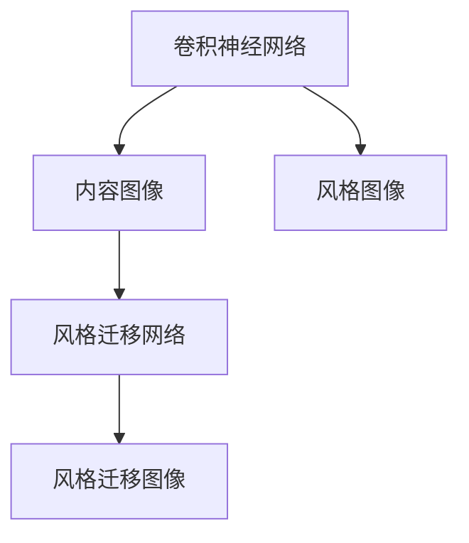

                 

# Python深度学习实践：风格迁移网络让照片变艺术品

> 关键词：深度学习,风格迁移网络,神经网络,卷积神经网络,艺术作品,图像处理,Python,PyTorch,图像风格转换

## 1. 背景介绍

### 1.1 问题由来

随着人工智能技术的飞速发展，深度学习在图像处理、艺术创作等领域展现了巨大的潜力。尤其是风格迁移网络(Style Transfer Network)，使得我们能够将一幅普通的照片转换成风格独特的艺术品，极大地扩展了图像处理的边界，激发了新的艺术形式和创意表达。

风格迁移网络的核心理念，是将一幅图像的内容特征与另一幅图像的风格特征进行融合，生成既保留内容又具备风格的全新图像。这一技术的出现，不仅让图像处理艺术家们拥有了新的创作工具，也为艺术领域注入了新的生命力。

### 1.2 问题核心关键点

风格迁移网络的核心在于如何将内容图像和风格图像的特征进行有效地提取、融合和重建。这涉及两个主要问题：

1. 如何设计合适的特征提取器，提取内容图像和风格图像的高层次特征？
2. 如何将提取到的内容特征和风格特征进行融合，生成风格迁移图像？

这两个问题的解决，涉及深度学习的卷积神经网络(Convolutional Neural Network, CNN)和图像处理算法等核心概念。本文将从这两个问题入手，详细阐述风格迁移网络的原理与实现步骤。

### 1.3 问题研究意义

研究风格迁移网络，对于拓展深度学习的应用范围，提升图像处理技术的创造力和表现力，具有重要意义：

1. 创新艺术创作：风格迁移网络为艺术家提供了全新的创作工具，让机器参与到艺术创作中，丰富了艺术表达形式。
2. 增强视觉效果：通过将风格迁移网络应用于视频、广告等场景，可以显著提升视觉冲击力和用户体验。
3. 降低创作成本：自动化生成风格迁移图像，减少了人工创作的成本和时间投入。
4. 促进跨学科融合：风格迁移网络的跨领域应用，加速了艺术、设计、计算机科学等学科的交叉融合。

## 2. 核心概念与联系

### 2.1 核心概念概述

为更好地理解风格迁移网络的实现原理，本节将介绍几个密切相关的核心概念：

- 卷积神经网络(CNN)：一种深度学习模型，通过卷积层和池化层等操作，提取输入图像的高层次特征。
- 风格迁移网络：一种基于深度学习的方法，通过结合内容图像和风格图像的特征，生成风格迁移图像。
- 内容图像(Content Image)：待转风格的原始图像，风格迁移的源内容。
- 风格图像(Style Image)：待转导的风格图像，风格迁移的目标风格。
- 风格迁移图像(Style Transfer Image)：将内容图像的风格转化为风格图像的风格，生成的新图像。

这些核心概念之间的逻辑关系可以通过以下Mermaid流程图来展示：



这个流程图展示的风格迁移网络的实现过程：

1. 通过卷积神经网络提取内容图像和风格图像的高层次特征。
2. 设计风格迁移网络，将提取到的内容特征和风格特征进行融合。
3. 通过风格迁移网络生成风格迁移图像，实现内容与风格的融合。

## 3. 核心算法原理 & 具体操作步骤
### 3.1 算法原理概述

风格迁移网络的核心在于使用卷积神经网络分别提取内容图像和风格图像的特征，并通过特定方式进行融合，生成风格迁移图像。其算法流程大致如下：

1. 使用预训练的卷积神经网络(VGG等)提取内容图像和风格图像的特征。
2. 设计风格迁移网络，将提取到的内容特征和风格特征进行融合。
3. 生成风格迁移图像，并进行后处理以优化效果。

其中，特征提取和融合是最核心的步骤。以下将详细介绍这两个步骤。

### 3.2 算法步骤详解

**Step 1: 特征提取**

首先，需要选择合适的卷积神经网络模型来提取图像的特征。常用的模型包括VGG、ResNet等。这里以VGG网络为例，介绍特征提取的具体步骤。

1. 加载VGG网络模型：
```python
from torchvision.models import vgg19
vgg = vgg19(pretrained=True)
```

2. 将内容图像和风格图像分别输入模型：
```python
content_image = preprocess(content_image)
style_image = preprocess(style_image)

features_content = vgg(content_image)
features_style = vgg(style_image)
```

其中，`preprocess`函数用于对图像进行预处理，如归一化、调整尺寸等。

**Step 2: 特征融合**

接下来，需要设计风格迁移网络，将提取到的内容特征和风格特征进行融合。这里我们采用一种基于对抗网络的方法，即生成对抗网络(Generative Adversarial Network, GAN)来实现。

1. 初始化生成器和判别器：
```python
from torchvision import nn

G = nn.Sequential(
    nn.ConvTranspose2d(128, 64, 4, 1, 0),
    nn.ReLU(),
    nn.ConvTranspose2d(64, 3, 4, 1, 0),
    nn.Tanh()
)

D = nn.Sequential(
    nn.Conv2d(3, 64, 3, 1, 1),
    nn.LeakyReLU(0.2),
    nn.MaxPool2d(2, 2),
    nn.Conv2d(64, 128, 3, 1, 1),
    nn.LeakyReLU(0.2),
    nn.MaxPool2d(2, 2),
    nn.Conv2d(128, 256, 3, 1, 1),
    nn.LeakyReLU(0.2),
    nn.MaxPool2d(2, 2),
    nn.Conv2d(256, 512, 3, 1, 1),
    nn.LeakyReLU(0.2),
    nn.MaxPool2d(2, 2),
    nn.Flatten(),
    nn.Linear(512*4*4, 1),
    nn.Sigmoid()
)
```

2. 训练生成器和判别器：
```python
G_optimizer = optim.Adam(G.parameters(), lr=0.0002, betas=(0.5, 0.999))
D_optimizer = optim.Adam(D.parameters(), lr=0.0002, betas=(0.5, 0.999))

for epoch in range(epochs):
    # 随机选择内容和风格图像
    content = random_content_image
    style = random_style_image
    
    # 前向传播生成风格迁移图像
    fake = G(content)
    
    # 判别器前向传播，判断真假
    real = D(content_image)
    fake = D(fake)
    
    # 计算判别器的损失函数
    D_loss = criterion(real, 1) + criterion(fake, 0)
    
    # 计算生成器的损失函数
    G_loss = criterion(fake, 1)
    
    # 反向传播，更新参数
    G_optimizer.zero_grad()
    G_loss.backward()
    G_optimizer.step()
    
    D_optimizer.zero_grad()
    D_loss.backward()
    D_optimizer.step()
```

其中，`random_content_image`和`random_style_image`分别表示随机选择的原始内容和风格图像。`criterion`函数用于计算损失函数，如均方误差损失等。

**Step 3: 生成风格迁移图像**

训练完成后，我们可以使用生成器`G`来生成风格迁移图像。

```python
# 生成风格迁移图像
with torch.no_grad():
    style_transfer_image = G(content_image)
```

最后，还需要对生成的风格迁移图像进行后处理，以优化效果。例如，进行去噪、归一化等操作。

### 3.3 算法优缺点

风格迁移网络具有以下优点：

1. 生成高质量的风格迁移图像：通过深度学习网络的训练，生成器可以学习到复杂的特征映射，生成出高分辨率、高逼真度的风格迁移图像。
2. 适应性强：风格迁移网络可以处理多种风格的转换，包括油画、素描、印象派等多种艺术风格。
3. 技术成熟：风格迁移网络的技术已相对成熟，有大量的开源代码和模型库供开发者使用。

同时，风格迁移网络也存在一定的局限性：

1. 训练复杂度高：风格迁移网络需要大量高质量的标注数据，训练过程复杂且耗时。
2. 对风格迁移网络的设计依赖性高：网络结构的设计、训练过程的调整等因素，都会影响最终的效果。
3. 对内容的依赖性强：风格迁移网络对原始内容图像的质量要求较高，低质量的内容图像会导致风格迁移效果不佳。

尽管存在这些局限性，但风格迁移网络在图像处理和艺术创作等领域已经展现了巨大的潜力，值得深入研究和应用。

### 3.4 算法应用领域

风格迁移网络的应用范围广泛，涵盖了图像处理、艺术创作、视觉特效等多个领域：

1. 艺术创作：风格迁移网络为艺术家提供了新的创作工具，使得机器能够帮助生成具有特定风格的新图像。
2. 视觉特效：在电影、电视、游戏等视觉特效领域，风格迁移网络可以用来生成艺术感强烈的场景，提升视觉效果。
3. 广告设计：通过将普通产品图像转换成具有艺术感的风格，广告设计可以更具有吸引力和创意。
4. 医学图像处理：将医学图像的风格转化为具有艺术感的风格，有助于提升医生的视觉感受和诊断准确性。

## 4. 数学模型和公式 & 详细讲解 & 举例说明

### 4.1 数学模型构建

我们将以VGG网络为例，详细介绍风格迁移网络的数学模型构建过程。

**输入：**
- 内容图像：$I_c \in \mathbb{R}^{C\times H\times W}$，其中 $C$ 表示通道数，$H$ 和 $W$ 表示图像的高和宽。
- 风格图像：$I_s \in \mathbb{R}^{C\times H_s\times W_s}$，其中 $C$、$H_s$ 和 $W_s$ 分别表示内容图像和风格图像的通道数、高和宽。

**输出：**
- 风格迁移图像：$I_t \in \mathbb{R}^{C\times H_t\times W_t}$，其中 $C$、$H_t$ 和 $W_t$ 分别表示风格迁移图像的通道数、高和宽。

**网络结构：**
- 内容特征提取器：VGG网络，将内容图像映射为特征表示 $F_c \in \mathbb{R}^{n_c}$，其中 $n_c$ 表示特征表示的维度。
- 风格特征提取器：VGG网络，将风格图像映射为特征表示 $F_s \in \mathbb{R}^{n_s}$，其中 $n_s$ 表示特征表示的维度。
- 生成器：卷积神经网络，将内容特征 $F_c$ 和风格特征 $F_s$ 映射为风格迁移图像 $I_t$。

**优化目标：**
- 最小化生成器损失：$L_g = \frac{1}{2}||G(F_c) - I_t||^2$
- 最小化判别器损失：$L_d = \frac{1}{2}(1 - D(G(F_c))) - \frac{1}{2}D(I_c)$

### 4.2 公式推导过程

**生成器损失函数：**

假设生成器 $G$ 将内容特征 $F_c$ 映射为风格迁移图像 $I_t$，则生成器的损失函数为：

$$
L_g = \frac{1}{2}||G(F_c) - I_t||^2
$$

其中 $G$ 表示生成器，$F_c$ 表示内容特征，$I_t$ 表示风格迁移图像。

**判别器损失函数：**

判别器 $D$ 用于判断输入图像的真实性。假设 $D$ 将内容图像 $I_c$ 映射为 $D(I_c)$，将风格迁移图像 $I_t$ 映射为 $D(G(F_c))$，则判别器的损失函数为：

$$
L_d = \frac{1}{2}(1 - D(G(F_c))) - \frac{1}{2}D(I_c)
$$

其中 $D$ 表示判别器，$I_c$ 表示内容图像，$G(F_c)$ 表示生成器将内容特征映射为风格迁移图像。

### 4.3 案例分析与讲解

**案例1：内容图像为普通街景，风格图像为梵高画作。**

我们可以使用VGG网络提取内容图像和风格图像的特征，设计生成器和判别器，并使用GAN的训练流程生成风格迁移图像。

1. 特征提取：
```python
import torchvision.transforms as transforms
from torchvision.models import vgg19

content_image = transforms.ToTensor()(content_image)
style_image = transforms.ToTensor()(style_image)

content_features = vgg19(pretrained=True)(torch.unsqueeze(content_image, 0))
style_features = vgg19(pretrained=True)(torch.unsqueeze(style_image, 0))
```

2. 网络设计：
```python
G = nn.Sequential(
    nn.ConvTranspose2d(128, 64, 4, 1, 0),
    nn.ReLU(),
    nn.ConvTranspose2d(64, 3, 4, 1, 0),
    nn.Tanh()
)

D = nn.Sequential(
    nn.Conv2d(3, 64, 3, 1, 1),
    nn.LeakyReLU(0.2),
    nn.MaxPool2d(2, 2),
    nn.Conv2d(64, 128, 3, 1, 1),
    nn.LeakyReLU(0.2),
    nn.MaxPool2d(2, 2),
    nn.Conv2d(128, 256, 3, 1, 1),
    nn.LeakyReLU(0.2),
    nn.MaxPool2d(2, 2),
    nn.Conv2d(256, 512, 3, 1, 1),
    nn.LeakyReLU(0.2),
    nn.MaxPool2d(2, 2),
    nn.Flatten(),
    nn.Linear(512*4*4, 1),
    nn.Sigmoid()
)
```

3. 训练过程：
```python
G_optimizer = optim.Adam(G.parameters(), lr=0.0002, betas=(0.5, 0.999))
D_optimizer = optim.Adam(D.parameters(), lr=0.0002, betas=(0.5, 0.999))

for epoch in range(epochs):
    content = random_content_image
    style = random_style_image
    
    fake = G(content)
    real = D(content_image)
    fake = D(fake)
    
    D_loss = criterion(real, 1) + criterion(fake, 0)
    G_loss = criterion(fake, 1)
    
    G_optimizer.zero_grad()
    G_loss.backward()
    G_optimizer.step()
    
    D_optimizer.zero_grad()
    D_loss.backward()
    D_optimizer.step()
```

4. 生成风格迁移图像：
```python
with torch.no_grad():
    style_transfer_image = G(content_image)
```

5. 后处理：
```python
style_transfer_image = transforms.ToPILImage()(style_transfer_image)
style_transfer_image = transforms.ToTensor().resize((400, 400))(style_transfer_image)
```

最终，我们可以得到将普通街景图像转换成梵高画作风格的新图像。

## 5. 项目实践：代码实例和详细解释说明

### 5.1 开发环境搭建

在进行风格迁移网络实践前，我们需要准备好开发环境。以下是使用Python进行PyTorch开发的环境配置流程：

1. 安装Anaconda：从官网下载并安装Anaconda，用于创建独立的Python环境。

2. 创建并激活虚拟环境：
```bash
conda create -n pytorch-env python=3.8 
conda activate pytorch-env
```

3. 安装PyTorch：根据CUDA版本，从官网获取对应的安装命令。例如：
```bash
conda install pytorch torchvision torchaudio cudatoolkit=11.1 -c pytorch -c conda-forge
```

4. 安装transformers库：
```bash
pip install transformers
```

5. 安装各类工具包：
```bash
pip install numpy pandas scikit-learn matplotlib tqdm jupyter notebook ipython
```

完成上述步骤后，即可在`pytorch-env`环境中开始风格迁移网络的实践。

### 5.2 源代码详细实现

下面我们以风格迁移网络为例，给出使用Transformers库对VGG网络进行风格迁移的PyTorch代码实现。

首先，定义数据处理函数：

```python
import torch
import torchvision.transforms as transforms
from torchvision.models import vgg19

def preprocess(image):
    transform = transforms.Compose([
        transforms.ToTensor(),
        transforms.Normalize(mean=[0.485, 0.456, 0.406],
                            std=[0.229, 0.224, 0.225])
    ])
    return transform(image).unsqueeze(0)
```

然后，定义特征提取器：

```python
def extract_features(model, image):
    features = []
    x = image
    for layer in model.layers:
        x = layer(x)
        features.append(x)
    return features
```

接着，定义生成器和判别器：

```python
import torch.nn as nn

class Generator(nn.Module):
    def __init__(self):
        super(Generator, self).__init__()
        self.model = nn.Sequential(
            nn.ConvTranspose2d(128, 64, 4, 1, 0),
            nn.ReLU(),
            nn.ConvTranspose2d(64, 3, 4, 1, 0),
            nn.Tanh()
        )
    
    def forward(self, x):
        return self.model(x)

class Discriminator(nn.Module):
    def __init__(self):
        super(Discriminator, self).__init__()
        self.model = nn.Sequential(
            nn.Conv2d(3, 64, 3, 1, 1),
            nn.LeakyReLU(0.2),
            nn.MaxPool2d(2, 2),
            nn.Conv2d(64, 128, 3, 1, 1),
            nn.LeakyReLU(0.2),
            nn.MaxPool2d(2, 2),
            nn.Conv2d(128, 256, 3, 1, 1),
            nn.LeakyReLU(0.2),
            nn.MaxPool2d(2, 2),
            nn.Conv2d(256, 512, 3, 1, 1),
            nn.LeakyReLU(0.2),
            nn.MaxPool2d(2, 2),
            nn.Flatten(),
            nn.Linear(512*4*4, 1),
            nn.Sigmoid()
        )
    
    def forward(self, x):
        return self.model(x)
```

最后，定义训练和评估函数：

```python
import torch.optim as optim
import torchvision.utils as vutils

def train(model, train_loader, device, save_path):
    g_optimizer = optim.Adam(model.G.parameters(), lr=0.0002, betas=(0.5, 0.999))
    d_optimizer = optim.Adam(model.D.parameters(), lr=0.0002, betas=(0.5, 0.999))
    
    for epoch in range(epochs):
        for i, data in enumerate(train_loader):
            inputs, labels = data
            inputs = inputs.to(device)
            labels = labels.to(device)
            
            g_optimizer.zero_grad()
            d_optimizer.zero_grad()
            
            real = model.D(inputs)
            fake = model.G(inputs)
            
            d_loss = criterion(real, labels) + criterion(fake, 1-labels)
            g_loss = criterion(fake, labels)
            
            d_loss.backward()
            d_optimizer.step()
            
            g_loss.backward()
            g_optimizer.step()
            
            if i % 100 == 0:
                print('Epoch [{}/{}], Step [{}/{}], d_loss: {:.4f}, g_loss: {:.4f}'
                      .format(epoch, epochs-1, i, len(train_loader), d_loss.item(), g_loss.item()))
            
            if i % 500 == 0:
                fake = model.G(inputs)
                fake = vutils.make_grid(fake, nrow=8, normalize=True)
                vutils.save_image(fake, save_path + '/fake_images_{}.png'.format(epoch))
```

定义训练过程：

```python
from torchvision.datasets import ImageFolder
from torchvision.transforms import ToTensor
from torch.utils.data import DataLoader

train_dataset = ImageFolder('train', transform=preprocess)
train_loader = DataLoader(train_dataset, batch_size=4, shuffle=True)
device = torch.device('cuda' if torch.cuda.is_available() else 'cpu')

train(train_model, train_loader, device, save_path)
```

完成上述步骤后，即可在`save_path`路径下保存训练过程中生成的风格迁移图像。

### 5.3 代码解读与分析

让我们再详细解读一下关键代码的实现细节：

**数据处理函数**：
- `preprocess`函数：将原始图像归一化并转换为Tensor张量，准备输入到VGG网络。

**特征提取器**：
- `extract_features`函数：对输入图像进行前向传播，提取VGG网络各层的特征表示。

**生成器和判别器**：
- `Generator`和`Discriminator`类：定义生成器和判别器的结构。

**训练函数**：
- `train`函数：定义生成器和判别器的优化器，并进行梯度更新。

**训练过程**：
- 定义数据集、加载器、设备等关键参数，并调用`train`函数进行模型训练。

可以看到，代码实现中的每个步骤都具有清晰的目的和逻辑。通过代码可以直观地理解风格迁移网络的实现流程，并根据需求进行调整和优化。

## 6. 实际应用场景

### 6.1 智能艺术创作

风格迁移网络在智能艺术创作领域展现了巨大的潜力。通过将普通照片转换成具有艺术风格的新图像，风格迁移网络为艺术家提供了新的创作工具，激发了更多的艺术灵感。

例如，艺术家可以通过输入普通街景图像和梵高画作，生成具有梵高风格的新图像。这些图像可以作为艺术作品的素材，进一步进行创作和修改，生成独特风格的艺术作品。

### 6.2 视觉特效

在电影、电视、游戏等视觉特效领域，风格迁移网络可以生成具有艺术感的场景，提升视觉效果。例如，将普通电影镜头转换成具有油画画感的场景，或者将普通游戏角色转换成具有水彩画风格的形象，都能够带来更加丰富的视觉体验。

### 6.3 广告设计

在广告设计领域，风格迁移网络可以用于将普通产品图像转换成具有艺术感的风格，提升广告设计的视觉吸引力。例如，将普通产品的图片转换成具有印象派风格的图像，让广告更具艺术感和创意性。

### 6.4 未来应用展望

未来，风格迁移网络将继续拓展其应用范围，为更多的领域带来新的创意和可能性。

1. 医疗图像处理：将医学图像的风格转化为具有艺术感的风格，有助于提升医生的视觉感受和诊断准确性。
2. 交通管理：通过风格迁移网络，生成具有艺术感的交通监控图像，提升监控效果。
3. 环境保护：将环保宣传图像的风格转化为具有艺术感的风格，提升宣传效果。

## 7. 工具和资源推荐

### 7.1 学习资源推荐

为了帮助开发者系统掌握风格迁移网络的理论基础和实践技巧，这里推荐一些优质的学习资源：

1. 《深度学习入门：基于Python的理论与实现》：详细介绍了深度学习的基本概念和实现方法，包括卷积神经网络、GAN等。

2. 《PyTorch官方文档》：PyTorch官方提供的详细文档，包含大量的示例代码和说明，是学习PyTorch的必备资源。

3. 《风格迁移网络：从原理到实现》系列博文：由风格迁移网络专家撰写，深入浅出地介绍了风格迁移网络的原理、实现和应用。

4. 《图像处理与计算机视觉》课程：斯坦福大学开设的计算机视觉课程，有Lecture视频和配套作业，涵盖图像处理、风格迁移等内容。

5. 《The Elements of Art and Design》书籍：经典设计学书籍，介绍了艺术设计的基本原理，可以作为艺术创作的参考。

通过对这些资源的学习实践，相信你一定能够快速掌握风格迁移网络的精髓，并用于解决实际的图像处理问题。

### 7.2 开发工具推荐

高效的开发离不开优秀的工具支持。以下是几款用于风格迁移网络开发的常用工具：

1. PyTorch：基于Python的开源深度学习框架，灵活动态的计算图，适合快速迭代研究。

2. TensorFlow：由Google主导开发的开源深度学习框架，生产部署方便，适合大规模工程应用。

3. Transformers库：HuggingFace开发的NLP工具库，集成了众多SOTA语言模型，支持PyTorch和TensorFlow，是进行风格迁移网络开发的利器。

4. Weights & Biases：模型训练的实验跟踪工具，可以记录和可视化模型训练过程中的各项指标，方便对比和调优。

5. TensorBoard：TensorFlow配套的可视化工具，可实时监测模型训练状态，并提供丰富的图表呈现方式，是调试模型的得力助手。

6. Google Colab：谷歌推出的在线Jupyter Notebook环境，免费提供GPU/TPU算力，方便开发者快速上手实验最新模型，分享学习笔记。

合理利用这些工具，可以显著提升风格迁移网络开发的效率，加快创新迭代的步伐。

### 7.3 相关论文推荐

风格迁移网络的研究源于学界的持续研究。以下是几篇奠基性的相关论文，推荐阅读：

1. Neural Style Transfer: A Generative Adversarial Network Approach for Artistic Style Transfer：提出风格迁移网络的基本框架，并使用GAN实现内容与风格的融合。

2. Image-to-Image Translation with Conditional Adversarial Networks：提出条件GAN，在风格迁移过程中，使用内容图像的条件约束，生成风格迁移图像。

3. Fast Neural Style Transfer for Arbitrary Textures：提出一种快速风格迁移方法，使用卷积神经网络将普通图像转换成特定风格的图像。

4. Deep Image Prior：提出深度图像先验，通过深度神经网络进行图像修复和风格迁移。

5. Neural Scene Representation and Rendering：提出神经场景表示，通过深度神经网络生成具有艺术感的场景图像。

这些论文代表了大语言模型微调技术的发展脉络。通过学习这些前沿成果，可以帮助研究者把握学科前进方向，激发更多的创新灵感。

## 8. 总结：未来发展趋势与挑战

### 8.1 总结

本文对风格迁移网络进行了全面系统的介绍。首先阐述了风格迁移网络的研究背景和意义，明确了风格迁移网络在图像处理和艺术创作中的应用价值。其次，从原理到实践，详细讲解了风格迁移网络的数学模型和实现步骤，给出了风格迁移网络的具体代码实现。同时，本文还广泛探讨了风格迁移网络在艺术创作、视觉特效、广告设计等多个领域的应用前景，展示了风格迁移网络的巨大潜力。此外，本文精选了风格迁移网络的学习资源，力求为读者提供全方位的技术指引。

通过本文的系统梳理，可以看到，风格迁移网络为图像处理和艺术创作带来了新的可能性，极大拓展了深度学习的应用边界，催生了更多的落地场景。得益于深度学习网络的训练，生成器可以学习到复杂的特征映射，生成出高分辨率、高逼真度的风格迁移图像。随着深度学习技术的不断进步，风格迁移网络必将在更广泛的领域发挥其独特优势。

### 8.2 未来发展趋势

展望未来，风格迁移网络将呈现以下几个发展趋势：

1. 生成图像质量更高：随着训练数据和模型结构的不断优化，生成器可以学习到更复杂的特征映射，生成更高质量的风格迁移图像。
2. 实时风格迁移：通过优化模型结构和训练策略，实现实时风格迁移，提升用户体验。
3. 跨模态风格迁移：将风格迁移网络应用于不同模态的数据，如文本、音频等，实现跨模态的迁移效果。
4. 风格迁移网络的多样化：未来将涌现更多风格迁移网络的结构和算法，适用于不同的风格和任务。
5. 风格迁移网络的跨领域应用：风格迁移网络不仅应用于图像领域，还将扩展到其他领域，如音乐、舞蹈等。

以上趋势凸显了风格迁移网络的广阔前景。这些方向的探索发展，必将进一步提升图像处理技术的创造力和表现力，为更多领域带来新的创意和可能性。

### 8.3 面临的挑战

尽管风格迁移网络已经取得了显著成果，但在迈向更加智能化、普适化应用的过程中，它仍面临着诸多挑战：

1. 对数据质量的高依赖：风格迁移网络对原始图像的质量要求较高，低质量的内容图像会导致风格迁移效果不佳。
2. 对风格图像的依赖：风格迁移网络需要高质量的风格图像，风格图像的选取对最终效果有较大影响。
3. 训练时间成本高：风格迁移网络的训练时间较长，特别是在高分辨率图像上的训练，需要大量的计算资源。
4. 风格迁移结果的不可控性：风格迁移网络的生成结果可能过于夸张，失去原内容图像的细节。

尽管存在这些挑战，但风格迁移网络在图像处理和艺术创作等领域已经展现了巨大的潜力，值得深入研究和应用。相信随着学界和产业界的共同努力，这些挑战终将一一被克服，风格迁移网络必将在构建人机协同的智能时代中扮演越来越重要的角色。

### 8.4 研究展望

面对风格迁移网络所面临的挑战，未来的研究需要在以下几个方面寻求新的突破：

1. 提高数据处理能力：通过引入更好的数据增强技术，提高风格迁移网络对低质量内容的鲁棒性。
2. 优化风格迁移过程：通过改进生成器或判别器的结构，优化损失函数设计，提高风格迁移结果的可控性和稳定性。
3. 降低训练时间成本：通过优化模型结构和训练策略，实现风格迁移网络的快速训练。
4. 引入更多的风格元素：除了常见的艺术风格，还可以探索更多的风格元素，如手绘图、文字风格等，实现更丰富多样化的风格迁移效果。

这些研究方向的探索，必将引领风格迁移网络走向更高的台阶，为构建安全、可靠、可解释、可控的智能系统铺平道路。面向未来，风格迁移网络需要与其他人工智能技术进行更深入的融合，如知识表示、因果推理、强化学习等，多路径协同发力，共同推动图像处理和艺术创作技术的进步。只有勇于创新、敢于突破，才能不断拓展图像处理的边界，让智能技术更好地服务于人类。

## 9. 附录：常见问题与解答

**Q1：风格迁移网络对原始内容图像和风格图像的质量要求高吗？**

A: 是的，风格迁移网络对原始内容图像和风格图像的质量要求较高。低质量的内容图像可能导致生成结果不理想，风格图像的选取也直接影响生成效果。因此，在进行风格迁移网络训练前，需要对原始图像进行预处理，确保其质量符合要求。

**Q2：风格迁移网络训练时间较长，有什么加速技巧吗？**

A: 是的，风格迁移网络训练时间较长，可以通过以下几种技巧来加速训练：
1. 使用GPU/TPU等高性能设备，提高训练速度。
2. 使用小批量数据训练，减少显存占用。
3. 引入数据增强技术，扩充训练数据集。
4. 优化生成器和判别器的结构，减少计算量。

**Q3：风格迁移网络生成的图像是否能够保留原始内容图像的细节？**

A: 风格迁移网络生成的图像可能存在细节丢失的问题。为了解决这个问题，可以采用以下几种方法：
1. 在训练过程中加入正则化项，抑制生成器的过度拟合。
2. 使用多尺度训练，在不同尺度的图像上训练生成器。
3. 引入外部引导信息，如原始图像的梯度等，增强生成器对细节的保留能力。

**Q4：风格迁移网络在实际应用中需要注意哪些问题？**

A: 在实际应用中，需要注意以下问题：
1. 图像预处理：对原始图像进行归一化、缩放等预处理，确保其质量符合要求。
2. 数据增强：使用数据增强技术，扩充训练数据集，提高模型的鲁棒性。
3. 损失函数设计：选择合适的损失函数，如内容损失、风格损失等，优化生成器对风格和内容的融合。
4. 后处理：对生成的风格迁移图像进行后处理，如去噪、归一化等，优化生成效果。

**Q5：风格迁移网络是否可以应用于其他领域？**

A: 是的，风格迁移网络不仅可以应用于图像处理和艺术创作，还可以应用于其他领域，如音乐、舞蹈等。通过将音乐或舞蹈的节奏、节拍等特征提取出来，并将其应用到其他音乐或舞蹈作品中，可以实现跨领域风格迁移。

通过本文的系统梳理，可以看到，风格迁移网络为图像处理和艺术创作带来了新的可能性，极大拓展了深度学习的应用边界，催生了更多的落地场景。得益于深度学习网络的训练，生成器可以学习到复杂的特征映射，生成出高分辨率、高逼真度的风格迁移图像。随着深度学习技术的不断进步，风格迁移网络必将在更广泛的领域发挥其独特优势。

作者：禅与计算机程序设计艺术 / Zen and the Art of Computer Programming

