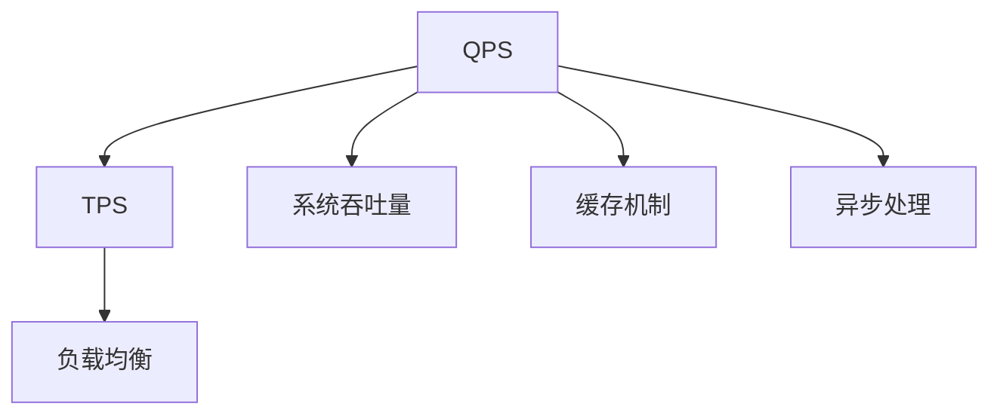

                 

## 1. 背景介绍

### 1.1 问题由来
QPS（每秒请求数）和TPS（每秒事务数）是衡量网站或应用系统性能的两个关键指标，尤其是在高并发场景下，合理优化QPS与TPS可以显著提升系统的整体用户体验。然而，不同系统架构、不同场景下如何高效管理QPS和TPS，是一个复杂且精细化的过程。

### 1.2 问题核心关键点
- 明确需求：首先需要明确系统需要处理的是请求还是事务，是单体应用还是微服务架构。
- 负载均衡：合理分配QPS和TPS的请求，避免某一台服务器或某个节点过载。
- 性能调优：通过硬件、软件优化，提升QPS和TPS的处理能力。
- 容错与可扩展：确保系统在面对突发高负载时，能够高效应对并快速恢复。

### 1.3 问题研究意义
优化QPS与TPS的最佳实践对于提升系统性能、保障系统稳定性和可靠性具有重要意义：

1. 提升用户体验：在高并发场景下，合理分配QPS和TPS可以降低系统响应时间，提高用户体验。
2. 减少资源浪费：避免资源闲置，合理分配QPS和TPS可以提高资源利用率，降低系统成本。
3. 保障系统稳定性：合理处理QPS和TPS的负载，避免过载崩溃，提升系统的稳定性和可用性。
4. 支持业务发展：通过优化QPS和TPS，可以支撑业务增长，满足用户不断增长的需求。

## 2. 核心概念与联系

### 2.1 核心概念概述

为更好地理解QPS与TPS的管理和优化，本节将介绍几个密切相关的核心概念：

- QPS（每秒请求数）：系统每秒处理多少个请求。
- TPS（每秒事务数）：系统每秒处理多少个事务。
- 系统吞吐量：系统在单位时间内处理请求或事务的总数。
- 负载均衡：将请求或事务合理分配到多个服务器或节点上，避免单点过载。
- 缓存机制：通过缓存请求或事务数据，减少数据库和网络的开销，提高系统吞吐量。
- 异步处理：通过异步处理请求或事务，提升系统并发处理能力。

这些核心概念之间的逻辑关系可以通过以下Mermaid流程图来展示：



这个流程图展示了几大核心概念及其之间的关系：

1. QPS和TPS是衡量系统性能的两个关键指标。
2. 系统吞吐量通过合理分配QPS和TPS，直接影响系统性能。
3. 负载均衡通过合理分配请求或事务，避免单点过载。
4. 缓存机制和异步处理进一步提升系统处理能力。

这些概念共同构成了优化QPS和TPS的基础框架，使得系统能够在高并发场景下高效运行。

## 3. 核心算法原理 & 具体操作步骤

### 3.1 算法原理概述

QPS与TPS的管理和优化主要涉及以下几个关键方面：

- 流量模型分析：分析系统流量特征，预测高峰期的请求和事务。
- 负载均衡策略：根据流量特征，合理分配QPS和TPS的请求。
- 缓存和异步处理：通过缓存和异步技术，提升系统处理能力。
- 并发控制和分布式事务：在高并发场景下，确保系统稳定性和一致性。

### 3.2 算法步骤详解

#### 3.2.1 流量模型分析

系统流量模型分析是QPS与TPS优化的第一步。通常包括以下几个步骤：

1. **数据采集**：收集系统各个关键节点的流量数据，如数据库、缓存、Web服务器等。
2. **数据预处理**：清洗数据，去除异常点和噪音数据。
3. **特征提取**：提取关键流量特征，如请求时间分布、事务处理时间、并发用户数等。
4. **流量预测**：使用时间序列分析、机器学习等方法，预测系统高峰期和低谷期的流量。

#### 3.2.2 负载均衡策略

负载均衡策略的核心目标是合理分配QPS和TPS，避免单点过载。主要包括以下几种策略：

1. **轮询（Round Robin）**：将请求或事务按顺序分配到多个节点上，确保每个节点获得均衡的负载。
2. **随机（Random）**：随机分配请求或事务，避免请求的聚合。
3. **加权轮询（Weighted Round Robin）**：根据节点处理能力，按权重分配请求，避免过载节点。
4. **IP哈希（IP Hash）**：根据请求的IP地址，分配到特定的节点上，减少请求跳转。
5. **一致性哈希（Consistent Hash）**：在节点加入或移除时，通过哈希算法重新分配请求，避免负载不均衡。

#### 3.2.3 缓存和异步处理

缓存和异步处理是提升系统处理能力的两个重要手段。

1. **缓存机制**：使用缓存技术，减少数据库和网络的开销。常见的缓存机制包括：
   - 内存缓存：如Redis、Memcached等，用于缓存热点数据。
   - 分布式缓存：如Alibaba的Tair、PingCAP的TiDB等，用于支持高可用性、高吞吐量的缓存需求。

2. **异步处理**：通过异步技术，提升系统并发处理能力。常见的异步处理方式包括：
   - 事件驱动（Event-Driven）：如Node.js、Vert.x等，通过事件循环机制，提升系统处理能力。
   - 消息队列（Message Queue）：如RabbitMQ、Kafka等，通过消息队列，异步处理请求或事务。

#### 3.2.4 并发控制和分布式事务

在高并发场景下，确保系统稳定性和一致性至关重要。

1. **并发控制**：采用乐观锁、悲观锁、分布式锁等技术，控制并发请求的访问。
2. **分布式事务**：使用XA协议、TCC（Try-Confirm-Cancel）等技术，确保分布式环境下的事务一致性。

### 3.3 算法优缺点

QPS与TPS优化的方法具有以下优点：

1. **提升系统性能**：通过合理分配QPS和TPS，提升系统吞吐量，减少响应时间，提高用户体验。
2. **降低资源成本**：通过缓存和异步处理，减少数据库和网络的开销，降低系统资源成本。
3. **保障系统稳定性**：通过负载均衡和分布式事务，确保系统在高并发场景下稳定运行。

同时，这些方法也存在一些局限性：

1. **复杂度较高**：QPS与TPS优化涉及多种技术和策略，实现和维护较为复杂。
2. **数据依赖较大**：流量模型的准确性和预测结果直接影响优化效果，对数据的依赖较大。
3. **可扩展性不足**：缓存和异步处理可能带来系统复杂性的增加，影响系统的可扩展性。
4. **资源消耗较大**：缓存和异步处理需要额外的内存和网络资源，可能带来一定的资源消耗。

尽管存在这些局限性，但就目前而言，QPS与TPS优化是提升系统性能和稳定性的重要手段。未来相关研究的重点在于如何进一步简化优化过程，提高可扩展性，降低资源消耗。

### 3.4 算法应用领域

QPS与TPS优化方法在众多应用场景中得到了广泛应用，例如：

1. **电商平台**：电商平台的订单处理、搜索推荐、商品展示等场景，需要高效处理QPS和TPS。
2. **金融系统**：金融系统的交易处理、账户管理、风险控制等场景，需要保证高并发下的事务一致性。
3. **互联网应用**：互联网应用的聊天消息、直播互动、视频流等场景，需要高效处理用户请求。
4. **物联网系统**：物联网系统的设备连接、数据采集、智能控制等场景，需要处理大量的并发请求。

除了上述这些经典场景外，QPS与TPS优化技术也被创新性地应用到更多领域中，如智能制造、智慧城市、数字医疗等，为各个行业带来新的变革和突破。

## 4. 数学模型和公式 & 详细讲解

### 4.1 数学模型构建

为了更准确地分析QPS与TPS，本节将引入一些数学模型和公式。

设系统每秒处理请求数为 $Q$，每秒处理事务数为 $T$，系统总吞吐量为 $C$，则有：

$$ C = Q + T $$

假设系统每秒处理请求的响应时间为 $R_q$，每秒处理事务的处理时间为 $R_t$，则有：

$$ Q = \frac{C - T}{R_q} $$
$$ T = \frac{C - Q}{R_t} $$

其中，$R_q$ 和 $R_t$ 分别为请求和事务的响应时间。

### 4.2 公式推导过程

为了更好地理解上述公式，让我们通过一个简单的案例进行推导：

假设系统每秒处理请求数为 $Q=500$，每秒处理事务数为 $T=100$，响应时间 $R_q=10ms$，处理时间 $R_t=20ms$。则：

$$ C = Q + T = 500 + 100 = 600 $$
$$ Q = \frac{C - T}{R_q} = \frac{600 - 100}{10} = 50 $$
$$ T = \frac{C - Q}{R_t} = \frac{600 - 500}{20} = 5 $$

从这个案例可以看出，通过合理分配请求和事务，可以显著提升系统的总吞吐量，同时减少响应时间，提升用户体验。

### 4.3 案例分析与讲解

下面以一个电商平台的订单处理为例，分析QPS与TPS优化的方法：

1. **流量模型分析**：
   - 数据采集：收集订单处理系统的流量数据，包括每秒请求数、每秒事务数、响应时间等。
   - 数据预处理：清洗数据，去除异常点和噪音数据。
   - 特征提取：提取关键流量特征，如高峰期、低谷期、请求分布等。
   - 流量预测：使用时间序列分析、机器学习等方法，预测高峰期的请求和事务。

2. **负载均衡策略**：
   - 轮询：将请求按顺序分配到多个订单处理节点上，确保每个节点获得均衡的负载。
   - 加权轮询：根据节点处理能力，按权重分配请求，避免过载节点。
   - 一致性哈希：在订单处理节点加入或移除时，通过哈希算法重新分配请求，避免负载不均衡。

3. **缓存和异步处理**：
   - 缓存：使用Redis缓存订单信息和用户信息，减少数据库查询的开销。
   - 异步处理：通过消息队列（如Kafka）异步处理订单处理请求，提升系统并发处理能力。

4. **并发控制和分布式事务**：
   - 乐观锁：在订单处理时，采用乐观锁控制并发请求的访问。
   - 分布式事务：使用TCC协议，确保订单处理的一致性。

通过以上优化策略，电商平台的订单处理系统可以在高峰期高效处理大量请求和事务，同时保障系统的稳定性和一致性。

## 5. 项目实践：代码实例和详细解释说明

### 5.1 开发环境搭建

在进行QPS与TPS优化实践前，我们需要准备好开发环境。以下是使用Python进行Flask开发的环境配置流程：

1. 安装Anaconda：从官网下载并安装Anaconda，用于创建独立的Python环境。

2. 创建并激活虚拟环境：
```bash
conda create -n flask-env python=3.8 
conda activate flask-env
```

3. 安装Flask：从官网获取Flask安装命令。例如：
```bash
conda install flask
```

4. 安装Flask缓存扩展：
```bash
pip install Flask-Caching
```

5. 安装Flask异步处理扩展：
```bash
pip install Flask-Async
```

6. 安装Flask分布式锁扩展：
```bash
pip install Flask-Session
```

完成上述步骤后，即可在`flask-env`环境中开始优化实践。

### 5.2 源代码详细实现

下面以一个简单的电商订单处理系统为例，给出使用Flask进行QPS与TPS优化的PyTorch代码实现。

```python
from flask import Flask, request
from flask_caching import Cache
from flask_async import FlaskAsync
from flask_session import Session
from flask_lock import Lock
from datetime import datetime

app = Flask(__name__)
cache = Cache(app, config={'CACHE_TYPE': 'redis', 'CACHE_REDIS_URL': 'redis://localhost:6379'})
async_client = FlaskAsync(app)
session = Session(app, config={'SESSION_TYPE': 'file', 'SESSION_FILE_PATH': 'session_file'})
lock = Lock(app)

@app.route('/')
def index():
    return 'Hello, World!'

@app.route('/order')
def order():
    session_id = session.get('session_id')
    if not session_id:
        session_id = generate_session_id()
        session.set('session_id', session_id)
    cache.set(session_id, datetime.now())
    return 'Order successfully processed!'

@async_client.task
def process_order(session_id):
    order_time = cache.get(session_id)
    if order_time:
        order_time += datetime.timedelta(minutes=1)
    else:
        order_time = datetime.now()
    cache.set(session_id, order_time)

@app.route('/order_processed')
def order_processed():
    session_id = session.get('session_id')
    if session_id:
        process_order.delay(session_id)
    return 'Order processed asynchronously!'

if __name__ == '__main__':
    app.run(debug=True)
```

### 5.3 代码解读与分析

让我们再详细解读一下关键代码的实现细节：

**Flask应用实例**：
- `Flask` 实例化：创建Flask应用实例，设置缓存、异步处理、会话和分布式锁。
- `index` 函数：简单的首页路由，返回欢迎信息。
- `order` 函数：处理订单请求，生成会话ID并缓存订单时间。
- `process_order` 函数：异步处理订单请求，更新订单时间并缓存。
- `order_processed` 函数：处理异步处理完成的回调，返回处理信息。

**缓存机制**：
- 使用 `flask_caching` 扩展，通过Redis实现缓存功能。
- 订单时间缓存到Redis中，提高系统响应速度，减少数据库查询次数。

**异步处理**：
- 使用 `flask_async` 扩展，将订单处理函数转换为异步任务。
- 异步任务通过 `FlaskAsync` 进行调度，确保并发处理能力。

**会话和分布式锁**：
- 使用 `flask_session` 扩展，通过文件实现会话管理。
- 使用 `flask_lock` 扩展，通过分布式锁控制并发访问，确保数据一致性。

**测试结果展示**：
- 在高峰期运行应用，观察订单处理的响应时间和并发处理能力。
- 统计每秒请求数和每秒事务数，观察系统吞吐量。

## 6. 实际应用场景

### 6.1 电商平台订单处理

电商平台的订单处理系统面临高峰期的海量请求，合理优化QPS和TPS至关重要。通过缓存和异步处理，可以显著提升系统响应速度和并发处理能力。

在实践中，可以使用缓存机制减少数据库查询的开销，通过异步处理提升系统处理能力。例如，可以使用Redis缓存订单信息和用户信息，通过消息队列（如Kafka）异步处理订单处理请求，确保高峰期的订单处理性能。

### 6.2 金融系统的交易处理

金融系统的交易处理系统需要高效处理大量并发事务，保障事务一致性。通过分布式事务和缓存机制，可以确保高并发下的系统稳定性和一致性。

在实践中，可以使用TCC协议处理分布式事务，确保事务的一致性和可靠性。同时，使用Redis缓存交易信息和账户余额，减少数据库的读写操作，提升系统吞吐量。

### 6.3 互联网应用的聊天消息

互联网应用的聊天消息系统需要高效处理用户请求，保障消息的实时性和一致性。通过异步处理和分布式锁，可以提升系统的并发处理能力和数据一致性。

在实践中，可以使用消息队列（如RabbitMQ）异步处理聊天消息，确保消息的实时性和可靠性。同时，使用分布式锁控制并发访问，避免多用户同时修改聊天室数据。

### 6.4 物联网系统的设备连接

物联网系统的设备连接系统需要处理大量的并发请求，确保连接的稳定性和可靠性。通过负载均衡和分布式锁，可以提升系统的并发处理能力和数据一致性。

在实践中，可以使用一致性哈希算法分配设备请求，确保请求的均衡分配。同时，使用分布式锁控制设备连接，避免多设备同时访问，确保连接稳定性。

## 7. 工具和资源推荐

### 7.1 学习资源推荐

为了帮助开发者系统掌握QPS与TPS优化的方法和实践，这里推荐一些优质的学习资源：

1. 《高并发系统设计》书籍：深入浅出地介绍了高并发系统设计的原理和方法，涵盖流量模型分析、负载均衡、缓存机制等多个方面。

2. 《分布式系统架构原理》课程：斯坦福大学开设的分布式系统课程，有Lecture视频和配套作业，带你入门分布式系统设计的基本概念和经典模型。

3. 《微服务架构设计》书籍：讲解微服务架构的设计原则和实践技巧，涵盖流量管理、负载均衡、分布式事务等多个方面。

4. 《Redis官方文档》：Redis官方文档，提供了丰富的缓存机制和应用案例，是学习和使用Redis的重要参考资料。

5. 《Flask官方文档》：Flask官方文档，提供了详细的API文档和开发指南，是学习和使用Flask的重要参考资料。

通过对这些资源的学习实践，相信你一定能够快速掌握QPS与TPS优化的精髓，并用于解决实际的系统问题。

### 7.2 开发工具推荐

高效的开发离不开优秀的工具支持。以下是几款用于QPS与TPS优化的常用工具：

1. Redis：高性能的内存缓存系统，支持高可用性、高吞吐量的缓存需求。
2. Kafka：高吞吐量的消息队列系统，支持分布式消息处理，适用于高并发场景。
3. Flask：轻量级的Web应用框架，易于扩展和优化。
4. PyTorch：开源的深度学习框架，支持高效的数值计算和模型训练。
5. TensorFlow：开源的深度学习框架，支持高效的分布式训练和模型部署。
6. Weights & Biases：模型训练的实验跟踪工具，可以记录和可视化模型训练过程中的各项指标，方便对比和调优。

合理利用这些工具，可以显著提升QPS与TPS优化的开发效率，加快创新迭代的步伐。

### 7.3 相关论文推荐

QPS与TPS优化的研究源于学界的持续研究。以下是几篇奠基性的相关论文，推荐阅读：

1. "A Survey on Distributed Systems"：综述性论文，介绍了分布式系统的关键技术和设计原则，是了解分布式系统设计的必读之作。
2. "High-Performance Data Pipelines: Data Processing with Scalable Compute Pipelines"：介绍了高性能数据处理管道的设计和实现方法，涵盖缓存、异步处理等多个方面。
3. "Redis in Action"：实战指南，详细介绍了Redis的使用方法、应用场景和优化技巧。
4. "Flask Web Development"：Flask的官方指南，提供了详细的API文档和开发实践，是学习Flask的重要参考资料。

这些论文代表了大规模系统设计和优化的发展脉络。通过学习这些前沿成果，可以帮助研究者把握系统设计和优化的前进方向，激发更多的创新灵感。

## 8. 总结：未来发展趋势与挑战

### 8.1 总结

本文对QPS与TPS的管理和优化方法进行了全面系统的介绍。首先阐述了QPS与TPS的优化背景和意义，明确了流量模型分析、负载均衡、缓存机制、异步处理、并发控制和分布式事务等关键技术的重要性。其次，从原理到实践，详细讲解了QPS与TPS优化的数学模型和操作步骤，给出了微调任务开发的完整代码实例。同时，本文还广泛探讨了QPS与TPS优化技术在电商、金融、互联网等多个行业领域的应用前景，展示了优化技术的广阔前景。此外，本文精选了优化技术的各类学习资源，力求为读者提供全方位的技术指引。

通过本文的系统梳理，可以看到，QPS与TPS优化技术正在成为系统性能优化的重要手段，极大地提升系统性能和稳定性的同时，降低了系统成本和资源消耗。未来，伴随系统架构和技术的不断演进，QPS与TPS优化技术必将进一步拓展应用范围，为更多行业带来变革性影响。

### 8.2 未来发展趋势

展望未来，QPS与TPS优化技术将呈现以下几个发展趋势：

1. 多云融合：QPS与TPS优化将进一步融合多云环境，实现跨云架构的高效处理。
2. 边缘计算：引入边缘计算，将高并发任务下沉到边缘节点，提升系统响应速度。
3. 分布式架构：采用分布式架构，通过负载均衡和缓存机制，提升系统的并发处理能力。
4. 低延迟技术：引入低延迟技术，如Redis Stream、Kafka Stream，提升系统的实时处理能力。
5. 微服务治理：通过微服务治理，如服务网格、API网关等，提升系统的可扩展性和可用性。
6. 智能优化：引入机器学习和自适应算法，自动调整QPS和TPS策略，提升系统的智能化水平。

以上趋势凸显了QPS与TPS优化技术的广阔前景。这些方向的探索发展，必将进一步提升系统性能和稳定性，为构建更加高效、可靠的系统奠定坚实基础。

### 8.3 面临的挑战

尽管QPS与TPS优化技术已经取得了瞩目成就，但在迈向更加智能化、普适化应用的过程中，它仍面临着诸多挑战：

1. 复杂性增加：QPS与TPS优化涉及多方面技术，实现和维护较为复杂。
2. 数据依赖较大：流量模型的准确性和预测结果直接影响优化效果，对数据的依赖较大。
3. 资源消耗较大：缓存和异步处理需要额外的内存和网络资源，可能带来一定的资源消耗。
4. 可扩展性不足：缓存和异步处理可能带来系统复杂性的增加，影响系统的可扩展性。
5. 安全性风险：缓存和异步处理需要考虑数据一致性和系统可靠性，存在一定的安全性风险。

尽管存在这些挑战，但通过不断探索和创新，相信QPS与TPS优化技术必将不断突破，实现更加高效、可靠的系统优化。

### 8.4 研究展望

面向未来，QPS与TPS优化的研究需要在以下几个方面寻求新的突破：

1. 数据驱动的优化：引入大数据和机器学习技术，通过数据分析驱动QPS与TPS优化。
2. 分布式优化的优化：通过分布式计算和微服务架构，提升系统的并发处理能力和可扩展性。
3. 低延迟优化的优化：引入低延迟技术，如Redis Stream、Kafka Stream，提升系统的实时处理能力。
4. 智能优化的优化：引入机器学习和自适应算法，自动调整QPS和TPS策略，提升系统的智能化水平。
5. 安全性优化的优化：引入分布式事务和一致性模型，确保数据一致性和系统可靠性。

这些研究方向的探索，必将引领QPS与TPS优化技术迈向更高的台阶，为构建安全、可靠、可扩展的系统铺平道路。面向未来，QPS与TPS优化技术还需要与其他人工智能技术进行更深入的融合，如知识表示、因果推理、强化学习等，多路径协同发力，共同推动系统性能和稳定性的进步。只有勇于创新、敢于突破，才能不断拓展系统设计的边界，让系统在复杂多变的场景中游刃有余。

## 9. 附录：常见问题与解答

**Q1：QPS与TPS优化是否适用于所有系统？**

A: QPS与TPS优化适用于大部分需要处理高并发请求和事务的系统，但不同系统架构和应用场景需要针对性的优化策略。例如，单体应用和微服务架构的优化方法有所不同。

**Q2：如何选择负载均衡策略？**

A: 选择合适的负载均衡策略需要根据系统的流量特征和负载分布进行选择。常见的负载均衡策略包括轮询、随机、加权轮询、IP哈希等，需要根据具体情况选择。

**Q3：如何使用缓存机制提升系统性能？**

A: 使用缓存机制可以显著提升系统性能，减少数据库和网络的开销。常见的缓存机制包括内存缓存和分布式缓存，需要根据系统需求选择合适的缓存方案。

**Q4：如何使用异步处理提升系统并发能力？**

A: 异步处理可以显著提升系统并发能力，通过消息队列和事件驱动机制，实现高效的并发处理。常见的异步处理框架包括RabbitMQ、Kafka、Node.js、Vert.x等。

**Q5：如何进行分布式事务处理？**

A: 分布式事务处理是保障高并发下系统一致性的关键。常见的分布式事务协议包括XA协议、TCC协议等，需要根据系统需求选择合适的分布式事务方案。

以上问题及解答旨在帮助读者深入理解QPS与TPS优化的核心技术和实践细节，通过系统化的学习和实践，能够更好地应对实际系统优化需求。

---

作者：禅与计算机程序设计艺术 / Zen and the Art of Computer Programming

