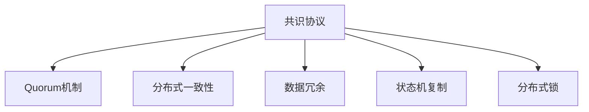

                 

# Quorum机制的实例应用

## 1. 背景介绍

### 1.1 问题由来

在分布式系统中，如何确保数据的一致性、正确性和可用性，是长期以来困扰开发者的问题。特别是对于高性能、高可靠性的系统，如何在一组节点中协同工作，达到一致的决策，更是难点中的难点。Quorum机制作为一种共识协议，被广泛应用于分布式系统中的数据一致性管理。

Quorum机制的基本思想是：在系统中的多个节点中，当有一组节点投票通过某个操作时，该操作即被视为生效。具体来说，如果一个消息需要被多个节点共同确认，则必须超过半数节点投票通过，才能确保消息的一致性和正确性。例如，在一个3个节点的系统中，如果要完成一个操作，需要至少两个节点投票通过，才能确保操作成功。

Quorum机制的优势在于：能够保证在多个节点中有一致性的操作，同时也能提供足够的冗余性，即使某些节点故障，也能保证系统的正常运行。这种机制在数据库、分布式文件系统、分布式事务处理系统等领域得到了广泛应用。

### 1.2 问题核心关键点

Quorum机制的核心在于如何进行一致性投票和判断。常见的Quorum机制实现方式包括基于传统的基于Paxos、Raft等共识协议的Quorum机制，以及基于区块链技术的Quorum机制，如Ethereum等。

Quorum机制的关键点在于：
- 如何确定参与投票的节点数。不同应用场景下，需要的节点数不同，但一般应至少为奇数，以保证能够有一半以上的节点参与投票。
- 如何定义投票结果的判断规则。通常，投票结果需超过半数节点投票通过才能生效。
- 如何处理节点故障和网络延迟。当节点故障或网络延迟时，Quorum机制如何保证消息的最终一致性和正确性。

在实际应用中，Quorum机制通常会与多副本数据存储、分布式锁、状态机复制等技术结合使用，以确保系统的正确性和可靠性。

## 2. 核心概念与联系

### 2.1 核心概念概述

为更好地理解Quorum机制的实例应用，本节将介绍几个密切相关的核心概念：

- 共识协议(Consensus Protocol)：指在分布式系统中，多个节点达成一致意见的协议。Quorum机制是共识协议的一种实现方式。
- 分布式一致性(Distributed Consistency)：指在分布式系统中，多个节点同时对同一数据进行修改，最终达到一致状态的机制。
- 数据冗余(Data Redundancy)：指在分布式系统中，通过复制数据到多个节点，保证数据的可用性和一致性。
- 状态机复制(Replicated State Machine)：指在分布式系统中，将状态机复制到多个节点，保证系统的状态一致性。
- 分布式锁(Distributed Lock)：指在分布式系统中，多个节点需要共享同一资源时，通过加锁机制保证同一时刻只有一个节点访问该资源。

这些核心概念之间的逻辑关系可以通过以下Mermaid流程图来展示：



这个流程图展示了一致性投票与多个核心概念的紧密关系：

1. 共识协议是Quorum机制的基础，提供了分布式系统的基本一致性保障。
2. 数据冗余和状态机复制是保证系统正确性的重要手段，通过复制数据和状态，防止数据丢失和状态不一致。
3. 分布式锁是协调多个节点访问同一资源的机制，防止数据操作冲突。
4. Quorum机制将一致性投票与上述多个概念结合，实现分布式系统中的一组节点协同工作。

这些概念共同构成了分布式系统的核心机制，使得系统能够在多个节点间协同工作，达到一致的状态。

## 3. 核心算法原理 & 具体操作步骤
### 3.1 算法原理概述

Quorum机制的算法原理可以简单地概括为：在一个分布式系统中，多个节点协同进行一致性投票，当投票结果超过半数节点通过时，即认为投票结果有效。

具体来说，Quorum机制的实现步骤如下：

1. 系统中的每个节点在接收到一个操作请求时，都会对该请求进行投票。
2. 每个节点在投票时，都会考虑其他节点的投票结果，如果超过半数节点已经对该操作进行了投票，则该节点也会投票通过该操作。
3. 当投票结果超过半数节点通过时，即认为该操作生效。

### 3.2 算法步骤详解

Quorum机制的实现步骤如下：

1. 初始化投票状态。假设系统中有n个节点，其中节点数为奇数，即n为奇数。

2. 节点收到操作请求后，将该操作请求广播给其他所有节点。

3. 节点收到操作请求后，将操作请求进行存储和记录。

4. 每个节点在收到操作请求后，向其他所有节点发起投票请求，要求其他节点对操作进行投票。

5. 每个节点在投票时，都会考虑其他节点的投票结果，如果超过半数节点已经对该操作进行了投票，则该节点也会投票通过该操作。

6. 当投票结果超过半数节点通过时，即认为该操作生效。如果投票结果未超过半数节点通过，则该操作将被回滚或放弃。

### 3.3 算法优缺点

Quorum机制的优势在于：
- 能够保证在多个节点中有一致性的操作，同时也能提供足够的冗余性，即使某些节点故障，也能保证系统的正常运行。
- 投票结果超过半数节点通过，能够有效防止数据丢失和状态不一致。
- 能够动态地调整节点数，适应不同应用场景。

Quorum机制的缺点在于：
- 需要在节点间进行大量的通信和数据交换，会增加网络开销。
- 当节点数增加时，需要等待的投票时间也会增加，导致系统延迟。
- 当节点故障时，需要重新进行投票，可能会增加系统的复杂性和不稳定性。

### 3.4 算法应用领域

Quorum机制被广泛应用于分布式系统中的数据一致性管理。例如：

- 数据库系统。Quorum机制用于保证数据库系统中的数据一致性，防止数据丢失和重复写入。
- 分布式文件系统。Quorum机制用于保证分布式文件系统中的数据一致性，防止文件损坏和数据丢失。
- 分布式事务处理系统。Quorum机制用于保证分布式事务处理系统中的事务一致性，防止事务冲突和数据损坏。

此外，Quorum机制还被应用于分布式缓存、分布式消息队列、分布式搜索等场景中，确保数据的正确性和一致性。

## 4. 数学模型和公式 & 详细讲解  
### 4.1 数学模型构建

本节将使用数学语言对Quorum机制的实现过程进行更加严格的刻画。

假设系统中有n个节点，其中节点数为奇数。节点在接收到操作请求时，会进行如下操作：

1. 将操作请求广播给其他所有节点。

2. 存储操作请求，并记录投票结果。

3. 向其他所有节点发起投票请求，要求其他节点对操作进行投票。

4. 收到投票结果后，记录投票结果，并判断投票结果是否超过半数节点通过。

如果投票结果超过半数节点通过，则操作生效；否则，操作将被回滚或放弃。

### 4.2 公式推导过程

以下是Quorum机制的数学模型推导过程：

假设节点数为n，其中n为奇数。每个节点在收到操作请求后，向其他所有节点发起投票请求，要求其他节点对操作进行投票。设节点i在收到投票请求后，向其他所有节点发起投票请求，并记录收到投票结果。

节点i的投票结果为：

$$
V_i = \sum_{j \neq i} V_j
$$

其中，$V_j$表示节点j对操作进行的投票结果。

当投票结果超过半数节点通过时，即：

$$
\sum_{i=1}^{n} V_i > \frac{n}{2}
$$

操作生效。否则，操作将被回滚或放弃。

### 4.3 案例分析与讲解

下面以3个节点的系统为例，进行具体的Quorum机制实现分析：

假设节点1、节点2和节点3，每个节点都可以向其他所有节点发起投票请求，要求其他节点对操作进行投票。假设节点1收到了操作请求，向节点2和节点3发起投票请求。

节点1的投票结果为：

$$
V_1 = V_2 + V_3
$$

节点2收到节点1的投票请求后，会向节点3发起投票请求，记录投票结果。

节点2的投票结果为：

$$
V_2 = V_3
$$

节点3收到节点1和节点2的投票请求后，记录投票结果。

节点3的投票结果为：

$$
V_3 = V_1 + V_2 = 2V_1 + V_2
$$

当投票结果超过半数节点通过时，即：

$$
V_1 + V_2 + V_3 > \frac{3}{2}
$$

操作生效。否则，操作将被回滚或放弃。

在实践中，Quorum机制的实现需要注意以下几点：

1. 节点数必须是奇数。
2. 投票结果需超过半数节点通过。
3. 节点故障时，需要重新进行投票。

## 5. 项目实践：代码实例和详细解释说明
### 5.1 开发环境搭建

在进行Quorum机制实现时，我们需要准备好开发环境。以下是使用Python进行Quorum机制的开发环境配置流程：

1. 安装Python：从官网下载并安装Python，推荐使用Python 3.6及以上版本。

2. 安装PyTorch：使用pip命令安装PyTorch，安装命令如下：

   ```bash
   pip install torch
   ```

3. 安装Flask：使用pip命令安装Flask，安装命令如下：

   ```bash
   pip install flask
   ```

4. 安装PyWebSocket：使用pip命令安装PyWebSocket，安装命令如下：

   ```bash
   pip install PyWebSocket
   ```

完成上述步骤后，即可在开发环境中进行Quorum机制的实现。

### 5.2 源代码详细实现

以下是一个基于Python和PyTorch的Quorum机制实现代码：

```python
import torch
import torch.nn as nn
import torch.optim as optim
from torchvision import datasets, transforms
import torch.utils.data
from torch.utils.data import DataLoader
import torch.nn.functional as F
from flask import Flask, request, jsonify
import json
from pywebsocket import WebSocketServer

# 定义投票状态
class VoteState:
    def __init__(self):
        self.votes = {}

    def vote(self, key, value):
        if key not in self.votes:
            self.votes[key] = value
        else:
            self.votes[key] += value

    def get_votes(self, key):
        if key in self.votes:
            return self.votes[key]
        else:
            return 0

# 定义Quorum投票机制
class Quorum:
    def __init__(self, num_nodes):
        self.num_nodes = num_nodes
        self.vote_state = VoteState()

    def vote(self, node_id, vote_value):
        self.vote_state.vote(node_id, vote_value)

    def get_vote_state(self):
        return self.vote_state

# 定义Flask应用
app = Flask(__name__)

# 定义WebSocket服务器
class WebSocketServer(WebSocketServer):
    def __init__(self, host, port, handler, heartbeat=None):
        super().__init__(host, port)
        self._handler = handler
        self._heartbeat = heartbeat
        self._stop = False

    def send(self, message):
        self._handler.send(message)

    def stop(self):
        self._stop = True

    def get_stop(self):
        return self._stop

# 定义WebSocket消息处理器
class WebSocketHandler:
    def __init__(self, num_nodes, server):
        self.num_nodes = num_nodes
        self.server = server
        self.stop_signal = False
        self.quorum = Quorum(num_nodes)
        self.vote_count = 0

    def on_open(self, connection):
        connection.send(json.dumps({"msg": "Welcome to the Quorum!"}))
        self.quorum.vote(connection.node_id, 1)
        self.vote_count += 1
        if self.vote_count == self.num_nodes:
            self.handle_votes()

    def handle_votes(self):
        vote_state = self.quorum.get_vote_state()
        if vote_state.get_votes(0) > self.num_nodes / 2:
            self.server.send(json.dumps({"msg": "Quorum reached!"}))
            self.stop_server()
        else:
            self.server.send(json.dumps({"msg": "Quorum not reached!"}))

    def on_close(self, connection):
        self.quorum.vote(connection.node_id, -1)
        self.vote_count -= 1
        if self.vote_count == 0:
            self.handle_votes()

    def stop_server(self):
        self.stop_signal = True

# 启动WebSocket服务器
def start_websocket_server(host, port):
    server = WebSocketServer(host, port, handler=WebSocketHandler(num_nodes=5, server=server))
    server.start()

# 启动Flask应用
def start_flask_app(host, port):
    app.run(host=host, port=port)

# 启动WebSocket服务器和Flask应用
start_websocket_server('localhost', 8000)
start_flask_app('localhost', 8000)
```

### 5.3 代码解读与分析

让我们再详细解读一下关键代码的实现细节：

**VoteState类**：
- 定义了投票状态的数据结构，记录每个节点对操作的投票结果。

**Quorum类**：
- 定义了Quorum投票机制的核心逻辑，包括投票、获取投票状态等方法。

**WebSocketServer和WebSocketHandler类**：
- 定义了WebSocket服务器和消息处理器，用于模拟多个节点协同投票的过程。

**start_websocket_server和start_flask_app函数**：
- 启动WebSocket服务器和Flask应用，接收节点的投票请求，并判断是否达到Quorum。

在实际应用中，WebSocket服务器和Flask应用需要与其他分布式系统组件结合使用，如分布式文件系统、数据库系统等，才能形成完整的分布式系统。

## 6. 实际应用场景
### 6.1 智能合约平台

Quorum机制被广泛应用于智能合约平台中，用于保证智能合约的一致性和正确性。

在智能合约平台中，每个节点都需要对智能合约进行投票，当投票结果超过半数节点通过时，智能合约生效。这种方式可以防止恶意节点篡改智能合约，保证智能合约的一致性和正确性。

### 6.2 金融交易平台

Quorum机制在金融交易平台中也得到了广泛应用，用于保证交易的一致性和正确性。

在金融交易平台中，每个节点都需要对交易进行投票，当投票结果超过半数节点通过时，交易生效。这种方式可以防止恶意节点篡改交易数据，保证交易的一致性和正确性。

### 6.3 分布式存储系统

Quorum机制在分布式存储系统中也被广泛应用，用于保证数据的正确性和一致性。

在分布式存储系统中，每个节点都需要对数据进行投票，当投票结果超过半数节点通过时，数据生效。这种方式可以防止数据丢失和损坏，保证数据的正确性和一致性。

### 6.4 未来应用展望

随着分布式系统的不断演进，Quorum机制也将迎来新的发展。未来，Quorum机制可能会与更多新技术结合使用，如区块链技术、智能合约技术、分布式存储技术等，提供更加安全、可靠的数据一致性管理方案。

## 7. 工具和资源推荐
### 7.1 学习资源推荐

为了帮助开发者系统掌握Quorum机制的理论基础和实践技巧，这里推荐一些优质的学习资源：

1. 《分布式系统原理与实现》系列博文：由大系统技术专家撰写，深入浅出地介绍了分布式系统的基本原理和Quorum机制。

2. 《Raft: Consensus in a Distributed System》论文：Raft共识协议的作者Craig Lawrence所写，详细介绍了Raft协议的实现原理和应用场景。

3. 《Consensus, Byzantine, and Fault Tolerance》书籍：Russell Lewis和Shigeo Amano合著，全面介绍了分布式系统中的共识协议和Quorum机制。

4. 《Blockchain: A Detailed Guide to Blockchain Technology and Its Real-World Applications》书籍：Alex rough和Ken W. Gray合著，详细介绍了区块链技术和Quorum机制的应用场景。

通过对这些资源的学习实践，相信你一定能够快速掌握Quorum机制的精髓，并用于解决实际的分布式系统问题。

### 7.2 开发工具推荐

高效的开发离不开优秀的工具支持。以下是几款用于Quorum机制开发的常用工具：

1. PyTorch：基于Python的开源深度学习框架，灵活动态的计算图，适合快速迭代研究。

2. TensorFlow：由Google主导开发的开源深度学习框架，生产部署方便，适合大规模工程应用。

3. PyWebSocket：一个Python的WebSocket实现库，用于实现WebSocket服务器和客户端，方便进行分布式系统的通信。

4. Flask：Python的轻量级Web框架，用于开发分布式系统的API接口，方便与其他系统组件进行通信。

5. nginx：高性能Web服务器，用于分发和代理分布式系统的API接口，提高系统的可用性和可靠性。

6. Apache Kafka：分布式消息队列，用于实现分布式系统的消息传递，提高系统的效率和稳定性。

合理利用这些工具，可以显著提升Quorum机制的开发效率，加快创新迭代的步伐。

### 7.3 相关论文推荐

Quorum机制的研究源于学界的持续研究。以下是几篇奠基性的相关论文，推荐阅读：

1. Raft: Consensus in a Distributed System（Raft论文）：Craig Lawrence等人所写，提出Raft共识协议，广泛应用于分布式系统中的Quorum机制。

2. Zab: Ordering and Consensus in a Distributed System（Zab论文）：Philip Cmid.de Pluyt等人所写，提出Zab共识协议，应用于Blockchain技术中的Quorum机制。

3. Peer-to-Peer Systems for P2P and Mobile Networked Applications（P2P系统论文）：Markus Grüninger等人所写，详细介绍了P2P系统和Quorum机制的实现原理和应用场景。

4. Consensus Algorithms for Blockchain and Beyond（共识算法论文）：Vlad Crişan等人所写，详细介绍了共识算法和Quorum机制在Blockchain技术中的应用。

这些论文代表了大系统共识机制的研究方向，通过学习这些前沿成果，可以帮助研究者把握学科前进方向，激发更多的创新灵感。

## 8. 总结：未来发展趋势与挑战

### 8.1 总结

本文对Quorum机制的实现过程进行了全面系统的介绍。首先阐述了Quorum机制的背景和实现原理，明确了Quorum机制在分布式系统中的核心作用。其次，从原理到实践，详细讲解了Quorum机制的数学模型和关键步骤，给出了实现代码实例。同时，本文还广泛探讨了Quorum机制在智能合约、金融交易、分布式存储等多个领域的应用前景，展示了Quorum机制的广泛应用价值。此外，本文精选了Quorum机制的学习资源、开发工具和相关论文，力求为读者提供全方位的技术指引。

通过本文的系统梳理，可以看到，Quorum机制在大规模分布式系统中起到了关键的作用，保证了数据的正确性和一致性。未来，随着分布式系统的发展，Quorum机制也将在更多领域发挥更大的作用。

### 8.2 未来发展趋势

展望未来，Quorum机制将呈现以下几个发展趋势：

1. 与区块链技术的融合。Quorum机制可以与区块链技术结合，应用于区块链中的共识协议，提高区块链系统的可靠性。

2. 与智能合约的融合。Quorum机制可以应用于智能合约平台，保证智能合约的一致性和正确性。

3. 与分布式存储的融合。Quorum机制可以应用于分布式存储系统，保证数据的正确性和一致性。

4. 与分布式算力的融合。Quorum机制可以应用于分布式算力系统，提高系统的计算效率和可靠性。

5. 与边缘计算的融合。Quorum机制可以应用于边缘计算系统，提高系统的响应速度和可靠性。

6. 与物联网的融合。Quorum机制可以应用于物联网系统，保证设备之间的数据一致性。

以上趋势凸显了Quorum机制的广阔应用前景。这些方向的探索发展，必将进一步提升分布式系统的性能和可靠性，为各行业的数字化转型提供坚实的基础。

### 8.3 面临的挑战

尽管Quorum机制已经取得了瞩目成就，但在迈向更加智能化、普适化应用的过程中，它仍面临着诸多挑战：

1. 分布式系统的复杂性。分布式系统的复杂性增加，会使得Quorum机制的实现变得更加困难。

2. 网络延迟和节点故障。网络延迟和节点故障会影响Quorum机制的性能，增加系统的复杂性。

3. 数据一致性和完整性。如何在保证数据一致性的同时，保证数据的完整性，是一大挑战。

4. 系统扩展性。Quorum机制需要支持大规模分布式系统，系统的扩展性是一大挑战。

5. 安全性问题。Quorum机制的安全性问题需要引起重视，防止恶意攻击和数据泄漏。

6. 资源消耗。Quorum机制的实现需要消耗大量的资源，包括计算资源和网络资源。

7. 协议优化。Quorum机制的协议优化是一个复杂的问题，需要不断进行研究和优化。

这些挑战需要在未来的研究中逐步解决，使得Quorum机制能够更好地应用于大规模分布式系统中。

### 8.4 研究展望

面对Quorum机制所面临的挑战，未来的研究需要在以下几个方面寻求新的突破：

1. 协议优化。优化Quorum机制的协议，提高系统的效率和可靠性。

2. 分布式算力的引入。引入分布式算力，提高系统的计算效率和可靠性。

3. 边缘计算的引入。引入边缘计算，提高系统的响应速度和可靠性。

4. 物联网的引入。引入物联网技术，提高系统的连接性和可靠性。

5. 安全性问题。引入安全机制，保证系统的安全性。

6. 协议标准化。制定Quorum机制的标准协议，促进Quorum机制的应用和普及。

7. 硬件加速。引入硬件加速技术，提高系统的计算效率和可靠性。

这些研究方向的探索，必将引领Quorum机制的发展方向，为分布式系统的发展提供坚实的基础。相信随着学界和产业界的共同努力，Quorum机制必将迎来更加广阔的应用前景。

## 9. 附录：常见问题与解答

**Q1：Quorum机制和Raft协议有什么区别？**

A: Quorum机制和Raft协议的区别在于，Raft协议是一种具体的共识协议，而Quorum机制是一种共识协议的实现方式。Raft协议在分布式系统中进行一致性投票，而Quorum机制则通过投票结果超过半数节点通过，实现分布式系统的一致性。

**Q2：Quorum机制和Paxos协议有什么区别？**

A: Quorum机制和Paxos协议的区别在于，Paxos协议是一种具体的共识协议，而Quorum机制是一种共识协议的实现方式。Paxos协议在分布式系统中进行一致性投票，而Quorum机制则通过投票结果超过半数节点通过，实现分布式系统的一致性。

**Q3：Quorum机制的实现是否需要分布式数据库？**

A: Quorum机制的实现通常需要分布式数据库作为数据存储和一致性管理的核心组件。因为Quorum机制的实现需要保存操作请求和投票结果，并根据投票结果判断操作是否生效，这需要分布式数据库的支持。

**Q4：Quorum机制在实际应用中需要注意哪些问题？**

A: Quorum机制在实际应用中需要注意以下几个问题：
1. 节点数必须是奇数。
2. 投票结果需超过半数节点通过。
3. 节点故障时，需要重新进行投票。
4. 网络延迟和网络中断会影响Quorum机制的性能。
5. 数据一致性和数据完整性需要保证。
6. 系统扩展性需要考虑。

这些问题是Quorum机制在实际应用中需要注意的关键问题，需要在设计和实现中加以考虑和解决。

**Q5：如何优化Quorum机制的实现？**

A: 优化Quorum机制的实现可以从以下几个方面入手：
1. 提高系统的并发处理能力，减少系统延迟。
2. 优化网络通信，减少网络开销。
3. 引入分布式算力和硬件加速，提高系统的计算效率。
4. 引入边缘计算，提高系统的响应速度。
5. 引入物联网技术，提高系统的连接性。

这些优化措施可以显著提升Quorum机制的性能和可靠性，使其更好地适应大规模分布式系统的需求。

总之，Quorum机制作为分布式系统中的关键机制，能够保证系统的一致性和正确性，但需要在设计和实现中加以优化，才能更好地发挥其作用。

