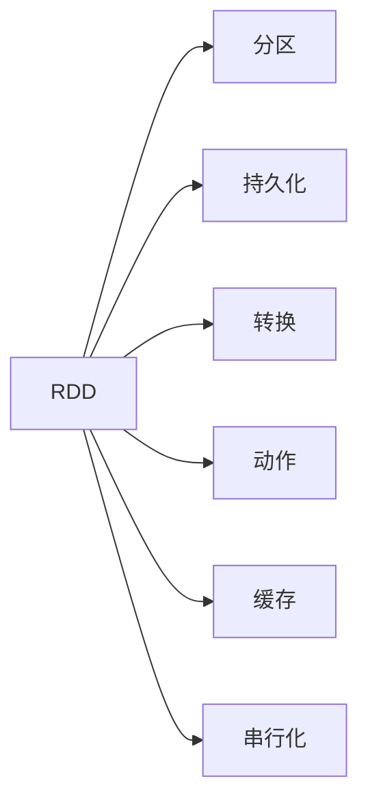

                 

## 1. 背景介绍

### 1.1 问题由来
随着大数据时代的到来，如何高效处理海量数据成为了各大企业面临的共同难题。传统的数据处理方式，如关系型数据库、批量处理等，在数据量急剧增长的情况下，已经逐渐无法满足需求。而分布式计算技术的出现，为大规模数据处理提供了新的解决途径，其中最知名的就是Apache Hadoop和Spark。

在Spark生态中，有两个非常重要的概念，即Hadoop Distributed File System（HDFS）和弹性分布式数据集（RDD）。HDFS提供了底层数据存储能力，而RDD则提供了高效的数据处理能力，两者协同工作，共同支撑了大规模数据处理的完整流程。

### 1.2 问题核心关键点
本文重点探讨RDD（弹性分布式数据集）的核心原理、主要操作、优化技巧以及实际应用场景，旨在帮助读者深入理解RDD的工作机制，并能够灵活地应用于实际项目中。

## 2. 核心概念与联系

### 2.1 核心概念概述

- **RDD（弹性分布式数据集）**：是Spark中的核心抽象，代表了一组在分布式集群的内存中不可变的、可并行处理的元素集合。RDD中的元素可以是任意类型的数据，如结构化数据、图像、视频等。

- **持久化（Persistence）**：通过将RDD持久化到磁盘或内存中，可以在后续的操作中重复使用，避免重复计算，提高计算效率。

- **分区（Partitioning）**：将数据划分为多个分区，可以在分布式集群中并行处理。分区的数量通常需要根据集群节点数量和数据大小进行优化，以保证负载均衡。

- **转换（Transformation）**：对RDD进行一系列的操作，如过滤、聚合、排序等，不改变数据的分布。

- **动作（Action）**：对RDD进行最终计算或输出操作，如求和、统计、写入文件等，会将中间结果持久化到存储中。

- **缓存（Caching）**：将RDD缓存到内存中，加速后续操作。

- **串行化（Serialization）**：将RDD中的数据序列化，方便在不同节点之间传输和存储。

### 2.2 核心概念原理和架构的 Mermaid 流程图(Mermaid 流程节点中不要有括号、逗号等特殊字符)



这个流程图展示了RDD的核心概念及其相互关系：

1. RDD通过分区、持久化、转换、动作、缓存和串行化等操作，实现数据的分布式处理和高效计算。
2. 分区是RDD的基础，用于将数据划分为多个逻辑单元，方便并行处理。
3. 持久化和缓存可以避免重复计算，提高数据访问效率。
4. 转换操作是RDD的中间操作，不改变数据的分布。
5. 动作操作是RDD的最终操作，将中间结果持久化到存储中。
6. 串行化用于数据在不同节点之间的传输和存储。

## 3. 核心算法原理 & 具体操作步骤

### 3.1 算法原理概述

RDD的计算模型是基于弹性分布式哈希表（MapReduce）的，其核心思想是将数据分割为多个小片段，并将这些小片段分布到不同的节点上进行并行处理。每个节点上的计算结果是独立的，最终通过聚合操作将各节点的结果合并得到全局结果。

### 3.2 算法步骤详解

1. **创建RDD**：
   - 从HDFS中读取数据创建RDD：
     ```python
     from pyspark import SparkContext
     sc = SparkContext()
     rdd = sc.textFile("hdfs://path/to/data")
     ```
   - 从集合创建RDD：
     ```python
     rdd = sc.parallelize([1, 2, 3, 4, 5])
     ```

2. **数据分区**：
   - 查看RDD的分裂数：
     ```python
     partitions = rdd.getNumPartitions()
     ```
   - 通过自定义分区器来控制分区：
     ```python
     custom_partitioner = CustomPartitioner()
     rdd = sc.parallelize([1, 2, 3, 4, 5], partitioner=custom_partitioner)
     ```

3. **持久化和缓存**：
   - 将RDD持久化到内存中：
     ```python
     rdd.persist()
     ```
   - 将RDD持久化到磁盘中：
     ```python
     rdd.persist(StorageLevel.DISK_ONLY)
     ```
   - 缓存RDD到内存中：
     ```python
     rdd.cache()
     ```

4. **转换操作**：
   - 使用`map`操作对每个元素进行转换：
     ```python
     rdd.map(lambda x: x * 2)
     ```
   - 使用`filter`操作过滤元素：
     ```python
     rdd.filter(lambda x: x % 2 == 0)
     ```
   - 使用`groupByKey`操作对元素进行分组：
     ```python
     rdd.groupByKey()
     ```
   - 使用`reduceByKey`操作对元素进行聚合：
     ```python
     rdd.reduceByKey(lambda x, y: x + y)
     ```

5. **动作操作**：
   - 使用`count`操作计算元素个数：
     ```python
     rdd.count()
     ```
   - 使用`collect`操作将RDD转换为列表：
     ```python
     rdd.collect()
     ```
   - 使用`foreach`操作对每个元素进行处理：
     ```python
     rdd.foreach(lambda x: print(x))
     ```
   - 使用`saveAsTextFile`操作将RDD写入文本文件：
     ```python
     rdd.saveAsTextFile("hdfs://path/to/output")
     ```

### 3.3 算法优缺点

#### 优点：
- **弹性分布式处理**：RDD能够自动地在分布式集群中分配任务，具有高度的弹性。
- **内存计算**：RDD的数据可以在内存中进行操作，大大提高了计算效率。
- **懒加载**：RDD的操作是懒加载的，只有在需要时才会执行，可以减少不必要的计算。
- **可扩展性**：RDD能够自动扩展到任意数量的节点，适应大规模数据处理的需求。

#### 缺点：
- **内存限制**：RDD的数据需要全部加载到内存中，对于大文件和海量数据来说，内存限制可能成为瓶颈。
- **数据延迟**：由于RDD的数据需要在内存中进行操作，因此对内存和网络带宽的需求较高。
- **串行化开销**：RDD的数据需要序列化和反序列化，在传输和存储过程中会产生一定的开销。

### 3.4 算法应用领域

RDD广泛应用于以下领域：

- **数据预处理**：在机器学习、自然语言处理等任务中，对数据进行清洗、去重、转换等操作。
- **数据统计**：对大规模数据进行计数、求和、平均值、标准差等统计分析。
- **数据聚合**：对数据进行聚合操作，如分组、排序、合并等。
- **流数据处理**：对实时数据流进行窗口操作、滑动窗口操作等。
- **机器学习**：在大规模数据集上进行特征工程、模型训练等。
- **图像和视频处理**：对大规模图像和视频数据进行分割、转换、聚合等操作。

## 4. 数学模型和公式 & 详细讲解 & 举例说明

### 4.1 数学模型构建

RDD的计算模型是基于MapReduce的，其核心思想是将数据分割为多个小片段，并将这些小片段分布到不同的节点上进行并行处理。每个节点上的计算结果是独立的，最终通过聚合操作将各节点的结果合并得到全局结果。

### 4.2 公式推导过程

假设有一个包含n个元素的RDD，其分布式计算可以表示为：

$$
R = \bigcup_{i=1}^{n} \{(r_i, c_i) \mid c_i = f(r_i)\}
$$

其中，$r_i$ 是第i个元素的值，$c_i$ 是该元素对应的计算结果。在分布式集群中，每个节点i上执行计算函数 $f$，并将结果 $c_i$ 上传至主节点进行聚合操作，最终得到全局结果 $R$。

### 4.3 案例分析与讲解

假设有一个包含1到100的整数序列，我们想要计算其中所有元素的平方和。以下是使用RDD进行计算的示例：

```python
from pyspark import SparkContext
from pyspark.rdd import RDD

sc = SparkContext()
data = sc.parallelize(range(1, 101))
squared_sum = data.map(lambda x: x ** 2).reduce(lambda x, y: x + y)
print(squared_sum)
```

在这个示例中，我们首先使用 `parallelize` 方法创建了一个包含1到100的整数序列的RDD。然后使用 `map` 方法对每个元素求平方，最后使用 `reduce` 方法将所有元素的平方和累加起来，得到最终结果。

## 5. 项目实践：代码实例和详细解释说明

### 5.1 开发环境搭建

要使用RDD进行计算，需要安装Spark环境。以下是在Linux系统中安装Spark环境的示例：

1. 安装Java环境。
2. 下载Spark二进制包或从源代码构建。
3. 将Spark配置文件配置文件 `spark-env.sh` 和 `spark-defaults.conf` 放置在 `~/spark/conf` 目录下。
4. 启动Spark集群。

### 5.2 源代码详细实现

以下是一个使用RDD进行数据清洗和转换的示例代码：

```python
from pyspark import SparkContext
from pyspark.sql import SQLContext
from pyspark.sql.functions import col

sc = SparkContext()
sqlContext = SQLContext(sc)

# 读取数据
rdd = sc.textFile("hdfs://path/to/data")

# 数据清洗
rdd_cleaned = rdd.filter(lambda x: x.strip() != "")
rdd_cleaned = rdd_cleaned.map(lambda x: x.split(","))
rdd_cleaned = rdd_cleaned.map(lambda x: (col(x[0]), col(x[1])))

# 转换为数据框架
df = sqlContext.createDataFrame(rdd_cleaned, ["column1", "column2"])

# 数据转换
df_cleaned = df.select([col("column1").lower(), col("column2").upper()])
df_cleaned.write.format("csv").save("hdfs://path/to/cleaned_data")
```

在这个示例中，我们首先使用 `textFile` 方法读取HDFS上的数据文件。然后使用 `filter` 方法过滤掉空行，使用 `map` 方法将每行数据转换为逗号分隔的列表，使用 `select` 方法进行数据转换，并使用 `write` 方法将结果写入到HDFS中。

### 5.3 代码解读与分析

RDD的使用涉及大量的数据操作，因此需要对代码进行仔细的解读和分析。以下是几个关键代码片段的解读：

- `parallelize` 方法：将数据加载到Spark集群中，并分布到不同的节点上进行计算。
- `map` 方法：对每个元素应用函数，返回一个新的RDD。
- `reduce` 方法：将多个RDD的元素合并为一个结果。
- `filter` 方法：过滤掉不符合条件的元素，返回一个新的RDD。
- `groupByKey` 方法：按照某个键对RDD进行分组。
- `join` 方法：将两个RDD按照某个键进行连接。

## 6. 实际应用场景

### 6.1 大规模数据处理

RDD的分布式计算能力使得其在处理大规模数据时表现出色。例如，电子商务公司可以通过RDD对用户行为数据进行实时分析，从而进行个性化推荐和营销。

### 6.2 大数据统计

RDD的聚合操作可以用于大规模数据统计。例如，新闻网站可以通过RDD对用户访问数据进行统计，从而了解用户的行为模式和兴趣偏好。

### 6.3 机器学习

RDD的分布式计算能力可以加速机器学习算法的训练。例如，搜索引擎可以通过RDD对大规模文本数据进行特征提取和模型训练，从而提升搜索效果。

### 6.4 图像和视频处理

RDD可以用于大规模图像和视频数据的处理。例如，社交媒体平台可以通过RDD对用户上传的图像和视频进行转换、处理和分析，从而提供更丰富的内容服务。

## 7. 工具和资源推荐

### 7.1 学习资源推荐

- **Apache Spark官方文档**：提供了完整的Spark生态介绍和RDD的使用指南。
- **《Spark编程与大数据技术》**：详细介绍Spark的核心概念和RDD的使用方法。
- **《RDD编程实战》**：提供了丰富的RDD应用实例和代码示例。
- **《Hadoop与Spark编程实战》**：介绍了Hadoop和Spark的集成应用。

### 7.2 开发工具推荐

- **Jupyter Notebook**：用于数据处理和机器学习的交互式开发环境。
- **PySpark**：Python语言版本的Spark，提供了丰富的API和便捷的开发体验。
- **Data Studio**：用于数据可视化和探索。
- **Spark UI**：用于监控Spark集群的状态和计算进度。

### 7.3 相关论文推荐

- **《Resilient Distributed Datasets: A Fault-Tolerant Abstraction for In-Memory Cluster Computing》**：介绍了RDD的核心原理和分布式计算模型。
- **《MapReduce Simplified: Algorithms, Art, and Science》**：介绍了MapReduce的计算模型和RDD的实现。
- **《Spark: Cluster Computing with Working Set Management》**：介绍了Spark的集群管理和计算优化技术。

## 8. 总结：未来发展趋势与挑战

### 8.1 总结

RDD作为Spark生态中的核心概念，通过分布式计算和懒加载机制，实现了大规模数据的高效处理。通过对RDD的深入理解和使用，可以大大提升数据处理的效率和准确性。

### 8.2 未来发展趋势

未来的RDD将更加注重与Spark生态中其他组件的集成，如Spark SQL、Spark Streaming、MLlib等，进一步提升数据处理和分析的能力。同时，随着Spark的大规模应用和普及，RDD将得到更广泛的应用和改进，进一步提升其在数据处理中的竞争力。

### 8.3 面临的挑战

虽然RDD在数据处理中表现出色，但在实际应用中仍然面临一些挑战：

- **内存限制**：RDD的数据需要全部加载到内存中，对于大文件和海量数据来说，内存限制可能成为瓶颈。
- **数据延迟**：由于RDD的数据需要在内存中进行操作，因此对内存和网络带宽的需求较高。
- **串行化开销**：RDD的数据需要序列化和反序列化，在传输和存储过程中会产生一定的开销。

### 8.4 研究展望

未来的研究将在以下几个方向上寻求新的突破：

- **内存优化**：通过优化内存使用，减少内存限制对数据处理的影响。
- **数据延迟优化**：通过优化数据传输和存储，减少数据延迟。
- **串行化优化**：通过优化序列化和反序列化过程，减少串行化开销。
- **RDD与其他组件的集成**：通过优化RDD与其他Spark组件的集成，提升数据处理的效率和准确性。

总之，RDD作为Spark生态中的核心概念，将继续在数据处理中发挥重要作用。未来，随着技术的不断进步，RDD将得到更广泛的应用和改进，进一步提升其在数据处理中的竞争力。

## 9. 附录：常见问题与解答

**Q1：RDD和DataFrame有什么不同？**

A: RDD是基于弹性分布式哈希表（MapReduce）的抽象，适用于分布式计算环境。DataFrame是基于SQL的抽象，适用于结构化数据处理。RDD更加灵活，可以处理非结构化数据，如文本、图像等；而DataFrame更加高效，适用于结构化数据查询和操作。

**Q2：如何优化RDD的内存使用？**

A: 可以使用懒加载机制，将不立即使用的数据延迟加载到内存中。可以使用自定义分区器，将数据均匀分配到各个节点。可以使用缓存和持久化机制，将常用的数据缓存到内存中，避免重复计算。

**Q3：RDD的操作顺序如何影响计算效率？**

A: RDD的操作顺序会影响计算效率。通常情况下，RDD的操作是懒加载的，只有在需要时才会执行。因此，合理的顺序可以减少不必要的计算，提高计算效率。可以使用缓存和持久化机制，将常用的数据缓存到内存中，避免重复计算。

**Q4：RDD在处理大规模数据时有哪些优点？**

A: RDD在处理大规模数据时具有以下几个优点：

- 弹性分布式处理：RDD可以自动地在分布式集群中分配任务，具有高度的弹性。
- 内存计算：RDD的数据可以在内存中进行操作，大大提高了计算效率。
- 懒加载：RDD的操作是懒加载的，只有在需要时才会执行，可以减少不必要的计算。
- 可扩展性：RDD能够自动扩展到任意数量的节点，适应大规模数据处理的需求。

总之，RDD通过分布式计算和懒加载机制，实现了大规模数据的高效处理，适用于各种大规模数据处理任务。

---

作者：禅与计算机程序设计艺术 / Zen and the Art of Computer Programming

