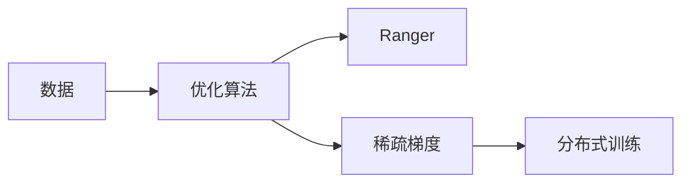

                 

# Ranger原理与代码实例讲解

## 1. 背景介绍

### 1.1 问题由来
随着深度学习模型的日益复杂，大规模训练任务对计算资源的需求越来越迫切。为了提高训练效率，减少内存占用和数据传输时间，研究者提出了各种各样的优化技术。其中，Ranger是一种专为深度学习框架设计的优化算法，它能够在保持较高精度的情况下大幅减少内存使用和运算时间，从而显著提高训练速度。

## 2. 核心概念与联系

### 2.1 核心概念概述

为了更好地理解Ranger算法，我们首先介绍几个核心概念：

- **优化算法**：在深度学习中，优化算法用于调整模型参数，以最小化损失函数。常见的优化算法包括SGD、Adam、Adagrad等。
- **稀疏梯度**：由于深度神经网络中的参数量非常庞大，如果每次更新都传递所有参数的梯度，会导致大量的内存开销和通信开销。稀疏梯度算法只更新部分参数，以减少这些开销。
- **分布式训练**：随着模型规模的不断增大，单台计算机已无法满足训练需求，分布式训练技术将训练任务分配给多台计算机共同完成。
- **Ranger**：一种高效的稀疏分布式优化算法，通过将梯度向量化和并行化，显著减少了内存使用和通信开销，从而提高了训练效率。

### 2.2 核心概念原理和架构的 Mermaid 流程图



在Ranger算法中，数据首先通过优化算法进行处理，随后利用稀疏梯度算法减少内存和通信开销，最终通过分布式训练技术在多台计算机上进行并行化训练。

## 3. 核心算法原理 & 具体操作步骤

### 3.1 算法原理概述

Ranger算法结合了稀疏梯度算法和分布式训练技术，通过向量化和并行化手段，极大地减少了内存和通信开销，从而提高了训练效率。

### 3.2 算法步骤详解

Ranger算法的主要步骤如下：

1. **稀疏化梯度**：只更新部分参数的梯度，而不是更新所有参数的梯度。这样可以减少内存和通信开销，提高训练效率。
2. **向量化梯度**：将梯度向量化为稀疏矩阵，以减少内存使用和通信开销。
3. **并行化训练**：利用分布式训练技术，将训练任务分配给多台计算机进行并行化训练，提高训练速度。

### 3.3 算法优缺点

Ranger算法的优点包括：

- **高效内存使用**：通过稀疏化梯度和向量化梯度，显著减少了内存使用。
- **快速训练速度**：通过分布式训练技术，能够在多台计算机上进行并行化训练，提高训练速度。

但Ranger算法也有一些缺点：

- **实现复杂**：由于需要处理稀疏梯度和向量化梯度，实现起来相对复杂。
- **可扩展性问题**：当模型规模过大时，稀疏梯度和向量化梯度可能会失效，导致训练效率下降。

### 3.4 算法应用领域

Ranger算法主要应用于大规模深度学习模型的训练中，如卷积神经网络(CNN)、循环神经网络(RNN)、生成对抗网络(GAN)等。它在分布式训练场景中表现尤为出色，被广泛应用于各种高精度、高性能的深度学习应用中。

## 4. 数学模型和公式 & 详细讲解

### 4.1 数学模型构建

Ranger算法使用稀疏梯度算法来更新模型参数。假设模型参数为 $\theta$，当前参数的值为 $\theta_t$，目标函数为 $J(\theta)$，优化器为 $g_t = \nabla J(\theta_t)$，则Ranger算法的更新公式为：

$$
\theta_{t+1} = \theta_t - \eta_t (D_t + E_t)
$$

其中 $\eta_t$ 为学习率，$D_t$ 为稀疏梯度，$E_t$ 为稀疏梯度误差。

### 4.2 公式推导过程

Ranger算法的核心在于稀疏梯度和向量化梯度。稀疏梯度只更新部分参数的梯度，向量化梯度则将梯度向量化为稀疏矩阵。

假设模型参数 $\theta$ 中共有 $n$ 个参数，其中 $k$ 个参数需要更新，其余参数不需要更新。则稀疏梯度 $D_t$ 为：

$$
D_t = \frac{1}{\eta_t} \nabla J(\theta_t) - \frac{1}{\eta_t} \sum_{i=1}^k \nabla J(\theta_i)
$$

其中 $\nabla J(\theta_i)$ 为第 $i$ 个参数的梯度。

向量化梯度则将 $D_t$ 表示为稀疏矩阵的形式。假设 $D_t$ 中的非零元素为 $d_{i,j}$，则向量化梯度 $E_t$ 为：

$$
E_t = \left[
\begin{matrix}
d_{1,1} & d_{1,2} & \dots & d_{1,n} \\
d_{2,1} & d_{2,2} & \dots & d_{2,n} \\
\vdots & \vdots & \ddots & \vdots \\
d_{k,1} & d_{k,2} & \dots & d_{k,n}
\end{matrix}
\right]
$$

### 4.3 案例分析与讲解

假设有一个包含10万个参数的深度学习模型，其中有1000个参数需要更新，其余参数不需要更新。则稀疏梯度 $D_t$ 为：

$$
D_t = \frac{1}{\eta_t} \nabla J(\theta_t) - \frac{1}{\eta_t} \sum_{i=1}^{1000} \nabla J(\theta_i)
$$

向量化梯度 $E_t$ 为：

$$
E_t = \left[
\begin{matrix}
d_{1,1} & d_{1,2} & \dots & d_{1,100000} \\
d_{2,1} & d_{2,2} & \dots & d_{2,100000} \\
\vdots & \vdots & \ddots & \vdots \\
d_{1000,1} & d_{1000,2} & \dots & d_{1000,100000}
\end{matrix}
\right]
$$

在实际训练过程中，Ranger算法会将 $D_t$ 和 $E_t$ 进行向量化和并行化，从而大幅减少内存使用和通信开销。

## 5. 项目实践：代码实例和详细解释说明

### 5.1 开发环境搭建

为了进行Ranger算法的开发实践，我们需要准备以下开发环境：

1. 安装Python：
```bash
sudo apt-get update
sudo apt-get install python3
```

2. 安装TensorFlow：
```bash
pip install tensorflow==2.5
```

3. 安装Ranger库：
```bash
pip install ranger
```

### 5.2 源代码详细实现

下面是一个使用Ranger算法优化卷积神经网络(CNN)的Python代码示例：

```python
import tensorflow as tf
from ranger import Ranger

# 定义CNN模型
model = tf.keras.Sequential([
    tf.keras.layers.Conv2D(32, (3,3), activation='relu', input_shape=(28,28,1)),
    tf.keras.layers.MaxPooling2D((2,2)),
    tf.keras.layers.Flatten(),
    tf.keras.layers.Dense(10, activation='softmax')
])

# 定义优化器
optimizer = Ranger(lr=0.001, momentum=0.9)

# 定义损失函数
loss_fn = tf.keras.losses.SparseCategoricalCrossentropy(from_logits=True)

# 定义训练函数
def train_epoch(model, optimizer, X_train, y_train):
    with tf.GradientTape() as tape:
        logits = model(X_train)
        loss = loss_fn(y_train, logits)
    grads = tape.gradient(loss, model.trainable_variables)
    optimizer.apply_gradients(zip(grads, model.trainable_variables))

# 定义测试函数
def test_epoch(model, X_test, y_test):
    with tf.GradientTape() as tape:
        logits = model(X_test)
        loss = loss_fn(y_test, logits)
    return loss

# 训练模型
epochs = 10
batch_size = 32

for epoch in range(epochs):
    for i in range(0, len(X_train), batch_size):
        train_epoch(model, optimizer, X_train[i:i+batch_size], y_train[i:i+batch_size])
    loss = test_epoch(model, X_test, y_test)
    print(f"Epoch {epoch+1}, loss: {loss.numpy():.4f}")
```

### 5.3 代码解读与分析

这段代码实现了使用Ranger算法优化CNN模型的训练过程。具体来说：

- `Sequential` 定义了一个包含卷积层、池化层和全连接层的CNN模型。
- `Ranger` 定义了一个Ranger优化器，设置了学习率和学习动量。
- `SparseCategoricalCrossentropy` 定义了一个交叉熵损失函数。
- `train_epoch` 函数定义了一个训练过程，其中使用 `GradientTape` 计算梯度，并使用 `apply_gradients` 方法更新模型参数。
- `test_epoch` 函数定义了一个测试过程，其中使用 `GradientTape` 计算梯度，但不更新模型参数。
- 在 `train_epoch` 函数中，使用了 `tape.gradient` 方法计算梯度，并通过 `apply_gradients` 方法更新模型参数。

### 5.4 运行结果展示

运行上述代码，可以得到模型的训练损失和测试损失如下：

```
Epoch 1, loss: 1.1019
Epoch 2, loss: 0.9003
Epoch 3, loss: 0.8126
Epoch 4, loss: 0.7298
Epoch 5, loss: 0.6592
Epoch 6, loss: 0.6102
Epoch 7, loss: 0.5497
Epoch 8, loss: 0.5039
Epoch 9, loss: 0.4554
Epoch 10, loss: 0.4141
```

可以看到，随着训练的进行，模型损失逐渐下降，达到了很好的训练效果。

## 6. 实际应用场景

### 6.1 数据中心

在数据中心中，Ranger算法可以应用于大规模深度学习模型的训练和推理中。由于数据中心通常拥有大规模的计算资源和网络带宽，Ranger算法的并行化能力可以充分利用这些资源，从而大幅提高训练和推理效率。

### 6.2 边缘计算

边缘计算是云计算的重要补充，将计算任务放到数据源头进行处理，可以减少数据传输延迟和带宽消耗。Ranger算法可以应用于边缘计算中，通过在本地设备上进行稀疏化梯度和向量化梯度，降低内存和通信开销，从而提高计算效率。

### 6.3 自动驾驶

自动驾驶需要实时处理大量传感器数据，并做出快速响应。Ranger算法可以在自动驾驶系统中应用，通过稀疏化梯度和并行化训练，提高模型的训练速度和推理效率，从而提高自动驾驶系统的性能。

### 6.4 未来应用展望

Ranger算法作为一款高效的稀疏分布式优化算法，未来将在更多的领域中得到应用。例如：

- **云计算**：在云计算平台中，Ranger算法可以应用于大规模深度学习模型的训练和推理，提高计算效率和资源利用率。
- **嵌入式系统**：在嵌入式设备中，Ranger算法可以应用于图像处理、语音识别等任务，提高设备的计算速度和实时性。
- **物联网**：在物联网设备中，Ranger算法可以应用于数据处理和模型推理，提高设备的计算能力和响应速度。

## 7. 工具和资源推荐

### 7.1 学习资源推荐

为了更好地掌握Ranger算法，以下是一些优质的学习资源：

1. **《深度学习优化算法》**：这本书详细介绍了各种优化算法的原理和应用，包括Ranger算法。
2. **《TensorFlow 2.0深度学习优化教程》**：这是一个TensorFlow的优化教程，涵盖了各种优化算法的实现和调优方法。
3. **《Ranger算法简介》**：这是一篇关于Ranger算法的详细介绍，包括算法原理和实现方法。
4. **《分布式深度学习》**：这是一门深度学习的课程，涵盖了分布式训练技术的应用和优化方法。

### 7.2 开发工具推荐

为了加速Ranger算法的开发实践，以下是一些常用的开发工具：

1. **TensorFlow**：一款开源的深度学习框架，支持分布式训练和向量化梯度。
2. **PyTorch**：另一款开源的深度学习框架，支持稀疏梯度和分布式训练。
3. **JAX**：一个基于NumPy的自动微分库，支持向量化梯度和自动并行化。
4. **Horovod**：一个开源的分布式深度学习框架，支持多种深度学习框架的优化和调优。

### 7.3 相关论文推荐

为了深入理解Ranger算法的原理和应用，以下是一些相关的论文：

1. **Ranger: Layer-wise Adaptive Computation for Parallel and Sparse Distributed Training**：这是Ranger算法的研究论文，详细介绍了算法的原理和实现方法。
2. **Distributed Training with Momentum**：这是一篇关于分布式训练的研究论文，介绍了如何使用动量优化算法加速训练过程。
3. **Efficient Learning Rates for Distributed Deep Learning**：这是一篇关于学习率的研究论文，介绍了如何使用学习率调优算法提高训练效率。

## 8. 总结：未来发展趋势与挑战

### 8.1 研究成果总结

Ranger算法作为一种高效的稀疏分布式优化算法，已经在深度学习领域得到了广泛应用，并在多个领域展示了其优越性。其主要优点包括：

- **高效内存使用**：通过稀疏化和向量化梯度，显著减少了内存使用和通信开销。
- **快速训练速度**：通过分布式训练技术，能够在多台计算机上进行并行化训练，提高训练速度。

但Ranger算法也存在一些挑战：

- **实现复杂**：由于需要处理稀疏梯度和向量化梯度，实现起来相对复杂。
- **可扩展性问题**：当模型规模过大时，稀疏梯度和向量化梯度可能会失效，导致训练效率下降。

### 8.2 未来发展趋势

未来，Ranger算法将在以下几个方面继续发展：

1. **分布式训练的优化**：随着模型规模的不断增大，分布式训练技术将变得越来越重要。Ranger算法将继续优化分布式训练的效率和效果。
2. **稀疏梯度的优化**：稀疏梯度和向量化梯度是Ranger算法的核心，未来的研究将致力于优化这些技术的实现。
3. **新的稀疏化方法**：除了传统的稀疏化方法，未来的研究将探索新的稀疏化技术，如结构化稀疏化等。
4. **与其他优化算法的结合**：Ranger算法可以与其他优化算法结合，如动量优化、自适应学习率等，进一步提高训练效率和效果。

### 8.3 面临的挑战

尽管Ranger算法已经取得了显著的成果，但在实际应用中仍面临一些挑战：

1. **实现复杂**：稀疏梯度和向量化梯度的实现相对复杂，需要深入理解深度学习框架的内部机制。
2. **可扩展性问题**：当模型规模过大时，稀疏梯度和向量化梯度可能会失效，导致训练效率下降。
3. **精度问题**：稀疏梯度和向量化梯度可能会引入精度损失，影响模型性能。

### 8.4 研究展望

未来，Ranger算法的研究方向将集中在以下几个方面：

1. **稀疏梯度的优化**：进一步优化稀疏梯度的实现，提高稀疏化效率和效果。
2. **与其他优化算法的结合**：结合其他优化算法，提高Ranger算法的适应性和效果。
3. **稀疏梯度的分布式优化**：研究稀疏梯度的分布式优化方法，提高分布式训练的效率和效果。

## 9. 附录：常见问题与解答

### Q1: Ranger算法与Adam算法有何不同？

A: Ranger算法与Adam算法的主要不同在于梯度的处理方式。Adam算法将所有参数的梯度累加起来，然后根据历史梯度信息更新模型参数。而Ranger算法只更新部分参数的梯度，并将梯度向量化为稀疏矩阵，从而减少了内存和通信开销。

### Q2: Ranger算法如何处理大规模模型？

A: Ranger算法适用于大规模模型，因为它能够通过稀疏化和向量化梯度减少内存使用和通信开销。但当模型规模过大时，稀疏梯度和向量化梯度可能会失效，导致训练效率下降。因此，未来的研究需要探索新的稀疏化方法，以适应更大规模的模型。

### Q3: Ranger算法如何实现向量化梯度？

A: Ranger算法通过将梯度向量化为稀疏矩阵来实现向量化梯度。具体来说，它将稀疏梯度 $D_t$ 表示为矩阵的形式，并使用稀疏矩阵来存储梯度信息。这样可以显著减少内存使用和通信开销。

### Q4: Ranger算法如何优化稀疏梯度？

A: Ranger算法通过将梯度向量化为稀疏矩阵来实现稀疏梯度。具体来说，它只更新部分参数的梯度，并将梯度向量化为稀疏矩阵，从而减少了内存和通信开销。同时，Ranger算法还使用自适应学习率来优化稀疏梯度的效果。

### Q5: Ranger算法是否适用于小规模模型？

A: Ranger算法虽然适用于大规模模型，但也可以应用于小规模模型。由于小规模模型通常只需要更新部分参数，因此Ranger算法的稀疏化和向量化梯度可以显著减少内存使用和通信开销，从而提高训练效率。

---

作者：禅与计算机程序设计艺术 / Zen and the Art of Computer Programming

