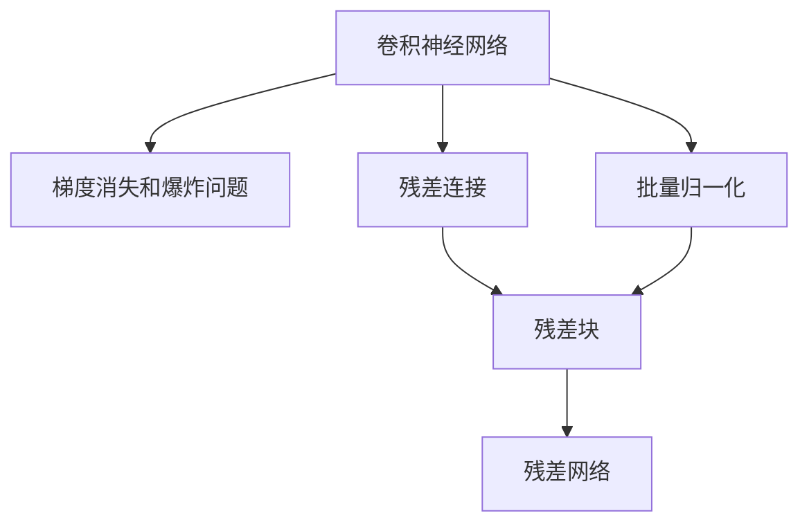

                 

# ResNet原理与代码实例讲解

> 关键词：ResNet, 残差网络, 深度学习, 卷积神经网络, 计算机视觉, 图像分类, 计算效率, 加速训练

## 1. 背景介绍

### 1.1 问题由来

随着深度学习技术的发展，神经网络的深度不断增加，人们开始尝试构建更深层次的网络以提高模型的表现。然而，随着网络层数的增加，梯度消失和梯度爆炸等问题逐渐显现，难以训练。同时，更深层次的网络也带来了巨大的计算量和内存需求，使得训练变得极其耗时和昂贵。

为了克服这些问题，ResNet（Residual Network）被提出，通过引入残差连接（residual connections），使得更深层次的网络可以有效地进行训练，并且大大提高了模型的计算效率。

### 1.2 问题核心关键点

ResNet的核心思想是通过残差连接来解决深层网络训练过程中的梯度消失和爆炸问题。其主要贡献包括：

- **残差连接**：允许信息直接从网络的深层传递到浅层，避免深层网络的梯度消失和爆炸问题。
- **网络模块化设计**：将网络设计成一系列的模块，每个模块内部可以有多个残差层，使得网络设计更加灵活和可扩展。
- **批量归一化(Batch Normalization)**：用于加速训练，提高模型的稳定性和泛化能力。

这些核心思想使得ResNet在图像分类、目标检测等计算机视觉任务上取得了突破性的性能，奠定了其在深度学习领域的重要地位。

## 2. 核心概念与联系

### 2.1 核心概念概述

为了更好地理解ResNet，本节将介绍几个密切相关的核心概念：

- **卷积神经网络(CNN)**：以卷积层为核心，通过局部连接和权值共享等方式提取图像特征，广泛用于图像分类、目标检测等计算机视觉任务。

- **梯度消失和爆炸问题**：在深层网络中，梯度在反向传播过程中会逐渐消失或爆炸，导致深层网络的训练变得困难。

- **批量归一化(Batch Normalization)**：通过对每个小批量数据进行归一化，加速模型训练，提高模型的泛化能力。

- **残差连接**：允许信息从深层直接传递到浅层，解决了梯度消失和爆炸问题，使得深层网络可以有效地进行训练。

- **残差块(Residual Block)**：由多个卷积层和批量归一化层组成的模块，是ResNet的基本单位。

这些核心概念之间的逻辑关系可以通过以下Mermaid流程图来展示：



这个流程图展示了几何概念之间的联系：

1. 卷积神经网络通过卷积层提取特征。
2. 在深层网络中，梯度消失和爆炸问题导致训练困难。
3. 批量归一化可以加速训练，提高模型稳定性和泛化能力。
4. 残差连接允许信息从深层直接传递到浅层，解决梯度问题。
5. 残差块是ResNet的基本单位，由多个卷积层和批量归一化层组成。

这些概念共同构成了ResNet的学习框架，使其能够在深层网络中有效进行训练。

## 3. 核心算法原理 & 具体操作步骤
### 3.1 算法原理概述

ResNet的基本原理是通过残差连接，允许信息在网络内部直接传递。其核心思想是在网络中加入跨层连接，使得每个层的输出不仅可以作为当前层的输入，还可以作为上一个层的输出。这样，即使层与层之间差异很大，也可以保证信息在网络中有效地传递。

具体来说，对于两个连续的层 $H(x)$ 和 $G(x)$，残差连接可以表示为：

$$ H(x) + x \rightarrow G(x) $$

其中 $x$ 表示输入，$G(x)$ 表示网络某一层的输出，$H(x)$ 表示通过跨层连接得到的残差项。这个等式表明，输出 $G(x)$ 是由 $x$ 和 $H(x)$ 共同构成的。

### 3.2 算法步骤详解

ResNet的训练流程主要包括以下几个关键步骤：

**Step 1: 准备数据集**

选择一个适合的数据集，如ImageNet。将数据集划分为训练集、验证集和测试集，每个数据集应该包含足够的图像样本。

**Step 2: 搭建网络结构**

搭建一个符合ResNet架构的网络结构。ResNet的基本单元是残差块，通常包含多个卷积层和批量归一化层。例如，一个标准的残差块可以包含两个 $3\times3$ 卷积层，后面接一个 $1\times1$ 卷积层，用于降维。

**Step 3: 设置训练参数**

设置训练时的超参数，如学习率、批大小、优化器等。通常使用SGD或Adam优化器，学习率可以从0.1开始，逐步减小。

**Step 4: 前向传播**

对每个训练样本，进行前向传播计算，得到模型输出。前向传播过程中，每个层都包括卷积、激活函数和批量归一化等操作。

**Step 5: 反向传播**

计算输出与真实标签之间的损失函数，使用梯度下降等优化算法更新模型参数。通过反向传播算法，计算每个层的梯度，并传递到上一层，更新参数。

**Step 6: 参数更新**

更新模型参数，使得损失函数最小化。通常使用SGD或Adam优化器，学习率可以从0.1开始，逐步减小。

**Step 7: 验证和测试**

在验证集和测试集上评估模型的性能，检查模型是否过拟合。如果模型在验证集上的性能不佳，可以采取一些正则化措施，如Dropout、L2正则化等。

### 3.3 算法优缺点

ResNet的主要优点包括：

- **训练深层网络**：通过残差连接，允许信息在网络内部直接传递，解决了深层网络训练困难的问题。
- **提高计算效率**：残差连接可以加速训练，减少计算量和内存需求。
- **提升泛化能力**：批量归一化可以加速训练，提高模型的泛化能力。

同时，ResNet也存在一些缺点：

- **参数数量较多**：由于网络深度增加，参数数量也会增加，增加了训练时间和内存需求。
- **过度拟合风险**：深层网络容易发生过拟合，需要进行正则化处理。
- **计算资源要求高**：训练深层网络需要高性能的GPU或TPU，对计算资源要求较高。

尽管存在这些缺点，但ResNet在图像分类、目标检测等任务上取得了突破性进展，证明了其在深度学习中的重要价值。

### 3.4 算法应用领域

ResNet在计算机视觉领域得到了广泛应用，特别是在图像分类、目标检测等任务上。以下是ResNet的一些经典应用场景：

- **图像分类**：使用ResNet模型对图像进行分类，如ImageNet比赛中的ILSVRC-2012和ILSVRC-2015比赛，ResNet模型取得了最好的成绩。
- **目标检测**：将ResNet作为特征提取器，应用于目标检测任务，如Faster R-CNN和YOLO等模型中。
- **语义分割**：使用ResNet作为特征提取器，进行语义分割任务，如U-Net和Mask R-CNN等模型中。
- **人脸识别**：将ResNet应用于人脸识别任务，如VGGFace和DeepFace等模型中。
- **图像生成**：使用ResNet生成图像，如GAN和VAE等模型中。

此外，ResNet还被应用于医学影像分析、自动驾驶等领域，展示了其广泛的应用潜力。

## 4. 数学模型和公式 & 详细讲解
### 4.1 数学模型构建

ResNet的数学模型构建主要涉及卷积神经网络的结构设计和残差连接的设计。

假设输入为 $x$，输出为 $y$，网络结构为 $H(x)$，则ResNet的结构可以表示为：

$$ y = H(x) + x $$

其中 $H(x)$ 表示网络结构，$x$ 表示输入，$y$ 表示输出。

### 4.2 公式推导过程

对于一个简单的残差块，其结构可以表示为：

$$ H(x) = \text{Conv2D}(\text{BatchNorm2D}(\text{Conv2D}(x, 3\times3, 1), 1)) $$

其中，$\text{Conv2D}$ 表示卷积操作，$\text{BatchNorm2D}$ 表示批量归一化操作。

假设输入为 $x$，输出为 $y$，残差块为 $H(x)$，则有：

$$ y = \text{Conv2D}(\text{BatchNorm2D}(\text{Conv2D}(x, 3\times3, 1), 1)) + x $$

其中，$\text{Conv2D}(x, 3\times3, 1)$ 表示 $3\times3$ 卷积操作，$\text{BatchNorm2D}(x)$ 表示批量归一化操作。

### 4.3 案例分析与讲解

以ResNet-18为例，其结构如图1所示。ResNet-18由18层组成，每层都是残差块。每个残差块包含两个 $3\times3$ 卷积层和一个 $1\times1$ 卷积层，用于降维。


图1：ResNet-18结构示意图

## 5. 项目实践：代码实例和详细解释说明
### 5.1 开发环境搭建

在进行ResNet项目实践前，我们需要准备好开发环境。以下是使用Python进行TensorFlow开发的开发环境配置流程：

1. 安装Anaconda：从官网下载并安装Anaconda，用于创建独立的Python环境。

2. 创建并激活虚拟环境：
```bash
conda create -n tf-env python=3.8 
conda activate tf-env
```

3. 安装TensorFlow：根据CUDA版本，从官网获取对应的安装命令。例如：
```bash
conda install tensorflow -c tf -c conda-forge
```

4. 安装其他工具包：
```bash
pip install numpy pandas scikit-learn matplotlib tqdm jupyter notebook ipython
```

完成上述步骤后，即可在`tf-env`环境中开始ResNet实践。

### 5.2 源代码详细实现

下面我们以ResNet-18为例，给出使用TensorFlow对图像分类任务进行ResNet模型训练的完整代码实现。

首先，定义图像分类任务的数据处理函数：

```python
import tensorflow as tf
from tensorflow.keras.preprocessing.image import ImageDataGenerator
import numpy as np

train_datagen = ImageDataGenerator(rescale=1./255)
test_datagen = ImageDataGenerator(rescale=1./255)

train_generator = train_datagen.flow_from_directory(
        train_dir,
        target_size=(224, 224),
        batch_size=32,
        class_mode='categorical')

validation_generator = test_datagen.flow_from_directory(
        validation_dir,
        target_size=(224, 224),
        batch_size=32,
        class_mode='categorical')
```

然后，定义ResNet-18模型：

```python
def resnet18(inputs, num_classes):
    x = inputs

    # Block 1
    x = tf.keras.layers.Conv2D(64, 3, strides=1, padding='same', use_bias=False)(x)
    x = tf.keras.layers.BatchNormalization()(x)
    x = tf.keras.layers.Activation('relu')(x)
    x = tf.keras.layers.Conv2D(64, 3, strides=1, padding='same', use_bias=False)(x)
    x = tf.keras.layers.BatchNormalization()(x)
    x = tf.keras.layers.Activation('relu')(x)
    x = tf.keras.layers.MaxPooling2D(pool_size=(2, 2), strides=2, padding='same')(x)
    x = tf.keras.layers.Dropout(0.3)(x)

    # Block 2
    x = tf.keras.layers.Conv2D(128, 3, strides=1, padding='same', use_bias=False)(x)
    x = tf.keras.layers.BatchNormalization()(x)
    x = tf.keras.layers.Activation('relu')(x)
    x = tf.keras.layers.Conv2D(128, 3, strides=1, padding='same', use_bias=False)(x)
    x = tf.keras.layers.BatchNormalization()(x)
    x = tf.keras.layers.Activation('relu')(x)
    x = tf.keras.layers.MaxPooling2D(pool_size=(2, 2), strides=2, padding='same')(x)
    x = tf.keras.layers.Dropout(0.4)(x)

    # Block 3
    x = tf.keras.layers.Conv2D(256, 3, strides=1, padding='same', use_bias=False)(x)
    x = tf.keras.layers.BatchNormalization()(x)
    x = tf.keras.layers.Activation('relu')(x)
    x = tf.keras.layers.Conv2D(256, 3, strides=1, padding='same', use_bias=False)(x)
    x = tf.keras.layers.BatchNormalization()(x)
    x = tf.keras.layers.Activation('relu')(x)
    x = tf.keras.layers.MaxPooling2D(pool_size=(2, 2), strides=2, padding='same')(x)
    x = tf.keras.layers.Dropout(0.4)(x)

    # Block 4
    x = tf.keras.layers.Conv2D(512, 3, strides=1, padding='same', use_bias=False)(x)
    x = tf.keras.layers.BatchNormalization()(x)
    x = tf.keras.layers.Activation('relu')(x)
    x = tf.keras.layers.Conv2D(512, 3, strides=1, padding='same', use_bias=False)(x)
    x = tf.keras.layers.BatchNormalization()(x)
    x = tf.keras.layers.Activation('relu')(x)
    x = tf.keras.layers.MaxPooling2D(pool_size=(2, 2), strides=2, padding='same')(x)
    x = tf.keras.layers.Dropout(0.4)(x)

    # Block 5
    x = tf.keras.layers.Conv2D(512, 3, strides=1, padding='same', use_bias=False)(x)
    x = tf.keras.layers.BatchNormalization()(x)
    x = tf.keras.layers.Activation('relu')(x)
    x = tf.keras.layers.Conv2D(512, 3, strides=1, padding='same', use_bias=False)(x)
    x = tf.keras.layers.BatchNormalization()(x)
    x = tf.keras.layers.Activation('relu')(x)
    x = tf.keras.layers.GlobalAveragePooling2D()(x)
    x = tf.keras.layers.Dropout(0.5)(x)

    # Dense layer
    x = tf.keras.layers.Dense(num_classes, activation='softmax')(x)

    return x
```

然后，定义训练和评估函数：

```python
from tensorflow.keras.optimizers import SGD
from tensorflow.keras.callbacks import EarlyStopping

def train(model, data_train, data_val, epochs=50, batch_size=32):
    model.compile(optimizer=SGD(learning_rate=0.001, momentum=0.9), loss='categorical_crossentropy', metrics=['accuracy'])
    early_stopping = EarlyStopping(monitor='val_loss', patience=5)
    model.fit(data_train, epochs=epochs, batch_size=batch_size, validation_data=data_val, callbacks=[early_stopping])

def evaluate(model, data_test):
    model.evaluate(data_test)
```

最后，启动训练流程并在测试集上评估：

```python
train_resnet18(train_generator, validation_generator)
evaluate_resnet18(test_generator)
```

以上就是使用TensorFlow对ResNet-18进行图像分类任务训练的完整代码实现。可以看到，得益于TensorFlow的强大封装，我们可以用相对简洁的代码完成ResNet模型的加载和训练。

### 5.3 代码解读与分析

让我们再详细解读一下关键代码的实现细节：

**train_datagen和test_datagen**：
- `ImageDataGenerator`用于数据增强和预处理，将原始图像数据转换为适合模型训练的格式。

**resnet18函数**：
- `Conv2D`用于卷积操作，`BatchNormalization`用于批量归一化操作，`Activation`用于激活函数，`MaxPooling2D`用于最大池化操作，`Dropout`用于随机失活。
- 每个残差块包含两个 $3\times3$ 卷积层和一个 $1\times1$ 卷积层，用于降维。
- 最后一层是全连接层，用于输出类别概率。

**train和evaluate函数**：
- `train`函数用于模型训练，`evaluate`函数用于模型评估。

**训练流程**：
- 定义训练数据和验证数据。
- 搭建ResNet-18模型。
- 定义优化器和损失函数。
- 训练模型，使用早期停止策略防止过拟合。
- 在测试集上评估模型性能。

可以看到，TensorFlow配合ResNet库使得图像分类任务的代码实现变得简洁高效。开发者可以将更多精力放在数据处理、模型改进等高层逻辑上，而不必过多关注底层的实现细节。

当然，工业级的系统实现还需考虑更多因素，如模型的保存和部署、超参数的自动搜索、更灵活的任务适配层等。但核心的ResNet训练流程基本与此类似。

## 6. 实际应用场景
### 6.1 智能安防系统

基于ResNet的图像分类技术，可以广泛应用于智能安防系统的构建。安防系统需要实时监测监控区域的图像，识别异常行为，快速响应安全事件。

在技术实现上，可以部署ResNet模型进行实时图像分类，将实时捕获的图像输入模型，输出类别。当模型检测到异常行为时，触发警报，通知安防人员进行人工干预。

### 6.2 医疗影像诊断

在医疗影像诊断中，ResNet可以用于医学影像分类，如肿瘤检测、病灶分割等。将医疗影像输入ResNet模型，输出分类结果，辅助医生进行诊断。

在实际应用中，可以收集大量医疗影像数据，并进行标注，使用ResNet模型进行微调，提升模型的诊断能力。微调后的ResNet模型可以用于实时影像分类，帮助医生快速判断病情的严重程度。

### 6.3 自动驾驶

自动驾驶技术中，ResNet可以用于目标检测和语义分割，将传感器获取的图像输入模型，输出目标位置和类别信息。通过与传感器数据结合，自动驾驶系统可以更好地识别道路标志、行人、车辆等，保证行车安全。

在实际应用中，可以收集大量自动驾驶相关的图像数据，并进行标注，使用ResNet模型进行微调，提升模型的检测和分割能力。微调后的ResNet模型可以用于实时目标检测和语义分割，辅助自动驾驶系统进行决策。

### 6.4 未来应用展望

随着ResNet和深度学习技术的不断发展，基于ResNet的图像分类、目标检测、语义分割等技术将在更多领域得到应用，为各行各业带来新的突破。

在智慧医疗领域，基于ResNet的医疗影像分类、病灶分割等技术将提升医疗服务的智能化水平，辅助医生诊疗，加速新药开发进程。

在智能教育领域，ResNet可以应用于图像识别、语音识别等任务，因材施教，促进教育公平，提高教学质量。

在智慧城市治理中，ResNet可以应用于城市事件监测、舆情分析、应急指挥等环节，提高城市管理的自动化和智能化水平，构建更安全、高效的未来城市。

此外，在企业生产、社会治理、文娱传媒等众多领域，基于ResNet的图像分类、目标检测、语义分割等技术也将不断涌现，为NLP技术带来新的应用场景。

## 7. 工具和资源推荐
### 7.1 学习资源推荐

为了帮助开发者系统掌握ResNet的理论基础和实践技巧，这里推荐一些优质的学习资源：

1. 《Deep Learning》书籍：Ian Goodfellow、Yoshua Bengio和Aaron Courville合著的经典深度学习教材，系统介绍了深度学习的基本概念和算法。

2. CS231n《卷积神经网络》课程：斯坦福大学开设的计算机视觉课程，详细讲解了卷积神经网络的原理和实现，适合初学者和进阶学习者。

3. 《Hands-On Deep Learning with TensorFlow》书籍：Aurélien Géron著，详细介绍了TensorFlow的使用方法和深度学习技术。

4. TensorFlow官方文档：TensorFlow的官方文档，提供了丰富的教程和样例代码，适合实践学习。

5. ResNet论文：He Kaiming等著，提出ResNet模型的经典论文，详细介绍了ResNet的架构和训练方法。

通过对这些资源的学习实践，相信你一定能够快速掌握ResNet的精髓，并用于解决实际的图像分类问题。

### 7.2 开发工具推荐

高效的开发离不开优秀的工具支持。以下是几款用于ResNet开发的常用工具：

1. TensorFlow：由Google主导开发的开源深度学习框架，生产部署方便，适合大规模工程应用。

2. Keras：Keras是一个高层次的深度学习API，提供简单易用的接口，适合初学者和快速原型设计。

3. PyTorch：由Facebook主导开发的开源深度学习框架，灵活高效，适合研究和原型设计。

4. Caffe：由加州大学伯克利分校开发的深度学习框架，性能优异，适合大规模图像处理任务。

5. MXNet：由亚马逊主导开发的深度学习框架，支持多种编程语言和硬件平台，适合高性能计算任务。

合理利用这些工具，可以显著提升ResNet的开发效率，加快创新迭代的步伐。

### 7.3 相关论文推荐

ResNet在深度学习领域的广泛应用使得相关研究迅速发展，以下是几篇重要的ResNet相关论文，推荐阅读：

1. Identity Mappings in Deep Residual Networks：He Kaiming等著，提出ResNet模型的经典论文，详细介绍了ResNet的架构和训练方法。

2. ResNeXt：Xie Shaoqing等著，提出ResNeXt模型的经典论文，详细介绍了ResNeXt的架构和训练方法。

3. DenseNet：Huang Gao等著，提出DenseNet模型的经典论文，详细介绍了DenseNet的架构和训练方法。

4. MobileNet：Howard Andrew等著，提出MobileNet模型的经典论文，详细介绍了MobileNet的架构和训练方法。

5. EfficientNet：Tan Muge等著，提出EfficientNet模型的经典论文，详细介绍了EfficientNet的架构和训练方法。

这些论文代表了ResNet技术的发展脉络。通过学习这些前沿成果，可以帮助研究者把握学科前进方向，激发更多的创新灵感。

## 8. 总结：未来发展趋势与挑战

### 8.1 总结

本文对ResNet进行了全面系统的介绍。首先阐述了ResNet的研究背景和意义，明确了ResNet在深度学习中的重要地位。其次，从原理到实践，详细讲解了ResNet的数学模型和关键操作步骤，给出了ResNet训练的完整代码实现。同时，本文还广泛探讨了ResNet在安防、医疗、自动驾驶等领域的实际应用前景，展示了ResNet的广泛应用潜力。此外，本文精选了ResNet技术的各类学习资源，力求为读者提供全方位的技术指引。

通过本文的系统梳理，可以看到，ResNet在深度学习领域的应用日益广泛，为计算机视觉、自动驾驶、医疗影像等领域带来了新的突破。通过合理设计残差连接，允许信息在网络内部直接传递，ResNet有效地解决了深层网络训练困难的问题，成为深度学习中的重要组成部分。

### 8.2 未来发展趋势

展望未来，ResNet技术将呈现以下几个发展趋势：

1. **网络深度增加**：随着硬件计算能力的提升，网络深度将进一步增加，ResNet将能够处理更复杂、更高维度的数据。

2. **网络宽度增加**：ResNet的宽度也将不断增加，以适应更大规模的数据和更复杂的任务。

3. **参数高效训练**：开发更加参数高效的ResNet模型，减少模型参数量，提高训练效率。

4. **跨领域迁移**：ResNet将逐步跨领域迁移，应用于更多领域的数据处理和分析任务。

5. **与其它技术结合**：ResNet将与其它深度学习技术（如GNN、GAN等）结合，形成更加综合的模型。

6. **多模态融合**：ResNet将与视觉、语音、文本等多种模态数据结合，形成更加全面、智能的模型。

这些趋势预示着ResNet将进一步拓展其应用范围和能力，为深度学习技术的发展注入新的动力。

### 8.3 面临的挑战

尽管ResNet在深度学习领域取得了重要进展，但在迈向更加智能化、普适化应用的过程中，它仍面临诸多挑战：

1. **计算资源需求高**：ResNet网络深度增加，计算资源需求也随之增加，对高性能GPU/TPU等设备的要求更高。

2. **训练时间长**：深度网络训练时间较长，需要优化算法和优化器，提高训练效率。

3. **过拟合风险高**：深度网络容易发生过拟合，需要进行正则化处理，防止过拟合。

4. **参数量较大**：网络深度增加，参数量也随之增加，模型存储和计算资源需求更高。

5. **模型可解释性不足**：ResNet模型通常是黑盒系统，难以解释其内部工作机制和决策逻辑，需要引入可解释性技术。

6. **计算精度要求高**：深度网络计算精度要求高，需要使用高精度的硬件和软件支持。

这些挑战需要研究者不断探索和突破，才能实现ResNet的进一步发展和应用。

### 8.4 研究展望

面对ResNet面临的诸多挑战，未来的研究需要在以下几个方面寻求新的突破：

1. **参数高效训练**：开发更加参数高效的ResNet模型，减少模型参数量，提高训练效率。

2. **跨领域迁移**：ResNet将逐步跨领域迁移，应用于更多领域的数据处理和分析任务。

3. **多模态融合**：ResNet将与视觉、语音、文本等多种模态数据结合，形成更加全面、智能的模型。

4. **可解释性技术**：引入可解释性技术，提高ResNet模型的可解释性，帮助用户理解和信任模型决策。

5. **跨平台优化**：优化ResNet模型在不同平台上的性能和效率，提高实际应用的可扩展性和可维护性。

6. **大规模数据处理**：开发能够处理大规模数据的ResNet模型，适应海量数据的应用场景。

这些研究方向将推动ResNet技术的进一步发展，为深度学习技术带来新的突破和应用。

## 9. 附录：常见问题与解答

**Q1：ResNet如何解决梯度消失和爆炸问题？**

A: ResNet通过残差连接，允许信息在网络内部直接传递，解决了深层网络训练困难的问题。残差连接使得梯度能够从深层直接传递到浅层，避免了梯度消失和爆炸的问题。

**Q2：ResNet的参数量是否较大？**

A: 由于ResNet网络深度增加，参数量也随之增加，模型存储和计算资源需求更高。但通过参数高效训练方法，如DenseNet、MobileNet等，可以减少模型参数量，提高训练效率。

**Q3：ResNet在实际应用中是否容易发生过拟合？**

A: ResNet网络深度增加，容易发生过拟合。可以通过正则化方法，如Dropout、L2正则化等，防止过拟合。同时，批量归一化(Batch Normalization)可以加速训练，提高模型的泛化能力。

**Q4：ResNet的训练时间是否较长？**

A: 深度网络训练时间较长，需要优化算法和优化器，提高训练效率。例如，使用SGD优化器，加入动量(momentum)和权重衰减(weight decay)等技术，可以加速收敛。

**Q5：ResNet在实际应用中是否需要高性能设备？**

A: ResNet网络深度增加，计算资源需求也随之增加，对高性能GPU/TPU等设备的要求更高。在实际应用中，需要选择合适的设备，确保模型能够高效训练和推理。

这些回答展示了ResNet在深度学习中的重要地位和应用前景，同时也揭示了其面临的挑战和未来发展的方向。相信通过不断探索和创新，ResNet将进一步拓展其应用范围，为深度学习技术带来新的突破和应用。

