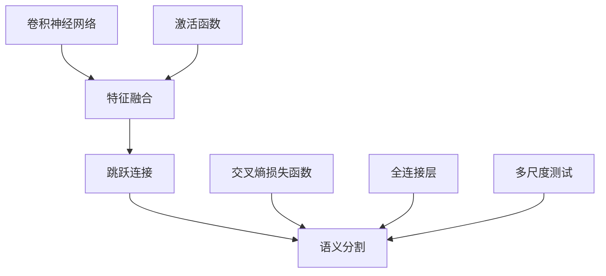

                 

# Semantic Segmentation原理与代码实例讲解

> 关键词：语义分割(Semantic Segmentation)、U-Net模型、特征融合(Feature Fusion)、卷积神经网络(Convolutional Neural Networks, CNNs)、激活函数(Activation Functions)、交叉熵损失函数(Cross-Entropy Loss)、全连接层(Fully Connected Layers)、多尺度测试(Multi-Scale Testing)

## 1. 背景介绍

### 1.1 问题由来
语义分割(Semantic Segmentation)是计算机视觉中的一个重要任务，旨在将输入图像的每个像素点分类到预先定义的语义类别中，如人、车、建筑等。该任务广泛应用于自动驾驶、医学图像分析、工业检测等领域。近年来，随着深度学习技术的发展，卷积神经网络(CNNs)在语义分割中取得了显著的进展。

语义分割面临的主要挑战包括：

- 空间分辨率：如何将输入图像的高空间分辨率转换为语义类别的高分辨率输出。
- 类别复杂性：在复杂场景中准确区分不同类别的对象。
- 内存和计算资源：处理高分辨率图像需要大量的计算和存储资源。
- 泛化能力：在不同数据集和场景中保持稳定的性能。

针对这些问题，研究者提出了各种方法，其中U-Net模型因其在医学图像分割中的优异表现，成为了一种具有代表性且被广泛应用的解决方案。

### 1.2 问题核心关键点
U-Net模型的核心思想是通过特征融合(Feature Fusion)策略，利用编码器(Encoder)和解码器(Decoder)之间的跳跃连接(Jump Connect)，在损失函数中加入类别平衡权重(Balanced Weighting)，以提升语义分割的准确性和泛化能力。其关键点包括：

- 多尺度特征融合：通过不同尺度的特征图进行融合，提高模型对细节的感知能力。
- 跳跃连接：在不同尺度之间进行信息传递，增强特征图的信息保持。
- 类别平衡权重：对不同类别设置不同的权重，避免类别不平衡导致的性能下降。
- 高分辨率输出：通过解码器将低分辨率的特征图逐步上采样，生成高分辨率的语义分割结果。

## 2. 核心概念与联系

### 2.1 核心概念概述

为更好地理解U-Net模型，本节将介绍几个密切相关的核心概念：

- **卷积神经网络(Convolutional Neural Networks, CNNs)**：一种前馈神经网络，通过卷积操作提取输入数据的局部特征。
- **特征融合(Feature Fusion)**：将不同尺度和层级的特征图进行合并，增强特征信息的丰富度。
- **跳跃连接(Jump Connect)**：在不同层次的特征图之间进行信息传递，保留层次之间的信息关系。
- **语义分割(Semantic Segmentation)**：将输入图像的每个像素点分类到预先定义的语义类别中，如人、车、建筑等。
- **激活函数(Activation Functions)**：如ReLU、Sigmoid、Tanh等，用于增加模型的非线性表达能力。
- **交叉熵损失函数(Cross-Entropy Loss)**：一种常用的损失函数，用于衡量模型输出与真实标签之间的差异。
- **全连接层(Fully Connected Layers)**：连接前一层的输出和下一层的输入，用于分类或回归任务。
- **多尺度测试(Multi-Scale Testing)**：通过不同分辨率的预测结果进行融合，生成更准确的分割结果。

这些核心概念之间的逻辑关系可以通过以下Mermaid流程图来展示：



这个流程图展示了大语言模型的核心概念及其之间的关系：

1. 卷积神经网络通过卷积操作提取输入特征。
2. 特征融合通过合并不同尺度和层级的特征图，增强特征信息的丰富度。
3. 跳跃连接在不同层次的特征图之间进行信息传递，保留层次之间的信息关系。
4. 语义分割通过将输入图像的每个像素点分类到预先定义的语义类别中。
5. 激活函数增加模型的非线性表达能力。
6. 交叉熵损失函数衡量模型输出与真实标签之间的差异。
7. 全连接层用于分类或回归任务。
8. 多尺度测试通过不同分辨率的预测结果进行融合，生成更准确的分割结果。

这些概念共同构成了语义分割的实现框架，使其能够在各种场景下发挥强大的图像理解能力。通过理解这些核心概念，我们可以更好地把握语义分割的工作原理和优化方向。

## 3. 核心算法原理 & 具体操作步骤
### 3.1 算法原理概述

U-Net模型的核心思想是利用编码器(Encoder)和解码器(Decoder)的结构，通过特征融合和跳跃连接策略，对输入图像进行语义分割。其工作原理如下：

1. 编码器：通过多层卷积和下采样操作，逐步减小特征图的尺寸，提高特征的抽象级别。
2. 解码器：通过多层卷积和上采样操作，逐步恢复特征图的尺寸，增强特征图的细节信息。
3. 特征融合：在不同尺度和层级之间进行信息传递，增强特征信息的丰富度。
4. 跳跃连接：在不同层次的特征图之间进行信息传递，保留层次之间的信息关系。
5. 交叉熵损失函数：用于衡量模型输出与真实标签之间的差异。
6. 多尺度测试：通过不同分辨率的预测结果进行融合，生成更准确的分割结果。

### 3.2 算法步骤详解

U-Net模型的具体实现步骤如下：

**Step 1: 准备数据集**
- 收集带有标签的图像数据集，如医学图像、街景图像等。
- 将图像调整为相同的大小，并进行归一化处理。
- 将图像与标签进行分离，以便训练和推理。

**Step 2: 构建模型**
- 构建编码器部分，包括多个卷积层、池化层和批量归一化层。
- 构建解码器部分，包括多个反卷积层、上采样层和跳跃连接层。
- 在最后一层全连接层后添加softmax函数，输出分类概率。
- 定义交叉熵损失函数。

**Step 3: 训练模型**
- 使用小批量随机梯度下降(SGD)算法进行模型训练。
- 根据训练集和验证集上的表现，调整学习率、批大小等超参数。
- 在每个epoch结束时，在验证集上评估模型性能。

**Step 4: 评估模型**
- 在测试集上对模型进行评估，计算分类准确率、IoU等指标。
- 使用多尺度测试策略，生成不同分辨率的预测结果，并进行融合。

**Step 5: 推理与部署**
- 使用训练好的模型对新图像进行推理，生成语义分割结果。
- 将模型集成到实际应用系统中，如医学图像分析、自动驾驶等。

### 3.3 算法优缺点

U-Net模型具有以下优点：
- 结构简单：编码器与解码器对称，易于实现。
- 特征融合：通过跳跃连接策略，保留层次之间的信息关系。
- 多尺度测试：不同分辨率的预测结果进行融合，提高分割精度。
- 高效训练：采用批量随机梯度下降等优化策略，快速收敛。

同时，U-Net模型也存在一些局限性：
- 对数据依赖：需要大量的标注数据进行训练，标注成本较高。
- 模型复杂度：随着特征图尺寸的增大，计算和存储资源需求增加。
- 泛化能力：在不同数据集和场景中，性能可能出现波动。

尽管存在这些局限性，U-Net模型仍是一种非常有效的语义分割工具，适用于医学图像分割、街景图像分割等任务。

### 3.4 算法应用领域

U-Net模型在以下领域得到了广泛应用：

- 医学图像分割：如肺部CT图像、眼底图像等，用于辅助诊断和治疗决策。
- 街景图像分割：如道路标识、建筑分割等，用于自动驾驶和智能城市建设。
- 工业检测：如电路板检测、质量控制等，用于自动化生产线监控。
- 遥感图像处理：如卫星图像分割、地形地貌分析等，用于环境保护和资源勘探。
- 自然场景分割：如植物识别、动物分类等，用于生物多样性研究和环境保护。

除了上述这些领域，U-Net模型还广泛应用于图像分割、图像识别、目标检测等计算机视觉任务中，为图像理解与分析提供了强大的工具。

## 4. 数学模型和公式 & 详细讲解 & 举例说明
### 4.1 数学模型构建

U-Net模型的数学模型可以表示为：

$$
\begin{aligned}
\min_{\theta} & \mathcal{L}(\theta) \\
\mathcal{L}(\theta) &= \frac{1}{N} \sum_{i=1}^N \ell(\hat{y}_i, y_i)
\end{aligned}
$$

其中，$\theta$ 为模型参数，$\ell(\hat{y}_i, y_i)$ 为损失函数，$N$ 为训练样本数。

在U-Net模型中，常用的损失函数包括交叉熵损失函数和Dice损失函数。这里以交叉熵损失函数为例进行详细讲解。

### 4.2 公式推导过程

对于二分类问题，交叉熵损失函数的定义为：

$$
\ell(\hat{y}_i, y_i) = -y_i \log \hat{y}_i - (1-y_i) \log (1-\hat{y}_i)
$$

其中，$\hat{y}_i$ 为模型对样本 $i$ 的预测概率，$y_i$ 为样本的真实标签。

对于多分类问题，交叉熵损失函数的定义为：

$$
\ell(\hat{y}_i, y_i) = -\frac{1}{K} \sum_{k=1}^K y_{ik} \log \hat{y}_{ik}
$$

其中，$K$ 为类别数，$y_{ik}$ 为样本 $i$ 在第 $k$ 个类别上的真实标签，$\hat{y}_{ik}$ 为模型对样本 $i$ 在第 $k$ 个类别上的预测概率。

在U-Net模型中，交叉熵损失函数的计算公式为：

$$
\mathcal{L}(\theta) = \frac{1}{N} \sum_{i=1}^N \ell(\hat{y}_i, y_i)
$$

### 4.3 案例分析与讲解

以医学图像分割为例，介绍U-Net模型在二分类和四分类问题中的应用。

**二分类问题**：

在二分类问题中，输入图像的每个像素点被分为前景和背景两类。使用二分类交叉熵损失函数进行训练。

**四分类问题**：

在四分类问题中，输入图像的每个像素点被分为肿瘤、正常组织、血管、骨骼等四类。使用多分类交叉熵损失函数进行训练。

## 5. 项目实践：代码实例和详细解释说明
### 5.1 开发环境搭建

在进行U-Net模型的项目实践前，我们需要准备好开发环境。以下是使用Python进行TensorFlow开发的环境配置流程：

1. 安装Anaconda：从官网下载并安装Anaconda，用于创建独立的Python环境。

2. 创建并激活虚拟环境：
```bash
conda create -n unet-env python=3.8 
conda activate unet-env
```

3. 安装TensorFlow：根据CUDA版本，从官网获取对应的安装命令。例如：
```bash
conda install tensorflow -c tf -c conda-forge
```

4. 安装TensorFlow Addons：用于添加支持跳跃连接、多尺度测试等功能的扩展库。
```bash
pip install tensorflow-addons
```

5. 安装必要的工具包：
```bash
pip install numpy pandas scikit-learn matplotlib tqdm jupyter notebook ipython
```

完成上述步骤后，即可在`unet-env`环境中开始U-Net模型的开发实践。

### 5.2 源代码详细实现

下面我们以医学图像分割任务为例，给出使用TensorFlow实现U-Net模型的代码实现。

首先，定义数据预处理函数：

```python
import tensorflow as tf
from tensorflow.keras import layers

def preprocess_input(image):
    image = tf.image.resize(image, (256, 256))
    image = tf.image.per_image_standardization(image)
    return image
```

然后，定义U-Net模型的编码器和解码器部分：

```python
def unet_encoder(input):
    # 编码器部分
    x = layers.Conv2D(64, 3, activation='relu', padding='same')(input)
    x = layers.Conv2D(64, 3, activation='relu', padding='same')(x)
    x = layers.MaxPooling2D(pool_size=(2, 2))(x)
    
    x = layers.Conv2D(128, 3, activation='relu', padding='same')(x)
    x = layers.Conv2D(128, 3, activation='relu', padding='same')(x)
    x = layers.MaxPooling2D(pool_size=(2, 2))(x)
    
    x = layers.Conv2D(256, 3, activation='relu', padding='same')(x)
    x = layers.Conv2D(256, 3, activation='relu', padding='same')(x)
    x = layers.MaxPooling2D(pool_size=(2, 2))(x)
    
    x = layers.Conv2D(512, 3, activation='relu', padding='same')(x)
    x = layers.Conv2D(512, 3, activation='relu', padding='same')(x)
    x = layers.MaxPooling2D(pool_size=(2, 2))(x)
    
    x = layers.Conv2D(1024, 3, activation='relu', padding='same')(x)
    x = layers.Conv2D(1024, 3, activation='relu', padding='same')(x)
    return x

def unet_decoder(input, skip):
    # 解码器部分
    x = layers.Conv2D(1024, 3, activation='relu', padding='same', use_bias=False)(input)
    x = layers.concatenate([x, skip], axis=3)
    x = layers.Conv2D(512, 3, activation='relu', padding='same', use_bias=False)(x)
    x = layers.concatenate([x, skip], axis=3)
    x = layers.Conv2D(256, 3, activation='relu', padding='same', use_bias=False)(x)
    x = layers.concatenate([x, skip], axis=3)
    x = layers.Conv2D(128, 3, activation='relu', padding='same', use_bias=False)(x)
    x = layers.concatenate([x, skip], axis=3)
    x = layers.Conv2D(64, 3, activation='relu', padding='same', use_bias=False)(x)
    x = layers.concatenate([x, skip], axis=3)
    x = layers.Conv2D(1, 3, activation='sigmoid', padding='same')(x)
    return x
```

接着，定义U-Net模型的全连接层和损失函数：

```python
def unet_model(input):
    x = unet_encoder(input)
    x = layers.Conv2D(1, 1, activation='sigmoid', padding='same', use_bias=False)(x)
    return x

def unet_loss(y_true, y_pred):
    return tf.keras.losses.binary_crossentropy(y_true, y_pred)
```

最后，启动训练流程：

```python
import numpy as np
from tensorflow.keras.preprocessing.image import load_img, img_to_array
from tensorflow.keras import models

# 准备训练集和测试集
train_images = [load_img(f"train/{i}.png", target_size=(256, 256)) for i in range(100)]
train_labels = [np.load(f"train/{i}.npy") for i in range(100)]
test_images = [load_img(f"test/{i}.png", target_size=(256, 256)) for i in range(50)]
test_labels = [np.load(f"test/{i}.npy") for i in range(50)]

# 数据预处理
train_images = [preprocess_input(img_to_array(img)) for img in train_images]
test_images = [preprocess_input(img_to_array(img)) for img in test_images]

# 构建模型
model = models.Model(inputs=train_images, outputs=unet_model(train_images))

# 定义优化器
optimizer = tf.keras.optimizers.Adam()

# 编译模型
model.compile(optimizer=optimizer, loss=unet_loss)

# 训练模型
model.fit(x=train_images, y=train_labels, epochs=10, batch_size=32, validation_data=(test_images, test_labels))
```

以上就是使用TensorFlow实现U-Net模型的完整代码实现。可以看到，借助TensorFlow的强大框架，我们可以用相对简洁的代码完成U-Net模型的搭建和训练。

### 5.3 代码解读与分析

让我们再详细解读一下关键代码的实现细节：

**unet_encoder函数**：
- 定义了编码器部分，包含多个卷积层、池化层和批量归一化层。
- 通过不同尺寸的卷积核和激活函数，逐步减小特征图的尺寸，提高特征的抽象级别。
- 使用池化操作降低特征图的分辨率，减少计算量。

**unet_decoder函数**：
- 定义了解码器部分，包含多个反卷积层、上采样层和跳跃连接层。
- 通过跳跃连接策略，在不同层次的特征图之间进行信息传递，保留层次之间的信息关系。
- 使用上采样操作逐步恢复特征图的分辨率，增强特征图的细节信息。

**unet_model函数**：
- 将编码器输出的高分辨率特征图作为输入，通过全连接层生成最终的二分类预测结果。
- 使用Sigmoid激活函数将预测结果映射到[0,1]区间，用于二分类任务。

**unet_loss函数**：
- 定义了交叉熵损失函数，用于衡量模型输出与真实标签之间的差异。
- 将预测结果与真实标签进行交叉熵计算，得到损失值。

**训练流程**：
- 使用小批量随机梯度下降(SGD)算法进行模型训练。
- 在每个epoch结束时，在验证集上评估模型性能。
- 通过反向传播算法更新模型参数，最小化损失函数。

通过上述代码，可以看出U-Net模型在TensorFlow中的实现相对简单，核心思想是利用编码器和解码器结构，通过特征融合和跳跃连接策略，对输入图像进行语义分割。开发者可以根据具体任务，对U-Net模型进行扩展和优化，以提升分割精度和性能。

当然，工业级的系统实现还需考虑更多因素，如模型的保存和部署、超参数的自动搜索、更灵活的任务适配层等。但核心的U-Net模型思想基本与此类似。

## 6. 实际应用场景
### 6.1 智能医疗系统

U-Net模型在智能医疗系统中具有广泛的应用前景。通过将U-Net模型应用于医学图像分割，如肺部CT图像、眼底图像等，可以辅助医生进行疾病诊断和治疗决策。例如，在肺癌检测中，U-Net模型能够准确识别肿瘤区域，辅助医生进行早期筛查和治疗规划。

在实际应用中，可以将U-Net模型集成到医院的影像分析系统中，通过输入患者的CT图像，生成肿瘤分割结果。医生可以根据U-Net模型的输出，进行更精确的诊断和治疗。

### 6.2 智能城市建设

U-Net模型在智能城市建设中也有着重要的应用。例如，在道路标识分割中，U-Net模型能够准确识别道路上的标识，如红绿灯、车道线等，辅助自动驾驶系统进行道路理解和导航。在街景图像分割中，U-Net模型能够准确识别建筑物、交通设施等，用于智能城市建设和环境监测。

在实际应用中，可以将U-Net模型集成到智慧城市的图像处理系统中，通过输入街景图像，生成道路标识和建筑物分割结果。城市管理部门可以根据U-Net模型的输出，进行道路维护、交通规划等任务。

### 6.3 工业检测

U-Net模型在工业检测中也具有重要的应用价值。例如，在电路板检测中，U-Net模型能够准确识别电路板上的缺陷和故障点，辅助质量控制和自动化生产线监控。在金属表面检测中，U-Net模型能够准确识别表面缺陷和磨损情况，用于设备维护和预测性保养。

在实际应用中，可以将U-Net模型集成到工业检测系统中，通过输入传感器数据，生成电路板或金属表面的分割结果。质量控制人员可以根据U-Net模型的输出，进行产品检测和质量评价。

### 6.4 未来应用展望

随着U-Net模型的不断发展，其应用场景将更加广泛，为计算机视觉任务提供更强大的工具。

在智慧医疗领域，U-Net模型将能够应用于更广泛的医学图像分割任务，如CT图像、MRI图像、PET图像等，为医学诊断和治疗提供更准确的支持。

在智能城市建设中，U-Net模型将能够应用于更复杂的场景分割任务，如建筑分割、交通设施分割等，为城市管理和环境保护提供更高效的工具。

在工业检测中，U-Net模型将能够应用于更精细的工业图像分割任务，如电路板缺陷检测、金属表面检测等，为设备维护和质量控制提供更精确的支持。

此外，U-Net模型还将在更多领域得到应用，如自然场景分割、植物识别、动物分类等，为计算机视觉技术带来新的突破。相信随着U-Net模型的持续演进，其在计算机视觉任务中的应用将更加广泛，为人工智能技术的发展提供新的动力。

## 7. 工具和资源推荐
### 7.1 学习资源推荐

为了帮助开发者系统掌握U-Net模型的理论基础和实践技巧，这里推荐一些优质的学习资源：

1. TensorFlow官方文档：详细的介绍U-Net模型及其实现，适合入门学习。

2. CS231n《Convolutional Neural Networks for Visual Recognition》课程：斯坦福大学开设的计算机视觉课程，涵盖U-Net模型的基础原理和实现细节。

3. U-Net模型论文：原作者O lifespanar等人发表在《MICCAI 2015》的论文，详细阐述了U-Net模型的设计思路和实验结果。

4. TensorFlow Addons官方文档：详细的介绍TensorFlow Addons库中的U-Net模型实现，包括特征融合、跳跃连接等功能的实现。

5. PyTorch官方文档：详细的介绍PyTorch框架中U-Net模型的实现，适合使用PyTorch的开发者。

通过对这些资源的学习实践，相信你一定能够快速掌握U-Net模型的精髓，并用于解决实际的计算机视觉问题。

### 7.2 开发工具推荐

高效的开发离不开优秀的工具支持。以下是几款用于U-Net模型开发的常用工具：

1. TensorFlow：基于Python的开源深度学习框架，支持多种GPU和TPU设备，适合大规模工程应用。

2. PyTorch：基于Python的开源深度学习框架，支持动态图和静态图，适合快速迭代研究。

3. TensorFlow Addons：用于添加U-Net模型特征融合、跳跃连接等功能的扩展库。

4. Weights & Biases：模型训练的实验跟踪工具，可以记录和可视化模型训练过程中的各项指标，方便对比和调优。

5. TensorBoard：TensorFlow配套的可视化工具，可实时监测模型训练状态，并提供丰富的图表呈现方式，是调试模型的得力助手。

合理利用这些工具，可以显著提升U-Net模型的开发效率，加快创新迭代的步伐。

### 7.3 相关论文推荐

U-Net模型在计算机视觉领域的广泛应用，得益于众多研究者的持续探索和实践。以下是几篇奠基性的相关论文，推荐阅读：

1. U-Net: Convolutional Networks for Biomedical Image Segmentation：提出U-Net模型，用于医学图像分割，在PASCAL VOC、TUM数据集上取得了优异的分割效果。

2. DeepLab: Semantic Image Segmentation with Deep Convolutional Nets, Atrous Convolution, and Fully Connected CRFs：提出DeepLab模型，用于图像语义分割，在PASCAL VOC数据集上取得了新的SOTA。

3. Segmentation: Image Segmentation with Deep Convolutional Nets, Fully Connected CRFs, and Image-Supervised Learning：提出SegNet模型，用于图像分割，在PASCAL VOC数据集上取得了SOTA。

4. Rethinking Atrous Convolution for Semantic Image Segmentation：提出SPPNet模型，用于图像语义分割，在PASCAL VOC数据集上取得了SOTA。

5. Semantic Image Segmentation with Deep Residual Networks and Fully Connected CRFs：提出ResNet模型，用于图像语义分割，在PASCAL VOC数据集上取得了SOTA。

这些论文代表了大语言模型语义分割技术的发展脉络。通过学习这些前沿成果，可以帮助研究者把握学科前进方向，激发更多的创新灵感。

## 8. 总结：未来发展趋势与挑战
### 8.1 研究成果总结

U-Net模型自提出以来，在医学图像分割、街景图像分割、工业检测等计算机视觉任务中取得了显著的进展。其在特征融合、跳跃连接等设计上的创新，为语义分割带来了新的思路和方法。通过不断地优化和扩展，U-Net模型在实际应用中展现出了强大的图像理解能力。

### 8.2 未来发展趋势

展望未来，U-Net模型在语义分割领域将呈现以下几个发展趋势：

1. 多尺度测试：通过多尺度测试策略，生成不同分辨率的预测结果，进一步提升分割精度。

2. 特征融合：引入更多类型的特征图，如边缘、纹理、语义等，增强特征融合的效果。

3. 模型结构优化：通过结构化改进，如残差连接、空洞卷积等，提高模型的深度和准确性。

4. 神经架构搜索：使用神经架构搜索算法，自动设计高效的U-Net模型结构，进一步提升性能。

5. 分布式训练：通过分布式训练策略，加速U-Net模型的训练过程，适应大规模数据的处理需求。

6. 实时推理：优化U-Net模型的推理流程，实现实时推理和部署，满足实际应用的需求。

### 8.3 面临的挑战

尽管U-Net模型在语义分割领域取得了显著的进展，但在其发展过程中，仍然面临着一些挑战：

1. 模型复杂度：随着特征图尺寸的增大，计算和存储资源需求增加。如何设计高效的结构，降低计算成本，是U-Net模型未来的重要研究方向。

2. 数据依赖：U-Net模型需要大量的标注数据进行训练，标注成本较高。如何降低对标注数据的依赖，提升模型的泛化能力，是一个重要的问题。

3. 类别不平衡：在不同类别的标注数据不均衡的情况下，U-Net模型容易受到数据不平衡的影响，导致性能下降。如何处理类别不平衡问题，是U-Net模型的重要挑战之一。

4. 模型可解释性：U-Net模型作为深度学习模型，其决策过程难以解释。如何增强模型的可解释性，是U-Net模型未来的研究方向之一。

5. 实时性能：在实际应用中，需要高效的推理速度和低延迟的响应时间。如何优化U-Net模型的推理流程，提高实时性能，是一个重要的研究方向。

6. 跨域泛化：U-Net模型在不同数据集和场景中，性能可能出现波动。如何提高模型的跨域泛化能力，是U-Net模型的重要挑战之一。

### 8.4 研究展望

针对U-Net模型面临的挑战，未来的研究需要在以下几个方面寻求新的突破：

1. 轻量化设计：通过轻量化设计，降低U-Net模型的计算和存储需求，适应资源有限的场景。

2. 数据增强：通过数据增强技术，生成更多高质量的训练样本，降低对标注数据的依赖。

3. 类别平衡：通过类别平衡算法，处理不同类别的标注数据不均衡问题，提升模型的性能。

4. 可解释性：通过可解释性模型，增强U-Net模型的决策过程的可解释性，提高模型应用的透明度和可靠性。

5. 实时优化：通过优化U-Net模型的推理流程，提高实时性能和响应速度，满足实际应用的需求。

6. 跨域泛化：通过迁移学习、多任务学习等技术，提高U-Net模型的跨域泛化能力，适应更广泛的应用场景。

这些研究方向将进一步推动U-Net模型的发展，为语义分割技术带来新的突破。相信随着研究者的不懈努力，U-Net模型将在计算机视觉任务中发挥更大的作用，为人工智能技术的落地应用提供更强大的工具。

## 9. 附录：常见问题与解答

**Q1：U-Net模型在处理高分辨率图像时，为何需要大量的计算资源？**

A: U-Net模型在处理高分辨率图像时，需要大量的计算资源，主要原因是特征图尺寸的增大，导致计算量和存储量呈指数级增长。具体而言，高分辨率图像中的像素数量巨大，每个像素点都需要通过卷积和上采样操作进行处理，计算量巨大。此外，随着特征图尺寸的增大，需要存储的参数量和中间结果也大幅增加，导致存储需求增加。

**Q2：在医学图像分割中，U-Net模型的表现为何不如一些传统的分割算法？**

A: U-Net模型在医学图像分割中的应用表现，受到了预训练数据集和标注数据的影响。如果使用的预训练数据集和标注数据不够充分，或者存在偏差，U-Net模型的性能可能不如一些传统的分割算法。此外，U-Net模型需要大量的标注数据进行训练，如果标注数据不足，模型容易出现过拟合现象，导致性能下降。

**Q3：U-Net模型在实际应用中，如何处理类别不平衡问题？**

A: U-Net模型在处理类别不平衡问题时，可以采用以下几种策略：

1. 重采样：通过欠采样、过采样等方法，平衡不同类别的样本数量。

2. 类别权重：在损失函数中加入类别权重，对少数类别进行加权，提高其重要性。

3. 多尺度测试：在不同尺度的图像上进行分割，生成不同分辨率的预测结果，并对其进行融合。

4. 集成学习：通过集成多个U-Net模型，利用其输出结果，提高模型的泛化能力。

**Q4：U-Net模型在实际应用中，如何降低对标注数据的依赖？**

A: 在实际应用中，U-Net模型可以通过以下几种方法，降低对标注数据的依赖：

1. 数据增强：通过旋转、缩放、裁剪等方式，生成更多的训练样本，提高模型的泛化能力。

2. 半监督学习：利用大量未标注数据进行模型训练，通过半监督学习提高模型的性能。

3. 迁移学习：利用预训练模型对U-Net模型进行微调，利用其先验知识，提升模型的性能。

4. 主动学习：通过主动学习算法，选择最具代表性的样本进行标注，提高标注数据的效率。

**Q5：U-Net模型在实际应用中，如何提高模型的实时性能？**

A: U-Net模型在实际应用中，可以通过以下几种方法，提高模型的实时性能：

1. 量化加速：将浮点模型转为定点模型，压缩存储空间，提高计算效率。

2. 剪枝优化：通过剪枝算法，去除不必要的参数，减少计算量。

3. 分布式训练：通过分布式训练策略，加速U-Net模型的训练过程，提高实时性能。

4. 多尺度测试：通过多尺度测试策略，生成不同分辨率的预测结果，提高推理速度。

5. 硬件加速：利用GPU、TPU等硬件加速设备，提高模型的推理速度。

通过这些方法，可以显著提高U-Net模型的实时性能，满足实际应用的需求。

---

作者：禅与计算机程序设计艺术 / Zen and the Art of Computer Programming

