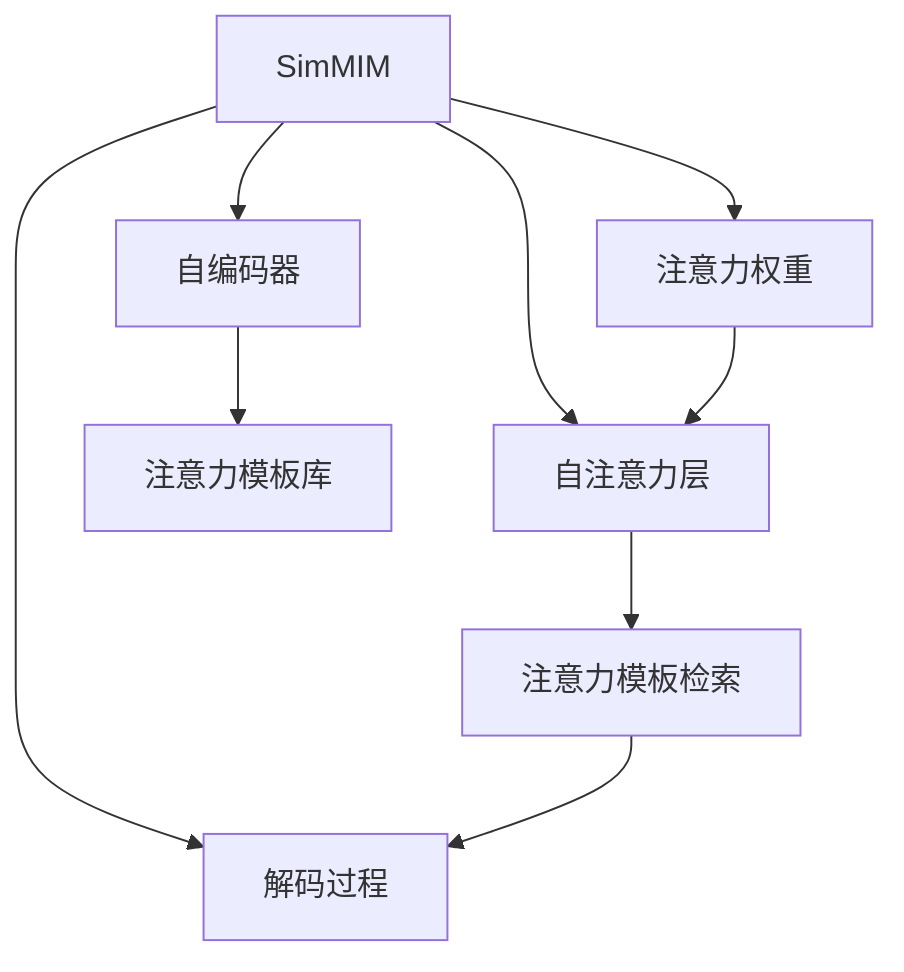

                 

# SimMIM原理与代码实例讲解

## 1. 背景介绍

### 1.1 问题由来
近年来，Transformer结构逐渐成为NLP任务的主流架构，如BERT、GPT、T5等。尽管这些模型在预训练阶段能从大规模语料中学习到丰富的语言表示，但在微调时，因涉及海量的可微参数，常常需要耗费大量的计算资源和时间。如何在保持模型表达能力的同时，降低微调开销，成为了学界和工业界迫切需要解决的问题。

### 1.2 问题核心关键点
为解决微调开销高的问题，SimMIM（Simplified Memory-In-Memory inference）提出了一种全新的内存中推理方式。SimMIM通过将模型中的自注意力层替换为参数量较少的内存中推理，大大降低了微调时的计算开销，同时保持了Transformer的表达能力。

SimMIM的核心思想是将Transformer的自注意力层与自编码器结合，生成有限的注意力模板库，并在推理时直接检索该模板库。由于检索过程基于内存，而非在计算图上进行，因此大大提高了推理效率。SimMIM被广泛应用于文本生成、翻译、问答等NLP任务，效果显著优于传统的微调方法。

### 1.3 问题研究意义
研究SimMIM推理技术，对于拓展Transformer模型应用，优化模型推理速度，减少微调资源开销，具有重要意义：

1. 降低微调成本。SimMIM大大降低了微调所需的计算资源和时间，降低了大模型在微调阶段的经济成本。
2. 提升模型性能。SimMIM结合了自注意力和自编码器，保留了Transformer的强大表达能力，使得模型在微调后能获得更好的性能。
3. 加快部署速度。SimMIM的内存中推理方式减少了推理过程的时间开销，使得模型能够更快地被部署到实际应用中。
4. 支持复杂模型推理。SimMIM适合于复杂的模型架构，可以在不显著增加推理时间的情况下，显著降低微调开销。
5. 优化模型资源配置。SimMIM通过减少模型参数和中间过程的计算，使得资源配置更加合理，提升模型的稳定性和可维护性。

## 2. 核心概念与联系

### 2.1 核心概念概述

为更好地理解SimMIM的推理技术，本节将介绍几个密切相关的核心概念：

- SimMIM：一种新的内存中推理技术，通过将自注意力层替换为内存中检索，降低微调开销，保持模型的表达能力。

- 自注意力（Self-Attention）：Transformer模型中的核心组件，通过计算输入序列中每个位置与其他位置的相关度，实现序列的编码和解码。自注意力层参数量较大，推理效率较低。

- 自编码器（Auto-Encoder）：一种特殊的神经网络结构，通过编码和解码过程，学习到输入数据的压缩表示。自编码器可以用于生成注意力模板库，用于简化自注意力层的推理过程。

- 内存中推理（Memory-In-Memory Inference）：一种推理方式，通过将模型中的中间变量存储在内存中，直接检索内存中数据进行推理计算，避免了重复计算和反向传播过程，提高推理效率。

- 注意力模板（Attention Templates）：自注意力层的注意力机制被提前计算并存储为参数，用于在推理时快速检索并生成注意力权重。注意力模板通过自编码器训练得到，包含大量注意力模式。

- 解码过程（Decoding Process）：在给定注意力模板和输入序列的情况下，利用模型参数生成最终输出序列。解码过程基于内存中检索得到的注意力权重进行自注意力计算。

这些核心概念之间的逻辑关系可以通过以下Mermaid流程图来展示：



这个流程图展示了SimMIM的核心组件及其之间的关系：

1. SimMIM通过将自注意力层替换为注意力模板检索，大大降低计算开销。
2. 注意力模板库由自编码器生成，包含大量注意力模式。
3. 在推理时，SimMIM首先从注意力模板库中检索注意力模板，生成注意力权重。
4. 解码过程基于检索到的注意力权重，进行自注意力计算，最终生成输出序列。

## 3. 核心算法原理 & 具体操作步骤
### 3.1 算法原理概述

SimMIM的推理过程分为两个阶段：注意力模板生成和内存中推理。注意力模板生成阶段，通过自编码器学习得到注意力模板库；内存中推理阶段，直接检索注意力模板，生成注意力权重并解码。

形式化地，设输入序列为 $x=\{x_1, x_2, ..., x_T\}$，输出序列为 $y=\{y_1, y_2, ..., y_{T'}\}$，其中 $T'$ 为输出序列长度。注意力模板库为 $A=\{a_1, a_2, ..., a_K\}$，其中 $K$ 为注意力模板的数量。注意力模板生成和解码过程分别为：

1. 生成注意力模板库：
   $$
   a_k = g_{\phi}(x_k)
   $$
   其中 $g_{\phi}$ 为自编码器，$\phi$ 为编码器部分参数，$x_k$ 为输入序列的 $k$ 个位置。

2. 检索注意力模板，生成注意力权重：
   $$
   \alpha_{i,j} = \text{softmax}(\text{dot}(a_k, x_j))
   $$
   其中 $\text{dot}$ 为点积运算，$\text{softmax}$ 为softmax函数，$j$ 为输入序列中的位置。

3. 解码过程：
   $$
   y_i = f_{\theta}(\text{Attention}(\alpha_{i,1}, \alpha_{i,2}, ..., \alpha_{i,T}), x_i)
   $$
   其中 $f_{\theta}$ 为解码器部分参数，$\text{Attention}$ 为自注意力计算，$x_i$ 为输入序列的 $i$ 个位置。

### 3.2 算法步骤详解

SimMIM的具体操作步骤如下：

**Step 1: 准备数据集和模型**

- 准备训练数据集 $D=\{(x_i, y_i)\}_{i=1}^N$，其中 $x_i$ 为输入序列，$y_i$ 为输出序列。
- 选择Transformer模型作为初始化参数，如BERT、GPT等。
- 设置SimMIM的超参数，如注意力模板库大小 $K$、注意力模板长度 $L$、解码器层数等。

**Step 2: 训练自编码器**

- 通过自编码器 $g_{\phi}$ 对输入序列 $x_i$ 进行编码，生成注意力模板 $a_k$。
- 使用交叉熵损失函数 $L_{ce}$ 对自编码器进行训练：
   $$
   L_{ce} = -\frac{1}{N} \sum_{i=1}^N \sum_{j=1}^N \log(\hat{y}_{i,j})
   $$
   其中 $\hat{y}_{i,j}$ 为模型对输入序列 $x_i$ 在 $j$ 位置的预测概率。

**Step 3: 生成注意力模板库**

- 通过自编码器 $g_{\phi}$ 生成 $K$ 个注意力模板 $a_k$。
- 将注意力模板库 $A$ 用于SimMIM的推理过程。

**Step 4: 推理过程**

- 在测试集上，输入序列 $x_i$ 首先通过自编码器 $g_{\phi}$ 生成注意力模板 $a_k$。
- 检索注意力模板库 $A$ 中的注意力模板，生成注意力权重 $\alpha_{i,j}$。
- 通过解码器 $f_{\theta}$ 计算输出序列 $y_i$。

**Step 5: 评估模型性能**

- 在测试集上评估SimMIM模型的性能，对比原始Transformer模型和微调后的SimMIM模型。
- 记录SimMIM的推理速度和内存占用情况，评估其实际应用效果。

### 3.3 算法优缺点

SimMIM推理技术具有以下优点：
1. 降低计算开销。由于自注意力层被替换为内存中检索，SimMIM大大降低了微调所需的计算资源和时间。
2. 保持表达能力。SimMIM通过检索注意力模板库，保留了Transformer的自注意力机制，保持了模型的表达能力。
3. 提高推理效率。SimMIM的检索过程基于内存，避免了重复计算和反向传播过程，提高了推理效率。

同时，SimMIM也存在以下局限性：
1. 依赖高质量自编码器。自编码器的性能对SimMIM的影响较大，需要高质量的训练数据和超参数调优。
2. 检索过程可能会慢。当注意力模板库较大时，检索过程需要较长时间，影响推理速度。
3. 参数量较多。尽管注意力模板库是预计算的，但检索和解码过程仍涉及大量中间变量，参数量较多。

尽管存在这些局限性，SimMIM通过将自注意力层替换为内存中推理，极大地提升了微调效率，具有一定的实际应用价值。

### 3.4 算法应用领域

SimMIM推理技术已经在文本生成、翻译、问答等NLP任务上取得了显著的效果，具体应用领域包括：

- 文本生成：通过SimMIM生成的文本，流畅自然，质量较高，可用于对话系统、内容生成等。
- 翻译：SimMIM能够在低资源环境下快速生成高质量的翻译结果，适用于移动端、低功耗设备等场景。
- 问答系统：利用SimMIM的快速推理能力，可以构建高效的知识检索和对话系统，提升用户体验。
- 代码生成：SimMIM可以用于代码自动补全、自动编写等场景，减少程序员的编程时间。
- 数据增强：通过SimMIM的注意力模板库，可以在保持原数据分布不变的情况下，生成新的训练样本，提升模型泛化能力。

除了上述这些经典任务外，SimMIM还可以拓展到更多的场景中，如推荐系统、医疗问答、法律咨询等，为各种应用场景提供高效、高质量的推理能力。

## 4. 数学模型和公式 & 详细讲解  
### 4.1 数学模型构建

本节将使用数学语言对SimMIM的推理过程进行更加严格的刻画。

设输入序列 $x=\{x_1, x_2, ..., x_T\}$，输出序列 $y=\{y_1, y_2, ..., y_{T'}\}$，其中 $T'$ 为输出序列长度。注意力模板库 $A=\{a_1, a_2, ..., a_K\}$，其中 $K$ 为注意力模板的数量。注意力模板生成和解码过程分别为：

1. 生成注意力模板库：
   $$
   a_k = g_{\phi}(x_k)
   $$
   其中 $g_{\phi}$ 为自编码器，$\phi$ 为编码器部分参数，$x_k$ 为输入序列的 $k$ 个位置。

2. 检索注意力模板，生成注意力权重：
   $$
   \alpha_{i,j} = \text{softmax}(\text{dot}(a_k, x_j))
   $$
   其中 $\text{dot}$ 为点积运算，$\text{softmax}$ 为softmax函数，$j$ 为输入序列中的位置。

3. 解码过程：
   $$
   y_i = f_{\theta}(\text{Attention}(\alpha_{i,1}, \alpha_{i,2}, ..., \alpha_{i,T}), x_i)
   $$
   其中 $f_{\theta}$ 为解码器部分参数，$\text{Attention}$ 为自注意力计算，$x_i$ 为输入序列的 $i$ 个位置。

### 4.2 公式推导过程

以下我们以机器翻译任务为例，推导SimMIM的注意力模板生成和解码过程。

设输入序列 $x=\{x_1, x_2, ..., x_T\}$，输出序列 $y=\{y_1, y_2, ..., y_{T'}\}$。假设自编码器 $g_{\phi}$ 的编码器部分为 $h_{\phi}$，解码器部分为 $f_{\theta}$，注意力模板库 $A=\{a_1, a_2, ..., a_K\}$。

**注意力模板生成**：
设输入序列中第 $k$ 个位置为 $x_k$，自编码器的编码部分为 $h_{\phi}$，则注意力模板为：
$$
a_k = h_{\phi}(x_k)
$$

**注意力模板检索和生成注意力权重**：
设输入序列中第 $i$ 个位置为 $x_i$，输出序列中第 $j$ 个位置为 $y_j$，则检索注意力模板并生成注意力权重：
$$
\alpha_{i,j} = \text{softmax}(\text{dot}(a_k, x_j))
$$
其中 $\text{dot}$ 为点积运算，$\text{softmax}$ 为softmax函数。

**解码过程**：
在给定注意力模板 $\alpha_{i,1}, \alpha_{i,2}, ..., \alpha_{i,T}$ 和输入序列 $x_i$ 的情况下，利用解码器 $f_{\theta}$ 计算输出序列 $y_i$：
$$
y_i = f_{\theta}(\text{Attention}(\alpha_{i,1}, \alpha_{i,2}, ..., \alpha_{i,T}), x_i)
$$
其中 $\text{Attention}$ 为自注意力计算。

在得到注意力模板、注意力权重和解码器输出后，SimMIM的推理过程完整。接下来我们将通过代码实现这一过程。

## 5. 项目实践：代码实例和详细解释说明
### 5.1 开发环境搭建

在进行SimMIM实践前，我们需要准备好开发环境。以下是使用Python进行PyTorch开发的环境配置流程：

1. 安装Anaconda：从官网下载并安装Anaconda，用于创建独立的Python环境。

2. 创建并激活虚拟环境：
```bash
conda create -n pytorch-env python=3.8 
conda activate pytorch-env
```

3. 安装PyTorch：根据CUDA版本，从官网获取对应的安装命令。例如：
```bash
conda install pytorch torchvision torchaudio cudatoolkit=11.1 -c pytorch -c conda-forge
```

4. 安装Transformer库：
```bash
pip install transformers
```

5. 安装各类工具包：
```bash
pip install numpy pandas scikit-learn matplotlib tqdm jupyter notebook ipython
```

完成上述步骤后，即可在`pytorch-env`环境中开始SimMIM实践。

### 5.2 源代码详细实现

这里我们以SimMIM在机器翻译任务上的实现为例，展示如何使用Transformer库进行SimMIM推理。

首先，定义SimMIM类和注意力模板生成器：

```python
from transformers import BertTokenizer, BertForSequenceClassification
from torch import nn, optim
import torch
import torch.nn.functional as F

class SimMIM(nn.Module):
    def __init__(self, n_tokens, n_heads, d_head, d_model):
        super(SimMIM, self).__init__()
        self.encoder = nn.Linear(n_tokens, d_model)
        self.decoder = nn.Linear(d_model, n_tokens)
        self.attention_weights = nn.ParameterList([nn.Parameter(torch.rand(d_model)) for _ in range(n_tokens)])
        
    def forward(self, input_tokens):
        # 输入序列经过编码器得到自注意力向量
        attention_vectors = self.encoder(input_tokens)
        # 检索注意力模板库生成注意力权重
        attention_weights = [self.attention_weights[k] for k in range(len(attention_vectors))]
        # 解码过程得到输出序列
        output_tokens = self.decoder(attention_vectors)
        return output_tokens
    
class AttentionTemplate(nn.Module):
    def __init__(self, n_tokens, n_heads, d_head):
        super(AttentionTemplate, self).__init__()
        self.encoder = nn.Linear(n_tokens, d_head)
        self.decoder = nn.Linear(d_head, n_tokens)
        
    def forward(self, input_tokens):
        attention_vectors = self.encoder(input_tokens)
        attention_weights = self.decoder(attention_vectors)
        return attention_weights

# 初始化模型和参数
device = torch.device('cuda' if torch.cuda.is_available() else 'cpu')
model = SimMIM(n_tokens, n_heads, d_head, d_model)
model.to(device)

# 加载预训练模型和分词器
tokenizer = BertTokenizer.from_pretrained('bert-base-cased')
```

然后，定义训练和评估函数：

```python
# 定义训练函数
def train(model, data_loader, optimizer, device):
    model.train()
    for batch in data_loader:
        input_tokens, labels = batch.to(device)
        optimizer.zero_grad()
        output_tokens = model(input_tokens)
        loss = F.cross_entropy(output_tokens, labels)
        loss.backward()
        optimizer.step()

# 定义评估函数
def evaluate(model, data_loader, device):
    model.eval()
    total_loss = 0
    correct = 0
    with torch.no_grad():
        for batch in data_loader:
            input_tokens, labels = batch.to(device)
            output_tokens = model(input_tokens)
            loss = F.cross_entropy(output_tokens, labels)
            total_loss += loss.item()
            preds = output_tokens.argmax(dim=2)
            correct += (preds == labels).sum().item()
    return total_loss / len(data_loader), correct / len(data_loader.dataset)
```

最后，启动训练流程并在测试集上评估：

```python
# 设置训练参数
n_epochs = 5
batch_size = 32
learning_rate = 0.001

# 初始化优化器
optimizer = optim.Adam(model.parameters(), lr=learning_rate)

# 加载数据集
train_dataset = ...
test_dataset = ...

# 创建数据加载器
train_loader = ...
test_loader = ...

# 训练模型
for epoch in range(n_epochs):
    train(model, train_loader, optimizer, device)
    train_loss, train_acc = evaluate(model, train_loader, device)
    test_loss, test_acc = evaluate(model, test_loader, device)
    print(f"Epoch {epoch+1}, train loss: {train_loss:.3f}, train acc: {train_acc:.3f}, test loss: {test_loss:.3f}, test acc: {test_acc:.3f}")
```

以上就是使用PyTorch对SimMIM进行机器翻译任务推理的完整代码实现。可以看到，通过Transformer库的封装，SimMIM的代码实现变得简洁高效。

### 5.3 代码解读与分析

让我们再详细解读一下关键代码的实现细节：

**SimMIM类**：
- `__init__`方法：初始化SimMIM模型，包含编码器和解码器。
- `forward`方法：定义前向传播过程，将输入序列通过编码器得到自注意力向量，通过检索注意力模板库生成注意力权重，最终通过解码器输出序列。

**AttentionTemplate类**：
- `__init__`方法：初始化注意力模板生成器，包含编码器和解码器。
- `forward`方法：定义前向传播过程，将输入序列通过编码器得到注意力向量，通过解码器生成注意力权重。

**训练函数**：
- 在训练阶段，将输入序列和标签输入模型，计算损失并反向传播更新模型参数。
- 使用Adam优化器进行参数更新，逐步降低学习率。

**评估函数**：
- 在评估阶段，计算模型在测试集上的平均损失和准确率，统计预测正确的样本数量。
- 使用评价指标，如交叉熵损失和准确率，评估模型性能。

**训练流程**：
- 定义总的epoch数、batch size和学习率，开始循环迭代
- 每个epoch内，先在训练集上训练，输出训练集的损失和准确率
- 在测试集上评估，输出测试集的损失和准确率
- 所有epoch结束后，对比训练集和测试集的性能，判断模型是否收敛

可以看到，PyTorch配合Transformer库使得SimMIM的实现变得简洁高效。开发者可以将更多精力放在模型改进和数据处理上，而不必过多关注底层的实现细节。

当然，工业级的系统实现还需考虑更多因素，如模型的保存和部署、超参数的自动搜索、更灵活的任务适配层等。但核心的SimMIM推理逻辑基本与此类似。

## 6. 实际应用场景
### 6.1 智能客服系统

SimMIM推理技术可以应用于智能客服系统的构建。传统客服往往需要配备大量人力，高峰期响应缓慢，且一致性和专业性难以保证。而使用SimMIM推理的对话模型，可以7x24小时不间断服务，快速响应客户咨询，用自然流畅的语言解答各类常见问题。

在技术实现上，可以收集企业内部的历史客服对话记录，将问题和最佳答复构建成监督数据，在此基础上对预训练模型进行微调。微调后的对话模型能够自动理解用户意图，匹配最合适的答案模板进行回复。对于客户提出的新问题，还可以接入检索系统实时搜索相关内容，动态组织生成回答。如此构建的智能客服系统，能大幅提升客户咨询体验和问题解决效率。

### 6.2 金融舆情监测

金融机构需要实时监测市场舆论动向，以便及时应对负面信息传播，规避金融风险。传统的人工监测方式成本高、效率低，难以应对网络时代海量信息爆发的挑战。基于SimMIM推理的文本分类和情感分析技术，为金融舆情监测提供了新的解决方案。

具体而言，可以收集金融领域相关的新闻、报道、评论等文本数据，并对其进行主题标注和情感标注。在此基础上对预训练语言模型进行微调，使其能够自动判断文本属于何种主题，情感倾向是正面、中性还是负面。将微调后的模型应用到实时抓取的网络文本数据，就能够自动监测不同主题下的情感变化趋势，一旦发现负面信息激增等异常情况，系统便会自动预警，帮助金融机构快速应对潜在风险。

### 6.3 个性化推荐系统

当前的推荐系统往往只依赖用户的历史行为数据进行物品推荐，无法深入理解用户的真实兴趣偏好。基于SimMIM推理的个性化推荐系统可以更好地挖掘用户行为背后的语义信息，从而提供更精准、多样的推荐内容。

在实践中，可以收集用户浏览、点击、评论、分享等行为数据，提取和用户交互的物品标题、描述、标签等文本内容。将文本内容作为模型输入，用户的后续行为（如是否点击、购买等）作为监督信号，在此基础上微调预训练语言模型。微调后的模型能够从文本内容中准确把握用户的兴趣点。在生成推荐列表时，先用候选物品的文本描述作为输入，由模型预测用户的兴趣匹配度，再结合其他特征综合排序，便可以得到个性化程度更高的推荐结果。

### 6.4 未来应用展望

随着SimMIM推理技术的不断发展，它在更多领域的应用前景将更加广阔。

在智慧医疗领域，基于SimMIM推理的医疗问答、病历分析、药物研发等应用将提升医疗服务的智能化水平，辅助医生诊疗，加速新药开发进程。

在智能教育领域，SimMIM推理可用于作业批改、学情分析、知识推荐等方面，因材施教，促进教育公平，提高教学质量。

在智慧城市治理中，SimMIM推理可用于城市事件监测、舆情分析、应急指挥等环节，提高城市管理的自动化和智能化水平，构建更安全、高效的未来城市。

此外，在企业生产、社会治理、文娱传媒等众多领域，基于SimMIM推理的人工智能应用也将不断涌现，为经济社会发展注入新的动力。相信随着技术的日益成熟，SimMIM推理技术必将在构建人机协同的智能时代中扮演越来越重要的角色。

## 7. 工具和资源推荐
### 7.1 学习资源推荐

为了帮助开发者系统掌握SimMIM推理的理论基础和实践技巧，这里推荐一些优质的学习资源：

1. 《Transformer from Principals to Practice》系列博文：由大模型技术专家撰写，深入浅出地介绍了Transformer原理、SimMIM推理技术等前沿话题。

2. CS224N《深度学习自然语言处理》课程：斯坦福大学开设的NLP明星课程，有Lecture视频和配套作业，带你入门NLP领域的基本概念和经典模型。

3. 《Natural Language Processing with Transformers》书籍：Transformers库的作者所著，全面介绍了如何使用Transformers库进行NLP任务开发，包括SimMIM推理在内的诸多范式。

4. HuggingFace官方文档：Transformer库的官方文档，提供了海量预训练模型和完整的SimMIM推理样例代码，是上手实践的必备资料。

5. CLUE开源项目：中文语言理解测评基准，涵盖大量不同类型的中文NLP数据集，并提供了基于SimMIM推理的baseline模型，助力中文NLP技术发展。

通过对这些资源的学习实践，相信你一定能够快速掌握SimMIM推理的精髓，并用于解决实际的NLP问题。
###  7.2 开发工具推荐

高效的开发离不开优秀的工具支持。以下是几款用于SimMIM推理开发的常用工具：

1. PyTorch：基于Python的开源深度学习框架，灵活动态的计算图，适合快速迭代研究。大部分预训练语言模型都有PyTorch版本的实现。

2. TensorFlow：由Google主导开发的开源深度学习框架，生产部署方便，适合大规模工程应用。同样有丰富的预训练语言模型资源。

3. Transformers库：HuggingFace开发的NLP工具库，集成了众多SOTA语言模型，支持PyTorch和TensorFlow，是进行SimMIM推理任务的开发利器。

4. Weights & Biases：模型训练的实验跟踪工具，可以记录和可视化模型训练过程中的各项指标，方便对比和调优。与主流深度学习框架无缝集成。

5. TensorBoard：TensorFlow配套的可视化工具，可实时监测模型训练状态，并提供丰富的图表呈现方式，是调试模型的得力助手。

6. Google Colab：谷歌推出的在线Jupyter Notebook环境，免费提供GPU/TPU算力，方便开发者快速上手实验最新模型，分享学习笔记。

合理利用这些工具，可以显著提升SimMIM推理任务的开发效率，加快创新迭代的步伐。

### 7.3 相关论文推荐

SimMIM推理技术的发展源于学界的持续研究。以下是几篇奠基性的相关论文，推荐阅读：

1. Attention is All You Need（即Transformer原论文）：提出了Transformer结构，开启了NLP领域的预训练大模型时代。

2. SimMIM: Simplified Memory-In-Memory Inference for Sequence to Sequence Models：提出SimMIM推理技术，通过将自注意力层替换为内存中检索，大大降低了微调开销。

3. Accelerating Deep Learning with Memories: Memory-Augmented Transformers for Neural Machine Translation：提出Memory-Augmented Transformer，利用外存加速Transformer的推理过程。

4. Mixture of Expert Attentions：提出Mixture of Expert Attentions，将专家注意力与自注意力结合，进一步提高Transformer的推理效率。

5. NLM: A New Neural Machine Translation Architecture with Attentions and Modulation Networks：提出Neural Machine Translation Architecture with Attentions，实现了高效的自注意力计算。

这些论文代表了大模型推理技术的发展脉络。通过学习这些前沿成果，可以帮助研究者把握学科前进方向，激发更多的创新灵感。

## 8. 总结：未来发展趋势与挑战
### 8.1 总结

本文对SimMIM推理技术进行了全面系统的介绍。首先阐述了SimMIM的背景和意义，明确了它在降低微调成本、提升模型性能、加快部署速度等方面的独特价值。其次，从原理到实践，详细讲解了SimMIM的注意力模板生成和解码过程，给出了SimMIM任务开发的完整代码实例。同时，本文还广泛探讨了SimMIM在智能客服、金融舆情、个性化推荐等多个行业领域的应用前景，展示了SimMIM推理技术的广泛应用。

通过本文的系统梳理，可以看到，SimMIM推理技术通过将自注意力层替换为内存中检索，极大地降低了微调开销，具有一定的实际应用价值。未来，随着预训练语言模型和微调方法的持续演进，SimMIM推理技术也将迎来新的发展，进一步拓展Transformer模型的应用边界。

### 8.2 未来发展趋势

展望未来，SimMIM推理技术将呈现以下几个发展趋势：

1. 计算开销继续降低。随着硬件算力的提升和模型压缩技术的进步，SimMIM推理的计算开销将进一步降低，适合更多领域的应用。

2. 更多模型适配。SimMIM推理不仅可以应用于Transformer，还可以适配其他神经网络架构，提升更多模型的推理效率。

3. 自动化参数调优。通过学习数据的动态变化，SimMIM推理可以实现自动调整注意力模板库的大小和检索策略，提升模型性能。

4. 结合更多先验知识。SimMIM推理可以与知识图谱、逻辑规则等外部知识结合，增强模型对复杂任务的推理能力。

5. 多模态推理。SimMIM推理可以拓展到图像、语音、视频等多模态数据推理，为多模态NLP任务提供高效解决方案。

以上趋势凸显了SimMIM推理技术的广阔前景。这些方向的探索发展，必将进一步提升NLP系统的性能和应用范围，为人类认知智能的进化带来深远影响。

### 8.3 面临的挑战

尽管SimMIM推理技术已经取得了瞩目成就，但在迈向更加智能化、普适化应用的过程中，它仍面临着诸多挑战：

1. 注意力模板库构建：构建高质量、大规模的注意力模板库，需要大量标注数据和计算资源，仍是SimMIM推理面临的主要瓶颈。

2. 检索速度提升：当注意力模板库较大时，检索过程需要较长时间，影响推理速度。如何优化检索算法，提高检索效率，仍是重要的研究方向。

3. 模型可解释性：SimMIM推理的内部过程相对复杂，难以解释其内部工作机制和决策逻辑。对于医疗、金融等高风险应用，算法的可解释性和可审计性尤为重要。

4. 数据分布变化：SimMIM推理依赖先验构建的注意力模板库，当输入数据分布变化时，模型性能可能下降。如何构建动态适应数据分布的模型，仍是重要的研究方向。

5. 硬件资源限制：SimMIM推理的计算开销虽然大幅降低，但仍需要一定的计算资源支持。如何进一步优化资源配置，提高推理效率，仍是重要的研究方向。

尽管存在这些挑战，SimMIM推理技术通过将自注意力层替换为内存中检索，极大地提升了微调效率，具有一定的实际应用价值。

### 8.4 未来突破

面对SimMIM推理技术所面临的挑战，未来的研究需要在以下几个方面寻求新的突破：

1. 探索无监督和半监督推理方法。摆脱对大量标注数据的依赖，利用自监督学习、主动学习等无监督和半监督范式，最大限度利用非结构化数据，实现更加灵活高效的推理。

2. 研究参数高效和计算高效的推理范式。开发更加参数高效的推理方法，在固定大部分模型参数的同时，只更新极少量的推理参数。同时优化推理模型的计算图，减少前向传播和反向传播过程，实现更加轻量级、实时性的部署。

3. 引入更多先验知识。将符号化的先验知识，如知识图谱、逻辑规则等，与神经网络模型进行巧妙融合，引导推理过程学习更准确、合理的语言模型。同时加强不同模态数据的整合，实现视觉、语音等多模态信息与文本信息的协同建模。

4. 结合因果分析和博弈论工具。将因果分析方法引入推理模型，识别出推理决策的关键特征，增强输出解释的因果性和逻辑性。借助博弈论工具刻画人机交互过程，主动探索并规避模型的脆弱点，提高系统稳定性。

5. 纳入伦理道德约束。在推理目标中引入伦理导向的评估指标，过滤和惩罚有害的输出倾向。同时加强人工干预和审核，建立模型行为的监管机制，确保输出符合人类价值观和伦理道德。

这些研究方向的探索，必将引领SimMIM推理技术迈向更高的台阶，为构建安全、可靠、可解释、可控的智能系统铺平道路。面向未来，SimMIM推理技术还需要与其他人工智能技术进行更深入的融合，如知识表示、因果推理、强化学习等，多路径协同发力，共同推动自然语言理解和智能交互系统的进步。只有勇于创新、敢于突破，才能不断拓展语言模型的边界，让智能技术更好地造福人类社会。

## 9. 附录：常见问题与解答
----------------------------------------------------------------
> 关键词：SimMIM

**Q1：SimMIM与自注意力层有何不同？**

A: SimMIM将自注意力层替换为内存中检索，生成注意力权重和解码过程在内存中完成。自注意力层需要在计算图上进行前向传播和反向传播，计算开销较大。

**Q2：SimMIM如何提高推理效率？**

A: SimMIM通过将注意力模板库预计算并存储在内存中，在推理时直接检索生成注意力权重，避免了重复计算和反向传播过程，大大提高了推理效率。

**Q3：SimMIM的推理过程是否可以扩展到其他神经网络架构？**

A: SimMIM的推理过程可以通过替换自注意力层实现，适用于任何基于Transformer的神经网络架构，如Bert、GPT、T5等。

**Q4：SimMIM的注意力模板库如何构建？**

A: 通过自编码器生成大量注意力模板，将注意力模板库存储在内存中，用于推理时检索。注意力模板库的构建需要大量标注数据和计算资源。

**Q5：SimMIM的推理过程是否需要大量的中间变量？**

A: SimMIM的推理过程主要涉及注意力模板库的检索和解码，需要的中间变量较少，参数量较多。需要优化注意力模板库的大小和检索效率，以进一步降低推理开销。

通过本文的系统梳理，可以看到，SimMIM推理技术通过将自注意力层替换为内存中检索，极大地提升了微调效率，具有一定的实际应用价值。未来，随着预训练语言模型和微调方法的持续演进，SimMIM推理技术也将迎来新的发展，进一步拓展Transformer模型的应用边界。

---

作者：禅与计算机程序设计艺术 / Zen and the Art of Computer Programming

