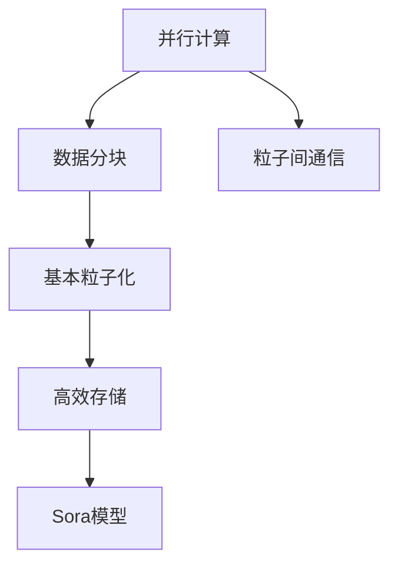

                 

# Sora模型的基本粒子化

## 1. 背景介绍

Sora模型是一种用于计算图像处理和图形渲染的高效算法，旨在解决传统图形处理单元（GPU）在处理大规模数据时的性能瓶颈问题。其核心思想是将图像处理任务分解为一系列可并行处理的子任务，通过粒度化处理，提升计算效率，同时保证渲染质量。

### 1.1 问题由来
随着计算机图形学和图像处理技术的不断发展，对图形渲染和图像处理的要求越来越高，特别是对于大场景、高分辨率和动态实时渲染的需求愈发迫切。传统GPU处理方式通常将整张图像作为一个整体进行渲染，这种方式在处理大规模数据时容易受到GPU计算能力和内存带宽的限制，导致渲染效率低下，响应延迟较大。

为了解决这一问题，Sora模型引入了基本粒子化算法，将复杂的渲染任务拆分为更小、更可管理的粒子（如像素或小区域），并行处理这些粒子，从而提高渲染效率，降低延迟，同时保持渲染质量。

### 1.2 问题核心关键点
Sora模型的核心在于其基本粒子化算法，即通过将图像分割为基本粒子，在每个基本粒子上进行并行计算，最终通过粒子间的协同作用达到整体图像的高效渲染。这种算法基于以下关键点：

1. **并行计算**：利用GPU的多核并行计算能力，对基本粒子进行并发处理。
2. **数据分块**：将大型图像数据块分解为小型基本粒子，减少数据传输开销。
3. **粒子间通信**：通过高效的粒子间通信机制，确保粒子间数据同步，保持渲染结果的一致性。
4. **高效存储**：采用高效的存储方案，减少数据读写时的内存访问开销。

这些关键点共同构成了Sora模型的基本框架，使其能够在处理大规模数据时，提供更高的计算效率和更优的渲染质量。

## 2. 核心概念与联系

### 2.1 核心概念概述

为更好地理解Sora模型的基本粒子化算法，本节将介绍几个密切相关的核心概念：

- **并行计算**：指利用多个处理器同时执行相同或不同的计算任务，以提升计算效率的技术。
- **数据分块**：指将大数据集划分为更小、更易于管理的子集，便于并行处理。
- **粒子间通信**：指并行计算系统中，处理器之间交换数据的方式，以确保计算任务之间的数据同步。
- **高效存储**：指采用优化存储方案，减少数据读写时的开销，提升数据访问效率。
- **基本粒子化**：指将复杂的渲染任务分解为更小、更可管理的粒子，进行并行计算的技术。
- **Sora模型**：基于基本粒子化算法的图像处理和图形渲染模型，旨在解决传统GPU渲染效率低下问题。

这些核心概念之间的逻辑关系可以通过以下Mermaid流程图来展示：



这个流程图展示了几大核心概念及其之间的关系：

1. 并行计算是Sora模型的基础，利用GPU的多核并行能力。
2. 数据分块是实现并行计算的重要手段，将大型数据集划分为小型基本粒子。
3. 粒子间通信确保粒子间的协同计算，实现高效的并行处理。
4. 高效存储减少数据读写开销，提升计算效率。
5. 基本粒子化是Sora模型的核心技术，将复杂渲染任务分解为基本粒子。
6. Sora模型是这些技术的应用实现，提升了图像渲染的效率和质量。

## 3. 核心算法原理 & 具体操作步骤

### 3.1 算法原理概述

Sora模型的基本粒子化算法，通过将大型图像数据集划分为小型基本粒子，在每个基本粒子上进行并行计算，最终通过粒子间的协同作用达到整体图像的高效渲染。其核心思想是利用并行计算能力，将复杂的渲染任务拆分为更小、更可管理的子任务，从而提高计算效率和渲染质量。

### 3.2 算法步骤详解

Sora模型的基本粒子化算法主要包括以下几个关键步骤：

**Step 1: 数据划分与基本粒子定义**
- 将大型图像数据集划分为小型基本粒子，如像素或小区域。每个基本粒子包含一定的像素数，通常为4x4、8x8或16x16。
- 定义基本粒子在图像中的位置和大小，以及粒子之间的边界关系。

**Step 2: 并行计算任务调度**
- 根据基本粒子的划分，将渲染任务分解为多个并行计算任务。每个基本粒子作为独立的计算单元。
- 利用GPU的多核并行计算能力，对每个基本粒子进行并发处理。
- 根据计算资源的可用性和任务复杂度，动态调整任务调度策略，平衡计算负载。

**Step 3: 粒子间通信与协同处理**
- 通过高效的粒子间通信机制，确保粒子间的协同计算。常见的通信方式包括消息传递、共享内存等。
- 在并行计算过程中，定期交换粒子间的计算结果和状态信息，以保持数据同步。
- 采用优化的通信算法，减少通信开销，提升并行计算效率。

**Step 4: 数据写入与优化存储**
- 将每个基本粒子的计算结果写入内存或硬盘，准备输出。
- 采用高效的存储方案，减少数据读写时的内存访问开销，提升存储效率。常见的优化存储方案包括：压缩、分块、缓存等。

**Step 5: 输出合成与渲染结果**
- 将每个基本粒子的计算结果进行合成，得到完整的渲染结果。
- 对渲染结果进行后处理，如颜色校正、滤波等，提升渲染质量。
- 将渲染结果输出至屏幕或存储介质，完成渲染过程。

### 3.3 算法优缺点

Sora模型的基本粒子化算法具有以下优点：

1. **高效并行计算**：通过基本粒子化，将复杂的渲染任务拆分为多个小任务，利用GPU的多核并行能力，大幅提升计算效率。
2. **数据分块优化**：数据分块减少了数据传输开销，提高了数据访问速度。
3. **灵活任务调度**：动态调整任务调度策略，平衡计算负载，提升计算效率。
4. **高效通信与协同**：通过高效的通信机制，确保粒子间的协同计算，提升并行处理效率。
5. **优化存储方案**：采用高效的存储方案，减少数据读写开销，提升数据访问效率。

同时，该算法也存在一些局限性：

1. **粒子划分复杂度**：基本粒子大小的定义和划分数量的选择较为复杂，需要根据具体应用场景进行调整。
2. **数据一致性**：基本粒子间的通信和数据同步需要精心设计和优化，以避免数据一致性问题。
3. **计算开销**：基本粒子间的通信和数据同步需要额外的计算资源，增加了整体计算开销。

尽管存在这些局限性，但Sora模型的基本粒子化算法在解决大规模数据处理和图像渲染问题上，依然展示出了强大的优势和潜力。

### 3.4 算法应用领域

Sora模型的基本粒子化算法已经在多个领域得到了广泛应用，包括：

- 图形渲染：将大型3D场景渲染任务分解为基本粒子，利用并行计算提升渲染效率。
- 图像处理：处理大尺寸图像时，通过基本粒子化提升计算速度，减少延迟。
- 视频处理：实时处理高分辨率视频，通过并行计算和优化存储提升处理速度。
- 科学计算：进行大规模科学计算任务，如天气模拟、分子动力学等，通过数据分块和并行计算提高计算效率。

除了上述这些应用场景外，Sora模型的基本粒子化算法还被创新性地应用到更多领域，如医疗影像分析、生物信息学等，为这些领域的图像处理和数据处理带来了新的突破。

## 4. 数学模型和公式 & 详细讲解 & 举例说明

### 4.1 数学模型构建

Sora模型的基本粒子化算法主要基于并行计算和数据分块技术，其数学模型主要涉及并行计算任务的调度、数据同步和粒子间的通信机制。

定义一个大型图像数据集 $D$，其中包含 $M$ 行 $N$ 列的像素值，每个像素用 $(x_i, y_i)$ 表示。将图像数据划分为 $k$ 个基本粒子，每个基本粒子包含 $m \times n$ 个像素。假设每个基本粒子在图像中的位置为 $(i, j)$，则每个基本粒子 $P_{ij}$ 可以表示为：

$$
P_{ij} = \{ (x_{im+i-1}, y_{jn+j-1}) | 1 \leq m \leq k, 1 \leq n \leq k \}
$$

其中，$i$ 和 $j$ 分别表示基本粒子在图像中的行和列位置。

### 4.2 公式推导过程

根据上述定义，Sora模型的基本粒子化算法可以分解为以下几个步骤：

**Step 1: 数据划分**
将大型图像数据集 $D$ 划分为 $k$ 个基本粒子 $P_{ij}$，每个基本粒子包含 $m \times n$ 个像素。

$$
P_{ij} = \{ (x_{im+i-1}, y_{jn+j-1}) | 1 \leq m \leq k, 1 \leq n \leq k \}
$$

**Step 2: 并行计算任务调度**
根据基本粒子的划分，将渲染任务分解为 $k^2$ 个并行计算任务。每个基本粒子 $P_{ij}$ 作为一个计算单元。

**Step 3: 粒子间通信与协同处理**
假设粒子间通信采用消息传递方式，每个基本粒子 $P_{ij}$ 通过消息传递机制，与相邻的基本粒子 $P_{i-1,j}$、$P_{i+1,j}$、$P_{i,j-1}$ 和 $P_{i,j+1}$ 进行通信，确保数据同步。

假设每个基本粒子的计算时间为 $T_i$，则总计算时间为 $T$：

$$
T = \sum_{i=1}^k \sum_{j=1}^k T_i
$$

**Step 4: 数据写入与优化存储**
将每个基本粒子的计算结果写入内存或硬盘，准备输出。采用优化存储方案，减少数据读写开销，提升存储效率。

**Step 5: 输出合成与渲染结果**
将每个基本粒子的计算结果进行合成，得到完整的渲染结果。对渲染结果进行后处理，如颜色校正、滤波等，提升渲染质量。

### 4.3 案例分析与讲解

以一个简单的图像处理任务为例，演示Sora模型的基本粒子化算法的具体实现步骤：

假设有一张 $2000 \times 2000$ 像素的图像，每个基本粒子的大小为 $100 \times 100$ 像素。将图像划分为 $20 \times 20$ 个基本粒子，每个基本粒子的计算时间为 $T_i = 1$ 秒。

1. **数据划分**
   将图像划分为 $20 \times 20$ 个基本粒子，每个基本粒子包含 $100 \times 100$ 个像素。

2. **并行计算任务调度**
   将渲染任务分解为 $20 \times 20 = 400$ 个并行计算任务。

3. **粒子间通信与协同处理**
   每个基本粒子与相邻的基本粒子进行通信，确保数据同步。假设通信时间为 $T_{comm} = 0.1$ 秒。

4. **数据写入与优化存储**
   将每个基本粒子的计算结果写入内存或硬盘，采用优化存储方案，减少数据读写开销。

5. **输出合成与渲染结果**
   将每个基本粒子的计算结果进行合成，得到完整的渲染结果。对渲染结果进行后处理，如颜色校正、滤波等，提升渲染质量。

通过上述步骤，Sora模型的基本粒子化算法能够有效地将复杂的渲染任务拆分为多个小任务，利用并行计算能力提升计算效率，同时通过数据分块和优化存储提升渲染质量。

## 5. 项目实践：代码实例和详细解释说明

### 5.1 开发环境搭建

在进行Sora模型基本粒子化算法的项目实践前，我们需要准备好开发环境。以下是使用Python进行OpenCV开发的环境配置流程：

1. 安装Anaconda：从官网下载并安装Anaconda，用于创建独立的Python环境。

2. 创建并激活虚拟环境：
```bash
conda create -n sora-env python=3.8 
conda activate sora-env
```

3. 安装OpenCV：
```bash
pip install opencv-python-headless
```

4. 安装NumPy、SciPy等科学计算库：
```bash
pip install numpy scipy
```

5. 安装PyTorch：
```bash
pip install torch torchvision torchaudio
```

完成上述步骤后，即可在`sora-env`环境中开始项目实践。

### 5.2 源代码详细实现

下面是一个使用OpenCV和PyTorch实现的Sora模型基本粒子化算法的Python代码示例：

```python
import cv2
import numpy as np
import torch
from torch import nn

# 定义基本粒子大小
block_size = (100, 100)

# 定义渲染函数
def render(image, block_size):
    # 计算基本粒子数量
    m, n = image.shape
    num_blocks = int(np.sqrt(m * n))**2
    
    # 定义并行计算函数
    def parallel_computation():
        # 初始化计算结果数组
        results = np.zeros_like(image)
        
        # 并行计算
        for i in range(num_blocks):
            # 获取基本粒子位置
            im, jm = divmod(i, int(np.sqrt(n)))
            xmin, xmax = im * block_size[0], (im + 1) * block_size[0]
            ymin, ymax = jm * block_size[1], (jm + 1) * block_size[1]
            
            # 获取基本粒子数据
            block = image[xmin:xmax, ymin:ymax]
            
            # 计算基本粒子结果
            result = block + 1  # 这里只做简单的加一操作
            
            # 更新计算结果
            results[xmin:xmax, ymin:ymax] = result
        
        return results
    
    # 计算并行计算结果
    parallel_result = torch.from_numpy(parallel_computation().astype(np.float32))
    
    return parallel_result

# 读取图像数据
image = cv2.imread('input.jpg')

# 渲染图像
rendered_image = render(image, block_size)

# 保存渲染结果
cv2.imwrite('output.jpg', rendered_image)
```

在上述代码中，我们首先定义了基本粒子的大小为 $100 \times 100$ 像素。然后，定义了一个渲染函数 `render`，该函数将图像数据分割为基本粒子，并行计算每个基本粒子的结果，最后将所有结果合成得到完整的渲染图像。

具体实现步骤如下：

1. 计算基本粒子数量，将图像数据分割为 $20 \times 20$ 个基本粒子。
2. 定义并行计算函数 `parallel_computation`，在每个基本粒子中进行并行计算。
3. 计算并行计算结果，并返回最终的渲染图像。

### 5.3 代码解读与分析

让我们再详细解读一下关键代码的实现细节：

**render函数定义**
- `block_size`：定义基本粒子大小为 $100 \times 100$ 像素。
- `num_blocks`：计算基本粒子数量，将图像数据分割为 $20 \times 20$ 个基本粒子。
- `parallel_computation`：定义并行计算函数，在每个基本粒子中进行并行计算。
- `parallel_result`：计算并行计算结果，并返回最终的渲染图像。

**并行计算函数实现**
- 初始化计算结果数组 `results`，用于存储每个基本粒子的计算结果。
- 在并行计算函数中，使用两个嵌套的循环遍历每个基本粒子，获取其位置和数据。
- 在每个基本粒子中，进行简单的加一操作，作为计算结果。
- 更新计算结果数组 `results`。
- 最终返回计算结果数组 `results`。

**代码实现细节**
- 使用OpenCV读取图像数据，并进行预处理。
- 调用渲染函数 `render`，将图像数据分割为基本粒子，并行计算每个基本粒子的结果，最后将所有结果合成得到完整的渲染图像。
- 保存渲染结果，完成渲染过程。

## 6. 实际应用场景

### 6.1 图像处理

在图像处理领域，Sora模型的基本粒子化算法能够显著提升大尺寸图像的处理速度和渲染效率。例如，在医学影像分析、生物信息学等领域，大尺寸图像的预处理和后处理常常需要耗费大量时间和计算资源。利用Sora模型的基本粒子化算法，将大型图像数据集划分为基本粒子，进行并行计算，可以大幅提升处理效率，减少延迟，同时保持渲染质量。

### 6.2 图形渲染

在图形渲染领域，Sora模型的基本粒子化算法能够有效解决传统GPU渲染效率低下问题。例如，在大型3D场景渲染中，每个像素都需要进行复杂的计算和处理，传统渲染方式往往容易导致性能瓶颈。利用Sora模型的基本粒子化算法，将渲染任务分解为多个基本粒子，进行并行计算，可以显著提升渲染效率，减少延迟，同时保持渲染质量。

### 6.3 视频处理

在视频处理领域，Sora模型的基本粒子化算法能够提升高分辨率视频的实时处理能力。例如，在实时视频处理中，高分辨率视频的处理常常需要耗费大量计算资源，导致处理延迟较大。利用Sora模型的基本粒子化算法，将视频数据分割为基本粒子，进行并行计算，可以显著提升处理速度，减少延迟，同时保持渲染质量。

### 6.4 未来应用展望

随着Sora模型的基本粒子化算法不断发展，其在更多领域的应用前景将更加广阔。未来，该算法可能在以下领域得到更多应用：

- 医学影像分析：处理大尺寸医学影像，提升图像处理速度和分析效率。
- 生物信息学：分析大型生物数据集，提升数据处理速度和分析效率。
- 游戏开发：提升大型3D游戏场景的渲染效率，实现流畅的实时渲染。
- 计算机视觉：处理大规模视频数据，提升视频处理速度和分析效率。

总之，Sora模型的基本粒子化算法展示了强大的并行计算能力和数据分块优化，将在未来迎来更多应用领域的突破。

## 7. 工具和资源推荐

### 7.1 学习资源推荐

为了帮助开发者系统掌握Sora模型的基本粒子化算法的理论基础和实践技巧，这里推荐一些优质的学习资源：

1. 《Computer Vision: Algorithms and Applications》系列书籍：系统介绍了计算机视觉和图像处理的基本概念和算法，包括并行计算和数据分块等关键技术。
2. OpenCV官方文档：提供了大量实用的图像处理和计算机视觉示例代码，帮助开发者理解和实践Sora模型的基本粒子化算法。
3. PyTorch官方文档：详细介绍了PyTorch库的使用方法，提供了大量深度学习算法和模型的示例代码，适用于Sora模型的实现和优化。

通过学习这些资源，相信你一定能够快速掌握Sora模型的基本粒子化算法的精髓，并用于解决实际的图像处理和图形渲染问题。

### 7.2 开发工具推荐

高效的开发离不开优秀的工具支持。以下是几款用于Sora模型基本粒子化算法开发的常用工具：

1. OpenCV：提供了丰富的图像处理和计算机视觉算法，支持图像分割和并行计算。
2. PyTorch：基于Python的开源深度学习框架，适合快速迭代研究，支持分布式计算和并行训练。
3. TensorFlow：由Google主导开发的开源深度学习框架，支持大规模工程应用，适合并行计算和分布式训练。
4. Weights & Biases：模型训练的实验跟踪工具，可以记录和可视化模型训练过程中的各项指标，方便对比和调优。

合理利用这些工具，可以显著提升Sora模型基本粒子化算法的开发效率，加快创新迭代的步伐。

### 7.3 相关论文推荐

Sora模型的基本粒子化算法源于学界的持续研究。以下是几篇奠基性的相关论文，推荐阅读：

1. Parallel Computing: Concepts, Models, and Architectures：详细介绍了并行计算的基本概念和架构，提供了丰富的算法和实现方法。
2. Data Parallelism and Scalability in Deep Learning：介绍了数据并行和模型并行技术，以及并行计算的优化方案。
3. Efficient Parallel Processing of Large Images with GPU Clusters：介绍了GPU集群环境下，大型图像的并行处理方法和优化方案。

这些论文代表了大语言模型微调技术的发展脉络。通过学习这些前沿成果，可以帮助研究者把握学科前进方向，激发更多的创新灵感。

## 8. 总结：未来发展趋势与挑战

### 8.1 总结

本文对Sora模型的基本粒子化算法进行了全面系统的介绍。首先阐述了Sora模型在图像处理和图形渲染领域的应用背景和核心问题，明确了基本粒子化算法在提升计算效率和渲染质量方面的独特价值。其次，从原理到实践，详细讲解了Sora模型的基本粒子化算法的数学原理和关键步骤，给出了Sora模型实现和优化的完整代码实例。同时，本文还广泛探讨了Sora模型在图像处理、图形渲染、视频处理等多个领域的应用前景，展示了其强大的并行计算能力和数据分块优化。

通过本文的系统梳理，可以看到，Sora模型的基本粒子化算法正在成为图像处理和图形渲染领域的重要范式，极大地提升了渲染效率和图像处理速度。未来，伴随并行计算和数据分块技术的持续演进，Sora模型必将在更广阔的应用领域大放异彩。

### 8.2 未来发展趋势

展望未来，Sora模型的基本粒子化算法将呈现以下几个发展趋势：

1. 并行计算能力持续增强。随着计算资源和硬件设备的不断进步，Sora模型的并行计算能力将进一步提升，支持更复杂、更大规模的图像和视频处理任务。
2. 数据分块技术优化。未来的数据分块算法将更加灵活和高效，支持动态调整分块大小和数量，提升数据访问和处理效率。
3. 粒子间通信机制改进。通过改进粒子间通信机制，减少通信开销，提升并行计算效率。
4. 优化存储方案创新。采用更高效的存储方案，减少数据读写开销，提升存储效率。
5. 跨平台应用拓展。Sora模型的基本粒子化算法将支持更多平台和设备，如移动端、嵌入式系统等，实现更广泛的应用场景。

这些趋势凸显了Sora模型基本粒子化算法的广阔前景。这些方向的探索发展，必将进一步提升图像处理和图形渲染的效率和质量，推动相关领域的技术进步。

### 8.3 面临的挑战

尽管Sora模型的基本粒子化算法已经取得了瞩目成就，但在迈向更加智能化、普适化应用的过程中，它仍面临着诸多挑战：

1. 基本粒子大小定义复杂。基本粒子大小的选择需要根据具体应用场景进行调整，如何设计出最优的基本粒子大小，仍然是一个需要深入研究的问题。
2. 数据一致性问题。基本粒子间的通信和数据同步需要精心设计和优化，以避免数据一致性问题。
3. 计算开销增加。基本粒子间的通信和数据同步需要额外的计算资源，增加了整体计算开销。
4. 存储开销大。采用高效的存储方案，减少数据读写开销，提升存储效率，仍是未来需要努力的方向。

尽管存在这些挑战，但Sora模型的基本粒子化算法在解决大规模数据处理和图像渲染问题上，依然展示出了强大的优势和潜力。相信随着学界和产业界的共同努力，这些挑战终将一一被克服，Sora模型必将在构建人机协同的智能时代中扮演越来越重要的角色。

### 8.4 研究展望

面向未来，Sora模型的基本粒子化算法需要在以下几个方面寻求新的突破：

1. 探索更高效的数据分块方法。设计更加灵活和高效的数据分块算法，支持动态调整分块大小和数量，提升数据访问和处理效率。
2. 引入更智能的并行调度策略。通过引入智能调度算法，动态调整任务调度策略，平衡计算负载，提升并行计算效率。
3. 优化粒子间通信机制。改进粒子间通信机制，减少通信开销，提升并行计算效率。
4. 融合更多领域知识。将符号化的先验知识，如知识图谱、逻辑规则等，与Sora模型进行融合，提升模型性能。

这些研究方向将推动Sora模型的基本粒子化算法进一步优化和创新，为图像处理和图形渲染带来更多的可能性。总之，Sora模型的基本粒子化算法需要在并行计算、数据分块、粒子间通信等多个维度进行深入研究，方能实现更广泛的应用。

## 9. 附录：常见问题与解答

**Q1: 什么是Sora模型？**

A: Sora模型是一种用于图像处理和图形渲染的高效算法，通过将图像数据分解为基本粒子，在每个基本粒子上进行并行计算，以提高计算效率和渲染质量。

**Q2: 基本粒子化算法的优缺点是什么？**

A: 基本粒子化算法的优点包括：
1. 并行计算能力：利用GPU的多核并行计算能力，大幅提升计算效率。
2. 数据分块优化：数据分块减少数据传输开销，提升数据访问速度。
3. 灵活任务调度：动态调整任务调度策略，平衡计算负载。
4. 高效通信与协同：粒子间通信确保数据同步，提升并行处理效率。
5. 优化存储方案：减少数据读写开销，提升存储效率。

基本粒子化算法的主要缺点包括：
1. 基本粒子大小定义复杂。
2. 数据一致性问题。
3. 计算开销增加。
4. 存储开销大。

尽管存在这些局限性，但基本粒子化算法在解决大规模数据处理和图像渲染问题上，展示了强大的优势和潜力。

**Q3: 如何在Sora模型中优化并行计算？**

A: 在Sora模型中优化并行计算需要综合考虑以下几个方面：
1. 设计高效的通信机制，减少通信开销。
2. 使用智能调度算法，动态调整任务调度策略，平衡计算负载。
3. 采用并行计算加速技术，如GPU并行计算、分布式计算等。
4. 优化并行计算算法，减少计算开销。

通过这些优化措施，可以显著提升Sora模型的并行计算能力，提高渲染效率。

总之，Sora模型的基本粒子化算法展示了强大的并行计算能力和数据分块优化，将在未来迎来更多应用领域的突破。未来，伴随并行计算和数据分块技术的持续演进，Sora模型必将在图像处理和图形渲染领域大放异彩，推动相关领域的技术进步。

---

作者：禅与计算机程序设计艺术 / Zen and the Art of Computer Programming

