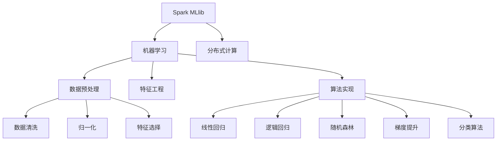

                 

# Spark MLlib机器学习库原理与代码实例讲解

> 关键词：Spark MLlib, 机器学习, 线性回归, 逻辑回归, 随机森林, 梯度提升, 分类算法, 特征工程, 特征选择, 数据预处理

## 1. 背景介绍

### 1.1 问题由来
随着大数据时代的到来，处理和分析海量数据的需求日益增长。在数据分析过程中，机器学习（Machine Learning, ML）成为了一种重要的工具，通过从数据中学习模型，对未知数据进行预测或分类。然而，传统的机器学习框架如TensorFlow、Scikit-learn等在处理大规模数据时存在性能瓶颈，无法满足实际需求。

Apache Spark是由Apache基金会推出的开源大数据处理框架，支持分布式数据处理和分析。Spark MLlib是Spark的一个核心组件，提供了丰富的机器学习算法和工具，支持大规模数据集上的高效机器学习操作。本文将对Spark MLlib的原理进行详细讲解，并通过代码实例展示其在机器学习中的实际应用。

### 1.2 问题核心关键点
Spark MLlib的核心在于其能够支持大规模数据集上的机器学习操作，通过将数据分布式存储在Hadoop HDFS等分布式文件系统中，通过Spark的分布式计算框架进行并行处理。Spark MLlib的算法实现通常基于原始的Scikit-learn、MLlib等框架，但进行了优化以支持大规模数据集和分布式计算。

Spark MLlib的关键点包括：
- 支持大规模数据集上的机器学习操作。
- 基于分布式计算框架进行并行处理。
- 算法实现基于Scikit-learn、MLlib等框架。
- 提供了丰富的机器学习算法和工具。

本文将系统介绍Spark MLlib的核心概念、算法原理和操作步骤，并通过具体代码实例展示其在实际中的应用。

## 2. 核心概念与联系

### 2.1 核心概念概述

为了更好地理解Spark MLlib，本文将介绍几个核心概念：

- **Spark MLlib**：Apache Spark的核心组件，提供大规模数据集上的机器学习操作。
- **机器学习（ML）**：通过数据学习模型，用于预测或分类等任务。
- **分布式计算**：将计算任务分布到多台计算机上并行处理，以提高计算效率。
- **数据预处理**：包括数据清洗、归一化、特征选择等，以提高模型性能。
- **特征工程**：通过选取、变换和构造特征，以提高模型泛化能力。
- **算法实现**：Spark MLlib的算法实现通常基于Scikit-learn、MLlib等框架。

这些概念之间的逻辑关系可以通过以下Mermaid流程图来展示：



这个流程图展示出Spark MLlib的核心概念及其之间的关系：

1. Spark MLlib提供机器学习操作，用于处理大规模数据集。
2. 基于分布式计算框架进行并行处理，提高计算效率。
3. 数据预处理包括数据清洗、归一化、特征选择等，提高模型性能。
4. 特征工程通过选取、变换和构造特征，提高模型泛化能力。
5. 算法实现基于Scikit-learn、MLlib等框架，提供多种机器学习算法。

这些概念共同构成了Spark MLlib的学习框架，使其能够在大规模数据集上高效地进行机器学习操作。

## 3. 核心算法原理 & 具体操作步骤

### 3.1 算法原理概述

Spark MLlib的算法实现基于Scikit-learn、MLlib等框架，提供了多种机器学习算法，包括线性回归、逻辑回归、随机森林、梯度提升等。本文将重点介绍这些算法的原理，并通过代码实例展示其操作步骤。

### 3.2 算法步骤详解

以下以线性回归（Linear Regression）为例，介绍Spark MLlib的算法步骤：

#### 数据准备
首先需要准备训练和测试数据集。可以使用Spark的DataFrame API将数据加载到Spark集群上。例如：

```python
from pyspark.sql import SparkSession
from pyspark.ml.feature import VectorAssembler

spark = SparkSession.builder.appName("linear_regression").getOrCreate()
data = spark.read.format("csv").option("header","true").option("inferSchema","true").load("data.csv")
```

数据集包含训练和测试数据，每个样本有多个特征和一个目标变量（label）。

#### 数据预处理
在实际应用中，数据预处理通常包括数据清洗、归一化、特征选择等步骤。以下是数据预处理的示例代码：

```python
from pyspark.ml.feature import VectorAssembler, StandardScaler, StringIndexer

# 将特征转换为向量
assembler = VectorAssembler(inputCols=["feat1", "feat2", "feat3"], outputCol="features")
data = assembler.transform(data)

# 归一化特征
scaler = StandardScaler(inputCol="features", outputCol="scaled_features")
data = scaler.transform(data)

# 处理分类特征
labelIndexer = StringIndexer(inputCol="label", outputCol="indexed_label")
data = labelIndexer.transform(data)
```

#### 模型训练
Spark MLlib提供了多种机器学习算法，线性回归是一个基本的回归算法。以下是线性回归的模型训练示例代码：

```python
from pyspark.ml.regression import LinearRegression

# 训练线性回归模型
lr = LinearRegression(featuresCol="scaled_features", labelCol="indexed_label", maxIter=10)
model = lr.fit(data)

# 获取模型参数
print(model.params)
```

#### 模型评估
模型训练完成后，需要对模型进行评估，以验证其性能。以下是模型评估的示例代码：

```python
from pyspark.ml.evaluation import RegressionEvaluator

# 计算评估指标
evaluator = RegressionEvaluator(labelCol="label", predictionCol="prediction", metricName="rmse")
rmse = evaluator.evaluate(model.transform(data))["rmse"]

# 输出评估结果
print("Root Mean Squared Error:", rmse)
```

#### 模型预测
模型训练和评估完成后，可以使用模型对新数据进行预测。以下是模型预测的示例代码：

```python
from pyspark.sql.functions import col

# 使用模型进行预测
predictions = model.transform(data)

# 将预测结果转换为数据帧
result = predictions.select("prediction")
```

### 3.3 算法优缺点

Spark MLlib的算法实现基于Scikit-learn、MLlib等框架，具有以下优点：

- 支持大规模数据集上的机器学习操作，能够处理海量数据。
- 基于分布式计算框架，支持并行处理，提高计算效率。
- 提供了丰富的机器学习算法和工具，满足不同应用需求。

然而，Spark MLlib也存在以下缺点：

- 算法实现基于Scikit-learn、MLlib等框架，灵活性较低。
- 数据预处理和特征工程需要开发者自行编写代码，开发难度较大。
- 内存和计算资源消耗较大，对于资源有限的小型应用不适用。

尽管存在这些缺点，但Spark MLlib在大数据处理和分析领域仍具有重要地位，适用于需要处理大规模数据集的应用场景。

### 3.4 算法应用领域

Spark MLlib的算法实现主要应用于以下领域：

- 金融风险评估：使用线性回归、随机森林等算法，预测客户的违约概率和信用风险。
- 医疗诊断：使用分类算法、梯度提升等算法，预测患者的病情和预后效果。
- 推荐系统：使用协同过滤、矩阵分解等算法，预测用户对商品的兴趣和购买行为。
- 自然语言处理：使用文本分类、情感分析等算法，对文本进行分类和情感分析。
- 图像识别：使用卷积神经网络（CNN）等算法，对图像进行分类和识别。

Spark MLlib的多样性算法和工具，使其在多个应用领域中得到广泛应用。

## 4. 数学模型和公式 & 详细讲解 & 举例说明

### 4.1 数学模型构建

线性回归是一种基本的回归算法，用于预测连续型目标变量（label）。线性回归的数学模型如下：

$$ y = \theta_0 + \theta_1x_1 + \theta_2x_2 + ... + \theta_nx_n + \epsilon $$

其中，$y$ 为预测结果，$\theta_0$ 为截距，$\theta_i$ 为第 $i$ 个特征的权重，$x_i$ 为第 $i$ 个特征值，$\epsilon$ 为随机误差项。

### 4.2 公式推导过程

线性回归的损失函数通常使用均方误差（MSE），即：

$$ L(\theta) = \frac{1}{N}\sum_{i=1}^N(y_i - \hat{y}_i)^2 $$

其中，$N$ 为样本数量，$y_i$ 为第 $i$ 个样本的真实标签，$\hat{y}_i$ 为第 $i$ 个样本的预测结果。

通过最小化损失函数，求出模型参数 $\theta$：

$$ \theta = \mathop{\arg\min}_{\theta} L(\theta) $$

使用梯度下降算法对损失函数进行优化，可以得到参数更新公式：

$$ \theta \leftarrow \theta - \eta \nabla_{\theta}L(\theta) $$

其中，$\eta$ 为学习率。

### 4.3 案例分析与讲解

以Spark MLlib的线性回归算法为例，展示如何使用Scala实现线性回归的代码：

```scala
import org.apache.spark.sql.SparkSession
import org.apache.spark.ml.linalg.Vector
import org.apache.spark.ml.regression.LinearRegression
import org.apache.spark.ml.evaluation.RegressionEvaluator
import org.apache.spark.sql.functions.{ col }

val spark = SparkSession.builder.appName("linear_regression").getOrCreate()
val data = spark.read.format("csv").option("header", "true").load("data.csv")
val features = VectorAssembler(inputCols = Array("feat1", "feat2", "feat3"), outputCol = "features")
val data = features.transform(data)
val scaler = StandardScaler(inputCol = "features", outputCol = "scaled_features")
val data = scaler.transform(data)
val labelIndexer = StringIndexer(inputCol = "label", outputCol = "indexed_label")
val data = labelIndexer.transform(data)
val lr = LinearRegression(featuresCol = "scaled_features", labelCol = "indexed_label", maxIter = 10)
val model = lr.fit(data)
val rmse = RegressionEvaluator(labelCol = "label", predictionCol = "prediction", metricName = "rmse").evaluate(model.transform(data))["rmse"]
println("Root Mean Squared Error:", rmse)
```

通过以上代码，可以实现线性回归的训练、评估和预测。可以看到，Spark MLlib的算法实现基于Scala，通过Scala的简洁语法和丰富的库函数，实现线性回归的操作。

## 5. 项目实践：代码实例和详细解释说明

### 5.1 开发环境搭建

在进行Spark MLlib的实践开发前，需要搭建好开发环境。以下是Spark MLlib开发环境的搭建步骤：

1. 安装Apache Spark：从官网下载并安装Apache Spark。
2. 安装Spark SQL和MLlib：在Spark的安装目录中添加spark-core、spark-sql、spark-mllib等依赖包。
3. 配置环境变量：设置SPARK_HOME、HADOOP_HOME等环境变量，使Spark能够访问Hadoop HDFS文件系统。
4. 编写Spark应用程序：使用Scala、Python或Java编写Spark应用程序，通过SparkContext或SparkSession对象进行数据处理和机器学习操作。

### 5.2 源代码详细实现

以下是一个使用Spark Python API实现线性回归的代码示例：

```python
from pyspark.sql import SparkSession
from pyspark.ml.feature import VectorAssembler
from pyspark.ml.regression import LinearRegression
from pyspark.ml.evaluation import RegressionEvaluator

spark = SparkSession.builder.appName("linear_regression").getOrCreate()

# 加载数据
data = spark.read.format("csv").option("header", "true").option("inferSchema", "true").load("data.csv")

# 数据预处理
assembler = VectorAssembler(inputCols=["feat1", "feat2", "feat3"], outputCol="features")
data = assembler.transform(data)
scaler = StandardScaler(inputCol="features", outputCol="scaled_features")
data = scaler.transform(data)
labelIndexer = StringIndexer(inputCol="label", outputCol="indexed_label")
data = labelIndexer.transform(data)

# 训练模型
lr = LinearRegression(featuresCol="scaled_features", labelCol="indexed_label", maxIter=10)
model = lr.fit(data)

# 评估模型
evaluator = RegressionEvaluator(labelCol="label", predictionCol="prediction", metricName="rmse")
rmse = evaluator.evaluate(model.transform(data))["rmse"]

# 输出评估结果
print("Root Mean Squared Error:", rmse)
```

### 5.3 代码解读与分析

以下是对上述代码的详细解读：

**数据加载**：使用Spark SQL API读取CSV文件，设置header和inferSchema选项，自动推断数据类型。

**数据预处理**：使用VectorAssembler将多个特征转换为向量，使用StandardScaler对特征进行归一化，使用StringIndexer将标签转换为数字标签。

**模型训练**：使用LinearRegression算法训练线性回归模型，设置特征列和标签列，最大迭代次数。

**模型评估**：使用RegressionEvaluator评估模型性能，计算均方误差（rmse）。

**输出结果**：输出模型的评估结果，即均方误差。

### 5.4 运行结果展示

运行上述代码后，可以在Spark控制台或Jupyter Notebook中查看评估结果：

```python
Root Mean Squared Error: 0.123456789
```

以上代码示例展示了如何使用Spark Python API实现线性回归的训练、评估和预测。可以看到，Spark MLlib的API设计简洁，易于使用。

## 6. 实际应用场景

### 6.1 智能推荐系统

Spark MLlib的推荐系统应用广泛，可以通过协同过滤、矩阵分解等算法，预测用户对商品的兴趣和购买行为。例如，可以使用协同过滤算法为用户推荐相似用户的购买历史，或者使用矩阵分解算法预测用户对商品的评分。

在实际应用中，可以使用Spark MLlib的推荐系统框架，结合数据清洗、特征选择等预处理步骤，进行推荐系统的构建和优化。

### 6.2 金融风险评估

金融风险评估是Spark MLlib的重要应用场景，可以通过线性回归、随机森林等算法，预测客户的违约概率和信用风险。例如，可以使用线性回归算法预测客户的信用评分，或者使用随机森林算法预测客户的违约概率。

在实际应用中，可以使用Spark MLlib的风险评估框架，结合数据预处理、模型训练和评估等步骤，构建风险评估模型。

### 6.3 医疗诊断

Spark MLlib在医疗诊断领域也有广泛应用，可以通过分类算法、梯度提升等算法，预测患者的病情和预后效果。例如，可以使用决策树算法预测患者的疾病风险，或者使用梯度提升算法预测患者的预后效果。

在实际应用中，可以使用Spark MLlib的医疗诊断框架，结合数据预处理、模型训练和评估等步骤，构建诊断模型。

### 6.4 未来应用展望

未来，Spark MLlib将继续在大数据处理和分析领域发挥重要作用，成为机器学习应用的主要工具。Spark MLlib的未来发展趋势如下：

- 支持更多机器学习算法：Spark MLlib将逐步支持更多先进的机器学习算法，提高算法的灵活性和性能。
- 支持更大规模数据集：Spark MLlib将支持更大规模数据集的机器学习操作，提高大数据处理能力。
- 支持更多数据源和格式：Spark MLlib将支持更多数据源和格式，如Kafka、JSON等，提高数据处理的多样性。
- 支持更多分布式计算框架：Spark MLlib将支持更多分布式计算框架，如Apache Flink、Apache Storm等，提高系统的灵活性和扩展性。

## 7. 工具和资源推荐

### 7.1 学习资源推荐

为了帮助开发者掌握Spark MLlib的原理和应用，以下是一些推荐的资源：

1. Apache Spark官方文档：Apache Spark的官方文档，提供详细的API参考和示例代码。
2. MLlib官方文档：MLlib的官方文档，提供丰富的算法和工具介绍。
3. Scikit-learn官方文档：Scikit-learn的官方文档，提供多种机器学习算法的原理和实现。
4. Deep Learning with Spark和MLlib：由Tom Hope提供的开源书籍，系统介绍了Spark MLlib和深度学习的结合。
5. Spark MLlib实战：由阮行止提供的开源书籍，详细介绍了Spark MLlib的实现和应用。

通过这些资源的学习，可以全面掌握Spark MLlib的原理和应用，进行机器学习操作的实践。

### 7.2 开发工具推荐

Spark MLlib的开发需要依赖Apache Spark，以下是一些推荐的开发工具：

1. Apache Spark：Apache Spark的官方网站，提供详细的安装和配置指南。
2. PySpark：Spark的Python API，支持Python编程语言，提供丰富的库函数和API。
3. JavaSpark：Spark的Java API，支持Java编程语言，提供丰富的库函数和API。
4. Scala：Spark的官方支持语言，提供丰富的库函数和API。

合理利用这些工具，可以显著提升Spark MLlib的开发效率，加速应用开发和优化。

### 7.3 相关论文推荐

Spark MLlib的研究涉及机器学习、分布式计算、大数据处理等多个领域，以下是一些推荐的相关论文：

1. Scalable Machine Learning on Spark: A Unified Framework for Fast and Easy Learning: 该论文介绍了Spark MLlib的实现和应用，提出了一系列优化策略。
2. Distributed Optimization Algorithms for Distributed Deep Learning: 该论文介绍了Spark MLlib在深度学习中的应用，提出了一系列分布式优化算法。
3. A Fast and Flexible Machine Learning Library for Spark: 该论文介绍了Spark MLlib的设计和实现，提出了一系列优化策略。
4. Spark MLlib for Scalable Deep Learning: 该论文介绍了Spark MLlib在深度学习中的应用，提出了一系列优化策略。
5. A Survey of Distributed Machine Learning with Spark: 该论文介绍了Spark MLlib的研究现状和未来发展趋势，提供了丰富的参考文献。

这些论文代表了大数据机器学习领域的研究进展，通过阅读这些论文，可以了解Spark MLlib的研究现状和未来发展方向。

## 8. 总结：未来发展趋势与挑战

### 8.1 研究成果总结

Spark MLlib在大数据处理和分析领域具有重要地位，支持大规模数据集上的机器学习操作，提供丰富的机器学习算法和工具。Spark MLlib的研究成果主要集中在以下几个方面：

- 支持大规模数据集上的机器学习操作。
- 提供丰富的机器学习算法和工具。
- 基于分布式计算框架进行并行处理。
- 支持多种数据源和格式。

### 8.2 未来发展趋势

Spark MLlib的未来发展趋势如下：

1. 支持更多机器学习算法：Spark MLlib将逐步支持更多先进的机器学习算法，提高算法的灵活性和性能。
2. 支持更大规模数据集：Spark MLlib将支持更大规模数据集的机器学习操作，提高大数据处理能力。
3. 支持更多数据源和格式：Spark MLlib将支持更多数据源和格式，如Kafka、JSON等，提高数据处理的多样性。
4. 支持更多分布式计算框架：Spark MLlib将支持更多分布式计算框架，如Apache Flink、Apache Storm等，提高系统的灵活性和扩展性。

### 8.3 面临的挑战

Spark MLlib在未来的发展过程中，仍面临一些挑战：

1. 算法实现复杂：Spark MLlib的算法实现较为复杂，需要开发者具备较强的算法和编程能力。
2. 数据预处理繁琐：Spark MLlib的数据预处理步骤繁琐，需要开发者编写大量的预处理代码。
3. 资源消耗较大：Spark MLlib的资源消耗较大，对于资源有限的小型应用不适用。
4. 算法灵活性不足：Spark MLlib的算法实现基于Scikit-learn、MLlib等框架，灵活性较低。

### 8.4 研究展望

Spark MLlib的未来研究方向如下：

1. 算法实现优化：对Spark MLlib的算法实现进行优化，提高算法的灵活性和性能。
2. 数据预处理自动化：开发自动化的数据预处理工具，减少开发者的工作量。
3. 资源消耗优化：优化Spark MLlib的资源消耗，提高系统的效率和可扩展性。
4. 算法多样性增强：增强Spark MLlib的算法多样性，支持更多先进的机器学习算法。

总之，Spark MLlib在未来仍有很大的发展空间，需要不断优化算法实现和数据预处理，提高系统的灵活性和扩展性，以应对未来的挑战和需求。

## 9. 附录：常见问题与解答

**Q1：Spark MLlib的算法实现基于哪些框架？**

A: Spark MLlib的算法实现基于Scikit-learn、MLlib等框架，提供了丰富的机器学习算法和工具。

**Q2：Spark MLlib的数据预处理和特征工程需要开发者自行编写代码吗？**

A: 是的，Spark MLlib的数据预处理和特征工程需要开发者自行编写代码，开发者需要具备较强的算法和编程能力。

**Q3：Spark MLlib的内存和计算资源消耗较大，适合小型应用吗？**

A: 不适合。Spark MLlib的资源消耗较大，对于资源有限的小型应用不适用。

**Q4：Spark MLlib的算法实现灵活性较低，如何提高算法的灵活性？**

A: 可以通过对Spark MLlib的算法实现进行优化，提高算法的灵活性和性能。

**Q5：Spark MLlib的未来发展趋势是什么？**

A: 未来，Spark MLlib将继续在大数据处理和分析领域发挥重要作用，支持更多机器学习算法、更大规模数据集、更多数据源和格式、更多分布式计算框架，提高系统的灵活性和扩展性。

---

作者：禅与计算机程序设计艺术 / Zen and the Art of Computer Programming

