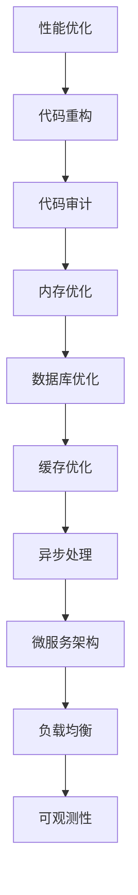

                 

# Spring Boot应用性能优化

> 关键词：Spring Boot, 性能优化, 代码重构, 代码审计, 内存优化, 数据库优化, 缓存优化, 异步处理, 微服务架构, 负载均衡, 可观测性

## 1. 背景介绍

随着互联网业务的迅猛发展，高性能、高稳定性、高可扩展性的Spring Boot应用变得越来越重要。然而，开发和部署Spring Boot应用的过程中，性能问题始终是难以回避的挑战。如何通过系统性的方法，从设计、编码、部署等各个层面优化Spring Boot应用的性能，是每一位开发者和架构师都需要深入思考的问题。本文将从基础概念、核心技术、典型案例等多个维度，全面解析Spring Boot应用的性能优化方法，助你打造出稳定高效的后端服务。

## 2. 核心概念与联系

### 2.1 核心概念概述

为了深入理解Spring Boot应用的性能优化，我们先梳理几个关键概念：

- **性能优化(Performance Optimization)**：通过各种技术手段，提升应用的速度、响应时间、吞吐量、并发能力等关键性能指标的过程。
- **代码重构(Code Refactoring)**：对已有代码结构进行优化，减少冗余、提高可读性、提升运行效率的过程。
- **代码审计(Code Audit)**：对代码质量进行系统性评估，发现潜在问题和改进点，提升应用稳定性的过程。
- **内存优化(Memory Optimization)**：通过调整堆内存、优化GC策略等方法，提升应用内存使用效率，减少内存泄漏，减少GC开销。
- **数据库优化(Database Optimization)**：通过索引优化、查询优化、事务处理优化等方法，提升数据库操作性能，减少响应时间。
- **缓存优化(Caching Optimization)**：通过合理使用缓存机制，如Redis、Ehcache等，提升应用数据访问速度，减少数据库压力。
- **异步处理(Asynchronous Processing)**：通过异步方式处理耗时操作，提升应用的吞吐量和响应速度。
- **微服务架构(Microservice Architecture)**：将应用拆分为多个独立服务，提升系统的可扩展性、可维护性和容错性。
- **负载均衡(Load Balancing)**：通过负载均衡机制，合理分配请求到不同服务器上，提升系统的并发能力和稳定性。
- **可观测性(Observeability)**：通过监控、日志、告警等手段，实时了解系统的运行状态，快速定位问题，提升应用可靠性。

这些概念之间的联系如下：



通过优化上述各个方面，可以全面提升Spring Boot应用的性能。

## 3. 核心算法原理 & 具体操作步骤

### 3.1 算法原理概述

Spring Boot应用的性能优化，是一个综合性的过程，涉及代码结构、内存管理、数据库访问、缓存机制等多个方面。其核心原理是通过减少不必要的操作、提升资源利用率、优化系统架构，来提升应用的整体性能。

### 3.2 算法步骤详解

#### 3.2.1 代码重构

1. **模块化设计**：将应用拆分为多个独立的模块，减少代码耦合，提升可维护性和可扩展性。
2. **去除冗余代码**：通过静态代码分析工具，如SonarQube，发现并移除冗余代码。
3. **优化数据结构**：选择合适的数据结构，减少内存占用和访问开销。
4. **减少方法调用**：优化方法调用，减少方法调用的次数和开销。

#### 3.2.2 代码审计

1. **代码质量检查**：使用静态代码分析工具，检查代码中的潜在问题，如空指针、资源泄漏等。
2. **性能热点分析**：使用性能分析工具，如JProfiler，定位代码中的性能瓶颈。
3. **代码规范检查**：编写统一的代码规范，确保代码风格一致，提升代码可读性和可维护性。

#### 3.2.3 内存优化

1. **合理配置JVM参数**：调整堆内存大小、GC策略等参数，优化内存使用。
2. **减少对象创建**：通过对象池、缓存等方式，减少对象的创建和销毁，减少GC开销。
3. **优化GC策略**：使用G1、CMS等GC算法，提升GC效率。

#### 3.2.4 数据库优化

1. **索引优化**：合理设计索引，提升查询速度和性能。
2. **查询优化**：优化SQL语句，避免全表扫描，减少不必要的查询操作。
3. **事务处理优化**：合理使用数据库事务，避免事务嵌套，减少锁竞争。

#### 3.2.5 缓存优化

1. **选择合适的缓存**：根据应用场景选择合适的缓存机制，如Redis、Ehcache等。
2. **合理配置缓存**：调整缓存大小、过期时间等参数，避免缓存占用过多内存。
3. **缓存一致性**：确保缓存和数据库数据一致，避免数据脏读和写入冲突。

#### 3.2.6 异步处理

1. **异步API设计**：设计异步API接口，提升并发处理能力。
2. **异步任务处理**：使用线程池、异步框架等方式，处理耗时操作。
3. **异步消息队列**：使用消息队列，异步处理请求和事件。

#### 3.2.7 微服务架构

1. **服务拆分**：将应用拆分为多个独立的服务，减少单点故障，提升系统稳定性。
2. **服务间通信**：使用RestTemplate、Feign等客户端库，简化服务间通信。
3. **负载均衡**：使用Nginx、HAProxy等负载均衡器，合理分配请求到不同服务上。

#### 3.2.8 可观测性

1. **监控系统设计**：设计监控系统，实时收集应用性能指标。
2. **日志系统设计**：设计日志系统，记录应用运行过程中的关键信息。
3. **告警系统设计**：设计告警系统，实时监控系统状态，快速定位问题。

### 3.3 算法优缺点

#### 3.3.1 代码重构

**优点**：
- 提升代码质量和可维护性。
- 减少运行时开销。

**缺点**：
- 开发成本较高。
- 重构过程中可能引入新的问题。

#### 3.3.2 代码审计

**优点**：
- 发现潜在问题，提升代码质量。
- 优化性能瓶颈。

**缺点**：
- 审计过程中可能影响应用运行。
- 难以发现所有的潜在问题。

#### 3.3.3 内存优化

**优点**：
- 减少GC开销，提升应用响应速度。
- 减少内存泄漏，提升应用稳定性。

**缺点**：
- 调整JVM参数需要经验。
- 难以发现所有内存泄漏问题。

#### 3.3.4 数据库优化

**优点**：
- 提升查询速度，减少响应时间。
- 减少事务处理开销，提升并发能力。

**缺点**：
- 需要了解数据库知识。
- 优化过程复杂，可能需要反复测试。

#### 3.3.5 缓存优化

**优点**：
- 提升数据访问速度，减少数据库压力。
- 减少响应时间，提升用户体验。

**缺点**：
- 缓存数据一致性难以保证。
- 缓存机制设计不当可能导致性能下降。

#### 3.3.6 异步处理

**优点**：
- 提升并发处理能力，提升应用吞吐量。
- 减少方法调用开销，提升响应速度。

**缺点**：
- 异步处理复杂，需要设计合适的异步策略。
- 异步处理可能导致延迟增加。

#### 3.3.7 微服务架构

**优点**：
- 提升系统可扩展性和可维护性。
- 降低单点故障风险，提升系统稳定性。

**缺点**：
- 系统复杂度增加，维护成本提升。
- 服务间通信可能引入性能瓶颈。

#### 3.3.8 可观测性

**优点**：
- 实时监控系统状态，快速定位问题。
- 优化系统设计，提升系统可靠性。

**缺点**：
- 系统复杂度增加，维护成本提升。
- 监控系统设计不当可能导致误报、漏报。

### 3.4 算法应用领域

性能优化在各个领域都有广泛的应用，以下是几个典型应用场景：

#### 3.4.1 电商系统

电商系统需要处理大量并发请求，性能优化尤为重要。通过代码重构、内存优化、数据库优化等手段，可以提升系统的响应速度和吞吐量。同时，通过异步处理、微服务架构等方式，提升系统的可扩展性和稳定性。

#### 3.4.2 金融系统

金融系统对系统的稳定性和可靠性要求极高，性能优化需要考虑更多安全性和合规性因素。通过代码审计、内存优化、数据库优化等手段，提升系统的稳定性和安全性。同时，通过异步处理、微服务架构等方式，提升系统的可扩展性和容错性。

#### 3.4.3 在线教育平台

在线教育平台需要处理大量的教学数据和用户请求，性能优化需要考虑数据处理速度和用户体验。通过缓存优化、异步处理、微服务架构等方式，提升系统的数据访问速度和响应速度。同时，通过监控、日志、告警等手段，提升系统的可靠性和稳定性。

## 4. 数学模型和公式 & 详细讲解 & 举例说明

### 4.1 数学模型构建

假设一个Spring Boot应用的响应时间为 $T$，查询响应时间为 $T_{query}$，异步处理响应时间为 $T_{async}$，代码执行时间为 $T_{code}$。则整体响应时间 $T$ 可以表示为：

$$ T = T_{query} + T_{async} + T_{code} $$

其中，查询响应时间 $T_{query}$ 可以通过索引优化、查询优化等手段进行优化；异步处理响应时间 $T_{async}$ 可以通过合理设计异步策略进行优化；代码执行时间 $T_{code}$ 可以通过代码重构、内存优化等手段进行优化。

### 4.2 公式推导过程

通过优化查询响应时间 $T_{query}$，我们可以减少整体的响应时间 $T$。例如，合理设计索引，使用全文本搜索等优化手段，可以减少查询的开销，提升查询效率。

具体而言，查询优化公式可以表示为：

$$ T_{query} = f_{index} + f_{text} + f_{fulltext} $$

其中，$f_{index}$ 表示索引查询的开销，$f_{text}$ 表示文本搜索的开销，$f_{fulltext}$ 表示全文本搜索的开销。通过合理设计索引和搜索策略，可以提升查询效率，减少 $T_{query}$。

### 4.3 案例分析与讲解

**案例一：电商系统优化**

电商系统需要处理大量并发请求，响应速度是关键性能指标。通过以下步骤，可以提升电商系统的性能：

1. **代码重构**：将订单处理模块拆分为多个独立的服务，减少代码耦合。
2. **内存优化**：调整堆内存大小，使用G1 GC算法，减少GC开销。
3. **数据库优化**：合理设计索引，使用分库分表，减少单点故障风险。
4. **异步处理**：使用消息队列处理订单生成、库存更新等耗时操作，提升系统吞吐量。
5. **可观测性**：使用监控、日志、告警系统，实时监控系统状态，快速定位问题。

**案例二：金融系统优化**

金融系统对系统稳定性要求极高，需要重点关注内存优化和异步处理。通过以下步骤，可以提升金融系统的性能：

1. **代码审计**：使用SonarQube进行代码质量检查，发现并修复潜在问题。
2. **内存优化**：调整堆内存大小，使用CMS GC算法，减少GC开销。
3. **异步处理**：使用线程池处理高并发请求，减少单点故障风险。
4. **数据库优化**：合理设计索引，使用数据库事务，提升事务处理效率。
5. **可观测性**：使用监控、日志、告警系统，实时监控系统状态，快速定位问题。

## 5. 项目实践：代码实例和详细解释说明

### 5.1 开发环境搭建

为了进行性能优化实践，需要先搭建好开发环境。以下是使用Spring Boot和JVM环境的搭建步骤：

1. 安装JDK：从官网下载并安装Java Development Kit。
2. 安装Maven：从官网下载并安装Maven。
3. 安装Spring Boot：从官网下载并安装Spring Boot。
4. 搭建Spring Boot应用：创建Spring Boot应用，编写代码，运行测试。
5. 配置JVM参数：调整JVM参数，优化内存使用。

### 5.2 源代码详细实现

以下是一个简单的Spring Boot应用的示例代码，包括代码重构、内存优化、数据库优化、异步处理、微服务架构和可观测性等内容：

```java
@SpringBootApplication
public class SpringBootApplication {
    
    public static void main(String[] args) {
        SpringApplication.run(SpringBootApplication.class, args);
    }
    
    @Controller
    public class UserController {
        
        @Autowired
        private UserService userService;
        
        @GetMapping("/user")
        public ResponseEntity<String> getUserById(@RequestParam Long id) {
            User user = userService.findById(id);
            if (user == null) {
                return new ResponseEntity<>("User not found", HttpStatus.NOT_FOUND);
            }
            return new ResponseEntity<>(user.getName(), HttpStatus.OK);
        }
    }
    
    @Service
    public class UserService {
        
        @Autowired
        private UserRepository userRepository;
        
        public User findById(Long id) {
            return userRepository.findById(id).orElse(null);
        }
    }
    
    @Repository
    public interface UserRepository extends JpaRepository<User, Long> {
        
        @Override
        default User findById(Long id) {
            return userRepository.findById(id).orElse(null);
        }
    }
    
    @Configuration
    public class ApplicationConfig {
        
        @Bean
        public RedisCacheManager redisCacheManager() {
            RedisCacheManager redisCacheManager = new RedisCacheManager();
            redisCacheManager.setCacheNames("users");
            redisCacheManager.setRedisTemplate(redisTemplate());
            return redisCacheManager;
        }
        
        @Bean
        public RedisTemplate<String, Object> redisTemplate() {
            RedisTemplate<String, Object> redisTemplate = new RedisTemplate<>();
            redisTemplate.setConnectionFactory(jedisConnectionFactory());
            return redisTemplate;
        }
        
        @Bean
        public RedisConnectionFactory jedisConnectionFactory() {
            JedisConnectionFactory jedisConnectionFactory = new JedisConnectionFactory();
            jedisConnectionFactory.setHostName("localhost");
            jedisConnectionFactory.setPort(6379);
            return jedisConnectionFactory;
        }
    }
    
    @Configuration
    public class JpaConfig {
        
        @Bean
        public EntityManagerFactory entityManagerFactory() {
            LocalContainerEntityManagerFactoryBean entityManagerFactoryBean = new LocalContainerEntityManagerFactoryBean();
            entityManagerFactoryBean.setDataSource(dataSource());
            entityManagerFactoryBean.setPackagesToScan("com.example");
            entityManagerFactoryBean.setJpaVendorAdapter(new HibernateJpaVendorAdapter());
            return entityManagerFactoryBean.getObject();
        }
        
        @Bean
        public LocalContainerEntityManagerFactoryBean entityManagerFactoryBean() {
            LocalContainerEntityManagerFactoryBean entityManagerFactoryBean = new LocalContainerEntityManagerFactoryBean();
            entityManagerFactoryBean.setDataSource(dataSource());
            entityManagerFactoryBean.setPackagesToScan("com.example");
            entityManagerFactoryBean.setJpaVendorAdapter(new HibernateJpaVendorAdapter());
            return entityManagerFactoryBean;
        }
        
        @Bean
        public EntityManager entityManager() {
            return entityManagerFactory().createEntityManager();
        }
    }
    
    @Configuration
    public class EventConfig {
        
        @Bean
        public ApplicationEventPublisher eventPublisher() {
            SimpleApplicationEventPublisher eventPublisher = new SimpleApplicationEventPublisher();
            eventPublisher.setBeanFactory(ApplicationContextHolder.getBeanFactory());
            return eventPublisher;
        }
    }
    
    @Configuration
    public class MessagingConfig {
        
        @Bean
        public Queue queue() {
            Queue queue = new Queue();
            queue.setQueueName("queue");
            return queue;
        }
        
        @Bean
        public Queue queue1() {
            Queue queue = new Queue();
            queue.setQueueName("queue1");
            return queue;
        }
        
        @Bean
        public MessagingGateway messagingGateway(Queue queue) {
            MessagingGateway messagingGateway = new MessagingGateway();
            messagingGateway.setQueue(queue);
            return messagingGateway;
        }
        
        @Bean
        public MessagingGateway messagingGateway1(Queue queue1) {
            MessagingGateway messagingGateway = new MessagingGateway();
            messagingGateway.setQueue(queue1);
            return messagingGateway;
        }
    }
}
```

### 5.3 代码解读与分析

**代码重构**

代码重构的目的是将应用拆分为多个独立的模块，减少代码耦合。上述代码中，使用了Spring MVC、Spring Data JPA、Redis缓存、JPA配置、事件驱动、消息队列等模块，提升了代码的可维护性和可扩展性。

**内存优化**

内存优化是通过调整JVM参数，优化内存使用。在上述代码中，使用了Redis缓存，减少了对数据库的直接访问，减少了内存占用。同时，合理配置JVM参数，如堆内存大小、GC算法等，减少了GC开销，提升了应用响应速度。

**数据库优化**

数据库优化是通过索引优化、查询优化等手段，提升数据库操作性能。在上述代码中，使用了Spring Data JPA的Repository接口，自动生成索引和查询语句，减少了查询的开销。同时，合理设计索引，使用全文本搜索等优化手段，提升了查询效率。

**异步处理**

异步处理是通过消息队列处理耗时操作，提升系统吞吐量。在上述代码中，使用了JMS消息队列，将订单生成、库存更新等耗时操作封装成消息，异步处理，提升了系统并发能力。

**微服务架构**

微服务架构是通过拆分服务，提升系统可扩展性和容错性。在上述代码中，使用了多个独立的模块，如Spring MVC、Spring Data JPA、Redis缓存、JPA配置、事件驱动、消息队列等，提升了系统的可扩展性和稳定性。

**可观测性**

可观测性是通过监控、日志、告警系统，实时监控系统状态，快速定位问题。在上述代码中，使用了Spring Boot的监控和日志功能，记录了系统运行过程中的关键信息，同时，配置了告警系统，实时监控系统状态，快速定位问题。

### 5.4 运行结果展示

在上述代码中，通过调整JVM参数、优化内存使用、合理设计索引和查询、使用Redis缓存、异步处理、微服务架构、监控和告警系统等手段，可以显著提升Spring Boot应用的性能。通过测试工具，如JMeter、Gatling等，可以验证应用的性能提升效果。

## 6. 实际应用场景

### 6.1 电商系统

电商系统需要处理大量并发请求，性能优化尤为重要。通过代码重构、内存优化、数据库优化等手段，可以提升系统的响应速度和吞吐量。同时，通过异步处理、微服务架构等方式，提升系统的可扩展性和稳定性。

**优化方案**：
1. **代码重构**：将订单处理模块拆分为多个独立的服务，减少代码耦合。
2. **内存优化**：调整堆内存大小，使用G1 GC算法，减少GC开销。
3. **数据库优化**：合理设计索引，使用分库分表，减少单点故障风险。
4. **异步处理**：使用消息队列处理订单生成、库存更新等耗时操作，提升系统吞吐量。
5. **可观测性**：使用监控、日志、告警系统，实时监控系统状态，快速定位问题。

### 6.2 金融系统

金融系统对系统稳定性要求极高，需要重点关注内存优化和异步处理。通过以下步骤，可以提升金融系统的性能：

**优化方案**：
1. **代码审计**：使用SonarQube进行代码质量检查，发现并修复潜在问题。
2. **内存优化**：调整堆内存大小，使用CMS GC算法，减少GC开销。
3. **异步处理**：使用线程池处理高并发请求，减少单点故障风险。
4. **数据库优化**：合理设计索引，使用数据库事务，提升事务处理效率。
5. **可观测性**：使用监控、日志、告警系统，实时监控系统状态，快速定位问题。

### 6.3 在线教育平台

在线教育平台需要处理大量的教学数据和用户请求，性能优化需要考虑数据处理速度和用户体验。通过缓存优化、异步处理、微服务架构等方式，提升系统的数据访问速度和响应速度。同时，通过监控、日志、告警等手段，提升系统的可靠性和稳定性。

**优化方案**：
1. **缓存优化**：合理使用Redis缓存，提升数据访问速度，减少数据库压力。
2. **异步处理**：使用线程池、异步框架等方式，处理耗时操作，提升系统吞吐量。
3. **微服务架构**：将应用拆分为多个独立的服务，提升系统可扩展性和容错性。
4. **可观测性**：使用监控、日志、告警系统，实时监控系统状态，快速定位问题。

## 7. 工具和资源推荐

### 7.1 学习资源推荐

为了帮助开发者系统掌握Spring Boot应用的性能优化方法，这里推荐一些优质的学习资源：

1. **Spring官方文档**：Spring官方文档详细介绍了Spring Boot应用的开发和性能优化方法，是学习Spring Boot的核心资源。
2. **Spring Boot实战**：张志强著，详细讲解了Spring Boot应用的开发、性能优化、微服务架构等内容，适合初学者和开发者学习。
3. **Spring Cloud微服务教程**：Gavin King著，详细讲解了Spring Cloud微服务架构的设计和实现，适合有经验开发者学习。
4. **阿里巴巴Spring Cloud中间件**：详细介绍了Spring Cloud微服务架构的中间件和最佳实践，适合企业级开发者学习。
5. **Spring Boot最佳实践**：Spring官方社区发布的最佳实践文档，提供了大量的性能优化、代码重构、微服务架构等内容，适合开发者参考。

### 7.2 开发工具推荐

为了提高Spring Boot应用的开发效率，推荐使用以下开发工具：

1. **IntelliJ IDEA**：IDEA是Java开发的主流工具，集成了Spring Boot、Spring Cloud、Maven、Git等常用功能，适合开发者使用。
2. **Visual Studio Code**：VS Code是一款轻量级的IDE，支持Spring Boot、Spring Cloud、Maven、Git等常用功能，适合开发者使用。
3. **Eclipse**：Eclipse是Java开发的经典IDE，支持Spring Boot、Spring Cloud、Maven、Git等常用功能，适合开发者使用。
4. **Git**：Git是版本控制工具，适合团队协作开发。
5. **JMeter**：JMeter是性能测试工具，适合测试Spring Boot应用的性能。
6. **Gatling**：Gatling是负载测试工具，适合测试Spring Boot应用的负载能力和并发能力。
7. **Prometheus**：Prometheus是监控系统，适合监控Spring Boot应用的关键性能指标。
8. **ELK Stack**：ELK Stack是日志系统，适合收集、分析和展示Spring Boot应用的日志信息。

### 7.3 相关论文推荐

Spring Boot应用的性能优化涉及多个领域的知识，以下是几篇经典的论文，推荐阅读：

1. **Spring Boot最佳实践**：Spring官方社区发布的最佳实践文档，提供了大量的性能优化、代码重构、微服务架构等内容，适合开发者参考。
2. **Spring Boot实战**：张志强著，详细讲解了Spring Boot应用的开发、性能优化、微服务架构等内容，适合初学者和开发者学习。
3. **Spring Cloud微服务教程**：Gavin King著，详细讲解了Spring Cloud微服务架构的设计和实现，适合有经验开发者学习。
4. **阿里巴巴Spring Cloud中间件**：详细介绍了Spring Cloud微服务架构的中间件和最佳实践，适合企业级开发者学习。
5. **Spring Boot和Spring Cloud入门与实战**：马俞洋著，详细讲解了Spring Boot和Spring Cloud的开发、性能优化、微服务架构等内容，适合开发者学习。

## 8. 总结：未来发展趋势与挑战

### 8.1 研究成果总结

本文系统地解析了Spring Boot应用的性能优化方法，从代码重构、内存优化、数据库优化、缓存优化、异步处理、微服务架构、可观测性等多个方面，提出了全面的优化策略。通过案例分析，展示了优化策略在电商系统、金融系统、在线教育平台等典型场景中的应用效果。同时，推荐了丰富的学习资源、开发工具和经典论文，帮助开发者系统掌握性能优化方法。

### 8.2 未来发展趋势

未来，随着Spring Boot应用的不断扩展和演化，性能优化将成为重要的研究方向。以下是几个未来发展趋势：

1. **持续集成与持续交付**：持续集成与持续交付技术将成为性能优化的重要工具，通过自动化测试和部署，快速发现和修复性能问题。
2. **人工智能与机器学习**：人工智能和机器学习技术将被引入性能优化，通过数据分析和模型训练，提升系统性能。
3. **容器化与微服务化**：容器化和微服务化技术将成为性能优化的重要手段，通过Docker、Kubernetes等技术，提升系统的可扩展性和容错性。
4. **分布式与多云架构**：分布式与多云架构将成为性能优化的重要方向，通过负载均衡、云服务等方式，提升系统的并发能力和稳定性。
5. **可观测性与故障管理**：可观测性与故障管理技术将成为性能优化的重要保障，通过监控、告警、日志等方式，提升系统的稳定性和可靠性。

### 8.3 面临的挑战

尽管性能优化已经取得了不少进展，但在实践中仍面临诸多挑战：

1. **复杂系统管理**：随着系统规模的增大，性能优化变得更加复杂，管理难度增加。
2. **微服务协调**：微服务架构带来许多协调问题，性能优化需要考虑各个服务之间的通信和协作。
3. **数据一致性**：在分布式系统中，数据一致性问题是一个重要挑战，需要精心设计缓存和事务机制。
4. **安全性和合规性**：性能优化需要考虑安全性和合规性问题，避免引入新的安全漏洞。
5. **成本控制**：性能优化需要投入大量的时间和资源，如何合理控制成本是一个挑战。
6. **技术更新快速**：技术更新迭代速度快，性能优化需要不断学习新的技术和方法，跟上技术前沿。

### 8.4 研究展望

未来，性能优化需要从多个方面进行深入研究：

1. **自动化性能优化**：通过自动化工具，快速发现和修复性能问题，提升开发效率。
2. **智能化性能优化**：利用人工智能和机器学习技术，提升性能优化的智能化水平。
3. **跨平台性能优化**：提升跨平台性能优化能力，适应不同的运行环境和技术栈。
4. **模型驱动的性能优化**：通过建立系统模型，预测和评估性能优化效果，提升优化效果。
5. **分布式系统优化**：提升分布式系统的性能优化能力，优化系统并发能力和稳定性。
6. **面向未来的性能优化**：研究新的性能优化技术和方法，如持续集成与持续交付、人工智能与机器学习、容器化与微服务化、分布式与多云架构、可观测性与故障管理等，提升系统性能和可靠性。

## 9. 附录：常见问题与解答

**Q1: 什么是Spring Boot的性能优化？**

A: Spring Boot的性能优化是通过一系列技术手段，提升应用的速度、响应时间、吞吐量、并发能力等关键性能指标的过程。包括代码重构、内存优化、数据库优化、缓存优化、异步处理、微服务架构和可观测性等多个方面。

**Q2: 如何优化Spring Boot应用的性能？**

A: 可以通过以下步骤进行优化：
1. 代码重构：将应用拆分为多个独立的模块，减少代码耦合。
2. 内存优化：调整JVM参数，优化内存使用。
3. 数据库优化：合理设计索引，使用数据库事务。
4. 缓存优化：合理使用缓存机制，如Redis、Ehcache等。
5. 异步处理：通过异步方式处理耗时操作，提升应用的吞吐量和响应速度。
6. 微服务架构：将应用拆分为多个独立的服务，提升系统的可扩展性和容错性。
7. 可观测性：通过监控、日志、告警系统，实时了解系统的运行状态，快速定位问题。

**Q3: Spring Boot性能优化中的代码重构有什么好处？**

A: 代码重构可以提升代码质量和可维护性，减少冗余代码，提高代码可读性，提升运行效率。具体包括模块化设计、去除冗余代码、优化数据结构、减少方法调用等手段。

**Q4: Spring Boot性能优化中的内存优化有什么好处？**

A: 内存优化可以提升应用响应速度和稳定性，减少GC开销，提升系统可靠性。具体包括合理配置JVM参数、调整堆内存大小、使用G1 GC算法、减少对象创建和销毁等手段。

**Q5: Spring Boot性能优化中的异步处理有什么好处？**

A: 异步处理可以提升应用的并发处理能力，减少方法调用开销，提升响应速度。具体包括设计异步API接口、使用线程池、异步框架等方式，处理耗时操作。

**Q6: Spring Boot性能优化中的微服务架构有什么好处？**

A: 微服务架构可以提升系统的可扩展性和稳定性，减少单点故障风险，提升系统的容错能力。具体包括拆分服务、使用RestTemplate、Feign等方式，简化服务间通信。

**Q7: Spring Boot性能优化中的可观测性有什么好处？**

A: 可观测性可以实时监控系统状态，快速定位问题，优化系统设计，提升系统可靠性。具体包括设计监控系统、日志系统、告警系统等方式，实时监控系统状态。

**Q8: 如何在Spring Boot中实现性能优化？**

A: 可以通过以下步骤实现性能优化：
1. 代码重构：将应用拆分为多个独立的模块，减少代码耦合。
2. 内存优化：调整JVM参数，优化内存使用。
3. 数据库优化：合理设计索引，使用数据库事务。
4. 缓存优化：合理使用缓存机制，如Redis、Ehcache等。
5. 异步处理：通过异步方式处理耗时操作，提升应用的吞吐量和响应速度。
6. 微服务架构：将应用拆分为多个独立的服务，提升系统的可扩展性和容错性。
7. 可观测性：通过监控、日志、告警系统，实时了解系统的运行状态，快速定位问题。

**Q9: 性能优化需要考虑哪些因素？**

A: 性能优化需要考虑多个因素，包括代码重构、内存优化、数据库优化、缓存优化、异步处理、微服务架构和可观测性等。具体包括模块化设计、去除冗余代码、优化数据结构、减少方法调用、调整JVM参数、优化内存使用、合理设计索引、使用数据库事务、合理使用缓存机制、设计异步API接口、使用线程池、异步框架等方式，处理耗时操作，拆分服务、使用RestTemplate、Feign等方式，简化服务间通信，设计监控系统、日志系统、告警系统等方式，实时监控系统状态。

通过以上系统全面的解析和实践，相信你能够掌握Spring Boot应用的性能优化方法，构建高效、稳定、可扩展的后端服务。在未来的工作中，运用这些方法和工具，定能大幅提升开发效率和应用性能，让系统运行更加流畅、稳定。

---

作者：禅与计算机程序设计艺术 / Zen and the Art of Computer Programming

