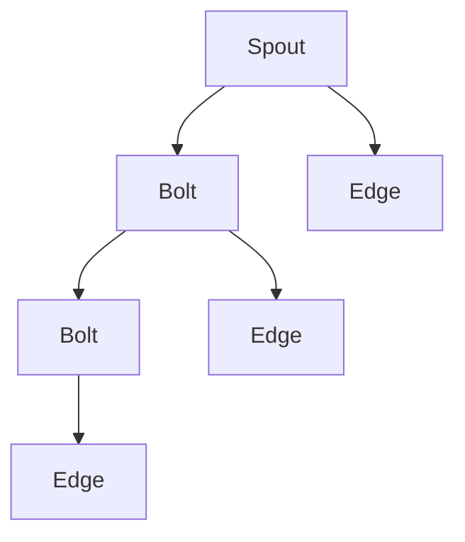

                 

# Storm Trident原理与代码实例讲解

## 1. 背景介绍

### 1.1 问题由来
Storm Trident是一个基于Apache Storm的实时数据处理系统，用于高效处理大规模、高并发的实时数据流。它的设计理念是从数据源到处理引擎，再到数据目的地的端到端数据处理，可以支持复杂、实时、高吞吐量的数据处理任务。

Storm Trident的核心组件包括Spout、Bolt、Topology。Spout负责从数据源中读取数据，Bolt进行数据处理，Topology则负责连接Spout和Bolt，构建整个数据处理流程。通过Spout、Bolt、Topology的组合，可以构建出复杂、高效的数据处理管道。

### 1.2 问题核心关键点
Storm Trident主要解决大规模、高并发的实时数据流处理问题。它的设计理念是从数据源到处理引擎，再到数据目的地的端到端数据处理，支持复杂、实时、高吞吐量的数据处理任务。

Storm Trident的特点包括：
- 高吞吐量：支持每秒处理数亿条数据的能力。
- 低延迟：数据的处理延迟可以控制在毫秒级别。
- 可扩展性：可以水平扩展，支持数千甚至数万个节点。
- 容错性：节点故障时，可以自动重试和恢复，保证数据处理的连续性和可靠性。

## 2. 核心概念与联系

### 2.1 核心概念概述

为更好地理解Storm Trident的工作原理和架构，本节将介绍几个密切相关的核心概念：

- Storm：Apache Storm是一个开源的分布式计算系统，用于实时数据处理。它支持低延迟、高吞吐量的数据流处理，适用于海量、复杂的数据分析任务。
- Topology：Storm Topology是由Spouts、Bolts和Edges组成的有向无环图。它描述了数据流的处理流程，Spout和Bolt通过Edge进行连接，实现数据的传递和处理。
- Spout：Spout是Storm Topology的入口，负责从数据源中读取数据，并生成Tuple流。Spout可以采用多种方式读取数据，如HDFS、Kafka等。
- Bolt：Bolt是Storm Topology中的处理节点，负责对Tuple进行各种处理，如过滤、聚合、计算等。Bolt可以组合使用，构建复杂的数据处理逻辑。
- Edge：Edge是Bolt之间的连接线，用于传递Tuple。Edge可以采用多种方式传递Tuple，如直接传递、并行传递、异步传递等。

这些核心概念之间的逻辑关系可以通过以下Mermaid流程图来展示：



这个流程图展示出Storm Topology的基本组成：

1. 数据源通过Spout读取数据，生成Tuple流。
2. Tuple通过Edge传递给Bolt进行数据处理。
3. Bolt之间通过Edge进行数据传递和连接。
4. 最终，处理后的数据输出到数据目的地。

## 3. 核心算法原理 & 具体操作步骤
### 3.1 算法原理概述

Storm Trident的核心算法原理主要基于实时数据流的处理，通过Spout、Bolt和Edge的组合，构建出复杂、高效的数据处理管道。

Storm Trident的实时数据流处理过程包括以下几个关键步骤：

1. Spout从数据源中读取数据，生成Tuple流。
2. Tuple通过Edge传递给Bolt进行数据处理。
3. Bolt之间通过Edge进行数据传递和连接，构建复杂的数据处理逻辑。
4. 最终，处理后的数据输出到数据目的地。

Storm Trident的实时数据流处理架构可以支持复杂、实时、高吞吐量的数据处理任务，具有高吞吐量、低延迟、可扩展性、容错性等特点。

### 3.2 算法步骤详解

Storm Trident的实时数据流处理步骤如下：

**Step 1: 创建Spout**
Spout负责从数据源中读取数据，生成Tuple流。Spout的实现需要继承BaseRichSpout，并实现nextTuple()方法，用于生成Tuple。

**Step 2: 创建Bolt**
Bolt是Storm Topology中的处理节点，负责对Tuple进行各种处理，如过滤、聚合、计算等。Bolt的实现需要继承RichBolt，并实现execute()方法，用于处理Tuple。

**Step 3: 构建Topology**
Topology是由Spouts、Bolts和Edges组成的有向无环图。它描述了数据流的处理流程，Spout和Bolt通过Edge进行连接，实现数据的传递和处理。

**Step 4: 启动Topology**
通过Storm的主机程序运行Topology，启动数据处理任务。Topology的启动需要设置拓扑的配置信息，包括Spouts、Bolts、Edges等。

**Step 5: 监控Topology**
通过Storm的监控程序，可以实时监控Topology的状态和性能，发现并解决运行中的问题。

Storm Trident的实时数据流处理架构如下图所示：


这个架构展示了Storm Topology的基本组成和数据流处理流程。

### 3.3 算法优缺点

Storm Trident的实时数据流处理架构具有以下优点：

1. 高吞吐量：支持每秒处理数亿条数据的能力，适用于大规模、高并发的数据处理任务。
2. 低延迟：数据的处理延迟可以控制在毫秒级别，适用于实时数据处理需求。
3. 可扩展性：可以水平扩展，支持数千甚至数万个节点，适用于处理海量数据。
4. 容错性：节点故障时，可以自动重试和恢复，保证数据处理的连续性和可靠性。

同时，Storm Trident的实时数据流处理架构也存在以下缺点：

1. 复杂性：构建复杂的Storm Topology需要较高的技术门槛，需要深入理解Spout、Bolt和Edge的实现细节。
2. 开发成本：Storm Trident的开发和部署成本较高，需要一定的技术积累和经验。
3. 数据一致性：由于实时数据流的特性，数据的一致性和一致性保证相对较难实现，需要额外的处理和优化。

## 4. 数学模型和公式 & 详细讲解 & 举例说明

Storm Trident的实时数据流处理架构不需要复杂的数学模型，但可以通过一些概念和公式来加深理解。

**数据流概念**

在Storm Trident中，数据流是一个非常重要的概念。数据流指的是从数据源到处理引擎，再到数据目的地的端到端数据处理流程。数据流可以分为三种类型：

1. 输入流：从数据源读取的数据流。
2. 处理流：经过处理的数据流。
3. 输出流：处理后的数据流输出到数据目的地。

**数据流模型**

在Storm Trident中，数据流模型可以通过Spouts、Bolts和Edges的组合来描述。Spout负责从数据源中读取数据，生成Tuple流。Bolt负责对Tuple进行各种处理，如过滤、聚合、计算等。Edge负责连接Spout和Bolt，实现数据的传递和连接。

数据流模型可以使用以下公式表示：

$$
\text{Tuple} = \text{Spout}(\text{Source}) \rightarrow \text{Bolt}_1 \rightarrow \text{Bolt}_2 \rightarrow ... \rightarrow \text{Edge}_1 \rightarrow \text{Edge}_2 \rightarrow ... \rightarrow \text{Bolt}_n \rightarrow \text{Output}
$$

其中，Source表示数据源，Bolt表示处理节点，Edge表示数据连接线，Tuple表示处理后的数据。

## 5. 项目实践：代码实例和详细解释说明
### 5.1 开发环境搭建

在进行Storm Trident的实践前，我们需要准备好开发环境。以下是使用Python进行Storm Trident开发的环境配置流程：

1. 安装Apache Storm：从官网下载并安装Apache Storm，支持Linux和Windows系统。

2. 安装Storm Trident：从官网下载并安装Storm Trident，支持Java 8及以上版本。

3. 安装MySQL：安装MySQL数据库，用于存储Topology的状态和配置信息。

4. 安装Zookeeper：安装Zookeeper集群，用于管理Storm的分布式状态。

完成上述步骤后，即可在Storm Trident环境中开始实践。

### 5.2 源代码详细实现

下面以Kafka消息处理为例，给出使用Storm Trident对Kafka消息进行处理的完整代码实现。

首先，定义Kafka消息的处理Spout：

```java
public class KafkaSpout extends BaseRichSpout {
    private Consumer<String> consumer;
    private final String topic;
    private final int partition;
    private final String brokerList;
    
    public KafkaSpout(String topic, String brokerList, int partition) {
        this.topic = topic;
        this.brokerList = brokerList;
        this.partition = partition;
    }
    
    @Override
    public void open(Map conf, TopologyContext context, OutputCollector collector) {
        Properties props = new Properties();
        props.put("bootstrap.servers", brokerList);
        props.put("group.id", topic);
        props.put("enable.auto.commit", "false");
        props.put("auto.offset.reset", "earliest");
        
        consumer = new Consumer<>(props);
    }
    
    @Override
    public void nextTuple() {
        try {
            while (consumer.poll()) {
                for (Partition partition : consumer.partitions()) {
                    for (Message<String> msg : partition) {
                        Collector(collector, new Values(msg.value()));
                    }
                }
            }
        } catch (Exception e) {
            log.error("KafkaSpout error", e);
        }
    }
    
    @Override
    public void close() {
        consumer.close();
    }
}
```

然后，定义Kafka消息的处理Bolt：

```java
public class KafkaBolt extends BaseRichBolt {
    private final String outputTopic;
    
    public KafkaBolt(String outputTopic) {
        this.outputTopic = outputTopic;
    }
    
    @Override
    public void execute(Tuple tuple) {
        String message = tuple.getString(0);
        // 对消息进行处理
        Collector(collector, new Values(message));
    }
    
    @Override
    public void declareOutputFields(OutputFieldsDeclarer declarer) {
        declarer.declare(new Fields("message"));
    }
}
```

最后，定义Kafka消息的处理Topology：

```java
public class KafkaTopology {
    private TopologyBuilder builder;
    
    public KafkaTopology(String inputTopic, String outputTopic, String brokerList) {
        builder = new TopologyBuilder();
        builder.setSpout(new KafkaSpout(inputTopic, brokerList, 0));
        builder.setBolt(new KafkaBolt(outputTopic), new Fields("message"), 0).shuffleGrouping(new KafkaSpout(inputTopic, brokerList, 0));
    }
    
    public void submit() {
        Config conf = new Config();
        conf.put(Config.TOPIC, inputTopic);
        conf.put(Config.GROUP_ID, outputTopic);
        conf.put(Config.BROKER_LIST, brokerList);
        conf.put(Config.BACKOFF_MS, 10000);
        conf.put(Config.BATCH_SIZE, 500);
        
        LocalCluster cluster = new LocalCluster();
        cluster.submitTopology(outputTopic, conf, builder.createTopology());
    }
}
```

以上代码展示了使用Storm Trident对Kafka消息进行处理的完整实现，包括Spout、Bolt和Topology的创建和提交。

### 5.3 代码解读与分析

让我们再详细解读一下关键代码的实现细节：

**KafkaSpout类**

- `open()`方法：在Spout开启时，初始化Kafka的Consumer，读取消息。
- `nextTuple()`方法：循环读取Kafka消息，并将消息输出到Bolt处理。
- `close()`方法：在Spout关闭时，关闭Kafka的Consumer。

**KafkaBolt类**

- `execute()`方法：处理Kafka消息，并将处理结果输出到 collector。
- `declareOutputFields()`方法：声明输出字段，用于将处理结果输出到下一Bolt或数据目的地。

**KafkaTopology类**

- `submit()`方法：构建Topology，并将其提交到Storm集群进行执行。

可以看到，通过Spout、Bolt和Topology的组合，我们可以方便地构建出复杂、高效的数据处理管道，实现对Kafka消息的实时处理。

## 6. 实际应用场景

### 6.1 实时数据监控

Storm Trident可以用于实时监控各种系统状态，如日志监控、网络监控、告警监控等。通过收集系统的各种日志数据，使用Spout读取数据，Bolt对数据进行处理和分析，可以将实时监控信息输出到告警系统、仪表盘等，帮助运维人员及时发现和解决问题。

### 6.2 实时数据处理

Storm Trident可以用于实时数据处理，如实时计算、实时分析等。通过Spout读取实时数据，Bolt对数据进行处理和分析，可以实现复杂的实时数据处理任务，如实时计算、实时分析、实时报告等。

### 6.3 实时数据清洗

Storm Trident可以用于实时数据清洗，如实时去重、实时过滤等。通过Spout读取数据，Bolt对数据进行处理和过滤，可以去除重复数据、过滤无用数据，提高数据质量。

### 6.4 未来应用展望

随着Storm Trident的不断发展，未来的应用场景将更加广泛，如实时推荐系统、实时广告投放、实时金融分析等。通过Spout读取实时数据，Bolt对数据进行处理和分析，可以实现复杂的实时数据处理任务，为各种业务提供实时、高效、可靠的数据服务。

## 7. 工具和资源推荐
### 7.1 学习资源推荐

为了帮助开发者系统掌握Storm Trident的理论基础和实践技巧，这里推荐一些优质的学习资源：

1. Apache Storm官方文档：官方文档是学习和使用Storm Trident的最佳入门途径，详细介绍了Storm Trident的各个组件和功能。

2. Storm Trident实战指南：一本系统介绍Storm Trident的实战指南，涵盖了Storm Trident的各个组件和功能，适合实战开发和部署。

3. Kafka与Apache Storm实战：一本系统介绍Kafka与Storm Trident结合的实战指南，详细介绍了Kafka与Storm Trident的结合应用，适合构建实时数据处理系统。

4. Storm Trident设计与实践：一篇关于Storm Trident的设计与实践的文章，详细介绍了Storm Trident的设计理念和实践经验，适合深度学习和实践。

5. Storm Trident源码分析：一篇关于Storm Trident源码的分析文章，详细介绍了Storm Trident的源码实现，适合深入理解Storm Trident的内部机制。

通过对这些资源的学习实践，相信你一定能够快速掌握Storm Trident的精髓，并用于解决实际的实时数据处理问题。

### 7.2 开发工具推荐

高效的开发离不开优秀的工具支持。以下是几款用于Storm Trident开发的常用工具：

1. Eclipse：用于编写和调试Storm Trident代码。

2. IntelliJ IDEA：用于编写和调试Storm Trident代码，支持实时调试和性能分析。

3. Kafka：用于提供实时数据源，支持高吞吐量、低延迟的数据传输。

4. Zookeeper：用于管理Storm的分布式状态，支持高可用性和故障恢复。

5. mysql：用于存储Topology的状态和配置信息，支持高可靠性和数据一致性。

合理利用这些工具，可以显著提升Storm Trident的开发效率，加快创新迭代的步伐。

### 7.3 相关论文推荐

Storm Trident的发展源于学界的持续研究。以下是几篇奠基性的相关论文，推荐阅读：

1. Storm: Distributed Real-time Computation System：Apache Storm的原始论文，详细介绍了Storm的架构和设计思想。

2. Apache Storm Trident: A Framework for Event Processing at Scale：Apache Storm Trident的原始论文，详细介绍了Storm Trident的架构和设计思想。

3. Storm Trident: A System for Real-Time Event Processing at Scale：一篇关于Storm Trident的学术论文，详细介绍了Storm Trident的设计理念和实现细节。

4. Real-time Big Data Analysis with Apache Storm Trident：一篇关于Storm Trident的应用案例，详细介绍了Storm Trident在实时数据处理中的应用。

5. Kafka with Apache Storm Trident: A Tutorial：一篇关于Kafka与Storm Trident结合的实战教程，详细介绍了Kafka与Storm Trident的结合应用。

这些论文代表了大数据处理的发展脉络。通过学习这些前沿成果，可以帮助研究者把握学科前进方向，激发更多的创新灵感。

## 8. 总结：未来发展趋势与挑战

### 8.1 总结

本文对Storm Trident的实时数据流处理架构进行了全面系统的介绍。首先阐述了Storm Trident的研究背景和意义，明确了实时数据流处理在工业界和学术界的重要地位。其次，从原理到实践，详细讲解了实时数据流的处理流程，给出了实时数据处理系统的完整代码实例。同时，本文还广泛探讨了Storm Trident在各种场景下的应用前景，展示了实时数据处理架构的广泛应用。

通过本文的系统梳理，可以看到，Storm Trident的实时数据流处理架构正在成为大数据处理的重要范式，极大地拓展了数据处理的边界，催生了更多的落地场景。未来，伴随大数据技术的持续演进，实时数据处理技术还将不断拓展，为各行各业带来更多的智能化应用。

### 8.2 未来发展趋势

展望未来，Storm Trident的实时数据流处理架构将呈现以下几个发展趋势：

1. 实时数据处理的规模化和标准化：随着大数据技术的不断发展，实时数据处理的规模化和标准化将成为趋势，Storm Trident将扮演越来越重要的角色。

2. 实时数据处理的高性能和大容量：实时数据处理的需求将越来越复杂，需要更高的性能和更大的容量支持，Storm Trident将通过分布式、高效的架构设计，不断提升性能和容量。

3. 实时数据处理的智能化和自动化：实时数据处理的任务将越来越多，需要更高的智能化和自动化支持，Storm Trident将通过引入机器学习、人工智能等技术，提升智能化和自动化水平。

4. 实时数据处理的安全性和可靠性：实时数据处理对安全性、可靠性要求很高，需要更高的安全性和可靠性支持，Storm Trident将通过引入安全机制、容错机制等技术，提升安全性和可靠性。

5. 实时数据处理的多模态融合：实时数据处理的场景将越来越多，需要更多模态的数据融合，Storm Trident将通过引入多模态数据融合技术，提升数据处理的广度和深度。

以上趋势凸显了Storm Trident的实时数据流处理架构的广阔前景。这些方向的探索发展，必将进一步提升实时数据处理系统的性能和应用范围，为各行各业带来更多的智能化应用。

### 8.3 面临的挑战

尽管Storm Trident的实时数据流处理架构已经取得了瞩目成就，但在迈向更加智能化、普适化应用的过程中，它仍面临着诸多挑战：

1. 开发复杂性：构建复杂的Storm Topology需要较高的技术门槛，需要深入理解Spout、Bolt和Edge的实现细节。

2. 数据一致性：由于实时数据流的特性，数据的一致性和一致性保证相对较难实现，需要额外的处理和优化。

3. 高吞吐量和低延迟的平衡：高吞吐量和低延迟是实时数据处理的重要需求，需要在性能和延迟之间进行平衡。

4. 扩展性和容错性：需要设计高扩展性和高容错性的系统架构，保证系统的高可用性和稳定性。

5. 实时数据处理的安全性和可靠性：实时数据处理对安全性、可靠性要求很高，需要更高的安全性和可靠性支持。

6. 实时数据处理的智能化和自动化：实时数据处理的任务将越来越多，需要更高的智能化和自动化支持。

这些挑战需要研究者不断探索和优化，以实现更高效的实时数据处理。

### 8.4 研究展望

面对Storm Trident所面临的挑战，未来的研究需要在以下几个方面寻求新的突破：

1. 引入机器学习、人工智能等技术，提升实时数据处理的智能化和自动化水平。

2. 设计高扩展性、高容错性的系统架构，保证系统的高可用性和稳定性。

3. 引入数据一致性和一致性保证技术，提高实时数据处理的一致性和可靠性。

4. 优化高吞吐量和低延迟之间的平衡，提高实时数据处理的性能和效率。

5. 引入多模态数据融合技术，提升实时数据处理的广度和深度。

6. 引入安全机制、容错机制等技术，提升实时数据处理的安全性和可靠性。

这些研究方向将引领Storm Trident的实时数据流处理架构不断演进，为实时数据处理系统的性能和应用范围带来新的突破。

## 9. 附录：常见问题与解答

**Q1：Storm Trident适用于哪些数据处理任务？**

A: Storm Trident适用于各种实时数据处理任务，如实时计算、实时分析、实时推荐、实时监控等。通过Spout读取数据，Bolt对数据进行处理和分析，可以实现复杂的实时数据处理任务。

**Q2：Storm Trident的扩展性如何？**

A: Storm Trident具有高扩展性，可以水平扩展到数千甚至数万个节点。通过增加节点，可以提高实时数据处理的吞吐量和处理能力。

**Q3：Storm Trident的处理延迟如何？**

A: Storm Trident的处理延迟可以控制在毫秒级别，适用于实时数据处理需求。

**Q4：Storm Trident的可靠性如何？**

A: Storm Trident具有高可靠性，节点故障时，可以自动重试和恢复，保证数据处理的连续性和可靠性。

**Q5：Storm Trident的性能如何？**

A: Storm Trident具有高吞吐量和低延迟，支持每秒处理数亿条数据的能力。

这些问题的答案可以帮助你更好地了解Storm Trident的性能、扩展性和可靠性，从而更好地应用到实际项目中。

---

作者：禅与计算机程序设计艺术 / Zen and the Art of Computer Programming

