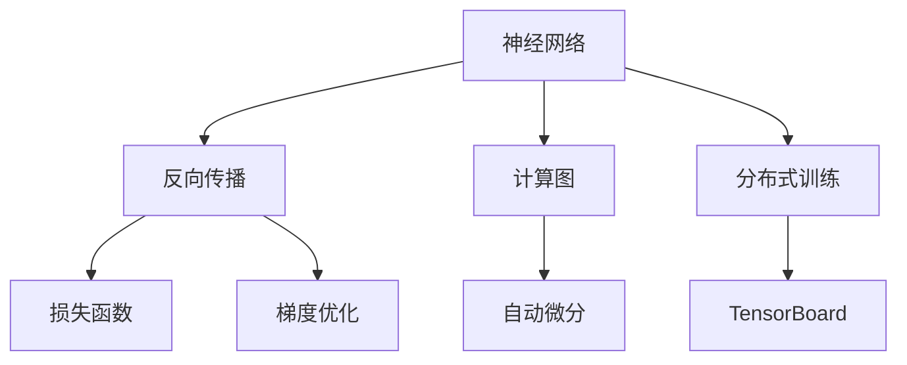

                 

# TensorFlow深度学习框架：从入门到精通

> 关键词：TensorFlow,深度学习,神经网络,计算图,自动微分,模型优化,学习资源推荐,开发工具推荐,未来发展趋势

## 1. 背景介绍

### 1.1 问题由来
深度学习技术在过去十年中迅速崛起，成为人工智能领域的主流技术之一。它通过构建复杂的神经网络模型，自动学习和提取数据中的高级特征，在图像识别、语音识别、自然语言处理等众多领域取得了显著成果。然而，构建深度学习模型并不是一件易事，特别是在面对大规模、高维度的数据时，设计、调试和优化模型变得异常复杂。

为了降低深度学习模型的开发门槛，谷歌于2015年推出了开源的深度学习框架TensorFlow，成为全球使用最广泛的深度学习平台之一。本文将从入门到精通，系统介绍TensorFlow深度学习框架的核心概念、核心算法原理和具体操作步骤，并结合实际项目进行详细讲解，旨在帮助读者全面掌握TensorFlow的使用，加速其在实际应用中的落地。

### 1.2 问题核心关键点
- TensorFlow简介：介绍TensorFlow的架构、优势、应用场景等。
- 深度学习核心概念：神经网络、反向传播、损失函数、梯度优化等。
- TensorFlow核心特性：计算图、自动微分、分布式训练、TensorBoard等。
- 项目实践：提供代码实例，详细解释每行代码的作用和原理。
- 实际应用场景：讨论TensorFlow在图像识别、自然语言处理、语音识别等领域的实际应用。
- 未来发展趋势：探讨TensorFlow未来的发展方向和面临的挑战。

通过系统学习TensorFlow的各项特性和应用，相信读者能够全面掌握深度学习模型的构建、训练和优化，加速其在实际项目中的开发和部署。

## 2. 核心概念与联系

### 2.1 核心概念概述

为了更好地理解TensorFlow的工作原理和核心特性，本节将介绍几个密切相关的核心概念：

- **神经网络(Neural Network)**：深度学习模型最基本的结构，由多个层次的神经元组成，每个神经元接收输入、进行加权和激活，输出到下一层。
- **反向传播(Backpropagation)**：通过链式法则计算模型参数的梯度，反向传播误差信号，用于优化模型参数，是深度学习训练的基础。
- **损失函数(Loss Function)**：用于衡量模型预测与真实标签之间的差异，常见的有均方误差、交叉熵等。
- **梯度优化(Optimization)**：通过梯度下降等优化算法，最小化损失函数，更新模型参数。
- **计算图(Computation Graph)**：TensorFlow的核心理念之一，通过静态计算图模型定义计算流程，支持自动微分和分布式训练。
- **自动微分(Automatic Differentiation)**：自动计算模型参数的梯度，减少手工求导的工作量。
- **分布式训练(Distributed Training)**：通过多台机器协同训练，加速深度学习模型的训练过程，支持模型并行和数据并行。
- **TensorBoard**：TensorFlow的可视化工具，用于监控模型训练过程，分析模型性能。

这些核心概念共同构成了TensorFlow深度学习框架的基础，使得TensorFlow在深度学习模型的构建、训练和优化中发挥了重要作用。

### 2.2 核心概念原理和架构的 Mermaid 流程图



这个流程图展示了一些核心概念之间的逻辑关系：

1. 神经网络作为深度学习的基础结构，接收输入数据，通过多个层次的神经元进行特征提取和转化。
2. 反向传播通过链式法则计算模型参数的梯度，并将误差信号回传至每个神经元。
3. 损失函数衡量模型预测与真实标签之间的差异，用于指导优化算法更新模型参数。
4. 梯度优化通过梯度下降等方法最小化损失函数，更新模型参数。
5. 计算图是TensorFlow的核心特性，通过静态图定义计算流程，支持自动微分和分布式训练。
6. 自动微分自动计算模型参数的梯度，减少手工求导的复杂度。
7. 分布式训练通过多台机器协同训练，加速模型训练。
8. TensorBoard用于监控模型训练过程，分析模型性能。

## 3. 核心算法原理 & 具体操作步骤
### 3.1 算法原理概述

TensorFlow深度学习框架的核心算法原理可以归纳为以下几个方面：

- **计算图(Computation Graph)**：TensorFlow通过静态计算图模型定义计算流程，支持自动微分和分布式训练。
- **自动微分(Automatic Differentiation)**：TensorFlow自动计算模型参数的梯度，使得反向传播变得简单高效。
- **分布式训练(Distributed Training)**：TensorFlow支持多台机器协同训练，加速深度学习模型的训练过程。
- **模型优化(Optimization)**：通过梯度下降等优化算法，最小化损失函数，更新模型参数。

这些核心算法共同构成了TensorFlow深度学习框架的强大功能，使其在深度学习模型的构建、训练和优化中发挥了重要作用。

### 3.2 算法步骤详解

以下是使用TensorFlow进行深度学习模型构建、训练和优化的一般步骤：

**Step 1: 数据预处理**

- 加载数据集：使用TensorFlow的`tf.data.Dataset`接口，将数据集转换为TensorFlow可处理的格式。
- 数据增强：对数据进行随机裁剪、旋转、缩放等增强操作，增加数据集的多样性。
- 数据标准化：对数据进行标准化处理，如归一化、中心化等，确保数据在模型中的表示一致。

**Step 2: 模型构建**

- 定义计算图：使用TensorFlow的`tf.keras.Sequential`或`tf.keras.layers`构建计算图。
- 添加神经网络层：添加全连接层、卷积层、池化层、循环层等神经网络层。
- 定义损失函数：根据具体任务选择损失函数，如均方误差、交叉熵等。
- 定义优化器：选择梯度优化算法，如Adam、SGD等。

**Step 3: 模型训练**

- 定义训练循环：使用`for`循环或`while`循环定义训练循环。
- 前向传播：将输入数据通过模型进行前向传播，计算模型输出。
- 计算损失：将模型输出与真实标签计算损失函数。
- 反向传播：使用自动微分计算模型参数的梯度。
- 更新模型：使用优化器更新模型参数。

**Step 4: 模型评估**

- 加载测试数据集：将测试数据集转换为TensorFlow可处理的格式。
- 计算预测：将测试数据输入模型，计算模型预测结果。
- 计算评估指标：根据具体任务选择评估指标，如准确率、精确率、召回率等。

**Step 5: 模型部署**

- 导出模型：使用`tf.saved_model`接口将模型导出为 SavedModel 格式。
- 加载模型：使用 TensorFlow Serving 或其他部署工具加载模型。
- 进行推理：将新的输入数据输入模型，获取模型预测结果。

以上是使用TensorFlow进行深度学习模型构建、训练和优化的一般流程。在实际应用中，还需要针对具体任务的特点，对每一步进行优化设计，如改进数据增强策略、调整模型结构、选择适当的优化器等，以进一步提升模型性能。

### 3.3 算法优缺点

TensorFlow深度学习框架具有以下优点：

- **灵活性高**：支持多种神经网络结构，支持自定义层，满足不同任务的需求。
- **自动计算梯度**：自动计算模型参数的梯度，减少了手工求导的工作量。
- **分布式训练**：支持多台机器协同训练，加速模型训练过程。
- **可视化工具丰富**：提供TensorBoard可视化工具，方便监控模型训练过程。
- **社区活跃**：拥有庞大的社区支持，丰富的资源和文档。

同时，TensorFlow也有一些缺点：

- **学习曲线陡峭**：TensorFlow的计算图结构较为复杂，新手学习成本较高。
- **性能问题**：在处理大规模数据时，计算图频繁重构可能导致性能下降。
- **内存占用**：在计算图中存储大量的中间变量，可能导致内存占用较大。

尽管存在这些缺点，TensorFlow凭借其强大的功能和丰富的资源，依然是深度学习开发的主流框架。未来，通过不断优化和改进，TensorFlow必将在深度学习领域发挥更大的作用。

### 3.4 算法应用领域

TensorFlow深度学习框架已经在众多领域得到了广泛应用，包括但不限于以下几个方面：

- **计算机视觉**：图像分类、目标检测、人脸识别等任务。通过卷积神经网络(CNN)实现。
- **自然语言处理**：文本分类、机器翻译、问答系统等任务。通过循环神经网络(RNN)、长短期记忆网络(LSTM)、Transformer等实现。
- **语音识别**：语音识别、语音合成等任务。通过卷积神经网络(CNN)和循环神经网络(RNN)实现。
- **推荐系统**：协同过滤、基于内容的推荐等任务。通过神经网络模型实现。
- **游戏AI**：策略游戏、动作游戏等任务。通过强化学习、卷积神经网络(CNN)等实现。
- **医疗健康**：医学影像分析、病历分析等任务。通过卷积神经网络(CNN)和循环神经网络(RNN)实现。
- **金融分析**：股票预测、风险评估等任务。通过神经网络模型实现。

除了上述这些领域，TensorFlow还在科学研究、智能制造、交通管理等众多领域得到了广泛应用。随着TensorFlow功能的不断拓展和优化，其应用范围还将进一步扩大。

## 4. 数学模型和公式 & 详细讲解 & 举例说明

### 4.1 数学模型构建

TensorFlow深度学习模型的数学模型可以简化为一个计算图，其中包含输入、中间变量和输出。下面以一个简单的线性回归模型为例，展示TensorFlow模型的构建过程。

```python
import tensorflow as tf

# 定义输入和标签
x = tf.placeholder(tf.float32, shape=[None, 1])
y = tf.placeholder(tf.float32, shape=[None, 1])

# 定义模型参数
w = tf.Variable(tf.zeros([1, 1]))
b = tf.Variable(tf.zeros([1]))

# 定义模型输出
output = tf.matmul(x, w) + b

# 定义损失函数
loss = tf.reduce_mean(tf.square(output - y))

# 定义优化器
optimizer = tf.train.GradientDescentOptimizer(learning_rate=0.01)
train_op = optimizer.minimize(loss)
```

在这个例子中，我们首先定义了输入 `x` 和标签 `y`，然后使用 `tf.Variable` 定义了模型参数 `w` 和 `b`。接着，我们使用 `tf.matmul` 进行矩阵乘法计算，得到模型输出 `output`。最后，我们使用均方误差损失函数 `tf.reduce_mean(tf.square(output - y))` 定义损失函数 `loss`，并使用梯度下降优化器 `tf.train.GradientDescentOptimizer` 最小化损失函数，得到训练操作 `train_op`。

### 4.2 公式推导过程

对于线性回归模型，我们希望找到一个线性函数 `y = wx + b`，使得模型输出 `y_hat` 与真实标签 `y` 之间的误差最小化。为此，我们定义损失函数：

$$
J(w, b) = \frac{1}{2m} \sum_{i=1}^{m} (y^{(i)} - y_{\hat{i}})^2
$$

其中，`m` 表示样本数量，`y^{(i)}` 表示第 `i` 个样本的真实标签，`y_{\hat{i}}` 表示模型对第 `i` 个样本的预测结果。

梯度下降优化算法通过计算损失函数对模型参数 `w` 和 `b` 的梯度，更新模型参数。对于损失函数 `J(w, b)`，其梯度为：

$$
\frac{\partial J}{\partial w} = \frac{1}{m} \sum_{i=1}^{m} (y^{(i)} - y_{\hat{i}})x^{(i)}
$$

$$
\frac{\partial J}{\partial b} = \frac{1}{m} \sum_{i=1}^{m} (y^{(i)} - y_{\hat{i}})
$$

使用梯度下降优化算法更新模型参数：

$$
w_{new} = w - \eta \frac{\partial J}{\partial w}
$$

$$
b_{new} = b - \eta \frac{\partial J}{\partial b}
$$

其中，`η` 表示学习率，`w_new` 和 `b_new` 表示更新后的模型参数。

### 4.3 案例分析与讲解

我们以一个简单的图像分类任务为例，展示如何使用TensorFlow进行模型训练和评估。

```python
import tensorflow as tf
from tensorflow.keras.datasets import mnist

# 加载数据集
(x_train, y_train), (x_test, y_test) = mnist.load_data()

# 数据预处理
x_train = x_train.reshape((x_train.shape[0], 28, 28, 1))
x_test = x_test.reshape((x_test.shape[0], 28, 28, 1))
x_train = x_train.astype('float32') / 255
x_test = x_test.astype('float32') / 255

# 定义模型
model = tf.keras.models.Sequential([
    tf.keras.layers.Conv2D(32, (3, 3), activation='relu', input_shape=(28, 28, 1)),
    tf.keras.layers.MaxPooling2D((2, 2)),
    tf.keras.layers.Flatten(),
    tf.keras.layers.Dense(10, activation='softmax')
])

# 编译模型
model.compile(optimizer='adam', loss='sparse_categorical_crossentropy', metrics=['accuracy'])

# 训练模型
model.fit(x_train, y_train, epochs=5, validation_data=(x_test, y_test))

# 评估模型
model.evaluate(x_test, y_test)
```

在这个例子中，我们使用MNIST数据集进行图像分类任务。首先，我们加载数据集并对其进行预处理，将图像数据转换为张量形式并归一化。接着，我们使用 `tf.keras.Sequential` 定义了卷积神经网络模型，并使用 `tf.keras.layers` 添加卷积层、池化层和全连接层。然后，我们使用 `tf.keras.models.Sequential` 编译模型，指定优化器、损失函数和评估指标。最后，我们使用 `model.fit` 进行模型训练，并在测试集上评估模型性能。

## 5. 项目实践：代码实例和详细解释说明
### 5.1 开发环境搭建

在使用TensorFlow进行深度学习开发前，需要先搭建开发环境。以下是使用Python进行TensorFlow开发的环境配置流程：

1. 安装Anaconda：从官网下载并安装Anaconda，用于创建独立的Python环境。
```bash
conda create -n tf-env python=3.8 
conda activate tf-env
```

2. 安装TensorFlow：根据CUDA版本，从官网获取对应的安装命令。例如：
```bash
conda install tensorflow -c pytorch -c conda-forge
```

3. 安装各类工具包：
```bash
pip install numpy pandas scikit-learn matplotlib tqdm jupyter notebook ipython
```

完成上述步骤后，即可在`tf-env`环境中开始TensorFlow开发实践。

### 5.2 源代码详细实现

下面我们以一个简单的图像分类任务为例，给出使用TensorFlow进行模型构建、训练和评估的PyTorch代码实现。

```python
import tensorflow as tf
from tensorflow.keras.datasets import mnist

# 加载数据集
(x_train, y_train), (x_test, y_test) = mnist.load_data()

# 数据预处理
x_train = x_train.reshape((x_train.shape[0], 28, 28, 1))
x_test = x_test.reshape((x_test.shape[0], 28, 28, 1))
x_train = x_train.astype('float32') / 255
x_test = x_test.astype('float32') / 255

# 定义模型
model = tf.keras.models.Sequential([
    tf.keras.layers.Conv2D(32, (3, 3), activation='relu', input_shape=(28, 28, 1)),
    tf.keras.layers.MaxPooling2D((2, 2)),
    tf.keras.layers.Flatten(),
    tf.keras.layers.Dense(10, activation='softmax')
])

# 编译模型
model.compile(optimizer='adam', loss='sparse_categorical_crossentropy', metrics=['accuracy'])

# 训练模型
model.fit(x_train, y_train, epochs=5, validation_data=(x_test, y_test))

# 评估模型
model.evaluate(x_test, y_test)
```

在这个例子中，我们首先使用`mnist.load_data()`加载MNIST数据集，并对图像数据进行预处理。接着，我们使用 `tf.keras.Sequential` 定义了卷积神经网络模型，并使用 `tf.keras.layers` 添加卷积层、池化层和全连接层。然后，我们使用 `tf.keras.models.Sequential` 编译模型，指定优化器、损失函数和评估指标。最后，我们使用 `model.fit` 进行模型训练，并在测试集上评估模型性能。

### 5.3 代码解读与分析

让我们再详细解读一下关键代码的实现细节：

**数据预处理**：
- `x_train = x_train.reshape((x_train.shape[0], 28, 28, 1))`：将输入数据从向量形式转换为张量形式，增加通道维度，使其符合卷积神经网络的输入要求。
- `x_train = x_train.astype('float32') / 255`：将输入数据归一化到[0,1]之间，防止梯度爆炸。

**模型定义**：
- `tf.keras.models.Sequential`：使用 `tf.keras.Sequential` 定义模型，支持动态图构建。
- `tf.keras.layers.Conv2D`：添加卷积层，进行特征提取。
- `tf.keras.layers.MaxPooling2D`：添加池化层，减少特征维度。
- `tf.keras.layers.Flatten`：将张量展开为向量形式，方便全连接层处理。
- `tf.keras.layers.Dense`：添加全连接层，进行分类。

**模型编译**：
- `model.compile(optimizer='adam', loss='sparse_categorical_crossentropy', metrics=['accuracy'])`：指定优化器、损失函数和评估指标，准备模型训练。

**模型训练**：
- `model.fit(x_train, y_train, epochs=5, validation_data=(x_test, y_test))`：使用 `model.fit` 进行模型训练，指定训练轮数和验证集。

**模型评估**：
- `model.evaluate(x_test, y_test)`：使用 `model.evaluate` 评估模型性能，输出模型在测试集上的准确率。

可以看到，TensorFlow的代码实现简洁高效，开发者可以专注于模型设计、数据处理等核心逻辑，而不必过多关注底层实现细节。

当然，工业级的系统实现还需考虑更多因素，如模型的保存和部署、超参数的自动搜索、更灵活的任务适配层等。但核心的TensorFlow开发范式基本与此类似。

## 6. 实际应用场景
### 6.1 智能推荐系统

TensorFlow在推荐系统中得到了广泛应用，可以帮助电商平台、社交媒体平台等企业构建个性化的推荐系统。通过深度学习模型，推荐系统可以根据用户的历史行为、兴趣偏好，实时推荐用户可能感兴趣的商品、内容等。

在技术实现上，可以收集用户浏览、点击、评价等行为数据，提取和用户交互的物品标题、描述、标签等文本内容。使用TensorFlow构建神经网络模型，进行用户行为预测，生成推荐列表。同时，可以采用分布式训练加速模型训练，确保实时推荐效果。

### 6.2 自动驾驶

TensorFlow在自动驾驶领域也具有重要应用，可以用于驾驶行为预测、路径规划、障碍物检测等任务。通过深度学习模型，自动驾驶系统可以实时感知周围环境，做出合理的驾驶决策。

在技术实现上，可以采用卷积神经网络、循环神经网络等深度学习模型，对摄像头、雷达等传感器数据进行特征提取和处理。使用TensorFlow构建神经网络模型，进行行为预测和路径规划。同时，可以采用分布式训练和模型压缩技术，优化模型性能和计算效率。

### 6.3 医疗影像分析

TensorFlow在医疗影像分析领域也具有重要应用，可以用于医学影像分类、肿瘤检测等任务。通过深度学习模型，医疗影像分析系统可以自动识别和标注医学影像，辅助医生诊断和治疗。

在技术实现上，可以采用卷积神经网络、U-Net等深度学习模型，对医学影像进行分类和分割。使用TensorFlow构建神经网络模型，进行医学影像分析。同时，可以采用模型集成和迁移学习等技术，提升模型的诊断准确率。

### 6.4 未来应用展望

随着TensorFlow功能的不断拓展和优化，其在深度学习领域的适用性将进一步增强。未来，TensorFlow将在更多领域得到应用，为各行各业带来新的变革。

在科学研究中，TensorFlow将加速科学研究进程，帮助科学家进行数据建模和分析。在智能制造中，TensorFlow将加速生产流程的优化和智能化。在交通管理中，TensorFlow将优化交通流量管理，提升城市交通效率。

随着TensorFlow功能的不断完善，其应用范围将进一步扩大，为各行各业带来新的变革。

## 7. 工具和资源推荐
### 7.1 学习资源推荐

为了帮助开发者系统掌握TensorFlow深度学习框架的理论基础和实践技巧，这里推荐一些优质的学习资源：

1. TensorFlow官方文档：详细介绍了TensorFlow的核心概念、核心特性、API接口等，是TensorFlow开发的首选文档。
2. CS231n《深度学习计算机视觉》课程：斯坦福大学开设的深度学习课程，有Lecture视频和配套作业，介绍深度学习在计算机视觉中的应用。
3. Deep Learning Specialization课程：由Andrew Ng教授开设的深度学习课程，介绍深度学习的基础理论、框架和应用。
4. TensorFlow官方博客：提供了丰富的TensorFlow开发经验、项目案例、技术文章等。
5. GitHub上的TensorFlow项目：提供了大量的TensorFlow代码示例、项目实现、论文代码等，方便开发者学习和参考。

通过对这些资源的学习实践，相信你一定能够全面掌握TensorFlow深度学习框架的使用，加速其在实际应用中的落地。

### 7.2 开发工具推荐

高效的开发离不开优秀的工具支持。以下是几款用于TensorFlow深度学习开发的工具：

1. Jupyter Notebook：基于Python的交互式开发环境，方便开发者编写和运行TensorFlow代码。
2. TensorBoard：TensorFlow的可视化工具，用于监控模型训练过程，分析模型性能。
3. Anaconda：Python环境管理工具，方便开发者创建和管理Python环境。
4. Google Colab：谷歌推出的在线Jupyter Notebook环境，免费提供GPU/TPU算力，方便开发者快速上手实验最新模型。
5. PyTorch：基于Python的开源深度学习框架，与TensorFlow竞争激烈，在动态图构建和模型优化方面具有优势。

合理利用这些工具，可以显著提升TensorFlow深度学习模型的开发效率，加快创新迭代的步伐。

### 7.3 相关论文推荐

TensorFlow深度学习框架的发展源于学界的持续研究。以下是几篇奠基性的相关论文，推荐阅读：

1. TensorFlow: A System for Large-Scale Machine Learning：TensorFlow的创始人论文，介绍了TensorFlow的设计理念和核心特性。
2. Efficient Estimation of TensorFlow Operations：TensorFlow的优化论文，介绍TensorFlow的计算图优化技术。
3. TensorFlow and Brain：TensorFlow在分布式深度学习中的应用论文，介绍TensorFlow的分布式训练技术。
4. TensorFlow and Brain：TensorFlow在自然语言处理中的应用论文，介绍TensorFlow在NLP任务中的应用。
5. TensorFlow Serving：TensorFlow在模型服务中的应用论文，介绍TensorFlow的模型部署技术。

这些论文代表了大规模深度学习模型的发展脉络，对TensorFlow的全面理解具有重要意义。

## 8. 总结：未来发展趋势与挑战

### 8.1 总结

本文对TensorFlow深度学习框架的核心概念、核心算法原理和具体操作步骤进行了全面系统介绍。首先阐述了TensorFlow的架构、优势、应用场景等。其次，从原理到实践，详细讲解了TensorFlow的核心特性和应用流程，并结合实际项目进行详细讲解。最后，讨论了TensorFlow在各个领域的实际应用，展示了TensorFlow的强大潜力。

通过本文的系统梳理，相信读者能够全面掌握TensorFlow深度学习框架的使用，加速其在实际项目中的开发和部署。

### 8.2 未来发展趋势

展望未来，TensorFlow深度学习框架将呈现以下几个发展趋势：

1. **模型自动化**：未来的深度学习模型将更加自动化，通过模型压缩、模型蒸馏等技术，实现模型自动构建和优化。
2. **多模态学习**：未来的深度学习模型将更加注重多模态数据的融合，实现视觉、语音、文本等多模态数据的协同建模。
3. **分布式训练**：未来的深度学习模型将更加注重分布式训练，通过分布式计算技术，加速模型训练过程。
4. **实时推理**：未来的深度学习模型将更加注重实时推理，通过模型优化和推理加速技术，实现实时推理效果。
5. **模型部署**：未来的深度学习模型将更加注重模型部署，通过模型微调、模型压缩等技术，优化模型部署效率。

以上趋势凸显了TensorFlow深度学习框架的强大功能，必将推动深度学习技术向更加智能化、自动化、实时化的方向发展。

### 8.3 面临的挑战

尽管TensorFlow深度学习框架已经取得了瞩目成就，但在迈向更加智能化、自动化应用的过程中，它仍面临诸多挑战：

1. **学习曲线陡峭**：TensorFlow的计算图结构较为复杂，新手学习成本较高。
2. **性能问题**：在处理大规模数据时，计算图频繁重构可能导致性能下降。
3. **内存占用**：在计算图中存储大量的中间变量，可能导致内存占用较大。
4. **模型复杂度**：在处理复杂任务时，模型复杂度较高，需要大量时间和资源进行训练和优化。
5. **模型可解释性**：深度学习模型的决策过程通常缺乏可解释性，难以对其推理逻辑进行分析和调试。
6. **数据隐私问题**：在处理敏感数据时，数据隐私问题需要得到充分考虑，以确保数据安全和用户隐私。

尽管存在这些挑战，TensorFlow凭借其强大的功能和丰富的资源，依然是深度学习开发的主流框架。未来，通过不断优化和改进，TensorFlow必将在深度学习领域发挥更大的作用。

### 8.4 研究展望

面向未来，TensorFlow深度学习框架需要在以下几个方面进行深入研究：

1. **自动化模型构建**：开发自动化模型构建工具，通过模型压缩、模型蒸馏等技术，实现模型自动构建和优化。
2. **多模态数据融合**：研究多模态数据的协同建模方法，实现视觉、语音、文本等多模态数据的融合。
3. **分布式训练优化**：优化分布式训练算法和策略，提高模型训练效率和稳定性。
4. **实时推理技术**：开发实时推理技术，提高模型的实时推理性能和响应速度。
5. **模型可解释性**：开发模型可解释性工具，增强模型决策过程的透明性和可理解性。
6. **数据隐私保护**：研究数据隐私保护技术，确保数据安全和用户隐私。

这些研究方向的探索，必将推动TensorFlow深度学习框架向更加智能化、自动化、实时化的方向发展，为各行各业带来新的变革。

## 9. 附录：常见问题与解答

**Q1：TensorFlow支持哪些深度学习模型？**

A: TensorFlow支持多种深度学习模型，包括但不限于卷积神经网络(CNN)、循环神经网络(RNN)、长短期记忆网络(LSTM)、Transformer等。

**Q2：如何提高TensorFlow模型的训练速度？**

A: 可以通过以下方法提高TensorFlow模型的训练速度：
1. 使用GPU或TPU进行模型训练，加速计算过程。
2. 采用模型并行和数据并行技术，提高训练效率。
3. 使用分布式训练，利用多台机器协同训练，加速模型训练。
4. 使用模型压缩和量化技术，减小模型参数和计算量。
5. 使用更高效的优化器算法，如Adam、Adafactor等。

**Q3：TensorFlow如何进行模型优化？**

A: 可以使用以下方法进行TensorFlow模型的优化：
1. 使用梯度下降等优化算法，最小化损失函数。
2. 使用正则化技术，如L2正则、Dropout等，防止过拟合。
3. 使用模型压缩和量化技术，减小模型参数和计算量。
4. 使用模型蒸馏技术，提高模型泛化能力。
5. 使用分布式训练，提高模型训练效率。

**Q4：TensorFlow如何进行模型部署？**

A: 可以使用以下方法进行TensorFlow模型的部署：
1. 使用TensorFlow Serving进行模型部署，支持模型微调和推理。
2. 将模型导出为SavedModel格式，方便模型部署和迁移。
3. 使用TensorFlow Lite进行模型优化和部署，支持移动端和嵌入式设备。
4. 使用TensorFlow.js进行模型部署，支持在浏览器中进行推理。
5. 使用TensorFlow Extended进行模型部署，支持大规模模型的分布式训练和推理。

**Q5：TensorFlow如何进行模型评估？**

A: 可以使用以下方法进行TensorFlow模型的评估：
1. 使用模型在测试集上进行推理，计算评估指标，如准确率、精确率、召回率等。
2. 使用TensorBoard可视化工具，监控模型训练过程，分析模型性能。
3. 使用学习曲线和验证曲线，调整模型超参数，提高模型性能。

通过以上方法，可以对TensorFlow模型进行全面的评估和优化，确保其在高性能、高可靠性的基础上，充分发挥其深度学习能力。

---

作者：禅与计算机程序设计艺术 / Zen and the Art of Computer Programming

