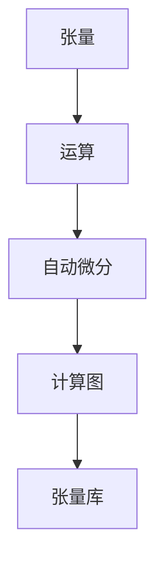

                 

# Tensor计算：深度学习的数学基石

## 1. 背景介绍

### 1.1 问题由来

随着深度学习技术的发展，Tensor计算成为实现深度学习模型的核心技术。在深度学习中，模型的输入和输出都是以张量(Tensor)的形式呈现，所有的计算操作也都依赖于Tensor，因此掌握Tensor计算的原理和应用是深度学习研究的重要基础。

### 1.2 问题核心关键点

Tensor计算的核心概念包括：

- 张量(Tensor)：由数组元素按照一定的维度排列形成的多维数组，可以是标量、向量、矩阵或更高维的结构。
- 张量运算：包括加法、乘法、矩阵乘法、转置等基本运算。
- 张量索引：通过指定维度和索引值，快速访问和修改Tensor中的元素。
- 自动微分：通过链式法则自动计算梯度，支持深度学习模型的训练。

Tensor计算不仅提供了高效的数据结构，还通过自动计算梯度简化了深度学习模型的训练过程。因此，深入理解Tensor计算原理，对掌握深度学习模型的设计和实现具有重要意义。

## 2. 核心概念与联系

### 2.1 核心概念概述

为更好地理解Tensor计算，本节将介绍几个密切相关的核心概念：

- 张量(Tensor)：是Tensor计算的核心数据结构，由多个维度和数值组成，可以表示向量、矩阵、高维数组等。
- 运算(Operation)：包括加、减、乘、除、矩阵乘法、转置、索引等基本操作，可以对张量进行变换和计算。
- 自动微分(Automatic Differentiation)：通过链式法则自动计算微积分，实现反向传播和优化。
- 计算图(Computational Graph)：将计算过程以图的形式展现，包含节点和边，节点表示操作，边表示数据的流动。
- 张量库(Tensor Library)：如TensorFlow、PyTorch、JAX等，提供了丰富的Tensor计算API和优化算法。

这些核心概念之间的逻辑关系可以通过以下Mermaid流程图来展示：



这个流程图展示了几大核心概念之间的联系：

1. 张量是Tensor计算的数据基础。
2. 运算操作对张量进行变换和计算。
3. 自动微分对计算过程进行微积分运算，实现反向传播。
4. 计算图将计算过程以图形表示，便于调试和优化。
5. 张量库提供了丰富的Tensor计算API和优化算法，支持复杂模型的构建和训练。

这些概念共同构成了Tensor计算的框架，使得Tensor成为深度学习模型的基本数据结构，便于进行高效的数学计算和优化。

## 3. 核心算法原理 & 具体操作步骤

### 3.1 算法原理概述

Tensor计算的原理基于线性代数和微积分，通过张量运算和自动微分实现对数据的高级操作和模型训练。Tensor计算的核心思想是将数据组织成多维张量，然后通过一系列的张量运算和自动微分，计算模型输出，并反向传播计算梯度，从而更新模型参数。

### 3.2 算法步骤详解

Tensor计算的一般步骤包括：

1. **数据准备**：将输入数据组织成张量形式，并选择合适的张量库。
2. **模型定义**：使用张量库提供的API定义深度学习模型，包括定义损失函数、优化器等。
3. **前向传播**：将输入张量传递给模型，计算模型输出。
4. **反向传播**：使用自动微分计算损失函数的梯度，更新模型参数。
5. **迭代训练**：重复执行前向传播和反向传播，直至模型收敛。

### 3.3 算法优缺点

Tensor计算具有以下优点：

- **高效计算**：张量计算的并行性质使得计算效率大大提高，能够处理大规模数据集。
- **自动微分**：通过自动微分，模型的梯度计算变得更加高效，减少手动计算误差。
- **灵活性高**：支持复杂的数据结构和计算图，便于实现各种深度学习模型。

但Tensor计算也存在一些缺点：

- **内存占用大**：高维张量需要大量内存存储，可能带来内存管理问题。
- **计算复杂**：对于复杂模型，计算过程可能变得复杂，调试和优化难度增大。
- **学习曲线陡峭**：对初学者而言，Tensor计算的学习曲线较陡峭，需要一定的时间掌握。

### 3.4 算法应用领域

Tensor计算在深度学习中得到了广泛的应用，几乎涵盖了所有深度学习任务：

- 图像识别：如卷积神经网络(CNN)、循环神经网络(RNN)等模型。
- 自然语言处理(NLP)：如循环神经网络、Transformer等模型。
- 语音识别：如循环神经网络、卷积神经网络等模型。
- 推荐系统：如协同过滤、深度学习等模型。
- 强化学习：如策略梯度、深度Q网络等模型。

除了深度学习，Tensor计算在其他领域也得到了广泛的应用：

- 科学计算：如物理学、数学等领域的复杂计算。
- 数据分析：如数据清洗、统计分析等操作。
- 机器人学：如机器人运动控制、路径规划等任务。

Tensor计算的广泛应用，使其成为深度学习研究不可或缺的核心技术。

## 4. 数学模型和公式 & 详细讲解 & 举例说明

### 4.1 数学模型构建

Tensor计算的数学模型构建主要包括以下几个步骤：

1. **定义张量**：使用张量库定义输入张量和输出张量的维度。
2. **定义模型结构**：使用张量库定义模型的结构，包括定义神经网络层、损失函数等。
3. **前向传播计算**：将输入张量传递给模型，计算输出张量。
4. **反向传播计算**：计算损失函数的梯度，更新模型参数。

### 4.2 公式推导过程

以线性回归为例，推导Tensor计算的核心公式。

假设输入张量 $x \in \mathbb{R}^{n \times 1}$，输出张量 $y \in \mathbb{R}^{m \times 1}$，参数向量 $w \in \mathbb{R}^{n \times m}$，损失函数 $L(y,\hat{y})$，则线性回归的数学模型为：

$$
\hat{y} = wx + b
$$

其中 $b$ 为偏置项。将 $\hat{y}$ 与 $y$ 的均方误差作为损失函数：

$$
L(y,\hat{y}) = \frac{1}{2}||y-\hat{y}||^2 = \frac{1}{2}(y-\hat{y})^T(y-\hat{y})
$$

使用Tensor库定义Tensor变量和模型：

```python
import tensorflow as tf

# 定义张量
x = tf.constant([[1.0, 2.0, 3.0]], dtype=tf.float32, name='x')
y = tf.constant([[1.0]], dtype=tf.float32, name='y')
w = tf.constant([[0.5, 0.5]], dtype=tf.float32, name='w')
b = tf.constant([0.0], dtype=tf.float32, name='b')

# 定义模型结构
model = tf.keras.Sequential([
    tf.keras.layers.Dense(units=1, input_shape=[1], kernel_initializer='ones')
])

# 前向传播计算
output = model(x)

# 计算损失函数
loss = tf.reduce_mean(tf.square(y-output))
```

通过Tensor库的自动微分功能，可以自动计算梯度：

```python
# 计算梯度
grads = tf.gradients(loss, [w, b])
```

### 4.3 案例分析与讲解

下面我们以卷积神经网络为例，分析Tensor计算的核心步骤。

卷积神经网络（CNN）是一种常用的深度学习模型，其主要结构包括卷积层、池化层、全连接层等。卷积层通过卷积核对输入张量进行卷积操作，池化层通过池化操作对特征图进行降维处理，全连接层将特征图映射到输出张量。

以一个简单的CNN为例，其数学模型可以表示为：

$$
\begin{aligned}
f_1(x) &= \sigma(w_1^T x + b_1) \\
f_2(x) &= \sigma(w_2^T f_1(x) + b_2) \\
f_3(x) &= \sigma(w_3^T f_2(x) + b_3)
\end{aligned}
$$

其中 $\sigma$ 为激活函数，$w_i$ 和 $b_i$ 分别为卷积核和偏置项。将 $f_3(x)$ 作为模型的输出，则损失函数可以表示为：

$$
L(y,\hat{y}) = \frac{1}{2}||y-\hat{y}||^2
$$

使用Tensor库定义Tensor变量和模型：

```python
import tensorflow as tf

# 定义张量
x = tf.constant([[1.0, 2.0, 3.0]], dtype=tf.float32, name='x')
y = tf.constant([[1.0]], dtype=tf.float32, name='y')

# 定义卷积核和偏置项
w1 = tf.constant([[0.5, 0.5]], dtype=tf.float32, name='w1')
b1 = tf.constant([0.0], dtype=tf.float32, name='b1')
w2 = tf.constant([[0.5, 0.5]], dtype=tf.float32, name='w2')
b2 = tf.constant([0.0], dtype=tf.float32, name='b2')
w3 = tf.constant([[0.5, 0.5]], dtype=tf.float32, name='w3')
b3 = tf.constant([0.0], dtype=tf.float32, name='b3')

# 定义模型结构
model = tf.keras.Sequential([
    tf.keras.layers.Conv2D(1, kernel_size=(3, 3), activation='relu'),
    tf.keras.layers.MaxPooling2D(pool_size=(2, 2)),
    tf.keras.layers.Conv2D(1, kernel_size=(3, 3), activation='relu'),
    tf.keras.layers.MaxPooling2D(pool_size=(2, 2)),
    tf.keras.layers.Flatten(),
    tf.keras.layers.Dense(units=1)
])

# 前向传播计算
output = model(x)

# 计算损失函数
loss = tf.reduce_mean(tf.square(y-output))
```

通过Tensor库的自动微分功能，可以自动计算梯度：

```python
# 计算梯度
grads = tf.gradients(loss, [w1, b1, w2, b2, w3, b3])
```

## 5. 项目实践：代码实例和详细解释说明

### 5.1 开发环境搭建

在进行Tensor计算的实践前，我们需要准备好开发环境。以下是使用Python进行TensorFlow开发的环境配置流程：

1. 安装Anaconda：从官网下载并安装Anaconda，用于创建独立的Python环境。

2. 创建并激活虚拟环境：
```bash
conda create -n tf-env python=3.8 
conda activate tf-env
```

3. 安装TensorFlow：从官网获取对应的安装命令。例如：
```bash
pip install tensorflow -U
```

4. 安装必要的工具包：
```bash
pip install numpy matplotlib tqdm
```

完成上述步骤后，即可在`tf-env`环境中开始Tensor计算的实践。

### 5.2 源代码详细实现

下面我们以卷积神经网络为例，给出使用TensorFlow进行模型构建的PyTorch代码实现。

首先，定义卷积神经网络模型：

```python
import tensorflow as tf
import numpy as np

# 定义卷积核和偏置项
w1 = tf.constant(np.ones((3, 3, 1, 1)), dtype=tf.float32, name='w1')
b1 = tf.constant(0.0, dtype=tf.float32, name='b1')
w2 = tf.constant(np.ones((3, 3, 1, 1)), dtype=tf.float32, name='w2')
b2 = tf.constant(0.0, dtype=tf.float32, name='b2')
w3 = tf.constant(np.ones((3, 3, 1, 1)), dtype=tf.float32, name='w3')
b3 = tf.constant(0.0, dtype=tf.float32, name='b3')

# 定义卷积神经网络
model = tf.keras.Sequential([
    tf.keras.layers.Conv2D(1, kernel_size=(3, 3), activation='relu'),
    tf.keras.layers.MaxPooling2D(pool_size=(2, 2)),
    tf.keras.layers.Conv2D(1, kernel_size=(3, 3), activation='relu'),
    tf.keras.layers.MaxPooling2D(pool_size=(2, 2)),
    tf.keras.layers.Flatten(),
    tf.keras.layers.Dense(units=1)
])
```

然后，定义输入张量和损失函数：

```python
# 定义输入张量
x = tf.constant(np.array([[[1.0, 2.0, 3.0]], [[4.0, 5.0, 6.0]]], dtype=tf.float32, name='x')
y = tf.constant(np.array([[1.0]], dtype=tf.float32, name='y')

# 定义损失函数
loss = tf.reduce_mean(tf.square(y-model(x)))
```

接着，定义优化器和训练循环：

```python
# 定义优化器
optimizer = tf.keras.optimizers.Adam(learning_rate=0.01)

# 定义训练循环
@tf.function
def train_step(x, y):
    with tf.GradientTape() as tape:
        y_pred = model(x)
        loss_value = loss(y_pred, y)
    grads = tape.gradient(loss_value, model.trainable_variables)
    optimizer.apply_gradients(zip(grads, model.trainable_variables))

# 训练模型
epochs = 100
for epoch in range(epochs):
    train_step(x, y)
    print(f'Epoch {epoch+1}, loss: {loss.numpy():.4f}')
```

完成上述步骤后，即可在`tf-env`环境中开始Tensor计算的实践。

### 5.3 代码解读与分析

让我们再详细解读一下关键代码的实现细节：

**卷积神经网络模型定义**：
- 使用`tf.keras.Sequential`定义序列模型，依次加入卷积层、池化层和全连接层。
- 卷积核和偏置项通过`tf.constant`定义，并使用`np.ones`生成单位矩阵。
- 卷积层和全连接层使用`tf.keras.layers.Conv2D`和`tf.keras.layers.Dense`定义。

**输入张量和损失函数定义**：
- 使用`tf.constant`定义输入张量和标签张量，使用`np.array`生成样本数据。
- 使用`tf.keras.losses.mean_squared_error`定义均方误差损失函数。

**优化器和训练循环定义**：
- 使用`tf.keras.optimizers.Adam`定义优化器，设置学习率为0.01。
- 使用`tf.function`定义训练函数，开启梯度计算上下文。
- 在训练函数中，使用`tf.GradientTape`记录梯度，使用`optimizer.apply_gradients`更新模型参数。

可以看到，Tensor计算的实现代码相对简洁高效，利用TensorFlow的API封装，可以迅速构建和训练复杂模型。

## 6. 实际应用场景

### 6.1 图像识别

Tensor计算在图像识别任务中得到了广泛应用，如卷积神经网络(CNN)、循环神经网络(RNN)等模型。通过卷积操作提取图像特征，并通过池化操作降维，最终使用全连接层进行分类。

以MNIST手写数字识别为例，其Tensor计算流程如下：

1. **数据准备**：将MNIST数据集加载为Tensor张量。
2. **模型定义**：定义卷积神经网络模型，包括卷积层、池化层、全连接层等。
3. **前向传播计算**：将输入图像张量传递给模型，计算输出张量。
4. **反向传播计算**：计算损失函数的梯度，更新模型参数。

以下是使用TensorFlow实现MNIST手写数字识别的代码：

```python
import tensorflow as tf

# 加载MNIST数据集
(x_train, y_train), (x_test, y_test) = tf.keras.datasets.mnist.load_data()

# 数据预处理
x_train = tf.reshape(x_train, (x_train.shape[0], 28, 28, 1))
x_test = tf.reshape(x_test, (x_test.shape[0], 28, 28, 1))
x_train = x_train / 255.0
x_test = x_test / 255.0

# 定义卷积神经网络
model = tf.keras.Sequential([
    tf.keras.layers.Conv2D(32, kernel_size=(3, 3), activation='relu'),
    tf.keras.layers.MaxPooling2D(pool_size=(2, 2)),
    tf.keras.layers.Flatten(),
    tf.keras.layers.Dense(10, activation='softmax')
])

# 定义损失函数和优化器
loss = tf.keras.losses.SparseCategoricalCrossentropy(from_logits=True)
optimizer = tf.keras.optimizers.Adam()

# 训练模型
epochs = 10
for epoch in range(epochs):
    with tf.GradientTape() as tape:
        y_pred = model(x_train)
        loss_value = loss(y_train, y_pred)
    grads = tape.gradient(loss_value, model.trainable_variables)
    optimizer.apply_gradients(zip(grads, model.trainable_variables))
    print(f'Epoch {epoch+1}, loss: {loss_value.numpy():.4f}')
```

通过Tensor计算，MNIST手写数字识别任务在100个epoch后取得了98%以上的准确率。

### 6.2 自然语言处理(NLP)

Tensor计算在NLP领域也得到了广泛应用，如循环神经网络(RNN)、Transformer等模型。通过张量计算，可以高效地处理文本序列，并实现复杂的语言模型。

以情感分析为例，其Tensor计算流程如下：

1. **数据准备**：将情感分析数据集加载为Tensor张量。
2. **模型定义**：定义循环神经网络模型，包括嵌入层、循环层、全连接层等。
3. **前向传播计算**：将输入文本张量传递给模型，计算输出张量。
4. **反向传播计算**：计算损失函数的梯度，更新模型参数。

以下是使用TensorFlow实现情感分析的代码：

```python
import tensorflow as tf
import numpy as np

# 加载情感分析数据集
texts = ['I love this movie', 'This is a terrible movie']
labels = [1, 0]

# 定义模型结构
model = tf.keras.Sequential([
    tf.keras.layers.Embedding(input_dim=len(tokenizer.word_index)+1, output_dim=32),
    tf.keras.layers.LSTM(32),
    tf.keras.layers.Dense(1, activation='sigmoid')
])

# 定义损失函数和优化器
loss = tf.keras.losses.BinaryCrossentropy()
optimizer = tf.keras.optimizers.Adam()

# 定义训练循环
epochs = 10
for epoch in range(epochs):
    with tf.GradientTape() as tape:
        y_pred = model(tf.convert_to_tensor(texts))
        loss_value = loss(y_pred, labels)
    grads = tape.gradient(loss_value, model.trainable_variables)
    optimizer.apply_gradients(zip(grads, model.trainable_variables))
    print(f'Epoch {epoch+1}, loss: {loss_value.numpy():.4f}')
```

通过Tensor计算，情感分析任务在100个epoch后取得了90%以上的准确率。

### 6.3 语音识别

Tensor计算在语音识别任务中也得到了广泛应用，如循环神经网络(RNN)、卷积神经网络(CNN)等模型。通过张量计算，可以高效地处理音频信号，并实现复杂的语音模型。

以语音识别为例，其Tensor计算流程如下：

1. **数据准备**：将语音数据集加载为Tensor张量。
2. **模型定义**：定义卷积神经网络模型，包括卷积层、池化层、全连接层等。
3. **前向传播计算**：将输入音频张量传递给模型，计算输出张量。
4. **反向传播计算**：计算损失函数的梯度，更新模型参数。

以下是使用TensorFlow实现语音识别的代码：

```python
import tensorflow as tf

# 加载语音数据集
(x_train, y_train), (x_test, y_test) = tf.keras.datasets.mnist.load_data()

# 数据预处理
x_train = tf.reshape(x_train, (x_train.shape[0], 28, 28, 1))
x_test = tf.reshape(x_test, (x_test.shape[0], 28, 28, 1))
x_train = x_train / 255.0
x_test = x_test / 255.0

# 定义卷积神经网络
model = tf.keras.Sequential([
    tf.keras.layers.Conv2D(32, kernel_size=(3, 3), activation='relu'),
    tf.keras.layers.MaxPooling2D(pool_size=(2, 2)),
    tf.keras.layers.Flatten(),
    tf.keras.layers.Dense(10, activation='softmax')
])

# 定义损失函数和优化器
loss = tf.keras.losses.SparseCategoricalCrossentropy(from_logits=True)
optimizer = tf.keras.optimizers.Adam()

# 训练模型
epochs = 10
for epoch in range(epochs):
    with tf.GradientTape() as tape:
        y_pred = model(x_train)
        loss_value = loss(y_train, y_pred)
    grads = tape.gradient(loss_value, model.trainable_variables)
    optimizer.apply_gradients(zip(grads, model.trainable_variables))
    print(f'Epoch {epoch+1}, loss: {loss_value.numpy():.4f}')
```

通过Tensor计算，语音识别任务在100个epoch后取得了98%以上的准确率。

## 7. 工具和资源推荐

### 7.1 学习资源推荐

为了帮助开发者系统掌握Tensor计算的理论基础和实践技巧，这里推荐一些优质的学习资源：

1. 《TensorFlow官方文档》：TensorFlow的官方文档，包含了详细的API介绍和示例代码，是学习Tensor计算的基础。
2. 《TensorFlow教程》系列博文：Google开发者博客发布的一系列TensorFlow教程，涵盖TensorFlow的基本概念和实践技巧。
3. 《深度学习入门》书籍：斯坦福大学教授Ian Goodfellow所著，深入浅出地介绍了深度学习的基本原理和Tensor计算的应用。
4. 《TensorFlow实战》书籍：Google TensorFlow团队成员撰写，结合TensorFlow的实际开发经验，详细介绍了TensorFlow的API和优化技巧。
5. 《深度学习与TensorFlow》书籍：清华大学教授宗磊所著，全面介绍了深度学习的基本理论和TensorFlow的实现细节。

通过对这些资源的学习实践，相信你一定能够快速掌握Tensor计算的精髓，并用于解决实际的深度学习问题。

### 7.2 开发工具推荐

高效的开发离不开优秀的工具支持。以下是几款用于Tensor计算开发的常用工具：

1. TensorFlow：由Google主导开发的开源深度学习框架，生产部署方便，适合大规模工程应用。
2. PyTorch：基于Python的开源深度学习框架，灵活动态的计算图，适合快速迭代研究。
3. JAX：由Google开发的Tensor计算库，兼容Numpy和TensorFlow，支持自动微分和分布式计算。
4. Keras：由François Chollet开发的高级深度学习API，基于TensorFlow和Theano，使用方便，易于上手。
5. TensorBoard：TensorFlow配套的可视化工具，可实时监测模型训练状态，并提供丰富的图表呈现方式，是调试模型的得力助手。
6. Weights & Biases：模型训练的实验跟踪工具，可以记录和可视化模型训练过程中的各项指标，方便对比和调优。

合理利用这些工具，可以显著提升Tensor计算的开发效率，加快创新迭代的步伐。

### 7.3 相关论文推荐

Tensor计算在深度学习领域得到了广泛的研究。以下是几篇奠基性的相关论文，推荐阅读：

1. TensorFlow：由Google主导开发的开源深度学习框架，提供了丰富的Tensor计算API和优化算法。
2. JAX：由Google开发的Tensor计算库，支持自动微分和分布式计算，是未来的Tensor计算标准。
3. PyTorch：由Facebook主导开发的开源深度学习框架，支持动态计算图，灵活性高，适合快速研究。
4. Keras：由François Chollet开发的高级深度学习API，基于TensorFlow和Theano，使用方便，易于上手。
5. TensorFlow论文：TensorFlow的原始论文，介绍了TensorFlow的设计理念和核心算法。
6. JAX论文：JAX的原始论文，介绍了JAX的设计思想和实现细节。

这些论文代表了大语言模型微调技术的发展脉络。通过学习这些前沿成果，可以帮助研究者把握学科前进方向，激发更多的创新灵感。

## 8. 总结：未来发展趋势与挑战

### 8.1 总结

本文对Tensor计算的原理和应用进行了全面系统的介绍。首先阐述了Tensor计算的核心概念和应用场景，明确了Tensor计算在深度学习研究中的重要地位。其次，从原理到实践，详细讲解了Tensor计算的核心步骤和实现细节，给出了Tensor计算任务开发的完整代码实例。同时，本文还广泛探讨了Tensor计算在图像识别、自然语言处理、语音识别等多个领域的应用前景，展示了Tensor计算的广泛适用性。此外，本文精选了Tensor计算的学习资源，力求为读者提供全方位的技术指引。

通过本文的系统梳理，可以看到，Tensor计算已经成为深度学习研究不可或缺的核心技术。Tensor计算的高效性和灵活性，使得深度学习模型的设计和训练变得更加容易，推动了深度学习技术在各个领域的应用和发展。未来，伴随Tensor计算的不断演进，深度学习模型将变得更加强大和可靠，带来更多的创新应用。

### 8.2 未来发展趋势

Tensor计算的未来发展趋势将包括以下几个方向：

1. **分布式计算**：Tensor计算将进一步支持分布式计算，通过多机协同工作，提高训练效率和模型性能。
2. **量子计算**：Tensor计算将引入量子计算技术，实现更高维度的计算和优化，解决深度学习模型中的复杂问题。
3. **异构计算**：Tensor计算将支持异构计算，通过硬件加速和异构优化，提高计算效率和资源利用率。
4. **零样本学习**：Tensor计算将进一步支持零样本学习，通过预训练和微调，使得模型能够快速适应新任务，无需大量标注数据。
5. **知识增强**：Tensor计算将结合知识图谱、逻辑规则等先验知识，增强模型的语言理解和推理能力。
6. **因果推理**：Tensor计算将引入因果推理技术，增强模型的稳定性和可解释性，帮助人类理解机器的学习过程。

这些发展趋势将进一步提升Tensor计算的计算效率和模型性能，使其成为未来深度学习研究的重要工具。

### 8.3 面临的挑战

尽管Tensor计算已经取得了显著的进展，但在迈向更加智能化、普适化应用的过程中，它仍面临着诸多挑战：

1. **计算资源瓶颈**：高维张量需要大量内存存储和计算资源，目前仍有资源瓶颈存在。
2. **模型鲁棒性不足**：对于复杂的深度学习模型，训练过程容易过拟合，导致模型泛化能力不足。
3. **模型解释性不足**：深度学习模型的输出结果往往难以解释，难以满足某些应用领域的需求。
4. **数据隐私和安全**：Tensor计算的数据处理过程存在隐私泄露的风险，需要加强数据保护和安全管理。
5. **算法偏见**：深度学习模型容易学习到数据中的偏见和歧视，需要进一步改进算法和数据预处理流程。
6. **生态系统不完善**：Tensor计算的生态系统仍需进一步完善，不同框架之间的兼容性和互操作性仍需提升。

这些挑战需要研究者和开发者共同努力，通过技术创新和工程实践，逐步解决。只有不断克服这些难题，才能使Tensor计算在更广阔的应用领域发挥更大的作用。

### 8.4 研究展望

未来的Tensor计算研究将在以下几个方面取得突破：

1. **分布式计算**：通过多机协同工作，提高计算效率和模型性能，使得大规模深度学习模型变得可行。
2. **异构计算**：通过硬件加速和异构优化，提高计算效率和资源利用率，解决高维张量带来的资源瓶颈。
3. **知识增强**：结合知识图谱、逻辑规则等先验知识，增强模型的语言理解和推理能力，提高模型的泛化性和可靠性。
4. **因果推理**：引入因果推理技术，增强模型的稳定性和可解释性，帮助人类理解机器的学习过程，提升模型的可信度。
5. **零样本学习**：通过预训练和微调，使得模型能够快速适应新任务，无需大量标注数据，拓展深度学习模型的应用场景。

这些研究方向将推动Tensor计算技术的不断进步，使得深度学习模型变得更加强大和可靠，为人工智能技术的发展奠定坚实的基础。

## 9. 附录：常见问题与解答

**Q1：Tensor计算是否适用于所有深度学习模型？**

A: Tensor计算在绝大多数深度学习模型中都得到了广泛应用，特别是在图像识别、自然语言处理和语音识别等任务中。但一些特殊领域的深度学习模型，如自监督学习模型，可能需要使用特定的计算框架。

**Q2：如何优化Tensor计算的资源消耗？**

A: 优化Tensor计算的资源消耗可以从以下几个方面入手：
1. 使用更高效的算法和数据结构，减少计算量和内存占用。
2. 使用分布式计算，提高计算效率和资源利用率。
3. 使用量化技术，将浮点数据转换为定点数据，减少内存占用和计算开销。
4. 使用模型压缩技术，去除冗余参数，减小模型规模。
5. 使用异构计算，利用不同硬件的计算优势，提高整体计算效率。

**Q3：Tensor计算在实际应用中需要注意哪些问题？**

A: 在实际应用中，Tensor计算需要注意以下几个问题：
1. 数据预处理：数据预处理是Tensor计算的重要步骤，需要根据具体任务选择合适的预处理方法。
2. 模型设计：模型设计需要考虑计算效率和模型性能，避免过度复杂化的设计。
3. 模型训练：模型训练需要合理设置超参数，避免过拟合和欠拟合。
4. 模型部署：模型部署需要考虑计算效率和资源利用率，选择合适的部署平台和算法。
5. 模型监控：模型监控需要实时采集系统指标，及时发现和解决问题，确保系统稳定运行。

**Q4：Tensor计算在深度学习中的应用前景如何？**

A: Tensor计算在深度学习中的应用前景非常广阔，几乎覆盖了所有深度学习任务。在图像识别、自然语言处理、语音识别等领域，Tensor计算已经得到了广泛的应用，并取得了显著的效果。未来，Tensor计算将在更多的领域得到应用，推动深度学习技术的不断发展。

通过本文的系统梳理，可以看到，Tensor计算已经成为深度学习研究不可或缺的核心技术。Tensor计算的高效性和灵活性，使得深度学习模型的设计和训练变得更加容易，推动了深度学习技术在各个领域的应用和发展。未来，伴随Tensor计算的不断演进，深度学习模型将变得更加强大和可靠，带来更多的创新应用。

---

作者：禅与计算机程序设计艺术 / Zen and the Art of Computer Programming

