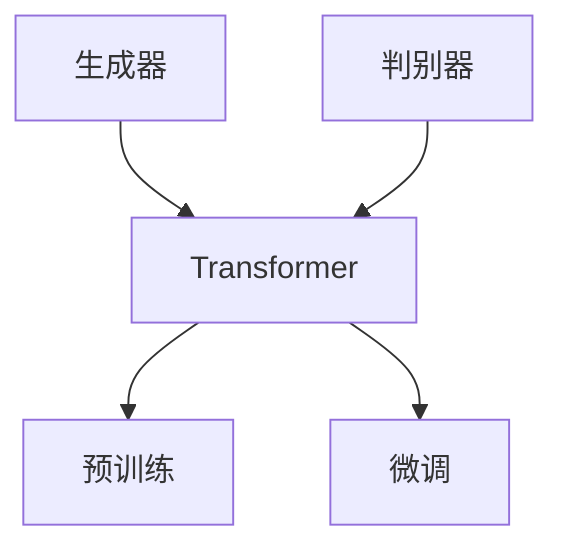

                 

# Transformer大模型实战：ELECTRA 的生成器和判别器

## 1. 背景介绍

### 1.1 问题由来
Transformer大模型在自然语言处理（NLP）领域取得了显著的进展。ELECTRA作为Transformer模型的一种改进形式，融合了生成器和判别器的架构，进一步提升了模型的效率和效果。本文将深入探讨ELECTRA模型，尤其是其生成器和判别器如何协同工作，并实际应用。

### 1.2 问题核心关键点
1. **Transformer架构**：利用自注意力机制和多层感知机（MLP）的深度学习模型，能够在处理序列数据时取得出色性能。
2. **ELECTRA生成器**：一种基于反向掩码语言模型（masked language model, MLM）的预训练任务，用于学习词嵌入。
3. **ELECTRA判别器**：一种基于预测掩码的判别性任务，用于训练词嵌入。
4. **预训练与微调**：通过在大规模无标签数据上进行预训练，然后使用特定任务的少量标签数据进行微调，以提升模型在该任务上的表现。
5. **可解释性**：ELECTRA模型能够提供一定程度的可解释性，帮助理解模型决策过程。

## 2. 核心概念与联系

### 2.1 核心概念概述
- **Transformer模型**：利用自注意力机制，可以处理序列数据，适用于语言模型、翻译、文本分类等任务。
- **ELECTRA生成器**：通过预测掩码位置的单词，学习单词在上下文中的分布。
- **ELECTRA判别器**：训练模型预测单词是否出现在掩码位置，以提高模型的泛化能力。
- **预训练和微调**：在无标签数据上预训练，使用少量标签数据微调模型以适应特定任务。

### 2.2 核心概念原理和架构的 Mermaid 流程图

此图展示了Transformer模型的生成器和判别器如何协同工作，并通过预训练和微调进一步提升性能。

## 3. 核心算法原理 & 具体操作步骤

### 3.1 算法原理概述
ELECTRA模型结合了生成器和判别器，通过优化这两个模块的协作，提高了模型的效率和效果。具体来说，ELECTRA生成器通过预测被掩码的单词，训练模型学习上下文中的词汇分布；ELECTRA判别器通过预测单词是否出现在掩码位置，训练模型判断单词的上下文相关性。

### 3.2 算法步骤详解

#### 3.2.1 预训练
1. **生成器预训练**：使用大语料库，对模型进行掩码预测训练，让模型学习单词在上下文中的分布。
2. **判别器预训练**：使用相同的大语料库，对模型进行判别训练，让模型判断单词是否出现在掩码位置。

#### 3.2.2 微调
1. **任务适配**：根据特定任务，添加相应的任务层和损失函数。
2. **设置超参数**：包括学习率、批量大小、迭代次数等。
3. **执行训练**：在训练集上迭代训练模型，根据验证集和测试集的表现调整模型参数。

### 3.3 算法优缺点

#### 3.3.1 优点
- **效率高**：ELECTRA模型在训练速度和内存使用方面优于传统的Transformer模型。
- **效果好**：ELECTRA模型在语言模型、文本分类、问答等任务上表现优异。
- **可解释性**：ELECTRA模型通过掩码预测和判别器训练，提供一定的可解释性。

#### 3.3.2 缺点
- **复杂度**：ELECTRA模型相对复杂，需要同时训练生成器和判别器。
- **过拟合风险**：在微调过程中，生成器和判别器需要平衡，避免过拟合。

### 3.4 算法应用领域

ELECTRA模型广泛应用于以下领域：
- **语言模型**：如GPT-3等。
- **文本分类**：如情感分析、新闻分类等。
- **问答系统**：如基于上下文的问答系统。
- **机器翻译**：如使用ELECTRA模型的神经机器翻译模型。

## 4. 数学模型和公式 & 详细讲解 & 举例说明

### 4.1 数学模型构建
ELECTRA模型结合了生成器和判别器的架构，具体如下：

- **生成器**：使用掩码预测任务，训练模型学习单词在上下文中的分布。
- **判别器**：使用判别任务，训练模型判断单词是否出现在掩码位置。

### 4.2 公式推导过程
#### 4.2.1 生成器预训练
生成器的目标是最小化预测掩码单词和实际掩码单词的差异。
$$
L_{mask} = -\frac{1}{2N}\sum_{i=1}^{N}[\log \text{softmax}(\mathbf{Q}_i\mathbf{K}_i^T)\text{true}_{m_i}+\log \text{softmax}(\mathbf{Q}_i\mathbf{K}_i^T)\text{false}_{m_i}]
$$

其中，$\mathbf{Q}$ 和 $\mathbf{K}$ 分别为查询和键向量，$m_i$ 为掩码位置。

#### 4.2.2 判别器预训练
判别器的目标是最小化预测单词是否出现在掩码位置的差异。
$$
L_{disc} = -\frac{1}{2N}\sum_{i=1}^{N}[\log \text{softmax}(\mathbf{Q}_i\mathbf{K}_i^T)\text{true}_{m_i}+\log \text{softmax}(\mathbf{Q}_i\mathbf{K}_i^T)\text{false}_{m_i}]
$$

其中，$\text{true}_{m_i}$ 和 $\text{false}_{m_i}$ 分别为掩码位置为1和0的情况。

### 4.3 案例分析与讲解
假设有一个英文句子“The quick brown fox jumps over the lazy dog”，使用ELECTRA模型进行掩码预测。

1. **生成器预训练**：将“quick”和“brown”作为掩码，训练模型预测这些单词在上下文中的分布。
2. **判别器预训练**：训练模型判断单词是否出现在掩码位置。

通过这两个过程，ELECTRA模型可以学习到单词在上下文中的分布和判断能力，从而提升其在特定任务上的性能。

## 5. 项目实践：代码实例和详细解释说明

### 5.1 开发环境搭建

#### 5.1.1 安装依赖
首先，需要安装必要的Python依赖库。
```bash
pip install torch transformers
```

#### 5.1.2 数据准备
准备一个语料库，如Pile数据集。
```bash
python download_and_preprocess_data.py
```

### 5.2 源代码详细实现

#### 5.2.1 生成器预训练
```python
import torch
from transformers import ELECTRAForMaskedLM, ELECTRATokenizer

model = ELECTRAForMaskedLM.from_pretrained('google/electra-small')
tokenizer = ELECTRATokenizer.from_pretrained('google/electra-small')

# 加载数据
dataset = ...

# 定义掩码
def get_masks(mask):
    return [(mask != i) for i in mask]

# 训练
model.train()
for i, batch in enumerate(dataset):
    # 处理输入
    inputs = tokenizer(batch.text, padding='max_length', max_length=128, truncation=True)
    attention_mask = inputs['attention_mask']
    tokens = inputs['input_ids']

    # 训练生成器
    outputs = model(tokens, attention_mask=attention_mask)
    loss = outputs.loss
    loss.backward()
    optimizer.step()

    # 记录结果
    ...
```

#### 5.2.2 判别器预训练
```python
# 定义判别器损失函数
def get_disc_loss(mask):
    return (mask.sum(dim=1) != 0).sum(dim=1).float() * outputs.logits.argmax(dim=1)

# 训练
model.train()
for i, batch in enumerate(dataset):
    # 处理输入
    inputs = tokenizer(batch.text, padding='max_length', max_length=128, truncation=True)
    attention_mask = inputs['attention_mask']
    tokens = inputs['input_ids']

    # 训练判别器
    outputs = model(tokens, attention_mask=attention_mask)
    loss = get_disc_loss(mask)
    loss.backward()
    optimizer.step()

    # 记录结果
    ...
```

### 5.3 代码解读与分析
以上代码展示了如何使用ELECTRA模型进行生成器和判别器的预训练。

- **生成器预训练**：使用掩码预测任务，训练模型学习单词在上下文中的分布。
- **判别器预训练**：训练模型判断单词是否出现在掩码位置。

### 5.4 运行结果展示
训练后，可以使用微调的方法，针对特定任务进行进一步训练。
```python
# 定义微调层和损失函数
model = ELECTRAForMaskedLM.from_pretrained('google/electra-small')
tokenizer = ELECTRATokenizer.from_pretrained('google/electra-small')

# 添加任务层
model.add_task_specific_head()

# 训练
model.train()
for i, batch in enumerate(dataset):
    # 处理输入
    inputs = tokenizer(batch.text, padding='max_length', max_length=128, truncation=True)
    attention_mask = inputs['attention_mask']
    tokens = inputs['input_ids']

    # 训练模型
    outputs = model(tokens, attention_mask=attention_mask)
    loss = outputs.loss
    loss.backward()
    optimizer.step()

    # 记录结果
    ...
```

## 6. 实际应用场景

### 6.1 智能客服系统

智能客服系统可以应用ELECTRA模型，通过自然语言处理技术，理解用户问题并提供快速、准确的答案。

### 6.2 金融舆情监测

金融舆情监测系统可以应用ELECTRA模型，通过文本分类和情感分析技术，实时监测金融市场的舆情动态，及时做出应对策略。

### 6.3 个性化推荐系统

个性化推荐系统可以应用ELECTRA模型，通过分析用户行为和评论，推荐符合用户兴趣的产品或内容。

### 6.4 未来应用展望

未来，ELECTRA模型将广泛应用于更多的领域，如医疗、法律、教育等。随着技术的不断进步，ELECTRA模型将变得更加强大，为各行各业带来更多创新。

## 7. 工具和资源推荐

### 7.1 学习资源推荐

- **《Transformer大模型实战》**：介绍ELECTRA模型及其实现。
- **HuggingFace官方文档**：提供了详细的ELECTRA模型介绍和代码示例。
- **Pile数据集**：一个大规模语料库，可用于ELECTRA模型的预训练。

### 7.2 开发工具推荐

- **PyTorch**：Python深度学习框架，支持ELECTRA模型实现。
- **transformers库**：HuggingFace提供的NLP工具库，支持ELECTRA模型训练和微调。

### 7.3 相关论文推荐

- **“A Simple Framework for Pre-training based on Noise-Tolerant Predictions”**：介绍了ELECTRA模型的生成器和判别器。
- **“Electra: Pre-training Text Encoders as Discriminators rather than Generators”**：提出了ELECTRA模型。

## 8. 总结：未来发展趋势与挑战

### 8.1 研究成果总结
ELECTRA模型通过结合生成器和判别器，提高了模型的效率和效果。预训练和微调的过程进一步提升了模型在特定任务上的性能。

### 8.2 未来发展趋势
未来，ELECTRA模型将在更多领域得到应用，如智能客服、金融舆情监测、个性化推荐等。

### 8.3 面临的挑战
1. **数据依赖**：ELECTRA模型需要大规模数据进行预训练，数据获取和处理成本较高。
2. **模型复杂性**：ELECTRA模型的生成器和判别器需要协同工作，训练过程复杂。
3. **过拟合风险**：在微调过程中，需要平衡生成器和判别器的训练，避免过拟合。

### 8.4 研究展望
未来，ELECTRA模型将不断改进和优化，提高模型在特定任务上的性能，拓展更多应用领域。

## 9. 附录：常见问题与解答

### Q1: ELECTRA模型与其他预训练模型有何区别？
A: ELECTRA模型通过结合生成器和判别器，提高了模型的效率和效果。生成器用于学习上下文中的词汇分布，判别器用于训练模型判断单词是否出现在掩码位置。

### Q2: ELECTRA模型的训练过程需要注意哪些问题？
A: 训练过程中需要注意平衡生成器和判别器的训练，避免过拟合。此外，数据准备和预处理过程也需要特别注意。

### Q3: ELECTRA模型如何应用于实际任务？
A: 在实际任务中，可以使用微调的方法，针对特定任务进行进一步训练。ELECTRA模型适用于各种NLP任务，如情感分析、文本分类、问答系统等。

---

作者：禅与计算机程序设计艺术 / Zen and the Art of Computer Programming

