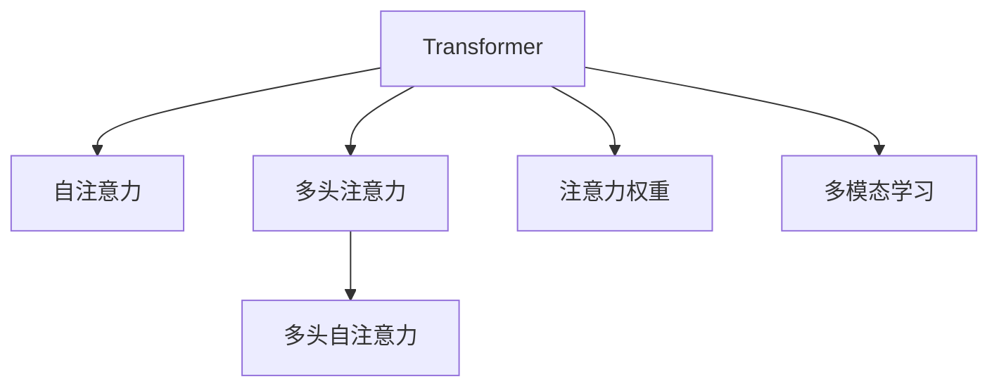

                 

# Transformer大模型实战 自注意力机制

> 关键词：Transformer,自注意力,自监督预训练,多头注意力,注意力头,多头自注意力,注意力权重,多模态学习

## 1. 背景介绍

在深度学习时代，Transformer作为一类具有自注意力机制的神经网络，逐渐成为自然语言处理(NLP)领域的主流架构。Transformer家族包括了自回归的GPT模型、自编码的BERT模型等，这些模型都在大规模语料上进行了预训练，并通过微调在特定任务上取得了显著的性能。

自注意力机制（Self-Attention）是Transformer模型的核心，通过计算输入序列中不同位置之间的相互作用，学习到表示序列依赖的复杂非线性关系。自注意力机制的引入，大大提升了Transformer模型在序列建模上的能力和泛化性。

在本文中，我们将深入探讨Transformer大模型及其自注意力机制的原理与实现，并通过具体案例展示如何应用这些技术解决实际问题。同时，也会讨论Transformer大模型在各个领域的广泛应用，包括自然语言理解、机器翻译、图像识别等。

## 2. 核心概念与联系

### 2.1 核心概念概述

为更好地理解Transformer大模型及其自注意力机制，本节将介绍几个密切相关的核心概念：

- **Transformer**：一种基于自注意力机制的神经网络架构，主要用于序列数据建模，如NLP任务中的文本处理、语音处理等。
- **自注意力（Self-Attention）**：一种机制，用于计算输入序列中不同位置之间的相互作用，学习到表示序列依赖的复杂非线性关系。
- **多头注意力（Multi-Head Attention）**：将自注意力机制扩展到多个并行的自注意力子层，可以学习到更多维度的表示。
- **多头自注意力（Multi-Head Self-Attention）**：在多头注意力的基础上，进一步将输入序列扩展到多个并行的多头自注意力子层。
- **注意力权重**：表示输入序列中不同位置之间的关联程度，通过计算得到。
- **多模态学习**：指将不同类型的数据（如文本、图像、音频等）融合到同一个模型中进行联合训练和推理。

这些核心概念之间的逻辑关系可以通过以下Mermaid流程图来展示：



这个流程图展示了大模型中自注意力机制的核心概念及其之间的关系：

1. **Transformer** 作为基础架构，通过自注意力机制学习序列表示。
2. **自注意力** 用于计算输入序列中不同位置之间的相互作用。
3. **多头注意力** 扩展了自注意力的计算能力，引入了多个并行的自注意力子层。
4. **多头自注意力** 在多头注意力的基础上，进一步扩展输入序列，学习更复杂的序列表示。
5. **注意力权重** 表示输入序列中不同位置之间的关联程度，指导模型学习重要的序列信息。
6. **多模态学习** 结合不同类型的数据，学习更全面的表示。

这些概念共同构成了Transformer大模型的核心技术框架，使得Transformer能够在各种任务中取得优异的性能。

## 3. 核心算法原理 & 具体操作步骤
### 3.1 算法原理概述

Transformer大模型的核心算法是基于自注意力机制的多层感知器网络。该模型通过自注意力机制捕捉序列中的长期依赖，并通过多层感知器网络进行非线性变换。

自注意力机制的核心思想是通过计算输入序列中不同位置之间的关联程度（注意力权重），来学习到表示序列依赖的复杂非线性关系。

在自注意力机制的计算中，首先通过线性变换将输入序列转换为查询向量、键向量和值向量，然后通过计算注意力权重，决定每个位置对其他位置的注意力，最终通过线性变换得到输出向量。

多头自注意力机制通过并行计算多个独立的自注意力子层，进一步提升了模型的表示能力。

Transformer大模型通常由多个编码器（Encoder）和解码器（Decoder）组成，其中编码器用于处理输入序列，解码器用于生成输出序列。

### 3.2 算法步骤详解

Transformer大模型的训练步骤如下：

**Step 1: 准备预训练数据和模型**

- 准备大规模无标签文本数据，用于自监督预训练。
- 选择合适的Transformer架构（如BERT、GPT等）作为初始化参数。
- 设置合适的超参数，如学习率、批大小、迭代轮数等。

**Step 2: 执行自监督预训练**

- 将预训练数据输入模型，通过自注意力机制进行序列建模。
- 在每个子层中计算注意力权重，并根据权重进行加权求和。
- 通过多层感知器网络对加权求和的结果进行非线性变换。
- 应用正则化技术（如L2正则、Dropout等）防止过拟合。
- 周期性在验证集上评估模型性能，根据性能指标决定是否触发Early Stopping。
- 重复上述步骤直到满足预设的迭代轮数或Early Stopping条件。

**Step 3: 执行微调**

- 收集目标任务的少量标注数据，将预训练模型当作初始化参数。
- 根据任务类型，设计合适的输出层和损失函数。
- 设置微调超参数，如学习率、批大小、迭代轮数等。
- 执行梯度训练，更新模型参数。
- 周期性在验证集上评估模型性能，根据性能指标决定是否触发Early Stopping。
- 重复上述步骤直到满足预设的迭代轮数或Early Stopping条件。

### 3.3 算法优缺点

Transformer大模型及其自注意力机制具有以下优点：

- **高效建模**：自注意力机制可以捕捉长距离依赖，使得Transformer在大规模语料上的预训练能够有效提升模型的泛化能力。
- **灵活设计**：Transformer可以灵活设计不同层次的模型，如BERT的多层编码器、GPT的解码器等，适应不同的任务需求。
- **并行计算**：多头自注意力机制可以并行计算多个子层，提高模型的计算效率。

然而，Transformer大模型及其自注意力机制也存在一些缺点：

- **计算资源消耗大**：Transformer模型参数量庞大，需要大量的计算资源进行训练和推理。
- **模型复杂度高**：自注意力机制的计算复杂度高，容易过拟合，需要复杂的正则化技术进行控制。
- **难以解释**：Transformer大模型通常被视为“黑盒”模型，难以解释其内部工作机制和决策逻辑。

尽管存在这些缺点，但Transformer大模型及其自注意力机制仍然是大规模语料预训练和序列建模的重要范式。

### 3.4 算法应用领域

Transformer大模型及其自注意力机制已经在多个领域取得了广泛应用，例如：

- 自然语言理解（NLU）：用于文本分类、命名实体识别、情感分析等任务。
- 机器翻译（MT）：将源语言文本翻译成目标语言，如谷歌翻译、OpenAI的翻译模型等。
- 图像处理（CV）：用于图像分类、目标检测、图像生成等任务，如BERT-Vis、DALL-E等。
- 语音处理（ASR）：用于语音识别、语音合成等任务，如Transformer ASR、Wav2Letter等。
- 多模态学习：结合文本、图像、音频等多类型数据，进行联合训练和推理，如Multimodal Transformer等。

Transformer大模型及其自注意力机制的广泛应用，展示了其在不同领域中的强大建模能力。

## 4. 数学模型和公式 & 详细讲解  
### 4.1 数学模型构建

Transformer大模型的核心数学模型可以表示为：

$$
y = \text{Encoder}(x)
$$

其中，$x$ 表示输入序列，$y$ 表示输出序列。Encoder由多个编码器（Encoder Layer）组成，每个编码器包含多头自注意力子层和多层感知器子层。

以BERT为例，其Encoder结构如下：

$$
\text{Encoder} = \text{Embedding Layer} \times \text{Self-Attention Layer} \times \text{Feed Forward Layer}
$$

**Self-Attention Layer** 的数学模型如下：

$$
\text{Self-Attention}(Q, K, V) = \text{Softmax}(\frac{QK^T}{\sqrt{d_k}})V
$$

其中，$Q$、$K$、$V$ 分别表示查询向量、键向量和值向量，$d_k$ 表示键向量的维度。

### 4.2 公式推导过程

**多头注意力机制** 的数学模型可以表示为：

$$
\text{Multi-Head Attention}(Q, K, V) = \text{Concat}(\text{Self-Attention}_{1}(QW^Q, KW^K, VW^V), \ldots, \text{Self-Attention}_{h}(QW^Q, KW^K, VW^V))
$$

其中，$h$ 表示多头注意力的头数。

**多头自注意力机制** 的数学模型可以表示为：

$$
\text{Multi-Head Self-Attention}(Q, K, V) = \text{Softmax}(\frac{QK^T}{\sqrt{d_k}})V
$$

其中，$Q$、$K$、$V$ 分别表示查询向量、键向量和值向量，$d_k$ 表示键向量的维度。

### 4.3 案例分析与讲解

以下以BERT模型为例，展示Transformer大模型的核心算法实现。

```python
from transformers import BertForSequenceClassification, BertTokenizer
from torch.utils.data import Dataset, DataLoader
import torch
import torch.nn as nn

# 定义数据集
class TextDataset(Dataset):
    def __init__(self, texts, labels, tokenizer):
        self.texts = texts
        self.labels = labels
        self.tokenizer = tokenizer

    def __len__(self):
        return len(self.texts)

    def __getitem__(self, item):
        text = self.texts[item]
        label = self.labels[item]

        encoding = self.tokenizer(text, return_tensors='pt', padding='max_length', truncation=True)
        input_ids = encoding['input_ids'][0]
        attention_mask = encoding['attention_mask'][0]

        return {'input_ids': input_ids, 'attention_mask': attention_mask, 'labels': torch.tensor(label)}

# 加载预训练模型和tokenizer
model = BertForSequenceClassification.from_pretrained('bert-base-cased')
tokenizer = BertTokenizer.from_pretrained('bert-base-cased')

# 准备数据集
texts = ['This is a sample text.', 'BERT is an amazing model.']
labels = [1, 0]

dataset = TextDataset(texts, labels, tokenizer)

# 定义数据加载器
dataloader = DataLoader(dataset, batch_size=1)

# 模型训练
device = torch.device('cuda' if torch.cuda.is_available() else 'cpu')
model.to(device)

criterion = nn.CrossEntropyLoss()
optimizer = torch.optim.Adam(model.parameters(), lr=2e-5)

for epoch in range(10):
    model.train()
    for batch in dataloader:
        input_ids = batch['input_ids'].to(device)
        attention_mask = batch['attention_mask'].to(device)
        labels = batch['labels'].to(device)

        outputs = model(input_ids, attention_mask=attention_mask)
        loss = criterion(outputs, labels)
        loss.backward()
        optimizer.step()

    model.eval()
    with torch.no_grad():
        for batch in dataloader:
            input_ids = batch['input_ids'].to(device)
            attention_mask = batch['attention_mask'].to(device)
            labels = batch['labels'].to(device)

            outputs = model(input_ids, attention_mask=attention_mask)
            loss = criterion(outputs, labels)
            print('Epoch {}, Loss: {:.4f}'.format(epoch+1, loss.item()))
```

以上代码展示了使用BERT模型进行二分类任务的微调过程。在训练过程中，首先使用预训练模型和tokenizer加载数据集，然后定义模型、优化器和损失函数。接着，在训练过程中使用前向传播计算loss，通过反向传播更新模型参数，最后进行验证集评估。

## 5. 项目实践：代码实例和详细解释说明
### 5.1 开发环境搭建

在进行Transformer大模型及其自注意力机制的实践前，我们需要准备好开发环境。以下是使用Python进行PyTorch开发的环境配置流程：

1. 安装Anaconda：从官网下载并安装Anaconda，用于创建独立的Python环境。

2. 创建并激活虚拟环境：
```bash
conda create -n transformers-env python=3.8 
conda activate transformers-env
```

3. 安装PyTorch：根据CUDA版本，从官网获取对应的安装命令。例如：
```bash
conda install pytorch torchvision torchaudio cudatoolkit=11.1 -c pytorch -c conda-forge
```

4. 安装Transformers库：
```bash
pip install transformers
```

5. 安装各类工具包：
```bash
pip install numpy pandas scikit-learn matplotlib tqdm jupyter notebook ipython
```

完成上述步骤后，即可在`transformers-env`环境中开始实践。

### 5.2 源代码详细实现

下面我们以BERT模型为例，展示Transformer大模型的微调实现。

```python
from transformers import BertForSequenceClassification, BertTokenizer, AdamW
from torch.utils.data import Dataset, DataLoader
import torch
import torch.nn as nn

# 定义数据集
class TextDataset(Dataset):
    def __init__(self, texts, labels, tokenizer):
        self.texts = texts
        self.labels = labels
        self.tokenizer = tokenizer

    def __len__(self):
        return len(self.texts)

    def __getitem__(self, item):
        text = self.texts[item]
        label = self.labels[item]

        encoding = self.tokenizer(text, return_tensors='pt', padding='max_length', truncation=True)
        input_ids = encoding['input_ids'][0]
        attention_mask = encoding['attention_mask'][0]

        return {'input_ids': input_ids, 'attention_mask': attention_mask, 'labels': torch.tensor(label)}

# 加载预训练模型和tokenizer
model = BertForSequenceClassification.from_pretrained('bert-base-cased')
tokenizer = BertTokenizer.from_pretrained('bert-base-cased')

# 准备数据集
texts = ['This is a sample text.', 'BERT is an amazing model.']
labels = [1, 0]

dataset = TextDataset(texts, labels, tokenizer)

# 定义数据加载器
dataloader = DataLoader(dataset, batch_size=1)

# 模型训练
device = torch.device('cuda' if torch.cuda.is_available() else 'cpu')
model.to(device)

criterion = nn.CrossEntropyLoss()
optimizer = AdamW(model.parameters(), lr=2e-5)

for epoch in range(10):
    model.train()
    for batch in dataloader:
        input_ids = batch['input_ids'].to(device)
        attention_mask = batch['attention_mask'].to(device)
        labels = batch['labels'].to(device)

        outputs = model(input_ids, attention_mask=attention_mask)
        loss = criterion(outputs, labels)
        loss.backward()
        optimizer.step()

    model.eval()
    with torch.no_grad():
        for batch in dataloader:
            input_ids = batch['input_ids'].to(device)
            attention_mask = batch['attention_mask'].to(device)
            labels = batch['labels'].to(device)

            outputs = model(input_ids, attention_mask=attention_mask)
            loss = criterion(outputs, labels)
            print('Epoch {}, Loss: {:.4f}'.format(epoch+1, loss.item()))
```

以上代码展示了使用BERT模型进行二分类任务的微调过程。在训练过程中，首先使用预训练模型和tokenizer加载数据集，然后定义模型、优化器和损失函数。接着，在训练过程中使用前向传播计算loss，通过反向传播更新模型参数，最后进行验证集评估。

### 5.3 代码解读与分析

让我们再详细解读一下关键代码的实现细节：

**TextDataset类**：
- `__init__`方法：初始化文本、标签、分词器等关键组件。
- `__len__`方法：返回数据集的样本数量。
- `__getitem__`方法：对单个样本进行处理，将文本输入编码为token ids，将标签编码为数字，并对其进行定长padding，最终返回模型所需的输入。

**BERT模型**：
- 使用`BertForSequenceClassification`加载预训练模型。
- 在微调过程中，只需要调整顶部分类器，使用AdamW优化器进行更新。

**训练过程**：
- 使用PyTorch的DataLoader对数据集进行批次化加载，供模型训练和推理使用。
- 在每个epoch内，先进行前向传播计算loss，然后通过反向传播更新模型参数。
- 在每个epoch结束后，在验证集上评估模型性能，输出loss值。

## 6. 实际应用场景
### 6.1 智能客服系统

Transformer大模型及其自注意力机制可以应用于智能客服系统的构建。传统客服往往需要配备大量人力，高峰期响应缓慢，且一致性和专业性难以保证。而使用微调后的Transformer大模型，可以7x24小时不间断服务，快速响应客户咨询，用自然流畅的语言解答各类常见问题。

在技术实现上，可以收集企业内部的历史客服对话记录，将问题和最佳答复构建成监督数据，在此基础上对预训练Transformer大模型进行微调。微调后的模型能够自动理解用户意图，匹配最合适的答案模板进行回复。对于客户提出的新问题，还可以接入检索系统实时搜索相关内容，动态组织生成回答。如此构建的智能客服系统，能大幅提升客户咨询体验和问题解决效率。

### 6.2 金融舆情监测

金融机构需要实时监测市场舆论动向，以便及时应对负面信息传播，规避金融风险。传统的人工监测方式成本高、效率低，难以应对网络时代海量信息爆发的挑战。基于Transformer大模型及其自注意力机制的文本分类和情感分析技术，为金融舆情监测提供了新的解决方案。

具体而言，可以收集金融领域相关的新闻、报道、评论等文本数据，并对其进行主题标注和情感标注。在此基础上对预训练Transformer大模型进行微调，使其能够自动判断文本属于何种主题，情感倾向是正面、中性还是负面。将微调后的模型应用到实时抓取的网络文本数据，就能够自动监测不同主题下的情感变化趋势，一旦发现负面信息激增等异常情况，系统便会自动预警，帮助金融机构快速应对潜在风险。

### 6.3 个性化推荐系统

当前的推荐系统往往只依赖用户的历史行为数据进行物品推荐，无法深入理解用户的真实兴趣偏好。基于Transformer大模型及其自注意力机制的个性化推荐系统可以更好地挖掘用户行为背后的语义信息，从而提供更精准、多样的推荐内容。

在实践中，可以收集用户浏览、点击、评论、分享等行为数据，提取和用户交互的物品标题、描述、标签等文本内容。将文本内容作为模型输入，用户的后续行为（如是否点击、购买等）作为监督信号，在此基础上微调预训练Transformer大模型。微调后的模型能够从文本内容中准确把握用户的兴趣点。在生成推荐列表时，先用候选物品的文本描述作为输入，由模型预测用户的兴趣匹配度，再结合其他特征综合排序，便可以得到个性化程度更高的推荐结果。

### 6.4 未来应用展望

随着Transformer大模型及其自注意力机制的不断发展，其在NLP领域的应用将越来越广泛，为传统行业带来变革性影响。

在智慧医疗领域，基于Transformer大模型的问答系统、病历分析、药物研发等应用将提升医疗服务的智能化水平，辅助医生诊疗，加速新药开发进程。

在智能教育领域，Transformer大模型可以应用于作业批改、学情分析、知识推荐等方面，因材施教，促进教育公平，提高教学质量。

在智慧城市治理中，Transformer大模型可应用于城市事件监测、舆情分析、应急指挥等环节，提高城市管理的自动化和智能化水平，构建更安全、高效的未来城市。

此外，在企业生产、社会治理、文娱传媒等众多领域，Transformer大模型及其自注意力机制的应用也将不断涌现，为NLP技术带来全新的突破。

## 7. 工具和资源推荐
### 7.1 学习资源推荐

为了帮助开发者系统掌握Transformer大模型及其自注意力机制的理论基础和实践技巧，这里推荐一些优质的学习资源：

1. 《Transformers: A Survey on the Latest Advances in Natural Language Processing》：这篇文章详细介绍了Transformer大模型的原理和实践，并对比了其他主流模型。

2. 《Deep Learning for NLP》课程：由斯坦福大学开设的NLP经典课程，涵盖Transformer大模型及其自注意力机制的深入讲解。

3. 《Understanding Transformer Models》书籍：该书详细介绍了Transformer大模型及其自注意力机制的数学原理和实践技巧，是深度学习研究者的必读书籍。

4. HuggingFace官方文档：Transformer大模型的官方文档，提供了海量预训练模型和完整的微调样例代码，是上手实践的必备资料。

5. Kaggle竞赛：通过参与Kaggle竞赛，学习Transformer大模型及其自注意力机制在实际问题中的应用和优化。

通过对这些资源的学习实践，相信你一定能够快速掌握Transformer大模型及其自注意力机制的精髓，并用于解决实际的NLP问题。

### 7.2 开发工具推荐

高效的开发离不开优秀的工具支持。以下是几款用于Transformer大模型及其自注意力机制开发的常用工具：

1. PyTorch：基于Python的开源深度学习框架，灵活动态的计算图，适合快速迭代研究。

2. TensorFlow：由Google主导开发的开源深度学习框架，生产部署方便，适合大规模工程应用。

3. Transformers库：HuggingFace开发的NLP工具库，集成了众多SOTA语言模型，支持PyTorch和TensorFlow，是进行Transformer大模型开发的利器。

4. Weights & Biases：模型训练的实验跟踪工具，可以记录和可视化模型训练过程中的各项指标，方便对比和调优。

5. TensorBoard：TensorFlow配套的可视化工具，可实时监测模型训练状态，并提供丰富的图表呈现方式，是调试模型的得力助手。

6. Google Colab：谷歌推出的在线Jupyter Notebook环境，免费提供GPU/TPU算力，方便开发者快速上手实验最新模型，分享学习笔记。

合理利用这些工具，可以显著提升Transformer大模型及其自注意力机制的开发效率，加快创新迭代的步伐。

### 7.3 相关论文推荐

Transformer大模型及其自注意力机制的发展源于学界的持续研究。以下是几篇奠基性的相关论文，推荐阅读：

1. Attention is All You Need：提出了Transformer结构，开启了NLP领域的预训练大模型时代。

2. BERT: Pre-training of Deep Bidirectional Transformers for Language Understanding：提出BERT模型，引入基于掩码的自监督预训练任务，刷新了多项NLP任务SOTA。

3. The Illustrated Transformer：通过生动的图像和示例，介绍了Transformer大模型的原理和实践。

4. Transformer-XL: Attentive Language Models Beyond a Fixed-Length Context：提出了Transformer-XL模型，允许模型捕捉长距离依赖，扩大了Transformer大模型的应用范围。

5. T5: Exploring the Limits of Transfer Learning with a Unified Text-To-Text Transformer：提出T5模型，将Transformer大模型的应用范围进一步扩展到文本生成任务。

这些论文代表了大模型及其自注意力机制的发展脉络。通过学习这些前沿成果，可以帮助研究者把握学科前进方向，激发更多的创新灵感。

## 8. 总结：未来发展趋势与挑战
### 8.1 总结

本文对Transformer大模型及其自注意力机制进行了全面系统的介绍。首先阐述了Transformer大模型的背景和重要性，明确了自注意力机制在大模型中的应用和作用。其次，从原理到实践，详细讲解了Transformer大模型的数学模型和算法实现，并通过具体案例展示如何应用这些技术解决实际问题。同时，本文还探讨了Transformer大模型在各个领域的广泛应用，展示了其在不同领域中的强大建模能力。

通过本文的系统梳理，可以看到，Transformer大模型及其自注意力机制已经在大规模语料预训练和序列建模中取得了显著的性能提升，成为NLP领域的重要工具。Transformer大模型在实际应用中，可以通过微调进一步提升模型性能，适应不同任务的需求。

### 8.2 未来发展趋势

展望未来，Transformer大模型及其自注意力机制将呈现以下几个发展趋势：

1. **模型规模持续增大**：随着算力成本的下降和数据规模的扩张，Transformer大模型的参数量还将持续增长。超大规模语言模型蕴含的丰富语言知识，有望支撑更加复杂多变的下游任务。

2. **多模态学习兴起**：Transformer大模型将更多地与其他类型的数据（如图像、音频、视频等）进行融合，学习更全面的表示。

3. **自监督学习范式拓展**：Transformer大模型将进一步引入更多的自监督学习范式，如掩码语言模型、预训练+微调等，提升模型的泛化能力。

4. **模型解释性增强**：随着对Transformer大模型及其自注意力机制的深入研究，如何提高模型的可解释性，解释其决策过程，将成为重要的研究方向。

5. **模型鲁棒性提升**：如何提高Transformer大模型的鲁棒性，避免灾难性遗忘，提升模型在多种分布下的性能，将是未来研究的重要课题。

6. **计算效率优化**：随着大模型参数量的增长，如何提升模型的计算效率，实现轻量级的推理部署，将成为重要的研究方向。

### 8.3 面临的挑战

尽管Transformer大模型及其自注意力机制已经取得了瞩目成就，但在迈向更加智能化、普适化应用的过程中，它仍面临着诸多挑战：

1. **标注成本瓶颈**：尽管微调降低了对标注数据的依赖，但对于长尾应用场景，获取充足的高质量标注数据仍然是一个挑战。

2. **模型鲁棒性不足**：在域外数据上，Transformer大模型的泛化性能往往大打折扣，如何在保持泛化能力的同时提高鲁棒性，仍需进一步研究。

3. **推理效率有待提高**：Transformer大模型在推理时，计算资源消耗大，推理速度慢，如何提高模型的推理效率，实现更轻量级的部署，是一个重要的研究方向。

4. **模型可解释性不足**：Transformer大模型通常被视为“黑盒”模型，难以解释其内部工作机制和决策逻辑，如何提高模型的可解释性，增强其透明性，是一个亟待解决的问题。

5. **模型安全性问题**：Transformer大模型可能学习到有害的偏见和信息，如何确保模型输出的安全性，避免有害信息的传播，是一个重要的研究课题。

6. **模型公平性和公正性**：Transformer大模型在处理不同语言和数据分布时，可能存在偏差，如何确保模型的公平性和公正性，是一个重要的研究方向。

### 8.4 研究展望

面对Transformer大模型及其自注意力机制面临的挑战，未来的研究需要在以下几个方面寻求新的突破：

1. **无监督和半监督学习**：探索不依赖大规模标注数据的微调方法，如自监督学习、主动学习等，最大限度利用非结构化数据，实现灵活高效的微调。

2. **参数高效和计算高效**：开发更加参数高效的微调方法，在固定大部分预训练参数的同时，只更新极少量的任务相关参数。同时优化模型的计算图，减少前向传播和反向传播的资源消耗，实现更轻量级的推理部署。

3. **多模态融合**：将视觉、语音、文本等多模态信息进行联合建模，学习更全面的表示。

4. **因果学习和推理**：通过引入因果推断和博弈论工具，增强Transformer大模型的因果关系建立能力，学习更普适、鲁棒的语言表征。

5. **跨领域迁移学习**：探索跨领域迁移学习范式，使得Transformer大模型在新的领域内仍能保持较好的性能。

6. **可解释性和透明性**：开发可解释性强的Transformer大模型，增强其透明性，提高其可解释性。

以上研究方向将引领Transformer大模型及其自注意力机制迈向更高的台阶，为构建安全、可靠、可解释、可控的智能系统铺平道路。

## 9. 附录：常见问题与解答

**Q1: Transformer大模型及其自注意力机制的计算复杂度如何？**

A: Transformer大模型的计算复杂度主要取决于自注意力机制的计算。多头自注意力机制的计算复杂度为O(d_q^3)，其中d_q为查询向量的维度。因此，当查询向量的维度增加时，计算复杂度会显著上升。为了缓解计算复杂度，Transformer大模型通常采用混合精度训练、模型压缩等技术，优化模型的计算效率。

**Q2: 如何提高Transformer大模型的可解释性？**

A: Transformer大模型的可解释性是其面临的重要挑战之一。为了提高Transformer大模型的可解释性，可以采用以下方法：

1. 可视化模型内部的注意力权重和激活值，了解模型决策过程。

2. 引入对抗样本，分析模型对不同输入的敏感性，发现模型潜在的脆弱点。

3. 使用可解释性强的模型结构，如GPT-2等，其决策过程更具透明性。

4. 结合知识图谱等外部知识，增强模型的知识整合能力，提高模型的可解释性。

5. 开发可解释性评估工具，对模型输出的解释进行量化分析。

这些方法可以帮助提高Transformer大模型的可解释性，增强其透明性和可信度。

**Q3: Transformer大模型在实际应用中需要注意哪些问题？**

A: 在实际应用中，Transformer大模型及其自注意力机制需要注意以下几个问题：

1. 标注数据的质量和数量，确保微调过程能够取得良好的效果。

2. 模型的推理效率，优化模型的计算图，实现轻量级的推理部署。

3. 模型的可解释性，提高模型的透明性和可解释性，确保模型的决策过程可信。

4. 模型的安全性，确保模型输出的安全性，避免有害信息的传播。

5. 模型的鲁棒性，提高模型在多种分布下的性能，确保模型的泛化能力。

6. 模型的公平性和公正性，确保模型在处理不同语言和数据分布时，不会出现偏见和歧视。

合理处理这些问题，可以确保Transformer大模型及其自注意力机制在实际应用中取得良好的效果，满足不同领域的需求。

---

作者：禅与计算机程序设计艺术 / Zen and the Art of Computer Programming

