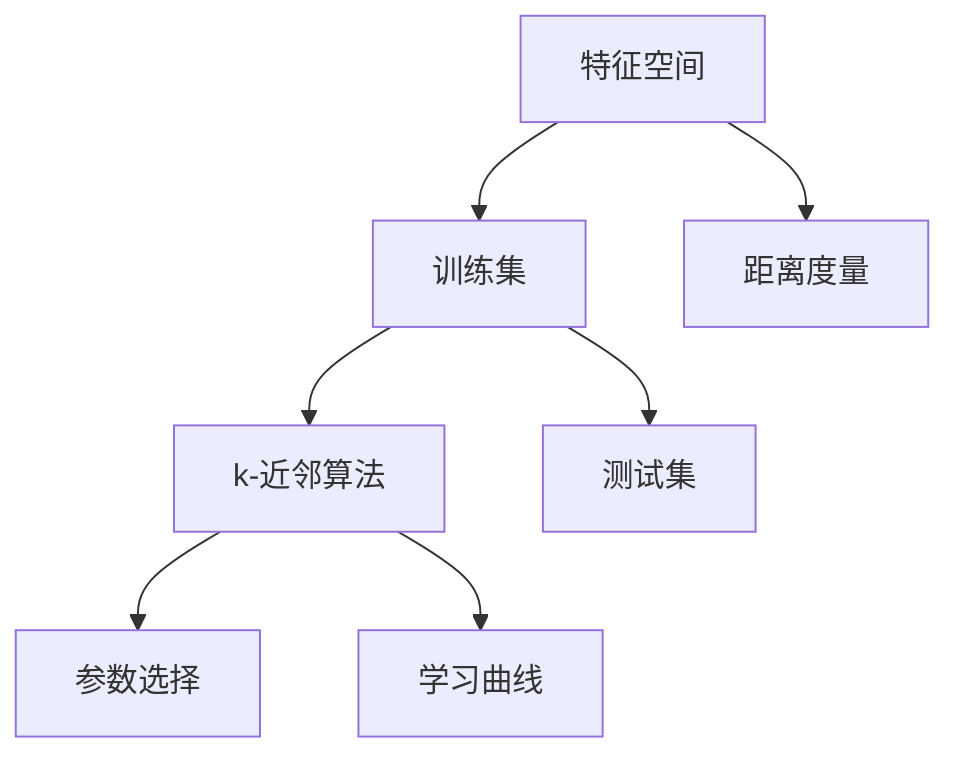

                 

# k-近邻算法(k-Nearest Neighbors) - 原理与代码实例讲解

> 关键词：k-近邻算法, 特征距离度量, 参数选择, 性能评估, 代码实现, 数据集处理, 优化技巧

## 1. 背景介绍

### 1.1 问题由来
k-近邻算法（k-Nearest Neighbors, KNN）是一种经典的无参分类和回归算法，其基本思想是在已知的数据集中寻找最相似的样本，从而进行预测。自1973年提出以来，k-近邻算法凭借其简单易懂、高效实用等优势，在工业界和学术界广受青睐，应用领域涵盖了金融风险评估、医疗诊断、自然语言处理、图像识别等诸多领域。

然而，尽管k-近邻算法本身逻辑简单，但在实际应用中仍然面临着诸多挑战，如参数选择困难、数据维度高、计算复杂度高、易受噪声干扰等。因此，如何优化算法性能，使其更好地适应实际应用场景，成为当前研究的重点。

### 1.2 问题核心关键点
k-近邻算法在实际应用中，需要选择合适的参数$k$、距离度量方法、数据预处理等，才能在保证精度的同时，提升计算效率和泛化能力。具体关键点包括：
1. 参数$k$的选择。$k$代表近邻数量，其大小直接影响预测结果的稳定性。
2. 距离度量方法的选择。不同的距离度量方法适用于不同的数据类型和任务。
3. 数据预处理。对于不同来源的数据，需要进行标准化、归一化、降维等预处理，以提高算法的鲁棒性。
4. 性能评估。需要选择合适的评估指标（如准确率、召回率、F1分数等），评估算法效果。

## 2. 核心概念与联系

### 2.1 核心概念概述

为更好地理解k-近邻算法的原理和应用，本节将介绍几个关键概念：

- 分类（Classification）：将样本分入预定义的类别中的任务。k-近邻算法通过寻找样本的最近邻进行分类。
- 回归（Regression）：通过给定输入值预测连续的输出值。k-近邻算法可以通过寻找样本的最近邻进行回归预测。
- 近邻（Nearest Neighbor）：k-近邻算法的基本单位，即在训练集中与测试样本距离最近的$k$个样本。
- 距离度量（Distance Metric）：衡量样本之间相似度的数学函数，常见的有欧式距离、曼哈顿距离、余弦相似度等。
- 特征空间（Feature Space）：样本的属性集合，通常为多维向量空间。
- 训练集（Training Set）：用于模型训练的数据集。
- 测试集（Test Set）：用于模型评估的数据集。
- 学习曲线（Learning Curve）：通过不同的训练集大小和参数值，绘制出的学习曲线可以直观地反映模型性能。

这些核心概念之间的逻辑关系可以通过以下Mermaid流程图来展示：



这个流程图展示了大语言模型的核心概念及其之间的关系：

1. 特征空间从数据中提取样本的属性，用于模型训练和预测。
2. 训练集和测试集分别用于模型训练和评估。
3. k-近邻算法通过距离度量方法在训练集中寻找最近邻，进行分类或回归预测。
4. 参数选择和距离度量方法直接影响模型性能。
5. 学习曲线用于评估模型在不同参数值下的性能变化趋势。

这些概念共同构成了k-近邻算法的学习和应用框架，使其能够在各种场景下发挥强大的预测能力。通过理解这些核心概念，我们可以更好地把握k-近邻算法的原理和优化方向。

## 3. 核心算法原理 & 具体操作步骤
### 3.1 算法原理概述

k-近邻算法的基本思想是通过样本间的距离度量，寻找与测试样本距离最近的$k$个训练样本，根据这些样本来进行分类或回归预测。具体而言，对于给定的测试样本$x_0$，通过距离度量方法$D$计算其与每个训练样本$x_i$的距离，并选出距离最近的$k$个样本作为$k$近邻，然后根据这些样本的类别或回归值进行预测。

形式化地，假设训练集为$D=\{x_1,x_2,\dots,x_n\}$，测试样本为$x_0$。对于分类任务，k-近邻算法的预测过程如下：

1. 计算$x_0$与每个$x_i$的距离$d(x_0,x_i)$。
2. 选取距离最近的$k$个样本$N_k(x_0)=\{x_{i_1},x_{i_2},\dots,x_{i_k}\}$。
3. 在$N_k(x_0)$中统计每个类别的样本数，选择出现次数最多的类别作为预测结果。

对于回归任务，则选取距离最近的$k$个样本的平均值作为预测结果。

### 3.2 算法步骤详解

k-近邻算法的主要步骤如下：

**Step 1: 数据预处理**
- 对于连续型数据，进行归一化或标准化处理，使得数据在一个标准范围内。
- 对于离散型数据，进行编码处理，如独热编码或标签编码，转换为数值型数据。

**Step 2: 距离度量方法选择**
- 选择合适的距离度量方法，如欧式距离、曼哈顿距离、余弦相似度等。

**Step 3: 模型训练**
- 准备训练数据集$D=\{(x_1,y_1),(x_2,y_2),\dots,(x_n,y_n)\}$，$x_i$为特征向量，$y_i$为标签。
- 在训练集上，计算每个测试样本$x_0$与$x_i$的距离$d(x_0,x_i)$。

**Step 4: 预测**
- 对于分类任务，选择距离最近的$k$个样本$N_k(x_0)$，统计每个类别的样本数，选择出现次数最多的类别作为预测结果。
- 对于回归任务，选择距离最近的$k$个样本的平均值作为预测结果。

**Step 5: 模型评估**
- 准备测试数据集$E=\{(x_{n+1},y_{n+1}),(x_{n+2},y_{n+2}),\dots,(x_{n+m},y_{n+m})\}$，$x_i$为特征向量，$y_i$为标签。
- 在测试集上，使用预测结果与实际标签进行比较，评估模型性能。

### 3.3 算法优缺点

k-近邻算法具有以下优点：
1. 简单易懂，易于实现和调试。
2. 适用于任何类型的数据，包括连续型和离散型。
3. 对于噪声不敏感，抗干扰能力较强。
4. 可以直接应用于多分类任务。

但同时，该算法也存在以下缺点：
1. 计算复杂度高，当数据量或特征维度较大时，计算量呈指数级增长。
2. 参数选择困难，$k$值过小可能导致过拟合，过大可能导致欠拟合。
3. 内存消耗大，存储所有训练数据和距离矩阵，对于大规模数据集难以处理。
4. 需要存储所有训练数据，无法在线实时更新。

### 3.4 算法应用领域

k-近邻算法在诸多领域得到了广泛的应用，包括但不限于：

- 金融风险评估：通过历史数据预测贷款违约率、信用评分等。
- 医疗诊断：利用患者症状和病历数据，预测疾病种类和严重程度。
- 自然语言处理：通过文本特征和词向量，进行文本分类和情感分析。
- 图像识别：通过像素特征，进行图像分类和物体检测。
- 客户推荐：通过用户行为数据，预测用户偏好，推荐商品或服务。

这些领域应用展示了k-近邻算法的强大预测能力，同时也提醒我们在实际应用中需要根据具体场景进行参数选择和优化。

## 4. 数学模型和公式 & 详细讲解 & 举例说明

### 4.1 数学模型构建

假设训练集为$D=\{(x_1,y_1),(x_2,y_2),\dots,(x_n,y_n)\}$，$x_i$为特征向量，$y_i$为标签。对于测试样本$x_0$，计算其与每个$x_i$的距离$d(x_0,x_i)$。设距离度量方法为$D$，则$k$近邻算法的预测过程如下：

对于分类任务，选择距离最近的$k$个样本$N_k(x_0)$，统计每个类别的样本数，选择出现次数最多的类别作为预测结果。对于回归任务，选择距离最近的$k$个样本的平均值作为预测结果。

### 4.2 公式推导过程

以欧式距离为例，对于分类任务，假设$x_0$与每个$x_i$的距离$d(x_0,x_i)$计算如下：

$$
d(x_0,x_i)=\sqrt{\sum_{j=1}^m (x_{0,j}-x_{i,j})^2}
$$

其中$m$为特征维度。选取距离最近的$k$个样本$N_k(x_0)$，统计每个类别的样本数，选择出现次数最多的类别作为预测结果。

对于回归任务，选取距离最近的$k$个样本的平均值作为预测结果：

$$
\hat{y}_k=\frac{1}{k}\sum_{i=1}^k y_i
$$

其中$y_i$为$x_i$对应的标签。

### 4.3 案例分析与讲解

下面以一个简单的例子来说明k-近邻算法的具体实现过程。

**示例：**
假设有一个水果分类问题，特征向量为$x_i=(x_{i,1},x_{i,2},x_{i,3})$，其中$x_{i,1}$为水果大小，$x_{i,2}$为颜色，$x_{i,3}$为重量，标签$y_i$为$1$（苹果）或$0$（其他）。训练集为：

| 大小 | 颜色 | 重量 | 标签 |
| --- | --- | --- | --- |
| 10cm | 红色 | 150g | 1 |
| 8cm | 绿色 | 100g | 1 |
| 12cm | 黄色 | 200g | 1 |
| 5cm | 绿色 | 50g | 1 |
| 7cm | 黄色 | 100g | 0 |

测试样本$x_0=(9cm, 红色, 130g)$，选取$k=3$。

**步骤1: 数据预处理**
- 假设对大小和重量进行归一化处理，颜色进行独热编码处理。

**步骤2: 距离度量方法选择**
- 假设选择欧式距离作为距离度量方法。

**步骤3: 模型训练**
- 计算每个测试样本$x_0$与$x_i$的距离$d(x_0,x_i)$。
- 选取距离最近的3个样本$N_k(x_0)=\{x_2,x_4,x_5\}$。

**步骤4: 预测**
- 在$N_k(x_0)$中统计每个类别的样本数，选择出现次数最多的类别作为预测结果。
- 预测结果为$0$，因为红色苹果出现次数为1，黄色苹果出现次数为2，绿色苹果出现次数为2，选择出现次数最多的绿色苹果作为预测结果。

## 5. 项目实践：代码实例和详细解释说明
### 5.1 开发环境搭建

在进行k-近邻算法实践前，我们需要准备好开发环境。以下是使用Python进行Scikit-learn开发的环境配置流程：

1. 安装Anaconda：从官网下载并安装Anaconda，用于创建独立的Python环境。

2. 创建并激活虚拟环境：
```bash
conda create -n sklearn-env python=3.8 
conda activate sklearn-env
```

3. 安装Scikit-learn：
```bash
conda install scikit-learn
```

4. 安装各类工具包：
```bash
pip install numpy pandas matplotlib scikit-learn
```

完成上述步骤后，即可在`sklearn-env`环境中开始k-近邻算法的实践。

### 5.2 源代码详细实现

我们以k-近邻算法为例，给出使用Scikit-learn库进行分类任务的PyTorch代码实现。

首先，定义特征向量和标签：

```python
from sklearn.datasets import load_iris
from sklearn.model_selection import train_test_split
from sklearn.neighbors import KNeighborsClassifier

iris = load_iris()
X = iris.data
y = iris.target
```

然后，定义模型和优化器：

```python
from sklearn.neighbors import KNeighborsClassifier

k = 3
model = KNeighborsClassifier(n_neighbors=k)
```

接着，定义训练和评估函数：

```python
from sklearn.metrics import accuracy_score
from sklearn.model_selection import train_test_split

X_train, X_test, y_train, y_test = train_test_split(X, y, test_size=0.2, random_state=42)

def train_model(model, X_train, y_train):
    model.fit(X_train, y_train)
    return model

def evaluate_model(model, X_test, y_test):
    y_pred = model.predict(X_test)
    return accuracy_score(y_test, y_pred)
```

最后，启动训练流程并在测试集上评估：

```python
model = train_model(model, X_train, y_train)
accuracy = evaluate_model(model, X_test, y_test)
print(f"Accuracy: {accuracy:.2f}")
```

以上就是使用Scikit-learn对k-近邻算法进行分类的完整代码实现。可以看到，Scikit-learn提供了简单易用的API，使得k-近邻算法的代码实现变得简洁高效。

### 5.3 代码解读与分析

让我们再详细解读一下关键代码的实现细节：

**load_iris函数**：
- 从Scikit-learn数据集库中加载鸢尾花数据集，包含150个样本，4个特征，3个类别。

**train_test_split函数**：
- 将数据集划分为训练集和测试集，各占80%和20%，并设置随机种子以确保结果可复现。

**KNeighborsClassifier类**：
- 创建k-近邻分类器，指定近邻数为3。

**train_model函数**：
- 在训练集上训练模型，返回训练好的模型对象。

**evaluate_model函数**：
- 在测试集上评估模型性能，返回准确率。

**训练流程**：
- 创建模型对象。
- 在训练集上训练模型。
- 在测试集上评估模型性能。
- 输出模型评估结果。

可以看到，Scikit-learn提供了丰富的工具函数和类库，使得k-近邻算法的实现变得简单高效。开发者可以将更多精力放在模型改进和参数调优等高层逻辑上，而不必过多关注底层的实现细节。

当然，工业级的系统实现还需考虑更多因素，如模型的保存和部署、超参数的自动搜索、更灵活的算法定制等。但核心的k-近邻算法实现基本与此类似。

## 6. 实际应用场景
### 6.1 智能客服系统

基于k-近邻算法的智能客服系统可以通过历史客服对话记录，预测客户最可能的意图和回答，从而提高响应速度和准确性。在具体实现中，可以通过对客户输入的文本进行特征提取，选择距离最近的$k$个对话记录作为近邻，然后根据这些记录的对话内容，生成最佳回复。

### 6.2 金融风险评估

k-近邻算法在金融领域可以用于风险评估，通过历史贷款数据预测违约概率。在具体实现中，可以计算贷款特征向量与每个样本的距离，选择距离最近的$k$个样本作为近邻，根据这些样本的违约情况，预测新贷款的违约概率。

### 6.3 医疗诊断

k-近邻算法在医疗领域可以用于疾病诊断，通过患者症状数据预测疾病种类。在具体实现中，可以计算症状向量与每个样本的距离，选择距离最近的$k$个样本作为近邻，根据这些样本的疾病种类，预测患者可能患有的疾病。

### 6.4 未来应用展望

随着k-近邻算法的不断优化和应用场景的拓展，其未来应用前景广阔：

1. 工业应用。在工业生产中，k-近邻算法可以用于预测设备故障、优化生产流程等。
2. 社交网络分析。在社交网络中，k-近邻算法可以用于推荐好友、发现兴趣群体等。
3. 生物信息学。在生物信息学中，k-近邻算法可以用于基因分类、蛋白质结构预测等。
4. 游戏开发。在游戏开发中，k-近邻算法可以用于角色推荐、物品推荐等。
5. 物流优化。在物流领域，k-近邻算法可以用于路径规划、仓库选址等。

未来，随着数据量的不断增长和算法性能的不断提升，k-近邻算法将会在更多领域发挥其强大的预测能力，为各行各业带来新的突破。

## 7. 工具和资源推荐
### 7.1 学习资源推荐

为了帮助开发者系统掌握k-近邻算法的理论基础和实践技巧，这里推荐一些优质的学习资源：

1. 《机器学习实战》（机器学习实战）：详细介绍了k-近邻算法的基本原理、实现方法及应用场景。
2. Coursera的《机器学习》课程：由斯坦福大学教授Andrew Ng主讲，涵盖k-近邻算法等多个机器学习基础和进阶内容。
3. Kaggle上的k-近邻算法竞赛：参与实际比赛，实战提升k-近邻算法的应用技能。
4. Scikit-learn官方文档：提供丰富的API和类库，涵盖k-近邻算法的实现细节及优化技巧。
5. GitHub上的k-近邻算法实现项目：查看开源实现，学习如何高效实现k-近邻算法。

通过对这些资源的学习实践，相信你一定能够快速掌握k-近邻算法的精髓，并用于解决实际的NLP问题。

### 7.2 开发工具推荐

高效的开发离不开优秀的工具支持。以下是几款用于k-近邻算法开发的常用工具：

1. Scikit-learn：提供了简单易用的API和类库，支持k-近邻算法的多种实现方法。
2. PyTorch：基于Python的深度学习框架，支持自定义实现和GPU加速。
3. TensorFlow：由Google主导开发的深度学习框架，支持分布式计算和GPU加速。
4. Kaggle：提供在线数据分析和机器学习竞赛平台，提供丰富的数据集和社区资源。
5. Jupyter Notebook：提供交互式的数据分析和模型实现环境，方便快速实验和展示结果。

合理利用这些工具，可以显著提升k-近邻算法的开发效率，加快创新迭代的步伐。

### 7.3 相关论文推荐

k-近邻算法的研究源于学界的持续研究。以下是几篇奠基性的相关论文，推荐阅读：

1. A taxonomy of k-nearest neighbor algorithms (1983)：定义了k-近邻算法的多种变体和优化方法。
2. K-nearest neighbor pattern recognition (1970)：提出了k-近邻算法的基本思想和实现方法。
3. An introduction to the k-nearest neighbor rule (1967)：介绍了k-近邻算法的基本原理和应用场景。
4. Improving the k-nearest neighbor classifier through the use of ensembles (1996)：提出了集成学习的k-近邻算法变体。
5. The kernel k-nearest neighbor: a novel nonparametric function estimator (1992)：引入了核函数方法，优化了k-近邻算法。

这些论文代表了大近邻算法的演进脉络。通过学习这些前沿成果，可以帮助研究者把握学科前进方向，激发更多的创新灵感。

## 8. 总结：未来发展趋势与挑战

### 8.1 总结

本文对k-近邻算法进行了全面系统的介绍。首先阐述了k-近邻算法的背景和应用场景，明确了其在分类和回归任务中的强大预测能力。其次，从原理到实践，详细讲解了k-近邻算法的数学模型和实现方法，给出了具体的代码实例。同时，本文还探讨了k-近邻算法在工业应用中的广泛适用性，展示了其巨大的应用潜力。

通过本文的系统梳理，可以看到，k-近邻算法在许多领域都展现出了其独特的优势，但其实现过程中仍面临一些挑战，如参数选择、计算复杂度、内存消耗等。未来，如何优化算法性能，提升其在实际应用中的表现，将是k-近邻算法研究的重要方向。

### 8.2 未来发展趋势

展望未来，k-近邻算法的未来发展趋势主要体现在以下几个方面：

1. 集成学习。k-近邻算法可以与其他机器学习算法进行集成，如决策树、随机森林等，通过模型融合提升性能。
2. 核函数扩展。通过引入核函数，k-近邻算法可以处理高维数据和非线性关系，拓展其应用场景。
3. 在线学习。通过增量学习机制，k-近邻算法可以实现实时更新，适应不断变化的数据分布。
4. 分布式计算。通过分布式计算技术，k-近邻算法可以处理大规模数据集，提升计算效率。
5. 多模态融合。通过融合不同模态的数据，k-近邻算法可以提升预测准确性。

这些趋势凸显了k-近邻算法的强大预测能力，同时也提醒我们在实际应用中需要结合具体场景进行参数选择和优化。

### 8.3 面临的挑战

尽管k-近邻算法已经取得了显著的成果，但在迈向更加智能化、普适化应用的过程中，仍面临一些挑战：

1. 计算复杂度。k-近邻算法计算复杂度较高，面对大规模数据集时，计算时间开销较大。如何优化算法性能，提升计算效率，是未来需要解决的关键问题。
2. 数据维度问题。k-近邻算法在高维数据上的性能较差，容易陷入"维数灾难"。如何降维处理，提升算法鲁棒性，是未来研究的重点。
3. 参数选择问题。k-近邻算法中$k$值的选择较为困难，需要根据具体任务进行调参。如何选择合适的$k$值，是未来研究的难点。
4. 内存消耗问题。k-近邻算法需要存储所有训练数据和距离矩阵，内存消耗较大。如何优化内存使用，降低内存消耗，是未来需要解决的问题。
5. 算法适用性问题。k-近邻算法在某些领域（如图像、语音等）的适用性较弱，需要进一步拓展其应用范围。

这些挑战需要我们在未来研究中进行深入探索，不断优化算法性能，提升其普适性和实用性。

### 8.4 研究展望

面对k-近邻算法所面临的挑战，未来研究需要在以下几个方面寻求新的突破：

1. 数据降维技术。通过引入PCA、LDA等降维方法，减少特征维度，提高算法性能。
2. 算法优化。通过引入快速近邻算法、局部敏感哈希等优化方法，提升计算效率和算法性能。
3. 多模态融合技术。通过融合图像、语音、文本等多模态数据，提高预测准确性。
4. 分布式计算技术。通过分布式计算框架，处理大规模数据集，提高算法计算效率。
5. 在线学习技术。通过增量学习机制，实现实时更新，提升算法适应性。

这些研究方向的探索，必将引领k-近邻算法迈向更高的台阶，为构建高效、鲁棒、普适的智能系统铺平道路。面向未来，k-近邻算法的研究需要与其他人工智能技术进行更深入的融合，如深度学习、强化学习等，共同推动k-近邻算法的进步和应用。只有勇于创新、敢于突破，才能不断拓展k-近邻算法的边界，让智能技术更好地造福人类社会。

## 9. 附录：常见问题与解答

**Q1：k-近邻算法适用于所有数据类型吗？**

A: k-近邻算法适用于所有类型的数据，包括连续型和离散型。但需要注意的是，对于高维数据和稀疏数据，k-近邻算法的性能可能会受到影响。此时需要引入降维技术和稀疏编码方法，以提高算法的鲁棒性。

**Q2：k-近邻算法的计算复杂度如何？**

A: k-近邻算法的计算复杂度为$O(dn^2)$，其中$d$为特征维度，$n$为样本数量。面对大规模数据集，计算时间开销较大。为了优化计算效率，可以引入快速近邻算法（如KD-Tree）、局部敏感哈希等方法。

**Q3：k-近邻算法的参数$k$如何选择？**

A: k-近邻算法的参数$k$需要根据具体任务进行调参。一般建议从1到数据集大小之间选择一个合适的$k$值，可以通过交叉验证和网格搜索等方法进行调参。在实际应用中，通常使用经验法则，如$k=5$或$k=10$。

**Q4：k-近邻算法在处理高维数据时面临哪些问题？**

A: k-近邻算法在高维数据上的性能较差，容易陷入"维数灾难"。为了优化算法性能，可以引入降维技术，如PCA、LDA等，将高维数据映射到低维空间中。此外，可以引入核函数方法，处理非线性关系，拓展算法的应用场景。

**Q5：k-近邻算法的缺点有哪些？**

A: k-近邻算法的主要缺点包括计算复杂度高、内存消耗大、参数选择困难等。为了优化算法性能，可以引入快速近邻算法、局部敏感哈希等优化方法，减少计算时间开销。同时，可以通过降维技术和核函数方法，提高算法鲁棒性和泛化能力。

这些问题的解答，可以帮助开发者更好地理解k-近邻算法的实现细节和应用场景，从而在实际应用中取得更好的效果。

---

作者：禅与计算机程序设计艺术 / Zen and the Art of Computer Programming

