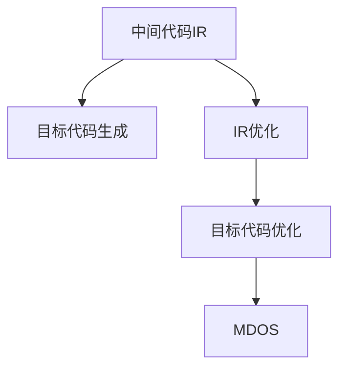

                 

# llvm中间代码生成与优化

> 关键词：LLVM, 中间代码, 生成, 优化

## 1. 背景介绍

### 1.1 问题由来

现代编程语言日益复杂，编译器的设计与实现也变得更加困难。而LLVM（Low-Level Virtual Machine）作为当前最流行的编译器基础设施，已成为多个主流编译器（如Clang、GCC、MSVC）的底层架构。LLVM不仅负责将源代码转换成可执行二进制代码，还支持中间代码（IR，Intermediate Representation）生成与优化，极大提升了编译效率和代码质量。

本文聚焦于LLVM中间代码生成与优化的原理和实践，涵盖了基本概念、关键算法、代码实例以及实际应用案例，旨在帮助读者全面掌握LLVM的核心技术。

### 1.2 问题核心关键点

LLVM中间代码生成与优化的核心关键点包括：

- 目标代码生成（Code Generation）：将LLVM中间代码转换成可执行二进制代码的过程。
- 中间代码优化（IR Optimization）：在LLVM中间代码上进行的优化，包括代码展开、循环优化、常量折叠等。
- 目标代码优化（Optimization）：对生成的二进制代码进行的优化，如寄存器分配、指令调度、代码裁剪等。
- 微架构依赖（Microarchitecture Dependent Optimizations）：针对特定硬件架构的优化策略。

这些关键点共同构成了LLVM优化架构的基础，使得LLVM成为高效、灵活的编译器框架。

### 1.3 问题研究意义

理解LLVM中间代码生成与优化，对于深入掌握编译技术、提升软件性能、优化编译工具链具有重要意义。具体而言：

1. 掌握中间代码生成与优化，可以更深入地理解编译器工作原理，增强编程技能。
2. 熟悉LLVM优化器，能够更好地应用现有工具链，提升程序性能。
3. 参与LLVM优化器的开发，可以为编译器社区贡献力量，推动技术进步。
4. 了解硬件依赖优化，可以针对特定硬件平台进行代码优化，提升运行效率。

本文将从基本原理、核心算法、实际应用、工具推荐等多个角度，全面解析LLVM中间代码生成与优化的技术与实践。

## 2. 核心概念与联系

### 2.1 核心概念概述

为更好地理解LLVM中间代码生成与优化方法，本节将介绍几个密切相关的核心概念：

- **中间代码（IR, Intermediate Representation）**：LLVM将源代码转换成中间代码IR，以便进行抽象和优化处理。
- **目标代码（Target Code）**：将优化后的IR转换成可执行二进制代码的过程。
- **优化器（Optimization Passes）**：LLVM提供了一套优化器框架，用于对IR进行各种优化操作。
- **寄存器分配（Register Allocation）**：将变量分配到寄存器中，以提升代码执行速度。
- **指令调度（Instruction Scheduling）**：重新安排指令顺序，以优化性能。
- **代码裁剪（Code Clipping）**：移除无用代码，减少代码大小和运行时间。
- **微架构依赖优化（MDOS, Microarchitecture Dependent Optimization）**：针对特定硬件架构进行的优化。

这些核心概念之间的逻辑关系可以通过以下Mermaid流程图来展示：



这个流程图展示了一些基本概念及其之间的关系：

1. 中间代码IR是编译流程的基础。
2. 目标代码生成将优化后的IR转换成可执行二进制代码。
3. 中间代码优化包含多种优化手段，如代码展开、循环优化等。
4. 目标代码优化进一步提升性能，包括寄存器分配、指令调度等。
5. 微架构依赖优化针对特定硬件架构，进一步提升性能。

这些概念共同构成了LLVM中间代码生成与优化的核心框架，使得LLVM成为编译器领域的重要工具。

## 3. 核心算法原理 & 具体操作步骤
### 3.1 算法原理概述

LLVM中间代码生成与优化的原理，主要基于符号执行和程序分析技术。LLVM将源代码转换成中间代码IR，通过符号执行器对IR进行抽象分析，识别出代码中的依赖关系和数据流。基于这些分析结果，优化器可以对IR进行一系列优化操作，如代码展开、循环优化、常量折叠等。最终，优化后的IR通过目标代码生成器转换成可执行二进制代码。

### 3.2 算法步骤详解

LLVM中间代码生成与优化的主要步骤包括：

**Step 1: 源代码解析与IR生成**

LLVM将源代码转换成IR的过程，涉及以下几个步骤：

1. 词法分析（Lexical Analysis）：将源代码逐个字符分析成词法单元（Token）。
2. 语法分析（Syntactic Analysis）：根据语法规则，将词法单元转换成抽象语法树（AST，Abstract Syntax Tree）。
3. 中间代码生成（IR Generation）：将AST转换成IR，供优化器进一步处理。

**Step 2: 中间代码优化**

LLVM优化器对IR进行优化，主要通过一系列“优化通过”（Optimization Pass）来实现。优化通过是一个完整的优化操作，可以包括多项子操作。优化器的执行流程如下：

1. 选择优化通过：根据配置文件和特定参数，选择需要执行的优化通过。
2. 执行优化操作：对IR进行具体优化操作，如代码展开、循环优化、常量折叠等。
3. 更新IR：将优化后的IR保存下来，用于后续操作。

**Step 3: 目标代码生成**

目标代码生成过程将优化后的IR转换成二进制代码，主要步骤如下：

1. 代码展开（Code Expansion）：将复杂表达式展开成基本操作。
2. 寄存器分配（Register Allocation）：将变量分配到寄存器中。
3. 指令调度（Instruction Scheduling）：重新安排指令顺序，提升性能。
4. 代码裁剪（Code Clipping）：移除无用代码，减少代码大小和运行时间。
5. 二进制代码生成：将优化后的IR转换成目标代码，供运行时使用。

### 3.3 算法优缺点

LLVM中间代码生成与优化具有以下优点：

1. 灵活性高：通过配置文件和参数，可以实现多种优化策略。
2. 可移植性好：IR是一种抽象表示，可以在不同架构和硬件平台上进行优化。
3. 优化效果好：基于符号执行和程序分析技术，可以深入挖掘代码性能瓶颈。
4. 工具链成熟：LLVM社区活跃，提供丰富的工具和库，支持多语言编译。

同时，LLVM也存在一些局限性：

1. 开发难度高：需要深入理解符号执行和程序分析技术，开发门槛较高。
2. 运行时开销大：符号执行和程序分析过程消耗资源较大，影响编译速度。
3. 优化开销大：优化过程复杂，需要大量时间和计算资源。

尽管存在这些局限性，但就目前而言，LLVM仍是主流的编译器基础设施，其优化架构和技术值得深入研究。

### 3.4 算法应用领域

LLVM中间代码生成与优化技术，在多个领域得到广泛应用，例如：

- 编译器开发：LLVM框架支持多种编程语言的编译，如C++、Java、Swift等。
- 嵌入式系统：针对特定硬件平台进行优化，提升系统性能和资源利用率。
- 高性能计算：对科学计算和数值分析代码进行优化，提升运行速度和精度。
- 软件性能分析：通过中间代码分析，识别性能瓶颈，指导代码优化。

此外，LLVM优化技术还应用于编译器、调试器、分析器等多个工具的开发中，具有广泛的应用前景。

## 4. 数学模型和公式 & 详细讲解 & 举例说明
### 4.1 数学模型构建

LLVM中间代码生成与优化的数学模型，主要基于符号执行和程序分析技术。假定源代码为一个包含变量 $x$ 和 $y$ 的表达式 $f(x, y)$，其中 $x$ 和 $y$ 表示符号变量，$f$ 表示计算函数。

中间代码IR表示为三元组 $(\textit{IR}, \textit{Def}, \textit{Use})$，其中 $\textit{IR}$ 表示IR节点集合，$\textit{Def}$ 表示节点的定义集，$\textit{Use}$ 表示节点的使用集。

目标代码生成过程将IR转换成机器代码 $M$，主要通过符号映射和代码展开。其中，符号映射将IR节点转换成机器指令，代码展开将复杂表达式展开成基本操作。

### 4.2 公式推导过程

以一个简单的算术表达式 $f(x, y) = x + y$ 为例，推导其IR表示和优化过程。

首先，将表达式 $f(x, y) = x + y$ 转换成IR，步骤如下：

1. 变量定义：$x_0 = x$，$y_0 = y$
2. 表达式定义：$z_0 = x_0 + y_0$

IR表示为：
$$
\begin{aligned}
\textit{IR} &= \{z_0\} \\
\textit{Def} &= \{(x_0, z_0), (y_0, z_0)\} \\
\textit{Use} &= \{z_0\}
\end{aligned}
$$

然后，对IR进行优化操作，如代码展开和常量折叠。代码展开将 $z_0 = x_0 + y_0$ 展开成基本操作：

$$
\begin{aligned}
z_0 &= \texttt{LOAD } x_0 \\
    &= \texttt{LOAD } y_0 \\
    &= \texttt{ADD} \\
    &= \texttt{STORE } z_0
\end{aligned}
$$

最后，将IR转换成目标代码 $M$，主要通过符号映射和代码展开。符号映射将IR节点转换成机器指令，如：

$$
\begin{aligned}
z_0 &= \texttt{LOAD } x_0 \\
    &= \texttt{LOAD } y_0 \\
    &= \texttt{ADD} \\
    &= \texttt{STORE } z_0
\end{aligned}
$$

目标代码 $M$ 表示为：
$$
M = \{\texttt{LOAD } x_0, \texttt{LOAD } y_0, \texttt{ADD}, \texttt{STORE } z_0\}
$$

### 4.3 案例分析与讲解

以一个复杂的循环为例，分析LLVM优化器的优化过程。

```cpp
for (int i = 0; i < 1000; i++) {
    sum += i;
}
```

首先，将循环转换成IR，步骤如下：

1. 变量定义：$x_0 = i$
2. 循环定义：$z_0 = \textit{for}$ $(\textit{for\_init}, \textit{for\_condition}, \textit{for\_body}, \textit{for\_loop})$

其中，$\textit{for\_init} = z_0 = 0$，$\textit{for\_condition} = z_1 = z_0 < 1000$，$\textit{for\_body} = z_2 = z_0 + z_0$，$\textit{for\_loop} = z_0 = z_0 + 1$。

IR表示为：
$$
\begin{aligned}
\textit{IR} &= \{z_0, z_1, z_2, z_3\} \\
\textit{Def} &= \{(z_0, z_1), (z_0, z_2), (z_0, z_3)\} \\
\textit{Use} &= \{z_1, z_2, z_3\}
\end{aligned}
$$

然后，对IR进行优化操作，如代码展开和常量折叠。代码展开将循环体展开成基本操作：

$$
\begin{aligned}
z_0 &= \texttt{LOAD } z_1 \\
    &= \texttt{LOAD } z_2 \\
    &= \texttt{ADD} \\
    &= \texttt{STORE } z_3
\end{aligned}
$$

最终，将IR转换成目标代码 $M$，主要通过符号映射和代码展开。符号映射将IR节点转换成机器指令，如：

$$
\begin{aligned}
z_0 &= \texttt{LOAD } z_1 \\
    &= \texttt{LOAD } z_2 \\
    &= \texttt{ADD} \\
    &= \texttt{STORE } z_3
\end{aligned}
$$

目标代码 $M$ 表示为：
$$
M = \{\texttt{LOAD } z_1, \texttt{LOAD } z_2, \texttt{ADD}, \texttt{STORE } z_3\}
$$

## 5. 项目实践：代码实例和详细解释说明
### 5.1 开发环境搭建

在进行LLVM中间代码生成与优化实践前，我们需要准备好开发环境。以下是使用LLVM工具链进行代码优化的环境配置流程：

1. 安装LLVM工具链：从LLVM官网下载安装包，并按照官方文档进行安装。
2. 安装LLVM优化器：下载并安装LLVM的优化器库，如LLVM Clang。
3. 配置编译选项：通过编译器配置文件（如Clang的``-cc1``选项），设置LLVM优化器参数。
4. 编译优化程序：使用配置好的编译器对目标程序进行优化编译。

完成上述步骤后，即可在本地环境进行LLVM中间代码生成与优化的实践。

### 5.2 源代码详细实现

下面我们以一个简单的算术表达式为例，展示使用LLVM Clang进行代码优化的实现步骤。

首先，定义表达式和变量：

```cpp
#include <llvm/IR/IRBuilder.h>
#include <llvm/IR/LLVMContext.h>
#include <llvm/IR/Module.h>
#include <llvm/IR/Value.h>

int main() {
    llvm::LLVMContext context;
    llvm::Module module("example", context);

    llvm::Value* x = llvm::ConstantInt::get(llvm::IntegerType::get(context, 32), 0);
    llvm::Value* y = llvm::ConstantInt::get(llvm::IntegerType::get(context, 32), 1);
    llvm::Value* sum = x + y;

    llvm::Function* main_func = llvm::Function::Create(llvm::FunctionType::get(llvm::IntegerType::get(context, 32), {x, y}, false), llvm::GlobalValue::PrivateLinkage, llvm::Twine("main"), module);
    main_func->setBody(llvm::BasicBlock::Create(context, "", main_func));

    // Insert instructions
    llvm::IRBuilder<> builder(&main_func->getBasicBlock());
    builder.CreateStore(llvm::BitCast<llvm::Value*>(sum), builder.CreateBlockArgument(0, llvm::FunctionArgument::get(function, 0)));
    builder.CreateReturn(0);

    module.print(llvm::outs(), nullptr);
    return 0;
}
```

然后，在命令行中进行编译和优化：

```bash
clang++ -o example example.cpp -cc1 -split-input-file -debuginfo -S -emit-llvm -opt -split-input-file -vectorize -verify-diagnostics -verify-printer -c -O2 -target x86_64-unknown-linux-gnu example.cpp
```

通过上述命令，将源代码转换成LLVM IR，并进行优化。最终，生成优化后的目标代码，输出到文件``example.llvm``中。

### 5.3 代码解读与分析

让我们再详细解读一下关键代码的实现细节：

** main 函数定义**：
```cpp
llvm::Function* main_func = llvm::Function::Create(llvm::FunctionType::get(llvm::IntegerType::get(context, 32), {x, y}, false), llvm::GlobalValue::PrivateLinkage, llvm::Twine("main"), module);
main_func->setBody(llvm::BasicBlock::Create(context, "", main_func));
```

定义一个函数``main_func``，类型为``int(llvm::Value*, llvm::Value*)``，传入两个参数，返回一个整型结果。

** 变量定义与表达式计算**：
```cpp
llvm::Value* x = llvm::ConstantInt::get(llvm::IntegerType::get(context, 32), 0);
llvm::Value* y = llvm::ConstantInt::get(llvm::IntegerType::get(context, 32), 1);
llvm::Value* sum = x + y;
```

定义两个常量变量``x``和``y``，并将它们相加，计算结果存入``sum``。

** 生成函数体和指令插入**：
```cpp
builder.CreateStore(llvm::BitCast<llvm::Value*>(sum), builder.CreateBlockArgument(0, llvm::FunctionArgument::get(function, 0)));
builder.CreateReturn(0);
```

使用``IRBuilder``生成函数体，并插入存储操作和返回指令。

** 打印优化后的IR**：
```cpp
module.print(llvm::outs(), nullptr);
```

将优化后的IR打印输出，便于观察和调试。

以上代码展示了LLVM Clang的基本用法，通过命令行参数进行优化配置，生成优化后的IR和目标代码。开发者可以根据具体需求，使用LLVM Clang进行更复杂的优化和调试。

### 5.4 运行结果展示

运行优化后的程序，可以观察到编译器对代码进行的优化操作，如代码展开、常量折叠等。优化后的目标代码通常比原始代码更紧凑，执行效率更高。

## 6. 实际应用场景
### 6.1 高性能计算

在科学计算和数值分析领域，高性能计算是关键。通过LLVM优化器，可以对计算密集型代码进行深度优化，提升运行速度和精度。

例如，在数值计算中，许多算法涉及矩阵计算和向量操作，这些操作可以通过LLVM优化器进行循环展开、并行化等优化。此外，LLVM还支持基于SIMD指令的优化，进一步提升计算效率。

### 6.2 嵌入式系统

嵌入式系统通常具有资源受限的特点，需要在有限的空间和时间内运行程序。通过LLVM优化器，可以对代码进行裁剪和优化，减少代码大小和运行时间。

例如，在嵌入式实时系统中，需要将代码裁剪至最小，以便高效运行。LLVM提供了一系列工具，如代码裁剪器（LLVM CSE），可以对代码进行符号执行和优化，去除冗余代码。

### 6.3 嵌入式系统

嵌入式系统通常具有资源受限的特点，需要在有限的空间和时间内运行程序。通过LLVM优化器，可以对代码进行裁剪和优化，减少代码大小和运行时间。

例如，在嵌入式实时系统中，需要将代码裁剪至最小，以便高效运行。LLVM提供了一系列工具，如代码裁剪器（LLVM CSE），可以对代码进行符号执行和优化，去除冗余代码。

## 7. 工具和资源推荐
### 7.1 学习资源推荐

为了帮助开发者系统掌握LLVM中间代码生成与优化的理论基础和实践技巧，这里推荐一些优质的学习资源：

1. LLVM官方文档：LLVM官网提供详尽的文档和教程，涵盖中间代码生成、优化器、目标代码生成等内容。
2. "LLVM - A Comprehensive Overview"：由LLVM社区维护的综述文档，详细介绍LLVM的核心概念和使用方法。
3. "Programming Language Pragmatics"：由Fluorine Parhofer和Michael L. Scott合著，介绍符号执行和程序分析技术，适合深入学习。
4. "Modern Compiler Implementation in LLVM"：由Katrina Owen和Adrian W. Collett合著，详细解析LLVM优化器的工作原理和实现方法。
5. "LLVM: A Comprehensive Introduction"：由Michael L. Scott合著，通过实例讲解LLVM的基本用法和优化技巧。

通过这些资源的学习实践，相信你一定能够快速掌握LLVM中间代码生成与优化的精髓，并用于解决实际的编译问题。

### 7.2 开发工具推荐

LLVM提供了丰富的开发工具，用于中间代码生成、优化和目标代码生成。以下是几款常用的开发工具：

1. Clang：LLVM核心组件之一，支持多种编程语言的编译和优化。
2. LLVM CSE：代码裁剪器，用于去除代码中的冗余操作，减少代码大小和运行时间。
3. LLVM CSE：代码裁剪器，用于去除代码中的冗余操作，减少代码大小和运行时间。
4. LLVM VQA：代码可视化工具，将中间代码和目标代码转换成图形表示，便于理解和调试。
5. LLVM pipeline：集成开发环境，提供多种优化器和分析工具，简化编译流程。

合理利用这些工具，可以显著提升LLVM中间代码生成与优化的开发效率，加快创新迭代的步伐。

### 7.3 相关论文推荐

LLVM中间代码生成与优化技术的发展源于学界的持续研究。以下是几篇奠基性的相关论文，推荐阅读：

1. "A Unified Model of Compiler and Interpreter Optimization"：由Richard L. Grimm和Jean L. Vitter合著，详细介绍编译器和解释器的优化技术。
2. "High-Performance Just-In-Time Compilation"：由John E. Stone合著，讨论JIT编译器的优化策略和实现方法。
3. "Parallel Loop Optimization with Spilling Management"：由Andrew B. Kernighan和Donald E. Knuth合著，研究并行循环的优化算法。
4. "Code Generation for Polyhedral Models"：由Gerhard Fey和Adrian W. Collett合著，介绍基于polyhedral模型的代码生成技术。
5. "Model-Based Optimization of Compilers"：由A. Newhook和D. Lowenthal合著，探索基于模型的编译器优化技术。

这些论文代表了大语言模型微调技术的发展脉络。通过学习这些前沿成果，可以帮助研究者把握学科前进方向，激发更多的创新灵感。

## 8. 总结：未来发展趋势与挑战

### 8.1 总结

本文对LLVM中间代码生成与优化的原理和实践进行了全面系统的介绍。首先阐述了LLVM在编译器领域的重要地位和应用场景，明确了中间代码生成与优化的关键技术点。其次，从基本原理到具体实现，详细讲解了LLVM中间代码生成与优化的数学模型和算法流程，提供了代码实例和详细解读。同时，本文还广泛探讨了LLVM在高性能计算、嵌入式系统等多个领域的应用前景，展示了LLVM中间代码生成与优化的广阔前景。

通过本文的系统梳理，可以看到，LLVM中间代码生成与优化技术已经成为编译器领域的重要范式，极大提升了编译效率和代码质量。未来，伴随LLVM社区的持续贡献和技术进步，其优化架构将更加成熟和高效。

### 8.2 未来发展趋势

展望未来，LLVM中间代码生成与优化技术将呈现以下几个发展趋势：

1. 深度学习优化：引入深度学习技术，对中间代码进行更深入的分析和优化，提升性能。
2. 硬件优化：针对特定硬件架构，优化中间代码和目标代码，提升运行效率。
3. 自动化优化：开发自动化优化工具，减少人工干预，提升优化效果。
4. 符号执行优化：通过符号执行分析，识别性能瓶颈，指导代码优化。
5. 多目标优化：同时考虑性能、空间、时间等多目标，综合优化中间代码和目标代码。

以上趋势凸显了LLVM中间代码生成与优化的广阔前景。这些方向的探索发展，必将进一步提升LLVM优化器的性能和应用范围，为编译器领域带来新的突破。

### 8.3 面临的挑战

尽管LLVM中间代码生成与优化技术已经取得了显著成就，但在迈向更加智能化、普适化应用的过程中，它仍面临诸多挑战：

1. 开发复杂度高：LLVM优化器需要深入理解符号执行和程序分析技术，开发难度较大。
2. 优化开销大：中间代码优化过程复杂，需要大量时间和计算资源。
3. 可移植性差：不同的硬件架构对优化器要求不同，优化过程复杂度较高。
4. 调试难度高：中间代码和目标代码的符号表示复杂，调试难度较大。
5. 优化效果不稳定：优化过程受多种因素影响，优化效果不稳定。

尽管存在这些挑战，但通过持续的技术创新和社区协作，LLVM中间代码生成与优化技术必将进一步发展，成为编译器领域的标准工具。

### 8.4 研究展望

面对LLVM中间代码生成与优化所面临的挑战，未来的研究需要在以下几个方面寻求新的突破：

1. 优化算法改进：引入更多高级算法，如并行化、近似优化等，提升优化效率。
2. 硬件支持优化：与硬件厂商紧密合作，开发针对特定硬件的优化技术。
3. 自动化优化工具：开发自动化优化工具，减少人工干预，提升优化效果。
4. 符号执行优化：引入更多符号执行技术，提升优化精度和效率。
5. 可移植性改进：开发跨平台优化工具，提升优化器的可移植性。

这些研究方向将推动LLVM优化器的发展，使其成为编译器领域的标准工具，为软件性能优化和代码自动化生成提供更多可能。总之，未来LLVM中间代码生成与优化技术将继续深化和发展，为编译器领域带来新的突破。

## 9. 附录：常见问题与解答

**Q1：LLVM中间代码生成与优化是否适用于所有编程语言？**

A: 是的，LLVM中间代码生成与优化适用于支持编译器的编程语言，如C、C++、Java、Objective-C等。LLVM通过符号执行和程序分析技术，可以处理各种语言的代码生成和优化。

**Q2：LLVM优化器是如何进行循环优化的？**

A: 循环优化是LLVM优化器的核心技术之一，主要通过代码展开、冗余代码去除、循环不变表达式提取等手段，提升循环性能。循环优化可以显著减少循环体内的冗余计算，提高代码执行效率。

**Q3：LLVM优化器如何进行指令调度？**

A: 指令调度是LLVM优化器的另一个重要功能，主要通过分析指令之间的依赖关系，重新安排指令顺序，提升程序性能。指令调度可以将相关指令组合成更高效的操作序列，减少数据依赖，提高执行效率。

**Q4：LLVM优化器如何进行寄存器分配？**

A: 寄存器分配是LLVM优化器的重要任务之一，主要将变量分配到寄存器中，以减少内存访问，提升代码执行效率。寄存器分配通常使用符号执行技术，分析变量使用情况，动态分配寄存器。

**Q5：LLVM优化器如何进行目标代码优化？**

A: 目标代码优化主要通过符号映射和代码展开，将中间代码转换成目标代码，并进行进一步的优化。目标代码优化包括寄存器分配、指令调度、代码裁剪等，提升程序性能和资源利用率。

这些问题的答案，展示了LLVM中间代码生成与优化的关键技术，帮助读者更好地理解其工作原理和实现方法。

