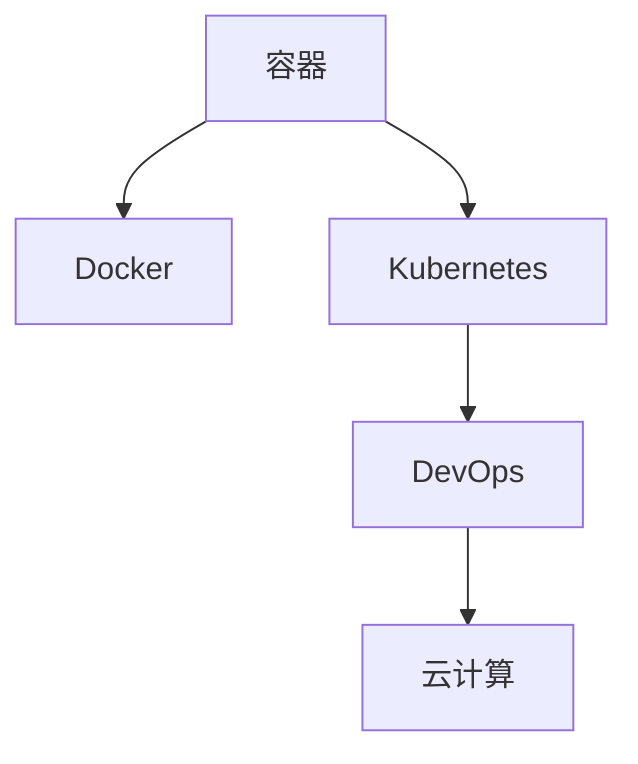

                 

# 【AI大数据计算原理与代码实例讲解】容器

> 关键词：容器, Kubernetes, Docker, 分布式计算, DevOps, 云计算

## 1. 背景介绍

### 1.1 问题由来
在人工智能(AI)和大数据计算领域，数据处理和模型训练通常需要大量的计算资源。传统的做法是将代码直接部署在服务器上，但这种方法存在诸多问题：

- **资源浪费**：每台服务器只运行一个程序，资源利用率低下。
- **环境一致性问题**：不同服务器环境不一致，导致代码在不同环境中运行结果不一致。
- **部署复杂**：手动安装依赖、配置环境、部署应用，耗时耗力。
- **扩展性差**：需要手动扩展计算资源，难以应对快速变化的需求。
- **难以维护**：随着应用规模的增大，维护成本不断上升。

为了解决这些问题，容器技术应运而生。容器化不仅提高了资源利用率，还简化了应用部署和维护，成为当前主流的大数据计算方式。本文将深入探讨容器技术的原理、应用场景和实现细节，并通过代码实例，帮助读者掌握容器化和大数据计算的实践技能。

## 2. 核心概念与联系

### 2.1 核心概念概述

- **容器**：一种轻量级的应用封装，包括应用本身、依赖库和运行时环境。容器在一个隔离的环境中运行，独立于宿主机操作系统。

- **Docker**：一个开源容器引擎，用于打包、分发和管理容器。Docker容器由一个或多个镜像构建，镜像包含了所有必要的依赖库和环境配置。

- **Kubernetes**：一个开源容器编排平台，用于自动部署、扩展和管理容器化应用。Kubernetes可以编排成千上万个容器，提供高可用性、扩展性和弹性。

- **DevOps**：一种软件开发实践，结合了软件开发和运维的流程，旨在提高软件交付速度和质量，促进持续集成和持续部署。

- **云计算**：通过互联网提供计算资源和服务的模式，包括基础设施即服务(IaaS)、平台即服务(PaaS)和软件即服务(SaaS)。

这些核心概念构成了容器技术和大数据计算的基础，相互之间联系紧密，共同支撑着现代企业级应用系统的构建和运维。

### 2.2 核心概念原理和架构的 Mermaid 流程图



## 3. 核心算法原理 & 具体操作步骤

### 3.1 算法原理概述

容器化技术的核心思想是将应用程序及其所有依赖打包在一个独立的、可移植的容器中，使应用程序在任意环境中以一致的方式运行。容器化过程主要包括镜像构建、容器创建和容器编排三个步骤。

#### 3.1.1 镜像构建
- **原理**：将应用程序及其依赖库打包到一个镜像中，镜像包含了应用程序启动所需的所有环境配置和依赖库。
- **步骤**：编写Dockerfile，指定镜像构建步骤；执行`docker build`命令构建镜像。

#### 3.1.2 容器创建
- **原理**：从镜像中创建容器实例，容器实例运行在隔离的环境中，与宿主机操作系统和网络分离。
- **步骤**：执行`docker run`命令创建容器实例。

#### 3.1.3 容器编排
- **原理**：通过容器编排工具管理容器的生命周期，实现自动化部署、扩展和管理。
- **步骤**：使用Kubernetes编排容器，实现应用的自动化部署、扩展和监控。

### 3.2 算法步骤详解

#### 3.2.1 构建Docker镜像

1. **编写Dockerfile**：
```Dockerfile
# 指定基础镜像
FROM ubuntu:16.04

# 更新系统
RUN apt-get update && apt-get install -y curl

# 安装依赖
RUN curl -fsSL https://deb.nodesource.com/setup_14.x | bash && apt-get install -y nodejs

# 拷贝代码
COPY . /app

# 指定入口文件
ENTRYPOINT ["npm", "start"]
CMD ["app.js"]
```

2. **构建镜像**：
```bash
docker build -t myapp .
```

#### 3.2.2 创建Docker容器

1. **创建容器**：
```bash
docker run -d -p 3000:3000 myapp
```

2. **访问容器**：
```bash
curl http://localhost:3000
```

#### 3.2.3 使用Kubernetes编排容器

1. **编写Kubernetes部署文件**：
```yaml
apiVersion: apps/v1
kind: Deployment
metadata:
  name: myapp
spec:
  replicas: 3
  selector:
    matchLabels:
      app: myapp
  template:
    metadata:
      labels:
        app: myapp
    spec:
      containers:
      - name: myapp
        image: myapp:latest
        ports:
        - containerPort: 3000
```

2. **创建Kubernetes部署**：
```bash
kubectl apply -f deployment.yaml
```

3. **查看容器状态**：
```bash
kubectl get pods
```

### 3.3 算法优缺点

#### 3.3.1 优点

- **提高资源利用率**：一个宿主机可以运行多个容器，充分利用资源。
- **环境一致性**：容器在一个一致的环境中运行，不会出现环境配置不一致的问题。
- **简化部署**：通过容器镜像，可以快速部署应用到任意环境中。
- **扩展性强**：通过编排工具，可以动态扩展容器数量，应对需求变化。
- **易于维护**：容器化和编排工具简化了运维流程，降低了维护成本。

#### 3.3.2 缺点

- **隔离性有限**：容器与宿主机共享文件系统，性能较差。
- **网络复杂**：容器间通信需要使用容器编排工具，网络配置复杂。
- **资源开销**：容器镜像需要一定的存储空间和计算资源。

### 3.4 算法应用领域

容器化技术广泛应用于企业级应用系统的构建和运维，特别在大数据计算和人工智能应用中发挥着重要作用。以下是几个典型的应用场景：

- **大数据计算**：通过容器化技术，大数据计算框架如Hadoop、Spark等可以快速部署、扩展和管理。
- **机器学习模型训练**：通过容器化技术，训练数据、模型和计算资源可以按需分配，实现高效训练。
- **深度学习应用**：通过容器化技术，深度学习模型和框架可以快速部署、迁移和扩展。
- **微服务架构**：通过容器化技术，微服务架构可以快速构建、部署和扩展，提高系统可用性和弹性。

## 4. 数学模型和公式 & 详细讲解 & 举例说明

### 4.1 数学模型构建

在容器化过程中，主要涉及以下几个数学模型：

- **资源分配模型**：用于计算资源利用率和负载均衡。
- **性能优化模型**：用于计算容器性能和瓶颈。
- **调度算法模型**：用于决定容器的调度优先级。

### 4.2 公式推导过程

#### 4.2.1 资源分配模型

假设一个容器需要占用CPU资源$x$，内存资源$y$。设系统总CPU资源为$X$，总内存资源为$Y$。则容器资源分配模型为：

$$
\begin{aligned}
&\min \quad x + y \\
&\text{s.t.} \\
&x \leq X \\
&y \leq Y \\
&x \geq 0, y \geq 0
\end{aligned}
$$

目标是最小化容器资源占用，同时满足资源限制条件。

#### 4.2.2 性能优化模型

假设容器执行一个计算任务，需要占用CPU时间$t$，内存$M$。设系统总CPU时间为$T$，总内存为$M'$。则容器性能优化模型为：

$$
\begin{aligned}
&\max \quad \frac{t}{T} + \frac{M}{M'} \\
&\text{s.t.} \\
&\frac{t}{T} + \frac{M}{M'} \leq 1 \\
&t \geq 0, M \geq 0
\end{aligned}
$$

目标是最大程度利用系统资源，同时保证任务执行效率。

#### 4.2.3 调度算法模型

假设系统中有$n$个容器需要调度，每个容器需要占用CPU资源$x_i$，优先级$p_i$。设系统总CPU资源为$X$。则调度算法模型为：

$$
\begin{aligned}
&\min \quad \sum_{i=1}^n p_i \cdot x_i \\
&\text{s.t.} \\
&\sum_{i=1}^n x_i \leq X \\
&x_i \geq 0
\end{aligned}
$$

目标是最小化调度算法对容器的惩罚，同时满足资源限制条件。

### 4.3 案例分析与讲解

假设一个企业需要部署一个大数据计算任务，使用Hadoop作为计算框架。该任务需要占用10个CPU核心，20GB内存。现有5台物理机，每台物理机提供4个CPU核心，16GB内存。

1. **资源分配**：

   - 每个任务需要占用4个CPU核心，10个任务需要40个CPU核心，共有5台物理机，每台物理机提供4个CPU核心，共20个CPU核心，因此无法完全满足需求。
   - 每个任务需要占用2GB内存，10个任务需要20GB内存，共有5台物理机，每台物理机提供16GB内存，因此也无法完全满足需求。

2. **性能优化**：

   - 每个任务需要占用2GB内存，10个任务需要20GB内存，系统总内存为80GB，因此内存资源充足。
   - 每个任务需要占用4个CPU核心，10个任务需要40个CPU核心，系统总CPU时间为5天，每个物理机每天运行24小时，因此CPU资源不足，需要增加物理机数量或任务并发度。

3. **调度算法**：

   - 每个任务需要占用4个CPU核心，优先级相同，因此需要优化调度算法，减少任务等待时间。
   - 可以设置高优先级任务优先调度，或者采用轮询调度和负载均衡算法，合理分配计算资源。

## 5. 项目实践：代码实例和详细解释说明

### 5.1 开发环境搭建

为了进行容器化和大数据计算实践，需要搭建一个基本的开发环境。以下是搭建过程：

1. **安装Docker**：
```bash
sudo apt-get update
sudo apt-get install -y docker.io
```

2. **安装Kubernetes**：
```bash
sudo apt-get update
sudo apt-get install -y kubelet kubeadm kubectl
```

3. **启动Kubernetes**：
```bash
sudo kubeadm init
```

4. **安装TensorFlow**：
```bash
pip install tensorflow
```

### 5.2 源代码详细实现

以下是一个简单的Python程序，用于计算两个数的和，并封装在Docker容器中。

1. **编写代码**：
```python
def add(x, y):
    return x + y
```

2. **编写Dockerfile**：
```Dockerfile
# 指定基础镜像
FROM python:3.6-slim

# 安装依赖
RUN pip install tensorflow

# 拷贝代码
COPY . /app

# 指定入口文件
CMD ["python", "app.py"]
```

3. **构建镜像**：
```bash
docker build -t myapp .
```

4. **创建容器**：
```bash
docker run -d -p 3000:3000 myapp
```

5. **访问容器**：
```bash
curl http://localhost:3000
```

### 5.3 代码解读与分析

**Dockerfile分析**：

- **FROM**：指定基础镜像为Python 3.6。
- **RUN**：安装TensorFlow依赖库。
- **COPY**：将代码文件复制到容器内部。
- **CMD**：指定容器的入口文件和命令参数。

**Kubernetes部署文件分析**：

- **apiVersion**：指定API版本。
- **kind**：指定资源类型。
- **metadata**：指定资源元数据。
- **spec**：指定资源配置。
- **selector**：指定容器选择器。
- **template**：指定容器模板。
- **containers**：指定容器。
- **ports**：指定容器端口。

### 5.4 运行结果展示

运行Kubernetes部署文件后，可以使用以下命令查看容器状态：

```bash
kubectl get pods
```

## 6. 实际应用场景

### 6.1 大数据计算

在企业中，大数据计算任务通常需要处理海量数据，如日志分析、数据清洗、特征提取等。通过容器化技术，大数据计算框架可以快速部署、扩展和管理，提高计算效率和资源利用率。

### 6.2 机器学习模型训练

机器学习模型训练需要大量的计算资源和数据存储，通过容器化技术，训练数据、模型和计算资源可以按需分配，实现高效训练。

### 6.3 深度学习应用

深度学习模型训练和推理通常需要高性能计算资源，通过容器化技术，深度学习模型和框架可以快速部署、迁移和扩展，提高系统可用性和性能。

### 6.4 微服务架构

微服务架构需要大量的计算资源和数据存储，通过容器化技术，微服务架构可以快速构建、部署和扩展，提高系统可用性和弹性。

## 7. 工具和资源推荐

### 7.1 学习资源推荐

为了帮助读者系统掌握容器技术和大数据计算，以下是一些优质的学习资源：

- **《Docker实战》书籍**：介绍Docker的基本概念和实践技能，适合初学者入门。
- **《Kubernetes权威指南》书籍**：介绍Kubernetes的基本概念和实践技能，适合Kubernetes新手。
- **《DevOps实践指南》书籍**：介绍DevOps的实践方法和工具，适合需要提升软件交付效率的企业。
- **《Google Kubernetes Engine指南》官方文档**：介绍如何使用GKE进行Kubernetes容器编排和管理，适合GKE用户。

### 7.2 开发工具推荐

以下是一些常用的容器和大数据计算工具：

- **Docker**：一个开源容器引擎，用于打包、分发和管理容器。
- **Kubernetes**：一个开源容器编排平台，用于自动部署、扩展和管理容器化应用。
- **TensorFlow**：一个开源深度学习框架，支持分布式计算和模型训练。
- **Spark**：一个开源大数据计算框架，支持分布式数据处理和计算。
- **Jupyter Notebook**：一个开源交互式计算环境，支持Python和R等语言。

### 7.3 相关论文推荐

以下是一些关于容器技术和大数据计算的最新研究论文，适合深入学习：

- **Efficient Resource Allocation in Containerized Systems**：介绍容器资源分配模型和优化算法。
- **Distributed Machine Learning on Containers**：介绍如何在容器中高效进行分布式机器学习。
- **Kubernetes: Borrowing Features from Build Systems**：介绍Kubernetes的设计思路和实现原理。
- **A Survey of TensorFlow in Cloud Environments**：介绍TensorFlow在云环境中的部署和优化。

## 8. 总结：未来发展趋势与挑战

### 8.1 总结

本文详细介绍了容器技术在大数据计算中的应用，从容器构建、部署、编排等方面，系统讲解了容器化技术的核心原理和实现细节。通过代码实例，帮助读者掌握容器化和大数据计算的实践技能。

## 9. 附录：常见问题与解答

**Q1: 什么是容器技术？**

A: 容器技术是一种轻量级的应用封装，将应用程序及其所有依赖打包在一个独立的、可移植的容器中，使应用程序在任意环境中以一致的方式运行。

**Q2: 如何构建Docker镜像？**

A: 编写Dockerfile，指定镜像构建步骤；执行`docker build`命令构建镜像。

**Q3: 如何创建Docker容器？**

A: 执行`docker run`命令创建容器实例。

**Q4: 如何使用Kubernetes编排容器？**

A: 编写Kubernetes部署文件，指定容器资源配置；执行`kubectl apply`命令创建Kubernetes部署。

**Q5: 容器技术有哪些应用场景？**

A: 大数据计算、机器学习模型训练、深度学习应用、微服务架构等。

---

作者：禅与计算机程序设计艺术 / Zen and the Art of Computer Programming

