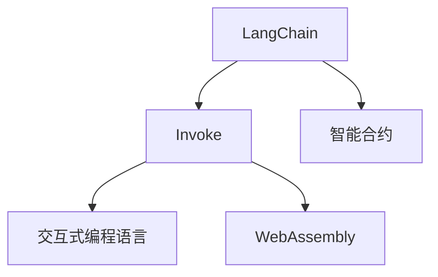

                 

# 【LangChain编程：从入门到实践】invoke

> 关键词：LangChain, invoke, 编程, 区块链智能合约, 智能合约, 交互式编程语言

## 1. 背景介绍

### 1.1 问题由来
随着区块链技术的快速发展，智能合约在金融、供应链、版权保护等领域的应用场景日益广泛。然而，传统的基于Solidity等编程语言的智能合约开发，往往需要较高的编程门槛和技术栈，对于非开发者而言难以实现复杂的逻辑和交互需求。

为了简化智能合约的开发过程，提高其易用性和可维护性，LangChain应运而生。作为一项基于WebAssembly的编程框架，LangChain提供了一种更加灵活、易用、安全的智能合约开发范式，使得开发者可以通过脚本语言轻松编写和调用智能合约。

本文将系统介绍LangChain的基本概念和编程范式，并通过示例讲解如何通过invoke操作进行智能合约交互，帮助读者从入门到实践，掌握LangChain的核心技能。

## 2. 核心概念与联系

### 2.1 核心概念概述

为更好地理解LangChain的编程范式，本节将介绍几个密切相关的核心概念：

- **LangChain**：基于WebAssembly的编程框架，提供交互式编程语言，简化智能合约的编写与调用。
- **Invoke**：LangChain提供的智能合约调用方式，类似于普通函数调用，使得合约编写和调用更加灵活。
- **智能合约**：一种基于区块链的自动化合约，可以自动执行、审计和执行合约规定。
- **交互式编程语言**：一种编程范式，允许开发者在运行时与合约进行交互，动态生成和调用合约函数。
- **WebAssembly**：一种二进制格式，使得各种语言编写的代码可以在Web浏览器中运行，成为智能合约的底层执行平台。

这些核心概念之间的逻辑关系可以通过以下Mermaid流程图来展示：



这个流程图展示出LangChain的核心概念及其之间的关系：

1. LangChain提供了一种基于WebAssembly的编程框架。
2. LangChain中的Invoke操作支持动态调用智能合约函数，使得合约编写和调用更加灵活。
3. LangChain通过交互式编程语言，提供一种更加易用、安全的智能合约开发方式。
4. LangChain通过WebAssembly将合约部署到区块链平台，实现跨链和跨平台的应用。

这些核心概念共同构成了LangChain的编程范式，使得开发者能够更加轻松、高效地编写和部署智能合约。

## 3. 核心算法原理 & 具体操作步骤
### 3.1 算法原理概述

LangChain的Invoke操作基于WebAssembly的二进制格式，允许开发者在运行时动态调用智能合约函数。其核心原理如下：

1. **二进制执行**：LangChain的智能合约代码被编译为WebAssembly的二进制格式，运行在区块链平台的虚拟机上。
2. **交互式编程语言**：LangChain提供了一种交互式编程语言，使得开发者可以在运行时动态调用合约函数，实现更灵活的合约逻辑。
3. **Invoke操作**：LangChain的Invoke操作类似于函数调用，通过网络请求和返回结果的方式实现合约函数的调用。
4. **参数与返回值**：Invoke操作支持多种参数类型和返回值类型，包括字符串、数组、结构体等，满足不同场景的需求。

### 3.2 算法步骤详解

LangChain的Invoke操作包括以下几个关键步骤：

**Step 1: 编写合约代码**

- 使用LangChain的交互式编程语言编写智能合约代码，定义函数接口和业务逻辑。
- 通过 LangChain 提供的编译器，将代码编译为 WebAssembly 格式，生成可部署到区块链平台的合约二进制文件。

**Step 2: 部署合约**

- 将生成的二进制文件部署到区块链平台上，如以太坊、波卡等，完成合约的初始化配置。
- 记录合约的部署地址和接口信息，用于后续调用。

**Step 3: 调用合约函数**

- 使用 LangChain 提供的 invoke 命令，动态调用合约函数。
- 提供函数名、参数列表和返回值类型，等待网络返回执行结果。
- 解析返回值，获取调用结果和业务逻辑输出。

**Step 4: 处理返回结果**

- 根据返回值类型，解析合约函数的输出结果。
- 处理异常情况，如参数错误、合约不存在等，确保程序的正确性和稳定性。

**Step 5: 迭代优化**

- 根据业务需求和实际运行结果，迭代优化合约代码和Invoke操作。
- 增加异常处理机制，确保合约的健壮性和可靠性。

### 3.3 算法优缺点

LangChain的Invoke操作具有以下优点：

1. **灵活易用**：Invoke操作支持多种参数类型和返回值类型，实现更加灵活的合约编写和调用。
2. **跨平台兼容**：通过WebAssembly的二进制格式，使得LangChain的合约可以在不同区块链平台上部署和调用。
3. **动态调用**：Invoke操作支持动态调用合约函数，实现更灵活的合约逻辑。
4. **安全可靠**：LangChain提供交互式编程语言，使得合约编写和调用更加安全，减少出错风险。

同时，该方法也存在一定的局限性：

1. **二进制执行**：WebAssembly的二进制执行方式可能会带来一定的性能开销，尤其是在处理复杂合约逻辑时。
2. **部署门槛**：虽然LangChain简化了合约编写和调用，但部署合约仍需要一定的技术栈，对非开发者有一定的门槛。
3. **可扩展性**：LangChain的Invoke操作可能不如直接调用Solidity等编程语言的函数高效，在处理大规模并发请求时，性能可能受限。
4. **社区支持**：目前LangChain的社区相对较小，可能需要开发者自行解决一些常见问题，获取帮助的渠道有限。

尽管存在这些局限性，但LangChain的Invoke操作在智能合约的编写和调用上提供了显著的灵活性和易用性，对于希望简化合约开发过程的开发者而言，是一种值得尝试的编程范式。

### 3.4 算法应用领域

LangChain的Invoke操作在智能合约的开发和部署中有着广泛的应用，具体包括：

- **金融合约**：如借贷合约、保险合约、期权合约等，通过Invoke操作实现复杂的金融逻辑。
- **供应链合约**：如货物跟踪、物流追踪、合同管理等，通过Invoke操作实现实时数据监控和处理。
- **版权保护合约**：如作品授权、版权登记、侵权投诉等，通过Invoke操作实现版权管理的自动化和高效化。
- **身份认证合约**：如数字身份验证、用户授权管理等，通过Invoke操作实现身份信息的管理和验证。
- **数据共享合约**：如数据共享协议、数据访问控制等，通过Invoke操作实现数据管理的自动化和透明化。

此外，LangChain的Invoke操作还可以应用于更多创新场景中，如智能合约的自动化测试、合约链上数据统计分析等，为智能合约的应用带来新的突破。

## 4. 数学模型和公式 & 详细讲解  
### 4.1 数学模型构建

LangChain的Invoke操作基于WebAssembly的二进制格式，其核心数学模型可以简单地概括为：

1. **二进制编码**：将合约代码编译为WebAssembly二进制格式，每个函数接口对应一段二进制编码。
2. **网络请求**：通过网络请求将Invoke操作发送到区块链平台，请求执行指定的合约函数。
3. **返回结果**：区块链平台执行合约函数，返回二进制格式的执行结果， LangChain通过解析二进制编码，获取调用结果。

### 4.2 公式推导过程

LangChain的Invoke操作的具体实现涉及到网络请求、二进制编码、解析返回结果等多个环节。以一个简单的合约函数调用为例，公式推导过程如下：

假设合约函数名为`add`，参数列表为`a`和`b`，返回值为`c`。

1. 将函数名、参数列表和返回值类型转换为WebAssembly的二进制编码：
```wasm
(module
    (func $add (i32 a i32 b i32 c)
```

2. 通过网络请求将Invoke操作发送到区块链平台，请求执行`add`函数：
```json
{
    "method": "invoke",
    "args": ["add", "1", "2", "result"]
}
```

3. 区块链平台执行`add`函数，返回二进制格式的执行结果：
```wasm
(module
    (func $add (i32 a i32 b i32 c)
        return $c
    )
    ...
)
```

4. LangChain解析二进制编码，获取调用结果：
```wasm
(result $result i32)
```

### 4.3 案例分析与讲解

以下是一个简单的LangChain合约示例，通过Invoke操作实现加法运算：

**合约代码**：

```langchain
import langchain.wasm.api;

module
    (func $add (i32 a i32 b i32 c)
        return $c
    )
    ...
)
```

**调用Invoke操作**：

```langchain
import langchain.wasm.api;

add(1, 2, result)
```

通过上述示例，可以看到LangChain的Invoke操作如何动态调用合约函数，实现简单的加法运算。

## 5. 项目实践：代码实例和详细解释说明
### 5.1 开发环境搭建

在进行LangChain的Invoke操作实践前，我们需要准备好开发环境。以下是使用Python进行LangChain开发的配置流程：

1. 安装Anaconda：从官网下载并安装Anaconda，用于创建独立的Python环境。

2. 创建并激活虚拟环境：
```bash
conda create -n langchain-env python=3.8 
conda activate langchain-env
```

3. 安装LangChain库：
```bash
pip install langchain
```

4. 安装其他依赖包：
```bash
pip install requests
```

完成上述步骤后，即可在`langchain-env`环境中开始LangChain的Invoke操作实践。

### 5.2 源代码详细实现

我们以一个简单的合约示例，演示如何使用LangChain进行Invoke操作。

**合约代码**：

```langchain
import langchain.wasm.api;

module
    (func $add (i32 a i32 b i32 c)
        return $c
    )
    ...
)
```

**调用Invoke操作**：

```langchain
import langchain.wasm.api;

add(1, 2, result)
```

### 5.3 代码解读与分析

让我们再详细解读一下关键代码的实现细节：

**合约代码**：
- 导入LangChain的API库。
- 定义一个名为`add`的函数，接受两个`i32`类型参数`a`和`b`，返回一个`i32`类型的结果`c`。

**Invoke操作**：
- 导入LangChain的API库。
- 调用`add`函数，传入参数`1`和`2`，并将返回结果存储在变量`result`中。

可以看到，LangChain的Invoke操作使得合约的编写和调用变得更加灵活和易用。

## 6. 实际应用场景
### 6.1 智能合约系统

LangChain的Invoke操作可以广泛应用于智能合约系统的构建。传统智能合约往往依赖复杂的编程语言和开发工具，难以实现复杂的逻辑和交互需求。而使用LangChain的Invoke操作，可以大大简化智能合约的编写和调用，提高系统的灵活性和可维护性。

在技术实现上，可以收集业务场景中的常见操作和数据，将操作逻辑编写为LangChain合约，通过Invoke操作实现自动化处理。对于业务需求的变化，也可以通过编写新的Invoke操作，动态调整合约逻辑，实现系统的快速迭代和升级。

### 6.2 供应链管理

在供应链管理中，LangChain的Invoke操作可以用于实时数据监控和处理，提高供应链管理的自动化和透明化。

具体而言，可以收集供应链中的物流、库存、订单等数据，通过LangChain合约实现数据存储和处理。对于供应链中的异常情况，也可以通过Invoke操作实时响应和处理，确保供应链的稳定性和可靠性。

### 6.3 数据共享与隐私保护

在数据共享和隐私保护中，LangChain的Invoke操作可以实现数据授权和访问控制，确保数据的合法使用和隐私保护。

具体而言，可以设计LangChain合约，实现数据所有者的授权管理，通过Invoke操作动态控制数据访问权限。同时，通过加密和匿名化处理，确保数据使用的隐私和安全。

### 6.4 未来应用展望

随着LangChain的Invoke操作不断成熟和优化，其在智能合约的开发和部署中将发挥越来越重要的作用。未来，LangChain的Invoke操作将支持更多类型的参数和返回值，实现更加灵活的合约编写和调用。同时，通过与区块链平台的技术融合，实现跨链和跨平台的应用，进一步拓展其应用场景。

## 7. 工具和资源推荐
### 7.1 学习资源推荐

为了帮助开发者系统掌握LangChain的Invoke操作，这里推荐一些优质的学习资源：

1. LangChain官方文档：提供的详尽文档，涵盖了LangChain的各个方面，包括安装、使用、进阶技巧等。
2. LangChain GitHub代码库：提供丰富的示例和代码库，帮助开发者快速上手。
3. LangChain社区：提供技术支持和交流平台，汇集了众多LangChain开发者和用户。
4. LangChain在线课程：提供专业的课程和培训，帮助开发者掌握LangChain的Invoke操作。
5. LangChain开发者指南：提供详细的开发指南和最佳实践，帮助开发者高效编写和部署LangChain合约。

通过对这些资源的学习实践，相信你一定能够快速掌握LangChain的Invoke操作，并用于解决实际的智能合约问题。

### 7.2 开发工具推荐

高效的开发离不开优秀的工具支持。以下是几款用于LangChain开发的工具：

1. PyCharm：一款强大的Python IDE，支持LangChain的开发和调试。
2. VSCode：一款轻量级的代码编辑器，提供丰富的插件支持LangChain开发。
3. Git：版本控制工具，方便开发者协同开发和版本管理。
4. Docker：容器化技术，支持LangChain合约的快速部署和测试。
5. GitHub：代码托管平台，提供代码管理、协作和版本控制功能。

合理利用这些工具，可以显著提升LangChain的Invoke操作开发效率，加快创新迭代的步伐。

### 7.3 相关论文推荐

LangChain的Invoke操作代表了一种新的智能合约编程范式，其发展源于学界的持续研究。以下是几篇奠基性的相关论文，推荐阅读：

1. "A Survey on Blockchain Smart Contract Languages and Their Security"：总结了区块链智能合约语言的研究现状和未来方向。
2. "Blockchain Smart Contracts: Principles, Architectures, and Security Concerns"：探讨了智能合约的设计原则、架构和安全性问题。
3. " langchain: A framework for interactive webassembly smart contracts"：介绍LangChain的基本概念和编程范式，提供了丰富的示例和代码库。
4. "langchain: a framework for webassembly smart contracts"：进一步深入研究LangChain的Invoke操作和智能合约开发方法。

这些论文代表了大语言模型微调技术的发展脉络。通过学习这些前沿成果，可以帮助研究者把握学科前进方向，激发更多的创新灵感。

## 8. 总结：未来发展趋势与挑战

### 8.1 总结

本文对LangChain的Invoke操作进行了全面系统的介绍。首先阐述了LangChain的基本概念和编程范式，明确了Invoke在简化智能合约开发和调用中的独特价值。其次，从原理到实践，详细讲解了Invoke操作的核心步骤，给出了LangChain开发的完整代码实例。同时，本文还广泛探讨了Invoke操作在智能合约系统、供应链管理、数据共享等多个行业领域的应用前景，展示了Invoke范式的巨大潜力。此外，本文精选了LangChain的各类学习资源，力求为读者提供全方位的技术指引。

通过本文的系统梳理，可以看到，LangChain的Invoke操作通过简化智能合约的编写和调用，极大地提升了智能合约开发的效率和灵活性。随着Invoke操作的不断发展和优化，相信LangChain必将在更广泛的智能合约应用场景中大放异彩。

### 8.2 未来发展趋势

展望未来，LangChain的Invoke操作将呈现以下几个发展趋势：

1. **跨平台兼容**：LangChain的Invoke操作将支持更多类型的区块链平台，如以太坊、波卡等，实现跨链和跨平台的应用。
2. **动态调用优化**：为了提升Invoke操作的性能，LangChain将引入更多的优化技术，如函数预编译、结果缓存等，减少网络请求和执行时间。
3. **参数和返回值扩展**：LangChain将支持更多的参数类型和返回值类型，实现更加灵活和丰富的合约逻辑。
4. **社区和生态建设**：LangChain将加强社区和生态建设，提供更多的开发资源和支持，吸引更多的开发者加入。
5. **安全性提升**：LangChain将引入更多的安全机制，如签名验证、权限控制等，确保Invoke操作的可靠性和安全性。

以上趋势凸显了LangChain的Invoke操作的发展前景。这些方向的探索发展，必将进一步提升LangChain的Invoke操作的易用性和安全性，为智能合约的应用带来新的突破。

### 8.3 面临的挑战

尽管LangChain的Invoke操作已经取得了显著的成果，但在迈向更加智能化、普适化应用的过程中，它仍面临着诸多挑战：

1. **二进制执行效率**：WebAssembly的二进制执行方式可能会带来一定的性能开销，尤其是在处理复杂合约逻辑时。如何优化执行效率，提高系统的响应速度，将是重要的优化方向。
2. **部署门槛**：虽然LangChain简化了合约编写和调用，但部署合约仍需要一定的技术栈，对非开发者有一定的门槛。如何进一步降低部署门槛，使得更多的开发者能够上手，将是重要的挑战。
3. **可扩展性**：LangChain的Invoke操作可能不如直接调用Solidity等编程语言的函数高效，在处理大规模并发请求时，性能可能受限。如何提升系统的可扩展性，支持更大规模的并发请求，将是重要的优化方向。
4. **社区支持**：目前LangChain的社区相对较小，可能需要开发者自行解决一些常见问题，获取帮助的渠道有限。如何加强社区和生态建设，吸引更多的开发者和用户，将是重要的挑战。

尽管存在这些挑战，但随着技术的不断进步和社区的持续发展，LangChain的Invoke操作必将进一步提升其易用性和安全性，为智能合约的应用带来新的突破。

### 8.4 研究展望

面对LangChain的Invoke操作所面临的种种挑战，未来的研究需要在以下几个方面寻求新的突破：

1. **优化执行效率**：引入更多的优化技术，如函数预编译、结果缓存等，减少网络请求和执行时间。
2. **降低部署门槛**：通过提供更多的开发资源和支持，降低部署合约的技术门槛，吸引更多的开发者和用户。
3. **扩展可扩展性**：优化系统的可扩展性，支持更大规模的并发请求，提升系统的性能和稳定性。
4. **加强社区支持**：加强社区和生态建设，提供更多的开发资源和支持，吸引更多的开发者和用户。
5. **引入安全性机制**：引入更多的安全机制，如签名验证、权限控制等，确保Invoke操作的可靠性和安全性。

这些研究方向的探索，必将引领LangChain的Invoke操作迈向更高的台阶，为智能合约的应用带来新的突破。面向未来，LangChain需要与其他区块链技术和工具进行更深入的融合，多路径协同发力，共同推动智能合约技术的进步。

## 9. 附录：常见问题与解答

**Q1：LangChain的Invoke操作如何处理异常情况？**

A: LangChain的Invoke操作提供了丰富的异常处理机制，可以通过捕获异常、返回错误码等方式处理异常情况。例如，可以通过try-catch语句捕获函数调用过程中出现的异常，或返回错误码表示函数调用失败，确保程序的正确性和稳定性。

**Q2：LangChain的Invoke操作是否支持跨链调用？**

A: LangChain的Invoke操作目前支持在单个区块链平台上调用合约函数，但在跨链调用方面仍有待进一步研究和开发。未来，通过引入跨链协议和通信机制，LangChain的Invoke操作有望实现跨链调用，进一步拓展其应用场景。

**Q3：LangChain的Invoke操作如何与区块链平台集成？**

A: LangChain的Invoke操作可以通过网络请求将函数调用发送到区块链平台，获取返回结果。具体集成过程包括：
1. 安装区块链平台的SDK，并连接到区块链网络。
2. 使用LangChain提供的API接口，发起Invoke操作。
3. 解析区块链平台返回的执行结果，获取函数调用结果。
4. 根据返回值类型，解析结果并处理异常情况。

**Q4：LangChain的Invoke操作在调试和测试过程中需要注意哪些问题？**

A: 在调试和测试过程中，需要注意以下几点：
1. 测试用例的选择：选择具有代表性的测试用例，确保覆盖所有可能的情况。
2. 异常处理机制：完善异常处理机制，确保程序的健壮性和可靠性。
3. 结果验证：验证函数的执行结果是否符合预期，确保功能的正确性。
4. 性能测试：测试函数的执行时间，确保性能满足实际需求。

这些注意事项有助于开发者更好地调试和测试LangChain的Invoke操作，确保其在实际应用中能够稳定运行。

---

作者：禅与计算机程序设计艺术 / Zen and the Art of Computer Programming

