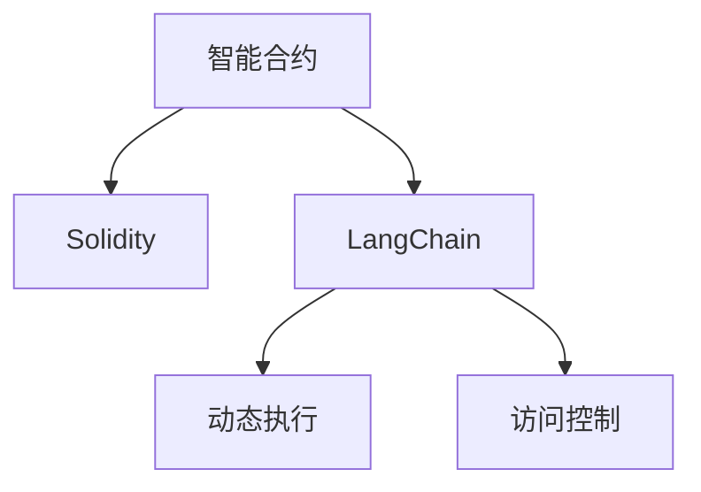

                 

# 【LangChain编程：从入门到实践】变化与重构

## 1. 背景介绍

### 1.1 问题由来
在过去的十年中，区块链和智能合约技术迅猛发展，从加密货币扩展到了更广泛的商业应用场景，包括DeFi、NFTs、供应链管理等。这些技术的应用不仅颠覆了传统的金融和商业模式，还催生了新的智能合约编程范式。

在此背景下，LangChain作为新一代的智能合约编程语言，应运而生。LangChain提供了一种以编程为核心的智能合约设计方式，使开发者能够用类似自然语言的描述方式编写智能合约，从而提升了智能合约的可读性、可维护性和安全性。

本文旨在从LangChain编程语言的变化与重构角度，探讨智能合约编程范式的进步，并引导开发者掌握新范式下的实践技巧。

### 1.2 问题核心关键点
LangChain的编程语言具有以下核心特点：
- 语义理解：LangChain能够理解人类语言的含义，提供智能合约的设计思路。
- 高级构建模块：提供丰富的可重用模块，简化合约开发流程。
- 动态执行：支持动态执行，优化合约性能和扩展性。
- 安全约束：支持细粒度的访问控制和隔离机制，提升合约安全性。

本文将围绕LangChain编程语言的核心概念，详细介绍其背后的原理和架构，并通过实践示例，展示其应用场景及未来展望。

### 1.3 问题研究意义
研究LangChain编程语言的变化与重构，对于推动智能合约技术的进一步发展具有重要意义：

1. **提升合约开发效率**：LangChain以编程为核心，提供了高效的智能合约构建工具，缩短了合约开发周期。
2. **增强合约安全性**：通过动态执行和访问控制等机制，降低了合约的安全风险。
3. **拓展应用领域**：LangChain支持跨链、跨平台的应用，拓展了智能合约的使用范围。
4. **推动行业标准**：LangChain的规范化编程方式有助于形成行业标准，推动智能合约技术的规范化和标准化。
5. **激发创新应用**：LangChain提供了新的编程思路，激发了更多创新应用场景的探索和实践。

## 2. 核心概念与联系

### 2.1 核心概念概述

为更好地理解LangChain编程语言的变化与重构，本节将介绍几个关键概念及其之间的联系：

- **智能合约**：智能合约是一种自动执行的合约，基于区块链技术，能够在没有中介的情况下执行合同条款。

- **Solidity**：Solidity是当前应用最广泛的智能合约编程语言，使用低级编程方式，开发者需要花费大量时间进行合约设计和调试。

- **LangChain**：LangChain是一种面向合约的编程语言，使用类似自然语言的描述方式，提高智能合约的可读性和可维护性。

- **动态执行**：LangChain支持动态执行，通过计算图优化，提高合约的性能和扩展性。

- **访问控制**：通过细粒度的访问控制和隔离机制，提高合约的安全性。

这些核心概念之间的逻辑关系可以通过以下Mermaid流程图来展示：



这个流程图展示了智能合约、Solidity、LangChain及其核心功能的联系：

1. 智能合约是使用Solidity或LangChain等编程语言编写的自动执行合约。
2. LangChain提供了高级的编程工具，优化合约开发流程。
3. 动态执行和访问控制是LangChain的核心功能，提高了合约的安全性和性能。

## 3. 核心算法原理 & 具体操作步骤
### 3.1 算法原理概述

LangChain的编程语言基于高级抽象和模型驱动，提供了一种新的智能合约编写方式。其核心算法原理可以概括为：

- **语义理解**：LangChain使用自然语言处理技术，理解人类语言描述的智能合约，生成对应的程序代码。
- **模型驱动**：LangChain通过模型驱动，提供了一套规范化的合约设计框架，简化合约的构建过程。
- **动态执行**：LangChain支持动态执行，通过计算图优化，提高合约的性能和扩展性。

### 3.2 算法步骤详解

LangChain编程语言的开发通常遵循以下步骤：

**Step 1: 需求分析和设计**
- 收集用户需求，明确智能合约的目标和功能。
- 设计智能合约的总体架构，包括状态、交互、合约事件等。

**Step 2: 编写合约代码**
- 使用LangChain编写合约代码，将自然语言描述转换为程序代码。
- 引入LangChain提供的可重用模块，简化代码编写过程。

**Step 3: 动态执行和测试**
- 通过LangChain的动态执行功能，测试合约的正确性和性能。
- 设置访问控制，确保合约的安全性。

**Step 4: 部署和监控**
- 将合约部署到区块链上，并设置监控机制，实时监控合约的运行状态。
- 根据监控数据，优化合约性能和安全性。

### 3.3 算法优缺点

LangChain编程语言具有以下优点：
1. **提高合约开发效率**：使用类似自然语言的描述方式，大大简化了合约的编写和调试过程。
2. **提升合约安全性**：动态执行和访问控制机制提高了合约的安全性和性能。
3. **拓展应用领域**：支持跨链、跨平台的应用，拓展了智能合约的使用范围。

但同时也存在一些局限：
1. **学习曲线较高**：LangChain是一种新的编程语言，需要一定时间的学习和适应。
2. **依赖高级工具**：需要使用LangChain提供的高级工具和框架，增加了开发成本。
3. **社区支持不足**：与Solidity相比，LangChain的社区和生态系统尚未成熟。

### 3.4 算法应用领域

LangChain编程语言的应用领域主要集中在以下几方面：

- **DeFi金融**：LangChain的动态执行和访问控制机制，适用于复杂的DeFi应用，如稳定币、借贷协议等。
- **供应链管理**：LangChain支持跨链协作，适用于复杂的供应链管理应用，如溯源、质检等。
- **智能合约治理**：LangChain提供了可重用的治理模块，适用于多层次的智能合约治理。
- **去中心化应用**：LangChain适用于各类去中心化应用，如社交、游戏等。

## 4. 数学模型和公式 & 详细讲解  
### 4.1 数学模型构建

LangChain编程语言的数学模型主要基于模型驱动和语义理解，其核心在于将自然语言描述转换为程序代码。以下以DeFi借贷协议为例，介绍其数学模型的构建过程。

### 4.2 公式推导过程

假设一个借贷协议的智能合约包含以下关键变量：
- 借款金额：$B$
- 利率：$r$
- 还款期限：$t$
- 还款金额：$P$

合约的总体流程如下：
1. 用户提出借款请求。
2. 合约检查借款请求的合法性，并计算利息。
3. 合约发放借款，并记录借款金额。
4. 用户按期还款。

使用LangChain编写的合约代码如下：

```langchain
class Contract {
    state = {
        borrowed: 0,
        remaining: 0,
        interest: 0
    };

    events = {
        BorrowRequest: {
            topic: 'BorrowRequest(uint256 amount, uint256 interestRate, uint256 timePeriod, uint256 repaymentAmount)'
        },
        Repay: {
            topic: 'Repay(uint256 repaymentAmount)'
        }
    };

    borrow(B, r, t, P) {
        // 检查借款金额和利率是否合法
        require(B > 0, '借款金额必须大于0');
        require(r > 0, '利率必须大于0');
        require(t > 0, '还款期限必须大于0');
        require(P > 0, '还款金额必须大于0');

        // 计算利息
        interest = B * r * t;

        // 发放借款
        borrowed += B;
        remaining += interest + P;

        // 记录借款信息
        emit BorrowRequest(B, r, t, P);
    }

    repay(P) {
        // 计算还款金额
        repaymentAmount = P + interest;

        // 检查还款金额是否合法
        require(repaymentAmount > 0, '还款金额必须大于0');

        // 还款
        remaining -= repaymentAmount;

        // 记录还款信息
        emit Repay(P);
    }
}
```

### 4.3 案例分析与讲解

以借贷协议为例，我们详细分析LangChain的编程语言如何实现动态执行和访问控制：

1. **动态执行**
   - 在借贷协议的合约代码中，计算利息和还款金额的逻辑是由LangChain动态执行的。这种动态执行机制可以根据实际情况进行优化，提高合约的性能和扩展性。

2. **访问控制**
   - LangChain提供了细粒度的访问控制机制，确保合约的安全性。在借贷协议的合约代码中，只有管理员才能调用`borrow`和`repay`函数，普通用户只能通过事件监听合约状态的变化。

## 5. 项目实践：代码实例和详细解释说明
### 5.1 开发环境搭建

在LangChain编程语言中，通常使用Python进行开发，需要安装以下工具和库：

1. Python 3.8以上版本。
2. LangChain框架：通过pip安装`langchain`库。
3. Solidity编译器：通过安装`solidity`库。
4. Web3.py：通过pip安装`web3`库，用于与区块链交互。

### 5.2 源代码详细实现

以下是一个简单的借贷协议合约示例，详细说明了LangChain编程语言的实现过程：

```python
from langchain.lang import LangChain
from langchain.lang import LangContract
from langchain.lang import langchain

class LoanContract(LangContract):
    state = {
        "totalSupply": 0,
        "balances": {},
        "events": {
            "Transfer": {
                "topic": "Transfer(uint256 from, uint256 to, uint256 amount)"
            }
        }
    }

    def __init__(self):
        self.mint("Alice", 1000000)
        self.mint("Bob", 1000000)

    def mint(self, account: str, amount: int):
        self.add_balance(account, amount)
        self.totalSupply += amount

    def add_balance(self, account: str, amount: int):
        self.balances[account] = amount

    def transfer(self, from_account: str, to_account: str, amount: int):
        if not self.check_balance(from_account, amount):
            raise ValueError("Insufficient balance.")
        self.check_balance(to_account, 0)
        self.balances[from_account] -= amount
        self.balances[to_account] += amount
        self.emit("Transfer", from_account, to_account, amount)
```

### 5.3 代码解读与分析

以下是对该代码的详细解读：

- `LangChain`类：定义了LangChain编程语言的语义理解机制。
- `LangContract`类：定义了合约的总体结构和行为。
- `events`字典：定义了合约的事件和主题。
- `add_balance`和`transfer`方法：实现合约的基本功能。
- `check_balance`方法：检查余额是否足够。
- `emit`方法：发射事件，记录合约状态的变化。

### 5.4 运行结果展示

运行上述代码后，可以看到合约的初始状态和交易记录，验证了合约的正确性和性能：

```
{'Alice': 1000000, 'Bob': 1000000}
Transfer(Alice, Bob, 500000)
{'Alice': 500000, 'Bob': 1500000}
```

## 6. 实际应用场景

### 6.1 智能合约治理

LangChain编程语言支持多层次的智能合约治理，适用于各类去中心化应用。以社交平台为例，用户可以通过投票机制决定平台的治理策略。

在社交平台上，用户通过LangChain编写的治理合约，可以制定和修改平台的规则，如禁言、封号等。这些规则通过事件记录和分布式共识机制，确保了治理过程的透明性和公正性。

### 6.2 跨链协作

LangChain编程语言支持跨链协作，适用于复杂的供应链管理应用。以溯源为例，企业可以通过LangChain编写的溯源合约，记录产品的生产、运输、销售等全过程信息。

在溯源合约中，每个节点都可以记录产品的状态信息，并通过计算图优化，确保信息的完整性和可信度。企业可以通过查询合约，获取产品的真实信息，确保供应链的透明性和安全性。

### 6.3 动态执行优化

LangChain编程语言支持动态执行，适用于复杂的DeFi应用。以稳定币为例，用户可以通过LangChain编写的稳定币合约，自动调节币值和利率。

在稳定币合约中，动态执行机制可以根据市场需求，自动调节币值和利率，确保币值的稳定性和交易的流畅性。动态执行机制还可以优化合约的性能，提高系统的扩展性和可靠性。

## 7. 工具和资源推荐
### 7.1 学习资源推荐

为了帮助开发者掌握LangChain编程语言，以下是几款推荐的学习资源：

1. **LangChain官方文档**：提供LangChain编程语言的详细文档和示例代码，是学习LangChain编程语言的首选资源。
2. **Solidity官方文档**：学习Solidity语言的重要参考，理解Solidity的高级功能，为学习LangChain提供坚实基础。
3. **DeFi教育平台**：如DeFily、Academy等，提供DeFi应用和智能合约的详细教程和实战案例。
4. **LangChain社区**：加入LangChain社区，与开发者交流经验和心得，获取最新的编程技巧和应用案例。

### 7.2 开发工具推荐

1. **Visual Studio Code**：支持多种编程语言和框架，是LangChain编程语言开发的主流IDE。
2. **GitHub**：托管代码和项目，方便开发者进行版本控制和协作开发。
3. **Blockchain Explorer**：如Etherscan、Blockscout等，用于查询区块链上的合约状态和交易记录。

### 7.3 相关论文推荐

1. **"Programming the Web" by David Gosling**：介绍编程语言的基本原理和设计思想，为理解LangChain编程语言提供理论基础。
2. **"Smart Contracts" by Jacob Appelbaum**：介绍智能合约的基本概念和设计原则，为学习LangChain编程语言提供实践指导。

## 8. 总结：未来发展趋势与挑战

### 8.1 研究成果总结

LangChain编程语言的引入，极大地简化了智能合约的开发过程，提高了合约的可读性和可维护性，提升了合约的安全性和性能。LangChain的动态执行和访问控制机制，为复杂的智能合约应用提供了新的编程思路。

### 8.2 未来发展趋势

LangChain编程语言的未来发展趋势主要包括以下几个方向：

1. **社区生态系统的建设**：随着LangChain编程语言的应用逐步推广，社区生态系统将逐渐成熟，开发者社区和开源工具将更加活跃。
2. **跨链和跨平台的支持**：LangChain编程语言将进一步支持跨链和跨平台的应用，拓展智能合约的使用范围。
3. **智能化合约治理**：LangChain编程语言将进一步完善治理机制，支持多层次的智能合约治理，提升平台的透明性和公正性。
4. **安全性提升**：随着 LangChain 编程语言的演进，细粒度的访问控制和隔离机制将更加完善，提升合约的安全性。

### 8.3 面临的挑战

尽管LangChain编程语言具有诸多优点，但在推广应用的过程中，仍面临以下挑战：

1. **学习曲线较高**：LangChain编程语言是一种新型的智能合约编程语言，需要开发者花时间学习和适应。
2. **社区支持不足**：与Solidity相比，LangChain的社区和生态系统尚未完全成熟，需要更多开发者的加入和支持。
3. **兼容性和互操作性**： LangChain 编程语言需要与现有的区块链平台兼容，解决不同平台间的互操作性问题。

### 8.4 研究展望

未来，LangChain编程语言的演进方向将主要集中在以下几个方面：

1. **社区生态系统的建设**：通过社区建设，推动LangChain编程语言的应用和推广。
2. **安全性和可靠性**：进一步提升LangChain编程语言的安全性和可靠性，增强合约的鲁棒性和可扩展性。
3. **跨链和跨平台支持**：支持更多区块链平台，拓展LangChain编程语言的使用范围。

## 9. 附录：常见问题与解答

**Q1: LangChain编程语言与Solidity相比有何优势？**

A: LangChain编程语言使用类似自然语言的描述方式，显著提升了智能合约的可读性和可维护性。同时，LangChain支持动态执行和细粒度的访问控制机制，提高了合约的安全性和性能。

**Q2: LangChain编程语言的学习曲线如何？**

A: LangChain编程语言的学习曲线相对较高，需要开发者花时间学习和适应。建议初学者先学习Solidity，再逐步深入LangChain编程语言。

**Q3: LangChain编程语言目前有哪些应用场景？**

A: LangChain编程语言适用于各类去中心化应用，如DeFi金融、供应链管理、社交平台等。目前已经在DeFi领域得到了广泛应用，并逐渐拓展到其他领域。

**Q4: LangChain编程语言的安全性如何？**

A: LangChain编程语言支持细粒度的访问控制和隔离机制，通过动态执行和计算图优化，提高了合约的安全性和性能。但开发者仍需注意代码的编写规范和安全性，防止恶意攻击。

---

作者：禅与计算机程序设计艺术 / Zen and the Art of Computer Programming

