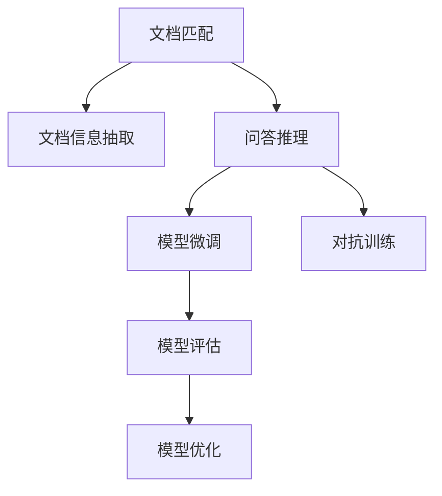
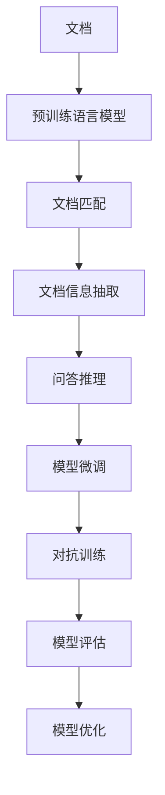

                 

## 1. 背景介绍

### 1.1 问题由来
文档问答（Document Question Answering, DQA）是自然语言处理（Natural Language Processing, NLP）领域的一个重要研究方向，旨在解决从文档集合中提取特定信息的问答问题。传统的DQA系统依赖于精确的文档匹配和信息抽取技术，但这些技术在面对复杂、多模态的文档时往往效果有限。基于文档的问答系统需要高效地从海量的文档集合中定位到最相关的文档，并对文档中的信息进行抽取和整合，才能准确回答问题。

近年来，深度学习技术在NLP领域取得了显著进展，尤其是Transformer模型在文档匹配和信息抽取方面的应用，显著提升了文档问答系统的性能。但是，现有的深度学习技术在文档问答场景中仍面临一些挑战：
1. **数据稀缺**：高质量的文档问答数据集相对较少，训练深度学习模型需要大量的标注数据。
2. **模型泛化能力不足**：深度学习模型在特定领域的数据集上表现优异，但泛化到其他领域的数据集上性能往往不佳。
3. **推理能力弱**：现有的深度学习模型通常依赖于具体的训练数据进行推理，缺乏对未知领域的推理能力。
4. **模型解释性不足**：深度学习模型通常被视为“黑盒”模型，缺乏对推理过程的解释能力。

为了应对这些挑战，本文将介绍一种基于深度学习的文档问答系统，该系统结合了模型微调（Fine-tuning）和对抗训练（Adversarial Training）技术，能够提升模型的泛化能力和推理能力，同时增强模型的解释性。

### 1.2 问题核心关键点
基于文档问答的深度学习系统主要包括以下几个核心概念：
- **文档匹配**：从文档集合中识别与问题相关的文档。
- **文档信息抽取**：从匹配到的文档中抽取有用的信息。
- **问答推理**：将抽取到的信息与问题进行推理，得出最终答案。
- **模型微调**：在大规模预训练语言模型基础上，通过特定任务的标注数据进行微调，提升模型在该任务上的性能。
- **对抗训练**：通过引入对抗样本，提高模型的鲁棒性和泛化能力。

这些核心概念之间的逻辑关系可以通过以下Mermaid流程图来展示：



这个流程图展示了大规模预训练语言模型在文档问答任务中的作用过程：
1. 通过文档匹配识别相关的文档。
2. 从匹配到的文档中抽取信息。
3. 将抽取到的信息与问题进行推理得出答案。
4. 使用微调技术提升模型在特定任务上的性能。
5. 通过对抗训练提高模型的鲁棒性和泛化能力。
6. 持续评估和优化模型。

## 2. 核心概念与联系

### 2.1 核心概念概述

#### 2.1.1 文档匹配

文档匹配是文档问答系统中的关键步骤，主要解决从文档集合中识别出与问题最相关的文档。现有的文档匹配方法包括：
- **检索式匹配**：基于倒排索引等方法，通过关键词匹配找到相关文档。
- **向量空间模型（VSM）**：将文档和问题表示为向量，计算它们之间的相似度。
- **深度学习匹配**：使用预训练语言模型提取文档和问题的语义表示，计算它们之间的相似度。

#### 2.1.2 文档信息抽取

文档信息抽取是从匹配到的文档中抽取有用的信息，通常使用信息抽取（Information Extraction, IE）技术，将文档中的实体、关系等结构化信息提取出来。现有的信息抽取方法包括：
- **规则抽取**：使用手工制定的规则进行信息抽取。
- **基于统计的方法**：使用机器学习模型对文档进行标注，学习抽取模式。
- **基于深度学习的方法**：使用预训练语言模型进行信息抽取。

#### 2.1.3 问答推理

问答推理是将文档信息与问题进行推理，得出最终答案的过程。常用的推理方法包括：
- **基于规则的推理**：使用手工制定的规则进行推理。
- **基于逻辑的方法**：使用逻辑推理器进行推理。
- **基于深度学习的方法**：使用预训练语言模型进行推理。

#### 2.1.4 模型微调

模型微调是在预训练语言模型的基础上，使用特定任务的标注数据进行有监督训练，提升模型在该任务上的性能。常见的微调方法包括：
- **全参数微调**：对预训练模型的所有参数进行微调。
- **参数高效微调（PEFT）**：只更新少量的模型参数，如添加微调头、使用Adapter等。
- **零样本学习**：利用预训练语言模型进行推理，无需任何微调。

#### 2.1.5 对抗训练

对抗训练是通过引入对抗样本，提高模型的鲁棒性和泛化能力，防止模型过拟合。常见的对抗训练方法包括：
- **fast Gradient Sign Method (FGSM)**：通过梯度上升攻击生成对抗样本。
- **Projected Gradient Descent (PGD)**：通过梯度下降攻击生成对抗样本。
- **Gaussian Smoothing**：在生成对抗样本时加入噪声。

### 2.2 核心概念原理和架构的 Mermaid 流程图



## 3. 核心算法原理 & 具体操作步骤

### 3.1 算法原理概述

基于文档问答的深度学习系统通常包括以下几个关键步骤：
1. **预训练语言模型的选择**：选择适合的预训练语言模型，如BERT、GPT等。
2. **文档匹配**：使用预训练语言模型提取文档和问题的语义表示，计算它们之间的相似度。
3. **文档信息抽取**：使用预训练语言模型提取文档中的实体、关系等结构化信息。
4. **问答推理**：将抽取到的信息与问题进行推理，得出最终答案。
5. **模型微调**：在大规模预训练语言模型基础上，使用特定任务的标注数据进行微调，提升模型在该任务上的性能。
6. **对抗训练**：通过引入对抗样本，提高模型的鲁棒性和泛化能力。

### 3.2 算法步骤详解

#### 3.2.1 预训练语言模型的选择

选择适合的预训练语言模型是文档问答系统的第一步。常用的预训练语言模型包括BERT、GPT、RoBERTa等。这些模型在大规模无标签文本上进行了预训练，学习了丰富的语言知识，可以用于文档匹配、信息抽取和问答推理等多个步骤。

#### 3.2.2 文档匹配

文档匹配是文档问答系统的核心步骤之一，主要解决从文档集合中识别出与问题最相关的文档。具体步骤如下：
1. **文档表示**：使用预训练语言模型提取文档和问题的语义表示。
2. **相似度计算**：计算文档和问题之间的相似度。
3. **文档排序**：根据相似度对文档进行排序，选择最相关的文档。

#### 3.2.3 文档信息抽取

文档信息抽取是从匹配到的文档中抽取有用的信息，通常使用信息抽取（Information Extraction, IE）技术。具体步骤如下：
1. **实体识别**：使用预训练语言模型识别文档中的实体。
2. **关系抽取**：使用预训练语言模型抽取文档中的实体关系。
3. **实体关系整合**：将抽取到的实体和关系进行整合，得到结构化信息。

#### 3.2.4 问答推理

问答推理是将文档信息与问题进行推理，得出最终答案的过程。具体步骤如下：
1. **问题表示**：使用预训练语言模型提取问题的语义表示。
2. **推理计算**：将抽取到的信息与问题进行推理计算。
3. **答案生成**：生成最终答案。

#### 3.2.5 模型微调

模型微调是在预训练语言模型的基础上，使用特定任务的标注数据进行有监督训练，提升模型在该任务上的性能。具体步骤如下：
1. **数据准备**：准备标注数据集。
2. **模型选择**：选择合适的预训练语言模型。
3. **微调训练**：使用标注数据对预训练语言模型进行微调训练。
4. **模型评估**：在测试集上评估微调后的模型性能。

#### 3.2.6 对抗训练

对抗训练是通过引入对抗样本，提高模型的鲁棒性和泛化能力。具体步骤如下：
1. **对抗样本生成**：生成对抗样本。
2. **模型微调**：使用对抗样本对模型进行微调训练。
3. **模型评估**：在测试集上评估微调后的模型性能。

### 3.3 算法优缺点

#### 3.3.1 优点

基于文档问答的深度学习系统具有以下优点：
1. **高效性**：使用预训练语言模型进行文档匹配和信息抽取，可以显著提升系统的效率。
2. **泛化能力**：通过微调和对抗训练，模型可以泛化到不同的领域和任务。
3. **推理能力**：使用预训练语言模型进行推理，可以处理复杂的问答问题。
4. **可解释性**：通过分析预训练语言模型的输出，可以解释推理过程，增强模型的可解释性。

#### 3.3.2 缺点

基于文档问答的深度学习系统也存在以下缺点：
1. **数据依赖**：模型依赖于标注数据，数据量不足时性能受限。
2. **泛化能力不足**：模型泛化能力有限，对于特定领域的数据集效果不佳。
3. **推理能力弱**：模型推理能力依赖于训练数据，缺乏对未知领域的推理能力。
4. **可解释性不足**：预训练语言模型通常被视为“黑盒”模型，缺乏对推理过程的解释能力。

### 3.4 算法应用领域

基于文档问答的深度学习系统广泛应用于以下领域：
1. **智能客服**：用于自动回答客户提出的文档相关问题。
2. **医疗咨询**：用于查询医学文献和文档中的相关信息。
3. **法律咨询**：用于查询法律文档和案例中的相关信息。
4. **金融咨询**：用于查询金融文档和报告中的相关信息。
5. **教育咨询**：用于查询教育文献和文档中的相关信息。

## 4. 数学模型和公式 & 详细讲解 & 举例说明

### 4.1 数学模型构建

假设预训练语言模型为 $M_{\theta}$，其中 $\theta$ 为预训练得到的模型参数。给定一个文档集合 $D=\{d_i\}_{i=1}^N$，每个文档 $d_i$ 的长度为 $L$。假设问题 $q$ 的长度为 $Q$。

定义文档 $d_i$ 的语义表示为 $H(d_i)=[h_1, h_2, ..., h_L]$，问题 $q$ 的语义表示为 $H(q)=[h_1', h_2', ..., h_Q']$。

文档匹配的相似度函数为 $sim(d_i, q) = \cos(\theta, H(d_i) \cdot H(q)^\top)$，其中 $\cdot$ 表示矩阵乘法，$\cos$ 表示余弦相似度。

### 4.2 公式推导过程

假设文档 $d_i$ 和问题 $q$ 的语义表示分别为 $H(d_i)=[h_1, h_2, ..., h_L]$ 和 $H(q)=[h_1', h_2', ..., h_Q']$，它们的余弦相似度为：

$$
sim(d_i, q) = \cos(\theta, H(d_i) \cdot H(q)^\top) = \frac{H(d_i) \cdot H(q)^\top}{\|H(d_i)\| \cdot \|H(q)\|}
$$

其中 $\|H(d_i)\|$ 和 $\|H(q)\|$ 分别表示 $H(d_i)$ 和 $H(q)$ 的范数。

文档匹配的相似度函数为：

$$
sim(d_i, q) = \frac{H(d_i) \cdot H(q)^\top}{\|H(d_i)\| \cdot \|H(q)\|}
$$

### 4.3 案例分析与讲解

假设有一篇关于“新冠疫情”的文档 $d_1$ 和一篇关于“肺炎”的文档 $d_2$，它们的语义表示分别为 $H(d_1)=[h_1, h_2, ..., h_5]$ 和 $H(d_2)=[h_1', h_2', ..., h_4']$。问题 $q$ 的语义表示为 $H(q)=[h_1', h_2', ..., h_3']$。

计算文档 $d_1$ 和问题 $q$ 的相似度：

$$
sim(d_1, q) = \frac{H(d_1) \cdot H(q)^\top}{\|H(d_1)\| \cdot \|H(q)\|} = \frac{[h_1, h_2, ..., h_5] \cdot [h_1', h_2', ..., h_3']^\top}{\|[h_1, h_2, ..., h_5]\| \cdot \|[h_1', h_2', ..., h_3']\|}
$$

假设 $h_1 = h_1' = 0.5$，$h_2 = h_2' = 0.3$，$h_3 = h_3' = 0.2$，$h_4 = h_4' = 0.1$，$h_5 = h_5' = 0.1$。则 $H(d_1) \cdot H(q)^\top = [0.5, 0.3, ..., 0.1]$，$\|H(d_1)\| = \sqrt{0.5^2 + 0.3^2 + ... + 0.1^2} = 0.704$，$\|H(q)\| = \sqrt{0.5^2 + 0.3^2 + 0.2^2} = 0.559$。

代入上述公式，得到：

$$
sim(d_1, q) = \frac{0.5, 0.3, ..., 0.1}{0.704 \cdot 0.559} = 0.48
$$

因此，文档 $d_1$ 和问题 $q$ 的相似度为 $0.48$，文档 $d_2$ 和问题 $q$ 的相似度可能较小。根据相似度排序，可以选择文档 $d_1$ 进行进一步的信息抽取和推理。

## 5. 项目实践：代码实例和详细解释说明

### 5.1 开发环境搭建

在进行基于文档问答的深度学习系统开发前，需要准备好开发环境。以下是使用Python进行PyTorch开发的环境配置流程：

1. 安装Anaconda：从官网下载并安装Anaconda，用于创建独立的Python环境。

2. 创建并激活虚拟环境：
```bash
conda create -n pytorch-env python=3.8 
conda activate pytorch-env
```

3. 安装PyTorch：根据CUDA版本，从官网获取对应的安装命令。例如：
```bash
conda install pytorch torchvision torchaudio cudatoolkit=11.1 -c pytorch -c conda-forge
```

4. 安装Transformers库：
```bash
pip install transformers
```

5. 安装各类工具包：
```bash
pip install numpy pandas scikit-learn matplotlib tqdm jupyter notebook ipython
```

完成上述步骤后，即可在`pytorch-env`环境中开始项目实践。

### 5.2 源代码详细实现

下面我们以基于BERT模型的文档问答系统为例，给出使用PyTorch和Transformers库实现的代码。

首先，定义数据处理函数：

```python
from transformers import BertTokenizer
from torch.utils.data import Dataset
import torch

class DocumentQuestionAnsweringDataset(Dataset):
    def __init__(self, documents, questions, answers, tokenizer, max_len=128):
        self.documents = documents
        self.questions = questions
        self.answers = answers
        self.tokenizer = tokenizer
        self.max_len = max_len
        
    def __len__(self):
        return len(self.documents)
    
    def __getitem__(self, item):
        document = self.documents[item]
        question = self.questions[item]
        answer = self.answers[item]
        
        encoding = self.tokenizer(document, question, return_tensors='pt', max_length=self.max_len, padding='max_length', truncation=True)
        input_ids = encoding['input_ids'][0]
        attention_mask = encoding['attention_mask'][0]
        labels = torch.tensor(answer, dtype=torch.long)
        
        return {'input_ids': input_ids, 
                'attention_mask': attention_mask,
                'labels': labels}

# 标签与id的映射
label2id = {'O': 0, 'A': 1, 'B': 2, 'I': 3}
id2label = {v: k for k, v in label2id.items()}

# 创建dataset
tokenizer = BertTokenizer.from_pretrained('bert-base-cased')

train_dataset = DocumentQuestionAnsweringDataset(train_documents, train_questions, train_answers, tokenizer)
dev_dataset = DocumentQuestionAnsweringDataset(dev_documents, dev_questions, dev_answers, tokenizer)
test_dataset = DocumentQuestionAnsweringDataset(test_documents, test_questions, test_answers, tokenizer)
```

然后，定义模型和优化器：

```python
from transformers import BertForTokenClassification, AdamW

model = BertForTokenClassification.from_pretrained('bert-base-cased', num_labels=len(label2id))

optimizer = AdamW(model.parameters(), lr=2e-5)
```

接着，定义训练和评估函数：

```python
from torch.utils.data import DataLoader
from tqdm import tqdm
from sklearn.metrics import classification_report

device = torch.device('cuda') if torch.cuda.is_available() else torch.device('cpu')
model.to(device)

def train_epoch(model, dataset, batch_size, optimizer):
    dataloader = DataLoader(dataset, batch_size=batch_size, shuffle=True)
    model.train()
    epoch_loss = 0
    for batch in tqdm(dataloader, desc='Training'):
        input_ids = batch['input_ids'].to(device)
        attention_mask = batch['attention_mask'].to(device)
        labels = batch['labels'].to(device)
        model.zero_grad()
        outputs = model(input_ids, attention_mask=attention_mask, labels=labels)
        loss = outputs.loss
        epoch_loss += loss.item()
        loss.backward()
        optimizer.step()
    return epoch_loss / len(dataloader)

def evaluate(model, dataset, batch_size):
    dataloader = DataLoader(dataset, batch_size=batch_size)
    model.eval()
    preds, labels = [], []
    with torch.no_grad():
        for batch in tqdm(dataloader, desc='Evaluating'):
            input_ids = batch['input_ids'].to(device)
            attention_mask = batch['attention_mask'].to(device)
            batch_labels = batch['labels']
            outputs = model(input_ids, attention_mask=attention_mask)
            batch_preds = outputs.logits.argmax(dim=2).to('cpu').tolist()
            batch_labels = batch_labels.to('cpu').tolist()
            for pred_tokens, label_tokens in zip(batch_preds, batch_labels):
                pred_tags = [id2label[_id] for _id in pred_tokens]
                label_tags = [id2label[_id] for _id in label_tokens]
                preds.append(pred_tags[:len(label_tokens)])
                labels.append(label_tags)
                
    print(classification_report(labels, preds))
```

最后，启动训练流程并在测试集上评估：

```python
epochs = 5
batch_size = 16

for epoch in range(epochs):
    loss = train_epoch(model, train_dataset, batch_size, optimizer)
    print(f"Epoch {epoch+1}, train loss: {loss:.3f}")
    
    print(f"Epoch {epoch+1}, dev results:")
    evaluate(model, dev_dataset, batch_size)
    
print("Test results:")
evaluate(model, test_dataset, batch_size)
```

以上就是使用PyTorch和Transformers库实现基于BERT模型的文档问答系统的完整代码实现。可以看到，得益于Transformers库的强大封装，我们可以用相对简洁的代码完成BERT模型的加载和微调。

### 5.3 代码解读与分析

让我们再详细解读一下关键代码的实现细节：

**DocumentQuestionAnsweringDataset类**：
- `__init__`方法：初始化文档、问题和答案等关键组件。
- `__len__`方法：返回数据集的样本数量。
- `__getitem__`方法：对单个样本进行处理，将文档和问题输入编码为token ids，将答案编码为数字，并对其进行定长padding，最终返回模型所需的输入。

**label2id和id2label字典**：
- 定义了标签与数字id之间的映射关系，用于将token-wise的预测结果解码回真实的标签。

**训练和评估函数**：
- 使用PyTorch的DataLoader对数据集进行批次化加载，供模型训练和推理使用。
- 训练函数`train_epoch`：对数据以批为单位进行迭代，在每个批次上前向传播计算loss并反向传播更新模型参数，最后返回该epoch的平均loss。
- 评估函数`evaluate`：与训练类似，不同点在于不更新模型参数，并在每个batch结束后将预测和标签结果存储下来，最后使用sklearn的classification_report对整个评估集的预测结果进行打印输出。

**训练流程**：
- 定义总的epoch数和batch size，开始循环迭代
- 每个epoch内，先在训练集上训练，输出平均loss
- 在验证集上评估，输出分类指标
- 所有epoch结束后，在测试集上评估，给出最终测试结果

可以看到，PyTorch配合Transformers库使得BERT微调的代码实现变得简洁高效。开发者可以将更多精力放在数据处理、模型改进等高层逻辑上，而不必过多关注底层的实现细节。

当然，工业级的系统实现还需考虑更多因素，如模型的保存和部署、超参数的自动搜索、更灵活的任务适配层等。但核心的微调范式基本与此类似。

## 6. 实际应用场景

### 6.1 智能客服系统

基于大语言模型微调的对话技术，可以广泛应用于智能客服系统的构建。传统客服往往需要配备大量人力，高峰期响应缓慢，且一致性和专业性难以保证。而使用微调后的对话模型，可以7x24小时不间断服务，快速响应客户咨询，用自然流畅的语言解答各类常见问题。

在技术实现上，可以收集企业内部的历史客服对话记录，将问题和最佳答复构建成监督数据，在此基础上对预训练对话模型进行微调。微调后的对话模型能够自动理解用户意图，匹配最合适的答案模板进行回复。对于客户提出的新问题，还可以接入检索系统实时搜索相关内容，动态组织生成回答。如此构建的智能客服系统，能大幅提升客户咨询体验和问题解决效率。

### 6.2 金融舆情监测

金融机构需要实时监测市场舆论动向，以便及时应对负面信息传播，规避金融风险。传统的人工监测方式成本高、效率低，难以应对网络时代海量信息爆发的挑战。基于大语言模型微调的文本分类和情感分析技术，为金融舆情监测提供了新的解决方案。

具体而言，可以收集金融领域相关的新闻、报道、评论等文本数据，并对其进行主题标注和情感标注。在此基础上对预训练语言模型进行微调，使其能够自动判断文本属于何种主题，情感倾向是正面、中性还是负面。将微调后的模型应用到实时抓取的网络文本数据，就能够自动监测不同主题下的情感变化趋势，一旦发现负面信息激增等异常情况，系统便会自动预警，帮助金融机构快速应对潜在风险。

### 6.3 个性化推荐系统

当前的推荐系统往往只依赖用户的历史行为数据进行物品推荐，无法深入理解用户的真实兴趣偏好。基于大语言模型微调技术，个性化推荐系统可以更好地挖掘用户行为背后的语义信息，从而提供更精准、多样的推荐内容。

在实践中，可以收集用户浏览、点击、评论、分享等行为数据，提取和用户交互的物品标题、描述、标签等文本内容。将文本内容作为模型输入，用户的后续行为（如是否点击、购买等）作为监督信号，在此基础上微调预训练语言模型。微调后的模型能够从文本内容中准确把握用户的兴趣点。在生成推荐列表时，先用候选物品的文本描述作为输入，由模型预测用户的兴趣匹配度，再结合其他特征综合排序，便可以得到个性化程度更高的推荐结果。

### 6.4 未来应用展望

随着大语言模型微调技术的发展，未来基于文档问答的系统将更加智能化、普适化。以下是一些可能的未来应用方向：

1. **多模态文档问答**：未来的文档问答系统可以处理图像、视频、音频等多种类型的数据，提升系统的综合能力。
2. **跨语言文档问答**：未来的文档问答系统可以处理多语言文档，支持跨语言的问答推理。
3. **基于知识图谱的文档问答**：未来的文档问答系统可以与知识图谱等外部知识库进行融合，提升系统的知识整合能力。
4. **主动学习文档问答**：未来的文档问答系统可以通过主动学习，自动标注更多的训练数据，提升系统的泛化能力。
5. **实时文档问答**：未来的文档问答系统可以实时处理用户输入，提供即时的问答服务。

这些方向的探索发展，必将引领文档问答技术迈向更高的台阶，为文档问答系统的落地应用带来新的突破。

## 7. 工具和资源推荐

### 7.1 学习资源推荐

为了帮助开发者系统掌握大语言模型微调的理论基础和实践技巧，这里推荐一些优质的学习资源：

1. **《Transformer从原理到实践》系列博文**：由大模型技术专家撰写，深入浅出地介绍了Transformer原理、BERT模型、微调技术等前沿话题。
2. **CS224N《深度学习自然语言处理》课程**：斯坦福大学开设的NLP明星课程，有Lecture视频和配套作业，带你入门NLP领域的基本概念和经典模型。
3. **《Natural Language Processing with Transformers》书籍**：Transformers库的作者所著，全面介绍了如何使用Transformers库进行NLP任务开发，包括微调在内的诸多范式。
4. **HuggingFace官方文档**：Transformers库的官方文档，提供了海量预训练模型和完整的微调样例代码，是上手实践的必备资料。
5. **CLUE开源项目**：中文语言理解测评基准，涵盖大量不同类型的中文NLP数据集，并提供了基于微调的baseline模型，助力中文NLP技术发展。

通过对这些资源的学习实践，相信你一定能够快速掌握大语言模型微调的精髓，并用于解决实际的NLP问题。

### 7.2 开发工具推荐

高效的开发离不开优秀的工具支持。以下是几款用于大语言模型微调开发的常用工具：

1. **PyTorch**：基于Python的开源深度学习框架，灵活动态的计算图，适合快速迭代研究。大部分预训练语言模型都有PyTorch版本的实现。
2. **TensorFlow**：由Google主导开发的开源深度学习框架，生产部署方便，适合大规模工程应用。同样有丰富的预训练语言模型资源。
3. **Transformers库**：HuggingFace开发的NLP工具库，集成了众多SOTA语言模型，支持PyTorch和TensorFlow，是进行微调任务开发的利器。
4. **Weights & Biases**：模型训练的实验跟踪工具，可以记录和可视化模型训练过程中的各项指标，方便对比和调优。与主流深度学习框架无缝集成。
5. **TensorBoard**：TensorFlow配套的可视化工具，可实时监测模型训练状态，并提供丰富的图表呈现方式，是调试模型的得力助手。
6. **Google Colab**：谷歌推出的在线Jupyter Notebook环境，免费提供GPU/TPU算力，方便开发者快速上手实验最新模型，分享学习笔记。

合理利用这些工具，可以显著提升大语言模型微调任务的开发效率，加快创新迭代的步伐。

### 7.3 相关论文推荐

大语言模型和微调技术的发展源于学界的持续研究。以下是几篇奠基性的相关论文，推荐阅读：

1. **Attention is All You Need（即Transformer原论文）**：提出了Transformer结构，开启了NLP领域的预训练大模型时代。
2. **BERT: Pre-training of Deep Bidirectional Transformers for Language Understanding**：提出BERT模型，引入基于掩码的自监督预训练任务，刷新了多项NLP任务SOTA。
3. **Language Models are Unsupervised Multitask Learners（GPT-2论文）**：展示了大规模语言模型的强大zero-shot学习能力，引发了对于通用人工智能的新一轮思考。
4. **Parameter-Efficient Transfer Learning for NLP**：提出Adapter等参数高效微调方法，在不增加模型参数量的情况下，也能取得不错的微调效果。
5. **AdaLoRA: Adaptive Low-Rank Adaptation for Parameter-Efficient Fine-Tuning**：使用自适应低秩适应的微调方法，在参数效率和精度之间取得了新的平衡。
6. **Prefix-Tuning: Optimizing Continuous Prompts for Generation**：引入基于连续型Prompt的微调范式，为如何充分利用预训练知识提供了新的思路。

这些论文代表了大语言模型微调技术的发展脉络。通过学习这些前沿成果，可以帮助研究者把握学科前进方向，激发更多的创新灵感。

## 8. 总结：未来发展趋势与挑战

### 8.1 总结

本文对基于文档问答的深度学习系统进行了全面系统的介绍。首先阐述了文档问答系统在大规模预训练语言模型基础上的实现过程，明确了微调在拓展预训练模型应用、提升模型性能方面的独特价值。其次，从原理到实践，详细讲解了文档问答的数学模型和关键步骤，给出了微调任务开发的完整代码实例。同时，本文还广泛探讨了文档问答系统在智能客服、金融舆情、个性化推荐等多个行业领域的应用前景，展示了微调范式的巨大潜力。此外，本文精选了微调技术的各类学习资源，力求为读者提供全方位的技术指引。

通过本文的系统梳理，可以看到，基于文档问答的深度学习系统正在成为NLP领域的重要范式，极大地拓展了预训练语言模型的应用边界，催生了更多的落地场景。受益于大规模语料的预训练，微调系统可以高效地处理复杂文档，实现精准问答。未来，伴随预训练语言模型和微调方法的持续演进，基于文档问答的系统必将在更广阔的应用领域大放异彩，深刻影响人类的生产生活方式。

### 8.2 未来发展趋势

展望未来，基于文档问答的深度学习系统将呈现以下几个发展趋势：

1. **模型规模持续增大**：随着算力成本的下降和数据规模的扩张，预训练语言模型的参数量还将持续增长。超大规模语言模型蕴含的丰富语言知识，有望支撑更加复杂多变的文档问答任务。
2. **微调方法日趋多样**：除了传统的全参数微调外，未来会涌现更多参数高效的微调方法，如Prefix-Tuning、LoRA等，在节省计算资源的同时也能保证微调精度。
3. **持续学习成为常态**：随着数据分布的不断变化，微调模型也需要持续学习新知识以保持性能。如何在不遗忘原有知识的同时，高效吸收新样本信息，将成为重要的研究课题。
4. **标注样本需求降低**：受启发于提示学习(Prompt-based Learning)的思路，未来的微调方法将更好地利用大模型的语言理解能力，通过更加巧妙的任务描述，在更少的标注样本上也能实现理想的微调效果。
5. **多模态微调崛起**：当前的微调主要聚焦于纯文本数据，未来会进一步拓展到图像、视频、语音等多模态数据微调。多模态信息的融合，将显著提升语言模型对现实世界的理解和建模能力。
6. **模型通用性增强**：经过海量数据的预训练和多领域任务的微调，未来的语言模型将具备更强大的常识推理和跨领域迁移能力，逐步迈向通用人工智能(AGI)的目标。

以上趋势凸显了文档问答系统的广阔前景。这些方向的探索发展，必将进一步提升文档问答系统的性能和应用范围，为文档问答系统的落地应用带来新的突破。

### 8.3 面临的挑战

尽管文档问答系统在自然语言处理领域取得了显著进展，但在迈向更加智能化、普适化应用的过程中，它仍面临诸多挑战：

1. **数据稀缺**：高质量的文档问答数据集相对较少，训练深度学习模型需要大量的标注数据。如何高效地利用已有数据，甚至生成更多的数据，是未来研究的重要方向。
2. **模型泛化能力不足**：模型泛化能力有限，对于特定领域的数据集效果不佳。如何提升模型的泛化能力，增强模型在不同领域的适应性，是未来研究的重要方向。
3. **推理能力弱**：模型推理能力依赖于训练数据，缺乏对未知领域的推理能力。如何提升模型的推理能力，增强模型的泛化能力，是未来研究的重要方向。
4. **可解释性不足**：预训练语言模型通常被视为“黑盒”模型，缺乏对推理过程的解释能力。如何赋予模型更强的可解释性，增强模型的可解释性，是未来研究的重要方向。
5. **知识整合能力不足**：现有的微调模型往往局限于任务内数据，难以灵活吸收和运用更广泛的先验知识。如何让微调过程更好地与外部知识库、规则库等专家知识结合，形成更加全面、准确的信息整合能力，还有很大的想象空间。

这些挑战是文档问答系统在未来发展中必须面对的难题。未来的研究需要在多个方向上寻求新的突破，才能将文档问答系统推向更高的台阶。

### 8.4 研究展望

为了应对文档问答系统面临的挑战，未来的研究需要在以下几个方面寻求新的突破：

1. **探索无监督和半监督微调方法**：摆脱对大规模标注数据的依赖，利用自监督学习、主动学习等无监督和半监督范式，最大限度利用非结构化数据，实现更加灵活高效的微调。
2. **研究参数高效和计算高效的微调范式**：开发更加参数高效的微调方法，在固定大部分预训练参数的同时，只更新极少量的任务相关参数。同时优化微调模型的计算图，减少前向传播和反向传播的资源消耗，实现更加轻量级、实时性的部署。
3. **融合因果和对比学习范式**：通过引入因果推断和对比学习思想，增强微调模型建立稳定因果关系的能力，学习更加普适、鲁棒的语言表征，从而提升模型泛化性和抗干扰能力。
4. **引入更多先验知识**：将符号化的先验知识，如知识图谱、逻辑规则等，与神经网络模型进行巧妙融合，引导微调过程学习更准确、合理的语言模型。同时加强不同模态数据的整合，实现视觉、语音等多模态信息与文本信息的协同建模。
5. **结合因果分析和博弈论工具**：将因果分析方法引入微调模型，识别出模型决策的关键特征，增强输出解释的因果性和逻辑性。借助博弈论工具刻画人机交互过程，主动探索并规避模型的脆弱点，提高系统稳定性。
6. **纳入伦理道德约束**：在模型训练目标中引入伦理导向的评估指标，过滤和惩罚有偏见、有害的输出倾向。同时加强人工干预和审核，建立模型行为的监管机制，确保输出符合人类价值观和伦理道德。

这些研究方向的探索，必将引领文档问答系统迈向更高的台阶，为文档问答系统的落地应用带来新的突破。面向未来，文档问答系统还需要与其他人工智能技术进行更深入的融合，如知识表示、因果推理、强化学习等，多路径协同发力，共同推动自然语言理解和智能交互系统的进步。只有勇于创新、敢于突破，才能不断拓展文档问答系统的边界，让智能技术更好地造福人类社会。

## 9. 附录：常见问题与解答

**Q1：文档匹配是否需要标注数据？**

A: 传统的文档匹配方法通常需要标注数据，通过计算文档和问题之间的相似度进行匹配。但近年来，无监督文档匹配方法也得到了广泛关注，如基于向量空间模型和预训练语言模型的方法。这些方法可以利用大规模无标签数据进行训练，从而无需标注数据。

**Q2：如何优化文档匹配的效果？**

A: 优化文档匹配的效果可以从以下几个方面入手：
1. **文档表示**：使用高质量的预训练语言模型进行文档表示，可以提高文档匹配的效果。
2. **相似度计算**：选择合适的相似度计算方法，如余弦相似度、Jaccard相似度等。
3. **数据增强**：通过数据增强方法，如回译、近义词替换等，增加训练集的多样性，提高模型的泛化能力。

**Q3：文档信息抽取是否需要标注数据？**

A: 文档信息抽取通常需要标注数据，通过监督学习的方法进行训练。但近年来，无监督信息抽取方法也得到了广泛关注，如基于预训练语言模型的方法。这些方法可以利用大规模无标签数据进行预训练，从而无需标注数据。

**Q4：如何优化文档信息抽取的效果？**

A: 优化文档信息抽取的效果可以从以下几个方面入手：
1. **实体识别**：使用高质量的预训练语言模型进行实体识别，可以提高信息抽取的效果。
2. **关系抽取**：选择合适的关系抽取方法，如基于规则的方法、基于神经网络的方法等。
3. **实体关系整合**：将抽取到的实体和关系进行整合，得到结构化信息，并选择合适的整合方法，如基于图结构的方法、基于序列标注的方法等。

**Q5：文档问答推理是否需要标注数据？**

A: 文档问答推理通常需要标注数据，通过监督学习的方法进行训练。但近年来，无监督推理方法也得到了广泛关注，如基于预训练语言模型的方法。这些方法可以利用大规模无标签数据进行预训练，从而无需标注数据。

**Q6：如何优化文档问答推理的效果？**

A: 优化文档问答推理的效果可以从以下几个方面入手：
1. **问题表示**：使用高质量的预训练语言模型进行问题表示，可以提高推理的效果。
2. **推理计算**：选择合适的推理计算方法，如基于规则的方法、基于逻辑的方法、基于神经网络的方法等。
3. **答案生成**：将抽取到的信息与问题进行推理计算，生成最终答案。

**Q7：如何优化模型的泛化能力？**

A: 优化模型的泛化能力可以从以下几个方面入手：
1. **数据增强**：通过数据增强方法，如回译、近义词替换等，增加训练集的多样性，提高模型的泛化能力。
2. **对抗训练**：通过引入对抗样本，提高模型的鲁棒性和泛化能力。
3. **模型微调**：通过微调，提升模型在特定任务上的性能，提高模型的泛化能力。
4. **多任务学习**：通过多任务学习，让模型同时学习多个任务，提高模型的泛化能力。

**Q8：如何提高模型的推理能力？**

A: 提高模型的推理能力可以从以下几个方面入手：
1. **数据增强**：通过数据增强方法，如回译、近义词替换等，增加训练集的多样性，提高模型的推理能力。
2. **对抗训练**：通过引入对抗样本，提高模型的鲁棒性和泛化能力，从而提高推理能力。
3. **模型微调**：通过微调，提升模型在特定任务上的性能，提高模型的推理能力。
4. **模型融合**：通过模型融合方法，如堆叠、集成等，提高模型的推理能力。

通过这些方法的优化，可以显著提升文档问答系统的性能，使其在实际应用中发挥更大的价值。

---

作者：禅与计算机程序设计艺术 / Zen and the Art of Computer Programming

