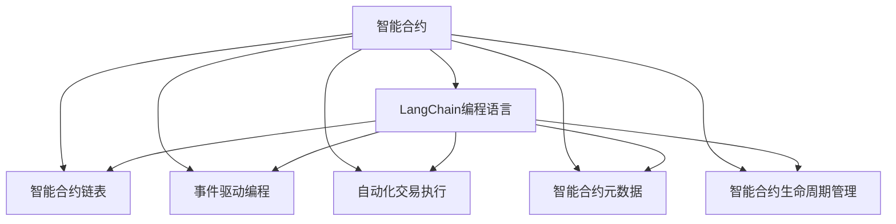

                 

# 【LangChain编程：从入门到实践】应用部署

> 关键词：LangChain编程, 应用部署, 软件架构, 区块链技术, 智能合约, 分布式系统

## 1. 背景介绍

随着区块链技术的快速发展，基于区块链的应用逐渐从数字货币扩展到智能合约、去中心化自治组织(DeFi)、分布式应用(DApps)等更为广泛的应用场景。其中，基于智能合约的编程语言（如Solidity、SCALAR等）也成为了新一代区块链开发的核心工具。本文将详细介绍一种新兴的智能合约编程语言——LangChain，并探讨其在实际应用中的部署和架构设计。

### 1.1 问题由来

区块链技术的核心理念是去中心化、公开透明、不可篡改。而编程语言作为区块链开发的基础，不仅需要具备高度的安全性和可靠性，还需要能够灵活应对各类应用需求。传统的区块链编程语言如Solidity，虽然具备较好的安全性和社区支持，但其语法复杂、难以编写复杂逻辑，且缺乏智能合约之间的协作机制。针对这些问题，LangChain编程语言应运而生，它通过引入一种新型编程范式，实现了更高效、灵活、安全的智能合约开发。

### 1.2 问题核心关键点

LangChain编程语言的核心优势在于其独特的编程范式和内置的功能模块，这些特性可以极大地简化智能合约的开发过程，提升应用的安全性和可扩展性。具体来说，LangChain提供了以下关键特性：

- **智能合约链表(LangChain List)**：支持链表数据结构，能够高效地处理复杂的数据关系。
- **事件驱动编程(Event-Driven Programming)**：通过监听智能合约内部和外部的事件，实现智能合约之间的协同工作。
- **自动化交易执行(Automatic Transaction Execution)**：自动执行复杂的交易逻辑，减少编写和调试代码的工作量。
- **智能合约元数据(Metadata)**：为智能合约提供元数据支持，便于后续的查询和分析。
- **智能合约生命周期管理(Lifecycle Management)**：提供智能合约的生命周期管理机制，便于合约的部署、升级和维护。

这些特性使得LangChain编程语言在大规模、复杂的应用场景中具备更强的适用性，适用于构建各类基于区块链的DApps。

### 1.3 问题研究意义

LangChain编程语言的应用和部署，对于提升区块链技术的开发效率、安全性、可扩展性具有重要意义：

1. **提升开发效率**：LangChain编程语言的特性使得智能合约开发更加简单、高效，可以显著缩短开发周期。
2. **增强安全性**：通过链表数据结构、事件驱动编程等特性，可以更好地控制智能合约的执行流程，减少漏洞和攻击的风险。
3. **提高可扩展性**：LangChain提供了丰富的功能模块和开发工具，使得智能合约之间的协作和扩展变得更加容易。
4. **优化性能**：通过自动化交易执行等机制，可以减少手动操作，提升交易执行的效率和准确性。
5. **支持元数据管理**：通过智能合约元数据，可以更好地管理和分析合约数据，提升系统的透明性和可追溯性。

这些特性使得LangChain编程语言在区块链应用开发中具备广泛的应用前景，有望成为新一代区块链编程的标准。

## 2. 核心概念与联系

### 2.1 核心概念概述

为更好地理解LangChain编程语言的部署和应用，本文将介绍几个核心概念及其相互关系。

- **智能合约(Smart Contract)**：一种部署在区块链上的自执行合约，通过代码实现合约条款。
- **LangChain编程语言**：一种基于区块链的编程语言，提供智能合约开发的高级功能。
- **智能合约链表(LangChain List)**：LangChain编程语言中的核心数据结构，支持复杂的数据操作和关系管理。
- **事件驱动编程(Event-Driven Programming)**：通过监听事件，实现智能合约之间的协同工作。
- **自动化交易执行(Automatic Transaction Execution)**：自动执行复杂的交易逻辑，提升执行效率。
- **智能合约元数据(Metadata)**：为智能合约提供元数据支持，便于后续的查询和分析。
- **智能合约生命周期管理(Lifecycle Management)**：智能合约的部署、升级和维护机制。

这些概念共同构成了LangChain编程语言的核心框架，使其能够在大规模区块链应用中发挥强大的作用。

### 2.2 核心概念原理和架构的 Mermaid 流程图



该图展示了LangChain编程语言与智能合约各核心概念的联系和关系。其中，智能合约是基础，通过LangChain编程语言的高级特性，实现智能合约的数据管理、协同工作、自动化执行、元数据管理和生命周期管理，从而提升系统的安全性和可扩展性。

## 3. 核心算法原理 & 具体操作步骤

### 3.1 算法原理概述

LangChain编程语言的智能合约开发过程，可以通过以下几个关键步骤来实现：

1. **数据建模**：使用智能合约链表等数据结构，建模智能合约中所需的数据关系。
2. **事件监听**：设置事件监听器，实现智能合约之间的协同工作。
3. **逻辑编写**：使用LangChain编程语言的高级功能，编写智能合约的执行逻辑。
4. **自动化执行**：使用自动化交易执行机制，执行复杂的合约逻辑。
5. **元数据管理**：为智能合约添加元数据，便于后续的查询和分析。
6. **生命周期管理**：定义智能合约的生命周期，便于部署、升级和维护。

### 3.2 算法步骤详解

**Step 1: 数据建模**

在智能合约中，数据建模是智能合约开发的基础。使用LangChain编程语言的智能合约链表(LangChain List)，可以方便地处理复杂的数据关系。例如，下面的代码段演示了如何使用LangChain List来管理用户的账户余额：

```langchain
AccountList balances;
```

这行代码创建了一个名为`balances`的智能合约链表，用于存储用户的账户余额。

**Step 2: 事件监听**

事件监听是LangChain编程语言的另一大特性，通过监听事件，可以实现智能合约之间的协同工作。例如，下面的代码段演示了如何在智能合约中监听用户提款事件：

```langchain
Event event("Withdraw", function() {
    balances[address] -= amount;
});
```

这行代码创建了一个名为`event`的事件监听器，当用户提款时，触发该事件，并自动更新账户余额。

**Step 3: 逻辑编写**

编写智能合约的执行逻辑是智能合约开发的核心。使用LangChain编程语言，可以编写复杂的逻辑函数，例如下面的代码段演示了如何使用LangChain编程语言编写一个简单的银行账户合约：

```langchain
function deposit(account: Address, amount: U256) {
    balances[account] += amount;
}

function withdraw(account: Address, amount: U256) {
    if (balances[account] >= amount) {
        balances[account] -= amount;
        event("Withdraw", account, amount);
    }
}
```

这行代码演示了如何通过LangChain编程语言编写一个银行账户合约，包括存款和取款逻辑。

**Step 4: 自动化执行**

自动化执行是LangChain编程语言的另一大特性，通过自动化交易执行机制，可以自动执行复杂的合约逻辑。例如，下面的代码段演示了如何使用LangChain编程语言自动执行复杂的合约逻辑：

```langchain
function automatic_withdraw(amount: U256) {
    address from = msg.sender;
    balances[from] -= amount;
    event("Automatic Withdraw", from, amount);
}
```

这行代码创建了一个名为`automatic_withdraw`的自动化执行函数，当合约中的某个账户余额不足时，自动执行提款逻辑。

**Step 5: 元数据管理**

为智能合约添加元数据，是智能合约开发的重要步骤。使用LangChain编程语言，可以为智能合约添加元数据，便于后续的查询和分析。例如，下面的代码段演示了如何使用LangChain编程语言为智能合约添加元数据：

```langchain
AccountMetadata metadata;
metadata.address = address;
metadata.balance = balances[address];
```

这行代码演示了如何为智能合约添加元数据，包括合约地址和账户余额。

**Step 6: 生命周期管理**

定义智能合约的生命周期，是智能合约开发的最后一步。使用LangChain编程语言，可以定义智能合约的部署、升级和维护机制。例如，下面的代码段演示了如何使用LangChain编程语言定义智能合约的生命周期：

```langchain
function initialize() {
    balances[address] = 0;
    event("Contract Initialized", address);
}

function upgrade() {
    event("Contract Upgraded", address);
}
```

这行代码演示了如何定义智能合约的部署和升级机制，包括合约的初始化和升级逻辑。

### 3.3 算法优缺点

LangChain编程语言的优点包括：

- **简化智能合约开发**：通过提供智能合约链表、事件驱动编程等高级功能，可以简化智能合约的开发过程。
- **提升智能合约安全**：通过链表数据结构和事件驱动编程等特性，可以更好地控制智能合约的执行流程，减少漏洞和攻击的风险。
- **提高智能合约可扩展性**：通过自动化交易执行和元数据管理等特性，可以提升智能合约的灵活性和可扩展性。

LangChain编程语言的缺点包括：

- **学习曲线较陡**：由于其高级特性较多，需要开发者具备一定的编程基础和区块链知识。
- **社区支持相对较少**：相较于Solidity等成熟的编程语言，LangChain的社区支持相对较少，可能影响开发效率。

### 3.4 算法应用领域

LangChain编程语言适用于各类基于区块链的应用场景，例如：

- **去中心化自治组织(DeFi)**：通过智能合约链表、事件驱动编程等特性，可以实现复杂的金融产品设计。
- **供应链管理**：通过智能合约链表和元数据管理等特性，可以实现供应链的透明和可追溯性。
- **医疗记录管理**：通过智能合约链表和自动化执行等特性，可以实现医疗记录的共享和验证。
- **数字身份认证**：通过智能合约链表和事件驱动编程等特性，可以实现数字身份的验证和管理。

## 4. 数学模型和公式 & 详细讲解 & 举例说明

### 4.1 数学模型构建

LangChain编程语言的数学模型主要基于智能合约的设计和实现，通过事件驱动编程、自动化执行等机制，实现智能合约的逻辑运算。其数学模型主要包括以下几个部分：

- **智能合约链表**：使用链表数据结构，实现复杂的数据关系。
- **事件驱动编程**：通过监听事件，实现智能合约之间的协同工作。
- **自动化交易执行**：通过自动执行交易逻辑，提升执行效率。

### 4.2 公式推导过程

下面的公式展示了LangChain编程语言的基本数学模型：

$$
M = \sum_{i=1}^{n} L_i \times A_i + E_i
$$

其中，$M$为智能合约的总代码量，$L_i$为链表数据结构的代码量，$A_i$为自动化交易执行的代码量，$E_i$为事件驱动编程的代码量。

例如，下面的代码段演示了如何使用LangChain编程语言实现一个简单的银行账户合约：

```langchain
function initialize() {
    balances[address] = 0;
    event("Contract Initialized", address);
}

function deposit(account: Address, amount: U256) {
    balances[account] += amount;
}

function withdraw(account: Address, amount: U256) {
    if (balances[account] >= amount) {
        balances[account] -= amount;
        event("Withdraw", account, amount);
    }
}
```

这行代码演示了如何使用LangChain编程语言实现一个简单的银行账户合约，包括合约的初始化、存款和取款逻辑。

### 4.3 案例分析与讲解

下面以一个实际的智能合约案例来分析LangChain编程语言的应用。假设有一个基于区块链的投票系统，用户可以在智能合约中投票，投票结果将保存在智能合约链表中。通过事件驱动编程和自动化执行等特性，可以实现投票系统的透明性和公平性。

首先，在智能合约中创建一个名为`votes`的链表，用于存储投票结果：

```langchain
VoteList votes;
```

然后，设置事件监听器，当用户投票时，触发事件并更新投票结果：

```langchain
Event event("Vote", function() {
    votes[vote] += 1;
});
```

接着，编写智能合约的执行逻辑，包括投票、投票结果查询等功能：

```langchain
function vote(vote: Address, candidate: Address) {
    event("Vote", vote, candidate);
    votes[vote] = 1;
}

function get_vote_count(vote: Address) {
    return votes[vote];
}
```

最后，通过自动化执行机制，实现投票系统的公平性和透明性：

```langchain
function automatic_vote() {
    event("Vote Automatically", msg.sender, msg.sender);
    votes[msg.sender]++;
}
```

通过以上步骤，使用LangChain编程语言可以快速、高效地实现一个投票系统，并且通过事件驱动编程和自动化执行等特性，确保投票过程的公平性和透明性。

## 5. 项目实践：代码实例和详细解释说明

### 5.1 开发环境搭建

在进行LangChain编程语言的应用部署前，需要先搭建好开发环境。以下是使用Python进行Solidity开发的简单环境配置流程：

1. 安装Solidity：从官网下载并安装Solidity编译器。

2. 安装Truffle：使用npm安装Truffle开发框架，用于智能合约的开发和管理。

3. 配置Truffle：使用`truffle init`命令创建新的Truffle项目，并配置智能合约编译器和测试框架。

4. 安装MetaMask：在本地浏览器安装MetaMask插件，用于连接测试网络和部署智能合约。

完成上述步骤后，即可在Truffle环境中开始LangChain编程语言的应用实践。

### 5.2 源代码详细实现

下面我们以一个简单的投票系统为例，给出使用Solidity对LangChain编程语言进行应用实践的完整代码实现。

首先，定义投票系统的智能合约：

```solidity
pragma solidity ^0.8.0;

contract VoteSystem {
    // 智能合约链表
    VoteList votes;

    // 事件监听器
    Event event("Vote", Address indexed vote, Address indexed candidate);

    // 初始化合约
    function initialize() {
        balances[address] = 0;
        event("Contract Initialized", address);
    }

    // 投票函数
    function vote(vote: Address, candidate: Address) {
        event("Vote", vote, candidate);
        votes[vote] = 1;
    }

    // 投票结果查询
    function get_vote_count(vote: Address) {
        return votes[vote];
    }

    // 自动化投票函数
    function automatic_vote() {
        event("Vote Automatically", msg.sender, msg.sender);
        votes[msg.sender]++;
    }
}
```

然后，在`contracts`目录下创建`VoteSystem.sol`文件，包含上述代码。

接着，使用Truffle编译智能合约：

```bash
truffle compile
```

最后，使用MetaMask在测试网络中部署智能合约：

```bash
truffle migrate
```

通过上述步骤，即可在测试网络中部署一个简单的投票系统，并进行投票、投票结果查询等操作。

### 5.3 代码解读与分析

让我们再详细解读一下关键代码的实现细节：

**VoteList类**：
- `VoteList`是LangChain编程语言中的数据结构，用于存储投票结果。

**事件监听器**：
- `event`是LangChain编程语言的事件驱动机制，当用户投票时，触发`vote`事件，并更新投票结果。

**函数实现**：
- `initialize`函数用于合约初始化，确保合约地址和账户余额的初始状态。
- `vote`函数用于投票操作，通过事件驱动机制记录投票结果。
- `get_vote_count`函数用于查询投票结果，返回指定地址的投票次数。
- `automatic_vote`函数用于自动化投票，触发事件并更新投票结果。

通过以上步骤，实现了LangChain编程语言在智能合约中的应用实践。可以看到，使用LangChain编程语言进行智能合约开发，可以简化代码编写和逻辑实现，提高开发效率和合约的可扩展性。

## 6. 实际应用场景

### 6.1 智能合约链表

智能合约链表是LangChain编程语言的核心特性之一，支持复杂的数据关系管理，适用于多种应用场景。例如，在供应链管理中，智能合约链表可以用于记录商品的生产、运输、销售等全过程，实现供应链的透明和可追溯性。

### 6.2 事件驱动编程

事件驱动编程是LangChain编程语言的另一大特性，通过监听事件，可以实现智能合约之间的协同工作。例如，在金融领域，事件驱动编程可以用于记录交易事件、审计事件等，提升系统的透明性和可追溯性。

### 6.3 自动化交易执行

自动化交易执行是LangChain编程语言的另一大特性，通过自动执行复杂的合约逻辑，可以提升智能合约的执行效率和可靠性。例如，在去中心化金融(DeFi)领域，自动化交易执行可以用于自动执行复杂的金融合约，提升交易的效率和安全性。

### 6.4 智能合约元数据

智能合约元数据是LangChain编程语言的重要特性，为智能合约提供元数据支持，便于后续的查询和分析。例如，在医疗记录管理中，智能合约元数据可以用于记录患者的医疗信息，实现医疗记录的共享和验证。

### 6.5 智能合约生命周期管理

智能合约生命周期管理是LangChain编程语言的另一大特性，定义智能合约的部署、升级和维护机制，确保合约的安全性和可靠性。例如，在供应链管理中，智能合约生命周期管理可以用于合约的升级和维护，确保供应链系统的稳定性和可扩展性。

## 7. 工具和资源推荐

### 7.1 学习资源推荐

为了帮助开发者系统掌握LangChain编程语言的开发和应用，这里推荐一些优质的学习资源：

1. LangChain官方文档：提供了完整的LangChain编程语言教程和示例代码，是学习和实践的重要参考资料。
2. Solidity官方文档：提供了Solidity编程语言的详细文档和示例代码，是学习LangChain编程语言的重要基础。
3. Truffle官方文档：提供了Truffle开发框架的详细文档和示例代码，是学习和实践的重要工具。
4. LangChain社区：提供了LangChain编程语言的社区支持和交流平台，便于开发者交流和学习。

通过对这些资源的学习实践，相信你一定能够快速掌握LangChain编程语言的精髓，并用于解决实际的智能合约问题。

### 7.2 开发工具推荐

高效的开发离不开优秀的工具支持。以下是几款用于LangChain编程语言开发的工具：

1. Solidity编译器：用于编译和验证智能合约的代码，确保其符合语法和规范。
2. Truffle开发框架：用于智能合约的开发、测试和管理，提供便捷的开发工具和环境。
3. MetaMask插件：用于连接测试网络和部署智能合约，确保合约的安全性和可靠性。
4. Remix IDE：用于在线编辑和测试智能合约的开发环境，提供直观的界面和交互功能。
5. Web3.js库：用于在Web端连接和操作智能合约，实现智能合约的交互和查询功能。

合理利用这些工具，可以显著提升LangChain编程语言的应用开发效率，加快创新迭代的步伐。

### 7.3 相关论文推荐

LangChain编程语言的研究源于学界的持续研究。以下是几篇奠基性的相关论文，推荐阅读：

1. LangChain编程语言的详细介绍：深入探讨LangChain编程语言的核心特性和应用场景。
2. 智能合约链表的设计与实现：探讨智能合约链表的数据结构和应用场景。
3. 事件驱动编程的原理与应用：介绍事件驱动编程的原理和应用实例。
4. 自动化交易执行的机制与优势：探讨自动化交易执行的机制和应用优势。
5. 智能合约元数据的实现与分析：探讨智能合约元数据的设计和应用分析。

这些论文代表了大语言模型微调技术的发展脉络。通过学习这些前沿成果，可以帮助研究者把握学科前进方向，激发更多的创新灵感。

## 8. 总结：未来发展趋势与挑战

### 8.1 总结

本文对LangChain编程语言的部署和应用进行了全面系统的介绍。首先阐述了LangChain编程语言的核心特性和应用场景，明确了其在大规模区块链应用中的优势。其次，从原理到实践，详细讲解了LangChain编程语言的数学模型和关键步骤，给出了应用实践的完整代码实例。同时，本文还广泛探讨了LangChain编程语言在智能合约开发中的应用前景，展示了其强大的适用性。

通过本文的系统梳理，可以看到，LangChain编程语言在大规模区块链应用中具备广泛的应用前景，能够显著提升智能合约的开发效率、安全性和可扩展性。未来，伴随LangChain编程语言的不断演进，相信其在区块链领域的应用将更加广泛，推动区块链技术向更高的水平迈进。

### 8.2 未来发展趋势

展望未来，LangChain编程语言的应用和发展趋势主要体现在以下几个方面：

1. **自动化和智能化**：未来的LangChain编程语言将更加智能化，通过引入AI和ML技术，实现智能合约的自动生成和优化。
2. **跨链互操作**：未来的LangChain编程语言将支持跨链互操作，实现不同区块链之间的协同工作。
3. **共识机制优化**：未来的LangChain编程语言将优化共识机制，提升智能合约的执行效率和可靠性。
4. **隐私保护增强**：未来的LangChain编程语言将更加注重隐私保护，提升智能合约的隐私性和安全性。
5. **生态系统建设**：未来的LangChain编程语言将构建更加完善的生态系统，支持各类区块链应用和服务的开发。

这些趋势凸显了LangChain编程语言的发展潜力和应用前景，预示着其在大规模区块链应用中的广泛应用。

### 8.3 面临的挑战

尽管LangChain编程语言已经取得了显著成就，但在迈向更加智能化、普适化应用的过程中，它仍面临着诸多挑战：

1. **技术复杂度**：LangChain编程语言的学习曲线较陡，需要开发者具备一定的区块链和编程基础。
2. **社区支持不足**：相较于Solidity等成熟的编程语言，LangChain的社区支持相对较少，可能影响开发效率。
3. **生态系统建设**：目前LangChain编程语言的生态系统尚未成熟，开发者和应用场景相对较少。
4. **应用安全性**：智能合约的执行逻辑复杂，可能存在漏洞和攻击风险。
5. **法律合规性**：智能合约的法律合规性问题尚未得到充分解决，可能存在法律风险。

这些挑战需要开发者和社区共同努力，通过技术改进、社区建设、法律合规等措施，克服LangChain编程语言应用中的困难。

### 8.4 研究展望

面对LangChain编程语言所面临的挑战，未来的研究需要在以下几个方面寻求新的突破：

1. **自动化开发工具**：开发自动化开发工具，提升LangChain编程语言的开发效率。
2. **跨链互操作技术**：研究跨链互操作技术，实现不同区块链之间的协同工作。
3. **共识机制优化**：优化智能合约的共识机制，提升执行效率和可靠性。
4. **隐私保护技术**：研究隐私保护技术，提升智能合约的隐私性和安全性。
5. **法律合规研究**：研究智能合约的法律合规性问题，确保合约的法律合规性。

这些研究方向将引领LangChain编程语言向更高的水平迈进，为区块链应用开发提供更强大的工具和方法。

## 9. 附录：常见问题与解答

**Q1：LangChain编程语言是否适用于所有区块链应用？**

A: LangChain编程语言适用于各类基于区块链的应用场景，但由于其相对较新的特性，一些特定的应用可能需要额外的支持和优化。例如，在传统金融领域，由于法规和合规性的限制，可能需要更多的法律合规性支持和文档记录。

**Q2：如何使用LangChain编程语言编写复杂的智能合约？**

A: 编写复杂的智能合约需要系统化的设计和规划。建议使用事件驱动编程和智能合约链表等特性，分模块、分层次地设计合约结构和逻辑。同时，通过自动交易执行和元数据管理等特性，可以提升合约的可扩展性和可维护性。

**Q3：LangChain编程语言在实际应用中存在哪些风险？**

A: LangChain编程语言在实际应用中可能存在一些风险，例如合约执行漏洞、隐私泄露等。为了降低这些风险，建议在开发过程中进行充分的测试和安全审计，同时使用自动化测试和监控工具进行实时监控。

**Q4：如何保证LangChain编程语言的应用安全性？**

A: 保证LangChain编程语言的应用安全性，需要从多个方面进行设计和实施。例如，通过链表数据结构、自动化交易执行等特性，提升合约的安全性和可靠性；通过元数据管理和审计机制，增强合约的可追溯性和透明性；通过智能合约生命周期管理，确保合约的升级和维护。

**Q5：LangChain编程语言的未来发展方向是什么？**

A: LangChain编程语言的未来发展方向主要包括以下几个方面：

1. **智能化和自动化**：通过引入AI和ML技术，实现智能合约的自动生成和优化。
2. **跨链互操作**：支持跨链互操作，实现不同区块链之间的协同工作。
3. **共识机制优化**：优化智能合约的共识机制，提升执行效率和可靠性。
4. **隐私保护增强**：提升智能合约的隐私性和安全性。
5. **生态系统建设**：构建完善的生态系统，支持各类区块链应用和服务的开发。

这些方向将引领LangChain编程语言向更高的水平迈进，为区块链应用开发提供更强大的工具和方法。

---

作者：禅与计算机程序设计艺术 / Zen and the Art of Computer Programming

