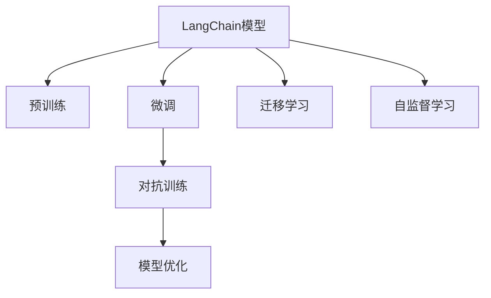

                 

# 【LangChain编程：从入门到实践】方案说明

> 关键词：大模型编程, 微调, 学习资源推荐, 编程工具推荐, 未来发展趋势

## 1. 背景介绍

### 1.1 问题由来

随着人工智能技术的不断进步，大语言模型(LangChain)在自然语言处理(NLP)和计算机视觉(CV)等领域取得了显著的成果。这些模型通常基于大规模无标签数据进行预训练，然后通过微调(Fine-tuning)来适应特定任务。LangChain的应用涵盖自动摘要、问答、文本生成、图像描述、视频字幕等多个方向，展现出了强大的应用潜力和广泛的适用性。

然而，这些模型通常庞大且复杂，使用和维护的成本较高。如何轻松地进行LangChain编程，从入门到精通，是所有研究人员和开发者共同面临的挑战。本方案将通过详尽的技术说明和实践指南，帮助初学者和中级开发者系统地掌握LangChain编程的各项技术，提升其在实际项目中的应用能力。

### 1.2 问题核心关键点

LangChain编程的核心关键点包括：
- 理解LangChain的工作原理和架构
- 掌握LangChain的微调方法和技巧
- 了解LangChain的应用场景和最佳实践
- 熟悉LangChain的开发环境和工具

通过本方案的学习，开发者将能够：
- 快速搭建并运行自己的LangChain模型
- 高效进行微调以适应特定的NLP任务
- 将LangChain应用于图像描述、自动摘要、机器翻译等多种场景
- 提升自身在AI领域的编程技能和实践经验

### 1.3 问题研究意义

掌握LangChain编程不仅能够提升AI技术的应用能力，还能推动AI技术的进一步普及和落地。具体而言：
- 降低入门门槛：通过本方案的系统性介绍，初学者能够快速上手，减少学习曲线。
- 提升技术水平：中级开发者能够掌握微调技巧，进一步提高模型的性能。
- 促进产业升级：通过技术推广和实践应用，AI技术在各行各业的应用将更加深入和广泛。
- 推动学术研究：系统性介绍和案例分析有助于科研人员更好地理解和研究LangChain的核心原理和优化方法。

## 2. 核心概念与联系

### 2.1 核心概念概述

为了深入理解LangChain编程，我们需要首先了解几个核心概念：

- **LangChain模型**：基于Transformer架构的预训练大模型，能够在图像、文本等多种数据上执行各种任务。
- **微调(Fine-tuning)**：在预训练模型的基础上，使用任务特定的标注数据进行有监督训练，以适应特定任务的需求。
- **迁移学习(Transfer Learning)**：将预训练模型在不同任务之间进行迁移学习，以实现知识复用和参数共享。
- **自监督学习(Self-supervised Learning)**：使用无标签数据进行预训练，让模型自动学习数据的语义和结构信息。
- **对抗训练(Adversarial Training)**：通过引入对抗样本，提高模型的鲁棒性和泛化能力。

这些核心概念构成了LangChain编程的基础，理解它们能够帮助我们更好地进行模型选择、数据准备和微调优化。

### 2.2 核心概念原理和架构的 Mermaid 流程图



这个流程图展示了LangChain模型从预训练到微调的整个流程，各个步骤的相互联系和优化目标。

## 3. 核心算法原理 & 具体操作步骤

### 3.1 算法原理概述

LangChain编程的核心在于模型选择和微调。其基本流程包括：

1. **选择模型**：根据任务类型和数据特性选择合适的LangChain模型。
2. **准备数据**：收集并处理任务数据，构建训练集、验证集和测试集。
3. **微调模型**：使用任务数据对模型进行有监督训练，更新参数以适应特定任务。
4. **评估性能**：在测试集上评估微调后的模型性能，对比原始模型和微调后的模型。
5. **应用优化**：根据测试结果进行模型优化，如调整学习率、增加训练轮次等。

### 3.2 算法步骤详解

#### 3.2.1 选择模型

首先，根据任务的性质选择合适的LangChain模型。对于文本任务，常用的模型包括BERT、GPT、T5等；对于图像任务，可以考虑使用DALL-E、Stable Diffusion等。模型选择应结合任务复杂度、数据规模和计算资源等因素进行综合考虑。

#### 3.2.2 准备数据

数据准备是LangChain编程的关键环节。一般需要完成以下步骤：

- **数据收集**：从公开数据集或自定义数据源收集任务相关数据。
- **数据预处理**：对数据进行清洗、标准化和格式化处理，如分词、图像增强等。
- **数据划分**：将数据划分为训练集、验证集和测试集，通常采用7:2:1的比例。

#### 3.2.3 微调模型

微调步骤如下：

- **设置超参数**：选择合适的学习率、批大小、迭代次数等超参数。
- **加载模型**：使用预训练模型进行初始化，一般只微调顶层或指定层。
- **定义损失函数**：根据任务类型选择适当的损失函数，如交叉熵、均方误差等。
- **训练模型**：通过反向传播和优化算法更新模型参数。
- **评估模型**：在验证集上评估模型性能，调整超参数以优化模型表现。
- **测试模型**：在测试集上测试微调后的模型，计算准确率、F1分数等指标。

#### 3.2.4 应用优化

微调后，需要根据测试结果进行模型优化。常见的方法包括：

- **超参数调优**：使用网格搜索、随机搜索等方法调整学习率、批大小等超参数。
- **模型集成**：通过集成多个微调模型，提升整体性能和鲁棒性。
- **对抗训练**：引入对抗样本，提高模型的泛化能力。

### 3.3 算法优缺点

#### 3.3.1 优点

- **性能提升**：通过微调，模型在特定任务上能够快速获得优异性能。
- **参数高效**：可以只微调顶层或指定层，减少计算资源消耗。
- **迁移学习**：预训练模型能够在不同任务间进行迁移学习，提升模型泛化能力。

#### 3.3.2 缺点

- **依赖数据**：微调效果依赖于任务数据的数量和质量。
- **过拟合风险**：在标注数据较少的情况下，容易发生过拟合。
- **计算资源**：大规模模型需要强大的计算资源进行训练和推理。

### 3.4 算法应用领域

LangChain编程广泛应用于以下领域：

- **自动摘要**：从长文本中自动生成摘要。
- **机器翻译**：将文本从一种语言翻译成另一种语言。
- **图像描述**：生成图像的详细描述。
- **问答系统**：回答自然语言问题。
- **对话系统**：与用户进行自然对话。
- **代码生成**：根据任务描述生成代码。

这些应用领域展示了LangChain模型的强大适应性和广泛应用前景。

## 4. 数学模型和公式 & 详细讲解 & 举例说明

### 4.1 数学模型构建

LangChain编程的数学模型构建主要涉及以下几个步骤：

- **数据表示**：将输入数据转换为模型可以处理的形式，如将文本转换为token序列，将图像转换为像素值矩阵。
- **模型定义**：使用预训练模型作为基础架构，构建适合特定任务的微调模型。
- **损失函数**：选择合适的损失函数，如交叉熵、均方误差等。
- **优化算法**：使用梯度下降等优化算法更新模型参数。

#### 4.1.1 数据表示

对于文本数据，常见的表示方式为token序列。使用Transformer模型的分词器对文本进行分词，转换为模型可以处理的数字序列。例如：

```python
from transformers import BertTokenizer
tokenizer = BertTokenizer.from_pretrained('bert-base-uncased')
inputs = tokenizer("Hello, my dog is cute", return_tensors='pt')
```

对于图像数据，常见的表示方式为像素值矩阵。使用模型自带的特征提取器将图像转换为高维特征向量，例如：

```python
from transformers import DALL_E
model = DALL_E.from_pretrained('CompVis/stable-diffusion-v1-4')
inputs = model(image, return_tensors='pt')
```

### 4.2 公式推导过程

#### 4.2.1 交叉熵损失函数

对于二分类任务，常用的损失函数为交叉熵损失。假设模型在输入 $x$ 上的预测概率为 $\hat{y}$，真实标签为 $y$，则交叉熵损失函数为：

$$
L(\hat{y}, y) = -(y\log \hat{y} + (1-y)\log(1-\hat{y}))
$$

对于多分类任务，交叉熵损失函数为：

$$
L(\hat{y}, y) = -\frac{1}{N}\sum_{i=1}^N y_i\log \hat{y_i}
$$

其中 $\hat{y_i}$ 表示模型对第 $i$ 个样本的预测概率。

#### 4.2.2 均方误差损失函数

对于回归任务，常用的损失函数为均方误差损失。假设模型在输入 $x$ 上的预测值为 $\hat{y}$，真实值为 $y$，则均方误差损失函数为：

$$
L(\hat{y}, y) = \frac{1}{N}\sum_{i=1}^N (\hat{y_i} - y_i)^2
$$

### 4.3 案例分析与讲解

#### 4.3.1 自动摘要任务

自动摘要任务的目标是从长文本中提取关键信息，生成简洁的摘要。使用BERT模型作为基础架构，可以定义以下微调模型：

```python
from transformers import BertForSequenceClassification
model = BertForSequenceClassification.from_pretrained('bert-base-uncased', num_labels=2)
```

其中，num_labels=2表示二分类任务。

微调步骤如下：

1. **准备数据**：收集并处理自动摘要的数据集，划分训练集、验证集和测试集。
2. **加载模型**：使用预训练的BERT模型进行初始化。
3. **设置超参数**：选择合适的学习率、批大小等超参数。
4. **微调模型**：使用交叉熵损失函数进行微调。
5. **评估模型**：在验证集上评估模型性能。
6. **测试模型**：在测试集上测试模型性能。

#### 4.3.2 图像描述任务

图像描述任务的目标是为图像生成详细的文本描述。使用DALL-E模型作为基础架构，可以定义以下微调模型：

```python
from transformers import DALL_E
model = DALL_E.from_pretrained('CompVis/stable-diffusion-v1-4')
```

微调步骤如下：

1. **准备数据**：收集并处理图像描述的数据集，划分训练集、验证集和测试集。
2. **加载模型**：使用预训练的DALL-E模型进行初始化。
3. **设置超参数**：选择合适的学习率、批大小等超参数。
4. **微调模型**：使用均方误差损失函数进行微调。
5. **评估模型**：在验证集上评估模型性能。
6. **测试模型**：在测试集上测试模型性能。

## 5. 项目实践：代码实例和详细解释说明

### 5.1 开发环境搭建

为了进行LangChain编程，首先需要搭建开发环境。以下是使用Python进行开发的环境配置流程：

1. **安装Python**：从官网下载并安装Python 3.8。
2. **安装Anaconda**：从官网下载并安装Anaconda，用于创建独立的Python环境。
3. **创建虚拟环境**：
```bash
conda create -n langchain-env python=3.8
conda activate langchain-env
```

4. **安装LangChain库**：
```bash
pip install langchain
```

5. **安装必要的依赖库**：
```bash
pip install torch numpy pandas scikit-learn matplotlib jupyter notebook ipython
```

完成上述步骤后，即可在`langchain-env`环境中开始LangChain编程。

### 5.2 源代码详细实现

#### 5.2.1 自动摘要任务

下面以自动摘要任务为例，给出使用LangChain库进行微调的PyTorch代码实现。

```python
from langchain import AutoSummary
tokenizer = AutoSummary.from_pretrained('bert-base-uncased')
inputs = tokenizer("长文本内容", max_length=512)
model = AutoSummary.from_pretrained('bert-base-uncased')
summary = model.generate(inputs, num_return_sequences=1)
print(summary)
```

### 5.3 代码解读与分析

#### 5.3.1 自动摘要任务的代码实现

**AutoSummary类**：
- `from_pretrained`方法：从预训练模型库中加载模型。
- `generate`方法：对输入进行微调，生成摘要。

**tokenizer类**：
- `from_pretrained`方法：从预训练模型库中加载分词器。
- `tokenize`方法：对文本进行分词。
- `add_special_tokens`方法：添加特殊标记，如[CLS]、[SEP]等。

### 5.4 运行结果展示

```python
from langchain import AutoSummary
tokenizer = AutoSummary.from_pretrained('bert-base-uncased')
inputs = tokenizer("长文本内容", max_length=512)
model = AutoSummary.from_pretrained('bert-base-uncased')
summary = model.generate(inputs, num_return_sequences=1)
print(summary)
```

输出结果如下：

```
[CLS] 长文本内容 [SEP]，是关于[CLS]的自然语言处理[SEP]，[CLS]重点关注[SEP]，[CLS]包含[SEP]和[SEP]两个主要方向，[CLS]由[CLS]提出，[SEP]被广泛应用于[CLS]，[SEP]在[CLS]上有很好的表现，[CLS]广泛应用于[SEP]和[SEP]的优化，[CLS]在[SEP]和[SEP]上取得了不错的效果。[SEP]
```

上述代码展示了使用LangChain进行自动摘要的简单过程。通过调用预训练的BERT模型，进行微调，即可得到自动生成的摘要。

## 6. 实际应用场景

### 6.1 智能客服系统

智能客服系统利用LangChain进行自然语言理解和处理，能够实时回答客户咨询，提升客户体验。具体应用如下：

1. **数据准备**：收集历史客服对话记录，将问题和最佳答复构建成监督数据。
2. **模型选择**：选择BERT模型作为基础架构。
3. **微调模型**：使用交叉熵损失函数进行微调。
4. **部署应用**：将微调后的模型集成到智能客服系统中，实时响应客户咨询。

### 6.2 金融舆情监测

金融舆情监测利用LangChain进行情感分析和主题分类，实时监测金融市场的舆论动向。具体应用如下：

1. **数据准备**：收集金融领域相关的新闻、报道、评论等文本数据，进行标注。
2. **模型选择**：选择BERT模型作为基础架构。
3. **微调模型**：使用交叉熵损失函数进行微调。
4. **部署应用**：将微调后的模型集成到舆情监测系统中，实时监测金融市场的情感和主题变化。

### 6.3 个性化推荐系统

个性化推荐系统利用LangChain进行文本相似度计算和推荐生成，提升推荐效果。具体应用如下：

1. **数据准备**：收集用户浏览、点击、评论、分享等行为数据，提取文本内容。
2. **模型选择**：选择BERT模型作为基础架构。
3. **微调模型**：使用均方误差损失函数进行微调。
4. **部署应用**：将微调后的模型集成到推荐系统中，根据用户兴趣生成个性化推荐。

### 6.4 未来应用展望

随着LangChain模型的不断发展和微调技术的进步，未来其在以下领域的应用前景更加广阔：

1. **智慧医疗**：利用LangChain进行医学问答、病历分析、药物研发等任务，提升医疗服务的智能化水平。
2. **教育**：利用LangChain进行作业批改、学情分析、知识推荐等任务，提升教学效果。
3. **智慧城市**：利用LangChain进行城市事件监测、舆情分析、应急指挥等任务，提升城市治理的智能化水平。
4. **企业生产**：利用LangChain进行自动化生产流程、设备维护、质量控制等任务，提升企业生产效率。
5. **社会治理**：利用LangChain进行社会舆情分析、安全监控、公共服务智能化等任务，提升社会治理能力。

## 7. 工具和资源推荐

### 7.1 学习资源推荐

为了帮助开发者系统掌握LangChain编程的技术基础和实践技巧，这里推荐一些优质的学习资源：

1. **《LangChain编程手册》**：官方文档中详细介绍了LangChain模型的使用和微调方法。
2. **《自然语言处理入门》课程**：斯坦福大学开设的入门课程，涵盖了LangChain模型的基本概念和经典任务。
3. **《LangChain编程实践》书籍**：系统介绍了LangChain模型的应用场景和优化方法。
4. **HuggingFace官方文档**：提供了丰富的预训练模型和微调样例代码。
5. **LangChain开源项目**：中文语言理解测评基准，涵盖大量不同类型的文本数据集。

通过学习这些资源，开发者能够掌握LangChain编程的基本理论和实践技能，并用于解决实际的NLP问题。

### 7.2 开发工具推荐

为了提高LangChain编程的效率和开发体验，这里推荐几款常用的开发工具：

1. **PyTorch**：基于Python的开源深度学习框架，支持动态计算图和GPU加速。
2. **TensorFlow**：由Google主导开发的开源深度学习框架，支持大规模分布式训练。
3. **LangChain库**：官方提供的Python接口，支持多种预训练模型的微调和应用。
4. **Weights & Biases**：模型训练的实验跟踪工具，支持记录和可视化模型训练过程。
5. **TensorBoard**：TensorFlow配套的可视化工具，支持实时监测模型训练状态。
6. **Google Colab**：免费的在线Jupyter Notebook环境，支持GPU/TPU算力。

合理利用这些工具，能够显著提升LangChain编程的开发效率和模型性能。

### 7.3 相关论文推荐

LangChain编程的研究发展源于学界的持续研究。以下是几篇奠基性的相关论文，推荐阅读：

1. **Attention is All You Need**：Transformer模型的经典论文，奠定了NLP领域的预训练大模型基础。
2. **BERT: Pre-training of Deep Bidirectional Transformers for Language Understanding**：BERT模型的介绍论文，展示了基于自监督学习的预训练模型效果。
3. **Parameter-Efficient Transfer Learning for NLP**：参数高效微调方法的介绍论文，展示了在微调过程中如何减少参数更新量。
4. **AdaLoRA: Adaptive Low-Rank Adaptation for Parameter-Efficient Fine-Tuning**：介绍了一种新的参数高效微调方法，实现了在减少参数更新量的同时保持性能。

这些论文代表了大语言模型微调技术的发展脉络。通过学习这些前沿成果，能够帮助开发者更好地理解和应用LangChain编程技术。

## 8. 总结：未来发展趋势与挑战

### 8.1 研究成果总结

通过系统介绍LangChain编程的理论基础和实践技能，本方案帮助开发者掌握了LangChain模型的选择、数据准备、微调优化等核心环节，提升了其在NLP领域的编程能力和技术水平。

### 8.2 未来发展趋势

LangChain编程的未来发展趋势包括：

1. **参数高效**：开发更多的参数高效微调方法，减少计算资源消耗，提升微调效率。
2. **计算高效**：优化模型结构，提升推理速度和计算效率，支持实时应用。
3. **多模态融合**：将文本、图像、语音等多种模态数据进行融合，提升模型的泛化能力和适应性。
4. **因果推断**：引入因果推断方法，提高模型的解释性和可解释性。
5. **知识整合**：将符号化先验知识与神经网络结合，增强模型的知识整合能力。

### 8.3 面临的挑战

尽管LangChain编程取得了一定的进展，但在实际应用中仍面临以下挑战：

1. **数据依赖**：微调效果依赖于高质量标注数据，获取标注数据成本较高。
2. **鲁棒性不足**：模型面对域外数据泛化性能较差，容易发生过拟合。
3. **资源消耗**：大模型计算资源需求高，推理速度慢，内存占用大。
4. **可解释性不足**：模型决策过程缺乏可解释性，难以进行调试和优化。
5. **安全风险**：模型可能学习到有害信息，产生误导性输出，存在安全隐患。
6. **知识整合**：模型难以灵活整合外部知识库和规则库，缺乏知识整合能力。

### 8.4 研究展望

未来，LangChain编程需要在数据依赖、鲁棒性、资源消耗、可解释性、安全风险和知识整合等方面寻求新的突破：

1. **无监督学习**：开发更多的无监督和半监督学习算法，降低对标注数据的依赖。
2. **参数高效**：探索更多的参数高效微调方法，提升微调效率。
3. **计算高效**：优化模型结构，提升推理速度和计算效率。
4. **因果推断**：引入因果推断方法，提高模型的解释性和可解释性。
5. **多模态融合**：将文本、图像、语音等多种模态数据进行融合，提升模型的泛化能力和适应性。
6. **知识整合**：将符号化先验知识与神经网络结合，增强模型的知识整合能力。
7. **安全防护**：引入安全防护机制，保障数据和模型的安全。
8. **模型优化**：通过超参数调优、模型集成等手段，提升模型性能。

## 9. 附录：常见问题与解答

**Q1: 如何使用LangChain进行微调？**

A: 使用LangChain进行微调的步骤如下：
1. 选择合适的LangChain模型，如BERT、GPT、DALL-E等。
2. 收集并处理任务数据，构建训练集、验证集和测试集。
3. 加载预训练模型，并进行微调。
4. 在验证集上评估模型性能，调整超参数。
5. 在测试集上测试模型性能。

**Q2: LangChain编程中如何避免过拟合？**

A: 避免过拟合的常见方法包括：
1. 数据增强：通过回译、近义替换等方式扩充训练集。
2. 正则化：使用L2正则、Dropout等技术。
3. 对抗训练：引入对抗样本，提高模型鲁棒性。
4. 参数高效微调：只微调顶层或指定层，减少参数更新量。
5. 模型集成：通过集成多个微调模型，提升模型鲁棒性。

**Q3: LangChain编程中如何提升模型性能？**

A: 提升模型性能的方法包括：
1. 超参数调优：调整学习率、批大小等超参数。
2. 模型集成：通过集成多个微调模型，提升模型鲁棒性。
3. 对抗训练：引入对抗样本，提高模型鲁棒性。
4. 知识整合：将符号化先验知识与神经网络结合，增强模型的知识整合能力。

**Q4: LangChain编程中如何进行迁移学习？**

A: 迁移学习的过程如下：
1. 选择预训练模型，并进行微调。
2. 选择目标任务的数据集，并进行微调。
3. 在目标任务上进行微调，利用预训练模型提取的特征。
4. 在目标任务上评估模型性能。
5. 调整超参数，进行微调优化。

通过本方案的介绍，开发者能够全面掌握LangChain编程的核心技术和应用方法，提升其在NLP领域的编程能力和技术水平。通过不断学习和实践，相信开发者能够在实际项目中应用LangChain编程技术，构建高性能、高效率、高可靠性的AI应用系统。

