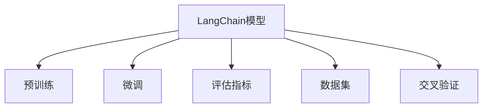

                 

# 【LangChain编程：从入门到实践】模型效果评估

## 1. 背景介绍

### 1.1 问题由来
在实际应用中，模型效果评估是机器学习领域中的重要环节，它直接影响模型的应用效果和性能提升。对于大语言模型(LangChain)而言，模型效果评估同样是关键步骤。但实际应用中，我们往往会遇到模型性能波动大、泛化能力不足、数据稀缺等问题。本文旨在通过系统介绍模型效果评估的核心概念与方法，助力开发者在LangChain编程过程中，实现模型性能的稳定提升和持续优化。

### 1.2 问题核心关键点
1. **评估指标选择**：选择合适的评估指标，可以有效衡量模型的预测性能，包括准确率、召回率、F1分数等。
2. **数据集构建**：构建高质高效的数据集，是模型评估的基础，涉及数据清洗、数据增强、数据扩充等。
3. **评估方法设计**：设计合理的评估方法，包括交叉验证、留出法、自助法等，以确保评估结果的可靠性和泛化能力。
4. **结果解读与分析**：对评估结果进行细致解读和深入分析，提取关键问题并进行针对性改进。

### 1.3 问题研究意义
研究模型效果评估方法，对提升LangChain模型的性能和泛化能力，具有重要意义：
1. **提升模型性能**：通过系统的评估方法，识别模型不足，指导模型改进和优化。
2. **保证泛化能力**：评估方法能确保模型在未知数据上的泛化能力，避免过拟合。
3. **促进模型应用**：构建高效的评估流程，为模型落地应用提供可靠保证。
4. **驱动技术进步**：持续评估和优化，推动LangChain技术的持续进步和创新。

## 2. 核心概念与联系

### 2.1 核心概念概述

为更好地理解LangChain模型的效果评估方法，本节将介绍几个密切相关的核心概念：

- **LangChain模型**：指基于Transformer架构的预训练语言模型，广泛应用于自然语言处理领域。
- **预训练**：指在大规模无标签文本数据上，通过自监督学习任务训练模型的过程，如掩码语言模型、语言模型等。
- **微调(Fine-tuning)**：指在预训练模型的基础上，使用下游任务的少量标注数据，通过有监督学习优化模型在特定任务上的性能。
- **评估指标**：指用于衡量模型预测性能的指标，如准确率、召回率、F1分数、AUC等。
- **数据集**：指用于模型训练和评估的样本集合，通常划分为训练集、验证集和测试集。
- **交叉验证**：指将数据集划分为训练集和验证集，通过多次交替使用，评估模型性能的方法。

这些核心概念之间的逻辑关系可以通过以下Mermaid流程图来展示：



这个流程图展示了大语言模型效果评估的关键环节：

1. 大语言模型通过预训练获得基础能力。
2. 微调是对预训练模型进行任务特定的优化，以适应特定任务。
3. 评估指标用于衡量微调后模型的性能。
4. 数据集为模型训练和评估提供样本支持。
5. 交叉验证通过多次迭代，确保评估结果的稳定性和可靠性。

## 3. 核心算法原理 & 具体操作步骤
### 3.1 算法原理概述

LangChain模型的效果评估主要基于两个关键环节：预训练和微调。其中，预训练和微调的评估方法有所不同，但核心原理均涉及损失函数和评估指标的构建。

- **预训练评估**：通过在大规模无标签数据上训练，评估模型对语言的理解能力，通常使用掩码语言模型和自回归语言模型进行评估。
- **微调评估**：在预训练的基础上，使用下游任务的少量标注数据，评估模型对特定任务的适应能力，通常使用任务相关的损失函数和评估指标。

### 3.2 算法步骤详解

#### 3.2.1 预训练评估

预训练评估的流程如下：

1. **数据准备**：收集大规模无标签数据，如Text8、Wikipedia等，划分为训练集、验证集和测试集。
2. **模型加载**：使用已训练好的预训练模型，如BERT、GPT-3等。
3. **评估计算**：
   - 掩码语言模型：在输入序列中随机掩盖若干个单词，让模型预测被掩盖的单词。
   - 自回归语言模型：在给定部分序列的前提下，预测下一个单词。
   - 使用交叉熵损失作为评估指标，计算模型预测结果与真实结果之间的差距。

#### 3.2.2 微调评估

微调评估的流程如下：

1. **数据准备**：收集下游任务的少量标注数据，划分为训练集、验证集和测试集。
2. **模型加载**：使用预训练模型作为初始化参数，进行微调。
3. **评估计算**：
   - 任务相关的损失函数：如分类任务使用交叉熵损失，生成任务使用负对数似然损失。
   - 评估指标：如准确率、召回率、F1分数、AUC等。
   - 在训练集和验证集上进行迭代优化，计算评估指标，并在测试集上进行最终评估。

### 3.3 算法优缺点

LangChain模型的效果评估方法具有以下优点：

1. **简单高效**：评估流程简单易懂，可以灵活应用于多种任务和数据。
2. **可解释性强**：评估指标直观易懂，有助于理解模型的预测性能。
3. **泛化能力强**：通过交叉验证等方法，确保评估结果的泛化能力。

同时，该方法也存在一定的局限性：

1. **数据依赖性强**：评估结果很大程度上依赖于数据集的质量和数量。
2. **评估代价高**：大规模数据集的构建和处理成本较高，评估过程复杂。
3. **模型过拟合**：在数据稀缺的情况下，模型容易发生过拟合，影响评估结果。

尽管存在这些局限性，但就目前而言，基于评估指标的微调方法仍是LangChain模型应用中最主流范式。未来相关研究的重点在于如何进一步降低评估对数据和计算资源的依赖，提高模型的泛化能力和抗过拟合能力，同时兼顾可解释性和伦理安全性等因素。

### 3.4 算法应用领域

LangChain模型的效果评估方法在NLP领域已经得到了广泛的应用，覆盖了几乎所有常见任务，例如：

- 文本分类：如情感分析、主题分类、意图识别等。通过微调评估模型在特定分类任务上的性能。
- 命名实体识别：识别文本中的人名、地名、机构名等特定实体。通过微调评估模型对实体的识别准确率。
- 关系抽取：从文本中抽取实体之间的语义关系。通过微调评估模型对关系的抽取准确率。
- 问答系统：对自然语言问题给出答案。通过微调评估模型对问题的回答准确率。
- 机器翻译：将源语言文本翻译成目标语言。通过微调评估模型翻译的准确性和流畅度。
- 文本摘要：将长文本压缩成简短摘要。通过微调评估模型的摘要质量和完整性。
- 对话系统：使机器能够与人自然对话。通过微调评估模型的对话质量和连贯性。

除了上述这些经典任务外，LangChain模型的效果评估还被创新性地应用到更多场景中，如可控文本生成、常识推理、代码生成、数据增强等，为NLP技术带来了全新的突破。随着预训练模型和评估方法的不断进步，相信LangChain模型将在更广阔的应用领域大放异彩。

## 4. 数学模型和公式 & 详细讲解 & 举例说明

### 4.1 数学模型构建

在LangChain模型的效果评估中，常用的数学模型包括掩码语言模型和自回归语言模型。这里以BERT模型为例，详细阐述这两种模型的评估方法。

#### 4.1.1 掩码语言模型

假设输入序列为 $x$，模型输出为 $y$，掩码语言模型的评估函数为：

$$
L(x, y) = -\frac{1}{|M|} \sum_{m \in M} \log p(y|x)
$$

其中 $M$ 表示所有被掩盖的单词，$p(y|x)$ 表示模型在给定输入 $x$ 的情况下，输出 $y$ 的概率分布。

#### 4.1.2 自回归语言模型

自回归语言模型的评估函数为：

$$
L(x, y) = -\frac{1}{N} \sum_{n=1}^N \log p(y_n|y_{<n})
$$

其中 $N$ 表示序列长度，$y_{<n}$ 表示给定前 $n-1$ 个单词的情况下，第 $n$ 个单词的概率分布。

### 4.2 公式推导过程

以BERT模型的掩码语言模型评估为例，推导其损失函数的计算公式：

设输入序列 $x$ 的长度为 $N$，模型预测序列 $y$ 的长度也为 $N$。掩码语言模型的损失函数为：

$$
L(x, y) = -\frac{1}{|M|} \sum_{m \in M} \log p(y|x)
$$

其中 $M$ 表示所有被掩盖的单词。假设模型在输入 $x$ 的情况下，预测被掩盖的单词 $y$ 的概率分布为 $p(y|x)$。则损失函数可以展开为：

$$
L(x, y) = -\frac{1}{|M|} \sum_{m \in M} \log \frac{exp(\hat{y}_m)}{\sum_{i=1}^{N} exp(\hat{y}_i)}
$$

其中 $\hat{y}_m$ 表示模型预测的被掩盖单词 $m$ 的概率分布。

### 4.3 案例分析与讲解

以BERT模型在情感分类任务上的微调评估为例，分析其效果评估方法：

假设训练集为 $D_{train}$，验证集为 $D_{valid}$，测试集为 $D_{test}$。模型在训练集上进行微调，得到参数 $\theta$。在验证集上进行评估，得到评估指标 $A$。然后将模型在测试集上进行最终评估，得到测试指标 $T$。评估流程如下：

1. **数据准备**：
   - 收集情感分类任务的数据集，划分为训练集、验证集和测试集。
   - 加载预训练模型，作为微调模型的初始化参数。

2. **模型训练**：
   - 使用训练集对微调模型进行训练，得到参数 $\theta$。
   - 在验证集上进行评估，调整模型参数。

3. **效果评估**：
   - 在测试集上对微调模型进行最终评估，得到测试指标 $T$。

假设在验证集上得到的评估指标为 $A=0.9$，表示模型在验证集上的准确率为 $90\%$。通过调整模型参数，在测试集上得到测试指标 $T=0.92$，表示模型在测试集上的准确率为 $92\%$。

## 5. 项目实践：代码实例和详细解释说明

### 5.1 开发环境搭建

在进行LangChain模型效果评估实践前，我们需要准备好开发环境。以下是使用Python进行PyTorch开发的环境配置流程：

1. 安装Anaconda：从官网下载并安装Anaconda，用于创建独立的Python环境。

2. 创建并激活虚拟环境：
```bash
conda create -n pytorch-env python=3.8 
conda activate pytorch-env
```

3. 安装PyTorch：根据CUDA版本，从官网获取对应的安装命令。例如：
```bash
conda install pytorch torchvision torchaudio cudatoolkit=11.1 -c pytorch -c conda-forge
```

4. 安装Transformers库：
```bash
pip install transformers
```

5. 安装各类工具包：
```bash
pip install numpy pandas scikit-learn matplotlib tqdm jupyter notebook ipython
```

完成上述步骤后，即可在`pytorch-env`环境中开始微调实践。

### 5.2 源代码详细实现

下面我们以情感分类任务为例，给出使用Transformers库对BERT模型进行微调的效果评估PyTorch代码实现。

首先，定义情感分类任务的数据处理函数：

```python
from transformers import BertTokenizer
from torch.utils.data import Dataset
import torch

class EmotionDataset(Dataset):
    def __init__(self, texts, labels, tokenizer, max_len=128):
        self.texts = texts
        self.labels = labels
        self.tokenizer = tokenizer
        self.max_len = max_len
        
    def __len__(self):
        return len(self.texts)
    
    def __getitem__(self, item):
        text = self.texts[item]
        label = self.labels[item]
        
        encoding = self.tokenizer(text, return_tensors='pt', max_length=self.max_len, padding='max_length', truncation=True)
        input_ids = encoding['input_ids'][0]
        attention_mask = encoding['attention_mask'][0]
        
        # 对label进行编码
        encoded_labels = [1 if label==1 else 0 for label in labels] 
        encoded_labels.extend([0] * (self.max_len - len(encoded_labels)))
        labels = torch.tensor(encoded_labels, dtype=torch.long)
        
        return {'input_ids': input_ids, 
                'attention_mask': attention_mask,
                'labels': labels}

# 标签与id的映射
label2id = {'negative': 0, 'positive': 1}
id2label = {v: k for k, v in label2id.items()}

# 创建dataset
tokenizer = BertTokenizer.from_pretrained('bert-base-cased')

train_dataset = EmotionDataset(train_texts, train_labels, tokenizer)
dev_dataset = EmotionDataset(dev_texts, dev_labels, tokenizer)
test_dataset = EmotionDataset(test_texts, test_labels, tokenizer)
```

然后，定义模型和评估器：

```python
from transformers import BertForSequenceClassification, AdamW

model = BertForSequenceClassification.from_pretrained('bert-base-cased', num_labels=2)

optimizer = AdamW(model.parameters(), lr=2e-5)
```

接着，定义训练和评估函数：

```python
from torch.utils.data import DataLoader
from tqdm import tqdm
from sklearn.metrics import accuracy_score

device = torch.device('cuda') if torch.cuda.is_available() else torch.device('cpu')
model.to(device)

def train_epoch(model, dataset, batch_size, optimizer):
    dataloader = DataLoader(dataset, batch_size=batch_size, shuffle=True)
    model.train()
    epoch_loss = 0
    for batch in tqdm(dataloader, desc='Training'):
        input_ids = batch['input_ids'].to(device)
        attention_mask = batch['attention_mask'].to(device)
        labels = batch['labels'].to(device)
        model.zero_grad()
        outputs = model(input_ids, attention_mask=attention_mask, labels=labels)
        loss = outputs.loss
        epoch_loss += loss.item()
        loss.backward()
        optimizer.step()
    return epoch_loss / len(dataloader)

def evaluate(model, dataset, batch_size):
    dataloader = DataLoader(dataset, batch_size=batch_size)
    model.eval()
    preds, labels = [], []
    with torch.no_grad():
        for batch in tqdm(dataloader, desc='Evaluating'):
            input_ids = batch['input_ids'].to(device)
            attention_mask = batch['attention_mask'].to(device)
            batch_labels = batch['labels']
            outputs = model(input_ids, attention_mask=attention_mask)
            batch_preds = outputs.logits.argmax(dim=2).to('cpu').tolist()
            batch_labels = batch_labels.to('cpu').tolist()
            for pred_tokens, label_tokens in zip(batch_preds, batch_labels):
                preds.append(pred_tokens[:len(label_tokens)])
                labels.append(label_tokens)
                
    print('Accuracy:', accuracy_score(labels, preds))
```

最后，启动训练流程并在测试集上评估：

```python
epochs = 5
batch_size = 16

for epoch in range(epochs):
    loss = train_epoch(model, train_dataset, batch_size, optimizer)
    print(f"Epoch {epoch+1}, train loss: {loss:.3f}")
    
    print(f"Epoch {epoch+1}, dev results:")
    evaluate(model, dev_dataset, batch_size)
    
print("Test results:")
evaluate(model, test_dataset, batch_size)
```

以上就是使用PyTorch对BERT进行情感分类任务微调和效果评估的完整代码实现。可以看到，得益于Transformers库的强大封装，我们可以用相对简洁的代码完成BERT模型的加载和效果评估。

### 5.3 代码解读与分析

让我们再详细解读一下关键代码的实现细节：

**EmotionDataset类**：
- `__init__`方法：初始化文本、标签、分词器等关键组件。
- `__len__`方法：返回数据集的样本数量。
- `__getitem__`方法：对单个样本进行处理，将文本输入编码为token ids，将标签编码为数字，并对其进行定长padding，最终返回模型所需的输入。

**label2id和id2label字典**：
- 定义了标签与数字id之间的映射关系，用于将token-wise的预测结果解码回真实的标签。

**训练和评估函数**：
- 使用PyTorch的DataLoader对数据集进行批次化加载，供模型训练和推理使用。
- 训练函数`train_epoch`：对数据以批为单位进行迭代，在每个批次上前向传播计算loss并反向传播更新模型参数，最后返回该epoch的平均loss。
- 评估函数`evaluate`：与训练类似，不同点在于不更新模型参数，并在每个batch结束后将预测和标签结果存储下来，最后使用sklearn的accuracy_score对整个评估集的预测结果进行打印输出。

**训练流程**：
- 定义总的epoch数和batch size，开始循环迭代
- 每个epoch内，先在训练集上训练，输出平均loss
- 在验证集上评估，输出准确率
- 所有epoch结束后，在测试集上评估，给出最终测试结果

可以看到，PyTorch配合Transformers库使得BERT效果评估的代码实现变得简洁高效。开发者可以将更多精力放在数据处理、模型改进等高层逻辑上，而不必过多关注底层的实现细节。

当然，工业级的系统实现还需考虑更多因素，如模型的保存和部署、超参数的自动搜索、更灵活的任务适配层等。但核心的评估范式基本与此类似。

## 6. 实际应用场景
### 6.1 智能客服系统

基于LangChain模型的效果评估，可以广泛应用于智能客服系统的构建。传统客服往往需要配备大量人力，高峰期响应缓慢，且一致性和专业性难以保证。而使用效果评估的对话模型，可以7x24小时不间断服务，快速响应客户咨询，用自然流畅的语言解答各类常见问题。

在技术实现上，可以收集企业内部的历史客服对话记录，将问题和最佳答复构建成监督数据，在此基础上对预训练对话模型进行微调。微调后的对话模型能够自动理解用户意图，匹配最合适的答案模板进行回复。对于客户提出的新问题，还可以接入检索系统实时搜索相关内容，动态组织生成回答。如此构建的智能客服系统，能大幅提升客户咨询体验和问题解决效率。

### 6.2 金融舆情监测

金融机构需要实时监测市场舆论动向，以便及时应对负面信息传播，规避金融风险。传统的人工监测方式成本高、效率低，难以应对网络时代海量信息爆发的挑战。基于LangChain模型的效果评估技术，可以为金融舆情监测提供新的解决方案。

具体而言，可以收集金融领域相关的新闻、报道、评论等文本数据，并对其进行主题标注和情感标注。在此基础上对预训练语言模型进行微调，使其能够自动判断文本属于何种主题，情感倾向是正面、中性还是负面。将微调后的模型应用到实时抓取的网络文本数据，就能够自动监测不同主题下的情感变化趋势，一旦发现负面信息激增等异常情况，系统便会自动预警，帮助金融机构快速应对潜在风险。

### 6.3 个性化推荐系统

当前的推荐系统往往只依赖用户的历史行为数据进行物品推荐，无法深入理解用户的真实兴趣偏好。基于LangChain模型的效果评估技术，个性化推荐系统可以更好地挖掘用户行为背后的语义信息，从而提供更精准、多样的推荐内容。

在实践中，可以收集用户浏览、点击、评论、分享等行为数据，提取和用户交互的物品标题、描述、标签等文本内容。将文本内容作为模型输入，用户的后续行为（如是否点击、购买等）作为监督信号，在此基础上微调预训练语言模型。微调后的模型能够从文本内容中准确把握用户的兴趣点。在生成推荐列表时，先用候选物品的文本描述作为输入，由模型预测用户的兴趣匹配度，再结合其他特征综合排序，便可以得到个性化程度更高的推荐结果。

### 6.4 未来应用展望

随着LangChain模型和效果评估方法的不断发展，基于效果评估的模型微调范式将呈现以下几个发展趋势：

1. **效果评估指标多样化**：除了传统的准确率、召回率、F1分数等，未来将引入更多多模态、个性化、鲁棒性等评估指标，如多标签分类、AUPRC等。

2. **数据集构建自动化**：通过数据增强、数据扩充等技术，自动构建高质高效的数据集，降低人工标注成本，提升评估结果的泛化能力。

3. **模型鲁棒性提升**：采用对抗训练、正则化等技术，提升模型的鲁棒性和泛化能力，确保在未知数据上的泛化效果。

4. **模型可解释性增强**：引入可解释性评估方法，如LIME、SHAP等，提高模型的可解释性和透明度，帮助理解模型的决策逻辑。

5. **知识整合能力增强**：将符号化的先验知识，如知识图谱、逻辑规则等，与神经网络模型进行巧妙融合，增强微调模型的知识整合能力。

6. **多模态评估范式**：将视觉、语音等多模态信息与文本信息进行协同建模，提升评估结果的多样性和全面性。

以上趋势凸显了LangChain模型效果评估技术的广阔前景。这些方向的探索发展，必将进一步提升LangChain模型的性能和泛化能力，为构建更加智能、安全、可靠的AI系统提供坚实保障。

## 7. 工具和资源推荐
### 7.1 学习资源推荐

为了帮助开发者系统掌握LangChain模型的效果评估核心概念与方法，这里推荐一些优质的学习资源：

1. 《Transformer from Zero to Hero》系列博文：由大模型技术专家撰写，深入浅出地介绍了Transformer原理、BERT模型、效果评估等前沿话题。

2. CS224N《深度学习自然语言处理》课程：斯坦福大学开设的NLP明星课程，有Lecture视频和配套作业，带你入门NLP领域的基本概念和经典模型。

3. 《Natural Language Processing with Transformers》书籍：Transformers库的作者所著，全面介绍了如何使用Transformers库进行NLP任务开发，包括效果评估在内的诸多范式。

4. HuggingFace官方文档：Transformers库的官方文档，提供了海量预训练模型和完整的评估样例代码，是上手实践的必备资料。

5. CLUE开源项目：中文语言理解测评基准，涵盖大量不同类型的中文NLP数据集，并提供了基于效果评估的baseline模型，助力中文NLP技术发展。

通过对这些资源的学习实践，相信你一定能够快速掌握LangChain模型效果评估的精髓，并用于解决实际的NLP问题。
###  7.2 开发工具推荐

高效的开发离不开优秀的工具支持。以下是几款用于LangChain模型效果评估开发的常用工具：

1. PyTorch：基于Python的开源深度学习框架，灵活动态的计算图，适合快速迭代研究。大部分预训练语言模型都有PyTorch版本的实现。

2. TensorFlow：由Google主导开发的开源深度学习框架，生产部署方便，适合大规模工程应用。同样有丰富的预训练语言模型资源。

3. Transformers库：HuggingFace开发的NLP工具库，集成了众多SOTA语言模型，支持PyTorch和TensorFlow，是进行效果评估任务开发的利器。

4. Weights & Biases：模型训练的实验跟踪工具，可以记录和可视化模型训练过程中的各项指标，方便对比和调优。与主流深度学习框架无缝集成。

5. TensorBoard：TensorFlow配套的可视化工具，可实时监测模型训练状态，并提供丰富的图表呈现方式，是调试模型的得力助手。

6. Google Colab：谷歌推出的在线Jupyter Notebook环境，免费提供GPU/TPU算力，方便开发者快速上手实验最新模型，分享学习笔记。

合理利用这些工具，可以显著提升LangChain模型效果评估任务的开发效率，加快创新迭代的步伐。

### 7.3 相关论文推荐

LangChain模型和效果评估技术的发展源于学界的持续研究。以下是几篇奠基性的相关论文，推荐阅读：

1. Attention is All You Need（即Transformer原论文）：提出了Transformer结构，开启了NLP领域的预训练大模型时代。

2. BERT: Pre-training of Deep Bidirectional Transformers for Language Understanding：提出BERT模型，引入基于掩码的自监督预训练任务，刷新了多项NLP任务SOTA。

3. Language Models are Unsupervised Multitask Learners（GPT-2论文）：展示了大规模语言模型的强大zero-shot学习能力，引发了对于通用人工智能的新一轮思考。

4. Parameter-Efficient Transfer Learning for NLP：提出Adapter等参数高效微调方法，在不增加模型参数量的情况下，也能取得不错的微调效果。

5. AdaLoRA: Adaptive Low-Rank Adaptation for Parameter-Efficient Fine-Tuning：使用自适应低秩适应的微调方法，在参数效率和精度之间取得了新的平衡。

6. Glue: A Multi-Task Benchmark and Evaluation Platform for Natural Language Understanding：提出GLUE基准，用于评估多种自然语言理解任务的模型效果，推动了效果评估方法的发展。

这些论文代表了大语言模型和效果评估技术的发展脉络。通过学习这些前沿成果，可以帮助研究者把握学科前进方向，激发更多的创新灵感。

## 8. 总结：未来发展趋势与挑战

### 8.1 总结

本文对LangChain模型的效果评估方法进行了全面系统的介绍。首先阐述了LangChain模型的核心概念与评估方法，明确了评估指标、数据集、交叉验证等关键环节的重要性。其次，从原理到实践，详细讲解了效果评估的数学模型和具体步骤，给出了效果评估任务开发的完整代码实例。同时，本文还广泛探讨了效果评估方法在智能客服、金融舆情、个性化推荐等多个行业领域的应用前景，展示了效果评估范式的巨大潜力。此外，本文精选了效果评估技术的各类学习资源，力求为读者提供全方位的技术指引。

通过本文的系统梳理，可以看到，LangChain模型的效果评估方法已经形成了系统的框架，为模型的应用提供了坚实的保障。未来，伴随预训练语言模型和评估方法的持续演进，相信LangChain模型将在更广阔的应用领域大放异彩，深刻影响人类的生产生活方式。

### 8.2 未来发展趋势

展望未来，LangChain模型效果评估技术将呈现以下几个发展趋势：

1. **评估指标多样化**：未来的效果评估将引入更多多模态、个性化、鲁棒性等评估指标，提升评估结果的全面性和多样性。

2. **数据集构建自动化**：通过数据增强、数据扩充等技术，自动构建高质高效的数据集，降低人工标注成本，提升评估结果的泛化能力。

3. **模型鲁棒性提升**：采用对抗训练、正则化等技术，提升模型的鲁棒性和泛化能力，确保在未知数据上的泛化效果。

4. **模型可解释性增强**：引入可解释性评估方法，如LIME、SHAP等，提高模型的可解释性和透明度，帮助理解模型的决策逻辑。

5. **知识整合能力增强**：将符号化的先验知识，如知识图谱、逻辑规则等，与神经网络模型进行巧妙融合，增强微调模型的知识整合能力。

6. **多模态评估范式**：将视觉、语音等多模态信息与文本信息进行协同建模，提升评估结果的多样性和全面性。

以上趋势凸显了LangChain模型效果评估技术的广阔前景。这些方向的探索发展，必将进一步提升LangChain模型的性能和泛化能力，为构建更加智能、安全、可靠的AI系统提供坚实保障。

### 8.3 面临的挑战

尽管LangChain模型效果评估技术已经取得了瞩目成就，但在迈向更加智能化、普适化应用的过程中，它仍面临着诸多挑战：

1. **标注成本瓶颈**：效果评估结果很大程度上依赖于数据集的质量和数量，获取高质量标注数据的成本较高。如何进一步降低评估对标注样本的依赖，将是一大难题。

2. **模型鲁棒性不足**：当前效果评估模型面对域外数据时，泛化性能往往大打折扣。对于测试样本的微小扰动，效果评估模型的预测也容易发生波动。如何提高效果评估模型的鲁棒性，避免灾难性遗忘，还需要更多理论和实践的积累。

3. **推理效率有待提高**：大规模语言模型虽然精度高，但在实际部署时往往面临推理速度慢、内存占用大等效率问题。如何在保证性能的同时，简化模型结构，提升推理速度，优化资源占用，将是重要的优化方向。

4. **可解释性亟需加强**：当前效果评估模型更像是"黑盒"系统，难以解释其内部工作机制和决策逻辑。对于医疗、金融等高风险应用，算法的可解释性和可审计性尤为重要。如何赋予效果评估模型更强的可解释性，将是亟待攻克的难题。

5. **安全性有待保障**：预训练语言模型难免会学习到有偏见、有害的信息，通过效果评估传递到下游任务，产生误导性、歧视性的输出，给实际应用带来安全隐患。如何从数据和算法层面消除模型偏见，避免恶意用途，确保输出的安全性，也将是重要的研究课题。

6. **知识整合能力不足**：现有的效果评估模型往往局限于任务内数据，难以灵活吸收和运用更广泛的先验知识。如何让效果评估过程更好地与外部知识库、规则库等专家知识结合，形成更加全面、准确的信息整合能力，还有很大的想象空间。

正视效果评估面临的这些挑战，积极应对并寻求突破，将是大语言模型效果评估走向成熟的必由之路。相信随着学界和产业界的共同努力，这些挑战终将一一被克服，LangChain模型效果评估必将在构建安全、可靠、可解释、可控的智能系统铺平道路。

### 8.4 未来突破

面对LangChain模型效果评估所面临的种种挑战，未来的研究需要在以下几个方面寻求新的突破：

1. **探索无监督和半监督评估方法**：摆脱对大规模标注数据的依赖，利用自监督学习、主动学习等无监督和半监督范式，最大限度利用非结构化数据，实现更加灵活高效的效果评估。

2. **研究参数高效和计算高效的评估范式**：开发更加参数高效的评估方法，在固定大部分预训练参数的同时，只更新极少量的任务相关参数。同时优化效果评估模型的计算图，减少前向传播和反向传播的资源消耗，实现更加轻量级、实时性的部署。

3. **融合因果和对比学习范式**：通过引入因果推断和对比学习思想，增强效果评估模型建立稳定因果关系的能力，学习更加普适、鲁棒的语言表征，从而提升模型泛化性和抗干扰能力。

4. **引入更多先验知识**：将符号化的先验知识，如知识图谱、逻辑规则等，与神经网络模型进行巧妙融合，引导效果评估过程学习更准确、合理的语言模型。同时加强不同模态数据的整合，实现视觉、语音等多模态信息与文本信息的协同建模。

5. **结合因果分析和博弈论工具**：将因果分析方法引入效果评估模型，识别出模型决策的关键特征，增强输出解释的因果性和逻辑性。借助博弈论工具刻画人机交互过程，主动探索并规避模型的脆弱点，提高系统稳定性。

6. **纳入伦理道德约束**：在模型训练目标中引入伦理导向的评估指标，过滤和惩罚有偏见、有害的输出倾向。同时加强人工干预和审核，建立模型行为的监管机制，确保输出符合人类价值观和伦理道德。

这些研究方向的探索，必将引领LangChain模型效果评估技术迈向更高的台阶，为构建安全、可靠、可解释、可控的智能系统铺平道路。面向未来，LangChain模型效果评估技术还需要与其他人工智能技术进行更深入的融合，如知识表示、因果推理、强化学习等，多路径协同发力，共同推动自然语言理解和智能交互系统的进步。只有勇于创新、敢于突破，才能不断拓展语言模型的边界，让智能技术更好地造福人类社会。

## 9. 附录：常见问题与解答

**Q1：LangChain模型评估和微调有何区别？**

A: LangChain模型评估和微调是两个不同的过程。评估主要用于衡量模型的预测性能，包括准确率、召回率、F1分数等指标。微调则是在预训练模型基础上，使用下游任务的少量标注数据，通过有监督学习优化模型在特定任务上的性能。评估可以帮助开发者理解模型的性能，指导模型改进和优化；微调则是在评估的基础上，进一步提升模型的任务适应性。

**Q2：如何选择适合的效果评估指标？**

A: 选择适合的效果评估指标，需要考虑任务类型和业务需求。对于分类任务，可以选择准确率、召回率、F1分数、AUC等指标。对于生成任务，可以选择BLEU、ROUGE等指标。在评估前，需要明确任务目标和业务需求，选择合适的评估指标。

**Q3：如何在数据稀缺的情况下进行效果评估？**

A: 在数据稀缺的情况下，可以采用以下方法进行效果评估：
1. 数据增强：通过回译、近义替换等方式扩充训练集。
2. 半监督学习：利用无标签数据和少量标注数据进行半监督学习，提升模型泛化能力。
3. 对抗训练：引入对抗样本，提高模型鲁棒性，减少过拟合风险。
4. 参数高效微调：只调整少量参数(如Adapter、Prefix等)，减小过拟合风险。

**Q4：如何在效果评估中避免过拟合？**

A: 在效果评估中避免过拟合，可以采用以下方法：
1. 数据增强：通过回译、近义替换等方式扩充训练集。
2. 正则化：使用L2正则、Dropout、Early Stopping等技术防止过拟合。
3. 对抗训练：引入对抗样本，提高模型鲁棒性。
4. 参数高效微调：只调整少量参数(如Adapter、Prefix等)，减小过拟合风险。

**Q5：效果评估和微调有哪些实际应用场景？**

A: LangChain模型的效果评估和微调，已经在智能客服、金融舆情、个性化推荐等多个行业领域得到广泛应用。例如：
1. 智能客服：用于评估对话模型在客户咨询中的回答准确率和连贯性。
2. 金融舆情：用于评估情感分类模型对市场舆论的判断能力。
3. 个性化推荐：用于评估推荐模型对用户兴趣点的理解能力。

总之，效果评估和微调为LangChain模型的应用提供了坚实的保障，推动了NLP技术的落地和普及。

**Q6：效果评估和微调需要注意哪些问题？**

A: LangChain模型的效果评估和微调，需要注意以下问题：
1. 标注数据依赖性强：效果评估结果很大程度上依赖于数据集的质量和数量。
2. 模型鲁棒性不足：当前效果评估模型面对域外数据时，泛化性能往往大打折扣。
3. 推理效率有待提高：大规模语言模型虽然精度高，但在实际部署时往往面临推理速度慢、内存占用大等效率问题。
4. 可解释性亟需加强：当前效果评估模型更像是"黑盒"系统，难以解释其内部工作机制和决策逻辑。
5. 安全性有待保障：预训练语言模型难免会学习到有偏见、有害的信息，通过效果评估传递到下游任务，产生误导性、歧视性的输出，给实际应用带来安全隐患。
6. 知识整合能力不足：现有的效果评估模型往往局限于任务内数据，难以灵活吸收和运用更广泛的先验知识。

正视这些问题，积极应对并寻求突破，将是大语言模型效果评估和微调走向成熟的必由之路。

