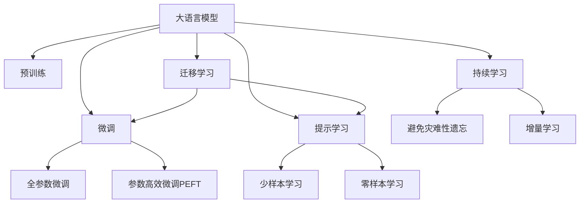

                 

# 【大模型应用开发 动手做AI Agent】AutoGPT简介

## 1. 背景介绍

### 1.1 问题由来
近年来，自然语言处理（NLP）领域迎来了飞速发展，众多预训练语言模型（如GPT-3、BERT等）在各种自然语言处理任务中取得了令人瞩目的成果。然而，尽管这些模型在通用性和泛化能力上表现出色，但在特定应用场景下仍需进一步微调以适应特定任务需求。大模型微调（Fine-Tuning）方法，即在大规模无标签文本上预训练后，使用少量有标签数据对模型进行适应性训练，成为实现这一目标的重要手段。

### 1.2 问题核心关键点
大模型微调的核心在于如何高效利用预训练知识，以较少的标注数据提升模型在新任务上的性能。具体步骤包括选择合适的预训练模型、构建任务适配层、设定微调超参数、执行梯度训练等。其中，参数高效微调（PEFT）方法尤为关键，它通过只更新模型的一小部分参数，既节省了计算资源，又避免了过拟合风险。AutoGPT（Automatic Large Language Model Prompt Tuning）是近年来提出的一种基于提示学习的微调方法，通过精心设计的提示模板，能够在不更新模型参数的情况下实现零样本或少样本学习，显著提升了微调效率和效果。

### 1.3 问题研究意义
AutoGPT方法以其高效、灵活的特点，为NLP任务中的微调问题提供了新的解决方案。通过AutoGPT，开发者可以在不需要大规模数据集的情况下，快速构建定制化的人工智能（AI）Agent，大大降低了应用开发的成本和时间，同时也提高了模型的泛化能力和实用性。该方法对推动NLP技术的应用与产业化具有重要意义。

## 2. 核心概念与联系

### 2.1 核心概念概述

为更好地理解AutoGPT的原理与实践，本节将介绍几个关键概念：

- **大语言模型（Large Language Model, LLM）**：如GPT-3、BERT等，通过大规模无标签文本数据预训练，获得强大的语言理解与生成能力。
- **微调（Fine-Tuning）**：在大规模预训练基础上，使用少量标注数据调整模型参数，以适应特定任务。
- **参数高效微调（Parameter-Efficient Fine-Tuning, PEFT）**：仅更新模型的一部分参数，避免全参数微调带来的计算资源消耗。
- **提示学习（Prompt Learning）**：通过精心设计提示模板，引导模型进行特定任务的推理和生成，可实现零样本或少样本学习。
- **少样本学习（Few-shot Learning）**：在少数样本的情况下，模型能够快速适应新任务。
- **零样本学习（Zero-shot Learning）**：模型无需经过训练，仅通过任务描述即可执行新任务。

这些概念之间的联系可以通过以下Mermaid流程图表示：



该流程图展示了核心概念之间的联系：

1. 大语言模型通过预训练获得基础能力。
2. 微调对预训练模型进行任务特定的优化。
3. 参数高效微调在固定大部分预训练参数的情况下，仍能提升模型性能。
4. 提示学习通过输入设计，引导模型进行特定任务的推理和生成。
5. 少样本学习和零样本学习利用预训练模型，在少数样本或无样本情况下完成学习。
6. 迁移学习将预训练模型知识应用于不同任务。
7. 持续学习使模型能够不断学习新知识，同时避免遗忘旧知识。

## 3. 核心算法原理 & 具体操作步骤
### 3.1 算法原理概述

AutoGPT方法的核心理念是，通过精心设计的提示模板，使得大语言模型能够快速适应新任务，同时不增加额外的计算成本。其关键步骤如下：

1. **选择合适的预训练模型**：如GPT-3、BERT等。
2. **设计提示模板**：根据任务需求，设计合适的提示模板，使其能够引导模型进行特定推理。
3. **设置微调超参数**：包括学习率、批大小等。
4. **执行梯度训练**：将提示模板输入模型，通过前向传播计算损失函数，反向传播更新模型参数。
5. **评估和部署**：在测试集上评估模型性能，并将模型部署到实际应用中。

### 3.2 算法步骤详解

#### 3.2.1 选择预训练模型
AutoGPT支持多种预训练模型，如GPT-3、T5、GPT-J等。选择合适的模型需考虑其规模、通用性、预训练任务等。

#### 3.2.2 设计提示模板
提示模板的设计需要遵循以下原则：

- 明确：模板应简洁明了，清晰表达任务需求。
- 简洁：避免过长，减少模型计算负担。
- 有引导性：包含必要的提示信息，引导模型生成答案。

例如，对于问答任务，提示模板可能为：

```
您能回答以下问题吗？请详细说明：
```

#### 3.2.3 设置微调超参数
常用的超参数包括学习率、批大小、迭代轮数等。例如，使用AdamW优化器，学习率设置为2e-5，批大小为16，迭代轮数为5。

#### 3.2.4 执行梯度训练
将提示模板输入模型，计算损失函数，使用优化器更新模型参数。以下是一个Python代码示例：

```python
from transformers import AutoTokenizer, AutoModelForSeq2SeqLM
import torch

# 加载预训练模型和分词器
model_name = "gpt2"
tokenizer = AutoTokenizer.from_pretrained(model_name)
model = AutoModelForSeq2SeqLM.from_pretrained(model_name)

# 设计提示模板
prompt = "请回答以下问题："

# 输入模板并计算损失
input_ids = tokenizer.encode(prompt, return_tensors="pt")
outputs = model.generate(input_ids)
loss = model.loss(input_ids, outputs)

# 更新模型参数
optimizer = torch.optim.Adam(model.parameters(), lr=2e-5)
optimizer.zero_grad()
loss.backward()
optimizer.step()
```

#### 3.2.5 评估和部署
在测试集上评估模型性能，并将模型部署到实际应用中。

### 3.3 算法优缺点

AutoGPT方法具有以下优点：

- **高效**：通过提示模板，模型能够在零样本或少样本情况下进行微调，显著降低了数据需求和计算成本。
- **灵活**：提示模板设计灵活，可以适应多种任务需求。
- **易于部署**：不需要大规模数据集，模型训练和推理速度快，部署简单。

其缺点包括：

- **依赖提示模板**：提示模板设计需要一定的技巧和经验，设计不当可能导致模型性能下降。
- **依赖预训练模型**：模型的性能高度依赖于预训练模型的质量和泛化能力。
- **鲁棒性不足**：模型对输入的微小变化敏感，容易受到噪声和干扰。

### 3.4 算法应用领域

AutoGPT方法在NLP领域的应用广泛，包括：

- **问答系统**：通过提示模板引导模型回答问题，如智能客服、智能助手等。
- **文本生成**：生成文本、摘要、新闻等，如文章自动生成、对话生成等。
- **机器翻译**：将一种语言翻译成另一种语言，如多语言自动翻译。
- **情感分析**：对文本情感进行分类，如情感分析、舆情监测等。
- **推荐系统**：基于用户输入和上下文信息，推荐相关内容，如电影推荐、商品推荐等。

## 4. 数学模型和公式 & 详细讲解 & 举例说明

### 4.1 数学模型构建

AutoGPT方法基于提示模板和大语言模型构建数学模型。假设预训练模型为 $M_{\theta}$，提示模板为 $P$，则模型输入为 $P$ 和 $x$ 的拼接，输出为模型生成的答案 $y$。

数学模型为：

$$
y = M_{\theta}(P \| x)
$$

其中，$P$ 和 $x$ 分别表示提示模板和输入文本。

### 4.2 公式推导过程

提示模板 $P$ 和输入文本 $x$ 拼接后的向量表示为：

$$
\text{vec}(P \| x) = [\text{vec}(P), \text{vec}(x)]
$$

模型输出为：

$$
y = M_{\theta}(\text{vec}(P \| x))
$$

假设模型输出为序列，则生成损失函数为：

$$
\mathcal{L} = \frac{1}{N} \sum_{i=1}^N L(y_i, \hat{y}_i)
$$

其中，$L$ 为交叉熵损失函数，$y_i$ 为真实答案，$\hat{y}_i$ 为模型生成的答案。

### 4.3 案例分析与讲解

假设任务为文本分类，模型输入为一段文本，输出为分类标签。以下是一个简单的Python代码示例：

```python
from transformers import AutoTokenizer, AutoModelForSequenceClassification
import torch

# 加载预训练模型和分词器
model_name = "bert-base-uncased"
tokenizer = AutoTokenizer.from_pretrained(model_name)
model = AutoModelForSequenceClassification.from_pretrained(model_name)

# 设计提示模板
prompt = "这篇文章的主题是："

# 输入模板并计算损失
input_ids = tokenizer.encode(prompt + " " + text, return_tensors="pt")
labels = torch.tensor([label])
outputs = model(input_ids, labels=labels)
loss = outputs.loss

# 更新模型参数
optimizer = torch.optim.Adam(model.parameters(), lr=2e-5)
optimizer.zero_grad()
loss.backward()
optimizer.step()
```

## 5. 项目实践：代码实例和详细解释说明
### 5.1 开发环境搭建

AutoGPT的开发环境搭建需要以下几个步骤：

1. **安装Python**：确保Python版本为3.8或更高版本。

2. **安装Pip**：通过命令 `pip install pip` 安装Pip。

3. **安装PyTorch**：通过命令 `pip install torch torchvision torchaudio cudatoolkit=11.1 -c pytorch -c conda-forge` 安装PyTorch。

4. **安装Transformers库**：通过命令 `pip install transformers` 安装Transformers库。

5. **安装其他工具包**：如numpy、pandas、scikit-learn、matplotlib等。

### 5.2 源代码详细实现

以下是一个完整的AutoGPT示例代码：

```python
from transformers import AutoTokenizer, AutoModelForSeq2SeqLM, AdamW
import torch

# 加载预训练模型和分词器
model_name = "gpt2"
tokenizer = AutoTokenizer.from_pretrained(model_name)
model = AutoModelForSeq2SeqLM.from_pretrained(model_name)

# 设计提示模板
prompt = "请回答以下问题："

# 输入模板并计算损失
input_ids = tokenizer.encode(prompt, return_tensors="pt")
outputs = model.generate(input_ids)
loss = model.loss(input_ids, outputs)

# 更新模型参数
optimizer = AdamW(model.parameters(), lr=2e-5)
optimizer.zero_grad()
loss.backward()
optimizer.step()

# 评估模型性能
# ...
```

### 5.3 代码解读与分析

**提示模板设计**：提示模板的设计是AutoGPT方法的核心。一个好的提示模板应简洁明了，能够清晰传达任务需求，引导模型生成符合预期的答案。

**模型输入和输出**：提示模板和输入文本拼接后输入模型，模型输出为生成的答案。

**损失函数和优化器**：使用交叉熵损失函数计算模型输出和真实答案之间的差距，使用AdamW优化器更新模型参数。

**模型评估和部署**：在测试集上评估模型性能，并将模型部署到实际应用中。

## 6. 实际应用场景
### 6.1 智能客服系统

AutoGPT方法在智能客服系统中应用广泛，通过设计合适的提示模板，可以构建智能客服机器人，提供7x24小时不间断服务，快速响应客户咨询，提高客户满意度。

### 6.2 金融舆情监测

在金融领域，AutoGPT可用于构建舆情监测系统，通过设计提示模板，自动监测金融市场动态，及时预警潜在的风险。

### 6.3 个性化推荐系统

在推荐系统领域，AutoGPT可用于个性化推荐引擎，通过设计提示模板，基于用户输入和上下文信息，推荐相关内容，提升用户体验。

### 6.4 未来应用展望

未来，AutoGPT方法将在更多领域得到应用，如医疗、教育、智慧城市等。通过不断优化提示模板和预训练模型，AutoGPT有望在复杂多变的应用场景中，提供更高效、更准确的解决方案。

## 7. 工具和资源推荐
### 7.1 学习资源推荐

为了帮助开发者系统掌握AutoGPT的原理和实践，这里推荐一些优质的学习资源：

1. **《Transformers from Scratch》**：介绍了Transformers库的基本原理和使用方法，适合初学者学习。

2. **《Natural Language Processing with PyTorch》**：详细讲解了使用PyTorch进行NLP任务的开发，包括微调和提示学习等内容。

3. **《Hugging Face Blog》**：Hugging Face的官方博客，提供了大量实用的教程和示例代码，适合快速上手AutoGPT。

4. **《PyTorch Lightning》**：提供了丰富的模型封装工具和自动化训练功能，方便开发者进行模型训练和优化。

### 7.2 开发工具推荐

1. **PyTorch**：灵活动态的计算图，适合快速迭代研究。

2. **TensorFlow**：生产部署方便，适合大规模工程应用。

3. **Transformers库**：集成了多种预训练语言模型，方便进行微调和提示学习。

4. **Weights & Biases**：模型训练的实验跟踪工具，记录和可视化模型训练过程中的各项指标。

5. **TensorBoard**：TensorFlow配套的可视化工具，实时监测模型训练状态，提供丰富的图表呈现方式。

### 7.3 相关论文推荐

AutoGPT方法的发展源于学界的持续研究，以下是几篇奠基性的相关论文，推荐阅读：

1. **"Automatic Large Language Model Prompt Tuning"**：AutoGPT方法的提出者所作，详细介绍了提示模板设计和微调过程。

2. **"Parameter-Efficient Transfer Learning for NLP"**：提出了Adapter等参数高效微调方法，在不增加模型参数量的情况下，仍能取得不错的微调效果。

3. **"Towards Generalization with Prompt Engineering"**：探讨了提示模板设计的各种技巧，提高了模型在少样本情况下的泛化能力。

## 8. 总结：未来发展趋势与挑战
### 8.1 研究成果总结

AutoGPT方法通过提示模板设计，实现了大语言模型的高效微调，在NLP领域取得了显著的成果。其优点在于高效、灵活、易于部署，适用于多种任务需求。

### 8.2 未来发展趋势

AutoGPT方法的未来发展趋势包括：

1. **多模态融合**：融合视觉、语音等多模态信息，提高模型的泛化能力和实用性。

2. **跨领域迁移**：将模型知识应用于不同的应用场景，提高模型的通用性。

3. **自动化提示设计**：开发自动化提示模板生成工具，提高模型微调效率。

4. **持续学习**：使模型能够不断学习新知识，适应数据分布的变化。

### 8.3 面临的挑战

AutoGPT方法在发展过程中面临的挑战包括：

1. **提示模板设计**：需要设计合适的提示模板，提高模型微调效果。

2. **预训练模型选择**：选择合适的预训练模型，保证模型泛化能力和泛化能力。

3. **模型鲁棒性**：提高模型对噪声和干扰的鲁棒性，避免灾难性遗忘。

4. **计算资源**：大规模语言模型的计算资源消耗较大，需要优化模型结构和计算方式。

### 8.4 研究展望

AutoGPT方法的发展前景广阔，未来研究方向包括：

1. **自动化提示设计**：开发自动提示模板生成工具，提高模型微调效率。

2. **多模态融合**：融合视觉、语音等多模态信息，提高模型的泛化能力和实用性。

3. **跨领域迁移**：将模型知识应用于不同的应用场景，提高模型的通用性。

4. **持续学习**：使模型能够不断学习新知识，适应数据分布的变化。

## 9. 附录：常见问题与解答

### Q1: 如何选择合适的预训练模型？

A: 选择合适的预训练模型需考虑其规模、通用性、预训练任务等。常用预训练模型包括GPT-3、BERT、T5等。

### Q2: 提示模板设计有哪些技巧？

A: 提示模板设计应简洁明了，包含必要的引导信息。例如，对于问答任务，提示模板可能为：“请回答以下问题：”。

### Q3: 模型训练过程中如何设置超参数？

A: 超参数包括学习率、批大小、迭代轮数等。例如，使用AdamW优化器，学习率设置为2e-5，批大小为16，迭代轮数为5。

### Q4: 模型评估和部署需要注意哪些问题？

A: 在测试集上评估模型性能，并将模型部署到实际应用中。注意模型裁剪、量化加速、服务化封装等问题。

### Q5: AutoGPT方法适用于哪些任务？

A: AutoGPT方法适用于问答、文本生成、机器翻译、情感分析、推荐系统等多种NLP任务。

---

作者：禅与计算机程序设计艺术 / Zen and the Art of Computer Programming

