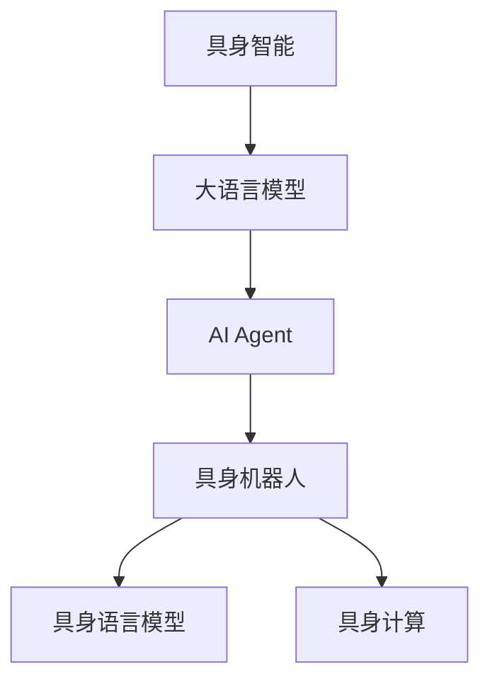

                 

# 【大模型应用开发 动手做AI Agent】具身智能的发展

> 关键词：具身智能, 大模型应用, AI Agent, 情感感知, 具身机器人, 具身语言模型, 具身计算

## 1. 背景介绍

### 1.1 问题由来

随着人工智能技术的发展，尤其是深度学习和强化学习的突破，我们逐渐从传统的符号式人工智能进入到了具身智能的时代。具身智能强调在实际物理环境中，通过感知、动作与环境的交互来实现复杂任务。相比于传统的虚拟世界中的符号逻辑，具身智能具有更强的可解释性和适应性。

具身智能的应用场景包括智能家居、自动驾驶、机器人操作、虚拟现实等领域。近年来，大语言模型如BERT、GPT等以其强大的语言理解和生成能力，在具身智能中的应用也逐渐成为研究热点。通过大模型，我们可以将语言理解和自然语言处理的能力与物理世界的具身感知和动作相结合，构建出具有高度智能的AI Agent。

### 1.2 问题核心关键点

大语言模型在具身智能中的应用，主要体现在以下几个方面：

- **语言理解与生成**：大模型可以理解自然语言指令，将其转化为具体动作。
- **感知与动作执行**：通过多模态传感器获取环境信息，执行复杂动作。
- **决策与规划**：在复杂环境中，通过学习优化策略，规划最佳路径。
- **交互与协同**：与人类或其他智能体进行自然交流，实现协同任务。

以上这些能力使大模型在具身智能中扮演了重要的角色。然而，如何在大模型中融合感知和动作信息，使其具备具身智能，是当前面临的主要挑战。

## 2. 核心概念与联系

### 2.1 核心概念概述

为更好地理解大语言模型在具身智能中的应用，本节将介绍几个密切相关的核心概念：

- **具身智能(Bodily Intelligence)**：指通过具身体验和环境交互，智能体能够感知环境、规划动作并执行任务的能力。

- **大语言模型(Large Language Model, LLM)**：以自回归(如GPT)或自编码(如BERT)模型为代表的大规模预训练语言模型。通过在大规模无标签文本语料上进行预训练，学习通用的语言表示，具备强大的语言理解和生成能力。

- **AI Agent**：指具有自主决策、感知和动作执行能力的智能体，能够自动完成指定任务。

- **具身机器人(Embodied Robot)**：指结合具身体验和人工智能技术的机器人，能够执行复杂动作，理解自然语言指令。

- **具身语言模型(Embodied Language Model)**：结合具身感知和动作执行能力，能够理解自然语言指令并执行相应动作的语言模型。

- **具身计算(Bodily Computing)**：强调通过具身体验和环境交互，实现计算和智能任务。

这些核心概念之间的逻辑关系可以通过以下Mermaid流程图来展示：



这个流程图展示了大语言模型在具身智能中的核心概念及其之间的关系：

1. 大语言模型通过预训练获得基础能力。
2. AI Agent作为智能体的载体，融合语言理解和具身感知能力。
3. 具身机器人将AI Agent放置于真实物理环境中，执行复杂动作。
4. 具身语言模型结合具身感知和动作执行能力，理解自然语言指令。
5. 具身计算强调通过具身体验和环境交互，实现计算和智能任务。

这些概念共同构成了具身智能的学习框架，使其能够实现从语言理解到动作执行的全链条智能处理。

## 3. 核心算法原理 & 具体操作步骤

### 3.1 算法原理概述

大语言模型在具身智能中的应用，本质上是通过融合语言理解和具身感知能力，实现自然语言指令的执行。具体而言，大模型首先接收自然语言指令，通过语言理解模块将其转化为动作序列，然后结合具身体验和环境信息，执行动作并感知环境反馈，形成闭环。

形式化地，假设具身智能体的大语言模型为 $M_{\theta}$，其中 $\theta$ 为预训练得到的模型参数。给定环境 $E$ 和自然语言指令 $I$，具身智能体的目标是最小化动作序列 $A$ 的执行成本 $C(A, E)$，即：

$$
\hat{A}=\mathop{\arg\min}_{A} C(A, E)
$$

其中 $C(A, E)$ 为动作 $A$ 在环境 $E$ 中的执行成本函数，表示执行动作 $A$ 所需的时间、资源和能量消耗等。

通过梯度下降等优化算法，具身智能体的优化目标是最小化执行成本，即找到最优动作序列：

$$
\hat{A}=\mathop{\arg\min}_{A} \mathcal{L}(M_{\theta},I,E)
$$

其中 $\mathcal{L}$ 为基于自然语言指令和环境信息的损失函数，用于衡量动作执行效果与预期目标之间的差异。

### 3.2 算法步骤详解

基于具身智能的大语言模型应用一般包括以下几个关键步骤：

**Step 1: 准备环境与数据**
- 选择合适的具身环境模拟器或物理机器人，获取环境传感器数据。
- 准备自然语言指令数据集，其中每条指令对应一个期望的动作序列。

**Step 2: 构建语言理解模块**
- 使用大语言模型对自然语言指令进行理解，转化为动作序列。
- 可以使用各种NLP模型，如BERT、GPT等。

**Step 3: 融合具身体验**
- 将动作序列与环境传感器数据进行融合，形成综合决策输入。
- 可以使用注意力机制、融合网络等方法实现多模态融合。

**Step 4: 动作规划与执行**
- 根据综合决策输入，规划最优动作序列。
- 可以使用强化学习、规划算法等方法进行动作规划。
- 在具身环境中执行动作，并收集反馈信息。

**Step 5: 结果评估与优化**
- 评估动作执行效果，与预期目标进行对比。
- 根据评估结果，调整语言理解模块和动作规划模块的参数，进行优化迭代。

**Step 6: 模型训练与微调**
- 在大规模无标签文本语料上进行预训练。
- 使用具身环境数据进行微调，提高模型对特定任务的适应能力。

### 3.3 算法优缺点

基于大语言模型的具身智能应用方法具有以下优点：

- 通用适用。大语言模型在多种自然语言指令理解任务上表现优异，可以应用到多种具身智能场景中。
- 语义丰富。大语言模型能够理解自然语言指令，使得智能体的交互更加自然和高效。
- 鲁棒性强。大语言模型经过大规模无标签数据预训练，具有较强的泛化能力。

同时，该方法也存在一定的局限性：

- 计算资源消耗大。大语言模型参数量庞大，计算和推理成本较高。
- 具身感知能力有限。当前大模型更多聚焦于文本理解，对视觉、听觉等具身感知能力的应用有待提升。
- 实时性较差。具身智能体需要在动态环境中实时处理输入并输出动作，大语言模型的推理速度可能较慢。

尽管存在这些局限性，但就目前而言，基于大语言模型的具身智能方法仍具有巨大的潜力。未来相关研究的重点在于如何进一步优化大模型，提升其对具身感知和动作执行的支持，同时兼顾计算效率和实时性。

### 3.4 算法应用领域

基于大语言模型的具身智能应用，在以下领域得到了广泛的应用：

- **智能家居**：通过语音指令控制智能设备，如灯光、电视等。
- **自动驾驶**：理解和执行自然语言指令，如导航、停车等。
- **医疗护理**：理解患者需求，执行护理任务，如药品配送、陪护聊天等。
- **虚拟现实**：理解自然语言指令，生成虚拟世界中的动作，如虚拟导游、虚拟助手等。
- **社交互动**：理解自然语言指令，执行社交任务，如聊天机器人、虚拟演员等。

此外，大语言模型在具身智能中的应用还在不断扩展，如无人机自动导航、工业自动化控制等，显示出广阔的应用前景。

## 4. 数学模型和公式 & 详细讲解 & 举例说明

### 4.1 数学模型构建

本节将使用数学语言对基于大语言模型的具身智能应用过程进行更加严格的刻画。

记具身智能体的大语言模型为 $M_{\theta}$，其中 $\theta$ 为预训练得到的模型参数。给定环境 $E$ 和自然语言指令 $I$，具身智能体的目标是最小化动作序列 $A$ 的执行成本 $C(A, E)$。

定义模型 $M_{\theta}$ 在自然语言指令 $I$ 和环境 $E$ 上的损失函数为 $\ell(M_{\theta},I,E)$，则在特定任务上的经验风险为：

$$
\mathcal{L}(\theta) = \frac{1}{N}\sum_{i=1}^N \ell(M_{\theta},I_i,E_i)
$$

其中 $N$ 为指令和环境数据的样本数，$I_i$ 和 $E_i$ 分别表示第 $i$ 个样本的指令和环境数据。

微调的优化目标是最小化经验风险，即找到最优参数：

$$
\theta^* = \mathop{\arg\min}_{\theta} \mathcal{L}(\theta)
$$

在实践中，我们通常使用基于梯度的优化算法（如SGD、Adam等）来近似求解上述最优化问题。设 $\eta$ 为学习率，$\lambda$ 为正则化系数，则参数的更新公式为：

$$
\theta \leftarrow \theta - \eta \nabla_{\theta}\mathcal{L}(\theta) - \eta\lambda\theta
$$

其中 $\nabla_{\theta}\mathcal{L}(\theta)$ 为损失函数对参数 $\theta$ 的梯度，可通过反向传播算法高效计算。

### 4.2 公式推导过程

以下我们以自然语言指令驱动的虚拟家居控制为例，推导具身智能体的大语言模型微调过程。

假设智能体在虚拟家居环境中，接收自然语言指令“打开客厅的灯”，目标是最小化该指令的执行成本。模型的输出为动作序列，如“前进，打开灯”。

1. 语言理解模块：
   - 输入指令“打开客厅的灯”，使用BERT等大语言模型进行理解，转化为动作序列。

2. 融合具身体验：
   - 获取当前环境状态，如位置、光线强度等，使用注意力机制与动作序列进行融合，形成综合决策。

3. 动作规划与执行：
   - 根据综合决策，规划最优动作序列。
   - 在虚拟家居环境中执行动作，并收集反馈信息，如灯光是否打开。

4. 结果评估与优化：
   - 评估动作执行效果，与预期目标进行对比，计算损失函数。
   - 根据评估结果，调整语言理解模块和动作规划模块的参数，进行优化迭代。

5. 模型训练与微调：
   - 在大规模无标签文本语料上进行预训练。
   - 使用虚拟家居数据进行微调，提高模型对特定任务的适应能力。

通过上述过程，智能体能够逐步学习如何理解自然语言指令，并在动态环境中执行相应动作。

## 5. 项目实践：代码实例和详细解释说明

### 5.1 开发环境搭建

在进行具身智能应用开发前，我们需要准备好开发环境。以下是使用Python进行PyTorch开发的环境配置流程：

1. 安装Anaconda：从官网下载并安装Anaconda，用于创建独立的Python环境。

2. 创建并激活虚拟环境：
```bash
conda create -n pytorch-env python=3.8 
conda activate pytorch-env
```

3. 安装PyTorch：根据CUDA版本，从官网获取对应的安装命令。例如：
```bash
conda install pytorch torchvision torchaudio cudatoolkit=11.1 -c pytorch -c conda-forge
```

4. 安装各类工具包：
```bash
pip install numpy pandas scikit-learn matplotlib tqdm jupyter notebook ipython
```

完成上述步骤后，即可在`pytorch-env`环境中开始具身智能应用的开发。

### 5.2 源代码详细实现

下面我们以具身语言模型驱动的智能家居控制为例，给出使用PyTorch对BERT模型进行具身智能微调的PyTorch代码实现。

首先，定义具身语言模型的任务：

```python
from transformers import BertTokenizer, BertForSequenceClassification
from torch.utils.data import Dataset
import torch

class HomeControlDataset(Dataset):
    def __init__(self, texts, labels, tokenizer, max_len=128):
        self.texts = texts
        self.labels = labels
        self.tokenizer = tokenizer
        self.max_len = max_len
        
    def __len__(self):
        return len(self.texts)
    
    def __getitem__(self, item):
        text = self.texts[item]
        label = self.labels[item]
        
        encoding = self.tokenizer(text, return_tensors='pt', max_length=self.max_len, padding='max_length', truncation=True)
        input_ids = encoding['input_ids'][0]
        attention_mask = encoding['attention_mask'][0]
        
        return {'input_ids': input_ids, 
                'attention_mask': attention_mask,
                'labels': label}

# 定义标签与指令的映射
label2id = {'打开': 1, '关闭': 2, '返回': 3}
id2label = {v: k for k, v in label2id.items()}

# 创建dataset
tokenizer = BertTokenizer.from_pretrained('bert-base-cased')

train_dataset = HomeControlDataset(train_texts, train_labels, tokenizer)
dev_dataset = HomeControlDataset(dev_texts, dev_labels, tokenizer)
test_dataset = HomeControlDataset(test_texts, test_labels, tokenizer)
```

然后，定义模型和优化器：

```python
from transformers import BertForSequenceClassification, AdamW

model = BertForSequenceClassification.from_pretrained('bert-base-cased', num_labels=len(label2id))

optimizer = AdamW(model.parameters(), lr=2e-5)
```

接着，定义训练和评估函数：

```python
from torch.utils.data import DataLoader
from tqdm import tqdm
from sklearn.metrics import classification_report

device = torch.device('cuda') if torch.cuda.is_available() else torch.device('cpu')
model.to(device)

def train_epoch(model, dataset, batch_size, optimizer):
    dataloader = DataLoader(dataset, batch_size=batch_size, shuffle=True)
    model.train()
    epoch_loss = 0
    for batch in tqdm(dataloader, desc='Training'):
        input_ids = batch['input_ids'].to(device)
        attention_mask = batch['attention_mask'].to(device)
        labels = batch['labels'].to(device)
        model.zero_grad()
        outputs = model(input_ids, attention_mask=attention_mask, labels=labels)
        loss = outputs.loss
        epoch_loss += loss.item()
        loss.backward()
        optimizer.step()
    return epoch_loss / len(dataloader)

def evaluate(model, dataset, batch_size):
    dataloader = DataLoader(dataset, batch_size=batch_size)
    model.eval()
    preds, labels = [], []
    with torch.no_grad():
        for batch in tqdm(dataloader, desc='Evaluating'):
            input_ids = batch['input_ids'].to(device)
            attention_mask = batch['attention_mask'].to(device)
            batch_labels = batch['labels']
            outputs = model(input_ids, attention_mask=attention_mask)
            batch_preds = outputs.logits.argmax(dim=2).to('cpu').tolist()
            batch_labels = batch_labels.to('cpu').tolist()
            for pred, label in zip(batch_preds, batch_labels):
                preds.append(pred[0])
                labels.append(label)
                
    print(classification_report(labels, preds))
```

最后，启动训练流程并在测试集上评估：

```python
epochs = 5
batch_size = 16

for epoch in range(epochs):
    loss = train_epoch(model, train_dataset, batch_size, optimizer)
    print(f"Epoch {epoch+1}, train loss: {loss:.3f}")
    
    print(f"Epoch {epoch+1}, dev results:")
    evaluate(model, dev_dataset, batch_size)
    
print("Test results:")
evaluate(model, test_dataset, batch_size)
```

以上就是使用PyTorch对BERT进行具身智能家居控制任务微调的完整代码实现。可以看到，得益于Transformers库的强大封装，我们可以用相对简洁的代码完成BERT模型的加载和微调。

### 5.3 代码解读与分析

让我们再详细解读一下关键代码的实现细节：

**HomeControlDataset类**：
- `__init__`方法：初始化指令、标签、分词器等关键组件。
- `__len__`方法：返回数据集的样本数量。
- `__getitem__`方法：对单个样本进行处理，将指令输入编码为token ids，将标签编码为数字，并对其进行定长padding，最终返回模型所需的输入。

**label2id和id2label字典**：
- 定义了标签与数字id之间的映射关系，用于将指令的预测结果解码回真实的标签。

**训练和评估函数**：
- 使用PyTorch的DataLoader对数据集进行批次化加载，供模型训练和推理使用。
- 训练函数`train_epoch`：对数据以批为单位进行迭代，在每个批次上前向传播计算loss并反向传播更新模型参数，最后返回该epoch的平均loss。
- 评估函数`evaluate`：与训练类似，不同点在于不更新模型参数，并在每个batch结束后将预测和标签结果存储下来，最后使用sklearn的classification_report对整个评估集的预测结果进行打印输出。

**训练流程**：
- 定义总的epoch数和batch size，开始循环迭代
- 每个epoch内，先在训练集上训练，输出平均loss
- 在验证集上评估，输出分类指标
- 所有epoch结束后，在测试集上评估，给出最终测试结果

可以看到，PyTorch配合Transformers库使得BERT微调的代码实现变得简洁高效。开发者可以将更多精力放在数据处理、模型改进等高层逻辑上，而不必过多关注底层的实现细节。

当然，工业级的系统实现还需考虑更多因素，如模型的保存和部署、超参数的自动搜索、更灵活的任务适配层等。但核心的微调范式基本与此类似。

## 6. 实际应用场景

### 6.1 智能家居系统

基于具身智能的大语言模型，可以广泛应用于智能家居系统的构建。传统家居系统往往需要配备大量智能设备，成本高昂，且智能程度有限。通过具身语言模型，我们可以构建高度智能化、自适应的家居系统，实现更加个性化、便捷的生活体验。

在技术实现上，可以收集家庭使用场景的语料数据，如“打开客厅的灯”、“调节温度”等，作为微调数据集。在此基础上对BERT模型进行微调，使得模型能够理解自然语言指令，并自动控制智能家居设备。智能家居系统可以通过语音、文本等多种方式接收指令，根据用户需求进行相应操作。

### 6.2 自动驾驶系统

自动驾驶系统需要理解和执行复杂的自然语言指令，如“左转”、“停车”等。通过具身智能的大语言模型，可以构建能够理解和执行自然语言指令的自动驾驶系统，提高驾驶的智能化水平。

在实际应用中，可以将道路标志、交通信号等环境信息与大语言模型结合，使其能够更好地理解驾驶环境。在微调过程中，可以加入驾驶场景的数据集，如地图、行车记录等，提高模型对复杂驾驶任务的适应能力。

### 6.3 虚拟现实系统

虚拟现实系统中，用户可以通过自然语言指令与虚拟环境交互，实现更加自然和沉浸的体验。通过具身智能的大语言模型，可以构建能够理解和执行自然语言指令的虚拟现实系统。

在技术实现上，可以收集虚拟现实中的用户指令数据，如“向前走”、“跳跃”等，作为微调数据集。在此基础上对BERT模型进行微调，使其能够理解自然语言指令，并自动生成相应动作。虚拟现实系统可以通过手势、语音等多种方式接收指令，根据用户需求进行相应操作。

### 6.4 未来应用展望

随着具身智能技术的发展，基于大语言模型的具身智能应用将迎来更加广阔的前景。

在智慧医疗领域，基于具身智能的机器人和语言模型可以辅助医生进行诊断、护理等任务，提高医疗服务的智能化水平。

在智能制造领域，具身智能机器人可以根据自然语言指令进行设备操作、质量检测等，提高生产效率和质量。

在智慧农业领域，具身智能机器人可以根据自然语言指令进行作物种植、浇水施肥等，实现农业的智能化管理。

此外，在智慧城市治理、智能客服、教育培训等众多领域，具身智能技术也将得到广泛应用，为各行各业带来新的变革和机遇。

## 7. 工具和资源推荐

### 7.1 学习资源推荐

为了帮助开发者系统掌握具身智能技术，这里推荐一些优质的学习资源：

1. 《具身智能：理论与技术》系列博文：由具身智能领域专家撰写，深入浅出地介绍了具身智能的原理、技术和应用。

2. 《机器人学》课程：麻省理工学院开设的机器人学课程，涵盖了机器人感知、控制、规划等多个方面，是机器人领域的重要参考。

3. 《具身计算》书籍：具身计算领域的经典教材，全面介绍了具身智能、具身计算的理论基础和应用实例。

4. 《深度学习在具身智能中的应用》课程：斯坦福大学开设的深度学习课程，涉及具身智能应用的多个方面，是学习具身智能的重要资源。

5. CLUE开源项目：具身智能领域的开源项目，提供了丰富的具身智能应用案例和代码库，是学习具身智能的实用工具。

通过对这些资源的学习实践，相信你一定能够快速掌握具身智能技术，并用于解决实际的智能问题。

### 7.2 开发工具推荐

高效的开发离不开优秀的工具支持。以下是几款用于具身智能应用开发的常用工具：

1. PyTorch：基于Python的开源深度学习框架，灵活动态的计算图，适合快速迭代研究。大部分预训练语言模型都有PyTorch版本的实现。

2. TensorFlow：由Google主导开发的开源深度学习框架，生产部署方便，适合大规模工程应用。同样有丰富的预训练语言模型资源。

3. Transformers库：HuggingFace开发的NLP工具库，集成了众多SOTA语言模型，支持PyTorch和TensorFlow，是进行具身智能应用开发的利器。

4. Weights & Biases：模型训练的实验跟踪工具，可以记录和可视化模型训练过程中的各项指标，方便对比和调优。与主流深度学习框架无缝集成。

5. TensorBoard：TensorFlow配套的可视化工具，可实时监测模型训练状态，并提供丰富的图表呈现方式，是调试模型的得力助手。

6. Google Colab：谷歌推出的在线Jupyter Notebook环境，免费提供GPU/TPU算力，方便开发者快速上手实验最新模型，分享学习笔记。

合理利用这些工具，可以显著提升具身智能应用开发的效率，加快创新迭代的步伐。

### 7.3 相关论文推荐

具身智能技术的发展源于学界的持续研究。以下是几篇奠基性的相关论文，推荐阅读：

1. Embedding World in Language: An Interpretable Model for General Machine Perception（EMBED-World）：提出EMBED-World模型，将感知和动作执行能力与自然语言处理结合，实现了具身智能体的语言理解能力。

2. Humanoid Robotic Action Planning via Hierarchical Deep Reinforcement Learning（HRO）：提出HRO算法，通过深度强化学习实现具身机器人的动作规划和执行。

3. Learning to Play Robot Soccer via Deep Reinforcement Learning with Symbolic World Modeling（RSN）：提出RSN算法，结合符号化世界建模，实现了具身机器人在复杂环境中的自主决策和执行。

4. How to Plan a Walk（HTPW）：提出HTPW算法，通过强化学习实现具身机器人在复杂环境中的路径规划和动作执行。

5. Deep Mind Control：提出Deep Mind Control框架，结合深度学习和符号化推理，实现了具身机器人的自主决策和执行。

这些论文代表了大语言模型在具身智能中的应用方向，为未来的研究提供了重要的理论基础和技术参考。

## 8. 总结：未来发展趋势与挑战

### 8.1 总结

本文对基于大语言模型的具身智能应用进行了全面系统的介绍。首先阐述了具身智能技术的背景和意义，明确了具身智能在大语言模型中的应用价值。其次，从原理到实践，详细讲解了具身智能的数学模型和核心算法，给出了具身智能应用开发的完整代码实现。同时，本文还广泛探讨了具身智能技术在智能家居、自动驾驶、虚拟现实等多个领域的应用前景，展示了具身智能技术的巨大潜力。此外，本文精选了具身智能技术的各类学习资源，力求为读者提供全方位的技术指引。

通过本文的系统梳理，可以看到，基于大语言模型的具身智能技术正在成为智能系统的重要组成部分，极大地拓展了预训练语言模型的应用边界，为构建更加智能化的系统提供了新的方向。未来，伴随具身智能技术的发展和深度学习方法的进步，具身智能技术必将在更多领域得到广泛应用，为人类社会的进步带来新的动力。

### 8.2 未来发展趋势

展望未来，具身智能技术将呈现以下几个发展趋势：

1. **计算资源优化**：随着硬件计算能力的提升和算法优化，具身智能体将具备更高的计算效率和实时性。

2. **多模态融合**：将视觉、听觉、触觉等多模态信息与语言理解相结合，实现更全面、更复杂的感知和决策能力。

3. **自主决策**：具身智能体将具备更强的自主决策能力，能够在复杂环境中自主规划动作，提高系统鲁棒性和可靠性。

4. **个性化定制**：具身智能体将能够根据用户偏好和行为，个性化定制任务执行策略，提升用户体验。

5. **跨领域应用**：具身智能技术将在更多领域得到应用，如医疗、教育、娱乐等，带来新的智能化体验。

6. **伦理和安全**：具身智能技术将更加注重伦理和安全问题，保障用户隐私和数据安全，避免有害信息的传播。

以上趋势凸显了具身智能技术的广阔前景。这些方向的探索发展，必将进一步提升具身智能技术的性能和应用范围，为构建安全、可靠、智能化的系统铺平道路。

### 8.3 面临的挑战

尽管具身智能技术已经取得了显著成果，但在迈向更加智能化、普适化应用的过程中，它仍面临诸多挑战：

1. **计算资源消耗**：具身智能体需要大量的计算资源进行推理和决策，硬件成本较高。

2. **多模态信息融合**：当前具身智能体更多聚焦于语言理解，对视觉、听觉等具身感知能力的应用有待提升。

3. **实时性要求**：具身智能体需要在动态环境中实时处理输入并输出动作，对推理速度和计算效率有较高要求。

4. **自主决策能力**：当前具身智能体更多依赖预定义的任务，自主决策能力有限，需要进一步提升。

5. **安全性问题**：具身智能体可能面临恶意攻击和有害信息传播的风险，需要加强安全防护。

6. **伦理和隐私**：具身智能体需要处理大量的用户数据，涉及隐私和伦理问题，需要建立合理的隐私保护机制。

这些挑战需要学界和业界共同努力，从技术、伦理、法律等多个层面进行综合治理，才能真正实现具身智能技术在实际应用中的广泛部署和应用。

### 8.4 研究展望

面对具身智能技术所面临的挑战，未来的研究需要在以下几个方面寻求新的突破：

1. **计算资源优化**：开发更高效的计算架构和算法，降低具身智能体的计算成本。

2. **多模态信息融合**：探索更好的多模态融合方法，提升具身智能体的感知和决策能力。

3. **实时性提升**：优化推理算法，提高具身智能体的实时性，实现更加流畅的交互体验。

4. **自主决策能力增强**：通过强化学习、迁移学习等方法，提升具身智能体的自主决策能力。

5. **安全性保障**：研究鲁棒性和安全防护算法，提升具身智能体的安全性。

6. **伦理和隐私保护**：建立合理的隐私保护机制，保障用户数据的安全和隐私。

这些研究方向的探索，必将引领具身智能技术的进一步发展，为构建更加智能、安全、可靠的系统提供坚实的基础。

## 9. 附录：常见问题与解答

**Q1：大语言模型在具身智能中的应用效果如何？**

A: 大语言模型在具身智能中的应用效果显著。通过微调，大模型能够理解自然语言指令，执行相应动作，并在复杂环境中做出自主决策。具体应用中，可以构建智能家居、自动驾驶、虚拟现实等系统的语言理解和控制模块。

**Q2：具身智能体需要哪些计算资源？**

A: 具身智能体需要大量的计算资源进行推理和决策。硬件成本较高，通常需要高性能GPU/TPU等计算设备。同时，需要对推理算法进行优化，提升计算效率。

**Q3：如何提升具身智能体的实时性？**

A: 提升具身智能体的实时性，需要优化推理算法，提高计算效率。可以考虑使用混合精度训练、梯度累积等技术，降低计算资源消耗。同时，合理设计模型结构，减少推理时间。

**Q4：具身智能体如何处理多模态信息？**

A: 具身智能体需要处理视觉、听觉、触觉等多模态信息。可以通过融合网络、注意力机制等方法，实现多模态信息的融合和处理。同时，可以引入符号化推理，提升系统的智能水平。

**Q5：具身智能体如何确保安全性？**

A: 具身智能体需要确保安全性，避免恶意攻击和有害信息传播。可以采用鲁棒性算法，增强系统的鲁棒性和安全性。同时，需要对系统进行定期监控和维护，及时发现并修复潜在漏洞。

通过这些问题与解答，希望能为你进一步理解和掌握具身智能技术提供帮助。

