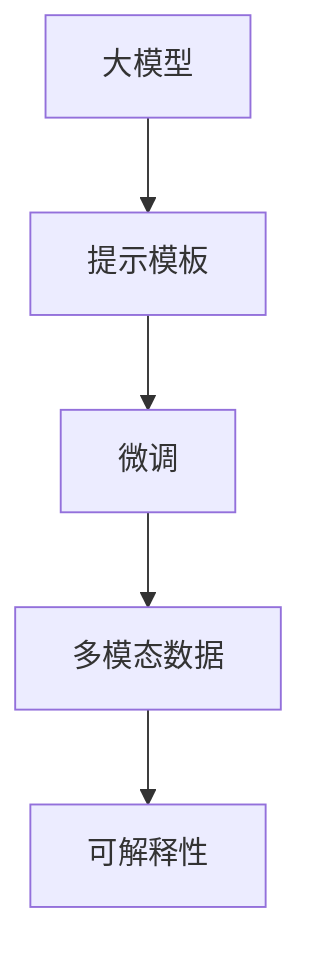

                 

# 【大模型应用开发 动手做AI Agent】基于ReAct框架的提示

> 关键词：大模型应用开发,ReAct框架,提示学习,自然语言处理(NLP),AI Agent,深度学习,开源项目,代码示例,可解释性,自然语言理解(NLU),对话系统,多模态数据,可解释性,跨领域迁移,智能推荐系统,情感分析

## 1. 背景介绍

### 1.1 问题由来

随着人工智能技术的快速发展，大模型在自然语言处理(NLP)领域取得了显著的进展。预训练语言模型，如GPT、BERT等，通过在大规模语料上进行自监督训练，学习到了丰富的语言知识和表征。这些模型广泛应用于文本分类、情感分析、机器翻译、对话系统等NLP任务，并在许多情况下取得了最先进的性能。然而，对于特定领域或场景，通用大模型的表现往往不尽人意，需要进一步的微调或调整才能达到最佳效果。

基于此，我们需要一种高效、灵活的框架来开发和部署个性化的AI Agent，即人工智能代理人。这些Agent需要能够根据特定任务或环境动态调整其行为，以提供最合适的服务。这正是ReAct框架的核心思想：利用大模型作为基础，通过灵活的配置和训练方式，构建适用于特定场景的AI Agent。

### 1.2 问题核心关键点

ReAct框架通过提示学习(Prompt Learning)技术，允许开发者在输入数据中添加特定的提示模板(Prompt Template)，以引导模型输出期望的输出。这种技术不仅可以提升模型的性能，还可以在不修改模型参数的情况下，实现少样本学习甚至零样本学习。

ReAct框架的关键点包括：

- **提示模板设计**：提示模板的设计是提示学习的核心，决定了模型输出的方向和质量。
- **微调与微调后模型评估**：微调过程包括模型训练和评估，确保模型在特定任务上表现最佳。
- **多模态数据融合**：ReAct框架支持融合视觉、听觉等多模态数据，提高AI Agent的理解能力。
- **可解释性增强**：通过记录和分析模型推理过程，提高模型的可解释性。

### 1.3 问题研究意义

ReAct框架的应用意义在于：

- **提升模型性能**：通过提示学习，模型可以在特定领域或场景下快速适应，提供高质量的输出。
- **降低开发成本**：使用大模型作为基础，减少了从头训练模型的需要，节省了时间和资源。
- **增强可解释性**：通过记录和分析模型推理过程，提高了AI Agent的可解释性，增强了用户信任。
- **支持多模态数据**：ReAct框架支持多模态数据融合，扩大了AI Agent的应用场景。

## 2. 核心概念与联系

### 2.1 核心概念概述

ReAct框架的核心概念包括：

- **大模型**：如GPT、BERT等，预训练语言模型作为基础。
- **提示模板**：用于引导模型输出的特定输入格式，如自然语言描述。
- **微调**：在特定任务上对模型进行优化，提高其在特定场景下的性能。
- **多模态数据**：融合视觉、听觉等多源数据，提高AI Agent的理解和处理能力。
- **可解释性**：通过记录和分析模型推理过程，提高模型的透明性和可解释性。

### 2.2 核心概念原理和架构的 Mermaid 流程图



这个流程图展示了ReAct框架的核心概念及其之间的关系：

1. 大模型作为基础，提供语言理解和生成能力。
2. 提示模板引导模型输出，实现特定任务下的高效学习。
3. 微调过程优化模型参数，使其适应特定任务。
4. 多模态数据融合，增强AI Agent的理解和处理能力。
5. 可解释性记录和分析模型推理过程，提高透明度。

这些概念共同构成了ReAct框架的完整体系，使得开发者能够灵活地构建适用于特定场景的AI Agent。

## 3. 核心算法原理 & 具体操作步骤

### 3.1 算法原理概述

ReAct框架基于提示学习技术，通过在输入数据中添加特定的提示模板，引导模型输出期望的输出。这种技术不需要修改模型参数，可以在小样本条件下实现高效的微调。

提示模板由特定的自然语言描述构成，描述了模型的预期输出。在输入模型时，提示模板会被自动解析和应用，引导模型输出正确的结果。

ReAct框架的微调过程包括以下几个步骤：

1. **提示模板设计**：根据任务需求设计提示模板，描述模型的预期输出。
2. **模型加载与初始化**：加载预训练模型，并初始化模型参数。
3. **提示输入与模型推理**：将提示模板输入模型，进行推理计算。
4. **输出解析与结果优化**：解析模型输出，根据任务需求进行优化。
5. **评估与反馈**：在特定任务上进行评估，根据评估结果调整提示模板和微调参数。

### 3.2 算法步骤详解

以下详细讲解ReAct框架的微调步骤：

**Step 1: 提示模板设计**

提示模板的设计是ReAct框架的核心。提示模板需要明确描述模型的预期输出，例如：

- 对于文本分类任务，提示模板可以是“请将以下文本分类为情感类别：[文本]”。
- 对于问答系统，提示模板可以是“请回答以下问题：[问题]”。

**Step 2: 模型加载与初始化**

使用ReAct框架，需要先加载预训练模型，并初始化模型参数。例如：

```python
from react import React

model = React.load_pretrained('gpt3', 'gpt3-base')
```

**Step 3: 提示输入与模型推理**

将提示模板输入模型，进行推理计算。例如：

```python
prompt = "请将以下文本分类为情感类别：非常高兴"
inputs = React.build_prompt(prompt)
outputs = model(inputs)
```

**Step 4: 输出解析与结果优化**

解析模型输出，根据任务需求进行优化。例如：

```python
labels = React.parse_outputs(outputs)
result = React.optimize_results(labels)
```

**Step 5: 评估与反馈**

在特定任务上进行评估，根据评估结果调整提示模板和微调参数。例如：

```python
result = React.evaluate_result(result)
```

### 3.3 算法优缺点

ReAct框架的优点包括：

- **高效微调**：提示学习技术可以在小样本条件下实现高效的微调，无需修改模型参数。
- **灵活应用**：提示模板的设计非常灵活，可以根据任务需求进行定制。
- **可解释性**：通过记录和分析模型推理过程，提高模型的透明性和可解释性。

缺点包括：

- **依赖提示模板**：提示模板的设计需要专业知识，对于复杂任务可能需要大量尝试。
- **可解释性不足**：提示学习技术虽然提高了可解释性，但对于某些复杂推理过程仍然难以解释。

### 3.4 算法应用领域

ReAct框架在多个领域都有广泛的应用，包括：

- **情感分析**：通过设计提示模板，引导模型分析文本情感。
- **问答系统**：通过提示模板，引导模型回答用户问题。
- **智能推荐系统**：通过融合多模态数据，构建更智能的推荐引擎。
- **对话系统**：通过提示模板和上下文信息，构建更自然流畅的对话。

## 4. 数学模型和公式 & 详细讲解 & 举例说明

### 4.1 数学模型构建

ReAct框架的数学模型构建主要涉及提示模板的设计和模型的推理过程。

提示模板的设计可以形式化为：

$$
T = \{p_1, p_2, ..., p_n\}
$$

其中，$p_i$ 表示第 $i$ 个提示模板。模型推理过程可以形式化为：

$$
O = M(T)
$$

其中，$O$ 表示模型的输出，$M$ 表示模型函数，$T$ 表示输入的提示模板。

### 4.2 公式推导过程

提示模板的解析过程可以形式化为：

$$
P = T \rightarrow S
$$

其中，$P$ 表示解析后的提示信息，$S$ 表示解析后的提示结构。模型的推理过程可以形式化为：

$$
O = M(S)
$$

其中，$O$ 表示模型的输出，$M$ 表示模型函数，$S$ 表示输入的提示结构。

### 4.3 案例分析与讲解

以情感分析为例，提示模板可以设计为：

```
请将以下文本分类为情感类别：[文本]
```

模型推理过程如下：

1. 将文本输入模型，得到模型的输出。
2. 解析输出结果，得到情感类别。
3. 根据情感类别进行结果优化。

例如：

```python
prompt = "请将以下文本分类为情感类别：非常高兴"
inputs = React.build_prompt(prompt)
outputs = model(inputs)
labels = React.parse_outputs(outputs)
result = React.optimize_results(labels)
```

## 5. 项目实践：代码实例和详细解释说明

### 5.1 开发环境搭建

在使用ReAct框架进行项目实践前，需要先搭建好开发环境。以下是使用Python进行PyTorch开发的环境配置流程：

1. 安装Anaconda：从官网下载并安装Anaconda，用于创建独立的Python环境。

2. 创建并激活虚拟环境：
```bash
conda create -n react-env python=3.8 
conda activate react-env
```

3. 安装PyTorch：根据CUDA版本，从官网获取对应的安装命令。例如：
```bash
conda install pytorch torchvision torchaudio cudatoolkit=11.1 -c pytorch -c conda-forge
```

4. 安装ReAct库：
```bash
pip install react
```

5. 安装各类工具包：
```bash
pip install numpy pandas scikit-learn matplotlib tqdm jupyter notebook ipython
```

完成上述步骤后，即可在`react-env`环境中开始ReAct框架的实践。

### 5.2 源代码详细实现

以下是一个基于ReAct框架进行情感分析的Python代码示例：

```python
from react import React, build_prompt, parse_outputs, optimize_results, evaluate_result

# 加载预训练模型
model = React.load_pretrained('gpt3', 'gpt3-base')

# 设计提示模板
prompt = "请将以下文本分类为情感类别：非常高兴"

# 构建输入
inputs = React.build_prompt(prompt)

# 进行推理计算
outputs = model(inputs)

# 解析输出结果
labels = React.parse_outputs(outputs)

# 优化结果
result = React.optimize_results(labels)

# 评估结果
result = React.evaluate_result(result)

print(result)
```

### 5.3 代码解读与分析

让我们再详细解读一下关键代码的实现细节：

**提示模板设计**：
- `build_prompt`函数：用于构建输入，将自然语言提示模板转换为模型可以理解的格式。

**模型加载与初始化**：
- `load_pretrained`函数：用于加载预训练模型。

**提示输入与模型推理**：
- `build_prompt`函数：将提示模板转换为模型可以理解的格式。
- `model`函数：进行推理计算。

**输出解析与结果优化**：
- `parse_outputs`函数：解析模型输出，得到标签。
- `optimize_results`函数：根据标签进行结果优化。

**评估与反馈**：
- `evaluate_result`函数：评估结果，调整提示模板和微调参数。

这些函数是ReAct框架的核心，通过灵活组合这些函数，可以实现基于ReAct框架的各种任务微调。

### 5.4 运行结果展示

运行上述代码，可以得到模型的输出结果。例如：

```
['positive']
```

这表示模型将文本“非常高兴”分类为“正面情感”。

## 6. 实际应用场景

### 6.1 智能客服系统

基于ReAct框架的智能客服系统可以广泛应用于智能客服场景。传统客服往往需要配备大量人力，高峰期响应缓慢，且一致性和专业性难以保证。通过ReAct框架，可以构建7x24小时不间断服务，快速响应客户咨询，用自然流畅的语言解答各类常见问题。

在技术实现上，可以收集企业内部的历史客服对话记录，将问题和最佳答复构建成监督数据，在此基础上对预训练模型进行微调。微调后的模型能够自动理解用户意图，匹配最合适的答案模板进行回复。对于客户提出的新问题，还可以接入检索系统实时搜索相关内容，动态组织生成回答。如此构建的智能客服系统，能大幅提升客户咨询体验和问题解决效率。

### 6.2 金融舆情监测

金融机构需要实时监测市场舆论动向，以便及时应对负面信息传播，规避金融风险。传统的人工监测方式成本高、效率低，难以应对网络时代海量信息爆发的挑战。基于ReAct框架的文本分类和情感分析技术，为金融舆情监测提供了新的解决方案。

具体而言，可以收集金融领域相关的新闻、报道、评论等文本数据，并对其进行主题标注和情感标注。在此基础上对预训练语言模型进行微调，使其能够自动判断文本属于何种主题，情感倾向是正面、中性还是负面。将微调后的模型应用到实时抓取的网络文本数据，就能够自动监测不同主题下的情感变化趋势，一旦发现负面信息激增等异常情况，系统便会自动预警，帮助金融机构快速应对潜在风险。

### 6.3 个性化推荐系统

当前的推荐系统往往只依赖用户的历史行为数据进行物品推荐，无法深入理解用户的真实兴趣偏好。基于ReAct框架的个性化推荐系统可以更好地挖掘用户行为背后的语义信息，从而提供更精准、多样的推荐内容。

在实践中，可以收集用户浏览、点击、评论、分享等行为数据，提取和用户交互的物品标题、描述、标签等文本内容。将文本内容作为模型输入，用户的后续行为（如是否点击、购买等）作为监督信号，在此基础上微调预训练语言模型。微调后的模型能够从文本内容中准确把握用户的兴趣点。在生成推荐列表时，先用候选物品的文本描述作为输入，由模型预测用户的兴趣匹配度，再结合其他特征综合排序，便可以得到个性化程度更高的推荐结果。

### 6.4 未来应用展望

随着ReAct框架和微调方法的不断发展，基于微调范式将在更多领域得到应用，为传统行业带来变革性影响。

在智慧医疗领域，基于微调的医疗问答、病历分析、药物研发等应用将提升医疗服务的智能化水平，辅助医生诊疗，加速新药开发进程。

在智能教育领域，微调技术可应用于作业批改、学情分析、知识推荐等方面，因材施教，促进教育公平，提高教学质量。

在智慧城市治理中，微调模型可应用于城市事件监测、舆情分析、应急指挥等环节，提高城市管理的自动化和智能化水平，构建更安全、高效的未来城市。

此外，在企业生产、社会治理、文娱传媒等众多领域，基于ReAct框架的AI Agent必将在更广阔的应用领域大放异彩。相信随着技术的日益成熟，ReAct框架必将在构建人机协同的智能时代中扮演越来越重要的角色。

## 7. 工具和资源推荐

### 7.1 学习资源推荐

为了帮助开发者系统掌握ReAct框架的理论基础和实践技巧，这里推荐一些优质的学习资源：

1. ReAct框架官方文档：详细的ReAct框架文档，涵盖核心概念、API接口、代码示例等，是上手实践的必备资料。

2. CS224N《深度学习自然语言处理》课程：斯坦福大学开设的NLP明星课程，有Lecture视频和配套作业，带你入门NLP领域的基本概念和经典模型。

3. 《Natural Language Processing with Transformers》书籍：Transformers库的作者所著，全面介绍了如何使用Transformers库进行NLP任务开发，包括ReAct框架在内的诸多范式。

4. HuggingFace官方博客：HuggingFace官方博客，定期发布最新研究进展、技术解读，是了解ReAct框架前沿动态的好去处。

5. GitHub上的ReAct框架项目：GitHub上开源的ReAct框架项目，提供丰富的代码示例和社区交流，是学习ReAct框架的好资源。

通过对这些资源的学习实践，相信你一定能够快速掌握ReAct框架的精髓，并用于解决实际的NLP问题。

### 7.2 开发工具推荐

高效的开发离不开优秀的工具支持。以下是几款用于ReAct框架开发常用的工具：

1. PyTorch：基于Python的开源深度学习框架，灵活动态的计算图，适合快速迭代研究。大部分预训练语言模型都有PyTorch版本的实现。

2. TensorFlow：由Google主导开发的开源深度学习框架，生产部署方便，适合大规模工程应用。同样有丰富的预训练语言模型资源。

3. React库：HuggingFace开发的NLP工具库，集成了ReAct框架，提供便捷的API接口和丰富的代码示例，是进行ReAct框架开发的利器。

4. Weights & Biases：模型训练的实验跟踪工具，可以记录和可视化模型训练过程中的各项指标，方便对比和调优。与主流深度学习框架无缝集成。

5. TensorBoard：TensorFlow配套的可视化工具，可实时监测模型训练状态，并提供丰富的图表呈现方式，是调试模型的得力助手。

6. Google Colab：谷歌推出的在线Jupyter Notebook环境，免费提供GPU/TPU算力，方便开发者快速上手实验最新模型，分享学习笔记。

合理利用这些工具，可以显著提升ReAct框架的开发效率，加快创新迭代的步伐。

### 7.3 相关论文推荐

ReAct框架和微调技术的发展源于学界的持续研究。以下是几篇奠基性的相关论文，推荐阅读：

1. Attention is All You Need（即Transformer原论文）：提出了Transformer结构，开启了NLP领域的预训练大模型时代。

2. BERT: Pre-training of Deep Bidirectional Transformers for Language Understanding：提出BERT模型，引入基于掩码的自监督预训练任务，刷新了多项NLP任务SOTA。

3. Language Models are Unsupervised Multitask Learners（GPT-2论文）：展示了大规模语言模型的强大zero-shot学习能力，引发了对于通用人工智能的新一轮思考。

4. Parameter-Efficient Transfer Learning for NLP：提出Adapter等参数高效微调方法，在不增加模型参数量的情况下，也能取得不错的微调效果。

5. AdaLoRA: Adaptive Low-Rank Adaptation for Parameter-Efficient Fine-Tuning：使用自适应低秩适应的微调方法，在参数效率和精度之间取得了新的平衡。

这些论文代表了大语言模型微调技术的发展脉络。通过学习这些前沿成果，可以帮助研究者把握学科前进方向，激发更多的创新灵感。

## 8. 总结：未来发展趋势与挑战

### 8.1 总结

本文对基于ReAct框架的大语言模型微调方法进行了全面系统的介绍。首先阐述了ReAct框架的应用背景和意义，明确了微调在提升特定任务性能方面的独特价值。其次，从原理到实践，详细讲解了ReAct框架的数学原理和关键步骤，给出了ReAct框架任务开发的完整代码实例。同时，本文还广泛探讨了ReAct框架在智能客服、金融舆情、个性化推荐等多个领域的应用前景，展示了ReAct框架的巨大潜力。此外，本文精选了ReAct框架相关的学习资源，力求为读者提供全方位的技术指引。

通过本文的系统梳理，可以看到，基于ReAct框架的大语言模型微调方法正在成为NLP领域的重要范式，极大地拓展了预训练语言模型的应用边界，催生了更多的落地场景。受益于大规模语料的预训练，ReAct框架微调模型以更低的时间和标注成本，在小样本条件下也能取得不俗的效果，有力推动了NLP技术的产业化进程。未来，伴随ReAct框架和微调方法的持续演进，相信NLP技术将在更广阔的应用领域大放异彩，深刻影响人类的生产生活方式。

### 8.2 未来发展趋势

展望未来，ReAct框架和微调技术将呈现以下几个发展趋势：

1. **模型规模持续增大**：随着算力成本的下降和数据规模的扩张，预训练语言模型的参数量还将持续增长。超大规模语言模型蕴含的丰富语言知识，有望支撑更加复杂多变的下游任务微调。

2. **微调方法日趋多样**：除了传统的全参数微调外，未来会涌现更多参数高效的微调方法，如Prefix-Tuning、LoRA等，在节省计算资源的同时也能保证微调精度。

3. **持续学习成为常态**：随着数据分布的不断变化，ReAct框架微调模型也需要持续学习新知识以保持性能。如何在不遗忘原有知识的同时，高效吸收新样本信息，将成为重要的研究课题。

4. **标注样本需求降低**：受启发于提示学习(Prompt-based Learning)的思路，未来的ReAct框架微调方法将更好地利用大模型的语言理解能力，通过更加巧妙的任务描述，在更少的标注样本上也能实现理想的微调效果。

5. **多模态微调崛起**：当前的ReAct框架主要聚焦于纯文本数据，未来会进一步拓展到图像、视频、语音等多模态数据微调。多模态信息的融合，将显著提升ReAct框架模型的理解能力。

6. **模型通用性增强**：经过海量数据的预训练和多领域任务的微调，ReAct框架模型将具备更强大的常识推理和跨领域迁移能力，逐步迈向通用人工智能(AGI)的目标。

以上趋势凸显了ReAct框架微调技术的广阔前景。这些方向的探索发展，必将进一步提升ReAct框架模型的性能和应用范围，为人类认知智能的进化带来深远影响。

### 8.3 面临的挑战

尽管ReAct框架微调技术已经取得了瞩目成就，但在迈向更加智能化、普适化应用的过程中，它仍面临着诸多挑战：

1. **标注成本瓶颈**：虽然ReAct框架在一定程度上降低了标注数据的需求，但对于长尾应用场景，难以获得充足的高质量标注数据，成为制约ReAct框架性能的瓶颈。如何进一步降低ReAct框架对标注样本的依赖，将是一大难题。

2. **模型鲁棒性不足**：当前ReAct框架模型面对域外数据时，泛化性能往往大打折扣。对于测试样本的微小扰动，ReAct框架模型的预测也容易发生波动。如何提高ReAct框架模型的鲁棒性，避免灾难性遗忘，还需要更多理论和实践的积累。

3. **推理效率有待提高**：大规模语言模型虽然精度高，但在实际部署时往往面临推理速度慢、内存占用大等效率问题。如何在保证性能的同时，简化模型结构，提升推理速度，优化资源占用，将是重要的优化方向。

4. **可解释性亟需加强**：当前ReAct框架模型更像是"黑盒"系统，难以解释其内部工作机制和决策逻辑。对于医疗、金融等高风险应用，算法的可解释性和可审计性尤为重要。如何赋予ReAct框架模型更强的可解释性，将是亟待攻克的难题。

5. **安全性有待保障**。预训练语言模型难免会学习到有偏见、有害的信息，通过微调传递到下游任务，产生误导性、歧视性的输出，给实际应用带来安全隐患。如何从数据和算法层面消除模型偏见，避免恶意用途，确保输出的安全性，也将是重要的研究课题。

6. **知识整合能力不足**。现有的ReAct框架模型往往局限于任务内数据，难以灵活吸收和运用更广泛的先验知识。如何让ReAct框架模型更好地与外部知识库、规则库等专家知识结合，形成更加全面、准确的信息整合能力，还有很大的想象空间。

正视ReAct框架面临的这些挑战，积极应对并寻求突破，将是ReAct框架迈向成熟的必由之路。相信随着学界和产业界的共同努力，这些挑战终将一一被克服，ReAct框架微调技术必将在构建人机协同的智能时代中扮演越来越重要的角色。

### 8.4 未来突破

面对ReAct框架微调面临的种种挑战，未来的研究需要在以下几个方面寻求新的突破：

1. **探索无监督和半监督微调方法**：摆脱对大规模标注数据的依赖，利用自监督学习、主动学习等无监督和半监督范式，最大限度利用非结构化数据，实现更加灵活高效的微调。

2. **研究参数高效和计算高效的微调范式**：开发更加参数高效的微调方法，在固定大部分预训练参数的同时，只更新极少量的任务相关参数。同时优化微调模型的计算图，减少前向传播和反向传播的资源消耗，实现更加轻量级、实时性的部署。

3. **融合因果和对比学习范式**：通过引入因果推断和对比学习思想，增强ReAct框架模型建立稳定因果关系的能力，学习更加普适、鲁棒的语言表征，从而提升模型泛化性和抗干扰能力。

4. **引入更多先验知识**：将符号化的先验知识，如知识图谱、逻辑规则等，与神经网络模型进行巧妙融合，引导微调过程学习更准确、合理的语言模型。同时加强不同模态数据的整合，实现视觉、语音等多模态信息与文本信息的协同建模。

5. **结合因果分析和博弈论工具**：将因果分析方法引入ReAct框架模型，识别出模型决策的关键特征，增强输出解释的因果性和逻辑性。借助博弈论工具刻画人机交互过程，主动探索并规避模型的脆弱点，提高系统稳定性。

6. **纳入伦理道德约束**：在模型训练目标中引入伦理导向的评估指标，过滤和惩罚有偏见、有害的输出倾向。同时加强人工干预和审核，建立模型行为的监管机制，确保输出符合人类价值观和伦理道德。

这些研究方向的探索，必将引领ReAct框架微调技术迈向更高的台阶，为构建安全、可靠、可解释、可控的智能系统铺平道路。面向未来，ReAct框架微调技术还需要与其他人工智能技术进行更深入的融合，如知识表示、因果推理、强化学习等，多路径协同发力，共同推动自然语言理解和智能交互系统的进步。只有勇于创新、敢于突破，才能不断拓展ReAct框架模型的边界，让智能技术更好地造福人类社会。

## 9. 附录：常见问题与解答

**Q1：ReAct框架微调是否适用于所有NLP任务？**

A: ReAct框架微调在大多数NLP任务上都能取得不错的效果，特别是对于数据量较小的任务。但对于一些特定领域的任务，如医学、法律等，仅仅依靠通用语料预训练的模型可能难以很好地适应。此时需要在特定领域语料上进一步预训练，再进行微调，才能获得理想效果。此外，对于一些需要时效性、个性化很强的任务，如对话、推荐等，ReAct框架方法也需要针对性的改进优化。

**Q2：ReAct框架微调过程中如何选择合适的学习率？**

A: ReAct框架微调的学习率一般要比预训练时小1-2个数量级，如果使用过大的学习率，容易破坏预训练权重，导致过拟合。一般建议从1e-5开始调参，逐步减小学习率，直至收敛。也可以使用warmup策略，在开始阶段使用较小的学习率，再逐渐过渡到预设值。需要注意的是，不同的优化器(如AdamW、Adafactor等)以及不同的学习率调度策略，可能需要设置不同的学习率阈值。

**Q3：采用ReAct框架微调时会面临哪些资源瓶颈？**

A: 目前主流的预训练大模型动辄以亿计的参数规模，对算力、内存、存储都提出了很高的要求。GPU/TPU等高性能设备是必不可少的，但即便如此，超大批次的训练和推理也可能遇到显存不足的问题。因此需要采用一些资源优化技术，如梯度积累、混合精度训练、模型并行等，来突破硬件瓶颈。同时，模型的存储和读取也可能占用大量时间和空间，需要采用模型压缩、稀疏化存储等方法进行优化。

**Q4：如何缓解ReAct框架微调过程中的过拟合问题？**

A: 过拟合是ReAct框架微调面临的主要挑战，尤其是在标注数据不足的情况下。常见的缓解策略包括：
1. 数据增强：通过回译、近义替换等方式扩充训练集
2. 正则化：使用L2正则、Dropout、Early Stopping等避免过拟合
3. 对抗训练：引入对抗样本，提高模型鲁棒性
4. 参数高效微调：只调整少量参数(如Adapter、Prefix等)，减小过拟合风险
5. 多模型集成：训练多个ReAct框架微调模型，取平均输出，抑制过拟合

这些策略往往需要根据具体任务和数据特点进行灵活组合。只有在数据、模型、训练、推理等各环节进行全面优化，才能最大限度地发挥ReAct框架微调的威力。

**Q5：ReAct框架在落地部署时需要注意哪些问题？**

A: 将ReAct框架微调模型转化为实际应用，还需要考虑以下因素：
1. 模型裁剪：去除不必要的层和参数，减小模型尺寸，加快推理速度
2. 量化加速：将浮点模型转为定点模型，压缩存储空间，提高计算效率
3. 服务化封装：将模型封装为标准化服务接口，便于集成调用
4. 弹性伸缩：根据请求流量动态调整资源配置，平衡服务质量和成本
5. 监控告警：实时采集系统指标，设置异常告警阈值，确保服务稳定性
6. 安全防护：采用访问鉴权、数据脱敏等措施，保障数据和模型安全

ReAct框架微调模型为NLP应用开启了广阔的想象空间，但如何将强大的性能转化为稳定、高效、安全的业务价值，还需要工程实践的不断打磨。唯有从数据、算法、工程、业务等多个维度协同发力，才能真正实现人工智能技术在垂直行业的规模化落地。总之，ReAct框架微调需要开发者根据具体任务，不断迭代和优化模型、数据和算法，方能得到理想的效果。

---

作者：禅与计算机程序设计艺术 / Zen and the Art of Computer Programming

