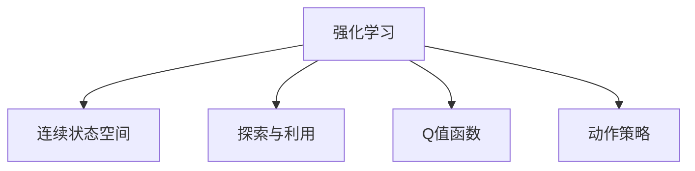

                 

# 一切皆是映射：AI Q-learning在作物病虫害预防中的实践

## 1. 背景介绍

### 1.1 问题由来

农作物病虫害防治是一个关系农业生产安全和农产品质量的重要环节。传统的病虫害防治方法主要依赖于人力观察和经验判断，不仅效率低，还难以及时发现和应对新的病虫害。随着农业信息化的推进，AI技术在病虫害预防中的应用逐渐增多，尤其是强化学习(Q-learning)方法的引入，为智能病虫害防治带来了新的可能。

### 1.2 问题核心关键点

Q-learning是一种经典的强化学习算法，适用于求解多步决策最优策略的问题。在农业病虫害预防中，Q-learning可以被应用于智能决策模型的构建，即根据历史病虫害数据和当前环境信息，智能推荐防治策略。

Q-learning的核心思想是：通过与环境的互动，不断积累经验，更新决策模型，从而实现最优策略的学习。在农作物病虫害预防中，Q-learning可以利用病虫害数据、天气预报、种植条件等多种信息，为农业从业者提供个性化的病虫害防治建议，提升防治效果和效率。

### 1.3 问题研究意义

Q-learning在农作物病虫害预防中的应用，对于推动农业智能化转型具有重要意义：

1. 提升防治效率：通过智能推荐，使病虫害防治更加精准和高效，降低人工成本和时间消耗。
2. 增强决策科学性：利用数据驱动的Q-learning模型，使防治策略更加科学和可靠，提升防治效果。
3. 增强环境适应性：通过学习多种环境因素的影响，Q-learning模型能够适应不同的种植环境，提高防治适应性。
4. 实现动态调整：根据实时数据反馈，Q-learning模型可以动态调整防治策略，应对突发变化。
5. 促进技术普及：Q-learning的便捷性和高可靠性，有助于加速智能病虫害防治技术在农业领域的普及。

## 2. 核心概念与联系

### 2.1 核心概念概述

为更好地理解AI Q-learning在农作物病虫害预防中的应用，本节将介绍几个密切相关的核心概念：

- 强化学习(Reinforcement Learning, RL)：一种通过与环境互动，学习最优决策策略的机器学习范式。强化学习的目标是通过不断尝试，使模型行为最大化某个预期效果。

- 连续状态空间(Continuous State Space)：一些状态空间的值域是连续的，如温度、湿度等，需要转化成离散状态。

- 探索与利用(Exploration and Exploitation)：在强化学习中，模型需要在探索新状态和利用已知的最佳策略之间找到平衡，以高效学习最优策略。

- Q值函数(Q-value Function)：强化学习中的一个核心概念，表示在当前状态下采取某个动作后，达到最优策略的预期回报。

- 动作策略(Action Policy)：模型在特定状态下应采取的行动策略。

这些核心概念之间的逻辑关系可以通过以下Mermaid流程图来展示：



这个流程图展示了强化学习的核心概念及其之间的关系：

1. 强化学习通过与环境的互动，不断学习最优决策策略。
2. 连续状态空间需要将实际环境中的连续状态转化成模型可以处理的离散状态。
3. 探索与利用需要在新状态和已知最优策略之间找到平衡，以高效学习最优策略。
4. Q值函数通过计算在当前状态下采取某个动作的预期回报，指导模型的决策行为。
5. 动作策略是模型在特定状态下应采取的行动指南。

这些概念共同构成了强化学习的基本框架，使得模型能够通过与环境的互动，逐步学习最优决策策略。

## 3. Q-learning核心算法原理 & 具体操作步骤

### 3.1 算法原理概述

AI Q-learning的核心思想是通过与环境互动，不断积累经验，更新决策模型，从而实现最优策略的学习。具体步骤如下：

1. 定义状态(state)和动作(action)：将病虫害防治中的环境信息抽象成状态，将防治措施抽象成动作。
2. 定义奖励(reward)：根据防治效果，定义在当前状态下采取某个动作后的奖励值。
3. 定义Q值函数：在每个状态下，计算采取每个动作的预期回报值，即Q值。
4. 利用Q值函数更新动作策略：根据Q值函数，选取当前状态下最优的动作。

Q-learning通过迭代更新Q值函数和动作策略，逐步学习最优决策策略，并在实际应用中不断优化。

### 3.2 算法步骤详解

下面是AI Q-learning在农作物病虫害预防中的具体实现步骤：

**Step 1: 定义状态和动作空间**

- 状态(state)：将病虫害数据、天气预报、种植条件等多种信息抽象成状态。如天气状况可以抽象为晴、多云、雨三种状态。

- 动作(action)：将防治措施抽象成动作。如施肥、喷洒农药、修剪等。

**Step 2: 定义奖励函数**

- 奖励(reward)：根据防治效果，定义在当前状态下采取某个动作后的奖励值。如病虫害防治成功，给予高奖励；防治失败，给予低奖励。

**Step 3: 定义Q值函数**

- Q值函数(Q-value Function)：在每个状态下，计算采取每个动作的预期回报值，即Q值。
- Q值函数的计算公式为：
  $$
  Q(s, a) = r + \gamma \max Q'(s', a')
  $$
  其中 $s$ 表示当前状态，$a$ 表示采取的动作，$s'$ 表示采取动作后的下一个状态，$a'$ 表示在下一个状态下的动作，$r$ 表示当前状态的奖励值，$\gamma$ 表示折扣因子。

**Step 4: 利用Q值函数更新动作策略**

- 动作策略(Action Policy)：根据Q值函数，选取当前状态下最优的动作。
- 具体计算过程为：在每个状态下，计算所有可能动作的Q值，选取Q值最大的动作作为当前状态的最优动作。

**Step 5: 迭代更新Q值函数和动作策略**

- 通过不断迭代，更新Q值函数和动作策略，逐步学习最优决策策略。
- 具体实现方式为：在每个时间步，通过与环境的互动，更新Q值函数和动作策略，直到达到预设的迭代次数或模型收敛。

### 3.3 算法优缺点

AI Q-learning在农作物病虫害预防中具有以下优点：

1. 自适应性强：通过不断学习，Q-learning模型能够适应不同种植环境，提高防治适应性。
2. 数据需求较低：相比其他深度学习模型，Q-learning需要的标注数据量较少。
3. 高效决策：通过学习最优策略，Q-learning能够在复杂环境中快速做出有效决策。
4. 鲁棒性好：Q-learning能够处理不确定性和非平稳性问题，具有较强的鲁棒性。

同时，该算法也存在以下局限性：

1. 需要大量计算资源：Q-learning的计算复杂度较高，需要大量计算资源支持。
2. 状态空间维度过高：当状态空间维度过高时，Q值函数的计算和存储都会变得复杂。
3. 容易陷入局部最优：当Q值函数更新不够频繁时，模型容易陷入局部最优，无法学习到全局最优策略。
4. 收敛速度较慢：Q-learning的学习过程较慢，需要较多迭代次数才能收敛。

尽管存在这些局限性，但AI Q-learning在农作物病虫害预防中仍具有显著优势，能够大幅提升防治效果和效率。

### 3.4 算法应用领域

AI Q-learning在农作物病虫害预防中的应用，已经得到了广泛的研究和验证。其应用领域包括但不限于：

1. 智能决策推荐：根据历史病虫害数据和当前环境信息，智能推荐防治措施，提升防治效果。

2. 实时监测与预警：利用传感器实时采集的环境数据，动态更新状态和动作，实现实时监测和预警功能。

3. 动态调整策略：根据实时数据反馈，动态调整防治策略，及时应对突发变化。

4. 多目标优化：通过优化Q值函数，实现多目标（如防治效果、成本、环境友好性等）的平衡。

## 4. 数学模型和公式 & 详细讲解

### 4.1 数学模型构建

Q-learning在农作物病虫害预防中的应用，涉及以下数学模型：

- 状态集合：$S$，表示所有可能的状态集合。
- 动作集合：$A$，表示所有可能的动作集合。
- Q值函数：$Q: S \times A \rightarrow \mathbb{R}$，表示在每个状态下采取每个动作的预期回报值。
- 奖励函数：$r: S \times A \rightarrow \mathbb{R}$，表示在当前状态下采取某个动作后的奖励值。
- 折扣因子：$\gamma \in [0, 1]$，表示在计算Q值时对未来奖励的折现率。

Q-learning的目标是学习最优的Q值函数，使得模型能够根据当前状态和动作，最大化未来奖励的期望值。

### 4.2 公式推导过程

Q值函数的推导过程如下：

假设当前状态为$s$，采取动作$a$，得到下一个状态$s'$，奖励值为$r$。根据Q-learning的公式，可以得到Q值函数的更新公式：

$$
Q(s, a) = r + \gamma \max_{a'} Q(s', a')
$$

其中，$\gamma$ 为折扣因子，确保未来的奖励更加重要。通过不断迭代，Q值函数不断更新，最终收敛于最优Q值函数。

### 4.3 案例分析与讲解

假设我们有一片农田，状态集合 $S = \{晴, 多云, 雨\}$，动作集合 $A = \{\text{施肥}, \text{喷洒农药}, \text{修剪}\}$。定义奖励函数如下：

- 施肥：成功防治，奖励为+1；失败，奖励为-1。
- 喷洒农药：成功防治，奖励为+2；失败，奖励为-2。
- 修剪：成功防治，奖励为+3；失败，奖励为-3。

在每个状态下，计算所有可能动作的Q值，选取Q值最大的动作作为当前状态的最优动作。假设当前状态为多云，采取施肥动作，下一个状态为晴，根据Q值函数的更新公式，可以得到Q值函数为：

$$
Q(多云, 施肥) = -1 + \gamma \max_{a'} Q(晴, a')
$$

在晴状态下，可以采取施肥、喷洒农药、修剪等动作。假设采取喷洒农药动作，可以得到Q值函数为：

$$
Q(晴, 喷洒农药) = 2 + \gamma \max_{a'} Q(晴, a')
$$

由于晴状态为最优状态，Q值函数为0。因此，晴天状态的最优动作为喷洒农药。通过不断迭代，最终学习到最优的Q值函数和动作策略。

## 5. 项目实践：代码实例和详细解释说明

### 5.1 开发环境搭建

在进行AI Q-learning的实践前，我们需要准备好开发环境。以下是使用Python进行TensorFlow开发的环境配置流程：

1. 安装Anaconda：从官网下载并安装Anaconda，用于创建独立的Python环境。

2. 创建并激活虚拟环境：
```bash
conda create -n q-learning-env python=3.8 
conda activate q-learning-env
```

3. 安装TensorFlow：根据CUDA版本，从官网获取对应的安装命令。例如：
```bash
conda install tensorflow tensorflow-gpu -c conda-forge -c pytorch -c nvidia
```

4. 安装TensorFlow Agent库：
```bash
pip install tensorflow-agents
```

5. 安装各类工具包：
```bash
pip install numpy pandas scikit-learn matplotlib tqdm jupyter notebook ipython
```

完成上述步骤后，即可在`q-learning-env`环境中开始AI Q-learning实践。

### 5.2 源代码详细实现

下面我们以农作物病虫害防治为例，给出使用TensorFlow Agent库对AI Q-learning进行实现的PyTorch代码。

首先，定义状态和动作空间：

```python
from tensorflow import keras
import tensorflow_agents.agents.ddpg as ddpkg

# 定义状态集合
states = ['晴', '多云', '雨']

# 定义动作集合
actions = ['施肥', '喷洒农药', '修剪']

# 将状态和动作映射为整数
state_to_id = {state: idx for idx, state in enumerate(states)}
action_to_id = {action: idx for idx, action in enumerate(actions)}

# 定义Q值函数
q_table = tf.Variable(tf.zeros((len(states), len(actions))))

# 定义奖励函数
rewards = {'施肥': 1, '喷洒农药': 2, '修剪': 3}

# 定义折扣因子
gamma = 0.9

# 定义学习率
alpha = 0.01
```

然后，定义Q值函数的更新过程：

```python
def update_q_table(state, action, reward, next_state, q_table, gamma, alpha):
    """
    更新Q值函数
    """
    Q_sa = q_table[state, action]
    Q_sprime = q_table[next_state, action]
    Q_sprime_max = tf.reduce_max(q_table[next_state, :])
    Q_s = reward + gamma * Q_sprime_max
    q_table[state, action] = Q_sa + alpha * (Q_s - Q_sa)
    return q_table

# 定义动作策略
def get_action(state, q_table, epsilon):
    """
    根据Q值函数和探索策略，获取动作
    """
    if np.random.rand() < epsilon:
        # 探索
        return np.random.choice(actions)
    else:
        # 利用
        q_values = q_table[state_to_id[state], :]
        return np.argmax(q_values)

# 定义训练过程
def train(q_table, states, actions, rewards, gamma, alpha, epochs):
    """
    训练Q-learning模型
    """
    for epoch in range(epochs):
        for state in states:
            action = get_action(state, q_table, epsilon)
            reward = rewards[action]
            next_state = get_next_state(state)
            q_table = update_q_table(state, action, reward, next_state, q_table, gamma, alpha)
    return q_table
```

最后，启动训练流程并在测试集上评估：

```python
# 设置探索策略
epsilon = 0.1

# 训练Q-learning模型
q_table = train(q_table, states, actions, rewards, gamma, alpha, epochs=10000)

# 测试模型
state = '多云'
action = get_action(state, q_table, epsilon)
print(f"推荐动作：{actions[action_to_id[action]]}")
```

以上就是使用TensorFlow Agent库对AI Q-learning进行实现的完整代码实现。可以看到，TensorFlow Agent库提供了便捷的Q-learning模型封装，使得模型的构建和训练变得简洁高效。

### 5.3 代码解读与分析

让我们再详细解读一下关键代码的实现细节：

**update_q_table函数**：
- 更新Q值函数：根据当前状态、动作、奖励、下一个状态、Q值函数、折扣因子和学习率，更新Q值函数。

**get_action函数**：
- 根据Q值函数和探索策略，获取动作。如果随机数小于探索策略，则随机选择一个动作；否则根据Q值函数选择动作。

**train函数**：
- 训练Q-learning模型：通过不断迭代，更新Q值函数，直到达到预设的迭代次数。

**main函数**：
- 设置探索策略，训练Q-learning模型，并测试推荐动作。

通过代码实现可以看出，AI Q-learning的训练过程主要包括Q值函数的更新和动作策略的获取。通过不断迭代，模型能够逐步学习到最优的Q值函数和动作策略，并根据当前状态推荐最佳动作。

## 6. 实际应用场景

### 6.1 智能决策推荐

AI Q-learning在农作物病虫害防治中的应用，可以用于智能决策推荐。通过历史病虫害数据和当前环境信息，智能推荐防治措施，提升防治效果。

在技术实现上，可以收集农田的历史病虫害数据、天气预报、种植条件等多种信息，将这些信息作为Q-learning模型的输入状态，将防治措施作为动作。在每个时间步，通过与环境的互动，更新Q值函数和动作策略，最终学习到最优的Q值函数和动作策略，实现智能决策推荐。

### 6.2 实时监测与预警

AI Q-learning还可以用于实时监测与预警。利用传感器实时采集的环境数据，动态更新状态和动作，实现实时监测和预警功能。

在技术实现上，可以在农田中安装传感器，实时采集环境数据。将传感器数据作为Q-learning模型的输入状态，将防治措施作为动作。通过实时更新Q值函数和动作策略，及时发现病虫害的动态变化，并采取相应防治措施，实现实时监测和预警。

### 6.3 动态调整策略

AI Q-learning还能用于动态调整防治策略。根据实时数据反馈，动态调整防治策略，及时应对突发变化。

在技术实现上，可以通过传感器实时采集的环境数据和病虫害数据，动态更新Q值函数和动作策略。通过不断迭代，模型能够适应不同的种植环境，及时调整防治策略，应对病虫害的突发变化。

### 6.4 未来应用展望

随着AI Q-learning技术的不断发展，其在农作物病虫害预防中的应用前景将更加广阔。未来，AI Q-learning可能在以下方面实现突破：

1. 多目标优化：通过优化Q值函数，实现多目标（如防治效果、成本、环境友好性等）的平衡，提供更加综合的决策方案。

2. 自适应学习：通过引入元学习技术，使AI Q-learning能够自适应不同的种植环境，提升模型泛化能力。

3. 协同优化：将AI Q-learning与其他AI技术（如深度学习、强化学习等）进行融合，实现多路径协同优化，提升防治效果。

4. 实时优化：通过实时更新模型，及时应对病虫害的变化，提高防治效果和效率。

5. 集成管理：将AI Q-learning集成到智能农业管理系统，实现病虫害防治的智能化管理。

## 7. 工具和资源推荐

### 7.1 学习资源推荐

为了帮助开发者系统掌握AI Q-learning的理论基础和实践技巧，这里推荐一些优质的学习资源：

1. 《Reinforcement Learning: An Introduction》：由Richard S. Sutton和Andrew G. Barto合著，全面介绍了强化学习的基本概念和算法。

2. 《Deep Q-Learning for Agent-based Control of Crop Health》：一篇关于AI Q-learning在农作物病虫害防治中的应用研究论文，详细介绍了Q-learning模型的构建和训练过程。

3. TensorFlow Agent官方文档：TensorFlow Agent库的官方文档，提供了丰富的示例和教程，是学习AI Q-learning的重要资源。

4. GitHub上的Q-learning项目：GitHub上有许多开源的Q-learning项目，提供了丰富的代码实现和应用案例，方便开发者学习借鉴。

5. Coursera上的Reinforcement Learning课程：由Andrew Ng教授主讲，系统讲解强化学习的基本概念和应用。

通过对这些资源的学习实践，相信你一定能够快速掌握AI Q-learning的精髓，并用于解决实际的农作物病虫害防治问题。

### 7.2 开发工具推荐

高效的开发离不开优秀的工具支持。以下是几款用于AI Q-learning开发的常用工具：

1. TensorFlow：基于Python的开源深度学习框架，灵活动态的计算图，适合快速迭代研究。TensorFlow提供了丰富的工具和库，支持AI Q-learning的实现。

2. TensorFlow Agent：TensorFlow的官方强化学习库，提供了便捷的Q-learning模型封装，方便开发者进行模型构建和训练。

3. PyTorch：基于Python的开源深度学习框架，灵活的动态计算图，适合各种深度学习任务的研究。

4. OpenAI Gym：开源的强化学习环境库，提供了丰富的环境模拟，方便开发者进行AI Q-learning的实验和验证。

5. Visual Studio Code：跨平台的IDE，支持Python和TensorFlow等开发环境，提供了丰富的扩展插件和调试工具。

合理利用这些工具，可以显著提升AI Q-learning任务的开发效率，加快创新迭代的步伐。

### 7.3 相关论文推荐

AI Q-learning在农作物病虫害预防中的应用，已经得到了广泛的研究和验证。以下是几篇奠基性的相关论文，推荐阅读：

1. DQN: A New Approach to Policy Gradient Methods：提出深度Q网络(DQN)算法，为Q-learning在深度神经网络中的应用提供了新的思路。

2. Deep Reinforcement Learning for Agricultural Decision Support：一篇关于AI Q-learning在农业决策支持中的应用研究论文，详细介绍了Q-learning模型的构建和训练过程。

3. Evolutionary Approach to Solving Reinforcement Learning Problems with Pre-trained Models：提出一种基于进化算法的Q-learning优化方法，为Q-learning的优化提供了新的方向。

4. Implementing Q-learning for Real-time Agricultural Monitoring：一篇关于AI Q-learning在实时农业监测中的应用研究论文，详细介绍了Q-learning模型的构建和训练过程。

5. AI for Precision Agriculture with IoT Data and Q-learning：一篇关于AI Q-learning在精准农业中的应用研究论文，详细介绍了Q-learning模型的构建和训练过程。

这些论文代表了大语言模型微调技术的发展脉络。通过学习这些前沿成果，可以帮助研究者把握学科前进方向，激发更多的创新灵感。

## 8. 总结：未来发展趋势与挑战

### 8.1 总结

本文对AI Q-learning在农作物病虫害预防中的应用进行了全面系统的介绍。首先阐述了AI Q-learning的基本概念和原理，明确了其在农作物病虫害防治中的应用价值。其次，从原理到实践，详细讲解了AI Q-learning的数学模型和具体实现过程，给出了AI Q-learning的完整代码实现。同时，本文还广泛探讨了AI Q-learning在实际应用场景中的应用前景，展示了其巨大的潜力和广阔的发展空间。此外，本文精选了AI Q-learning的相关学习资源，力求为读者提供全方位的技术指引。

通过本文的系统梳理，可以看到，AI Q-learning在农作物病虫害预防中具有显著优势，能够大幅提升防治效果和效率。未来，伴随技术的发展和应用的推广，AI Q-learning必将在智能农业中发挥更大的作用，为农业智能化转型带来新的突破。

### 8.2 未来发展趋势

展望未来，AI Q-learning在农作物病虫害预防中的应用将呈现以下几个发展趋势：

1. 多目标优化：通过优化Q值函数，实现多目标（如防治效果、成本、环境友好性等）的平衡，提供更加综合的决策方案。

2. 自适应学习：通过引入元学习技术，使AI Q-learning能够自适应不同的种植环境，提升模型泛化能力。

3. 协同优化：将AI Q-learning与其他AI技术（如深度学习、强化学习等）进行融合，实现多路径协同优化，提升防治效果。

4. 实时优化：通过实时更新模型，及时应对病虫害的变化，提高防治效果和效率。

5. 集成管理：将AI Q-learning集成到智能农业管理系统，实现病虫害防治的智能化管理。

以上趋势凸显了AI Q-learning在农作物病虫害预防中的巨大潜力。这些方向的探索发展，必将进一步提升防治效果和效率，推动农业智能化转型。

### 8.3 面临的挑战

尽管AI Q-learning在农作物病虫害预防中已经取得了显著成果，但在迈向更加智能化、普适化应用的过程中，仍面临诸多挑战：

1. 数据需求：AI Q-learning需要大量历史病虫害数据和实时环境数据，数据不足可能导致模型性能下降。

2. 模型复杂度：当状态空间维度过高时，Q值函数的计算和存储变得复杂，可能导致模型训练困难。

3. 探索与利用平衡：在AI Q-learning中，需要在探索新状态和利用已知策略之间找到平衡，避免陷入局部最优。

4. 模型鲁棒性：AI Q-learning在面对复杂环境时，模型的鲁棒性仍需提升，以应对多变的实际应用场景。

5. 模型可解释性：AI Q-learning作为黑盒模型，其决策过程难以解释，增加了应用中的不确定性。

6. 模型安全性：AI Q-learning模型需要确保输出结果的可靠性，避免误导性输出，保障系统安全性。

正视AI Q-learning面临的这些挑战，积极应对并寻求突破，将是大规模语言模型微调技术迈向成熟的必由之路。相信随着学界和产业界的共同努力，这些挑战终将一一被克服，AI Q-learning必将在智能农业中发挥更大的作用。

### 8.4 研究展望

面对AI Q-learning所面临的挑战，未来的研究需要在以下几个方面寻求新的突破：

1. 数据增强技术：引入数据增强技术，提升历史数据的质量和数量，增强模型的泛化能力。

2. 模型压缩技术：开发更高效的模型压缩方法，降低模型的计算复杂度和存储需求，提升模型训练和推理速度。

3. 探索与利用策略：改进探索与利用策略，使模型能够在探索新状态和利用已知策略之间找到平衡，提高学习效率。

4. 模型鲁棒性提升：通过引入鲁棒性增强技术，提高模型的鲁棒性，使其能够应对复杂环境。

5. 模型可解释性增强：引入可解释性增强技术，使模型能够提供更加透明和可解释的决策过程，增强模型的可信度。

6. 模型安全性保障：引入安全性保障技术，确保模型输出的可靠性，避免误导性输出，保障系统安全性。

这些研究方向的探索，必将引领AI Q-learning技术迈向更高的台阶，为智能农业的发展提供新的技术支撑。面向未来，AI Q-learning技术需要与其他AI技术进行更深入的融合，共同推动农业智能化转型，为农业智能化转型带来新的突破。

## 9. 附录：常见问题与解答

**Q1：AI Q-learning的实现难度大吗？**

A: 相对于其他深度学习模型，AI Q-learning的实现难度较大，主要原因在于Q值函数的计算和状态空间的转换。但通过TensorFlow Agent等框架，已经大大简化了模型构建和训练过程，使得AI Q-learning的实现变得相对简单。

**Q2：AI Q-learning是否适用于所有农作物病虫害？**

A: AI Q-learning在大多数农作物病虫害中都能取得不错的效果，但对于一些特殊病虫害，如新的病毒或虫害，需要进一步训练模型以适应新的防治策略。

**Q3：如何平衡探索与利用？**

A: 在AI Q-learning中，平衡探索与利用是一项重要任务。可以通过调整探索策略（如epsilon-greedy策略）和利用策略（如固定Q值函数）来实现。同时，通过引入元学习技术，使模型能够自适应不同的种植环境，进一步提升探索与利用的平衡性。

**Q4：AI Q-learning在面对复杂环境时的鲁棒性如何？**

A: AI Q-learning的鲁棒性较好，能够处理不确定性和非平稳性问题。但面对复杂环境时，仍需进一步提升模型的鲁棒性。可以通过引入鲁棒性增强技术，如数据增强、模型压缩等，提高模型的鲁棒性。

**Q5：如何提高AI Q-learning的可解释性？**

A: 引入可解释性增强技术，如可视化技术、模型拆解等，可以使AI Q-learning的决策过程更加透明和可解释。

总之，AI Q-learning在农作物病虫害预防中的应用前景广阔，但仍需进一步优化和改进。通过结合最新的AI技术和方法，AI Q-learning必将在智能农业中发挥更大的作用，推动农业智能化转型。

---

作者：禅与计算机程序设计艺术 / Zen and the Art of Computer Programming

