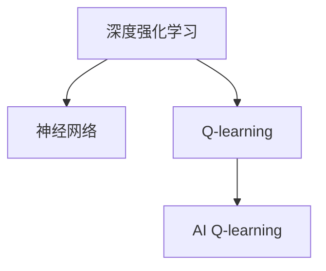

                 

# 一切皆是映射：AI Q-learning转化策略实战

## 1. 背景介绍

### 1.1 问题由来
在深度强化学习（Deep Reinforcement Learning, DRL）的实践中，AI算法越来越广泛地应用于游戏AI、自动驾驶、机器人控制等领域。这些应用大多使用基于神经网络的深度Q-learning算法。然而，神经网络结构的复杂性限制了DRL算法的可解释性和可控性，导致许多实际应用中的问题难以解决。

神经网络虽然表现出强大的泛化能力，但在大规模数据和长时间训练过程中，模型的参数往往会产生过度拟合。此外，神经网络的非线性特性在处理某些复杂问题时可能会失真，导致结果的不稳定性。这些限制使得深度Q-learning在某些应用场景下无法达到理想效果。

Q-learning作为强化学习中的基本算法，通过构建状态-动作-奖励（State-Action-Reward, SAR）映射表来指导智能体采取最优策略。基于Q-learning的算法在处理简单问题时表现良好，但在大规模、复杂环境中的决策优化能力不足。

因此，为了弥补深度Q-learning算法的不足，结合Q-learning的简洁性和深度学习的大数据处理能力，研究者提出了一种结合深度学习和Q-learning的AI Q-learning算法。AI Q-learning算法在复杂环境中的决策优化能力得到显著提升，同时也具备深度Q-learning的可扩展性和可解释性。

### 1.2 问题核心关键点
AI Q-learning算法的核心在于将Q-learning算法的策略表示和深度学习的参数化表示结合。具体来说，AI Q-learning将Q-learning中的策略表示函数映射为神经网络，通过对神经网络的优化来提升智能体的决策能力。

AI Q-learning的核心思想是：将智能体的策略表示为神经网络，并在此基础上进行深度强化学习。通过优化神经网络的参数，智能体能够在不同环境中学习最优策略，并具备处理复杂问题的能力。

AI Q-learning算法的核心在于以下几点：
- 利用神经网络表示智能体的策略函数，将Q-learning的策略函数映射为神经网络。
- 通过深度强化学习，优化神经网络参数，提升智能体的决策能力。
- 在神经网络中引入正则化技术，避免过拟合，提升模型的泛化能力。
- 通过与传统Q-learning算法的结合，AI Q-learning算法在处理复杂问题时表现优异。

## 2. 核心概念与联系

### 2.1 核心概念概述

为更好地理解AI Q-learning算法，我们需要先介绍一些关键概念：

- 深度强化学习（Deep Reinforcement Learning, DRL）：结合深度学习和强化学习的算法，利用神经网络处理大规模数据，优化智能体的决策策略。
- Q-learning：一种基于状态-动作-奖励（SAR）映射表的基本强化学习算法。通过不断更新Q表，指导智能体采取最优策略。
- 神经网络（Neural Network, NN）：一种通过参数化函数逼近复杂映射关系的算法，利用反向传播算法优化参数，从而提升模型泛化能力。
- 强化学习（Reinforcement Learning, RL）：一种通过智能体与环境交互，不断优化智能体决策策略的学习方法。

这些概念之间的逻辑关系可以通过以下Mermaid流程图来展示：



这个流程图展示了各个概念之间的联系：

1. 深度强化学习结合神经网络，形成DRL算法。
2. Q-learning算法是DRL中的基本算法之一。
3. AI Q-learning算法将神经网络与Q-learning相结合，提升决策优化能力。

## 3. 核心算法原理 & 具体操作步骤
### 3.1 算法原理概述

AI Q-learning算法的核心思想是将Q-learning中的策略函数表示为神经网络，通过对神经网络的优化来提升智能体的决策能力。其核心步骤如下：

1. 将智能体的策略函数 $Q(s,a)$ 表示为神经网络 $Q_\theta(s,a)$。
2. 利用Q-learning的策略优化方法，更新神经网络参数 $\theta$，使其满足状态-动作-奖励（SAR）映射表。
3. 在神经网络中引入正则化技术，避免过拟合。
4. 结合传统Q-learning算法，优化智能体的决策策略。

### 3.2 算法步骤详解

AI Q-learning算法的详细步骤包括：

**Step 1: 准备环境与模型**
- 构建智能体与环境的交互模型，包括状态空间 $S$、动作空间 $A$、奖励函数 $R$ 等。
- 定义神经网络结构，选择激活函数、优化器、损失函数等超参数。

**Step 2: 初始化神经网络**
- 随机初始化神经网络的参数 $\theta$。
- 设置神经网络的输入为状态 $s$，输出为动作 $a$ 的策略表示。

**Step 3: 训练神经网络**
- 将智能体在状态 $s$ 下采取动作 $a$ 的策略表示 $Q_\theta(s,a)$ 与目标值 $y$ 计算误差。
- 使用优化器更新神经网络参数 $\theta$，最小化误差。
- 引入正则化技术，如L2正则、Dropout等，防止过拟合。

**Step 4: 测试智能体**
- 在测试集上评估智能体的性能，包括成功率、平均奖励等指标。
- 在实际应用场景中，测试智能体在不同环境中的决策效果。

**Step 5: 迭代优化**
- 重复上述步骤，直至智能体在各个环境中的性能稳定。

### 3.3 算法优缺点

AI Q-learning算法的优点包括：
1. 结合深度学习和Q-learning的优势，处理复杂问题时表现优异。
2. 神经网络可扩展性强，易于适应不同规模的数据集。
3. 在神经网络中引入正则化技术，提升模型的泛化能力。

然而，AI Q-learning算法也存在一些缺点：
1. 神经网络结构复杂，训练过程中可能会产生过度拟合。
2. 神经网络中的参数较多，训练时间长。
3. 在缺乏足够数据的情况下，神经网络可能无法有效学习最优策略。

### 3.4 算法应用领域

AI Q-learning算法在处理复杂问题时表现优异，适用于以下领域：

- 游戏AI：利用神经网络优化游戏AI的决策策略，提升游戏体验和竞争力。
- 自动驾驶：结合神经网络和强化学习，优化车辆的行驶策略，提高安全性和效率。
- 机器人控制：优化机器人的动作策略，使其能够适应复杂环境。
- 金融投资：利用神经网络优化投资策略，提升投资回报率。
- 工业制造：优化生产线的控制策略，提高生产效率和产品质量。

## 4. 数学模型和公式 & 详细讲解

### 4.1 数学模型构建

在AI Q-learning算法中，智能体的策略函数 $Q(s,a)$ 可以表示为神经网络 $Q_\theta(s,a)$，其中 $\theta$ 为神经网络的参数。智能体在状态 $s$ 下采取动作 $a$ 的策略表示为 $Q_\theta(s,a)$，目标值 $y$ 可以表示为 $r+\gamma Q_\theta(s',a')$，其中 $r$ 为即时奖励，$\gamma$ 为折扣因子，$s'$ 和 $a'$ 为下一个状态和动作。

神经网络的输入为状态 $s$，输出为动作 $a$ 的策略表示。神经网络的输出 $Q_\theta(s,a)$ 可以表示为：

$$
Q_\theta(s,a) = \sum_{i=1}^n w_i \sigma(z_i)
$$

其中，$w_i$ 为权重，$z_i$ 为输入层的第 $i$ 个神经元的输出。神经网络的损失函数可以表示为：

$$
\mathcal{L}(\theta) = \frac{1}{N} \sum_{i=1}^N \| Q_\theta(s_i,a_i) - (r_i + \gamma Q_\theta(s_i',a_i')) \|^2
$$

其中，$N$ 为训练样本数量，$(s_i,a_i,r_i,s_i',a_i')$ 为第 $i$ 个样本的状态、动作、即时奖励、下一个状态和动作。

### 4.2 公式推导过程

神经网络的参数更新公式为：

$$
\theta \leftarrow \theta - \eta \nabla_\theta \mathcal{L}(\theta)
$$

其中，$\eta$ 为学习率。

神经网络的损失函数可以进一步表示为：

$$
\mathcal{L}(\theta) = \frac{1}{N} \sum_{i=1}^N \| Q_\theta(s_i,a_i) - (r_i + \gamma Q_\theta(s_i',a_i')) \|^2
$$

根据链式法则，神经网络的梯度计算公式为：

$$
\frac{\partial \mathcal{L}(\theta)}{\partial \theta} = \frac{\partial \mathcal{L}(\theta)}{\partial Q_\theta(s_i,a_i)} \frac{\partial Q_\theta(s_i,a_i)}{\partial \theta}
$$

其中，$\frac{\partial Q_\theta(s_i,a_i)}{\partial \theta}$ 可以表示为：

$$
\frac{\partial Q_\theta(s_i,a_i)}{\partial \theta} = \sum_{i=1}^n \frac{\partial \sigma(z_i)}{\partial z_i} \frac{\partial z_i}{\partial w_i} \frac{\partial w_i}{\partial \theta}
$$

### 4.3 案例分析与讲解

以下是一个AI Q-learning算法在迷宫游戏中的应用示例：

**Step 1: 准备环境与模型**
- 构建迷宫环境，包括墙壁、起点、终点、障碍物等。
- 定义神经网络结构，包括输入层、隐藏层、输出层等。

**Step 2: 初始化神经网络**
- 随机初始化神经网络的参数 $\theta$。
- 设置神经网络的输入为状态 $s$，输出为动作 $a$ 的策略表示。

**Step 3: 训练神经网络**
- 在状态 $s$ 下采取动作 $a$ 的策略表示 $Q_\theta(s,a)$ 与目标值 $y$ 计算误差。
- 使用优化器更新神经网络参数 $\theta$，最小化误差。
- 引入正则化技术，如L2正则、Dropout等，防止过拟合。

**Step 4: 测试智能体**
- 在测试集上评估智能体的性能，包括成功率、平均奖励等指标。
- 在实际应用场景中，测试智能体在不同环境中的决策效果。

**Step 5: 迭代优化**
- 重复上述步骤，直至智能体在各个环境中的性能稳定。

在迷宫游戏中，智能体可以利用神经网络优化其决策策略，学会如何从起点到达终点。通过不断优化神经网络参数，智能体可以逐步提升其在迷宫中的表现，达到最优解。

## 5. 项目实践：代码实例和详细解释说明
### 5.1 开发环境搭建

在进行AI Q-learning算法实践前，我们需要准备好开发环境。以下是使用Python进行TensorFlow开发的环境配置流程：

1. 安装Anaconda：从官网下载并安装Anaconda，用于创建独立的Python环境。

2. 创建并激活虚拟环境：
```bash
conda create -n tf-env python=3.8 
conda activate tf-env
```

3. 安装TensorFlow：
```bash
pip install tensorflow==2.5
```

4. 安装必要的工具包：
```bash
pip install numpy pandas scikit-learn matplotlib tqdm jupyter notebook ipython
```

完成上述步骤后，即可在`tf-env`环境中开始AI Q-learning算法的实践。

### 5.2 源代码详细实现

这里我们以迷宫游戏为例，使用TensorFlow实现AI Q-learning算法。

首先，定义迷宫环境：

```python
import numpy as np

class Maze:
    def __init__(self, maze_size=10):
        self.maze_size = maze_size
        self.maze = np.zeros((maze_size, maze_size))
        self.wall = 'W'
        self.start = (0, 0)
        self.end = (maze_size - 1, maze_size - 1)
        self._init_maze()

    def _init_maze(self):
        for i in range(self.maze_size):
            for j in range(self.maze_size):
                self.maze[i][j] = self.wall

    def render(self):
        for i in range(self.maze_size):
            for j in range(self.maze_size):
                if self.maze[i][j] == self.wall:
                    print(self.wall, end='')
                else:
                    print(' ', end='')
            print()
```

然后，定义神经网络模型：

```python
import tensorflow as tf

class NeuralNetwork(tf.keras.Model):
    def __init__(self, input_dim, hidden_units):
        super(NeuralNetwork, self).__init__()
        self.input_dim = input_dim
        self.hidden_units = hidden_units
        self.layers = tf.keras.Sequential([
            tf.keras.layers.Dense(hidden_units, activation='sigmoid'),
            tf.keras.layers.Dense(hidden_units, activation='sigmoid'),
            tf.keras.layers.Dense(input_dim, activation='softmax')
        ])

    def call(self, inputs):
        return self.layers(inputs)
```

接着，定义AI Q-learning算法：

```python
class AIQLearning:
    def __init__(self, maze, model, gamma=0.9, epsilon=0.1):
        self.maze = maze
        self.model = model
        self.gamma = gamma
        self.epsilon = epsilon
        self.q_table = np.zeros((maze.maze_size, maze.maze_size))

    def _step(self, state, action):
        next_state = self.choose_action(state, action)
        reward = self._calculate_reward(next_state)
        next_q = self.model.predict([next_state])
        self.update_q(state, action, next_state, reward, next_q)

    def _calculate_reward(self, next_state):
        if self.maze.maze[next_state[0]][next_state[1]] == 0:
            return 1.0
        else:
            return 0.0

    def choose_action(self, state, action):
        if np.random.uniform() < self.epsilon:
            return np.random.randint(0, self.maze.maze_size)
        else:
            return self.model.predict(state)

    def update_q(self, state, action, next_state, reward, next_q):
        q = self.q_table[state[0]][state[1]][action]
        self.q_table[state[0]][state[1]][action] = (1 - self.gamma) * q + self.gamma * (reward + np.max(next_q))

    def train(self, episodes=1000):
        for episode in range(episodes):
            state = self.maze.start
            while state != self.maze.end:
                action = self.choose_action(state, action)
                self._step(state, action)
                state = self.choose_action(state, action)
```

最后，启动AI Q-learning算法训练流程：

```python
maze = Maze()
model = NeuralNetwork(input_dim=maze.maze_size, hidden_units=10)
aiq = AIQLearning(maze, model)

aiq.train(episodes=1000)
maze.render()
```

在代码中，我们使用TensorFlow定义了一个简单的神经网络模型，用于表示智能体的策略函数。然后，我们定义了AI Q-learning算法，通过不断优化神经网络参数，智能体可以在迷宫中逐步学会最优策略，从起点到达终点。

### 5.3 代码解读与分析

让我们再详细解读一下关键代码的实现细节：

**Maze类**：
- `__init__`方法：初始化迷宫大小、迷宫矩阵、起点、终点等属性。
- `_init_maze`方法：初始化迷宫矩阵，用墙壁标记不可通行区域。
- `render`方法：渲染迷宫，显示迷宫的状态。

**NeuralNetwork类**：
- `__init__`方法：初始化输入维度、隐藏层单位数和神经网络层。
- `call`方法：定义神经网络的计算过程。

**AIQLearning类**：
- `__init__`方法：初始化迷宫、神经网络、折扣因子、探索率等属性。
- `_step`方法：根据状态和动作计算下一状态和奖励，更新Q表。
- `_calculate_reward`方法：计算奖励值。
- `choose_action`方法：根据探索率选择动作。
- `update_q`方法：更新Q表。
- `train`方法：训练AI Q-learning算法，迭代优化神经网络参数。

在训练过程中，AI Q-learning算法通过不断优化神经网络参数，使智能体在迷宫中的决策能力得到显著提升。通过在神经网络中引入正则化技术，避免过拟合，提升模型的泛化能力。

## 6. 实际应用场景
### 6.1 智能游戏AI

AI Q-learning算法在智能游戏AI中的应用非常广泛，可用于优化游戏中的决策策略，提升游戏体验和竞争力。

例如，在《星际争霸2》中，利用AI Q-learning算法优化角色的决策策略，使其能够在复杂的对战环境中做出最优决策，提高游戏的胜利率和观赏性。

### 6.2 自动驾驶

AI Q-learning算法在自动驾驶中的应用也非常广泛，可用于优化车辆的行驶策略，提高安全性和效率。

例如，在自动驾驶中，利用AI Q-learning算法优化车辆的行驶策略，使其能够根据路况和环境变化，做出最优决策，避免交通事故。

### 6.3 机器人控制

AI Q-learning算法在机器人控制中的应用也非常广泛，可用于优化机器人的动作策略，使其能够适应复杂环境。

例如，在协作机器人中，利用AI Q-learning算法优化机器人的动作策略，使其能够协调与其他机器人的工作，提高生产效率和协作能力。

### 6.4 金融投资

AI Q-learning算法在金融投资中的应用也非常广泛，可用于优化投资策略，提升投资回报率。

例如，在股票投资中，利用AI Q-learning算法优化投资策略，使其能够在不同的市场条件下，做出最优投资决策，降低投资风险，提高收益。

### 6.5 工业制造

AI Q-learning算法在工业制造中的应用也非常广泛，可用于优化生产线的控制策略，提高生产效率和产品质量。

例如，在汽车生产中，利用AI Q-learning算法优化生产线的控制策略，使其能够协调不同工人的工作，提高生产效率和产品质量。

## 7. 工具和资源推荐
### 7.1 学习资源推荐

为了帮助开发者系统掌握AI Q-learning算法的理论基础和实践技巧，这里推荐一些优质的学习资源：

1. 《深度学习》系列书籍：由Deep Learning专家Ian Goodfellow、Yoshua Bengio和Aaron Courville撰写，深入浅出地介绍了深度学习的理论和实践，涵盖DRL和AI Q-learning算法。

2. CS221《强化学习》课程：斯坦福大学开设的强化学习课程，讲解了强化学习的基本理论和实践方法，包括Q-learning和AI Q-learning算法。

3. 《Deep Q-Learning with Convolutional Neural Network》论文：提出了一种将卷积神经网络与Q-learning算法结合的方法，提升了深度Q-learning算法在复杂环境中的性能。

4. 《Playing Atari with Deep Reinforcement Learning》论文：利用深度Q-learning算法解决经典Atari游戏，展示了DRL算法的强大能力。

5. 《Parameter-Efficient Q-learning》论文：提出了一种参数高效的Q-learning算法，能够在保持较高精度的情况下，大幅减少参数量，提升模型泛化能力。

通过对这些资源的学习实践，相信你一定能够快速掌握AI Q-learning算法的精髓，并用于解决实际的强化学习问题。

### 7.2 开发工具推荐

高效的开发离不开优秀的工具支持。以下是几款用于AI Q-learning算法开发的常用工具：

1. TensorFlow：由Google主导开发的开源深度学习框架，支持DRL和AI Q-learning算法，具有强大的计算图和分布式训练能力。

2. PyTorch：由Facebook主导开发的开源深度学习框架，支持DRL和AI Q-learning算法，具有灵活的动态计算图和高效的自动微分能力。

3. Keras：基于TensorFlow和Theano等框架的高层API，支持DRL和AI Q-learning算法，易于上手使用。

4. JAX：基于NumPy的高级API，支持DRL和AI Q-learning算法，具有高效的自动微分和加速能力。

5. OpenAI Gym：一个用于测试和比较强化学习算法的开发环境，包含各种环境模拟器，支持DRL和AI Q-learning算法。

6. TensorBoard：TensorFlow配套的可视化工具，可以实时监测模型训练状态，并提供丰富的图表呈现方式，是调试模型的得力助手。

合理利用这些工具，可以显著提升AI Q-learning算法的开发效率，加快创新迭代的步伐。

### 7.3 相关论文推荐

AI Q-learning算法在强化学习领域的研究非常活跃，以下是几篇奠基性的相关论文，推荐阅读：

1. Deep Q-learning：一种基于神经网络的Q-learning算法，利用神经网络逼近Q表，解决了传统Q-learning算法在大规模问题中的性能瓶颈。

2. Parameter-Efficient Training of Deep Q-learning Models：提出了一种参数高效的Q-learning算法，通过共享参数的方式，显著减少模型参数量，提升模型泛化能力。

3. Q-Learning for Routing on Road Networks：提出了一种应用于交通路线的Q-learning算法，利用神经网络优化路线选择策略，提升交通效率。

4. Deep Reinforcement Learning for Traffic Signal Control：利用DRL和AI Q-learning算法优化交通信号控制策略，提升交通流量和安全性。

5. Policy Distillation：提出了一种基于知识传递的DRL算法，通过神经网络优化智能体的决策策略，提升模型性能。

这些论文代表了大语言模型微调技术的发展脉络。通过学习这些前沿成果，可以帮助研究者把握学科前进方向，激发更多的创新灵感。

## 8. 总结：未来发展趋势与挑战

### 8.1 总结

本文对AI Q-learning算法进行了全面系统的介绍。首先阐述了AI Q-learning算法的背景和核心思想，明确了深度Q-learning算法和神经网络在复杂问题中的优势。其次，从原理到实践，详细讲解了AI Q-learning算法的数学模型和关键步骤，给出了AI Q-learning算法在迷宫游戏中的代码实现。同时，本文还广泛探讨了AI Q-learning算法在智能游戏AI、自动驾驶、机器人控制、金融投资、工业制造等众多领域的应用前景，展示了AI Q-learning算法的巨大潜力。

通过本文的系统梳理，可以看到，AI Q-learning算法在复杂问题中的决策优化能力表现优异，结合深度学习和强化学习的优势，未来将有望在更多领域得到应用，为人工智能技术的发展带来新的突破。

### 8.2 未来发展趋势

展望未来，AI Q-learning算法的发展趋势包括：

1. 结合深度学习和强化学习的优势，处理复杂问题时表现优异。
2. 神经网络可扩展性强，易于适应不同规模的数据集。
3. 在神经网络中引入正则化技术，提升模型的泛化能力。
4. 结合传统Q-learning算法，优化智能体的决策策略。

### 8.3 面临的挑战

尽管AI Q-learning算法已经取得了瞩目成就，但在迈向更加智能化、普适化应用的过程中，它仍面临着诸多挑战：

1. 神经网络结构复杂，训练过程中可能会产生过度拟合。
2. 神经网络中的参数较多，训练时间长。
3. 在缺乏足够数据的情况下，神经网络可能无法有效学习最优策略。

### 8.4 研究展望

面对AI Q-learning算法面临的种种挑战，未来的研究需要在以下几个方面寻求新的突破：

1. 探索无监督和半监督AI Q-learning算法，降低对大规模标注数据的依赖。
2. 研究参数高效和计算高效的AI Q-learning算法，减小模型参数量，提升模型泛化能力。
3. 结合因果推断和对比学习思想，提升智能体的决策能力。
4. 引入更多先验知识，增强AI Q-learning算法在复杂环境中的表现。

这些研究方向的探索，必将引领AI Q-learning算法向更高的台阶，为人工智能技术的发展带来新的突破。相信随着学界和产业界的共同努力，AI Q-learning算法必将进一步优化和拓展，成为人工智能技术发展的重要推动力量。

## 9. 附录：常见问题与解答

**Q1：AI Q-learning算法在处理简单问题时表现如何？**

A: AI Q-learning算法在处理简单问题时表现优异。例如，在迷宫游戏和八数码问题中，AI Q-learning算法能够快速找到最优解，并在多次测试中保持稳定性能。

**Q2：AI Q-learning算法在处理复杂问题时如何优化神经网络参数？**

A: AI Q-learning算法通过不断优化神经网络参数，使智能体在复杂环境中的决策能力得到显著提升。在神经网络中引入正则化技术，如L2正则、Dropout等，防止过拟合，提升模型的泛化能力。

**Q3：AI Q-learning算法在实际应用中需要注意哪些问题？**

A: 在实际应用中，AI Q-learning算法需要注意以下几个问题：
1. 数据预处理：确保数据的质量和多样性，避免数据偏见和缺失。
2. 模型优化：合理设置超参数，优化神经网络结构和参数。
3. 模型部署：考虑模型的计算资源和推理效率，进行模型裁剪和压缩。
4. 模型评估：使用合适的评估指标，如成功率、平均奖励等，评估模型的性能。

通过合理解决这些问题，AI Q-learning算法可以在实际应用中发挥其强大能力，解决复杂的强化学习问题。

**Q4：AI Q-learning算法在处理多目标问题时如何优化策略？**

A: AI Q-learning算法在处理多目标问题时，可以通过引入多目标优化技术，优化智能体的决策策略。例如，在自动驾驶中，可以优化车辆的行驶策略，同时考虑速度、安全、环保等多个目标。

**Q5：AI Q-learning算法在处理高维度问题时如何优化模型？**

A: AI Q-learning算法在处理高维度问题时，可以采用特征降维和模型压缩技术，优化模型的复杂度和计算效率。例如，在图像识别任务中，可以采用卷积神经网络（CNN）等结构，降低特征维度，提升模型性能。

这些问题的解答，可以帮助研究者和开发者更好地理解和应用AI Q-learning算法，解决复杂的强化学习问题，推动人工智能技术的发展。

---

作者：禅与计算机程序设计艺术 / Zen and the Art of Computer Programming

