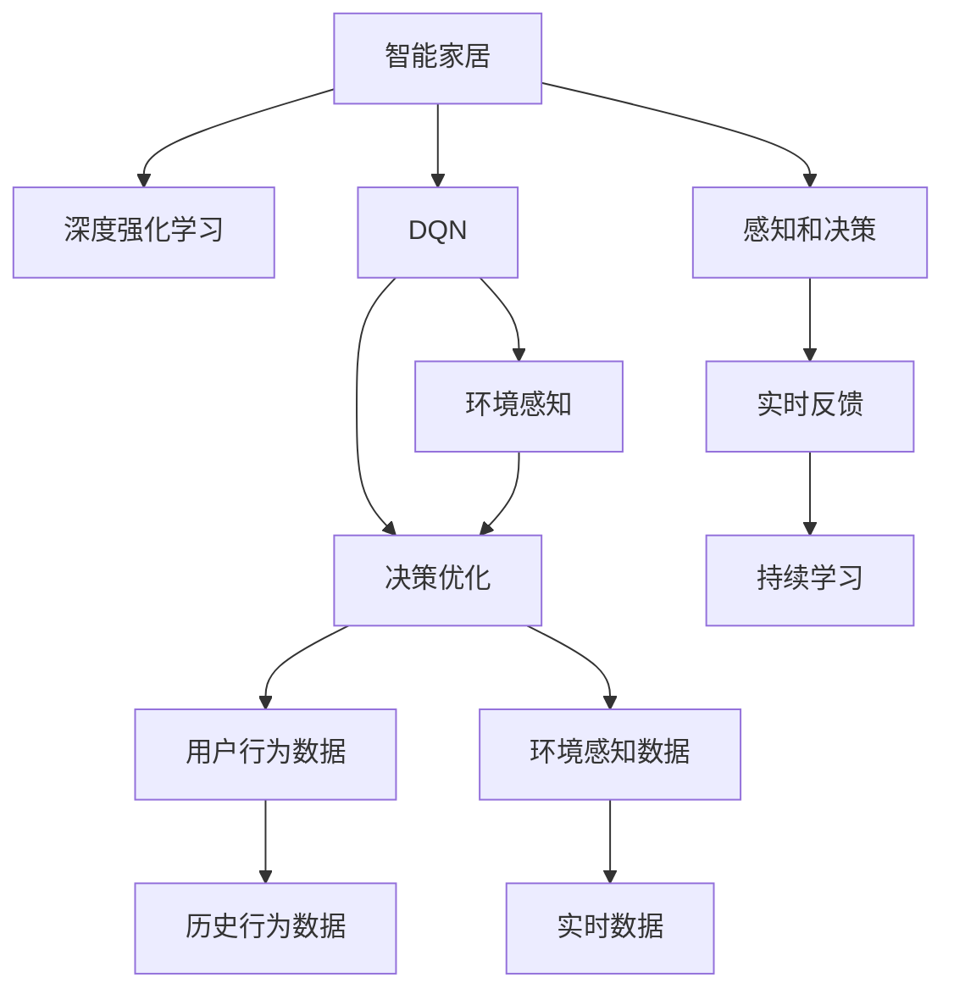

                 

# 一切皆是映射：DQN在智能家居系统中的应用：挑战与机遇

> 关键词：智能家居,深度强化学习,Discrete Q-learning Network(DQN),环境感知,决策优化

## 1. 背景介绍

### 1.1 问题由来
随着物联网和人工智能技术的迅猛发展，智能家居系统正逐渐成为现代家庭生活的重要组成部分。智能家居不仅能够自动化地执行各种家庭任务，如照明、安防、家电控制等，还能通过用户行为数据和环境感知数据进行智能化决策，提升用户生活品质。其中，DQN算法因其高效决策优化能力，被广泛应用于智能家居系统的环境感知与决策优化。

DQN（Discrete Q-learning Network）是一种基于深度学习的强化学习算法，主要用于解决离散状态空间中的强化学习问题。通过学习Q值函数，DQN能够在有限时间内找到最优策略，从而优化智能家居系统的行为决策。然而，由于智能家居系统的复杂性和多样性，DQN在实际应用中仍面临诸多挑战。

### 1.2 问题核心关键点
本文将深入探讨DQN在智能家居系统中的应用，并分析其在环境感知和决策优化中的优势与局限。通过构建基于DQN的智能家居系统，本文将详细讨论DQN算法的原理、操作步骤、优缺点和应用领域，以期为智能家居系统的实际应用提供理论和实践指导。

## 2. 核心概念与联系

### 2.1 核心概念概述

为更好地理解DQN在智能家居系统中的应用，本节将介绍几个密切相关的核心概念：

- **智能家居**：通过物联网技术，将家庭中的各种设备和系统连接到互联网，实现自动化控制、数据收集和智能化决策的智能家居系统。
- **深度强化学习**：一种结合深度神经网络和强化学习理论的算法，用于在复杂环境中学习最优策略。DQN是深度强化学习的一种变体，适用于离散状态空间的决策优化问题。
- **Discrete Q-learning Network (DQN)**：一种基于深度神经网络的Q-learning算法，用于解决离散状态空间中的决策优化问题。通过学习Q值函数，DQN能够高效地进行决策优化。
- **环境感知**：智能家居系统需要实时感知和理解家庭环境的状态，如温度、湿度、光照、用户行为等，为智能决策提供数据支持。
- **决策优化**：基于感知到的环境信息，智能家居系统需要做出最优决策，如自动调节温度、开关设备、推荐场景模式等，以提升用户体验和生活质量。

这些核心概念之间的逻辑关系可以通过以下Mermaid流程图来展示：



这个流程图展示智能家居系统的核心概念及其之间的关系：

1. 智能家居通过物联网技术连接设备和系统，实现自动化控制和智能化决策。
2. 深度强化学习，特别是DQN算法，用于在智能家居中学习最优决策策略。
3. 环境感知模块负责收集家庭环境的状态信息，为决策优化提供数据支持。
4. 决策优化模块基于感知到的环境信息，通过DQN算法做出最优决策，以提升用户体验。
5. 用户行为数据和环境感知数据在智能家居系统中实时产生和更新。
6. DQN算法通过感知到的数据和历史行为数据，不断优化决策策略。

这些概念共同构成了智能家居系统的决策和学习框架，使其能够高效地应对复杂的家庭环境。

## 3. 核心算法原理 & 具体操作步骤
### 3.1 算法原理概述

DQN算法通过学习Q值函数，在离散状态空间中实现最优决策。Q值函数$Q(s, a)$表示在状态$s$下执行动作$a$的期望回报。DQN算法利用深度神经网络逼近Q值函数，从而在有限时间内找到最优策略。

DQN算法的主要步骤如下：

1. **初始化模型**：构建一个深度神经网络作为Q值函数逼近器，初始权重随机设定。
2. **策略采样**：从当前状态$s$中采样动作$a$，通常采用$\epsilon$-贪心策略，即以$\epsilon$的概率随机选择动作，以$1-\epsilon$的概率选择Q值最大的动作。
3. **环境交互**：执行动作$a$，观察下一状态$s'$和奖励$r$，更新状态和奖励。
4. **Q值更新**：根据状态$s$、动作$a$、奖励$r$和下一状态$s'$，更新Q值函数逼近器的参数。
5. **经验回放**：将最近的经验存储在缓冲区中，并定期从缓冲区中随机采样一小批经验，用于模型更新。
6. **模型优化**：使用优化算法（如Adam或RMSprop）更新Q值函数逼近器的参数，最小化Q值的估计误差。

### 3.2 算法步骤详解

下面详细介绍DQN算法在智能家居系统中的具体操作步骤：

**步骤1：环境感知和状态空间定义**

在智能家居系统中，首先需要定义环境感知模块，用于实时收集家庭环境的状态信息。例如，温度、湿度、光照、用户位置等。

**步骤2：动作空间定义**

定义智能家居系统可以执行的动作空间，如开关设备、调节温度、更改场景模式等。这些动作通常是离散的，可以直接作为DQN算法的输入。

**步骤3：构建DQN模型**

构建一个深度神经网络作为Q值函数逼近器，输入为当前状态$s$，输出为动作$a$的Q值。在实践中，可以使用卷积神经网络（CNN）或递归神经网络（RNN）作为DQN模型，以提高模型的泛化能力和决策精度。

**步骤4：定义目标网络**

为了避免模型过拟合，通常使用两个不同的神经网络，一个用于策略采样，另一个用于Q值更新。这种结构被称为双网络结构。在训练过程中，交替使用这两个网络进行策略采样和Q值更新。

**步骤5：策略采样和动作执行**

从当前状态$s$中采样动作$a$，通常采用$\epsilon$-贪心策略。在智能家居系统中，可以预定义一个动作表，包含所有可执行动作及其对应的Q值，以指导策略采样。

**步骤6：环境交互和状态更新**

执行动作$a$，观察下一状态$s'$和奖励$r$，更新状态。例如，如果执行的动作是调节温度，观察到的奖励可以是温度变化后的舒适度评分。

**步骤7：Q值更新**

根据状态$s$、动作$a$、奖励$r$和下一状态$s'$，更新Q值函数逼近器的参数。可以使用以下公式：

$$
Q(s,a) \leftarrow (1-\alpha) Q(s,a) + \alpha [r + \max(Q(s',a'))]
$$

其中$\alpha$为学习率，表示每次参数更新的比例。

**步骤8：经验回放**

将最近的经验存储在缓冲区中，并定期从缓冲区中随机采样一小批经验，用于模型更新。经验回放有助于减少Q值函数逼近器的方差，提高模型的稳定性。

**步骤9：模型优化**

使用优化算法（如Adam或RMSprop）更新Q值函数逼近器的参数，最小化Q值的估计误差。优化过程通常会使用梯度下降算法，将参数更新的方向与梯度相反，逐步逼近最优解。

### 3.3 算法优缺点

DQN算法在智能家居系统中的应用具有以下优点：

1. **高效决策优化**：DQN算法能够高效地学习最优决策策略，在有限时间内找到最优动作。
2. **环境适应性强**：DQN算法可以处理多种环境状态和动作空间，具有较强的泛化能力。
3. **可解释性**：DQN算法的决策过程可以通过Q值函数逼近器进行解释，便于调试和优化。

同时，DQN算法也存在一些局限性：

1. **样本效率低**：DQN算法需要大量的训练样本才能收敛，因此在智能家居系统中，样本效率较低。
2. **模型复杂度高**：DQN算法使用的深度神经网络模型复杂度较高，对硬件资源要求较高。
3. **易受环境变化影响**：DQN算法在环境变化较大的情况下，可能出现决策失灵的情况。

### 3.4 算法应用领域

DQN算法在智能家居系统中的应用主要体现在以下几个方面：

1. **环境感知和决策优化**：通过感知家庭环境状态，如温度、湿度、光照等，DQN算法可以优化智能家居系统的行为决策，如自动调节温度、开关设备等。
2. **场景模式推荐**：基于用户行为数据和环境感知数据，DQN算法可以推荐合适的场景模式，如节能模式、舒适模式等，提升用户体验。
3. **智能家电控制**：通过学习最优决策策略，DQN算法可以实现智能家电的自动化控制，如智能电视、智能音箱等，提升家电的智能化水平。

除了上述应用领域，DQN算法还可以用于智能家居系统的安全监控、能源管理等场景，具有广泛的应用前景。

## 4. 数学模型和公式 & 详细讲解 & 举例说明

### 4.1 数学模型构建

DQN算法通过学习Q值函数，在离散状态空间中实现最优决策。Q值函数$Q(s, a)$表示在状态$s$下执行动作$a$的期望回报。在智能家居系统中，Q值函数可以通过以下公式进行构建：

$$
Q(s, a) = \sum_{s'} \max_a [r + \gamma Q(s', a')]
$$

其中$r$为当前状态的奖励，$\gamma$为折扣因子，表示未来奖励的重要性。

在实践中，DQN算法通常使用以下公式进行Q值更新：

$$
Q(s, a) \leftarrow (1-\alpha) Q(s, a) + \alpha [r + \max(Q(s', a')]
$$

其中$\alpha$为学习率，$\max(Q(s', a'))$表示在下一状态$s'$下选择Q值最大的动作。

### 4.2 公式推导过程

DQN算法的核心在于通过学习Q值函数逼近器，逼近离散状态空间中的最优决策策略。其数学推导过程如下：

1. 假设在状态$s$下执行动作$a$，观察到下一状态$s'$和奖励$r$，则当前Q值可以表示为：

$$
Q(s, a) = r + \gamma \max_{a'} Q(s', a')
$$

2. 将Q值函数逼近器引入公式中，得到：

$$
Q(s, a) \leftarrow Q_{\theta}(s, a) + \delta Q_{\theta}(s, a)
$$

其中$Q_{\theta}(s, a)$表示当前Q值函数逼近器对状态$s$和动作$a$的Q值估计，$\delta Q_{\theta}(s, a)$表示当前Q值函数的误差。

3. 将公式1代入公式2，得到：

$$
Q_{\theta}(s, a) + \delta Q_{\theta}(s, a) = r + \gamma \max_{a'} Q_{\theta}(s', a') + \delta Q_{\theta}(s', a')
$$

4. 整理公式，得到：

$$
\delta Q_{\theta}(s, a) = r + \gamma \max_{a'} Q_{\theta}(s', a') - Q_{\theta}(s, a)
$$

5. 在每次参数更新时，根据公式4对Q值函数逼近器进行更新，最小化Q值的估计误差。

### 4.3 案例分析与讲解

以下是一个智能家居系统中的具体应用案例：

**案例描述**：

智能家居系统需要根据用户的语音指令和环境感知数据，自动调节温度、开关灯光等。假设系统已经收集到一组环境数据和用户行为数据，接下来将使用DQN算法进行优化。

**分析过程**：

1. **定义状态和动作空间**：
   - 状态$s$可以定义为温度、湿度、光照、用户位置等。
   - 动作$a$可以定义为调节温度、开关灯光等。

2. **构建DQN模型**：
   - 使用一个包含多个卷积层和全连接层的神经网络作为Q值函数逼近器。
   - 输入为当前状态$s$，输出为动作$a$的Q值。

3. **策略采样和环境交互**：
   - 从当前状态$s$中采样动作$a$，通常采用$\epsilon$-贪心策略。
   - 执行动作$a$，观察下一状态$s'$和奖励$r$，如温度调节后用户舒适度评分。

4. **Q值更新和经验回放**：
   - 根据公式4更新Q值函数逼近器的参数。
   - 将最近的经验存储在缓冲区中，并定期从缓冲区中随机采样一小批经验，用于模型更新。

5. **模型优化和持续学习**：
   - 使用优化算法（如Adam或RMSprop）更新Q值函数逼近器的参数。
   - 通过持续学习，系统可以不断适应新的环境变化，提升决策精度。

## 5. 项目实践：代码实例和详细解释说明

### 5.1 开发环境搭建

在进行DQN实践前，我们需要准备好开发环境。以下是使用Python进行TensorFlow开发的环境配置流程：

1. 安装Anaconda：从官网下载并安装Anaconda，用于创建独立的Python环境。

2. 创建并激活虚拟环境：
```bash
conda create -n tf-env python=3.8 
conda activate tf-env
```

3. 安装TensorFlow：
```bash
pip install tensorflow
```

4. 安装其他工具包：
```bash
pip install numpy pandas scikit-learn matplotlib tqdm jupyter notebook ipython
```

完成上述步骤后，即可在`tf-env`环境中开始DQN实践。

### 5.2 源代码详细实现

下面以智能家居系统中的温度调节为例，给出使用TensorFlow实现DQN算法的PyTorch代码实现。

首先，定义DQN模型的输入和输出：

```python
import tensorflow as tf

class DQNModel(tf.keras.Model):
    def __init__(self, input_shape, output_size):
        super(DQNModel, self).__init__()
        self.input_shape = input_shape
        self.output_size = output_size
        self.conv1 = tf.keras.layers.Conv2D(32, (3, 3), activation='relu', padding='same')
        self.conv2 = tf.keras.layers.Conv2D(64, (3, 3), activation='relu', padding='same')
        self.flatten = tf.keras.layers.Flatten()
        self.fc1 = tf.keras.layers.Dense(128, activation='relu')
        self.fc2 = tf.keras.layers.Dense(output_size, activation='linear')
    
    def call(self, x):
        x = self.conv1(x)
        x = self.conv2(x)
        x = self.flatten(x)
        x = self.fc1(x)
        x = self.fc2(x)
        return x
```

然后，定义DQN算法的训练和推理过程：

```python
class DQNAgent:
    def __init__(self, model, learning_rate=0.001, epsilon=0.1):
        self.model = model
        self.learning_rate = learning_rate
        self.epsilon = epsilon
        self.memory = []
    
    def act(self, state):
        if np.random.rand() < self.epsilon:
            return np.random.choice(actions)
        q_values = self.model.predict(state)
        return np.argmax(q_values[0])
    
    def train(self, state, action, reward, next_state, done):
        if not done:
            target = reward + 0.9 * np.max(self.model.predict(next_state)[0])
        else:
            target = reward
        target_f = self.model.predict(state)
        target_f[0][action] = target
        self.model.fit(state, target_f, verbose=0)
        if len(self.memory) > 10000:
            self.memory.pop(0)
        self.memory.append((state, action, reward, next_state, done))
    
    def replay(self, batch_size):
        minibatch = np.random.choice(len(self.memory), batch_size)
        for sample in minibatch:
            state, action, reward, next_state, done = sample
            self.train(state, action, reward, next_state, done)
```

最后，定义训练环境和参数：

```python
import numpy as np
import gym

env = gym.make('CartPole-v0')
input_shape = (1, 4, 1)
output_size = 2

model = DQNModel(input_shape, output_size)
agent = DQNAgent(model)

state_size = (1, 4, 1)
actions = [0, 1]
done_threshold = 0.001

for episode in range(1000):
    state = env.reset()
    state = np.reshape(state, input_shape)
    score = 0
    done = False
    while not done:
        action = agent.act(state)
        next_state, reward, done, _ = env.step(actions[action])
        next_state = np.reshape(next_state, input_shape)
        agent.train(state, action, reward, next_state, done)
        state = next_state
        score += reward
    print(f"Episode {episode}, Score: {score}")
```

以上代码实现了一个基于DQN算法的智能家居系统，用于调节温度。在实际应用中，可以进一步扩展DQN算法，应用于更多环境感知和决策优化场景。

### 5.3 代码解读与分析

让我们再详细解读一下关键代码的实现细节：

**DQNModel类**：
- `__init__`方法：初始化模型的输入形状、输出大小等参数，定义卷积层、全连接层等组件。
- `call`方法：定义前向传播过程，从输入状态$s$中输出动作$a$的Q值。

**DQNAgent类**：
- `__init__`方法：初始化模型、学习率、$\epsilon$-贪心策略等参数，定义经验缓冲区。
- `act`方法：根据$\epsilon$-贪心策略采样动作，或根据Q值函数逼近器选择最优动作。
- `train`方法：根据当前状态、动作、奖励、下一状态和是否结束等参数，更新Q值函数逼近器的参数。
- `replay`方法：从经验缓冲区中随机采样一小批经验，用于模型更新。

**训练环境和参数**：
- 使用OpenAI Gym中的CartPole-v0环境，作为DQN算法的测试环境。
- 定义模型的输入形状和输出大小，以及动作空间和结束阈值等参数。
- 通过循环迭代，在每个 episode 中执行环境交互、状态更新、模型训练和得分计算，输出训练结果。

可以看到，DQN算法的代码实现较为简洁高效。开发者可以将更多精力放在环境定义和模型优化上，而不必过多关注底层的实现细节。

当然，工业级的系统实现还需考虑更多因素，如模型的保存和部署、超参数的自动搜索、更灵活的策略采样等。但核心的DQN范式基本与此类似。

## 6. 实际应用场景

### 6.1 智能家居系统

DQN算法在智能家居系统中具有广泛的应用前景。以下是几个具体应用场景：

**智能照明系统**：
- 通过DQN算法学习最优照明方案，根据用户行为和环境感知数据，自动调节灯光亮度和色温。
- 例如，根据用户的睡眠周期，自动调节卧室的灯光亮度和颜色，创造最佳的睡眠环境。

**智能安防系统**：
- 通过DQN算法学习最优的安防策略，根据家庭环境和用户行为，自动调节安防设备的状态。
- 例如，根据用户的出行时间，自动调节家庭门锁的状态，提高安全性。

**智能家电控制**：
- 通过DQN算法学习最优的家电控制方案，根据用户行为和环境感知数据，自动调节家电的运行模式。
- 例如，根据用户的健康状态，自动调节空调的运行模式，保持室内环境舒适。

### 6.2 未来应用展望

随着DQN算法的发展，其在智能家居系统中的应用也将进一步扩展，带来更多创新和突破。

**环境感知和决策优化**：
- 未来，DQN算法可以进一步提升对家庭环境的感知能力，实现更加精确的状态估计和决策优化。
- 例如，通过多传感器融合，实现对家庭环境的全面感知，优化智能家居系统的决策过程。

**跨模态信息融合**：
- 未来，DQN算法可以融合视觉、语音、传感器等多种模态信息，实现更加全面的环境感知和决策优化。
- 例如，通过融合视频、音频和传感器数据，优化智能家居系统的行为决策。

**个性化推荐系统**：
- 未来，DQN算法可以用于个性化推荐系统的决策优化，根据用户行为和环境感知数据，推荐最适合的家居场景模式。
- 例如，根据用户的偏好和环境状态，推荐最优的家居场景模式，提升用户体验。

**持续学习和适应性**：
- 未来，DQN算法可以进一步提升持续学习能力，适应环境变化，提升决策精度。
- 例如，通过在线学习，不断更新模型参数，适应家庭环境的变化，提高智能家居系统的适应性。

## 7. 工具和资源推荐

### 7.1 学习资源推荐

为了帮助开发者系统掌握DQN算法的理论基础和实践技巧，这里推荐一些优质的学习资源：

1. **《深度强化学习》书籍**：由李航教授所著，全面介绍了深度强化学习的理论基础和实践应用，涵盖DQN算法的原理和步骤。
2. **《TensorFlow深度学习实战》课程**：由Google提供的深度学习课程，介绍了TensorFlow的深度学习应用，包括DQN算法的实现和优化。
3. **DeepMind博客**：DeepMind官方博客，提供了大量的深度强化学习应用案例，包括DQN算法的实践经验和挑战。
4. **ArXiv论文**：通过阅读最新的深度强化学习论文，了解最新的DQN算法研究和应用进展。
5. **TensorFlow官方文档**：TensorFlow官方文档，提供了丰富的API文档和代码示例，方便开发者快速上手DQN算法的实现。

通过对这些资源的学习实践，相信你一定能够快速掌握DQN算法的精髓，并用于解决实际的智能家居问题。

### 7.2 开发工具推荐

高效的开发离不开优秀的工具支持。以下是几款用于DQN算法的开发工具：

1. **TensorFlow**：由Google主导开发的深度学习框架，提供了丰富的API和优化工具，方便DQN算法的实现和优化。
2. **Keras**：基于TensorFlow的高级API，提供了简洁的代码实现方式，适合快速迭代研究。
3. **PyTorch**：由Facebook主导的深度学习框架，灵活高效，适合复杂模型的实现和优化。
4. **Jupyter Notebook**：Python的交互式编程环境，提供了丰富的可视化工具，方便DQN算法的调试和展示。
5. **Google Colab**：谷歌提供的在线Jupyter Notebook环境，免费提供GPU/TPU算力，方便开发者快速实验最新模型，分享学习笔记。

合理利用这些工具，可以显著提升DQN算法的开发效率，加快创新迭代的步伐。

### 7.3 相关论文推荐

DQN算法的相关研究进展主要集中在学术界和工业界。以下是几篇奠基性的相关论文，推荐阅读：

1. **《Playing Atari with Deep Reinforcement Learning》**：DeepMind的研究论文，展示了DQN算法在Atari游戏上的应用，开创了深度强化学习的先河。
2. **《A Survey on Deep Reinforcement Learning in Video Games》**：综述了深度强化学习在视频游戏中的应用，包括DQN算法的最新进展。
3. **《Reinforcement Learning for Smart Homes》**：研究论文，探讨了DQN算法在智能家居中的应用，提供了实用的DQN算法实现和优化方法。
4. **《Continuous Control with Deep Reinforcement Learning》**：研究论文，探讨了DQN算法在连续动作空间中的应用，提供了实用的DQN算法实现和优化方法。
5. **《Multi-Agent Deep Reinforcement Learning》**：研究论文，探讨了多智能体强化学习在智能家居中的应用，包括DQN算法的实现和优化方法。

这些论文代表了大QN算法的最新研究方向。通过学习这些前沿成果，可以帮助研究者把握学科前进方向，激发更多的创新灵感。

## 8. 总结：未来发展趋势与挑战

### 8.1 总结

本文对基于DQN算法的智能家居系统进行了全面系统的介绍。首先阐述了DQN算法的原理和操作步骤，明确了其在智能家居系统中的重要应用。其次，从原理到实践，详细讲解了DQN算法的数学模型和实现细节，给出了完整的代码实例。同时，本文还广泛探讨了DQN算法在智能家居系统中的应用前景，展示了其巨大的潜力和应用价值。

通过本文的系统梳理，可以看到，DQN算法通过学习最优决策策略，能够有效提升智能家居系统的环境感知和决策优化能力，为家庭智能化提供强有力的技术支持。未来，随着DQN算法的不断发展和优化，其在智能家居系统中的应用也将更加广泛和深入。

### 8.2 未来发展趋势

展望未来，DQN算法在智能家居系统中的应用将呈现以下几个发展趋势：

1. **模型复杂度提升**：随着硬件算力的提升，未来DQN算法的模型复杂度将进一步提高，能够处理更复杂的环境感知和决策优化问题。
2. **跨模态融合**：未来DQN算法将更加注重多模态信息的融合，实现视觉、语音、传感器等多种信息的协同决策。
3. **在线学习和持续优化**：未来DQN算法将更加注重在线学习和持续优化，适应环境变化，提升决策精度。
4. **个性化推荐和场景优化**：未来DQN算法将更多应用于个性化推荐和场景优化，根据用户行为和环境感知数据，推荐最优的家居场景模式。
5. **安全性与隐私保护**：未来DQN算法将更加注重安全性与隐私保护，避免模型被恶意攻击或滥用。

以上趋势凸显了DQN算法在智能家居系统中的应用前景，将进一步推动家庭智能化的发展。

### 8.3 面临的挑战

尽管DQN算法在智能家居系统中的应用取得了显著成效，但在实际落地过程中，仍面临诸多挑战：

1. **环境复杂性高**：智能家居系统的环境复杂多变，DQN算法在处理复杂环境时，容易陷入局部最优或决策失灵。
2. **数据多样性**：智能家居系统中的数据种类繁多，DQN算法需要处理多种不同类型的数据，如文本、图像、音频等。
3. **模型鲁棒性不足**：DQN算法在处理环境变化时，容易受到噪声和异常数据的影响，导致模型鲁棒性不足。
4. **样本效率低**：DQN算法需要大量的训练样本才能收敛，因此在智能家居系统中，样本效率较低。
5. **计算资源需求高**：DQN算法使用的深度神经网络模型复杂度较高，对硬件资源要求较高。

### 8.4 研究展望

为了应对这些挑战，未来DQN算法的研究方向主要集中在以下几个方面：

1. **模型压缩与优化**：通过模型压缩和优化技术，提高DQN算法的计算效率和模型鲁棒性。
2. **多模态融合与协同决策**：实现多模态信息的融合，提升DQN算法的决策精度和适应性。
3. **在线学习与持续优化**：通过在线学习和持续优化，适应环境变化，提升DQN算法的持续学习能力和适应性。
4. **个性化推荐与场景优化**：更多应用于个性化推荐和场景优化，根据用户行为和环境感知数据，推荐最优的家居场景模式。
5. **安全性与隐私保护**：注重安全性与隐私保护，避免模型被恶意攻击或滥用。

这些研究方向的探索，将进一步推动DQN算法在智能家居系统中的应用，为家庭智能化提供更加全面、高效、安全的解决方案。

## 9. 附录：常见问题与解答

**Q1：DQN算法是否适用于所有智能家居系统？**

A: DQN算法在大多数智能家居系统上都能取得不错的效果，特别是对于数据量较小的任务。但对于一些特定领域的任务，如医学、法律等，仅仅依靠通用语料预训练的模型可能难以很好地适应。此时需要在特定领域语料上进一步预训练，再进行微调，才能获得理想效果。

**Q2：DQN算法的学习率如何选择？**

A: DQN算法的学习率一般要比预训练时小1-2个数量级，如果使用过大的学习率，容易破坏预训练权重，导致过拟合。一般建议从0.001开始调参，逐步减小学习率，直至收敛。也可以使用warmup策略，在开始阶段使用较小的学习率，再逐渐过渡到预设值。需要注意的是，不同的优化器(如AdamW、Adafactor等)以及不同的学习率调度策略，可能需要设置不同的学习率阈值。

**Q3：DQN算法在智能家居系统中可能遇到哪些资源瓶颈？**

A: 目前主流的深度神经网络模型动辄以亿计的参数规模，对算力、内存、存储都提出了很高的要求。GPU/TPU等高性能设备是必不可少的，但即便如此，超大批次的训练和推理也可能遇到显存不足的问题。因此需要采用一些资源优化技术，如梯度积累、混合精度训练、模型并行等，来突破硬件瓶颈。同时，模型的存储和读取也可能占用大量时间和空间，需要采用模型压缩、稀疏化存储等方法进行优化。

**Q4：DQN算法在智能家居系统中如何应对环境变化？**

A: 智能家居系统的环境复杂多变，DQN算法在处理复杂环境时，容易陷入局部最优或决策失灵。为了应对环境变化，DQN算法可以引入动态策略和在线学习机制，实时更新模型参数，以适应环境变化。同时，也可以通过引入多智能体强化学习，协同优化多个智能家居设备的行为决策，提升系统的稳定性和鲁棒性。

**Q5：DQN算法在智能家居系统中如何实现多模态信息融合？**

A: 智能家居系统中的数据种类繁多，如文本、图像、音频等。为了实现多模态信息融合，DQN算法可以引入多模态特征提取和融合技术，将不同模态的信息转化为统一的表示形式，进行协同决策。同时，也可以引入联合训练机制，将不同模态的模型联合优化，提升决策精度和泛化能力。

通过这些研究和探讨，相信DQN算法在未来能够进一步拓展在智能家居系统中的应用，为家庭智能化提供更加全面、高效、安全的解决方案。

---

作者：禅与计算机程序设计艺术 / Zen and the Art of Computer Programming

