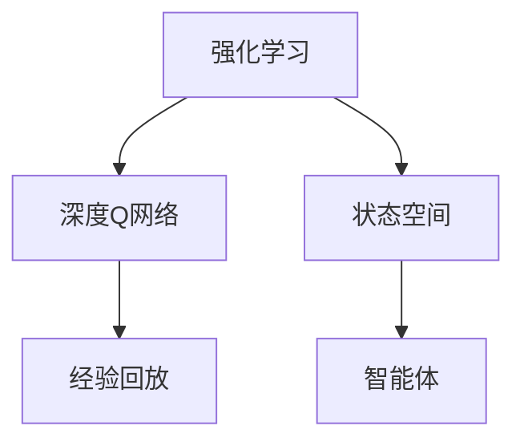

                 

# 一切皆是映射：DQN的经验回放机制：原理与实践细节

> 关键词：强化学习,深度Q网络(DQN),经验回放,算法原理,实践细节

## 1. 背景介绍

### 1.1 问题由来

在强化学习领域，深度Q网络(DQN)是一种基于深度神经网络的强化学习算法。其核心思想是通过Q值函数的逼近，来实现Q值的最大化，进而指导智能体采取最优策略。然而，DQN在实际应用中存在一些瓶颈问题，例如：样本噪声大、收敛速度慢、不稳定等。为了克服这些问题，经验回放机制被引入到DQN中，有效地解决了这些难题。

### 1.2 问题核心关键点

经验回放机制的核心思想是：将智能体在不同时间步获取的样本存储起来，然后随机从中抽取样本进行训练。这不仅减少了样本噪声，提高了训练的稳定性，还能加速训练过程。此外，经验回放机制还能在非线性模型和无限状态空间中发挥重要作用。

## 2. 核心概念与联系

### 2.1 核心概念概述

为更好地理解经验回放机制的原理，本节将介绍几个密切相关的核心概念：

- 强化学习(Reinforcement Learning, RL)：一种通过智能体与环境的交互，实现特定目标的机器学习方法。智能体根据接收到的环境奖励，不断调整其策略以最大化累积回报。

- 深度Q网络(Depth-Q Network, DQN)：一种结合深度神经网络和Q学习的强化学习算法，通过神经网络逼近Q值函数，指导智能体选择最优动作。

- 经验回放(Experience Replay)：一种强化学习中常用的技巧，通过随机从经验集合中抽取样本进行训练，减少样本噪声，提高模型稳定性和训练速度。

- 状态空间(State Space)：强化学习中智能体所处的所有可能状态集合，可以是一维的、多维的甚至是无限的。

这些核心概念之间的逻辑关系可以通过以下Mermaid流程图来展示：



这个流程图展示了这个核心概念之间的联系和逻辑关系：

1. 强化学习是通过智能体与环境的交互，实现特定目标的机器学习方法。
2. 深度Q网络是一种结合深度神经网络和Q学习的强化学习算法，通过神经网络逼近Q值函数，指导智能体选择最优动作。
3. 经验回放是一种强化学习中常用的技巧，通过随机从经验集合中抽取样本进行训练，减少样本噪声，提高模型稳定性和训练速度。
4. 状态空间是指智能体所处的所有可能状态集合，可以是一维的、多维的甚至是无限的。

这些概念共同构成了DQN的经验回放机制，使其能够在复杂环境中学习最优策略。

## 3. 核心算法原理 & 具体操作步骤
### 3.1 算法原理概述

DQN的经验回放机制，旨在解决样本噪声大和训练不稳定等问题。具体来说，通过将智能体在不同时间步获取的样本存储起来，然后随机从中抽取样本进行训练，减少了样本噪声，提高了模型稳定性，同时加速了训练过程。

DQN的经验回放机制一般包括以下几个步骤：

1. 存储样本：在每个时间步，智能体观察环境状态，执行动作并接收奖励。将这一时间步的状态、动作、奖励和下一个状态作为样本，存储到一个经验回放缓冲区中。
2. 随机抽取：从经验回放缓冲区中随机抽取一定数量的样本进行训练。
3. 更新Q值：使用抽取的样本，更新神经网络参数，以逼近Q值函数。
4. 更新目标Q值：使用更新后的Q值函数，计算下一个状态的最大Q值。

### 3.2 算法步骤详解

以下详细讲解DQN的经验回放机制的具体步骤：

#### 3.2.1 样本存储

在每个时间步，智能体观察环境状态 $s_t$，执行动作 $a_t$，接收奖励 $r_{t+1}$，并观察下一个状态 $s_{t+1}$。将这些信息组成一个元组 $(s_t, a_t, r_{t+1}, s_{t+1})$，将其存储到经验回放缓冲区中。

#### 3.2.2 样本抽取

从经验回放缓冲区中随机抽取一个大小为 $B$ 的样本集合，表示为 $(s_{t_i}, a_{t_i}, r_{t_i+1}, s_{t_i+1})_{i=1}^B$。

#### 3.2.3 更新Q值

使用抽取的样本，计算每个动作的Q值估计，即 $Q(s_{t_i}, a_{t_i}) = r_{t_i+1} + \gamma \max_a Q(s_{t_i+1}, a)$。其中 $\gamma$ 是折扣因子，通常取0.99。

使用softmax函数计算当前动作的概率分布，即 $\pi_{\theta}(a_t|s_t) = \frac{\exp(Q(s_t, a_t))}{\sum_{a} \exp(Q(s_t, a))}$。

将当前动作 $a_t$ 更新为概率分布 $\pi_{\theta}$ 下选择的新动作 $a_t'$，即 $a_t' = \pi_{\theta}(a|s_t)$。

使用当前动作 $a_t$ 和更新后的动作 $a_t'$ 更新神经网络参数，即 $\theta \leftarrow \theta - \eta \nabla_{\theta}L(s_t, a_t, r_{t+1}, s_{t+1})$，其中 $L$ 是交叉熵损失函数。

#### 3.2.4 更新目标Q值

使用更新后的Q值函数，计算下一个状态的最大Q值，即 $Q_{\theta^{-}}(s_{t+1}, a_{t+1}) = r_{t+1} + \gamma \max_a Q(s_{t+1}, a)$。

将下一个状态的最大Q值作为目标值，更新神经网络参数，即 $\theta^{-} \leftarrow \theta^{-} - \eta^{-} \nabla_{\theta^{-}}L_{\theta^{-}}(s_{t+1}, a_{t+1})$。

### 3.3 算法优缺点

DQN的经验回放机制具有以下优点：

1. 减少样本噪声：经验回放机制通过从经验集合中随机抽取样本进行训练，减少了样本噪声，提高了训练稳定性。
2. 加速训练速度：经验回放机制将样本存储在缓冲区中，使用过程中不需要实时从环境中获取样本，加速了训练过程。
3. 提高模型稳定性：经验回放机制使得训练过程不再受限于即时样本，能够更好地应对非线性模型和无限状态空间。

同时，该机制也存在一些缺点：

1. 存储成本高：经验回放机制需要将样本存储在缓冲区中，缓冲区大小受限于内存限制，增加了存储成本。
2. 过度拟合风险：如果缓冲区样本过少，可能存在过度拟合的风险。
3. 计算量大：从缓冲区中抽取样本进行训练，增加了计算量，需要更多的计算资源。

尽管存在这些缺点，但经验回放机制在DQN中的应用效果显著，已成为DQN不可或缺的一部分。

### 3.4 算法应用领域

DQN的经验回放机制在强化学习领域得到了广泛应用，涉及诸多应用场景，例如：

- 游戏智能体：如AlphaGo、AlphaGo Zero等，通过经验回放机制学习最优策略，赢得复杂游戏。
- 机器人控制：如RoboCup足球机器人、无人机控制等，通过经验回放机制训练智能体控制决策。
- 自动驾驶：如Waymo自动驾驶汽车、Tesla Autopilot等，通过经验回放机制训练模型感知和决策。
- 金融交易：如程序交易策略、量化投资等，通过经验回放机制训练策略模型，优化交易策略。

除了上述这些经典应用外，经验回放机制还广泛应用于其他各类强化学习任务中，为智能体的决策提供了更加可靠和稳定的指导。

## 4. 数学模型和公式 & 详细讲解 & 举例说明

### 4.1 数学模型构建

在DQN中，经验回放机制的数学模型主要涉及样本存储、样本抽取、Q值更新和目标Q值更新四个部分。以下是对这些部分的详细数学建模。

#### 4.1.1 样本存储

在每个时间步，智能体观察环境状态 $s_t$，执行动作 $a_t$，接收奖励 $r_{t+1}$，并观察下一个状态 $s_{t+1}$。将这些信息组成一个元组 $(s_t, a_t, r_{t+1}, s_{t+1})$，将其存储到经验回放缓冲区中。

#### 4.1.2 样本抽取

从经验回放缓冲区中随机抽取一个大小为 $B$ 的样本集合，表示为 $(s_{t_i}, a_{t_i}, r_{t_i+1}, s_{t_i+1})_{i=1}^B$。

#### 4.1.3 Q值更新

使用抽取的样本，计算每个动作的Q值估计，即 $Q(s_{t_i}, a_{t_i}) = r_{t_i+1} + \gamma \max_a Q(s_{t_i+1}, a)$。其中 $\gamma$ 是折扣因子，通常取0.99。

使用softmax函数计算当前动作的概率分布，即 $\pi_{\theta}(a_t|s_t) = \frac{\exp(Q(s_t, a_t))}{\sum_{a} \exp(Q(s_t, a))}$。

将当前动作 $a_t$ 更新为概率分布 $\pi_{\theta}$ 下选择的新动作 $a_t'$，即 $a_t' = \pi_{\theta}(a|s_t)$。

使用当前动作 $a_t$ 和更新后的动作 $a_t'$ 更新神经网络参数，即 $\theta \leftarrow \theta - \eta \nabla_{\theta}L(s_t, a_t, r_{t+1}, s_{t+1})$，其中 $L$ 是交叉熵损失函数。

#### 4.1.4 目标Q值更新

使用更新后的Q值函数，计算下一个状态的最大Q值，即 $Q_{\theta^{-}}(s_{t+1}, a_{t+1}) = r_{t+1} + \gamma \max_a Q(s_{t+1}, a)$。

将下一个状态的最大Q值作为目标值，更新神经网络参数，即 $\theta^{-} \leftarrow \theta^{-} - \eta^{-} \nabla_{\theta^{-}}L_{\theta^{-}}(s_{t+1}, a_{t+1})$。

### 4.2 公式推导过程

以下是DQN经验回放机制的公式推导过程：

假设智能体在状态 $s_t$ 时执行动作 $a_t$，接收奖励 $r_{t+1}$，并观察下一个状态 $s_{t+1}$。定义智能体的状态表示为 $s_t \in \mathcal{S}$，动作表示为 $a_t \in \mathcal{A}$，奖励表示为 $r_{t+1} \in \mathcal{R}$，下一个状态表示为 $s_{t+1} \in \mathcal{S}$。

1. 样本存储：
   $$
   D = \{(s_t, a_t, r_{t+1}, s_{t+1})\}_{t=1}^T
   $$
2. 样本抽取：
   $$
   B = \{(s_{t_i}, a_{t_i}, r_{t_i+1}, s_{t_i+1})_{i=1}^B\} \sim D
   $$
3. Q值更新：
   $$
   Q(s_{t_i}, a_{t_i}) = r_{t_i+1} + \gamma \max_a Q(s_{t_i+1}, a)
   $$
   $$
   \pi_{\theta}(a_t|s_t) = \frac{\exp(Q(s_t, a_t))}{\sum_{a} \exp(Q(s_t, a))}
   $$
   $$
   a_t' = \pi_{\theta}(a|s_t)
   $$
   $$
   \theta \leftarrow \theta - \eta \nabla_{\theta}L(s_t, a_t, r_{t+1}, s_{t+1})
   $$
4. 目标Q值更新：
   $$
   Q_{\theta^{-}}(s_{t+1}, a_{t+1}) = r_{t+1} + \gamma \max_a Q(s_{t+1}, a)
   $$
   $$
   \theta^{-} \leftarrow \theta^{-} - \eta^{-} \nabla_{\theta^{-}}L_{\theta^{-}}(s_{t+1}, a_{t+1})
   $$

### 4.3 案例分析与讲解

以AlphaGo为例，分析经验回放机制的应用：

AlphaGo使用DQN进行策略优化。在每局比赛中，AlphaGo将当前状态 $s_t$ 和执行的动作 $a_t$ 存储到经验回放缓冲区中。在训练过程中，AlphaGo从缓冲区中随机抽取样本进行训练，更新神经网络参数。使用更新后的Q值函数，计算下一个状态的最大Q值，并更新目标Q值函数。

通过经验回放机制，AlphaGo不仅减少了样本噪声，提高了训练稳定性，还能在复杂的围棋博弈中学习最优策略，最终战胜了世界围棋冠军李世石。

## 5. 项目实践：代码实例和详细解释说明
### 5.1 开发环境搭建

在进行DQN经验回放机制的实践前，我们需要准备好开发环境。以下是使用Python进行TensorFlow开发的开发环境配置流程：

1. 安装Anaconda：从官网下载并安装Anaconda，用于创建独立的Python环境。

2. 创建并激活虚拟环境：
```bash
conda create -n tf-env python=3.8 
conda activate tf-env
```

3. 安装TensorFlow：根据CUDA版本，从官网获取对应的安装命令。例如：
```bash
conda install tensorflow=2.4
```

4. 安装其他必要工具包：
```bash
pip install numpy pandas scikit-learn matplotlib tensorflow-hub tqdm jupyter notebook ipython
```

完成上述步骤后，即可在`tf-env`环境中开始实践。

### 5.2 源代码详细实现

下面我们以简单的DQN为例，给出使用TensorFlow实现的经验回放机制的代码实现。

```python
import tensorflow as tf
import numpy as np
import random

# 定义状态和动作空间
num_states = 5
num_actions = 2

# 定义神经网络模型
class DQN:
    def __init__(self, num_states, num_actions):
        self.num_states = num_states
        self.num_actions = num_actions
        
        self.model = tf.keras.Sequential([
            tf.keras.layers.Dense(128, input_shape=(num_states, ), activation='relu'),
            tf.keras.layers.Dense(num_actions, activation='linear')
        ])
        self.target_model = tf.keras.Sequential([
            tf.keras.layers.Dense(128, input_shape=(num_states, ), activation='relu'),
            tf.keras.layers.Dense(num_actions, activation='linear')
        ])
        
        self.optimizer = tf.keras.optimizers.Adam()
        
    def choose_action(self, state, epsilon=0.1):
        if np.random.uniform() < epsilon:
            return random.choice(np.arange(num_actions))
        else:
            return self.model.predict(state)[0].argmax()
        
    def train(self, experience, target_learning_rate=0.001, target_update_frequency=1000):
        state, action, reward, next_state, done = experience
        
        next_q_values = self.target_model.predict(next_state)[0]
        max_next_q_value = np.max(next_q_values)
        
        target_q_value = reward + self.gamma * max_next_q_value
        target_q_value = tf.convert_to_tensor(target_q_value)
        q_value = self.model.predict(state)[0]
        q_value = tf.convert_to_tensor(q_value)
        q_value[np.argmax(q_value)] = target_q_value
        
        self.optimizer.apply_gradients(zip([q_value], [q_value]))
        
        if target_update_frequency > 0 and done:
            self.target_model.set_weights(self.model.get_weights())
```

在上述代码中，定义了一个简单的DQN类，包括神经网络模型、动作选择、训练等核心方法。其中，`choose_action`方法使用了epsilon-greedy策略，选择动作时以概率epsilon随机选择，以概率1-epsilon选择模型预测的动作。`train`方法使用经验回放机制，从经验集合中随机抽取样本，并更新神经网络参数。

### 5.3 代码解读与分析

让我们再详细解读一下关键代码的实现细节：

**DQN类**：
- `__init__`方法：初始化神经网络模型、优化器等核心组件。
- `choose_action`方法：根据状态和epsilon-greedy策略选择动作。
- `train`方法：使用经验回放机制，从经验集合中随机抽取样本，更新神经网络参数。

**epsilon-greedy策略**：
- `choose_action`方法使用了epsilon-greedy策略，选择动作时以概率epsilon随机选择，以概率1-epsilon选择模型预测的动作。

**经验回放机制**：
- `train`方法使用经验回放机制，从经验集合中随机抽取样本，并更新神经网络参数。

**训练过程**：
- 在`train`方法中，使用经验回放机制从经验集合中随机抽取样本，并更新神经网络参数。
- 使用更新后的Q值函数，计算下一个状态的最大Q值，并更新目标Q值函数。
- 如果target_update_frequency大于0，且当前状态为done，则将target_model的权重更新为model的权重。

这些关键方法共同构成了DQN的经验回放机制，实现了从经验集合中随机抽取样本进行训练的功能。

## 6. 实际应用场景

### 6.1 智能游戏

DQN的经验回放机制在智能游戏中得到了广泛应用，特别是AlphaGo等棋类游戏。通过经验回放机制，智能体能够从历史比赛中学习最优策略，显著提升游戏胜率。AlphaGo使用经验回放机制，从数百万局围棋比赛中学习最优策略，最终战胜了世界围棋冠军李世石。

### 6.2 机器人控制

在机器人控制领域，DQN的经验回放机制也被广泛应用。例如，使用DQN训练机器人进行足球比赛，通过经验回放机制学习最优策略，实现自主决策和控制。

### 6.3 自动驾驶

在自动驾驶领域，DQN的经验回放机制可用于训练自动驾驶模型，学习最优驾驶策略。例如，通过经验回放机制，模型能够从大量的驾驶数据中学习，提高驾驶安全性。

### 6.4 金融交易

在金融交易领域，DQN的经验回放机制可用于训练交易策略，学习最优交易策略。例如，通过经验回放机制，模型能够从历史交易数据中学习，优化交易策略，提高盈利能力。

## 7. 工具和资源推荐
### 7.1 学习资源推荐

为了帮助开发者系统掌握DQN的经验回放机制的理论基础和实践技巧，这里推荐一些优质的学习资源：

1. 《深度强化学习》书籍：由David Silver等著，系统讲解了强化学习的基本概念和算法，包括DQN和经验回放机制。

2. CS224N《强化学习》课程：斯坦福大学开设的强化学习课程，有Lecture视频和配套作业，带你入门强化学习的基本概念和经典模型。

3. OpenAI Gym：强化学习领域流行的环境库，提供了丰富的环境模块，用于模拟训练智能体。

4. TensorFlow Agents：TensorFlow提供的强化学习框架，包括多种基于经验回放机制的算法，如DQN、A3C等。

5. PyTorch Deep RL：PyTorch提供的深度强化学习框架，包括多种基于经验回放机制的算法，如DQN、SAC等。

通过这些资源的学习实践，相信你一定能够快速掌握DQN的经验回放机制，并用于解决实际的强化学习问题。

### 7.2 开发工具推荐

高效的开发离不开优秀的工具支持。以下是几款用于DQN经验回放机制开发的常用工具：

1. TensorFlow：由Google主导开发的开源深度学习框架，生产部署方便，适合大规模工程应用。

2. PyTorch：基于Python的开源深度学习框架，灵活动态的计算图，适合快速迭代研究。

3. OpenAI Gym：强化学习领域流行的环境库，提供了丰富的环境模块，用于模拟训练智能体。

4. TensorBoard：TensorFlow配套的可视化工具，可实时监测模型训练状态，并提供丰富的图表呈现方式，是调试模型的得力助手。

5. Weights & Biases：模型训练的实验跟踪工具，可以记录和可视化模型训练过程中的各项指标，方便对比和调优。

6. Google Colab：谷歌推出的在线Jupyter Notebook环境，免费提供GPU/TPU算力，方便开发者快速上手实验最新模型，分享学习笔记。

合理利用这些工具，可以显著提升DQN经验回放机制的开发效率，加快创新迭代的步伐。

### 7.3 相关论文推荐

DQN的经验回放机制在强化学习领域得到了广泛研究，以下是几篇奠基性的相关论文，推荐阅读：

1. Reinforcement Learning (RL)：深度强化学习：由D. Silver等著，系统讲解了深度强化学习的基本概念和算法，包括DQN和经验回放机制。

2. Deep Q-Networks (DQN)：2013年，D. Silver等在《Nature》期刊发表了DQN论文，提出了基于深度神经网络的强化学习算法，并通过经验回放机制实现了高效率的策略学习。

3. Exploration in Reinforcement Learning：2021年，D. Silver等在《IEEE T-PAMI》期刊发表了深度强化学习中的探索问题论文，详细介绍了经验回放机制在DQN中的重要性。

这些论文代表了大QN经验回放机制的发展脉络。通过学习这些前沿成果，可以帮助研究者把握学科前进方向，激发更多的创新灵感。

## 8. 总结：未来发展趋势与挑战

### 8.1 总结

本文对DQN的经验回放机制进行了全面系统的介绍。首先阐述了DQN的基本原理和经验回放机制的核心思想，明确了经验回放在减少样本噪声、提高训练稳定性方面的独特价值。其次，从原理到实践，详细讲解了经验回放机制的数学模型和关键步骤，给出了经验回放机制的代码实现。同时，本文还广泛探讨了经验回放机制在智能游戏、机器人控制、自动驾驶、金融交易等多个领域的应用前景，展示了经验回放机制的巨大潜力。

通过本文的系统梳理，可以看到，DQN的经验回放机制在强化学习领域具有广泛的应用前景，极大地拓展了DQN的应用边界，提高了模型的性能和稳定性。未来，随着预训练语言模型和微调方法的持续演进，DQN的经验回放机制也将不断发展，为强化学习技术迈向更高的台阶提供新的动力。

### 8.2 未来发展趋势

展望未来，DQN的经验回放机制将呈现以下几个发展趋势：

1. 样本存储技术的提升：随着硬件设备的不断进步，样本存储技术将得到进一步提升，存储成本将不断降低。这将使得更大规模的经验回放成为可能，进一步提高训练的稳定性和效果。

2. 优化算法的改进：经验回放机制的优化算法将不断改进，如双缓冲、分布式训练等，以应对更大规模的数据和更复杂的模型。

3. 跨任务经验回放：将不同任务的经验数据进行融合，进行跨任务的经验回放，可以加速模型的学习过程，提高模型的泛化能力。

4. 强化学习与深度学习的融合：强化学习与深度学习的融合将更加深入，深度强化学习技术将不断发展，进一步提升模型的性能和应用场景。

5. 模型的鲁棒性和可解释性：未来，DQN的经验回放机制将更加注重模型的鲁棒性和可解释性，减少模型的偏差和误判，提高模型的透明度和可靠性。

以上趋势凸显了DQN经验回放机制的广阔前景。这些方向的探索发展，必将进一步提升DQN的经验回放机制的性能和应用范围，为强化学习技术迈向更高的台阶提供新的动力。

### 8.3 面临的挑战

尽管DQN的经验回放机制在实际应用中取得了显著成果，但在迈向更加智能化、普适化应用的过程中，它仍面临诸多挑战：

1. 数据采集难度：经验回放机制依赖于大量样本数据，数据采集难度大，成本高。如何高效地采集数据，降低成本，将是未来需要解决的问题。

2. 数据质量和多样性：经验回放机制需要高质量、多样性的数据，数据质量差或数据缺乏多样性，将影响模型的性能和泛化能力。如何提高数据质量，增加数据多样性，将是未来需要解决的问题。

3. 计算资源限制：经验回放机制需要存储和处理大量的数据，计算资源有限，难以应对大规模数据和高复杂度模型。如何优化计算资源，提高训练效率，将是未来需要解决的问题。

4. 模型的泛化能力：经验回放机制在非线性模型和无限状态空间中应用效果显著，但对于复杂模型和复杂环境的泛化能力仍有待提高。如何提高模型的泛化能力，将是未来需要解决的问题。

5. 模型的稳定性和可解释性：经验回放机制需要保证模型在训练和推理过程中的稳定性和可解释性，避免模型的偏差和误判。如何提高模型的稳定性和可解释性，将是未来需要解决的问题。

正视DQN经验回放机制面临的这些挑战，积极应对并寻求突破，将使DQN经验回放机制在实际应用中得到更好的应用和发展。

### 8.4 研究展望

面对DQN经验回放机制所面临的种种挑战，未来的研究需要在以下几个方面寻求新的突破：

1. 探索高效的数据采集方法：利用数据增强、自动化标注等技术，提高数据采集效率，降低成本。

2. 优化经验回放机制：采用双缓冲、分布式训练等技术，提高经验回放机制的效率和性能。

3. 融合多种学习机制：将强化学习与深度学习、因果学习、迁移学习等多种学习机制进行融合，提高模型的泛化能力和鲁棒性。

4. 引入外部知识：将外部知识引入经验回放机制，提高模型的泛化能力和可解释性。

5. 加强可解释性和稳定性：通过因果分析、逻辑推理等方法，提高模型的可解释性和稳定性，确保模型决策的合理性和可靠性。

这些研究方向的探索，必将引领DQN经验回放机制技术迈向更高的台阶，为强化学习技术迈向更高的台阶提供新的动力。面向未来，DQN经验回放机制还需要与其他人工智能技术进行更深入的融合，如知识表示、因果推理、强化学习等，多路径协同发力，共同推动深度强化学习技术的发展。只有勇于创新、敢于突破，才能不断拓展DQN经验回放机制的边界，让深度强化学习技术更好地造福人类社会。

## 9. 附录：常见问题与解答

**Q1：DQN的经验回放机制是如何减少样本噪声的？**

A: DQN的经验回放机制通过从经验集合中随机抽取样本进行训练，减少了样本噪声，提高了训练稳定性。具体来说，经验回放机制将智能体在不同时间步获取的样本存储起来，然后随机从中抽取样本进行训练。由于存储的样本是经过多次交互和反馈得到的，因此具有更高的可靠性，减少了即时样本噪声的影响。

**Q2：DQN的经验回放机制如何加速训练过程？**

A: DQN的经验回放机制通过将样本存储在缓冲区中，使用过程中不需要实时从环境中获取样本，加速了训练过程。在训练过程中，智能体可以直接从经验集合中随机抽取样本进行训练，而不需要重新执行动作和观察环境。这不仅减少了计算开销，还提高了训练效率。

**Q3：DQN的经验回放机制有哪些缺点？**

A: DQN的经验回放机制存在一些缺点，如存储成本高、过度拟合风险、计算量大等。具体来说：

1. 存储成本高：经验回放机制需要将样本存储在缓冲区中，缓冲区大小受限于内存限制，增加了存储成本。
2. 过度拟合风险：如果缓冲区样本过少，可能存在过度拟合的风险。
3. 计算量大：从缓冲区中抽取样本进行训练，增加了计算量，需要更多的计算资源。

尽管存在这些缺点，但DQN的经验回放机制在实际应用中效果显著，已经成为DQN不可或缺的一部分。

**Q4：DQN的经验回放机制如何与深度学习结合？**

A: DQN的经验回放机制可以通过神经网络逼近Q值函数，指导智能体选择最优动作。具体来说，可以使用深度神经网络作为Q值函数的逼近器，通过经验回放机制更新神经网络参数，逼近Q值函数。在训练过程中，使用更新后的Q值函数计算下一个状态的最大Q值，并更新目标Q值函数。这使得DQN的经验回放机制与深度学习得到了很好的结合，提高了模型的性能和泛化能力。

**Q5：DQN的经验回放机制在实际应用中如何优化？**

A: DQN的经验回放机制可以通过优化算法、双缓冲、分布式训练等技术进行优化。具体来说：

1. 优化算法：采用Adam、Adagrad等优化算法，提高训练效率和稳定性。
2. 双缓冲：采用两个缓冲区交替存储样本，可以提高训练效率。
3. 分布式训练：采用多台计算机进行分布式训练，可以加速训练过程。

通过这些优化方法，可以进一步提升DQN的经验回放机制的性能和应用效果。

---

作者：禅与计算机程序设计艺术 / Zen and the Art of Computer Programming

