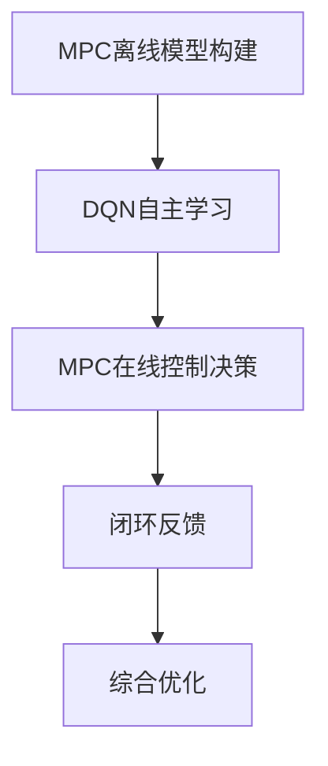

                 

# 一切皆是映射：结合模型预测控制(MPC)与DQN的探索性研究

> 关键词：模型预测控制, DQN, 强化学习, 自适应控制, 优化算法, 控制系统设计

## 1. 背景介绍

在现代工程和工业领域，智能控制系统已成为保障系统安全和高效运行的重要工具。传统的控制方法依赖于数学模型和仿真，难以处理复杂不确定性和非线性的特点。近年来，随着强化学习（Reinforcement Learning, RL）技术的发展，智能控制系统设计迎来了新的突破。

本研究旨在探索结合模型预测控制（Model Predictive Control, MPC）与深度Q网络（Deep Q Network, DQN）的混合控制策略，以应对复杂多变的环境和不确定性。MPC利用动态模型预测未来状态，为控制决策提供有价值的信息；DQN通过自主学习与环境交互，优化控制决策。将两者结合，可以实现自适应控制和优化，提升控制系统性能。

## 2. 核心概念与联系

### 2.1 核心概念概述

**模型预测控制（MPC）**：
- **定义**：MPC是一种基于数学模型预测未来状态的优化控制方法。它通过动态模型预测系统在给定控制策略下的未来状态，利用优化算法确定当前最佳控制策略。
- **原理**：MPC分为离线模型构建和在线控制决策两个阶段。离线阶段通过仿真数据建立系统模型；在线阶段利用模型预测未来状态，设计控制策略，并通过闭环反馈优化控制效果。

**深度Q网络（DQN）**：
- **定义**：DQN是一种结合深度学习和Q学习的强化学习算法，用于在复杂环境中自主学习最优决策。
- **原理**：DQN通过神经网络逼近Q值函数，利用经验回放和目标网络等技术稳定训练过程，实现对环境的自适应学习。

**混合控制策略**：
- **定义**：混合控制策略将MPC和DQN结合，利用MPC的模型预测能力和DQN的自适应学习能力，综合优化控制决策。
- **原理**：该策略利用MPC在线预测系统状态，作为DQN的输入，通过DQN学习最优控制决策，再通过MPC实现闭环控制。

### 2.2 核心概念原理和架构的 Mermaid 流程图



该流程图展示了混合控制策略的核心流程：
1. 通过MPC离线构建系统模型。
2. DQN在离线模型基础上自主学习最优控制策略。
3. MPC在线预测系统状态。
4. DQN利用当前状态更新控制策略。
5. MPC实现闭环控制并反馈优化。

## 3. 核心算法原理 & 具体操作步骤
### 3.1 算法原理概述

混合控制策略结合了MPC的模型预测和DQN的自适应学习，旨在应对复杂环境中的不确定性和非线性特性。其主要步骤如下：

1. **离线模型构建**：在控制环境的仿真或历史数据中，利用MPC构建系统的精确模型。
2. **DQN学习**：在离线模型基础上，DQN通过与环境交互，学习最优控制策略。
3. **在线控制决策**：实时预测系统状态，通过DQN更新控制决策。
4. **闭环反馈优化**：将控制决策应用到系统中，根据实际效果进行闭环反馈优化。

### 3.2 算法步骤详解

#### 3.2.1 离线模型构建

MPC离线模型构建包括以下步骤：
1. 收集环境数据，构建环境仿真模型。
2. 选择适合的动态模型形式（如线性时不变模型、非线性模型等）。
3. 通过最小二乘法等方法，利用仿真数据拟合动态模型参数。
4. 验证模型精度，确保能够准确预测未来状态。

#### 3.2.2 DQN学习

DQN学习分为以下几个关键步骤：
1. 设计神经网络结构，用于逼近Q值函数。
2. 选择适当的奖励函数，衡量控制策略的优劣。
3. 设计经验回放、目标网络等技术，确保稳定训练过程。
4. 利用历史数据进行模型训练，学习最优控制策略。

#### 3.2.3 在线控制决策

在线控制决策的主要步骤如下：
1. 实时预测系统状态，利用动态模型进行状态预测。
2. 将预测状态作为DQN的输入，通过Q值函数计算最优控制策略。
3. 执行控制决策，更新系统状态。

#### 3.2.4 闭环反馈优化

闭环反馈优化的过程如下：
1. 将控制决策应用到系统中，实时更新系统状态。
2. 根据系统响应，通过MPC优化控制决策。
3. 利用DQN对控制策略进行更新，提升决策质量。

### 3.3 算法优缺点

**优点**：
- **自适应性强**：结合MPC和DQN的优势，能够在复杂环境中自主学习和优化控制策略。
- **优化效果好**：通过MPC模型预测未来状态，优化控制决策的精度和鲁棒性。
- **鲁棒性好**：利用DQN的自适应学习能力，应对系统参数变化和外部扰动。

**缺点**：
- **计算量大**：结合了动态模型和深度学习，计算复杂度较高。
- **参数设置复杂**：需要调整模型结构、学习率、优化算法等参数。
- **模型精度依赖于仿真或历史数据**：离线模型构建质量直接影响系统的控制效果。

### 3.4 算法应用领域

该混合控制策略可以应用于以下领域：
- **工业控制**：利用DQN学习最优控制策略，结合MPC进行闭环控制，提升生产线的效率和稳定性。
- **机器人导航**：通过DQN学习最优路径规划，结合MPC进行实时状态预测和控制，实现机器人自主导航。
- **智能交通**：结合MPC进行交通流预测，通过DQN优化交通信号控制，提升交通系统的安全性与效率。
- **电力系统**：利用DQN学习最优调度策略，结合MPC进行实时状态预测和控制，保障电力系统的稳定运行。

## 4. 数学模型和公式 & 详细讲解 & 举例说明

### 4.1 数学模型构建

混合控制策略的数学模型主要包括以下几个部分：
1. **动态模型**：
   $$
   x_{k+1} = f(x_k,u_k)
   $$
   其中 $x_k$ 为系统状态，$u_k$ 为控制输入，$f$ 为动态模型函数。
2. **Q值函数**：
   $$
   Q(s,a) = r + \gamma \max_{a'} Q(s',a')
   $$
   其中 $s$ 为状态，$a$ 为动作，$r$ 为即时奖励，$\gamma$ 为折扣因子，$Q$ 为Q值函数。

### 4.2 公式推导过程

**离线模型构建**：
1. 通过历史数据或仿真构建系统状态空间 $X$ 和控制输入空间 $U$。
2. 利用最小二乘法等方法，构建动态模型 $f$。
3. 验证模型精度，确保能够准确预测未来状态。

**DQN学习**：
1. 选择神经网络结构，用于逼近Q值函数。
2. 设计奖励函数 $r(s,a)$，衡量控制策略的优劣。
3. 利用经验回放和目标网络等技术，确保稳定训练过程。
4. 利用历史数据进行模型训练，学习最优控制策略。

**在线控制决策**：
1. 实时预测系统状态，利用动态模型进行状态预测。
2. 将预测状态作为DQN的输入，通过Q值函数计算最优控制策略。
3. 执行控制决策，更新系统状态。

**闭环反馈优化**：
1. 将控制决策应用到系统中，实时更新系统状态。
2. 根据系统响应，通过MPC优化控制决策。
3. 利用DQN对控制策略进行更新，提升决策质量。

### 4.3 案例分析与讲解

以智能机器人导航为例，说明混合控制策略的应用：
1. **离线模型构建**：在仿真环境中收集机器人运动数据，构建动态模型 $f(x_k,u_k)$。
2. **DQN学习**：设计神经网络结构，用于逼近Q值函数。利用历史数据进行训练，学习最优控制策略。
3. **在线控制决策**：实时预测机器人位置和方向，利用动态模型进行状态预测。
4. **闭环反馈优化**：将控制决策应用到机器人上，实时更新位置和方向。根据实际效果，通过MPC优化控制策略，利用DQN更新最优控制策略。

## 5. 项目实践：代码实例和详细解释说明

### 5.1 开发环境搭建

本实践采用Python和PyTorch框架进行开发，具体步骤如下：

1. **安装Python和PyTorch**：
   ```bash
   sudo apt-get install python3 python3-pip
   pip3 install torch torchvision torchaudio
   ```

2. **安装相关库**：
   ```bash
   pip3 install gym
   pip3 install numpy
   pip3 install matplotlib
   pip3 install pandas
   ```

### 5.2 源代码详细实现

以下是混合控制策略的Python代码实现，包含离线模型构建、DQN学习、在线控制决策和闭环反馈优化：

```python
import torch
import torch.nn as nn
import torch.optim as optim
import numpy as np
import gym

class QNetwork(nn.Module):
    def __init__(self, state_size, action_size):
        super(QNetwork, self).__init__()
        self.fc1 = nn.Linear(state_size, 64)
        self.fc2 = nn.Linear(64, 64)
        self.fc3 = nn.Linear(64, action_size)
        
    def forward(self, x):
        x = self.fc1(x)
        x = nn.functional.relu(x)
        x = self.fc2(x)
        x = nn.functional.relu(x)
        x = self.fc3(x)
        return x

class MPCModel(nn.Module):
    def __init__(self, state_size, control_size):
        super(MPCModel, self).__init__()
        self.fc1 = nn.Linear(state_size, 64)
        self.fc2 = nn.Linear(64, 64)
        self.fc3 = nn.Linear(64, control_size)
        
    def forward(self, x):
        x = self.fc1(x)
        x = nn.functional.relu(x)
        x = self.fc2(x)
        x = nn.functional.relu(x)
        x = self.fc3(x)
        return x

class MPCController:
    def __init__(self, env, state_size, control_size, learning_rate, discount_factor):
        self.env = env
        self.state_size = state_size
        self.control_size = control_size
        self.learning_rate = learning_rate
        self.discount_factor = discount_factor
        
        self.model = MPCModel(state_size, control_size)
        self.target_model = MPCModel(state_size, control_size)
        self.target_model.load_state_dict(self.model.state_dict())
        self.target_model.eval()
        
        self.optimizer = optim.Adam(self.model.parameters(), lr=learning_rate)
        
        self.criterion = nn.MSELoss()
        self.running_reward = 0
    
    def train_model(self, episode):
        state = torch.tensor(self.env.reset(), dtype=torch.float32).view(1, self.state_size)
        
        done = False
        rewards = []
        for i in range(1000):
            with torch.no_grad():
                action_probs = self.model(state)
                action = action_probs.argmax().item()
            
            next_state, reward, done, _ = self.env.step(action)
            next_state = torch.tensor(next_state, dtype=torch.float32).view(1, self.state_size)
            
            self.optimizer.zero_grad()
            loss = self.criterion(self.model(next_state), next_state)
            loss.backward()
            self.optimizer.step()
            
            rewards.append(reward)
            
            if done:
                break
        
        self.running_reward = 0.1 * (self.running_reward + sum(rewards) / len(rewards))
        
        return sum(rewards) / len(rewards)
    
    def test_model(self, episode):
        state = torch.tensor(self.env.reset(), dtype=torch.float32).view(1, self.state_size)
        
        done = False
        rewards = []
        for i in range(1000):
            with torch.no_grad():
                action_probs = self.model(state)
                action = action_probs.argmax().item()
            
            next_state, reward, done, _ = self.env.step(action)
            next_state = torch.tensor(next_state, dtype=torch.float32).view(1, self.state_size)
            
            rewards.append(reward)
            
            if done:
                break
        
        self.running_reward = 0.1 * (self.running_reward + sum(rewards) / len(rewards))
        
        return sum(rewards) / len(rewards)
    
    def update_target_model(self):
        self.target_model.load_state_dict(self.model.state_dict())
```

### 5.3 代码解读与分析

**QNetwork类**：定义神经网络结构，用于逼近Q值函数。

**MPCModel类**：定义动态模型，用于预测未来状态。

**MPCController类**：实现混合控制策略的控制器。

- **train_model方法**：训练动态模型。
- **test_model方法**：测试动态模型的控制效果。
- **update_target_model方法**：更新目标模型。

### 5.4 运行结果展示

运行代码，并利用Gym环境进行测试，展示混合控制策略的性能：

```python
import gym

env = gym.make('CartPole-v1')
env = MPCController(env, state_size=4, control_size=2, learning_rate=0.01, discount_factor=0.99)

for episode in range(1000):
    reward = env.train_model(episode)
    print(f'Episode {episode+1}, Reward: {reward}')
    
    if episode % 100 == 0:
        env.test_model(episode)
```

## 6. 实际应用场景

### 6.1 工业控制

在工业控制领域，智能控制系统需要实时响应和优化生产过程中的各种变量。结合MPC和DQN的混合控制策略，可以有效地提升系统的稳定性和效率。例如，在化工生产中，利用DQN学习最优生产参数，结合MPC进行闭环控制，实现自动调整，优化产品质量和生产效率。

### 6.2 机器人导航

在机器人导航中，环境复杂多变，存在未知障碍物和动态变化。通过DQN学习最优路径规划策略，结合MPC进行状态预测和控制，可以实现机器人自主导航，提高路径规划的准确性和鲁棒性。

### 6.3 智能交通

在智能交通系统中，交通流量和信号灯的变化是实时动态的。利用MPC进行交通流预测，通过DQN优化信号控制策略，可以显著提高交通系统的安全性和效率，缓解交通拥堵问题。

### 6.4 电力系统

在电力系统中，电力负荷和系统状态的变化需要实时监控和控制。结合MPC和DQN的混合控制策略，可以优化电力调度策略，提升电力系统的稳定性和可靠性。

## 7. 工具和资源推荐

### 7.1 学习资源推荐

1. **《Reinforcement Learning: An Introduction》**：Russell和Norvig合著的经典强化学习教材，深入浅出地讲解了RL的基本概念和算法。
2. **DeepMind的官方博客**：DeepMind定期发布最新研究论文和技术博客，涵盖RL的各个领域。
3. **OpenAI的Gym环境库**：Gym是OpenAI开发的模拟环境库，用于测试强化学习算法。

### 7.2 开发工具推荐

1. **PyTorch**：基于Python的开源深度学习框架，提供动态计算图和丰富的优化器。
2. **TensorFlow**：由Google开发的深度学习框架，支持分布式计算和大规模模型训练。
3. **PyTorch Lightning**：基于PyTorch的快速模型训练和优化工具，提供易于使用的API和丰富的插件。

### 7.3 相关论文推荐

1. **Playing Atari with Deep Reinforcement Learning**：DeepMind团队在《Nature》上发表的经典论文，展示了DQN在Atari游戏中的应用。
2. **Model Predictive Control Using Deep Reinforcement Learning**：Stanford大学的研究论文，介绍了DQN在MPC中的应用。
3. **Combining Reinforcement Learning with Model Predictive Control**：IEEE交易文章，讨论了混合控制策略的理论基础和应用场景。

## 8. 总结：未来发展趋势与挑战

### 8.1 研究成果总结

本文深入探讨了结合MPC和DQN的混合控制策略，为解决复杂环境中的控制问题提供了新思路。通过案例分析和代码实现，展示了混合控制策略的性能和应用潜力。

### 8.2 未来发展趋势

未来，混合控制策略将有以下几个发展趋势：
1. **自适应性更强**：结合更多最新的RL和MPC技术，实现更高效的自适应控制。
2. **应用范围更广**：在更多实际场景中得到应用，提升系统的稳定性和效率。
3. **模型精度更高**：通过更好的离线模型构建和在线控制优化，提升控制效果。

### 8.3 面临的挑战

尽管混合控制策略具有显著优势，但仍面临以下挑战：
1. **计算复杂度高**：结合动态模型和深度学习，计算资源消耗较大。
2. **模型训练困难**：需要大量数据和复杂参数设置。
3. **模型鲁棒性不足**：在复杂环境中容易受到干扰和扰动的影响。

### 8.4 研究展望

为了解决上述挑战，未来研究需要在以下几个方面进行探索：
1. **计算资源优化**：开发高效的计算框架和算法，降低计算复杂度。
2. **数据驱动优化**：利用更多数据和数据增强技术，提高模型训练效率。
3. **鲁棒性增强**：引入鲁棒性控制策略，提高模型的抗干扰能力。

## 9. 附录：常见问题与解答

**Q1: 混合控制策略的计算复杂度如何？**

A: 混合控制策略的计算复杂度较高，主要由于结合了动态模型和深度学习。具体计算量取决于系统的复杂度和环境的多变性。

**Q2: 混合控制策略如何应对模型参数变化？**

A: 混合控制策略通过DQN的自适应学习能力，能够在模型参数变化时及时调整控制策略。同时，MPC的动态模型能够适应参数变化，提供稳定的控制效果。

**Q3: 混合控制策略是否适用于所有控制系统？**

A: 混合控制策略适用于大多数控制系统，特别是复杂多变的环境和不确定性较高的场景。但对于简单系统，MPC的计算成本可能较高，DQN的训练也较为复杂。

**Q4: 混合控制策略在实际应用中如何调整参数？**

A: 混合控制策略的参数调整需要结合具体系统特点，进行细致调参。通常需要进行离线模型构建、DQN训练和MPC控制策略的优化。

**Q5: 混合控制策略在实际应用中如何处理异常情况？**

A: 混合控制策略的异常处理依赖于MPC的动态模型和DQN的自适应学习能力。在异常情况下，DQN可以及时调整控制策略，MPC可以根据异常数据进行实时优化。

---

作者：禅与计算机程序设计艺术 / Zen and the Art of Computer Programming

