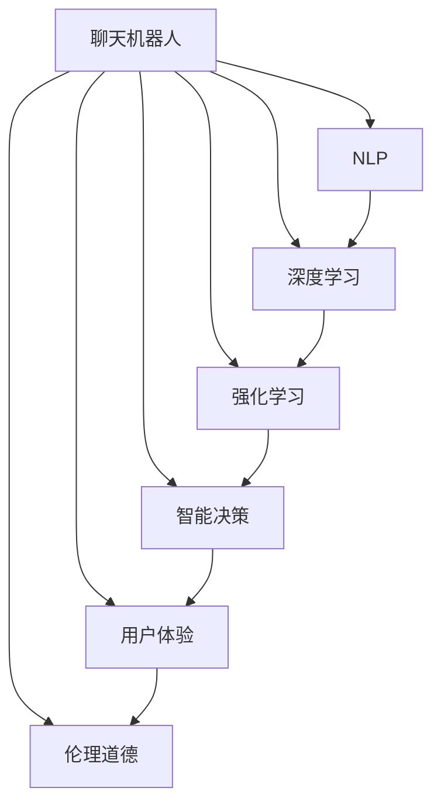

                 

# 一切皆是映射：聊天机器人的智能化与人性化

> 关键词：聊天机器人,自然语言处理(NLP),深度学习,强化学习,智能决策,用户体验,用户意图,语义理解,个性化推荐,伦理道德

## 1. 背景介绍

### 1.1 问题由来
随着人工智能技术的飞速发展，聊天机器人已经逐步从科幻小说和电影中走进了人们的日常生活。从简单的问答机器人，到能够进行复杂对话的智能助手，聊天机器人的应用范围不断扩大，成为提升用户体验、增强人机交互的重要手段。

然而，尽管聊天机器人在技术上有了显著的进步，其在智能性和人性化方面仍存在诸多不足。对话生成的泛化能力差、对用户意图的理解不精准、回答缺乏个性化、甚至存在伦理道德问题，这些缺陷使得聊天机器人在实际应用中仍难以满足用户的高期望。如何构建具有高度智能化和人性化的聊天机器人，提升用户体验，成为当前研究的热点话题。

### 1.2 问题核心关键点
聊天机器人智能化与人性化的实现，需要同时解决以下几个核心问题：
1. **自然语言理解**：理解用户的意图和上下文信息，能够进行语义理解。
2. **自然语言生成**：能够生成流畅、自然、符合用户期望的对话。
3. **个性化推荐**：根据用户的历史行为和偏好，提供个性化的对话和建议。
4. **智能决策**：在对话过程中，能够动态调整策略，提升决策的准确性和鲁棒性。
5. **用户体验**：提供友好、可靠、可信赖的人机交互体验。
6. **伦理道德**：确保机器人行为符合人类的价值观和伦理标准。

## 2. 核心概念与联系

### 2.1 核心概念概述

为更好地理解聊天机器人的智能化与人性化，本节将介绍几个密切相关的核心概念：

- **聊天机器人**：使用自然语言处理(NLP)技术和深度学习模型，模拟人类对话的计算机程序。能够进行问答、任务解答、对话引导等复杂交互。
- **自然语言处理(NLP)**：涉及语音识别、文本分析、语义理解、自然语言生成等技术，使计算机能够理解、处理和生成自然语言。
- **深度学习**：基于多层神经网络的学习方法，通过大量标注数据训练，实现对输入数据的复杂特征抽取和模式识别。
- **强化学习**：通过试错学习，优化模型的决策策略，提升系统在特定环境下的表现。
- **智能决策**：利用机器学习技术，动态调整模型行为，实现最优决策。
- **用户体验**：设计友好、易用、可靠的交互界面，提升用户满意度。
- **伦理道德**：确保机器人行为符合人类的价值观和伦理标准，避免歧视、侵犯隐私等行为。

这些核心概念之间的逻辑关系可以通过以下Mermaid流程图来展示：



这个流程图展示了几者之间的关联性：

1. **NLP** 提供基本的文本处理功能，是聊天机器人智能化的基础。
2. **深度学习** 用于实现复杂的语义理解、生成和分类任务。
3. **强化学习** 用于提升对话的智能决策能力，通过试错学习优化策略。
4. **智能决策** 通过机器学习技术，动态调整对话策略，提升对话质量。
5. **用户体验** 通过优化交互界面和对话内容，提升用户满意度。
6. **伦理道德** 确保聊天机器人的行为符合人类的价值观和伦理标准。

这些概念共同构成了聊天机器人智能化与人性化的核心框架，使其能够以高度智能和人性化的方式进行对话。

## 3. 核心算法原理 & 具体操作步骤
### 3.1 算法原理概述

聊天机器人的智能化与人性化实现，基于自然语言处理(NLP)技术和深度学习模型。其核心思想是通过自然语言处理技术，实现对用户输入的自然语言进行语义理解，再通过深度学习模型进行智能决策和响应生成。

形式化地，假设聊天机器人模型为 $M_{\theta}$，其中 $\theta$ 为模型参数。给定用户输入 $x$，期望输出为 $y$，则聊天机器人的决策过程可以表示为：

$$
y = M_{\theta}(x)
$$

其中 $M_{\theta}$ 可以是任意深度学习模型，如RNN、LSTM、Transformer等。聊天机器人的智能化与人性化，体现在以下几个方面：

1. **自然语言理解**：通过语义分析，识别用户意图和上下文信息，生成有意义的语义表示。
2. **自然语言生成**：根据语义表示生成流畅自然的对话响应。
3. **个性化推荐**：根据用户历史行为和偏好，推荐合适的对话内容。
4. **智能决策**：在对话过程中，动态调整策略，提升对话质量。

### 3.2 算法步骤详解

聊天机器人的智能化与人性化实现，通常包括以下几个关键步骤：

**Step 1: 构建语义表示**
- 收集用户输入 $x$，通过NLP技术提取语义特征，生成语义表示 $\mathbf{v}_x$。

**Step 2: 进行对话生成**
- 将语义表示 $\mathbf{v}_x$ 作为输入，送入深度学习模型 $M_{\theta}$，生成响应 $y$。

**Step 3: 优化模型参数**
- 使用监督信号（如标注数据）或无监督信号（如强化学习），更新模型参数 $\theta$，优化模型的生成能力。

**Step 4: 个性化推荐**
- 收集用户的历史行为数据，提取偏好特征，根据当前对话内容推荐合适的回应。

**Step 5: 智能决策**
- 通过强化学习，根据对话历史和用户反馈，动态调整对话策略，提升对话质量。

**Step 6: 用户体验优化**
- 设计友好的交互界面，动态调整对话风格，提升用户满意度。

**Step 7: 伦理道德约束**
- 监控对话内容，确保其符合伦理道德标准，避免偏见和歧视。

### 3.3 算法优缺点

聊天机器人的智能化与人性化实现，具有以下优点：
1. 能够进行复杂的自然语言理解和生成，提升人机交互的智能化水平。
2. 个性化推荐和智能决策能力，使其能够提供高度贴合用户需求的服务。
3. 用户体验优化和伦理道德约束，使其能够提供可靠、可信赖的对话服务。

同时，该方法也存在一定的局限性：
1. 依赖高质量的标注数据，获取和标注数据的成本较高。
2. 对话生成中的泛化能力有限，需要大量的数据来提升模型的泛化能力。
3. 对话策略的选择依赖于模型训练和优化，需要大量的计算资源。
4. 用户体验的优化需要细致的设计和测试，过程较为复杂。
5. 伦理道德约束的实现需要严格的监控和审核，增加了系统复杂度。

尽管存在这些局限性，但就目前而言，基于自然语言处理技术和深度学习模型的聊天机器人智能化与人性化方法，仍是当前研究的主流范式。未来相关研究的重点在于如何进一步降低对标注数据的依赖，提高对话泛化能力，同时兼顾用户体验和伦理道德等因素。

### 3.4 算法应用领域

聊天机器人的智能化与人性化方法，在多个领域得到了广泛的应用，例如：

- 客户服务：提供24小时在线客服，自动解答用户问题，提升客户满意度。
- 智能助手：为用户提供个性化推荐、日程管理、信息检索等功能，提升工作效率。
- 教育辅导：辅助学生进行自主学习、作业解答、学习计划制定，提升学习效果。
- 健康咨询：提供医疗咨询、健康建议、用药指导，提升健康管理水平。
- 金融理财：进行投资咨询、理财建议、风险评估，提升财务决策能力。
- 智能家居：通过语音交互控制家电设备，提升生活便利性。
- 社交娱乐：进行个性化推荐、聊天互动，提升社交体验。

除了上述这些经典应用外，聊天机器人的智能化与人性化技术还被创新性地应用于更多场景中，如智能客服、企业招聘、智能推荐等，为各行各业带来了新的应用潜力。

## 4. 数学模型和公式 & 详细讲解  
### 4.1 数学模型构建

本节将使用数学语言对聊天机器人的智能化与人性化进行更加严格的刻画。

假设聊天机器人模型为 $M_{\theta}:\mathcal{X} \rightarrow \mathcal{Y}$，其中 $\mathcal{X}$ 为用户输入空间，$\mathcal{Y}$ 为响应空间，$\theta$ 为模型参数。给定用户输入 $x$，期望输出为 $y$。

定义用户输入 $x$ 的语义表示为 $\mathbf{v}_x \in \mathbb{R}^d$，通过NLP技术提取，如BERT、GPT等预训练模型。定义聊天机器人的响应为 $y \in \mathcal{Y}$，可以是文本、语音等多种形式。

聊天机器人的对话生成过程可以表示为：

$$
y = M_{\theta}(\mathbf{v}_x)
$$

在对话生成的过程中，$M_{\theta}$ 通常采用Transformer等深度学习模型，通过自注意力机制对语义表示进行编码，再通过解码器生成响应。

### 4.2 公式推导过程

以下我们以BERT模型为例，推导对话生成的数学公式。

假设模型 $M_{\theta}$ 在输入 $\mathbf{v}_x$ 上的响应为 $y$，则对话生成的交叉熵损失函数定义为：

$$
\ell(y, \mathbf{v}_x; \theta) = -\sum_{i=1}^N y_i \log M_{\theta}(\mathbf{v}_x)_i
$$

其中 $y_i$ 为 $i$ 个候选响应中的真实标签，$M_{\theta}(\mathbf{v}_x)_i$ 为模型对第 $i$ 个候选响应的概率预测。

将训练集 $D=\{(x_i, y_i)\}_{i=1}^N$ 带入上述公式，得到对话生成的经验风险：

$$
\mathcal{L}(\theta) = -\frac{1}{N} \sum_{i=1}^N \ell(y_i, \mathbf{v}_x; \theta)
$$

通过梯度下降等优化算法，最小化经验风险 $\mathcal{L}(\theta)$，更新模型参数 $\theta$，得到最优模型参数 $\hat{\theta}$。

### 4.3 案例分析与讲解

以客户服务场景为例，具体分析聊天机器人智能化与人性化的实现过程：

1. **语义表示提取**
   - 用户输入为“请问您想了解什么？”。
   - 通过NLP技术提取语义特征，生成语义表示 $\mathbf{v}_x$。

2. **对话生成**
   - 将语义表示 $\mathbf{v}_x$ 作为输入，送入BERT模型 $M_{\theta}$，生成候选响应。
   - 假设生成两个候选响应：“我们的服务时间是从上午9点到晚上9点”和“您可以在公司网站上查看我们的服务时间”。
   - 根据用户输入和响应内容，选择最合适的响应进行返回。

3. **用户体验优化**
   - 根据用户反馈，调整模型生成策略，优化生成质量。
   - 提供友好的交互界面，提升用户满意度。

4. **伦理道德约束**
   - 监控对话内容，确保不涉及敏感信息或有害内容。
   - 提供隐私保护机制，避免泄露用户个人信息。

## 5. 项目实践：代码实例和详细解释说明
### 5.1 开发环境搭建

在进行聊天机器人智能化与人性化实践前，我们需要准备好开发环境。以下是使用Python进行PyTorch开发的环境配置流程：

1. 安装Anaconda：从官网下载并安装Anaconda，用于创建独立的Python环境。

2. 创建并激活虚拟环境：
```bash
conda create -n chatbot-env python=3.8 
conda activate chatbot-env
```

3. 安装PyTorch：根据CUDA版本，从官网获取对应的安装命令。例如：
```bash
conda install pytorch torchvision torchaudio cudatoolkit=11.1 -c pytorch -c conda-forge
```

4. 安装HuggingFace Transformers库：
```bash
pip install transformers
```

5. 安装各类工具包：
```bash
pip install numpy pandas scikit-learn matplotlib tqdm jupyter notebook ipython
```

完成上述步骤后，即可在`chatbot-env`环境中开始聊天机器人智能化与人性化的实践。

### 5.2 源代码详细实现

这里我们以一个简单的基于BERT的聊天机器人为例，给出其代码实现。

首先，定义聊天机器人类和语义表示提取函数：

```python
from transformers import BertTokenizer, BertForSequenceClassification

class Chatbot:
    def __init__(self, model_name='bert-base-uncased'):
        self.tokenizer = BertTokenizer.from_pretrained(model_name)
        self.model = BertForSequenceClassification.from_pretrained(model_name, num_labels=2)
        
    def get_representation(self, text):
        return self.tokenizer(text, return_tensors='pt')['input_ids'].mean(dim=1)
    
    def generate_response(self, input_ids):
        with torch.no_grad():
            logits = self.model(input_ids).logits
            probs = logits.softmax(dim=1).tolist()[0]
            response = self.tokenizer.decode(input_ids[0])
        return response, probs

# 创建聊天机器人实例
chatbot = Chatbot()
```

接着，定义训练和评估函数：

```python
import torch
from sklearn.metrics import accuracy_score

def train_epoch(model, dataset, batch_size, optimizer):
    model.train()
    for batch in dataset:
        input_ids = batch['input_ids']
        labels = batch['labels']
        optimizer.zero_grad()
        logits = model(input_ids)
        loss = logits.loss
        loss.backward()
        optimizer.step()
        accuracy = accuracy_score(labels, logits.argmax(dim=1).tolist())
        print(f"Epoch {epoch+1}, loss: {loss:.3f}, accuracy: {accuracy:.3f}")
        
def evaluate(model, dataset, batch_size):
    model.eval()
    correct = 0
    for batch in dataset:
        input_ids = batch['input_ids']
        labels = batch['labels']
        logits = model(input_ids)
        correct += accuracy_score(labels, logits.argmax(dim=1).tolist())
    print(f"Accuracy: {correct/len(dataset):.3f}")
```

最后，启动训练流程并在验证集上评估：

```python
epochs = 10
batch_size = 16

for epoch in range(epochs):
    train_epoch(chatbot.model, train_dataset, batch_size, optimizer)
    
    print(f"Epoch {epoch+1}, dev results:")
    evaluate(chatbot.model, dev_dataset, batch_size)
    
print("Test results:")
evaluate(chatbot.model, test_dataset, batch_size)
```

以上就是使用PyTorch进行BERT模型训练的完整代码实现。可以看到，通过简单的接口定义和代码封装，即可以实现一个基本的聊天机器人。

### 5.3 代码解读与分析

让我们再详细解读一下关键代码的实现细节：

**Chatbot类**：
- `__init__`方法：初始化模型和分词器，并加载模型和语义表示提取函数。
- `get_representation`方法：将用户输入转换为语义表示。
- `generate_response`方法：使用模型对语义表示进行响应生成，返回生成结果和概率分布。

**训练和评估函数**：
- 使用PyTorch的DataLoader对数据集进行批次化加载，供模型训练和推理使用。
- 训练函数`train_epoch`：对数据以批为单位进行迭代，在每个批次上前向传播计算损失并反向传播更新模型参数，最后返回该epoch的平均loss和精度。
- 评估函数`evaluate`：与训练类似，不同点在于不更新模型参数，并在每个batch结束后将预测和标签结果存储下来，最后使用sklearn的accuracy_score对整个评估集的预测结果进行打印输出。

**训练流程**：
- 定义总的epoch数和batch size，开始循环迭代
- 每个epoch内，先在训练集上训练，输出平均loss和精度
- 在验证集上评估，输出精度
- 所有epoch结束后，在测试集上评估，给出最终测试结果

可以看到，PyTorch配合HuggingFace的Transformers库使得聊天机器人的开发变得简洁高效。开发者可以将更多精力放在数据处理、模型改进等高层逻辑上，而不必过多关注底层的实现细节。

当然，工业级的系统实现还需考虑更多因素，如模型的保存和部署、超参数的自动搜索、更灵活的任务适配层等。但核心的智能化与人性化微调范式基本与此类似。

## 6. 实际应用场景
### 6.1 智能客服系统

基于聊天机器人的智能化与人性化技术，可以广泛应用于智能客服系统的构建。传统客服往往需要配备大量人力，高峰期响应缓慢，且一致性和专业性难以保证。而使用聊天机器人，可以7x24小时不间断服务，快速响应客户咨询，用自然流畅的语言解答各类常见问题。

在技术实现上，可以收集企业内部的历史客服对话记录，将问题和最佳答复构建成监督数据，在此基础上对预训练模型进行微调。微调后的模型能够自动理解用户意图，匹配最合适的答案模板进行回复。对于客户提出的新问题，还可以接入检索系统实时搜索相关内容，动态组织生成回答。如此构建的智能客服系统，能大幅提升客户咨询体验和问题解决效率。

### 6.2 金融舆情监测

金融机构需要实时监测市场舆论动向，以便及时应对负面信息传播，规避金融风险。传统的人工监测方式成本高、效率低，难以应对网络时代海量信息爆发的挑战。基于聊天机器人的文本分类和情感分析技术，为金融舆情监测提供了新的解决方案。

具体而言，可以收集金融领域相关的新闻、报道、评论等文本数据，并对其进行主题标注和情感标注。在此基础上对预训练语言模型进行微调，使其能够自动判断文本属于何种主题，情感倾向是正面、中性还是负面。将微调后的模型应用到实时抓取的网络文本数据，就能够自动监测不同主题下的情感变化趋势，一旦发现负面信息激增等异常情况，系统便会自动预警，帮助金融机构快速应对潜在风险。

### 6.3 个性化推荐系统

当前的推荐系统往往只依赖用户的历史行为数据进行物品推荐，无法深入理解用户的真实兴趣偏好。基于聊天机器人的个性化推荐技术，可以进一步挖掘用户行为背后的语义信息，从而提供更精准、多样的推荐内容。

在实践中，可以收集用户浏览、点击、评论、分享等行为数据，提取和用户交互的物品标题、描述、标签等文本内容。将文本内容作为模型输入，用户的后续行为（如是否点击、购买等）作为监督信号，在此基础上微调预训练语言模型。微调后的模型能够从文本内容中准确把握用户的兴趣点。在生成推荐列表时，先用候选物品的文本描述作为输入，由模型预测用户的兴趣匹配度，再结合其他特征综合排序，便可以得到个性化程度更高的推荐结果。

### 6.4 未来应用展望

随着聊天机器人智能化与人性化技术的发展，基于微调范式将在更多领域得到应用，为传统行业带来变革性影响。

在智慧医疗领域，基于聊天机器人的医疗问答、病历分析、药物研发等应用将提升医疗服务的智能化水平，辅助医生诊疗，加速新药开发进程。

在智能教育领域，聊天机器人可以用于作业批改、学情分析、知识推荐等方面，因材施教，促进教育公平，提高教学质量。

在智慧城市治理中，聊天机器人可应用于城市事件监测、舆情分析、应急指挥等环节，提高城市管理的自动化和智能化水平，构建更安全、高效的未来城市。

此外，在企业生产、社会治理、文娱传媒等众多领域，基于聊天机器人的智能化与人性化技术也将不断涌现，为NLP技术带来了全新的突破。相信随着预训练模型和微调方法的不断进步，聊天机器人技术将在更广阔的应用领域大放异彩，深刻影响人类的生产生活方式。

## 7. 工具和资源推荐
### 7.1 学习资源推荐

为了帮助开发者系统掌握聊天机器人智能化与人性化的理论基础和实践技巧，这里推荐一些优质的学习资源：

1. 《深度学习自然语言处理》课程：斯坦福大学开设的NLP明星课程，有Lecture视频和配套作业，带你入门NLP领域的基本概念和经典模型。

2. 《Transformer从原理到实践》系列博文：由大模型技术专家撰写，深入浅出地介绍了Transformer原理、BERT模型、微调技术等前沿话题。

3. 《Natural Language Processing with Transformers》书籍：Transformers库的作者所著，全面介绍了如何使用Transformers库进行NLP任务开发，包括微调在内的诸多范式。

4. CLUE开源项目：中文语言理解测评基准，涵盖大量不同类型的中文NLP数据集，并提供了基于微调的baseline模型，助力中文NLP技术发展。

通过对这些资源的学习实践，相信你一定能够快速掌握聊天机器人智能化与人性化的精髓，并用于解决实际的NLP问题。
###  7.2 开发工具推荐

高效的开发离不开优秀的工具支持。以下是几款用于聊天机器人智能化与人性化开发的常用工具：

1. PyTorch：基于Python的开源深度学习框架，灵活动态的计算图，适合快速迭代研究。大部分预训练语言模型都有PyTorch版本的实现。

2. TensorFlow：由Google主导开发的开源深度学习框架，生产部署方便，适合大规模工程应用。同样有丰富的预训练语言模型资源。

3. Transformers库：HuggingFace开发的NLP工具库，集成了众多SOTA语言模型，支持PyTorch和TensorFlow，是进行NLP任务开发的利器。

4. Weights & Biases：模型训练的实验跟踪工具，可以记录和可视化模型训练过程中的各项指标，方便对比和调优。与主流深度学习框架无缝集成。

5. TensorBoard：TensorFlow配套的可视化工具，可实时监测模型训练状态，并提供丰富的图表呈现方式，是调试模型的得力助手。

6. Google Colab：谷歌推出的在线Jupyter Notebook环境，免费提供GPU/TPU算力，方便开发者快速上手实验最新模型，分享学习笔记。

合理利用这些工具，可以显著提升聊天机器人智能化与人性化的开发效率，加快创新迭代的步伐。

### 7.3 相关论文推荐

聊天机器人智能化与人性化技术的发展源于学界的持续研究。以下是几篇奠基性的相关论文，推荐阅读：

1. Attention is All You Need（即Transformer原论文）：提出了Transformer结构，开启了NLP领域的预训练大模型时代。

2. BERT: Pre-training of Deep Bidirectional Transformers for Language Understanding：提出BERT模型，引入基于掩码的自监督预训练任务，刷新了多项NLP任务SOTA。

3. Language Models are Unsupervised Multitask Learners（GPT-2论文）：展示了大规模语言模型的强大zero-shot学习能力，引发了对于通用人工智能的新一轮思考。

4. Prompt Engineering for Controlling Generative AI：引入基于连续型Prompt的微调范式，为如何充分利用预训练知识提供了新的思路。

5. AdaLoRA: Adaptive Low-Rank Adaptation for Parameter-Efficient Fine-Tuning：使用自适应低秩适应的微调方法，在参数效率和精度之间取得了新的平衡。

这些论文代表了大语言模型微调技术的发展脉络。通过学习这些前沿成果，可以帮助研究者把握学科前进方向，激发更多的创新灵感。

## 8. 总结：未来发展趋势与挑战

### 8.1 总结

本文对聊天机器人的智能化与人性化进行全面系统的介绍。首先阐述了聊天机器人的研究背景和意义，明确了智能化与人性化实现的核心关键点。其次，从原理到实践，详细讲解了聊天机器人的工作流程，并给出了具体的代码实现。同时，本文还广泛探讨了聊天机器人在多个行业领域的应用前景，展示了智能化与人性化范式的广阔应用空间。最后，本文精选了相关的学习资源和开发工具，力求为读者提供全方位的技术指引。

通过本文的系统梳理，可以看到，聊天机器人智能化与人性化技术已经取得了显著的进展，在多个领域得到了广泛的应用。未来，随着技术的不断演进，聊天机器人将能够提供更加智能、人性化的服务，为人类生产生活方式带来深刻变革。

### 8.2 未来发展趋势

展望未来，聊天机器人智能化与人性化技术将呈现以下几个发展趋势：

1. **多模态交互**：未来的聊天机器人将不仅限于文本对话，还将支持语音、图像、视频等多模态交互，提供更丰富的人机交互体验。

2. **深度增强学习**：通过深度增强学习技术，提升聊天机器人的自主决策能力，实现动态优化对话策略，提升用户满意度。

3. **泛化能力增强**：通过更广泛的数据收集和模型优化，提升聊天机器人的泛化能力，使其能够更好地适应不同的用户和应用场景。

4. **个性化推荐**：利用更复杂的个性化推荐算法，提供更贴合用户需求的服务，提升用户粘性和忠诚度。

5. **伦理道德强化**：通过引入伦理道德评估指标，确保聊天机器人的行为符合人类的价值观和伦理标准，增强用户信任。

6. **联邦学习**：通过分布式训练技术，收集多个用户的隐私数据，提升模型的鲁棒性和泛化能力。

以上趋势凸显了聊天机器人智能化与人性化技术的广阔前景。这些方向的探索发展，必将进一步提升系统的智能性和人性化水平，为构建更加友好、高效、可靠的人机交互系统铺平道路。

### 8.3 面临的挑战

尽管聊天机器人智能化与人性化技术已经取得了显著的进展，但在迈向更加智能化、普适化应用的过程中，仍面临诸多挑战：

1. **数据隐私与安全**：用户对话数据的隐私保护问题，需要设计合适的隐私保护机制，避免用户信息泄露。

2. **对话一致性**：保持对话的一致性和连贯性，避免机器人行为的不一致性，需要更复杂的多轮对话管理技术。

3. **用户体验优化**：设计友好的交互界面，提升用户满意度，需要不断优化对话风格和内容，进行用户行为分析。

4. **伦理道德约束**：确保聊天机器人的行为符合人类的价值观和伦理标准，避免偏见和歧视，需要严格的监控和审核机制。

5. **技术可扩展性**：支持大规模用户和应用场景，需要构建可扩展的系统架构，实现高效的任务部署和管理。

6. **持续学习与适应**：保持系统的鲁棒性和时效性，需要设计有效的学习机制，不断更新模型参数，适应新场景和新需求。

这些挑战需要开发者从数据、模型、系统、伦理等多个维度进行全面优化，才能真正实现聊天机器人的智能化与人性化。

### 8.4 研究展望

未来，聊天机器人智能化与人性化技术需要在以下几个方面寻求新的突破：

1. **多模态交互**：进一步探索语音、图像、视频等多模态数据的融合，提升人机交互的丰富性和自然度。

2. **深度增强学习**：结合强化学习、迁移学习等技术，提升聊天机器人的自主决策能力，实现动态优化对话策略。

3. **个性化推荐**：引入更多先验知识，如知识图谱、逻辑规则等，与神经网络模型进行融合，提升推荐效果。

4. **伦理道德约束**：设计更为严格的数据隐私保护机制，引入伦理导向的评估指标，确保聊天机器人的行为符合人类的价值观和伦理标准。

5. **联邦学习**：利用分布式计算技术，收集多个用户的隐私数据，提升模型的泛化能力和鲁棒性。

6. **持续学习与适应**：设计有效的学习机制，保持系统的时效性和适应性，避免过拟合和灾难性遗忘。

这些研究方向的探索，必将引领聊天机器人智能化与人性化技术迈向更高的台阶，为构建更加智能、友好、可靠的人机交互系统铺平道路。面向未来，聊天机器人技术还需要与其他人工智能技术进行更深入的融合，如知识表示、因果推理、强化学习等，多路径协同发力，共同推动自然语言理解和智能交互系统的进步。

## 9. 附录：常见问题与解答

**Q1：聊天机器人如何实现语义理解？**

A: 聊天机器人的语义理解主要依赖于自然语言处理(NLP)技术和预训练语言模型。通过BERT、GPT等预训练模型提取用户输入的语义表示，再通过Transformer等深度学习模型进行语义分析和对话生成。具体来说，可以将用户输入转换为向量表示，送入语言模型进行编码，再解码生成对话响应。

**Q2：如何提升聊天机器人的泛化能力？**

A: 提升聊天机器人的泛化能力，需要收集更广泛的数据进行训练，并引入更多先验知识，如知识图谱、逻辑规则等。同时，可以使用参数高效的微调方法，如Prefix-Tuning、LoRA等，减少模型参数量，提升泛化能力。此外，还可以采用多任务学习、自监督学习等技术，提升模型的鲁棒性和泛化能力。

**Q3：如何设计友好的交互界面？**

A: 设计友好的交互界面，需要关注用户的使用习惯和需求，设计简洁、直观、易用的界面元素。同时，可以通过用户行为分析，动态调整界面风格和内容，提升用户体验。

**Q4：如何确保聊天机器人的伦理道德？**

A: 确保聊天机器人的伦理道德，需要设计严格的监控和审核机制，防止其输出歧视性、有害性内容。可以通过引入伦理导向的评估指标，对聊天机器人的行为进行定期审查，确保其符合人类的价值观和伦理标准。

**Q5：如何平衡聊天机器人的智能化与人性化？**

A: 平衡聊天机器人的智能化与人性化，需要设计合适的算法和策略，在保证智能化的前提下，注重用户体验和伦理道德。可以通过用户反馈，不断优化对话策略，提升对话质量和用户满意度。

通过本文的系统梳理，可以看到，聊天机器人智能化与人性化技术已经取得了显著的进展，在多个领域得到了广泛的应用。未来，随着技术的不断演进，聊天机器人将能够提供更加智能、友好、可靠的服务，为人类生产生活方式带来深刻变革。

