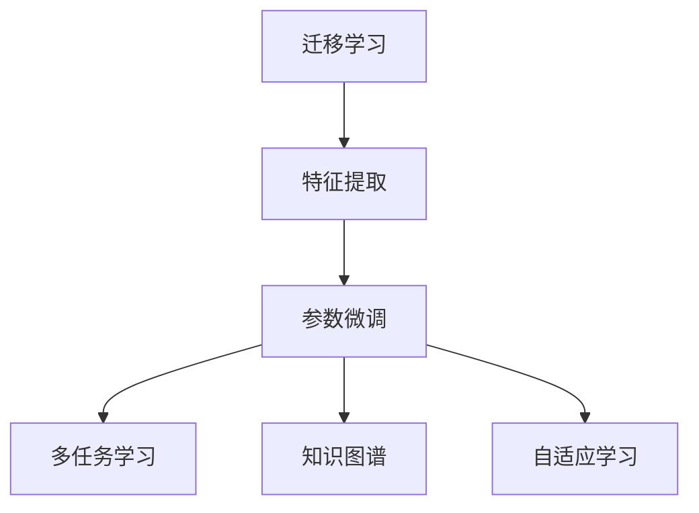

                 

# 一切皆是映射：迁移学习在神经网络的应用

> 关键词：迁移学习,神经网络,特征提取,多任务学习,知识图谱,自适应学习

## 1. 背景介绍

### 1.1 问题由来
在深度学习的发展历程中，迁移学习（Transfer Learning）始终占据重要地位。传统的监督学习模型往往需要大量标注数据进行训练，不仅耗时耗力，还容易受到数据分布差异的干扰，泛化能力较弱。而迁移学习通过在已有模型的基础上进行微调，可以显著提高模型的泛化性能，尤其在大规模数据集稀缺的情况下，迁移学习的重要性更为突出。

近年来，深度学习在计算机视觉、自然语言处理等领域取得了显著进展，各大企业纷纷基于深度神经网络构建复杂系统。在数据标注资源有限的条件下，如何有效利用已有的深度学习模型，加速新任务的学习过程，成为深度学习研究的一大挑战。本文将系统介绍迁移学习在神经网络中的原理、应用及实践方法，探索其潜力，并为开发者提供参考。

### 1.2 问题核心关键点
迁移学习的基本思想是将在一个任务上训练好的模型参数，应用到另一个相关任务上，以达到加速学习、提高性能的目的。对于神经网络，迁移学习的实现通常包括特征提取和参数微调两个步骤。

1. **特征提取**：使用预训练模型对输入数据进行特征提取，得到低维隐含特征表示。预训练模型通常在大型无监督数据集上进行训练，学习到通用的特征表示。
2. **参数微调**：在提取到的特征基础上，对下游任务的参数进行微调，以适应具体的任务需求。微调一般通过有监督学习完成，利用下游任务的标注数据对模型进行进一步优化。

本文将详细介绍迁移学习的基本原理和操作流程，并通过具体案例和数学公式进行深入分析。

## 2. 核心概念与联系

### 2.1 核心概念概述

为更好地理解迁移学习在神经网络中的应用，本节将介绍几个关键概念：

- **迁移学习**：将已有模型的知识迁移到新任务，加速模型学习，提升性能。
- **特征提取**：从原始输入数据中提取低维特征表示，用于下游任务的进一步优化。
- **参数微调**：在特征表示基础上，对模型的参数进行微调，以适应新任务的输出要求。
- **多任务学习**：在同一模型上训练多个相关任务，共享特征提取器，提高模型的泛化能力。
- **知识图谱**：一种表示实体、关系和属性的大型结构化数据库，用于增强神经网络的语义理解能力。
- **自适应学习**：模型根据新任务动态调整自身参数，适应不同任务的需求。

这些概念之间的逻辑关系可以通过以下Mermaid流程图来展示：



该流程图展示了迁移学习的核心概念及其之间的关系：

1. 迁移学习通过特征提取和参数微调，将已有模型的知识迁移到新任务上。
2. 特征提取是迁移学习的基础，通过预训练模型对数据进行特征提取。
3. 参数微调是迁移学习的核心，通过下游任务的标注数据对模型参数进行微调。
4. 多任务学习通过共享特征提取器，提高模型的泛化能力。
5. 知识图谱通过增强神经网络的语义理解能力，进一步提升迁移学习的性能。
6. 自适应学习使模型能够根据新任务动态调整参数，适应不同任务的需求。

这些核心概念共同构成了迁移学习的基础框架，使其能够在各种场景下发挥作用。通过理解这些核心概念，我们可以更好地把握迁移学习的工作原理和优化方向。

## 3. 核心算法原理 & 具体操作步骤
### 3.1 算法原理概述

迁移学习的核心原理是利用已有模型的特征提取能力，在新任务上进行参数微调，以达到加速学习和提高性能的目的。

假设已有模型为 $M_0$，在新任务上进行微调后得到模型 $M_f$。迁移学习的实现过程可以分为两个步骤：

1. **特征提取**：使用预训练模型 $M_0$ 对输入数据 $x$ 进行特征提取，得到低维特征表示 $h(x)$。
2. **参数微调**：在提取到的特征 $h(x)$ 的基础上，对新任务 $f$ 的参数进行微调，得到优化后的模型 $M_f$。

数学上，迁移学习的目标是通过最小化损失函数 $L$ 来优化模型参数 $w$，使得模型在新任务 $f$ 上的表现最佳。

$$
\min_{w} L(M_f(x), f(x))
$$

其中，$M_f(x)$ 为模型 $M_f$ 在输入 $x$ 上的输出，$f(x)$ 为任务 $f$ 的真实标签。

### 3.2 算法步骤详解

基于迁移学习的神经网络微调一般包括以下几个关键步骤：

**Step 1: 准备预训练模型和数据集**
- 选择合适的预训练模型 $M_0$ 作为特征提取器，如 ResNet、VGG 等。
- 准备下游任务 $f$ 的标注数据集 $D_f$，划分为训练集、验证集和测试集。

**Step 2: 特征提取**
- 使用预训练模型 $M_0$ 对数据集 $D_f$ 中的每个样本 $x$ 进行特征提取，得到特征向量 $h(x)$。
- 特征向量 $h(x)$ 通常为高维表示，需要进行降维处理。

**Step 3: 设计任务适配层**
- 根据任务 $f$ 的输出类型，设计合适的输出层和损失函数。
- 对于分类任务，通常在顶层添加线性分类器和交叉熵损失函数。
- 对于回归任务，通常使用均方误差损失函数。

**Step 4: 设置微调超参数**
- 选择合适的优化算法及其参数，如 Adam、SGD 等，设置学习率、批大小、迭代轮数等。
- 设置正则化技术及强度，包括权重衰减、Dropout、Early Stopping 等。
- 确定冻结预训练参数的策略，如仅微调顶层，或全部参数都参与微调。

**Step 5: 执行梯度训练**
- 将训练集数据分批次输入模型，前向传播计算损失函数。
- 反向传播计算参数梯度，根据设定的优化算法和学习率更新模型参数。
- 周期性在验证集上评估模型性能，根据性能指标决定是否触发 Early Stopping。
- 重复上述步骤直到满足预设的迭代轮数或 Early Stopping 条件。

**Step 6: 测试和部署**
- 在测试集上评估微调后模型 $M_f$ 的性能，对比微调前后的精度提升。
- 使用微调后的模型对新样本进行推理预测，集成到实际的应用系统中。
- 持续收集新的数据，定期重新微调模型，以适应数据分布的变化。

以上是迁移学习在神经网络中的基本流程。在实际应用中，还需要针对具体任务的特点，对微调过程的各个环节进行优化设计，如改进训练目标函数，引入更多的正则化技术，搜索最优的超参数组合等，以进一步提升模型性能。

### 3.3 算法优缺点

迁移学习在神经网络中具有以下优点：
1. 加快模型训练速度。利用已有模型的特征提取能力，显著减少了模型训练的初始化时间和计算资源消耗。
2. 提高模型泛化能力。在数据稀缺的情况下，迁移学习能够有效利用已有的知识，提高模型的泛化性能。
3. 增强模型鲁棒性。预训练模型通常在大规模数据集上进行训练，具有较强的鲁棒性，可以在不同的数据分布下表现稳定。

同时，迁移学习也存在以下缺点：
1. 特征提取器选择困难。如何选择适合的预训练模型和特征提取策略，仍然是一个挑战。
2. 特征匹配度有限。不同任务之间的特征提取能力匹配度不高，可能影响微调效果。
3. 模型复杂度高。预训练模型通常具有复杂的结构，微调过程中参数更新困难，容易发生过拟合。
4. 数据分布假设难以满足。迁移学习依赖于已有的特征提取器，但在数据分布显著变化的情况下，可能无法有效迁移。

尽管存在这些局限性，但就目前而言，迁移学习仍然是深度学习领域中最为有效的知识迁移手段之一。未来相关研究的重点在于如何进一步降低迁移学习的依赖，提高模型的少样本学习和跨领域迁移能力，同时兼顾可解释性和伦理安全性等因素。

### 3.4 算法应用领域

迁移学习在神经网络中已经得到了广泛的应用，覆盖了诸多领域，例如：

- 计算机视觉：如图像分类、目标检测、图像分割等。利用预训练的卷积神经网络，在特定数据集上进行微调，提升模型的性能。
- 自然语言处理：如文本分类、命名实体识别、情感分析等。通过预训练的语言模型，提取文本特征，并进行微调，实现下游任务的优化。
- 语音识别：如语音命令识别、语音转换等。利用预训练的声学模型和语言模型，进行微调，提升语音识别的准确性。
- 推荐系统：如协同过滤、内容推荐等。利用预训练的神经网络，提取用户行为特征，进行微调，优化推荐效果。
- 医疗诊断：如医学影像分析、疾病预测等。利用预训练的医学图像模型，提取影像特征，并进行微调，辅助医生进行诊断。

除了上述这些经典任务外，迁移学习还被创新性地应用到更多场景中，如跨领域知识迁移、跨模态学习等，为神经网络带来了全新的突破。随着预训练模型和迁移学习方法的不断进步，相信神经网络将在更广阔的应用领域大放异彩。

## 4. 数学模型和公式 & 详细讲解 & 举例说明

### 4.1 数学模型构建

本节将使用数学语言对迁移学习在神经网络中的应用进行更加严格的刻画。

记预训练模型为 $M_0$，在新任务 $f$ 上进行微调后得到模型 $M_f$。假设 $M_0$ 和 $M_f$ 均采用神经网络结构，其参数分别为 $w_0$ 和 $w_f$。假设任务 $f$ 的训练集为 $D_f=\{(x_i,y_i)\}_{i=1}^N, x_i \in \mathcal{X}, y_i \in \mathcal{Y}$。

定义模型 $M_f$ 在输入 $x$ 上的损失函数为 $\ell(M_f(x),y)$，则在数据集 $D_f$ 上的经验风险为：

$$
\mathcal{L}(w_f) = \frac{1}{N} \sum_{i=1}^N \ell(M_f(x_i),y_i)
$$

其中 $\ell(M_f(x),y)$ 为任务 $f$ 对应的损失函数，用于衡量模型输出与真实标签之间的差异。常见的损失函数包括交叉熵损失、均方误差损失等。

### 4.2 公式推导过程

以下我们以二分类任务为例，推导交叉熵损失函数及其梯度的计算公式。

假设模型 $M_f$ 在输入 $x$ 上的输出为 $\hat{y}=M_f(x)$，表示样本属于正类的概率。真实标签 $y \in \{0,1\}$。则二分类交叉熵损失函数定义为：

$$
\ell(M_f(x),y) = -[y\log \hat{y} + (1-y)\log (1-\hat{y})]
$$

将其代入经验风险公式，得：

$$
\mathcal{L}(w_f) = -\frac{1}{N}\sum_{i=1}^N [y_i\log M_f(x_i)+(1-y_i)\log(1-M_f(x_i))]
$$

根据链式法则，损失函数对模型参数 $w_f$ 的梯度为：

$$
\frac{\partial \mathcal{L}(w_f)}{\partial w_f} = -\frac{1}{N}\sum_{i=1}^N (\frac{y_i}{M_f(x_i)}-\frac{1-y_i}{1-M_f(x_i)}) \frac{\partial M_f(x_i)}{\partial w_f}
$$

其中 $\frac{\partial M_f(x_i)}{\partial w_f}$ 可进一步递归展开，利用自动微分技术完成计算。

在得到损失函数的梯度后，即可带入参数更新公式，完成模型的迭代优化。重复上述过程直至收敛，最终得到适应下游任务的最优模型参数 $w_f$。

### 4.3 案例分析与讲解

以ImageNet数据集上的迁移学习为例，具体讲解如何利用预训练的ResNet模型进行图像分类任务的微调。

假设我们已经训练好了一个用于ImageNet分类的ResNet模型 $M_0$，特征提取层的输出为 $h(x) = M_0(x)$。接下来，我们需要在新的数据集 $D_f$ 上对 $M_0$ 进行微调。

**Step 1: 准备预训练模型和数据集**

假设 $D_f$ 为CIFAR-10数据集，将其划分为训练集、验证集和测试集。使用ResNet模型 $M_0$ 作为特征提取器，对 $D_f$ 进行特征提取，得到特征向量 $h(x)$。

**Step 2: 设计任务适配层**

对于CIFAR-10分类任务，我们可以添加一个线性分类器和Softmax输出层，损失函数为交叉熵损失。

**Step 3: 设置微调超参数**

选择合适的优化算法，如AdamW，设置学习率为1e-3，批大小为32，迭代轮数为50，权重衰减为0.0001。

**Step 4: 执行梯度训练**

将训练集数据分批次输入模型，前向传播计算损失函数。反向传播计算参数梯度，根据AdamW算法更新模型参数。

**Step 5: 测试和部署**

在测试集上评估微调后模型 $M_f$ 的性能，对比微调前后的精度提升。使用微调后的模型对新样本进行推理预测，集成到实际的应用系统中。

以上就是一个典型的迁移学习在图像分类任务中的应用案例。通过利用预训练的ResNet模型进行特征提取，在新的CIFAR-10数据集上进行微调，我们可以显著提高模型的泛化能力，并取得更好的分类效果。

## 5. 项目实践：代码实例和详细解释说明

### 5.1 开发环境搭建

在进行迁移学习实践前，我们需要准备好开发环境。以下是使用Python进行TensorFlow开发的环境配置流程：

1. 安装Anaconda：从官网下载并安装Anaconda，用于创建独立的Python环境。

2. 创建并激活虚拟环境：
```bash
conda create -n tf-env python=3.8 
conda activate tf-env
```

3. 安装TensorFlow：根据CUDA版本，从官网获取对应的安装命令。例如：
```bash
conda install tensorflow -c conda-forge
```

4. 安装各类工具包：
```bash
pip install numpy pandas scikit-learn matplotlib tqdm jupyter notebook ipython
```

完成上述步骤后，即可在`tf-env`环境中开始迁移学习实践。

### 5.2 源代码详细实现

下面我们以ImageNet分类任务为例，给出使用TensorFlow对ResNet模型进行迁移学习的PyTorch代码实现。

首先，定义图像分类任务的数据处理函数：

```python
import tensorflow as tf
from tensorflow.keras.preprocessing.image import ImageDataGenerator
from tensorflow.keras.applications.resnet50 import ResNet50

class ImageClassificationDataset(tf.keras.utils.Sequence):
    def __init__(self, images, labels, batch_size):
        self.images = images
        self.labels = labels
        self.batch_size = batch_size
        
    def __len__(self):
        return len(self.images) // self.batch_size
    
    def __getitem__(self, index):
        start_idx = index * self.batch_size
        end_idx = start_idx + self.batch_size
        return tf.image.decode_jpeg(tf.io.read_file(self.images[start_idx:end_idx])), self.labels[start_idx:end_idx]
        
# 数据集准备
train_images = train_data
train_labels = train_labels
dev_images = dev_data
dev_labels = dev_labels
test_images = test_data
test_labels = test_labels

# 图像预处理
preprocess = tf.keras.applications.resnet50.preprocess_input

# 构建模型
base_model = ResNet50(include_top=False, weights='imagenet')
x = base_model.output
x = tf.keras.layers.GlobalAveragePooling2D()(x)
x = tf.keras.layers.Dense(256, activation='relu')(x)
prediction = tf.keras.layers.Dense(10, activation='softmax')(x)

model = tf.keras.Model(inputs=base_model.input, outputs=prediction)

# 编译模型
model.compile(optimizer=tf.keras.optimizers.AdamW(learning_rate=1e-3),
              loss=tf.keras.losses.CategoricalCrossentropy(from_logits=True),
              metrics=['accuracy'])

# 设置数据增强
train_datagen = ImageDataGenerator(
    rescale=1./255,
    shear_range=0.2,
    zoom_range=0.2,
    horizontal_flip=True)

dev_datagen = ImageDataGenerator(rescale=1./255)

test_datagen = ImageDataGenerator(rescale=1./255)

train_generator = train_datagen.flow(train_images, train_labels, batch_size=32)
dev_generator = dev_datagen.flow(dev_images, dev_labels, batch_size=32)
test_generator = test_datagen.flow(test_images, test_labels, batch_size=32)
```

然后，定义训练和评估函数：

```python
from tensorflow.keras.callbacks import EarlyStopping

def train_epoch(model, dataset, batch_size, optimizer):
    dataloader = tf.keras.utils.data.make_generator_fn(dataset, batch_size=batch_size)
    model.train()
    epoch_loss = 0
    for batch in dataloader:
        x, y = batch
        with tf.GradientTape() as tape:
            logits = model(x)
            loss = tf.keras.losses.CategoricalCrossentropy()(y, logits)
        epoch_loss += loss.numpy()
        grads = tape.gradient(loss, model.trainable_variables)
        optimizer.apply_gradients(zip(grads, model.trainable_variables))
    return epoch_loss / len(dataset)

def evaluate(model, dataset, batch_size):
    dataloader = tf.keras.utils.data.make_generator_fn(dataset, batch_size=batch_size)
    model.eval()
    preds, labels = [], []
    with tf.GradientTape() as tape:
        for batch in dataloader:
            x, y = batch
            logits = model(x)
            probs = tf.nn.softmax(logits)
            batch_preds = tf.argmax(probs, axis=1).numpy().tolist()
            batch_labels = y.numpy().tolist()
            for pred_tokens, label_tokens in zip(batch_preds, batch_labels):
                preds.append(pred_tokens[:len(label_tokens)])
                labels.append(label_tokens)
                
    print(tf.keras.metrics.confusion_matrix(tf.keras.utils.to_categorical(labels, num_classes=10), preds).numpy())
    print(classification_report(labels, preds))
```

最后，启动训练流程并在测试集上评估：

```python
epochs = 50
batch_size = 32

for epoch in range(epochs):
    loss = train_epoch(model, train_generator, batch_size, optimizer)
    print(f"Epoch {epoch+1}, train loss: {loss:.3f}")
    
    print(f"Epoch {epoch+1}, dev results:")
    evaluate(model, dev_generator, batch_size)
    
print("Test results:")
evaluate(model, test_generator, batch_size)
```

以上就是使用TensorFlow对ResNet模型进行图像分类任务迁移学习的完整代码实现。可以看到，利用TensorFlow进行迁移学习，代码实现相对简洁高效，同时TensorFlow提供了强大的API支持，能够轻松处理大规模数据集。

### 5.3 代码解读与分析

让我们再详细解读一下关键代码的实现细节：

**ImageClassificationDataset类**：
- `__init__`方法：初始化训练集、验证集、测试集等关键组件。
- `__len__`方法：返回数据集的样本数量。
- `__getitem__`方法：对单个样本进行处理，将图像输入转换为模型可用的格式。

**preprocess变量**：
- 定义了图像预处理的函数，用于将输入图像标准化到特定的范围。

**构建模型**：
- 使用预训练的ResNet50模型作为特征提取器，并在此基础上添加全连接层和输出层，进行图像分类的微调。

**模型编译**：
- 使用AdamW优化器进行模型优化，交叉熵损失函数进行监督学习。

**数据增强**：
- 利用ImageDataGenerator对训练集进行数据增强，包括缩放、旋转、翻转等操作，以增加训练集的多样性。

**训练和评估函数**：
- 使用TensorFlow的数据生成器，在每个批次上前向传播计算loss并反向传播更新模型参数。
- 在验证集上评估模型性能，使用混淆矩阵和分类报告进行输出。

**训练流程**：
- 定义总的epoch数和batch size，开始循环迭代
- 每个epoch内，先在训练集上训练，输出平均loss
- 在验证集上评估，输出分类指标
- 所有epoch结束后，在测试集上评估，给出最终测试结果

可以看到，TensorFlow提供了丰富的API和工具，使得迁移学习的代码实现变得简洁高效。开发者可以利用TensorFlow的各种组件和功能，轻松实现迁移学习，并在实际应用中取得良好效果。

当然，工业级的系统实现还需考虑更多因素，如模型的保存和部署、超参数的自动搜索、更灵活的任务适配层等。但核心的迁移学习范式基本与此类似。

## 6. 实际应用场景
### 6.1 智能医疗系统

迁移学习在智能医疗系统中具有广泛应用，尤其是在医疗影像分析和疾病预测等方面。传统的医疗影像分析依赖于大量标注数据，耗时耗力，而迁移学习可以通过利用已有的预训练模型，快速构建高效的医疗影像分析系统。

具体而言，可以收集医院内部的医疗影像数据，将其与通用语料库结合，对预训练的医学图像模型进行微调。微调后的模型能够自动识别影像中的异常情况，如肿瘤、病变等，辅助医生进行诊断。此外，迁移学习还可以用于构建疾病预测模型，通过分析患者的历史病历数据，预测未来可能出现的疾病，提前进行干预和治疗。

### 6.2 自动驾驶系统

自动驾驶系统需要高效处理海量数据，进行实时分析和决策。迁移学习可以通过预训练的计算机视觉模型，快速适应新的环境和任务，提高系统的稳定性和鲁棒性。

在实践中，可以收集自动驾驶车辆产生的实时数据，利用预训练的视觉模型进行特征提取，然后通过微调模型进行路径规划、障碍物检测、交通信号识别等任务。迁移学习能够充分利用已有模型的知识，快速适应新场景，提升系统的性能和安全性。

### 6.3 推荐系统

推荐系统通常需要处理大规模用户行为数据，以预测用户对商品的兴趣。传统的推荐系统依赖于用户历史行为数据进行训练，而迁移学习可以通过利用预训练的神经网络，加速推荐模型的构建。

具体而言，可以收集用户的浏览、点击、评论等行为数据，将其与通用语料库结合，对预训练的语言模型进行微调。微调后的模型能够自动理解用户的兴趣点，进行个性化推荐。此外，迁移学习还可以用于构建多任务推荐模型，同时推荐多个商品或服务，提高推荐系统的多样化程度。

### 6.4 金融分析系统

金融分析系统需要实时处理和分析大量的市场数据，以预测股票、商品等金融产品的价格变化。传统的金融分析依赖于专家知识和大量标注数据，而迁移学习可以通过利用预训练的神经网络，快速构建高效的市场预测模型。

在实践中，可以收集历史金融数据，将其与通用语料库结合，对预训练的神经网络进行微调。微调后的模型能够自动理解市场变化趋势，预测未来金融产品的走势，辅助投资者进行决策。此外，迁移学习还可以用于构建金融风险评估模型，通过分析市场数据和新闻报道，评估金融风险，保护投资者利益。

### 6.5 自然语言理解系统

自然语言理解系统需要理解和生成自然语言，进行智能对话和信息抽取。传统的自然语言理解系统依赖于大量标注数据进行训练，而迁移学习可以通过利用预训练的语言模型，快速构建高效的自然语言理解系统。

在实践中，可以收集对话数据、新闻报道、百科知识等语料库，将其与通用语料库结合，对预训练的语言模型进行微调。微调后的模型能够自动理解用户的意图和语境，进行智能对话和信息抽取。此外，迁移学习还可以用于构建多任务自然语言理解模型，同时进行文本分类、命名实体识别、情感分析等任务。

## 7. 工具和资源推荐
### 7.1 学习资源推荐

为了帮助开发者系统掌握迁移学习在神经网络中的应用，这里推荐一些优质的学习资源：

1. 《深度学习》书籍：由Ian Goodfellow等人编写，系统介绍深度学习的基本概念和前沿技术，是学习深度学习的经典教材。

2. 《TensorFlow实战》书籍：由王晋东等人编写，详细介绍TensorFlow的使用方法和实践经验，涵盖从模型构建到训练部署的全流程。

3. 《迁移学习综述》论文：由Ruder等人编写，系统介绍迁移学习的研究现状和未来发展方向，是研究迁移学习的必读文献。

4. CS231n《卷积神经网络》课程：斯坦福大学开设的计算机视觉课程，有Lecture视频和配套作业，带你入门深度学习在计算机视觉中的应用。

5. Coursera的深度学习专项课程：由Google、斯坦福等机构提供，涵盖深度学习的各个方面，提供理论和实践相结合的课程内容。

通过对这些资源的学习实践，相信你一定能够快速掌握迁移学习的精髓，并用于解决实际的神经网络问题。
###  7.2 开发工具推荐

高效的开发离不开优秀的工具支持。以下是几款用于迁移学习开发的常用工具：

1. TensorFlow：由Google主导开发的深度学习框架，生产部署方便，适合大规模工程应用。

2. PyTorch：基于Python的开源深度学习框架，灵活动态的计算图，适合快速迭代研究。

3. Keras：高层次API，提供简单易用的接口，适合初学者快速上手。

4. Weights & Biases：模型训练的实验跟踪工具，可以记录和可视化模型训练过程中的各项指标，方便对比和调优。

5. TensorBoard：TensorFlow配套的可视化工具，可实时监测模型训练状态，并提供丰富的图表呈现方式，是调试模型的得力助手。

6. Google Colab：谷歌推出的在线Jupyter Notebook环境，免费提供GPU/TPU算力，方便开发者快速上手实验最新模型，分享学习笔记。

合理利用这些工具，可以显著提升迁移学习的开发效率，加快创新迭代的步伐。

### 7.3 相关论文推荐

迁移学习在神经网络中的应用始于学界的持续研究。以下是几篇奠基性的相关论文，推荐阅读：

1. FeatuRep: Simultaneous feature learning and data adaptive knowledge transfer（FeatuRep）：提出了一种同时学习特征和知识迁移的算法，实现了高效的知识共享。

2. Deep Transfer: A Unified Framework for Deep Multi-Task Learning（Deep Transfer）：提出了一种多任务学习框架，通过共享特征表示和任务相关性矩阵，提高了模型的泛化能力。

3. Learning Transferable Knowledge-Graph Embeddings via Regularized Multiple Tasks（KG-Tensor）：提出了一种基于知识图谱的多任务学习框架，通过共享图谱嵌入向量，提高了模型的语义理解能力。

4. Transfer Learning With Incremental Feature Adaptation（Feature adaptation）：提出了一种增量特征适应算法，通过逐步更新特征表示，提高了模型的适应能力。

5. Transfer Learning for Sequence Generation via Stacked Generalization（Stacked transfer）：提出了一种堆叠式迁移学习算法，通过多次特征提取和微调，提高了模型的生成能力。

这些论文代表了大迁移学习的研究进展。通过学习这些前沿成果，可以帮助研究者把握学科前进方向，激发更多的创新灵感。

## 8. 总结：未来发展趋势与挑战

### 8.1 总结

本文对迁移学习在神经网络中的应用进行了全面系统的介绍。首先阐述了迁移学习的基本思想和重要性，明确了迁移学习在深度学习中的独特价值。其次，从原理到实践，详细讲解了迁移学习的数学原理和关键步骤，给出了迁移学习任务开发的完整代码实例。同时，本文还广泛探讨了迁移学习在智能医疗、自动驾驶、推荐系统等众多领域的应用前景，展示了迁移学习范式的巨大潜力。此外，本文精选了迁移学习技术的各类学习资源，力求为开发者提供全方位的技术指引。

通过本文的系统梳理，可以看到，迁移学习在神经网络中的应用极大地拓展了预训练模型应用的空间，提升了模型的泛化能力和鲁棒性，为深度学习的发展提供了新的思路。未来，伴随预训练模型和迁移学习方法的不断进步，相信神经网络将在更广阔的应用领域大放异彩，深刻影响人类的生产生活方式。

### 8.2 未来发展趋势

展望未来，迁移学习在神经网络中仍将持续发展，呈现以下几个趋势：

1. **多任务学习**：在迁移学习中，多任务学习（MTL）将得到更广泛的应用。通过在同一模型上训练多个相关任务，共享特征提取器，可以提高模型的泛化能力和性能。

2. **自适应学习**：自适应学习（Adaptive Learning）将逐步成为主流。通过模型动态调整自身参数，适应不同任务的需求，提高模型的适应性和鲁棒性。

3. **知识图谱融合**：知识图谱与神经网络的融合将成为新的研究热点。通过利用结构化知识图谱增强神经网络的语义理解能力，提升迁移学习的效果。

4. **元学习**：元学习（Meta-Learning）将进一步推动迁移学习的发展。通过学习如何快速适应新任务，提高迁移学习的效率和效果。

5. **小样本学习**：小样本学习（Few-shot Learning）将成为新的研究方向。在数据稀缺的情况下，如何利用少量标注数据进行快速学习，是未来的一个重要课题。

6. **跨领域迁移**：跨领域迁移（Cross-Domain Transfer）将成为迁移学习的关键。如何在不同领域之间进行有效迁移，提高模型的通用性，是未来的一个重要研究方向。

这些趋势凸显了迁移学习在神经网络中的广阔前景。这些方向的探索发展，必将进一步提升迁移学习的效果，推动深度学习技术在各个领域的广泛应用。

### 8.3 面临的挑战

尽管迁移学习在神经网络中取得了显著进展，但在迈向更加智能化、普适化应用的过程中，它仍面临诸多挑战：

1. **模型复杂度高**：迁移学习依赖于复杂神经网络模型，参数更新困难，容易发生过拟合。

2. **数据分布假设**：迁移学习依赖于已有模型的特征提取能力，但在数据分布显著变化的情况下，可能无法有效迁移。

3. **标注数据稀缺**：数据标注成本高昂，特别是对于小样本任务，数据获取困难。

4. **模型鲁棒性不足**：迁移学习模型面对域外数据时，泛化性能往往大打折扣，需要进一步提升模型鲁棒性。

5. **可解释性差**：迁移学习模型通常被视为“黑盒”系统，难以解释其内部工作机制和决策逻辑。

6. **公平性问题**：迁移学习模型可能会继承预训练模型的偏见，导致不公平的输出。

这些挑战需要在未来的研究中进行进一步探索和解决。唯有不断突破，才能使迁移学习在实际应用中发挥更大作用。

### 8.4 研究展望

面对迁移学习所面临的种种挑战，未来的研究需要在以下几个方面寻求新的突破：

1. **增量特征适应**：通过逐步更新特征表示，增强迁移学习的适应能力。

2. **知识图谱融合**：利用结构化知识图谱增强神经网络的语义理解能力，提升迁移学习的效果。

3. **元学习算法**：通过学习如何快速适应新任务，提高迁移学习的效率和效果。

4. **多任务学习方法**：通过在同一模型上训练多个相关任务，提高模型的泛化能力和性能。

5. **自适应学习算法**：通过模型动态调整自身参数，适应不同任务的需求，提高模型的适应性和鲁棒性。

6. **小样本学习算法**：在数据稀缺的情况下，如何利用少量标注数据进行快速学习，是未来的一个重要研究方向。

7. **跨领域迁移算法**：如何在不同领域之间进行有效迁移，提高模型的通用性。

8. **可解释性算法**：增强迁移学习模型的可解释性，提供模型输出的因果解释。

这些研究方向凸显了迁移学习在神经网络中的巨大潜力。这些方向的探索发展，必将进一步推动迁移学习技术的发展，使其在实际应用中发挥更大作用。

## 9. 附录：常见问题与解答

**Q1：迁移学习是否适用于所有神经网络任务？**

A: 迁移学习在神经网络中的应用非常广泛，但不适用于所有任务。例如，迁移学习在图像分类、语音识别、推荐系统等领域中表现优异，但在某些需要高度定制化特征提取的任务中，迁移学习的性能可能不如从头训练模型。

**Q2：如何选择适合的预训练模型和特征提取策略？**

A: 选择适合的预训练模型和特征提取策略是迁移学习中的关键。通常选择与目标任务相似的预训练模型，并根据任务的特性调整特征提取策略。例如，对于图像分类任务，可以选择预训练的卷积神经网络模型；对于文本分类任务，可以选择预训练的语言模型。

**Q3：迁移学习是否能够显著提高模型性能？**

A: 迁移学习可以显著提高模型性能，特别是在数据稀缺的情况下。通过利用已有模型的特征提取能力，可以加速模型训练，提高模型的泛化能力。但需要注意的是，迁移学习的效果依赖于预训练模型和特征提取策略的选择，以及下游任务的标注数据质量。

**Q4：迁移学习在模型训练中需要注意哪些问题？**

A: 在迁移学习中，需要注意以下问题：

1. 数据预处理：确保数据的一致性和标准化。
2. 特征提取：选择合适的特征提取器，并进行必要的调整。
3. 超参数调优：选择合适的超参数，并进行适当的调整。
4. 模型保存和部署：确保模型的正确保存和部署。
5. 结果评估：进行全面的性能评估，包括精度、召回率、F1值等指标。

**Q5：如何处理迁移学习中的数据分布差异？**

A: 处理迁移学习中的数据分布差异通常有以下方法：

1. 数据增强：通过对训练数据进行扩充，增加数据的多样性。
2. 迁移学习算法：选择适合的数据分布差异的迁移学习算法，如多任务学习、跨领域迁移学习等。
3. 模型微调：在迁移学习中，通过微调模型参数，使得模型适应新的数据分布。

通过这些方法，可以有效地处理迁移学习中的数据分布差异，提高迁移学习的效果。

---

作者：禅与计算机程序设计艺术 / Zen and the Art of Computer Programming

