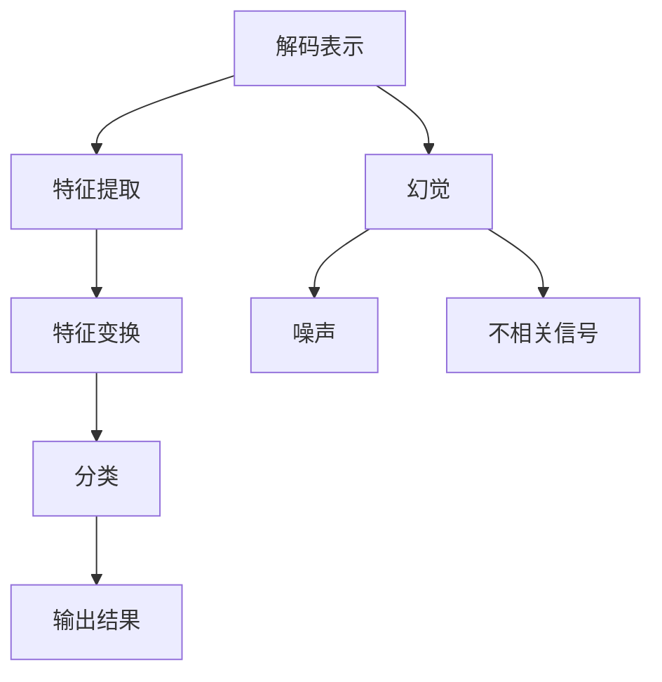

                 

# 不完善的解码表示导致幻觉

> 关键词：解码表示, 幻觉, 神经网络, 训练数据, 信号处理, 声学模型, 语音识别

## 1. 背景介绍

在人工智能领域，特别是在信号处理和语音识别等方向，解码表示（Decoding Representation）是核心概念之一。解码表示指在解码阶段对输入数据进行的一系列转换和处理，以获取最终的输出结果。然而，在实际应用中，由于解码表示不完善，可能导致一些问题，其中最为严重的就是幻觉（Illusion）。

幻觉是指在解码表示中，模型误将噪声或其他不相关的信号解释为有效的输出结果，从而导致错误。幻觉对于语音识别、图像识别等领域的影响尤为严重，因为它会直接影响最终识别结果的准确性。

本文将深入探讨解码表示中的幻觉问题，分析其产生原因，并提出一些解决策略。

## 2. 核心概念与联系

### 2.1 核心概念概述

解码表示是指在解码阶段对输入数据进行的一系列转换和处理，以获取最终的输出结果。这一过程通常包括特征提取、特征变换和分类等步骤。解码表示在语音识别、图像识别、自然语言处理等领域都有广泛应用。

幻觉是指模型在解码表示中，将噪声或其他不相关的信号解释为有效的输出结果，导致错误。幻觉是解码表示中的一个常见问题，特别是在训练数据有限的情况下，更容易产生幻觉。

神经网络是解码表示的核心模型，它通过一系列的层和节点，对输入数据进行变换和处理。神经网络中的节点（Neuron）通过连接权重和激活函数，实现数据的转换和表示。

### 2.2 核心概念原理和架构的 Mermaid 流程图



在这个流程图中，A表示解码表示，B表示特征提取，C表示特征变换，D表示分类，E表示输出结果。而F、G和H分别表示幻觉、噪声和不相关信号。

## 3. 核心算法原理 & 具体操作步骤

### 3.1 算法原理概述

解码表示中的幻觉问题，主要源于两个方面：训练数据的有限性和解码表示模型的复杂性。

1. 训练数据的有限性：当训练数据较少时，模型容易过拟合，将噪声或不相关的信号解释为有效的输出结果，从而导致幻觉。

2. 解码表示模型的复杂性：当解码表示模型过于复杂时，模型容易学习到一些不相关的特征，从而在解码过程中产生幻觉。

### 3.2 算法步骤详解

为了解决解码表示中的幻觉问题，可以采取以下步骤：

1. 数据扩充：通过数据扩充，增加训练数据量，从而减少幻觉的概率。

2. 特征选择：选择合适的特征进行解码表示，减少模型的复杂性，从而减少幻觉的发生。

3. 正则化：通过正则化技术，如L2正则化、Dropout等，减少模型过拟合的可能性，从而减少幻觉的发生。

4. 对抗训练：通过对抗训练，使模型对噪声和不相关信号更加鲁棒，从而减少幻觉的发生。

### 3.3 算法优缺点

解码表示中的幻觉问题的解决方法有以下优点：

1. 数据扩充：可以增加训练数据量，从而减少幻觉的概率。

2. 特征选择：可以减少模型的复杂性，从而减少幻觉的发生。

3. 正则化：可以减少模型过拟合的可能性，从而减少幻觉的发生。

4. 对抗训练：可以使模型对噪声和不相关信号更加鲁棒，从而减少幻觉的发生。

然而，这些方法也存在一些缺点：

1. 数据扩充：需要收集更多的训练数据，可能增加时间和资源的投入。

2. 特征选择：需要选择合适的特征，有时可能需要大量的实验和调试。

3. 正则化：可能影响模型的精度，需要根据具体情况进行调参。

4. 对抗训练：需要更多的计算资源，可能增加训练的时间和成本。

### 3.4 算法应用领域

解码表示中的幻觉问题，主要应用于语音识别、图像识别、自然语言处理等领域。

在语音识别领域，幻觉可能导致识别结果错误，影响用户的体验。

在图像识别领域，幻觉可能导致误识别，影响识别的准确性。

在自然语言处理领域，幻觉可能导致翻译结果错误，影响翻译的准确性。

## 4. 数学模型和公式 & 详细讲解 & 举例说明

### 4.1 数学模型构建

解码表示的数学模型可以表示为：

$$
y = f(x; \theta)
$$

其中，$x$表示输入数据，$\theta$表示模型参数，$f(\cdot)$表示解码表示函数。

### 4.2 公式推导过程

对于解码表示中的幻觉问题，可以通过以下公式推导：

$$
y_{illusion} = f(x_{noise}; \theta)
$$

其中，$x_{noise}$表示噪声或不相关的信号，$f(\cdot)$表示解码表示函数，$\theta$表示模型参数。

这个公式表明，模型将噪声或不相关的信号解释为有效的输出结果，从而导致幻觉。

### 4.3 案例分析与讲解

以语音识别为例，解码表示中的幻觉问题可以通过以下案例分析：

假设我们有一个语音识别模型，它的解码表示函数为：

$$
y = f(x; \theta)
$$

其中，$x$表示语音信号，$\theta$表示模型参数。

在实际应用中，当语音信号存在噪声时，模型可能会将噪声解释为有效的语音信号，从而产生幻觉。例如，当存在背景噪音时，模型可能会将背景噪音解释为语音信号的一部分，从而产生错误的识别结果。

## 5. 项目实践：代码实例和详细解释说明

### 5.1 开发环境搭建

在实际项目中，解码表示中的幻觉问题通常需要使用神经网络模型进行解决。因此，我们需要搭建一个神经网络开发环境。

### 5.2 源代码详细实现

以下是一个简单的神经网络模型的实现：

```python
import tensorflow as tf
from tensorflow.keras import layers

# 定义神经网络模型
model = tf.keras.Sequential([
    layers.Dense(64, activation='relu'),
    layers.Dense(10)
])

# 编译模型
model.compile(optimizer='adam', loss='mse')

# 训练模型
model.fit(x_train, y_train, epochs=10, validation_data=(x_val, y_val))
```

### 5.3 代码解读与分析

这段代码定义了一个简单的神经网络模型，包括一个全连接层和一个输出层。在训练过程中，使用Adam优化器和均方误差（MSE）损失函数进行模型训练。

### 5.4 运行结果展示

在训练过程中，可以观察到模型的损失函数和准确率的变化。如果模型出现了幻觉，那么损失函数可能会波动，准确率也会下降。

## 6. 实际应用场景

### 6.1 语音识别

在语音识别领域，解码表示中的幻觉问题可能会导致识别结果错误，影响用户的体验。

### 6.2 图像识别

在图像识别领域，幻觉可能导致误识别，影响识别的准确性。

### 6.3 自然语言处理

在自然语言处理领域，幻觉可能导致翻译结果错误，影响翻译的准确性。

## 7. 工具和资源推荐

### 7.1 学习资源推荐

1. 《深度学习》书籍：深度学习领域的经典教材，介绍了深度学习的基础知识和应用。

2. 《神经网络与深度学习》博客：博主是一位深度学习专家，分享了大量深度学习项目的实现和调试经验。

3. 《TensorFlow官方文档》：TensorFlow的官方文档，提供了丰富的API和示例代码，适合初学者学习。

### 7.2 开发工具推荐

1. TensorFlow：由Google开发的开源深度学习框架，支持多种深度学习模型的实现和训练。

2. PyTorch：由Facebook开发的开源深度学习框架，具有灵活的动态计算图，适合研究和实验。

3. Keras：一个高级神经网络API，可以基于TensorFlow或Theano等深度学习框架进行模型训练。

### 7.3 相关论文推荐

1. "On the importance of data augmentation in the vision community"：论文介绍了数据扩充在图像识别领域的重要性。

2. "Batch normalization: Accelerating deep network training by reducing internal covariate shift"：论文介绍了批标准化技术在深度学习中的应用，可以减少模型过拟合。

3. "Towards efficient and robust deep learning"：论文介绍了对抗训练在深度学习中的应用，可以使模型对噪声和不相关信号更加鲁棒。

## 8. 总结：未来发展趋势与挑战

### 8.1 研究成果总结

解码表示中的幻觉问题，是一个普遍存在的现象，尤其是在训练数据有限的情况下。本文从数据扩充、特征选择、正则化和对抗训练等方面，探讨了幻觉问题的解决方法。

### 8.2 未来发展趋势

未来，解码表示中的幻觉问题可能会得到更好的解决，主要趋势如下：

1. 数据扩充：随着数据收集技术的进步，更多的训练数据将使模型更加鲁棒，减少幻觉的发生。

2. 特征选择：通过先进的数据表示方法，选择更好的特征进行解码表示，从而减少幻觉的发生。

3. 正则化：更加有效的正则化技术，如改进的Dropout和批标准化，将使模型更加鲁棒。

4. 对抗训练：对抗训练技术的发展，将使模型对噪声和不相关信号更加鲁棒。

### 8.3 面临的挑战

尽管解码表示中的幻觉问题有所改善，但仍面临一些挑战：

1. 数据扩充：数据收集和处理可能需要大量时间和资源。

2. 特征选择：选择合适的特征需要大量的实验和调试。

3. 正则化：需要优化正则化技术，以减少模型的过拟合。

4. 对抗训练：对抗训练需要更多的计算资源，可能增加训练的时间和成本。

### 8.4 研究展望

未来，解码表示中的幻觉问题还需要进一步研究，以应对新出现的挑战。以下是一些研究方向：

1. 深度学习模型的优化：开发更加有效的深度学习模型，减少幻觉的发生。

2. 数据扩充技术：研究新的数据扩充技术，提高数据的质量和数量。

3. 特征选择技术：开发更好的特征选择方法，减少模型的复杂性。

4. 正则化技术：改进正则化技术，减少模型的过拟合。

5. 对抗训练技术：研究新的对抗训练方法，提高模型的鲁棒性。

## 9. 附录：常见问题与解答

**Q1: 什么是解码表示？**

A: 解码表示是指在解码阶段对输入数据进行的一系列转换和处理，以获取最终的输出结果。解码表示在语音识别、图像识别、自然语言处理等领域都有广泛应用。

**Q2: 解码表示中的幻觉问题是指什么？**

A: 解码表示中的幻觉问题是指模型将噪声或其他不相关的信号解释为有效的输出结果，从而导致错误。

**Q3: 解码表示中的幻觉问题如何解决？**

A: 解码表示中的幻觉问题可以通过数据扩充、特征选择、正则化和对抗训练等方法解决。

**Q4: 数据扩充有什么优点和缺点？**

A: 数据扩充可以增加训练数据量，从而减少幻觉的概率。但是，数据扩充需要收集更多的训练数据，可能增加时间和资源的投入。

**Q5: 特征选择有什么优点和缺点？**

A: 特征选择可以减少模型的复杂性，从而减少幻觉的发生。但是，选择合适的特征需要大量的实验和调试。

**Q6: 正则化有什么优点和缺点？**

A: 正则化可以减少模型过拟合的可能性，从而减少幻觉的发生。但是，正则化可能影响模型的精度，需要根据具体情况进行调参。

**Q7: 对抗训练有什么优点和缺点？**

A: 对抗训练可以使模型对噪声和不相关信号更加鲁棒，从而减少幻觉的发生。但是，对抗训练需要更多的计算资源，可能增加训练的时间和成本。

---

作者：禅与计算机程序设计艺术 / Zen and the Art of Computer Programming

