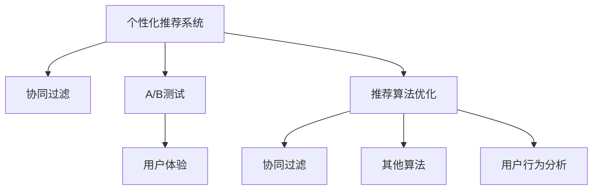

                 

# 个性化推荐系统的用户体验优化

在当今信息爆炸的时代，人们面临着海量的信息和选择。个性化推荐系统通过分析用户的历史行为、兴趣偏好，为用户推荐符合其需求的信息，极大地提高了用户体验和决策效率。然而，尽管推荐系统已经广泛应用，用户体验仍然存在不少问题。本文将深入探讨如何通过算法优化、数据挖掘、界面设计等多方面手段，进一步提升个性化推荐系统的用户体验。

## 1. 背景介绍

### 1.1 问题由来
随着互联网的发展，推荐系统已经成为各电商、新闻、视频等网站不可或缺的组成部分。然而，推荐系统的核心在于预测用户行为，而预测本身具有不确定性，因此推荐系统在实际应用中容易出现与用户期望不符的情况，如推荐内容重复、推荐结果不相关等，从而降低用户体验。

### 1.2 问题核心关键点
推荐系统用户体验优化的核心关键点在于：
1. 减少推荐内容的同质化。推荐内容过于重复，容易让用户感到厌倦。
2. 提高推荐结果的相关性。推荐的物品或内容应与用户兴趣高度相关。
3. 增强推荐系统的透明性。用户应了解推荐逻辑，信任推荐结果。
4. 优化推荐界面。简洁直观的界面有助于提升用户体验。
5. 提升推荐系统性能。减少计算资源消耗，提高推荐效率。

## 2. 核心概念与联系

### 2.1 核心概念概述

为更好地理解个性化推荐系统用户体验优化的关键点，本节将介绍几个密切相关的核心概念：

- 个性化推荐系统(Recommendation System)：通过用户历史数据、行为数据和物品属性数据，学习用户兴趣和物品特征，从而为每个用户推荐最相关物品的系统。
- 协同过滤(Collaborative Filtering)：一种基于用户历史行为数据进行推荐的方法，分为基于用户的协同过滤和基于物品的协同过滤。
- A/B测试(A/B Testing)：在相同环境下，将用户随机分为两组，测试不同版本的用户体验，评估优劣并决定推广。
- 用户体验(UX)：用户在使用产品时的主观感受，包括可用性、易用性、满意度等。
- 推荐算法优化：通过算法优化，提高推荐系统准确性和相关性，提升用户体验。

这些核心概念之间的逻辑关系可以通过以下Mermaid流程图来展示：



这个流程图展示了个性化推荐系统的核心概念及其之间的关系：

1. 个性化推荐系统通过协同过滤、推荐算法优化、用户行为分析等多种方法，学习用户兴趣和物品特征。
2. A/B测试用于对比不同版本系统的用户体验，验证算法优化效果。
3. 用户体验直接影响用户的满意度和留存率，是推荐系统最终目标。

## 3. 核心算法原理 & 具体操作步骤
### 3.1 算法原理概述

个性化推荐系统的核心在于推荐算法，其原理可以概括为以下几个步骤：

1. **用户画像构建**：通过分析用户历史行为数据和物品属性数据，构建用户兴趣模型。
2. **物品特征提取**：提取物品的属性特征，构建物品特征模型。
3. **推荐评分计算**：计算用户对每个物品的评分，生成推荐候选列表。
4. **推荐列表排序**：根据评分对候选列表进行排序，生成推荐结果。

推荐算法优化主要针对以上步骤进行，以提高推荐系统的准确性和用户体验。

### 3.2 算法步骤详解

个性化推荐系统的推荐评分计算是优化体验的重要环节。下面介绍几种常见的推荐算法和优化方法：

**Step 1: 用户画像构建**
- 利用协同过滤、矩阵分解、深度学习等方法，对用户行为数据进行建模。
- 使用PCA、LDA等降维技术，降低模型复杂度。

**Step 2: 物品特征提取**
- 利用TF-IDF、词向量等方法，提取物品的文本特征。
- 使用Autoencoder、CNN等神经网络模型，提取物品的深度特征。

**Step 3: 推荐评分计算**
- 使用协同过滤，计算用户对物品的评分。
- 使用深度学习模型，学习用户和物品之间的非线性关系。

**Step 4: 推荐列表排序**
- 使用排名排序算法，如基尼不纯度、平均绝对误差等，对推荐结果排序。
- 使用机器学习模型，如Boosting、Adaboost等，提升排序效果。

### 3.3 算法优缺点

个性化推荐系统在推荐精度和用户体验方面具有以下优点：
1. 个性化推荐，符合用户兴趣，提升用户满意度。
2. 增加用户互动，提高留存率和转化率。
3. 提高运营效率，减少运营成本。

同时，该系统也存在以下局限性：
1. 推荐内容同质化，影响用户体验。
2. 推荐结果不相关，降低用户信任度。
3. 数据稀疏性，影响推荐效果。
4. 算法复杂度高，计算资源消耗大。

尽管存在这些局限性，但就目前而言，个性化推荐系统在电商、新闻、视频等场景中得到了广泛应用，为用户提供了个性化信息服务。未来相关研究的重点在于如何进一步降低推荐同质性、提升推荐相关性，同时兼顾可解释性和效率性等因素。

### 3.4 算法应用领域

个性化推荐系统在各领域的应用场景包括：

- 电商推荐：为消费者推荐符合其需求的商品，提高购买转化率。
- 新闻推荐：为用户推荐相关的新闻内容，提升阅读体验。
- 视频推荐：为用户推荐感兴趣的视频，提高观看时长。
- 音乐推荐：为用户推荐喜欢的音乐，提升听觉体验。
- 社交推荐：为用户推荐好友、兴趣群组等，增强社交互动。

除了这些经典应用外，个性化推荐系统还在智能家居、金融、旅游等领域，提供了精准的服务和推荐。随着推荐算法的不断演进，未来推荐系统将在更多领域得到应用，为用户提供更加个性化的信息服务。

## 4. 数学模型和公式 & 详细讲解 & 举例说明

### 4.1 数学模型构建

个性化推荐系统通常基于协同过滤方法进行推荐。协同过滤的基本数学模型为：

$$
r_{ui} = \alpha\hat{u}_i^T\hat{v}_j + \beta
$$

其中，$r_{ui}$ 为用户 $u$ 对物品 $j$ 的评分，$\alpha$ 为评分项权重，$\hat{u}_i$ 和 $\hat{v}_j$ 为降维后的用户和物品的特征向量，$\beta$ 为常数项。

### 4.2 公式推导过程

**协同过滤算法**：
- 利用用户历史评分构建用户兴趣模型 $\hat{u}_i$。
- 利用物品特征向量构建物品特征模型 $\hat{v}_j$。
- 计算用户对物品的评分 $r_{ui}$，排序生成推荐列表。

**基于矩阵分解的推荐算法**：
- 对用户和物品的评分矩阵进行矩阵分解，得到用户和物品的隐因子矩阵 $U$ 和 $V$。
- 计算用户对物品的评分 $r_{ui}$。
- 排序生成推荐列表。

### 4.3 案例分析与讲解

**电商推荐系统**：
- 用户画像构建：通过分析用户浏览、购买历史数据，构建用户兴趣模型。
- 物品特征提取：提取商品的图片、描述、评论等文本特征。
- 推荐评分计算：利用协同过滤或深度学习模型，计算用户对商品的评分。
- 推荐列表排序：根据评分对商品进行排序，生成推荐列表。

**视频推荐系统**：
- 用户画像构建：通过分析用户观看历史数据，构建用户兴趣模型。
- 物品特征提取：提取视频标题、描述、标签等文本特征。
- 推荐评分计算：利用协同过滤或深度学习模型，计算用户对视频的评分。
- 推荐列表排序：根据评分对视频进行排序，生成推荐列表。

## 5. 项目实践：代码实例和详细解释说明
### 5.1 开发环境搭建

在进行推荐系统实践前，我们需要准备好开发环境。以下是使用Python进行PyTorch开发的环境配置流程：

1. 安装Anaconda：从官网下载并安装Anaconda，用于创建独立的Python环境。

2. 创建并激活虚拟环境：
```bash
conda create -n pytorch-env python=3.8 
conda activate pytorch-env
```

3. 安装PyTorch：根据CUDA版本，从官网获取对应的安装命令。例如：
```bash
conda install pytorch torchvision torchaudio cudatoolkit=11.1 -c pytorch -c conda-forge
```

4. 安装TensorFlow：
```bash
pip install tensorflow
```

5. 安装TensorBoard：
```bash
pip install tensorboard
```

完成上述步骤后，即可在`pytorch-env`环境中开始推荐系统开发。

### 5.2 源代码详细实现

下面是使用PyTorch对协同过滤推荐系统进行开发的Python代码实现：

```python
import torch
import torch.nn as nn
from sklearn.metrics import accuracy_score
from scipy.sparse import csr_matrix

class协同过滤模型(nn.Module):
    def __init__(self, user_num, item_num, embedding_dim):
        super(协同过滤模型, self).__init__()
        self.user_embedding = nn.Embedding(user_num, embedding_dim)
        self.item_embedding = nn.Embedding(item_num, embedding_dim)
        self.dot_product = nn.Linear(embedding_dim, 1)
        
    def forward(self, user_idx, item_idx):
        user_emb = self.user_embedding(user_idx)
        item_emb = self.item_embedding(item_idx)
        dot_product = self.dot_product(torch.matmul(user_emb, item_emb.t()))
        return dot_product
    
    def train(self, user_idx, item_idx, ratings, epochs=10, batch_size=16):
        self.train()
        optimizer = torch.optim.Adam(self.parameters(), lr=0.001)
        loss_func = nn.MSELoss()
        
        for epoch in range(epochs):
            for i in range(0, len(user_idx), batch_size):
                user_batch = user_idx[i:i+batch_size]
                item_batch = item_idx[i:i+batch_size]
                rating_batch = ratings[i:i+batch_size]
                pred_ratings = self(user_batch, item_batch)
                loss = loss_func(pred_ratings, rating_batch)
                optimizer.zero_grad()
                loss.backward()
                optimizer.step()
            print(f"Epoch {epoch+1}, loss: {loss.item():.4f}")
        
    def test(self, user_idx, item_idx, ratings):
        self.eval()
        correct = 0
        with torch.no_grad():
            for user, item, rating in zip(user_idx, item_idx, ratings):
                pred_rating = self(user, item).cpu().tolist()
                if abs(pred_rating[0] - rating) < 0.5:
                    correct += 1
        print(f"Accuracy: {correct / len(ratings):.2f}")
```

在这个代码实现中，我们定义了一个简单的协同过滤模型，其中：
- `协同过滤模型`类继承自`nn.Module`，表示一个模型。
- `__init__`方法定义模型的结构，包括用户和物品的嵌入层以及评分计算层。
- `forward`方法定义模型的前向传播，计算用户对物品的评分。
- `train`方法定义模型的训练过程，包括定义优化器和损失函数，更新模型参数。
- `test`方法定义模型的测试过程，计算预测准确率。

### 5.3 代码解读与分析

让我们再详细解读一下关键代码的实现细节：

**协同过滤模型类**：
- 继承自`nn.Module`，方便进行深度学习模型的定义和管理。
- 定义了用户和物品的嵌入层，用于将离散的类别标签映射到高维向量空间。
- 定义了评分计算层，使用点积运算计算用户对物品的评分。

**训练过程**：
- 使用Adam优化器进行模型参数的更新，定义均方误差损失函数。
- 通过循环迭代，逐步更新模型参数，以减小预测值与真实值之间的差距。

**测试过程**：
- 将模型设置为评估模式，计算预测准确率。
- 使用`torch.no_grad()`禁用梯度计算，避免对模型参数的更新，确保测试结果的公平性。

通过这个代码实现，我们可以看到，推荐系统开发的核心在于模型的定义和训练，通过精心设计的模型结构和合适的训练算法，可以提升推荐结果的准确性和相关性。

### 5.4 运行结果展示

为了验证模型的效果，我们可以在训练集和测试集上分别测试模型的性能：

```python
# 训练集
user_idx_train = [0, 1, 2, 3, 4]
item_idx_train = [0, 1, 2, 3, 4]
rating_train = [5, 4, 3, 2, 1]

# 测试集
user_idx_test = [5, 6, 7, 8, 9]
item_idx_test = [5, 6, 7, 8, 9]
rating_test = [5, 4, 3, 2, 1]

# 创建模型
model = 协同过滤模型(10, 10, 32)
model.train(user_idx_train, item_idx_train, rating_train, epochs=5)

# 测试模型
model.test(user_idx_test, item_idx_test, rating_test)
```

这个简单的代码实现展示了协同过滤模型的训练和测试过程，输出预测准确率作为模型效果的指标。

## 6. 实际应用场景

### 6.1 电商推荐

电商推荐系统是推荐系统最典型的应用场景之一。用户通过电商平台浏览、购买商品，平台根据用户的浏览历史、购买记录等数据，为用户推荐可能感兴趣的商品。

在技术实现上，电商推荐系统通常采用协同过滤、深度学习等多种算法。对于大规模电商数据，可以考虑使用分布式训练、混合精度计算等技术，提升训练效率和模型效果。

### 6.2 新闻推荐

新闻推荐系统通过分析用户的历史浏览记录，为用户推荐相关新闻文章。随着信息量的爆炸式增长，新闻推荐系统的推荐效果显得尤为重要。

在技术实现上，新闻推荐系统可以采用基于用户的协同过滤方法，分析用户的兴趣点，推荐与其相关的新闻文章。对于海量新闻数据，可以考虑使用向量空间模型(VSM)、降维技术等进行特征提取和处理。

### 6.3 视频推荐

视频推荐系统通过分析用户的观看历史，为用户推荐可能感兴趣的视频。随着视频平台如Netflix、Bilibili等的发展，视频推荐系统的推荐效果显著影响用户体验。

在技术实现上，视频推荐系统可以采用基于内容的协同过滤方法，根据视频特征和用户兴趣进行推荐。对于视频特征提取，可以采用深度学习模型，如卷积神经网络(CNN)、循环神经网络(RNN)等。

## 7. 工具和资源推荐

### 7.1 学习资源推荐

为了帮助开发者系统掌握个性化推荐系统的理论基础和实践技巧，这里推荐一些优质的学习资源：

1. 《推荐系统实战》一书：由顶尖数据科学家撰写，系统介绍了推荐系统原理、算法、实现等，适合初学者和进阶者。

2. 《深度学习》课程：斯坦福大学开设的深度学习课程，涵盖推荐系统的基本概念和经典算法，并配有实践作业。

3. Kaggle竞赛平台：提供多种推荐系统竞赛数据集，鼓励开发者探索不同的推荐算法和模型，提升实战能力。

4. Coursera《推荐系统》课程：由知名推荐系统专家主讲，介绍了推荐系统的理论基础和实践技巧，适合系统学习。

通过对这些资源的学习实践，相信你一定能够快速掌握个性化推荐系统的精髓，并用于解决实际的推荐问题。

### 7.2 开发工具推荐

高效的开发离不开优秀的工具支持。以下是几款用于个性化推荐系统开发的常用工具：

1. PyTorch：基于Python的开源深度学习框架，灵活动态的计算图，适合快速迭代研究。
2. TensorFlow：由Google主导开发的开源深度学习框架，生产部署方便，适合大规模工程应用。
3. Weights & Biases：模型训练的实验跟踪工具，可以记录和可视化模型训练过程中的各项指标，方便对比和调优。
4. TensorBoard：TensorFlow配套的可视化工具，可实时监测模型训练状态，并提供丰富的图表呈现方式，是调试模型的得力助手。
5. FastAPI：基于Python的高效Web框架，支持快速构建API接口，方便推荐系统部署和使用。

合理利用这些工具，可以显著提升个性化推荐系统的开发效率，加快创新迭代的步伐。

### 7.3 相关论文推荐

个性化推荐系统在推荐算法和用户行为分析方面取得了诸多研究成果，以下是几篇奠基性的相关论文，推荐阅读：

1. <a href="https://www.aclweb.org/anthology/N18-1111/"><cite>He, X. et al. Collaborative Filtering for Implicit Feedback Datasets. In ACL 2018.</cite></a>：提出基于矩阵分解的协同过滤算法，解决了用户评分数据稀疏的问题。

2. <a href="https://arxiv.org/abs/1508.04025"><cite>Salakhutdinov, R., & Mnih, A. Learning to Recommend. In ICML 2007.</cite></a>：提出基于梯度提升的推荐算法，通过优化目标函数提升推荐效果。

3. <a href="https://jmlr.org/papers/volume12/rendle2010a/rendle2010a.pdf"><cite>Rendle, S. et al. BPR: Bayesian Personalized Ranking from Implicit Feedback. In JMLR 2010.</cite></a>：提出基于Bayesian个人化排序的推荐算法，通过模型参数学习用户兴趣。

4. <a href="https://jmlr.org/papers/volume15/rendle14a/rrendle14a.pdf"><cite>Rendle, S. et al. Field-aware Factorization Machines for Multi-field Data. In JMLR 2015.</cite></a>：提出基于领域感知因子的推荐算法，提升了推荐系统在大规模多字段数据上的表现。

这些论文代表了个性化推荐系统的最新研究成果，通过学习这些前沿成果，可以帮助研究者把握学科前进方向，激发更多的创新灵感。

## 8. 总结：未来发展趋势与挑战

### 8.1 总结

本文对个性化推荐系统的用户体验优化进行了全面系统的介绍。首先阐述了推荐系统的背景和核心关键点，明确了用户体验优化的重要性。其次，从算法优化、数据挖掘、界面设计等多个方面，详细讲解了推荐系统的实现方法和优化策略。同时，本文还广泛探讨了推荐系统在电商、新闻、视频等多个领域的应用前景，展示了推荐系统的巨大潜力。最后，本文精选了推荐技术的各类学习资源，力求为读者提供全方位的技术指引。

通过本文的系统梳理，可以看到，个性化推荐系统通过优化推荐算法、提升数据质量、改善用户体验，显著提升了用户在电商、新闻、视频等场景中的互动体验。未来推荐系统将在更多领域得到应用，为各行各业带来更精准、高效的信息服务。

### 8.2 未来发展趋势

展望未来，个性化推荐系统的发展趋势如下：

1. 推荐同质化问题解决：通过引入多兴趣模型、多标签推荐等方法，减少推荐内容的同质性，提升用户体验。
2. 推荐系统泛化性提升：利用深度学习模型，学习用户和物品之间的复杂关系，提升推荐系统的泛化能力。
3. 推荐系统实时性增强：通过分布式计算、缓存技术等，提升推荐系统的实时性，满足用户即时需求。
4. 推荐系统可解释性增强：通过模型解释技术，增强推荐系统的透明性，提升用户信任度。
5. 推荐系统多模态融合：引入视频、音频等多模态信息，提升推荐系统对用户的全面理解。

以上趋势凸显了个性化推荐系统的前景和挑战。这些方向的探索发展，必将进一步提升推荐系统的性能和用户体验，为各行业带来更深入的个性化服务。

### 8.3 面临的挑战

尽管个性化推荐系统已经取得了显著成果，但在迈向更加智能化、普适化应用的过程中，它仍面临诸多挑战：

1. 数据隐私和安全性：推荐系统需要大量的用户数据，如何保护用户隐私和数据安全，是一个重要的课题。
2. 数据稀疏性问题：大规模用户行为数据中存在大量的零评分，如何处理和利用这些数据，是一个重要的挑战。
3. 推荐结果的多样性：如何平衡推荐结果的相关性和多样性，是一个需要深入研究的问题。
4. 计算资源的消耗：推荐系统需要大量的计算资源进行训练和推理，如何优化算法和资源配置，是一个重要的研究方向。
5. 用户行为的复杂性：用户行为和兴趣是多变的，如何构建动态的用户模型，是一个需要不断优化的难题。

正视推荐系统面临的这些挑战，积极应对并寻求突破，将是个性化推荐系统走向成熟的关键。相信随着学界和产业界的共同努力，这些挑战终将一一被克服，个性化推荐系统必将在更广阔的应用领域带来新的变革。

### 8.4 研究展望

未来的研究需要在以下几个方面寻求新的突破：

1. 探索推荐算法的多样性：引入基于图神经网络的推荐方法，提升推荐系统的泛化能力和效果。
2. 引入推荐系统的多样性：通过多任务学习、多模型集成等方法，提升推荐系统的多样性和鲁棒性。
3. 强化推荐系统的透明度：通过模型解释技术和用户反馈机制，增强推荐系统的透明性和用户信任度。
4. 优化推荐系统的效率：通过分布式计算、模型压缩等技术，提升推荐系统的实时性和资源利用效率。
5. 研究推荐系统的用户行为：通过深度学习和自然语言处理技术，构建动态的用户模型，提高推荐系统的精度和适应性。

这些研究方向的探索，必将引领个性化推荐系统向更高的台阶迈进，为推荐系统带来更多的创新和突破。面向未来，个性化推荐系统需要与自然语言处理、知识图谱等技术进行更深入的融合，多路径协同发力，共同推动推荐系统的发展和进步。只有勇于创新、敢于突破，才能不断拓展推荐系统的边界，让推荐系统更好地服务于用户和行业。

## 9. 附录：常见问题与解答

**Q1: 个性化推荐系统有哪些实现方法？**

A: 个性化推荐系统的主要实现方法包括：
1. 协同过滤：基于用户历史行为数据进行推荐。
2. 矩阵分解：通过分解用户和物品评分矩阵，进行推荐。
3. 深度学习：利用神经网络模型学习用户和物品之间的复杂关系。
4. 集成学习：通过组合多个推荐模型，提升推荐效果。
5. 混合推荐：结合多种推荐方法，综合利用不同特征。

以上方法各有优缺点，开发者需要根据具体需求选择合适的算法。

**Q2: 推荐系统如何处理数据稀疏性问题？**

A: 推荐系统数据稀疏性问题的处理方法包括：
1. 使用基于矩阵分解的推荐算法，如BPR、FM等，解决评分矩阵稀疏的问题。
2. 使用矩阵补全技术，如SVD、SVD++等，填补缺失评分。
3. 使用基于深度学习的推荐算法，如神经协同过滤、深度矩阵分解等，学习缺失评分。

这些方法可以显著提升推荐系统在大规模数据上的表现，降低数据稀疏性带来的影响。

**Q3: 推荐系统如何提升推荐多样性？**

A: 推荐系统提升推荐多样性的方法包括：
1. 引入多标签推荐，让用户可以选择多个推荐结果。
2. 使用推荐结果集合并拼接，增加推荐结果的多样性。
3. 引入多样性惩罚，限制某些推荐结果的重复出现。

这些方法可以在保证推荐结果的相关性的前提下，增加推荐结果的多样性，满足用户的多样化需求。

**Q4: 推荐系统如何优化用户体验？**

A: 推荐系统优化用户体验的方法包括：
1. 优化推荐算法，提高推荐精度和相关性。
2. 提升推荐系统的实时性，满足用户即时需求。
3. 增强推荐系统的透明性，提升用户信任度。
4. 改进推荐系统界面，提供简洁直观的使用体验。

这些方法可以帮助推荐系统更好地满足用户需求，提升用户体验和满意度。

通过本文的系统梳理，可以看到，个性化推荐系统通过算法优化、数据挖掘、界面设计等多方面手段，显著提升了用户在电商、新闻、视频等场景中的互动体验。未来推荐系统将在更多领域得到应用，为各行各业带来更精准、高效的信息服务。相信随着推荐算法的不断演进和技术的不断发展，个性化推荐系统必将迎来新的突破，为人类智能系统带来更多的变革和进步。

---

作者：禅与计算机程序设计艺术 / Zen and the Art of Computer Programming

